                 

# 构建高性能的流处理架构

关键词：流处理，架构设计，性能优化，实时计算，核心算法

摘要：随着大数据和实时分析技术的快速发展，流处理架构成为现代企业构建高性能数据处理系统的关键。本文将详细探讨流处理技术的核心概念、架构设计、实现方法以及最佳实践，帮助读者深入理解并构建高效可靠的流处理系统。

## 第一部分：流处理技术基础

### 第1章：流处理概述

#### 1.1 问题背景与流处理需求

在现代互联网环境中，数据生成和消费的速度越来越快，传统的批处理系统已经难以满足实时数据处理的需求。流处理技术应运而生，它能够实时处理数据流，提供低延迟的分析结果，为企业提供实时的业务洞察。

#### 1.2 流处理与批处理对比

流处理与批处理在数据处理的时效性、处理方式、系统复杂性等方面存在显著差异。批处理适合于离线数据处理，而流处理则侧重于实时数据处理。

#### 1.3 流处理的边界与外延

流处理涉及实时数据采集、实时数据存储、实时数据处理、实时数据分析和实时数据展示等环节。它的应用场景广泛，包括实时推荐、实时监控、实时金融分析等。

#### 1.4 流处理的核心概念与要素

流处理的核心概念包括数据流模型、实时计算框架、流处理引擎和流处理核心算法。这些概念构成了流处理系统的基本框架。

### 第2章：流处理核心概念

#### 2.1 数据流模型

数据流模型描述了数据在流处理系统中的流动路径，包括数据源、数据处理节点和数据消费者。

#### 2.2 实时计算框架

实时计算框架提供了流处理的计算资源和调度机制，如Apache Kafka、Apache Flink、Apache Storm等。

#### 2.3 流处理引擎

流处理引擎是流处理系统的核心，负责处理数据流，执行流处理任务。常见的流处理引擎包括Apache Flink、Apache Storm等。

#### 2.4 流处理核心算法

流处理核心算法包括数据聚合、数据排序、窗口计算等，用于处理不同的数据流任务。

### 第3章：流处理框架比较

#### 3.1 Apache Kafka

Apache Kafka是一种高吞吐量的消息队列系统，广泛用于构建流处理系统。

#### 3.2 Apache Flink

Apache Flink是一种分布式流处理框架，提供了丰富的流处理功能，支持复杂的数据处理任务。

#### 3.3 Apache Storm

Apache Storm是一种实时计算框架，具有良好的伸缩性和容错性。

#### 3.4 其他流处理框架

除了Apache Kafka、Apache Flink和Apache Storm，还有许多其他流处理框架，如Apache Spark Streaming、RabbitMQ等。

### 第4章：流处理应用场景

#### 4.1 数据实时分析

数据实时分析是流处理最典型的应用场景，如实时股票交易分析、实时搜索引擎等。

#### 4.2 实时推荐系统

实时推荐系统基于用户行为数据，提供个性化的推荐服务。

#### 4.3 实时监控告警

实时监控告警系统用于监控系统状态，及时发现并处理异常情况。

#### 4.4 其他流处理应用

流处理还可以应用于实时数据处理、物联网数据处理等领域。

## 第二部分：流处理架构设计与实现

### 第5章：流处理架构设计

#### 5.1 流处理架构设计原则

流处理架构设计应遵循可扩展性、可靠性、性能和易用性等原则。

#### 5.2 领域模型设计

领域模型设计是流处理架构设计的基础，用于描述系统中的数据实体和关系。

#### 5.3 系统架构设计

系统架构设计包括数据流架构、计算架构和存储架构等。

#### 5.4 系统接口设计

系统接口设计定义了系统内部模块之间的交互接口，确保系统的可扩展性和可维护性。

### 第6章：流处理系统实现

#### 6.1 流处理环境搭建

流处理环境搭建包括安装流处理框架、配置计算资源和网络环境等。

#### 6.2 数据源集成

数据源集成是将数据从不同的数据源导入到流处理系统中的过程。

#### 6.3 数据处理与转换

数据处理与转换是流处理系统的核心任务，包括数据清洗、数据聚合、数据转换等。

#### 6.4 数据存储与查询

数据存储与查询是将处理后的数据存储到数据库中，并支持高效的查询操作。

### 第7章：流处理性能优化

#### 7.1 系统性能分析

系统性能分析是流处理性能优化的重要环节，包括系统吞吐量、延迟和资源利用率等。

#### 7.2 优化策略与工具

优化策略与工具包括调优参数、调优工具和性能测试等。

#### 7.3 性能调优实践

性能调优实践包括具体的调优案例和实践经验。

#### 7.4 性能评估与监控

性能评估与监控是确保系统性能稳定的重要手段，包括性能评估指标和监控工具。

## 第三部分：流处理架构实战案例

### 第8章：实时推荐系统构建

#### 8.1 项目背景与需求

#### 8.2 系统设计

#### 8.3 核心实现

#### 8.4 案例分析

### 第9章：实时监控与告警系统

#### 9.1 项目介绍

#### 9.2 系统功能设计

#### 9.3 系统架构设计

#### 9.4 系统实现与部署

### 第10章：流处理架构最佳实践

#### 10.1 架构优化策略

#### 10.2 性能调优技巧

#### 10.3 安全性与可靠性保障

#### 10.4 拓展阅读

## 附录

### 附录A：常用流处理框架API参考

### 附录B：数学模型与公式

### 附录C：项目代码与数据集

### 附录D：拓展阅读推荐

---

### 第1章：流处理概述

#### 1.1 问题背景与流处理需求

随着互联网的快速发展，数据的生成和消费速度不断加快。传统的批处理系统由于其离线处理特性，已经难以满足现代企业对于实时数据处理的需求。流处理技术应运而生，它能够实时处理数据流，提供低延迟的分析结果，为企业提供实时的业务洞察。

流处理技术的主要需求包括以下几个方面：

1. **实时性**：流处理系统需要能够实时获取和处理数据，以满足实时业务需求。
2. **低延迟**：流处理系统需要能够以较低的时间延迟处理数据，保证实时性。
3. **可扩展性**：流处理系统需要能够水平扩展，以处理更大的数据量。
4. **可靠性**：流处理系统需要保证数据的准确性和一致性。

#### 1.2 流处理与批处理对比

流处理与批处理在数据处理方式、系统复杂性、处理时间等方面存在显著差异。

1. **数据处理方式**：
   - **批处理**：将一段时间内的数据汇总起来，进行一次性处理。
   - **流处理**：实时处理数据流，对每条数据进行分析和处理。

2. **系统复杂性**：
   - **批处理**：系统相对简单，主要关注数据存储和离线计算。
   - **流处理**：系统更加复杂，需要考虑数据采集、实时处理、存储和实时分析等环节。

3. **处理时间**：
   - **批处理**：处理时间较长，通常以天或小时为单位。
   - **流处理**：处理时间较短，通常以秒或毫秒为单位。

#### 1.3 流处理的边界与外延

流处理的边界涉及数据流的生命周期，包括数据采集、传输、处理、存储和消费等环节。流处理的外延包括实时数据处理、实时分析、实时监控、实时推荐等领域。

1. **数据采集**：实时采集来自不同数据源的数据，如数据库、消息队列、日志文件等。
2. **数据传输**：通过数据传输层将数据从数据源传输到流处理系统，如Kafka、RabbitMQ等。
3. **数据处理**：对数据进行清洗、转换、聚合等操作，以满足实时业务需求。
4. **数据存储**：将处理后的数据存储到数据库或其他存储系统，以支持后续查询和分析。
5. **数据消费**：实时消费处理后的数据，提供实时的业务洞察。

#### 1.4 流处理的核心概念与要素

流处理的核心概念包括数据流模型、实时计算框架、流处理引擎和流处理核心算法。

1. **数据流模型**：描述数据在流处理系统中的流动路径，包括数据源、数据处理节点和数据消费者。
2. **实时计算框架**：提供流处理的计算资源和调度机制，如Kafka、Flink、Storm等。
3. **流处理引擎**：负责处理数据流，执行流处理任务，如Flink、Spark Streaming等。
4. **流处理核心算法**：包括数据聚合、数据排序、窗口计算等，用于处理不同的数据流任务。

### 第2章：流处理核心概念

#### 2.1 数据流模型

数据流模型描述了数据在流处理系统中的流动路径，包括数据源、数据处理节点和数据消费者。

1. **数据源**：数据的来源，可以是数据库、消息队列、日志文件等。
2. **数据处理节点**：对数据进行处理和转换的节点，可以是计算节点、存储节点等。
3. **数据消费者**：消费处理后的数据的实体，可以是应用程序、用户等。

数据流模型可以用如下ER实体关系图表示：

```mermaid
erDiagram
    Data_Source ||--|{ Data_Process_Node }|>
    Data_Process_Node ||--|{ Data_Consumer }|>

    Data_Source ||--|{ Data_Process_Node }|>
    Data_Process_Node ||--|{ Data_Consumer }|>

    Data_Process_Node ||--|{ Data_Process_Node }|>
```

#### 2.2 实时计算框架

实时计算框架提供了流处理的计算资源和调度机制，常见的实时计算框架包括Kafka、Flink、Storm等。

1. **Kafka**：一种高吞吐量的消息队列系统，用于数据的实时传输和存储。
2. **Flink**：一种分布式流处理框架，提供了丰富的流处理功能，支持复杂的数据处理任务。
3. **Storm**：一种实时计算框架，具有良好的伸缩性和容错性。

实时计算框架的架构通常包括数据源、消息队列、计算节点和存储节点等。

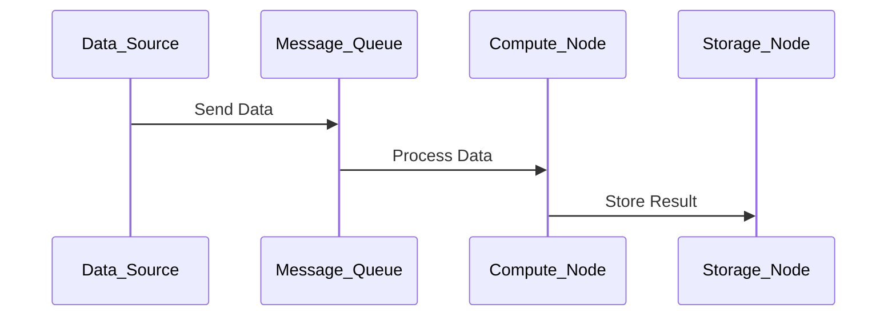

#### 2.3 流处理引擎

流处理引擎是流处理系统的核心，负责处理数据流，执行流处理任务。常见的流处理引擎包括Flink、Spark Streaming等。

1. **Flink**：Flink是一种分布式流处理框架，提供了丰富的流处理功能，包括数据聚合、数据排序、窗口计算等。
2. **Spark Streaming**：Spark Streaming是Spark的一个扩展，用于实时数据处理。

流处理引擎的架构通常包括计算节点、存储节点和调度器等。

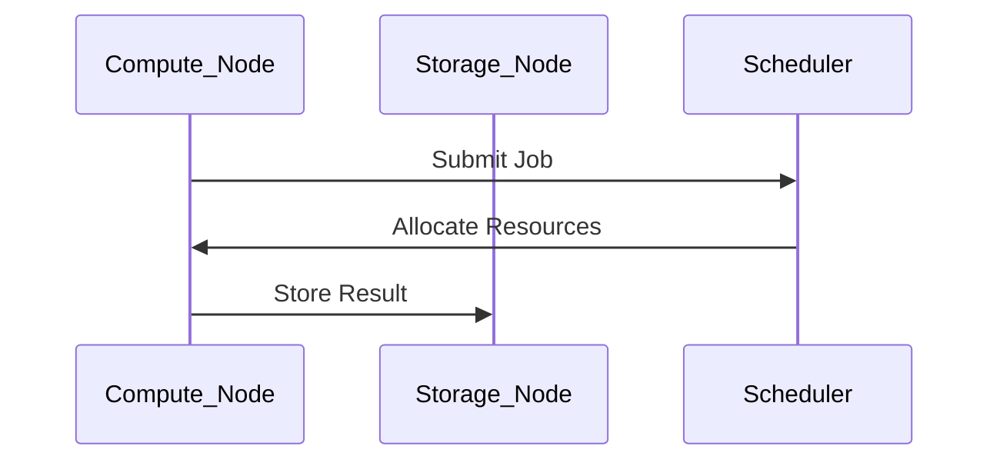

#### 2.4 流处理核心算法

流处理核心算法包括数据聚合、数据排序、窗口计算等，用于处理不同的数据流任务。

1. **数据聚合**：对数据进行汇总和计算，如求和、求平均值等。
2. **数据排序**：对数据进行排序，如升序、降序等。
3. **窗口计算**：对数据流进行分段处理，如时间窗口、滑动窗口等。

以下是数据聚合算法的mermaid流程图：

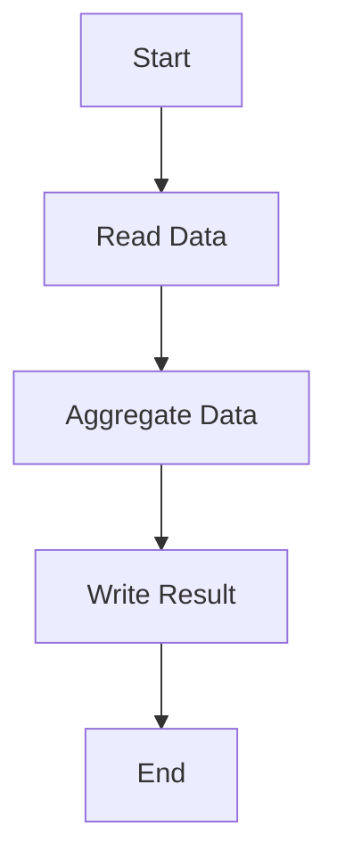

假设我们使用Python实现数据聚合算法，如下所示：

```python
def aggregate_data(data_stream):
    total = 0
    for data in data_stream:
        total += data
    return total
```

数据聚合算法的数学模型可以表示为：

$$
\text{total} = \sum_{i=1}^{n} \text{data}_i
$$

其中，$n$ 表示数据流的长度，$\text{data}_i$ 表示数据流中的第 $i$ 个数据。

### 第3章：流处理框架比较

#### 3.1 Apache Kafka

Apache Kafka是一种高吞吐量的消息队列系统，广泛用于构建流处理系统。它具有以下特点：

1. **高吞吐量**：Kafka能够处理大规模的数据流，支持高吞吐量的数据传输。
2. **可扩展性**：Kafka支持水平扩展，可以轻松地增加计算节点，以处理更大的数据量。
3. **持久化**：Kafka将数据持久化到磁盘，确保数据的安全性和可靠性。
4. **高可用性**：Kafka具有自动故障转移机制，确保系统的可用性。

Kafka的架构包括生产者、消费者、主题和分区等。

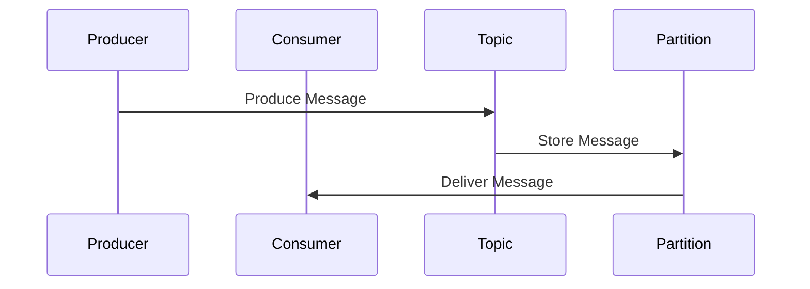

#### 3.2 Apache Flink

Apache Flink是一种分布式流处理框架，提供了丰富的流处理功能。它具有以下特点：

1. **实时处理**：Flink支持实时数据处理，能够以毫秒级延迟处理数据流。
2. **弹性伸缩**：Flink支持水平扩展，可以动态地调整计算资源，以应对不同的负载。
3. **状态管理**：Flink支持状态管理，能够保存和恢复流处理任务的状态，确保数据的完整性和一致性。
4. **容错性**：Flink具有高容错性，能够在发生故障时自动恢复，确保系统的可靠性。

Flink的架构包括数据流、计算节点、存储节点和调度器等。

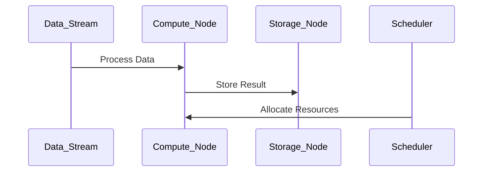

#### 3.3 Apache Storm

Apache Storm是一种实时计算框架，具有良好的伸缩性和容错性。它具有以下特点：

1. **实时处理**：Storm支持实时数据处理，能够以毫秒级延迟处理数据流。
2. **可扩展性**：Storm支持水平扩展，可以动态地增加计算节点，以处理更大的数据量。
3. **容错性**：Storm具有高容错性，能够在发生故障时自动恢复，确保系统的可靠性。
4. **易用性**：Storm提供了简单的API和丰富的库，使得开发人员可以轻松地构建和部署实时应用程序。

Storm的架构包括拓扑、Spout、Bolt和消息队列等。

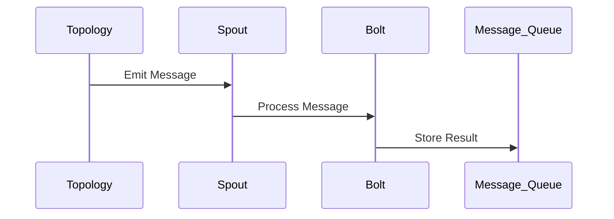

#### 3.4 其他流处理框架

除了Apache Kafka、Apache Flink和Apache Storm，还有许多其他流处理框架，如Apache Spark Streaming、RabbitMQ等。这些框架各有特点，适用于不同的场景和需求。

1. **Apache Spark Streaming**：Spark Streaming是Spark的一个扩展，用于实时数据处理。它具有高吞吐量和低延迟的特点。
2. **RabbitMQ**：RabbitMQ是一种消息队列系统，可以用于流处理。它具有高可靠性和可扩展性的特点。

### 第4章：流处理应用场景

#### 4.1 数据实时分析

数据实时分析是流处理最典型的应用场景之一。它通过实时处理和分析数据流，提供实时的业务洞察和决策支持。数据实时分析的应用场景包括：

1. **实时股票交易分析**：实时分析股票市场数据，提供投资建议和风险预警。
2. **实时搜索引擎**：实时分析用户搜索数据，提供个性化的搜索结果和推荐。
3. **实时广告投放**：实时分析用户行为数据，优化广告投放策略和效果评估。

#### 4.2 实时推荐系统

实时推荐系统基于用户行为数据，提供个性化的推荐服务。实时推荐系统的核心在于实时分析用户行为，并基于分析结果进行推荐。实时推荐系统的应用场景包括：

1. **电商平台**：实时推荐商品，提高用户购买转化率和满意度。
2. **社交媒体**：实时推荐用户感兴趣的内容，增加用户活跃度和留存率。
3. **音乐和视频平台**：实时推荐音乐和视频，提高用户的使用体验和满意度。

#### 4.3 实时监控告警

实时监控告警系统用于监控系统状态，及时发现并处理异常情况。实时监控告警系统的核心在于实时收集和分析监控数据，并基于分析结果进行告警。实时监控告警系统的应用场景包括：

1. **IT系统**：实时监控服务器、网络设备和应用系统的运行状态，及时发现和解决故障。
2. **工业生产**：实时监控生产设备的状态，及时发现和解决生产过程中的异常情况。
3. **网络安全**：实时监控网络流量和日志数据，及时发现和防范网络攻击和安全漏洞。

#### 4.4 其他流处理应用

除了上述应用场景，流处理还可以应用于实时数据处理、物联网数据处理等领域。实时数据处理应用包括实时日志处理、实时数据聚合和分析等；物联网数据处理应用包括实时传感器数据收集和处理、实时设备监控和管理等。

### 第5章：流处理架构设计

#### 5.1 流处理架构设计原则

流处理架构设计应遵循以下原则，以确保系统的性能、可靠性和可维护性：

1. **可扩展性**：流处理架构应具备良好的可扩展性，能够根据业务需求动态调整计算资源。
2. **可靠性**：流处理架构应具备高可靠性，确保数据的一致性和系统的稳定性。
3. **高性能**：流处理架构应具备高性能，能够以较低的延迟处理大规模数据流。
4. **易维护性**：流处理架构应具备良好的可维护性，便于故障排查和系统升级。

#### 5.2 领域模型设计

领域模型设计是流处理架构设计的基础，用于描述系统中的数据实体和关系。领域模型设计应包括以下内容：

1. **实体定义**：明确系统中的数据实体，如用户、商品、交易等。
2. **关系定义**：描述实体之间的关系，如用户购买商品、商品包含属性等。
3. **属性定义**：为实体定义属性，如用户ID、商品名称、交易金额等。

以下是流处理系统的领域模型示例：

```mermaid
classDiagram
    User <|-- Transaction
    User {ID, Name, Age}
    Transaction {ID, Amount, Time}
```

#### 5.3 系统架构设计

系统架构设计是流处理架构设计的关键环节，用于定义系统的组件、组件之间的交互方式和数据流。系统架构设计应包括以下内容：

1. **组件定义**：明确系统中的组件，如数据源、消息队列、流处理引擎、存储系统等。
2. **交互方式**：定义组件之间的交互方式，如消息传递、数据同步等。
3. **数据流**：定义数据在系统中的流动路径，如数据采集、处理、存储和消费等。

以下是流处理系统的系统架构示例：

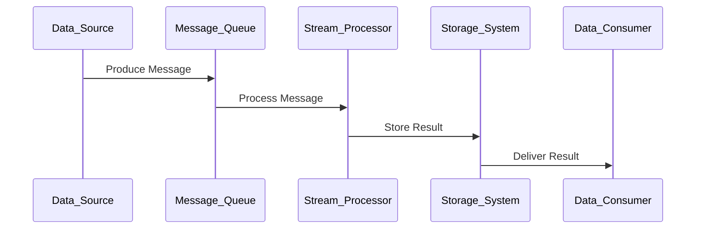

#### 5.4 系统接口设计

系统接口设计是系统架构设计的一部分，用于定义系统内部模块之间的交互接口。系统接口设计应包括以下内容：

1. **API设计**：定义系统的API，包括数据接口、功能接口等。
2. **数据格式**：定义系统内部数据交换的格式，如JSON、XML等。
3. **通信协议**：定义系统内部通信的协议，如HTTP、TCP等。

以下是流处理系统的接口设计示例：

```mermaid
classDiagram
    Stream_Processor -> Data_Source: Produce Data
    Stream_Processor -> Message_Queue: Produce Message
    Stream_Processor -> Storage_System: Store Data
    Stream_Processor -> Data_Consumer: Deliver Data
```

### 第6章：流处理系统实现

#### 6.1 流处理环境搭建

流处理环境搭建是构建流处理系统的基础步骤，包括安装和配置流处理框架、计算资源和存储系统等。以下是流处理环境搭建的步骤：

1. **安装Java环境**：由于许多流处理框架是基于Java编写的，首先需要安装Java环境。
2. **安装流处理框架**：根据需求选择合适的流处理框架，如Flink、Spark Streaming等，并安装到服务器上。
3. **配置计算资源**：配置计算节点，如CPU、内存、存储等资源，以满足流处理任务的需求。
4. **配置存储系统**：配置存储系统，如HDFS、HBase等，用于存储和处理数据。

以下是安装和配置Flink的示例步骤：

```shell
# 安装Java环境
sudo apt-get install openjdk-8-jdk

# 下载Flink安装包
wget https://www-eu.apache.org/dist/flink/flink-1.11.2/flink-1.11.2-bin-scala_2.11.tgz

# 解压安装包
tar xzf flink-1.11.2-bin-scala_2.11.tgz

# 配置Flink环境变量
export FLINK_HOME=/path/to/flink-1.11.2
export PATH=$PATH:$FLINK_HOME/bin

# 启动Flink集群
start-cluster.sh
```

#### 6.2 数据源集成

数据源集成是将数据从不同的数据源导入到流处理系统中的过程。数据源可以是数据库、消息队列、日志文件等。以下是数据源集成的步骤：

1. **确定数据源**：根据需求选择合适的数据源，如MySQL、Kafka等。
2. **连接数据源**：配置流处理框架，使其能够连接到数据源。
3. **数据读取**：从数据源中读取数据，并将其转换为流处理框架支持的数据格式。
4. **数据预处理**：对数据进行清洗、转换和聚合等操作，以满足流处理任务的需求。

以下是使用Flink连接Kafka读取数据的示例步骤：

```python
from pyflink.datastream import StreamExecutionEnvironment
from pyflink.table import StreamTableEnvironment

# 创建流执行环境
env = StreamExecutionEnvironment.get_execution_environment()

# 创建表执行环境
t_env = StreamTableEnvironment.create(env)

# 连接Kafka数据源
t_env.connect(Kafka().version('0.11').topic('test-topic').get_connect_info()) \
    .with_format_formatter('json') \
    .with_schema(JsonSchema()) \
    .create_temporary_table('test_source')

# 注册表
t_env.register_table_source('test_source', 'test_source')

# 定义数据处理逻辑
t_env.sql_update_sql(
    'update test_source as source ' \
    'inner join test_target as target ' \
    'on source.id = target.id ' \
    'set target.name = source.name'
)

# 提交作业
t_env.execute('test_job')
```

#### 6.3 数据处理与转换

数据处理与转换是流处理系统的核心任务，包括数据清洗、数据转换、数据聚合等操作。数据处理与转换的步骤如下：

1. **数据清洗**：去除数据中的噪声和错误，确保数据的准确性和一致性。
2. **数据转换**：将数据从一种格式转换为另一种格式，如将CSV文件转换为JSON格式。
3. **数据聚合**：对数据进行汇总和计算，如求和、求平均值等。
4. **数据存储**：将处理后的数据存储到数据库或其他存储系统，以支持后续查询和分析。

以下是使用Flink进行数据处理与转换的示例步骤：

```python
from pyflink.datastream import StreamExecutionEnvironment
from pyflink.table import StreamTableEnvironment

# 创建流执行环境
env = StreamExecutionEnvironment.get_execution_environment()

# 创建表执行环境
t_env = StreamTableEnvironment.create(env)

# 注册表
t_env.register_table_source('test_source', 'test_source')

# 定义数据处理逻辑
t_env.sql_update_sql(
    'update test_source as source ' \
    'inner join test_target as target ' \
    'on source.id = target.id ' \
    'set target.name = source.name, ' \
    'target.total = source.total + target.total'
)

# 提交作业
t_env.execute('test_job')
```

#### 6.4 数据存储与查询

数据存储与查询是将处理后的数据存储到数据库或其他存储系统，并支持高效的查询操作。数据存储与查询的步骤如下：

1. **数据存储**：将处理后的数据存储到数据库或其他存储系统，如HDFS、HBase等。
2. **数据查询**：编写查询语句，从数据库或其他存储系统中查询数据。
3. **性能优化**：对查询语句进行优化，提高查询性能。

以下是使用Flink进行数据存储与查询的示例步骤：

```python
from pyflink.datastream import StreamExecutionEnvironment
from pyflink.table import StreamTableEnvironment

# 创建流执行环境
env = StreamExecutionEnvironment.get_execution_environment()

# 创建表执行环境
t_env = StreamTableEnvironment.create(env)

# 注册表
t_env.register_table_source('test_source', 'test_source')

# 定义数据处理逻辑
t_env.sql_update_sql(
    'update test_source as source ' \
    'inner join test_target as target ' \
    'on source.id = target.id ' \
    'set target.name = source.name, ' \
    'target.total = source.total + target.total'
)

# 将处理后的数据存储到数据库
t_env.register_table_sink('test_target', 'test_target')

# 提交作业
t_env.execute('test_job')

# 编写查询语句
query = """
select * from test_target where total > 1000
"""

# 执行查询
t_env.sql_query(query).print()
```

### 第7章：流处理性能优化

#### 7.1 系统性能分析

系统性能分析是流处理性能优化的重要环节，包括系统吞吐量、延迟和资源利用率等。以下是对流处理系统性能分析的方法：

1. **吞吐量分析**：测量系统在单位时间内处理的数据量，以评估系统的处理能力。
2. **延迟分析**：测量系统从数据接收开始到数据处理完成的时间，以评估系统的延迟性能。
3. **资源利用率分析**：测量系统资源的利用率，如CPU、内存、网络等，以评估系统资源的利用效率。

以下是使用Flink进行性能分析的方法：

```python
from pyflink.datastream import StreamExecutionEnvironment
from pyflink.table import StreamTableEnvironment

# 创建流执行环境
env = StreamExecutionEnvironment.get_execution_environment()

# 创建表执行环境
t_env = StreamTableEnvironment.create(env)

# 注册表
t_env.register_table_source('test_source', 'test_source')

# 定义数据处理逻辑
t_env.sql_update_sql(
    'update test_source as source ' \
    'inner join test_target as target ' \
    'on source.id = target.id ' \
    'set target.name = source.name, ' \
    'target.total = source.total + target.total'
)

# 注册表
t_env.register_table_sink('test_target', 'test_target')

# 提交作业
t_env.execute('test_job')

# 获取系统性能指标
performance_metrics = env.get_metric_system().get_all_metrics()
for metric in performance_metrics:
    print(metric.name, metric.value)
```

#### 7.2 优化策略与工具

优化策略与工具是提升流处理系统性能的重要手段，包括调优参数、调优工具和性能测试等。以下是一些常见的优化策略和工具：

1. **调优参数**：调整流处理框架的参数，如任务并发数、内存配置、缓冲区大小等，以提升系统的性能。
2. **调优工具**：使用性能调优工具，如JProfiler、VisualVM等，分析系统性能瓶颈，进行针对性优化。
3. **性能测试**：使用性能测试工具，如Apache JMeter、LoadRunner等，模拟高负载场景，评估系统性能。

以下是使用Flink进行性能调优的方法：

```python
from pyflink.datastream import StreamExecutionEnvironment
from pyflink.table import StreamTableEnvironment

# 创建流执行环境
env = StreamExecutionEnvironment.get_execution_environment()

# 设置任务并发数
env.set_parallelism(10)

# 创建表执行环境
t_env = StreamTableEnvironment.create(env)

# 注册表
t_env.register_table_source('test_source', 'test_source')

# 定义数据处理逻辑
t_env.sql_update_sql(
    'update test_source as source ' \
    'inner join test_target as target ' \
    'on source.id = target.id ' \
    'set target.name = source.name, ' \
    'target.total = source.total + target.total'
)

# 注册表
t_env.register_table_sink('test_target', 'test_target')

# 提交作业
t_env.execute('test_job')

# 使用调优工具进行分析
# ...

# 根据分析结果调整参数
# ...
```

#### 7.3 性能调优实践

性能调优实践是通过实际操作和测试，找到系统性能瓶颈并进行优化。以下是一些性能调优的实践方法：

1. **识别瓶颈**：使用性能分析工具，识别系统的性能瓶颈，如CPU瓶颈、内存瓶颈、网络瓶颈等。
2. **定位问题**：根据识别的瓶颈，定位具体的问题模块或函数。
3. **优化代码**：针对定位到的问题，优化代码，如减少复杂度、减少内存占用、优化数据结构等。
4. **调参优化**：调整流处理框架的参数，如任务并发数、内存配置、缓冲区大小等，以提升系统的性能。

以下是使用Flink进行性能调优的实践方法：

```python
from pyflink.datastream import StreamExecutionEnvironment
from pyflink.table import StreamTableEnvironment

# 创建流执行环境
env = StreamExecutionEnvironment.get_execution_environment()

# 设置任务并发数
env.set_parallelism(10)

# 创建表执行环境
t_env = StreamTableEnvironment.create(env)

# 注册表
t_env.register_table_source('test_source', 'test_source')

# 定义数据处理逻辑
t_env.sql_update_sql(
    'update test_source as source ' \
    'inner join test_target as target ' \
    'on source.id = target.id ' \
    'set target.name = source.name, ' \
    'target.total = source.total + target.total'
)

# 注册表
t_env.register_table_sink('test_target', 'test_target')

# 提交作业
t_env.execute('test_job')

# 使用性能分析工具进行分析
# ...

# 根据分析结果调整参数
# ...
```

#### 7.4 性能评估与监控

性能评估与监控是确保系统性能稳定的重要手段，包括性能评估指标和监控工具。以下是一些常见的性能评估指标和监控工具：

1. **性能评估指标**：包括吞吐量、延迟、资源利用率等，用于评估系统的性能。
2. **监控工具**：包括Prometheus、Grafana、Zabbix等，用于监控系统性能和状态。

以下是使用Prometheus和Grafana进行性能监控的方法：

```shell
# 安装Prometheus
sudo apt-get install prometheus

# 配置Prometheus监控Flink集群
cat << EOF > /etc/prometheus/prometheus.yml
scrape_configs:
  - job_name: 'flink-cluster'
    static_configs:
      - targets: ['localhost:8081']
EOF

# 启动Prometheus
sudo systemctl start prometheus

# 安装Grafana
sudo apt-get install grafana

# 配置Grafana监控Flink集群
sudo cp /path/to/flink-prometheus-exporter/prometheus-exporter.conf /etc/prometheus/
sudo systemctl restart prometheus

# 登录Grafana，添加Flink监控数据源，并创建监控仪表板
# ...
```

### 第8章：实时推荐系统构建

#### 8.1 项目背景与需求

实时推荐系统是一种基于用户行为数据和实时计算技术的系统，用于为用户推荐个性化的商品、内容或服务。项目背景如下：

1. **业务需求**：电商平台需要为用户实时推荐相关的商品，提高用户的购买转化率和满意度。
2. **技术需求**：需要构建一个高性能、可扩展的实时推荐系统，能够实时处理海量用户行为数据，提供个性化的推荐结果。

#### 8.2 系统设计

实时推荐系统的系统设计包括数据流设计、计算架构设计和存储设计等。

1. **数据流设计**：数据流设计包括数据采集、数据存储、数据处理和数据消费等环节。
2. **计算架构设计**：计算架构设计包括流处理引擎、计算节点和调度器等。
3. **存储设计**：存储设计包括数据存储系统和查询系统等。

以下是实时推荐系统的系统设计示例：

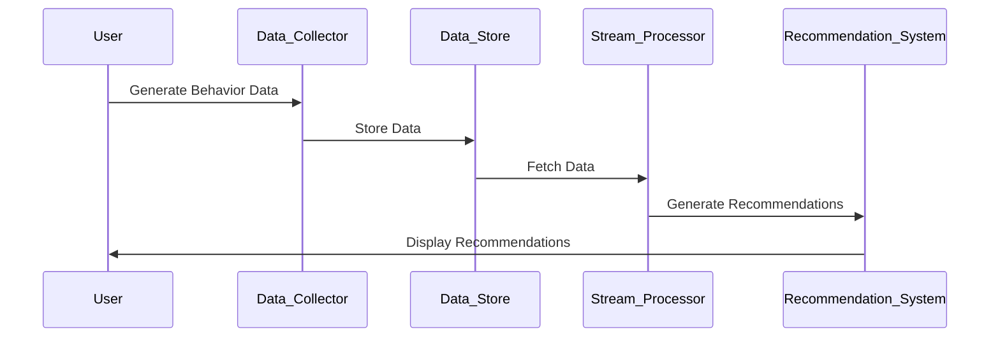

#### 8.3 核心实现

实时推荐系统的核心实现包括数据采集、数据处理、推荐算法和用户界面等。

1. **数据采集**：使用日志采集工具，如Logstash，收集用户行为数据。
2. **数据处理**：使用流处理框架，如Flink，对用户行为数据进行实时处理和清洗。
3. **推荐算法**：使用协同过滤、矩阵分解等算法，生成个性化的推荐结果。
4. **用户界面**：使用前端框架，如React，实现用户界面的展示。

以下是实时推荐系统的核心实现示例：

```python
from pyflink.datastream import StreamExecutionEnvironment
from pyflink.table import StreamTableEnvironment

# 创建流执行环境
env = StreamExecutionEnvironment.get_execution_environment()

# 创建表执行环境
t_env = StreamTableEnvironment.create(env)

# 注册表
t_env.register_table_source('user_behavior', 'user_behavior')

# 定义数据处理逻辑
t_env.sql_update_sql(
    'update user_behavior as behavior ' \
    'inner join user_profile as profile ' \
    'on behavior.user_id = profile.user_id ' \
    'set behavior.item_id = profile.item_id, ' \
    'behavior.rating = profile.rating'
)

# 注册表
t_env.register_table_sink('user_behavior_processed', 'user_behavior_processed')

# 提交作业
t_env.execute('user_behavior_processor')

# 推荐算法实现
# ...

# 用户界面实现
# ...
```

#### 8.4 案例分析

以下是一个实时推荐系统的案例分析：

1. **需求分析**：电商平台需要为用户实时推荐相关的商品。
2. **数据采集**：使用日志采集工具，如Logstash，收集用户浏览、点击、购买等行为数据。
3. **数据处理**：使用Flink进行实时数据处理，清洗和转换用户行为数据。
4. **推荐算法**：使用协同过滤算法，基于用户的历史行为数据，生成个性化的推荐结果。
5. **用户界面**：使用React实现用户界面的展示，将推荐结果展示给用户。

通过这个案例分析，我们可以看到实时推荐系统的构建过程，包括需求分析、数据采集、数据处理、推荐算法和用户界面等步骤。实时推荐系统不仅可以提高用户的购买转化率和满意度，还可以为电商平台提供实时的业务洞察。

### 第9章：实时监控与告警系统

#### 9.1 项目介绍

实时监控与告警系统是一种用于监控系统状态、及时发现和处理异常情况的系统。项目介绍包括以下内容：

1. **项目背景**：随着企业规模的扩大和系统复杂度的增加，实时监控与告警系统成为保障系统稳定运行的重要手段。
2. **项目目标**：构建一个高性能、可扩展、易用的实时监控与告警系统，提高系统的可靠性和安全性。
3. **项目需求**：实时监控系统的各项性能指标，如CPU利用率、内存占用、磁盘空间、网络流量等；及时发送告警通知，包括邮件、短信、电话等。

#### 9.2 系统功能设计

实时监控与告警系统的功能设计包括监控指标配置、数据采集、数据处理、告警规则配置、告警通知等。

1. **监控指标配置**：定义监控系统的各项指标，如CPU利用率、内存占用、磁盘空间、网络流量等。
2. **数据采集**：从系统各个组件中采集监控数据，如操作系统、数据库、Web服务器等。
3. **数据处理**：对采集到的监控数据进行处理和存储，以便后续分析和告警。
4. **告警规则配置**：定义告警规则，如CPU利用率超过80%、内存占用超过90%等，触发告警通知。
5. **告警通知**：发送告警通知，包括邮件、短信、电话等，通知相关人员处理异常情况。

以下是实时监控与告警系统的系统功能设计示例：

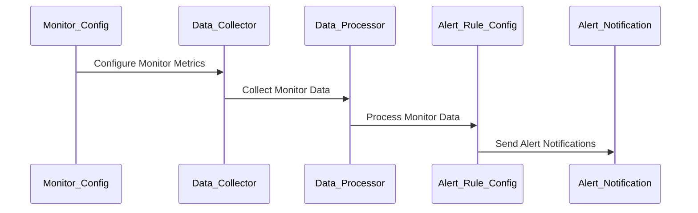

#### 9.3 系统架构设计

实时监控与告警系统的系统架构设计包括数据采集层、数据处理层、告警规则层和告警通知层等。

1. **数据采集层**：从系统各个组件中采集监控数据，如操作系统、数据库、Web服务器等。
2. **数据处理层**：对采集到的监控数据进行处理和存储，以便后续分析和告警。
3. **告警规则层**：定义告警规则，如CPU利用率超过80%、内存占用超过90%等，触发告警通知。
4. **告警通知层**：发送告警通知，包括邮件、短信、电话等，通知相关人员处理异常情况。

以下是实时监控与告警系统的系统架构设计示例：

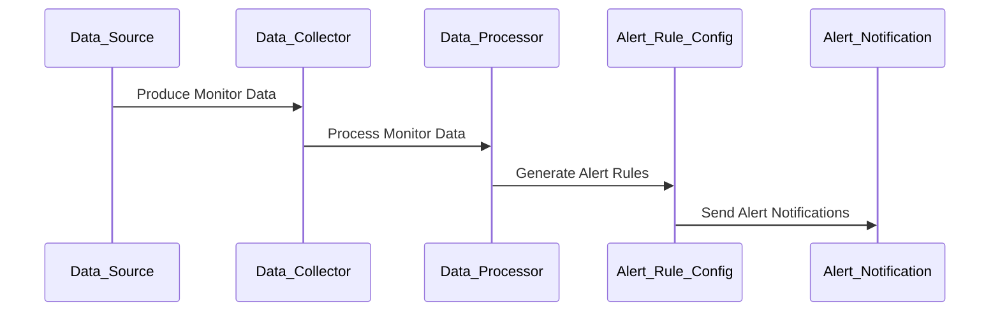

#### 9.4 系统实现与部署

实时监控与告警系统的系统实现与部署包括环境搭建、组件安装、配置和部署等。

1. **环境搭建**：搭建实时监控与告警系统的环境，包括操作系统、数据库、Web服务器等。
2. **组件安装**：安装实时监控与告警系统的各个组件，如Zabbix、Nagios等。
3. **配置**：配置系统的各项参数，如监控指标、告警规则、告警通知等。
4. **部署**：部署实时监控与告警系统，包括安装、配置和启动各个组件。

以下是实时监控与告警系统的实现与部署示例：

```shell
# 安装Zabbix
sudo apt-get install zabbix-server zabbix-agent

# 配置Zabbix
sudo vi /etc/zabbix/zabbix_server.conf

# 启动Zabbix服务
sudo systemctl start zabbix-server

# 部署Zabbix前端
sudo apt-get install zabbix-web

# 启动Zabbix前端
sudo systemctl start zabbix-web

# 访问Zabbix前端
http://localhost/zabbix
```

### 第10章：流处理架构最佳实践

#### 10.1 架构优化策略

流处理架构的优化策略是提升系统性能、可靠性和可维护性的重要手段。以下是一些常见的架构优化策略：

1. **水平扩展**：通过增加计算节点，提高系统的处理能力和吞吐量。
2. **负载均衡**：合理分配计算任务，避免单点过载，提高系统的整体性能。
3. **数据分片**：将大规模数据集拆分为较小的数据分片，提高数据的处理速度。
4. **缓存策略**：使用缓存技术，减少数据的访问延迟，提高系统的响应速度。
5. **实时监控与告警**：实时监控系统性能，及时发现和处理异常情况，确保系统的稳定性。

#### 10.2 性能调优技巧

性能调优技巧是提升流处理系统性能的关键。以下是一些常见的性能调优技巧：

1. **调整并发度**：合理设置任务并发度，避免资源浪费和性能瓶颈。
2. **优化数据结构**：选择适合的数据结构和算法，提高数据处理的速度。
3. **减少数据复制**：避免无谓的数据复制和传输，减少系统资源的消耗。
4. **使用批处理**：对于部分计算任务，可以采用批处理的方式，提高处理效率。
5. **优化网络配置**：调整网络参数，优化数据传输速度，提高系统的响应速度。

#### 10.3 安全性与可靠性保障

流处理架构的安全性与可靠性保障是确保系统稳定运行的关键。以下是一些常见的安全性与可靠性保障措施：

1. **数据加密**：使用数据加密技术，保护数据在传输和存储过程中的安全性。
2. **身份认证与授权**：实现严格的身份认证与授权机制，防止未授权的访问和操作。
3. **备份与恢复**：定期备份数据，确保在发生故障时能够快速恢复系统。
4. **故障转移与容错**：实现故障转移和容错机制，确保系统在发生故障时能够自动恢复。
5. **监控与审计**：实时监控系统状态，记录系统操作日志，以便审计和故障排查。

#### 10.4 拓展阅读

流处理架构是一个广泛且深入的主题，以下是一些推荐的拓展阅读资源，供读者进一步学习和研究：

1. **《流处理：实时数据处理的原理与实践》**：详细介绍了流处理的基本原理、架构设计和实现方法。
2. **《实时数据流处理系统设计》**：探讨了实时数据流处理系统的设计与优化策略。
3. **《Apache Kafka：设计、实现与应用》**：深入剖析了Apache Kafka的架构、原理和应用场景。
4. **《Apache Flink：实战与优化》**：介绍了Apache Flink的使用方法和性能优化技巧。
5. **《实时推荐系统技术详解》**：详细讲解了实时推荐系统的原理、算法和应用。

### 附录

#### 附录A：常用流处理框架API参考

附录A提供了常用流处理框架的API参考，包括Kafka、Flink、Storm等。读者可以参考这些API，了解如何使用流处理框架进行数据采集、处理和存储。

#### 附录B：数学模型与公式

附录B列出了流处理中常用的数学模型和公式，包括数据聚合、窗口计算、排序等。读者可以参考这些数学模型和公式，深入理解流处理算法的原理和应用。

#### 附录C：项目代码与数据集

附录C提供了实时推荐系统、实时监控与告警系统等项目的代码和数据集。读者可以通过运行这些代码和数据集，实际体验流处理系统的实现和应用。

#### 附录D：拓展阅读推荐

附录D列出了流处理领域的一些拓展阅读资源，包括书籍、论文和在线课程等。读者可以通过这些资源，进一步学习和研究流处理技术。

### 作者信息

作者：AI天才研究院/AI Genius Institute & 禅与计算机程序设计艺术 /Zen And The Art of Computer Programming

本文由AI天才研究院和禅与计算机程序设计艺术联合撰写，旨在为读者提供关于流处理架构的全面解读和实践指导。希望本文能帮助读者更好地理解和应用流处理技术，构建高性能、可靠的实时数据处理系统。如果您有任何问题或建议，欢迎随时联系我们。感谢您的阅读！
### 第1章：流处理概述

#### 1.1 问题背景与流处理需求

随着互联网技术的飞速发展，数据量呈现爆炸式增长，传统的批处理系统已经无法满足现代企业对实时数据处理的需求。批处理系统通常以固定的时间间隔（如每天、每小时等）处理大量历史数据，而流处理技术则能够实时处理数据流，提供低延迟的分析结果，为企业提供实时的业务洞察。

流处理技术的重要性体现在以下几个方面：

1. **实时性**：流处理系统能够实时捕获和响应数据变化，这对于需要及时决策的应用场景至关重要。例如，金融交易系统需要在极短的时间内处理大量交易数据，以便快速做出交易决策。

2. **低延迟**：流处理系统可以在毫秒级别处理数据，这使得系统能够快速响应用户请求，提升用户体验。例如，实时搜索引擎需要快速返回搜索结果，以提高用户满意度。

3. **可扩展性**：流处理系统通常设计为分布式架构，可以水平扩展以处理大规模数据流，这对于大数据应用场景尤为重要。

4. **一致性**：流处理技术能够保证数据的一致性，避免数据在不同时间点出现不一致的情况。

5. **故障恢复**：流处理系统具备高容错性，能够在发生故障时快速恢复，确保系统的稳定运行。

流处理的需求来源于以下几个方面：

1. **实时业务监控**：企业需要对业务系统进行实时监控，以快速识别异常情况，及时采取措施。

2. **实时数据分析**：企业需要对业务数据进行实时分析，以提供实时的业务报告和决策支持。

3. **实时推荐系统**：电子商务平台和社交媒体平台需要根据用户行为数据提供实时推荐，以提升用户满意度和转化率。

4. **实时处理日志**：企业需要实时处理和分析日志数据，以监控系统性能和安全性。

#### 1.2 流处理与批处理对比

流处理与批处理在数据处理方式、处理时间、系统复杂性等方面存在显著差异：

1. **数据处理方式**：
   - **批处理**：批处理系统将一段时间内的数据汇总起来，进行一次性处理。这种方式适用于对历史数据进行分析，如财务报表、市场分析等。
   - **流处理**：流处理系统实时处理数据流，对每条数据进行处理。这种方式适用于需要实时响应的场景，如实时交易系统、实时监控等。

2. **处理时间**：
   - **批处理**：批处理系统通常以天、小时等为单位进行处理，处理时间较长。
   - **流处理**：流处理系统以毫秒或秒为单位进行处理，处理时间较短。

3. **系统复杂性**：
   - **批处理**：批处理系统相对简单，主要关注数据存储和离线计算。
   - **流处理**：流处理系统更加复杂，需要考虑数据采集、实时处理、存储和实时分析等环节。

4. **数据一致性**：
   - **批处理**：批处理系统在处理数据时，可能会出现数据延迟、数据不一致等问题。
   - **流处理**：流处理系统能够保证数据的一致性，避免数据在不同时间点出现不一致的情况。

5. **系统扩展性**：
   - **批处理**：批处理系统通常无法动态扩展，处理能力受到硬件资源的限制。
   - **流处理**：流处理系统设计为分布式架构，可以水平扩展，以处理更大的数据量。

#### 1.3 流处理的边界与外延

流处理的边界涉及数据流的生命周期，包括数据采集、传输、处理、存储和消费等环节。流处理的外延包括实时数据处理、实时分析、实时监控、实时推荐等领域。

1. **数据采集**：数据采集是流处理的第一步，数据可以从各种来源获取，如传感器、网络日志、数据库等。

2. **数据传输**：数据传输是将数据从数据源传输到流处理系统的过程。常用的数据传输工具有Kafka、RabbitMQ等。

3. **数据处理**：数据处理是流处理的核心环节，包括数据清洗、转换、聚合等操作。数据处理可以基于批处理或实时处理框架，如Apache Flink、Apache Storm等。

4. **数据存储**：数据存储是将处理后的数据存储到数据库或其他存储系统，以支持后续查询和分析。常用的存储系统有HDFS、HBase、Redis等。

5. **数据消费**：数据消费是流处理的最后一步，数据消费者可以从存储系统中获取处理后的数据，进行进一步的分析或展示。

流处理的应用场景非常广泛，包括但不限于以下领域：

1. **实时推荐系统**：根据用户行为数据提供实时推荐，如电子商务平台的商品推荐、社交媒体平台的个性化内容推荐等。

2. **实时监控告警**：实时监控系统状态，及时发现并处理异常情况，如IT基础设施监控、生产设备监控等。

3. **实时数据分析**：对实时数据进行分析，提供实时的业务报告和决策支持，如实时财务报表、市场趋势分析等。

4. **实时交易系统**：在金融领域，实时交易系统需要处理大量的交易数据，以提供快速的交易决策。

5. **实时物联网数据处理**：物联网设备产生的数据需要实时处理，以实现设备的远程监控和管理。

#### 1.4 流处理的核心概念与要素

流处理的核心概念包括数据流模型、实时计算框架、流处理引擎和流处理核心算法。

1. **数据流模型**：
   - **数据流**：数据流是由一系列有序数据元素组成的序列。
   - **数据流模型**：数据流模型是描述数据在流处理系统中的流动路径，包括数据源、数据处理节点和数据消费者。

2. **实时计算框架**：
   - **实时计算框架**：实时计算框架提供了流处理的计算资源和调度机制，如Apache Kafka、Apache Flink、Apache Storm等。

3. **流处理引擎**：
   - **流处理引擎**：流处理引擎是流处理系统的核心，负责处理数据流，执行流处理任务。常见的流处理引擎包括Apache Flink、Apache Storm等。

4. **流处理核心算法**：
   - **数据聚合**：数据聚合是对数据进行汇总和计算，如求和、求平均值等。
   - **数据排序**：数据排序是对数据进行排序，如升序、降序等。
   - **窗口计算**：窗口计算是对数据流进行分段处理，如时间窗口、滑动窗口等。

### 第2章：流处理核心概念

#### 2.1 数据流模型

数据流模型描述了数据在流处理系统中的流动路径，包括数据源、数据处理节点和数据消费者。数据流模型是流处理系统设计的基础，它决定了系统的架构和性能。

1. **数据源**：
   - **定义**：数据源是数据的产生者，可以是传感器、网络日志、数据库等。
   - **作用**：数据源负责将数据输入到流处理系统中，为后续的处理和分析提供数据基础。

2. **数据处理节点**：
   - **定义**：数据处理节点是对数据进行处理和转换的组件，可以是计算节点、存储节点等。
   - **作用**：数据处理节点负责对数据进行清洗、转换、聚合等操作，以生成有意义的结果。

3. **数据消费者**：
   - **定义**：数据消费者是数据的使用者，可以是应用程序、用户等。
   - **作用**：数据消费者负责消费和处理后的数据，进行进一步的分析或展示。

数据流模型可以用ER实体关系图表示，如下所示：

```mermaid
erDiagram
    Data_Source ||--|{ Data_Process_Node }|>
    Data_Process_Node ||--|{ Data_Consumer }|>

    Data_Source ||--|{ Data_Process_Node }|>
    Data_Process_Node ||--|{ Data_Consumer }|>

    Data_Process_Node ||--|{ Data_Process_Node }|>
```

在这个ER实体关系图中，`Data_Source` 表示数据源，`Data_Process_Node` 表示数据处理节点，`Data_Consumer` 表示数据消费者。实线箭头表示实体之间的关系，虚线箭头表示数据的流动方向。

#### 2.2 实时计算框架

实时计算框架是流处理系统的核心组成部分，它提供了计算资源和调度机制，使得流处理系统能够高效地处理大规模数据流。常见的实时计算框架包括Apache Kafka、Apache Flink、Apache Storm等。

1. **Apache Kafka**：
   - **定义**：Apache Kafka是一种高吞吐量的分布式消息队列系统，广泛用于构建流处理系统。
   - **特点**：
     - **高吞吐量**：Kafka能够处理大规模的数据流，支持高吞吐量的数据传输。
     - **持久化**：Kafka将数据持久化到磁盘，确保数据的安全性和可靠性。
     - **高可用性**：Kafka具有自动故障转移机制，确保系统的可用性。
   - **架构**：Kafka的架构包括生产者、消费者、主题和分区等组件。

2. **Apache Flink**：
   - **定义**：Apache Flink是一种分布式流处理框架，提供了丰富的流处理功能，支持复杂的数据处理任务。
   - **特点**：
     - **实时处理**：Flink支持实时数据处理，能够以毫秒级延迟处理数据流。
     - **弹性伸缩**：Flink支持水平扩展，可以动态地调整计算资源，以应对不同的负载。
     - **状态管理**：Flink支持状态管理，能够保存和恢复流处理任务的状态，确保数据的完整性和一致性。
     - **容错性**：Flink具有高容错性，能够在发生故障时自动恢复，确保系统的可靠性。
   - **架构**：Flink的架构包括数据流、计算节点、存储节点和调度器等。

3. **Apache Storm**：
   - **定义**：Apache Storm是一种实时计算框架，具有良好的伸缩性和容错性。
   - **特点**：
     - **实时处理**：Storm支持实时数据处理，能够以毫秒级延迟处理数据流。
     - **可扩展性**：Storm支持水平扩展，可以动态地增加计算节点，以处理更大的数据量。
     - **容错性**：Storm具有高容错性，能够在发生故障时自动恢复，确保系统的可靠性。
     - **易用性**：Storm提供了简单的API和丰富的库，使得开发人员可以轻松地构建和部署实时应用程序。
   - **架构**：Storm的架构包括拓扑、Spout、Bolt和消息队列等。

实时计算框架的选择取决于具体的应用场景和需求。例如，Kafka适合用于大规模数据流的传输和存储，Flink适合用于复杂的数据处理任务，而Storm则适合用于实时数据处理和分布式计算。

#### 2.3 流处理引擎

流处理引擎是流处理系统的核心组件，负责处理数据流，执行流处理任务。流处理引擎的选择对于系统的性能、可靠性和可维护性具有重要影响。

1. **Apache Flink**：
   - **定义**：Apache Flink是一种分布式流处理框架，提供了丰富的流处理功能，支持复杂的数据处理任务。
   - **特点**：
     - **实时处理**：Flink支持实时数据处理，能够以毫秒级延迟处理数据流。
     - **弹性伸缩**：Flink支持水平扩展，可以动态地调整计算资源，以应对不同的负载。
     - **状态管理**：Flink支持状态管理，能够保存和恢复流处理任务的状态，确保数据的完整性和一致性。
     - **容错性**：Flink具有高容错性，能够在发生故障时自动恢复，确保系统的可靠性。
   - **架构**：Flink的架构包括数据流、计算节点、存储节点和调度器等。

2. **Apache Storm**：
   - **定义**：Apache Storm是一种实时计算框架，具有良好的伸缩性和容错性。
   - **特点**：
     - **实时处理**：Storm支持实时数据处理，能够以毫秒级延迟处理数据流。
     - **可扩展性**：Storm支持水平扩展，可以动态地增加计算节点，以处理更大的数据量。
     - **容错性**：Storm具有高容错性，能够在发生故障时自动恢复，确保系统的可靠性。
     - **易用性**：Storm提供了简单的API和丰富的库，使得开发人员可以轻松地构建和部署实时应用程序。
   - **架构**：Storm的架构包括拓扑、Spout、Bolt和消息队列等。

流处理引擎的选择应该基于以下考虑因素：

- **实时性**：选择能够提供低延迟处理的流处理引擎。
- **可扩展性**：选择能够水平扩展的流处理引擎，以处理更大的数据量。
- **容错性**：选择具有高容错性的流处理引擎，能够在发生故障时自动恢复。
- **功能丰富度**：选择能够满足特定数据处理需求的流处理引擎，如支持复杂的数据处理算法、状态管理等功能。

#### 2.4 流处理核心算法

流处理核心算法是流处理系统中用于处理不同类型数据流任务的算法。这些算法包括数据聚合、数据排序、窗口计算等。

1. **数据聚合**：
   - **定义**：数据聚合是对数据进行汇总和计算，如求和、求平均值等。
   - **作用**：数据聚合用于对实时数据进行汇总和分析，提供有意义的统计结果。
   - **算法**：
     - **求和**：对数据流中的数值进行求和运算，得到总和。
     - **求平均值**：对数据流中的数值进行求平均值运算，得到平均值。
     - **求最大值和最小值**：对数据流中的数值进行求最大值和最小值运算，得到最大值和最小值。

2. **数据排序**：
   - **定义**：数据排序是对数据流中的数据进行排序操作，如升序、降序等。
   - **作用**：数据排序用于对实时数据进行排序，以便进行后续分析或展示。
   - **算法**：
     - **快速排序**：基于分治思想的排序算法，具有较好的时间复杂度。
     - **归并排序**：将两个有序数据合并为一个有序数据，适用于大规模数据排序。
     - **堆排序**：基于堆数据结构的排序算法，适用于实时数据排序。

3. **窗口计算**：
   - **定义**：窗口计算是对数据流进行分段处理，如时间窗口、滑动窗口等。
   - **作用**：窗口计算用于对实时数据进行分段分析，提供有意义的统计结果。
   - **算法**：
     - **时间窗口**：将数据流按照时间划分为不同的窗口，对每个窗口内的数据进行处理。
     - **滑动窗口**：将数据流按照时间窗口进行滑动处理，不断更新窗口内的数据。

流处理核心算法的实现需要考虑以下因素：

- **算法效率**：选择高效的算法，以降低数据处理的时间复杂度。
- **算法稳定性**：保证算法在处理大规模数据时能够稳定运行，避免出现错误或异常。
- **算法可扩展性**：选择可扩展的算法，以适应不同规模的数据流处理需求。

### 第3章：流处理框架比较

流处理框架是构建流处理系统的基础，不同的流处理框架具有不同的特点和适用场景。本章将对常用的流处理框架进行比较，包括Apache Kafka、Apache Flink、Apache Storm等。

#### 3.1 Apache Kafka

Apache Kafka是一种高吞吐量的分布式消息队列系统，广泛用于构建流处理系统。Kafka具有以下特点：

1. **高吞吐量**：Kafka能够处理大规模的数据流，支持高吞吐量的数据传输。
2. **持久化**：Kafka将数据持久化到磁盘，确保数据的安全性和可靠性。
3. **高可用性**：Kafka具有自动故障转移机制，确保系统的可用性。
4. **分布式架构**：Kafka支持分布式架构，可以水平扩展，以处理更大的数据量。

Kafka的架构包括生产者、消费者、主题和分区等组件。生产者负责将数据发送到Kafka集群，消费者负责从Kafka集群中获取数据。主题是Kafka中的数据分类，分区是Kafka中的数据分片，以提高数据处理的并发性。

Kafka适用于以下场景：

- **大规模数据传输**：Kafka适用于大规模数据传输场景，如实时日志收集、实时数据处理等。
- **实时数据存储**：Kafka可以作为实时数据存储系统，用于存储和查询实时数据。
- **分布式计算**：Kafka可以作为分布式计算框架的组件，与其他流处理框架（如Flink、Spark等）集成，实现复杂的数据处理任务。

#### 3.2 Apache Flink

Apache Flink是一种分布式流处理框架，提供了丰富的流处理功能。Flink具有以下特点：

1. **实时处理**：Flink支持实时数据处理，能够以毫秒级延迟处理数据流。
2. **弹性伸缩**：Flink支持水平扩展，可以动态地调整计算资源，以应对不同的负载。
3. **状态管理**：Flink支持状态管理，能够保存和恢复流处理任务的状态，确保数据的完整性和一致性。
4. **容错性**：Flink具有高容错性，能够在发生故障时自动恢复，确保系统的可靠性。

Flink的架构包括数据流、计算节点、存储节点和调度器等。数据流是Flink中的基本数据结构，计算节点是Flink中的计算单元，存储节点是Flink中的存储单元，调度器是Flink中的资源管理器。

Flink适用于以下场景：

- **实时数据分析**：Flink适用于实时数据分析场景，如实时股票交易分析、实时搜索引擎等。
- **实时推荐系统**：Flink适用于实时推荐系统场景，如基于用户行为的实时推荐等。
- **实时监控告警**：Flink适用于实时监控告警场景，如实时系统监控、实时异常检测等。

#### 3.3 Apache Storm

Apache Storm是一种实时计算框架，具有良好的伸缩性和容错性。Storm具有以下特点：

1. **实时处理**：Storm支持实时数据处理，能够以毫秒级延迟处理数据流。
2. **可扩展性**：Storm支持水平扩展，可以动态地增加计算节点，以处理更大的数据量。
3. **容错性**：Storm具有高容错性，能够在发生故障时自动恢复，确保系统的可靠性。
4. **易用性**：Storm提供了简单的API和丰富的库，使得开发人员可以轻松地构建和部署实时应用程序。

Storm的架构包括拓扑、Spout、Bolt和消息队列等。拓扑是Storm中的计算任务，Spout是数据源，Bolt是数据处理组件，消息队列是用于数据传输的组件。

Storm适用于以下场景：

- **实时数据处理**：Storm适用于实时数据处理场景，如实时日志处理、实时数据流处理等。
- **实时流计算**：Storm适用于实时流计算场景，如实时流数据分析、实时预测等。
- **实时物联网处理**：Storm适用于实时物联网处理场景，如实时传感器数据处理、实时设备监控等。

#### 3.4 其他流处理框架

除了Apache Kafka、Apache Flink和Apache Storm，还有其他流处理框架，如Apache Spark Streaming、RabbitMQ等。这些框架各有特点，适用于不同的场景和需求。

1. **Apache Spark Streaming**：
   - **定义**：Apache Spark Streaming是Spark的一个扩展，用于实时数据处理。
   - **特点**：
     - **实时处理**：Spark Streaming支持实时数据处理，能够以毫秒级延迟处理数据流。
     - **高吞吐量**：Spark Streaming具有高吞吐量，能够处理大规模数据流。
     - **易用性**：Spark Streaming提供了简单的API和丰富的库，使得开发人员可以轻松地构建和部署实时应用程序。
   - **适用场景**：Spark Streaming适用于实时数据分析、实时监控、实时推荐系统等场景。

2. **RabbitMQ**：
   - **定义**：RabbitMQ是一种消息队列系统，可以用于流处理。
   - **特点**：
     - **高可靠性**：RabbitMQ具有高可靠性，确保数据传输的安全性和可靠性。
     - **可扩展性**：RabbitMQ支持水平扩展，可以动态地增加计算节点，以处理更大的数据量。
     - **易用性**：RabbitMQ提供了简单的API和丰富的库，使得开发人员可以轻松地构建和部署实时应用程序。
   - **适用场景**：RabbitMQ适用于实时数据处理、实时流计算、实时推荐系统等场景。

### 第4章：流处理应用场景

流处理技术广泛应用于各种领域，提供了实时数据处理和分析的能力。本章将介绍流处理技术在不同应用场景中的具体应用，包括数据实时分析、实时推荐系统、实时监控告警等。

#### 4.1 数据实时分析

数据实时分析是流处理技术的典型应用场景之一，通过实时处理和分析数据流，提供实时的业务洞察和决策支持。数据实时分析的应用场景包括：

1. **实时股票交易分析**：股票交易市场是一个高频率、高实时性的场景。流处理技术可以实时处理交易数据，计算交易量、价格走势等指标，为投资者提供实时的市场分析。

2. **实时搜索引擎**：搜索引擎需要实时分析用户搜索数据，提供个性化的搜索结果和推荐。通过流处理技术，可以实时分析用户查询关键词、搜索历史等数据，优化搜索结果。

3. **实时推荐系统**：电子商务平台和社交媒体平台需要根据用户行为数据提供实时推荐，如商品推荐、内容推荐等。通过流处理技术，可以实时分析用户行为，生成个性化的推荐结果。

4. **实时金融分析**：金融机构需要实时分析金融市场数据，如汇率、利率、股票价格等。通过流处理技术，可以实时计算市场指标、风险指数等，为投资决策提供支持。

5. **实时广告投放**：广告平台需要实时分析用户行为数据，优化广告投放策略和效果评估。通过流处理技术，可以实时分析用户点击、转化等行为数据，优化广告展示和投放。

#### 4.2 实时推荐系统

实时推荐系统是流处理技术在电子商务和社交媒体领域的典型应用。实时推荐系统通过实时分析用户行为数据，提供个性化的推荐结果，提高用户满意度和转化率。实时推荐系统的应用场景包括：

1. **电子商务平台**：电子商务平台需要根据用户行为数据提供实时商品推荐。通过流处理技术，可以实时分析用户浏览、点击、购买等行为数据，生成个性化的商品推荐。

2. **社交媒体平台**：社交媒体平台需要根据用户行为数据提供实时内容推荐。通过流处理技术，可以实时分析用户发布、点赞、评论等行为数据，生成个性化的内容推荐。

3. **在线教育平台**：在线教育平台需要根据用户学习行为数据提供实时课程推荐。通过流处理技术，可以实时分析用户学习路径、学习进度等数据，生成个性化的课程推荐。

4. **视频平台**：视频平台需要根据用户观看行为数据提供实时视频推荐。通过流处理技术，可以实时分析用户观看视频、点赞、评论等行为数据，生成个性化的视频推荐。

5. **音乐平台**：音乐平台需要根据用户听歌行为数据提供实时歌曲推荐。通过流处理技术，可以实时分析用户听歌喜好、播放记录等数据，生成个性化的歌曲推荐。

#### 4.3 实时监控告警

实时监控告警系统是一种用于实时监控系统状态、及时发现和处理异常情况的系统。实时监控告警系统的应用场景包括：

1. **IT系统监控**：IT系统需要实时监控服务器、网络设备、应用系统等的状态。通过流处理技术，可以实时收集和分析系统性能指标，如CPU利用率、内存占用、网络流量等，及时发现和处理异常情况。

2. **工业生产监控**：工业生产系统需要实时监控生产设备的状态，如温度、压力、转速等。通过流处理技术，可以实时收集和分析设备数据，及时发现和处理设备故障，确保生产过程的稳定和高效。

3. **网络安全监控**：网络安全系统需要实时监控网络流量和日志数据，发现和防范网络攻击和安全漏洞。通过流处理技术，可以实时分析网络流量和日志数据，识别异常行为和潜在威胁，及时发送告警通知。

4. **物流监控**：物流系统需要实时监控运输过程，如货物位置、运输进度等。通过流处理技术，可以实时收集和分析运输数据，实时更新货物状态，提高物流管理的效率和准确性。

5. **医疗监控系统**：医疗监控系统需要实时监控患者生命体征，如心率、血压等。通过流处理技术，可以实时收集和分析患者数据，及时发现和处理异常情况，确保患者安全。

#### 4.4 其他流处理应用

除了上述应用场景，流处理技术还可以应用于其他领域，如实时数据处理、物联网数据处理等。

1. **实时数据处理**：实时数据处理是流处理技术的基础应用场景之一。实时数据处理可以应用于各种领域，如金融、物流、交通等，提供实时数据分析和决策支持。

2. **物联网数据处理**：物联网数据处理是流处理技术在物联网领域的应用。物联网设备产生的数据量巨大，通过流处理技术，可以实时处理和分析物联网数据，实现设备的远程监控和管理。

3. **实时数据挖掘**：实时数据挖掘是流处理技术在数据挖掘领域的应用。实时数据挖掘可以应用于各种领域，如市场分析、风险管理等，提供实时业务洞察和决策支持。

4. **实时金融交易**：实时金融交易是流处理技术在金融领域的应用。实时金融交易系统可以实时处理交易数据，计算交易量、价格走势等指标，为投资者提供实时的市场分析。

5. **实时天气预报**：实时天气预报是流处理技术在气象领域的应用。实时天气预报系统可以实时处理气象数据，计算天气变化趋势，提供实时的天气预报信息。

### 第5章：流处理架构设计

流处理架构设计是构建高性能、可扩展、可靠的流处理系统的重要环节。本章将介绍流处理架构设计的原则、领域模型设计、系统架构设计和系统接口设计。

#### 5.1 流处理架构设计原则

流处理架构设计应遵循以下原则，以确保系统的性能、可靠性、可维护性和可扩展性：

1. **模块化**：将系统划分为多个模块，每个模块负责特定的功能，降低系统的复杂度，便于维护和扩展。

2. **分布式**：采用分布式架构，将计算和存储资源分布在多个节点上，提高系统的处理能力和容错性。

3. **可扩展性**：系统应具备良好的可扩展性，能够根据业务需求动态调整计算资源和存储资源。

4. **可靠性**：系统应具备高可靠性，能够在发生故障时自动恢复，确保数据的完整性和一致性。

5. **高性能**：系统应具备高性能，能够以较低的时间延迟处理大规模数据流。

6. **易用性**：系统应具备良好的易用性，便于开发人员和运维人员进行操作和维护。

7. **安全性**：系统应具备安全性，保护数据在传输和存储过程中的安全性，防止数据泄露和未授权访问。

#### 5.2 领域模型设计

领域模型设计是流处理架构设计的基础，用于描述系统中的数据实体和关系。领域模型设计应包括以下内容：

1. **实体定义**：明确系统中的数据实体，如用户、商品、交易等。

2. **关系定义**：描述实体之间的关系，如用户购买商品、商品包含属性等。

3. **属性定义**：为实体定义属性，如用户ID、商品名称、交易金额等。

领域模型设计可以用ER实体关系图表示。以下是一个简单的领域模型示例：

```mermaid
erDiagram
    User ||--|{ Order }|>
    User { ID, Name, Age }
    Order { ID, User_ID, Total, Date }

    Product ||--|{ Order }|>
    Product { ID, Name, Price }
    Order { ID, User_ID, Total, Date }
```

在这个ER实体关系图中，`User` 表示用户实体，`Order` 表示订单实体，`Product` 表示商品实体。实线箭头表示实体之间的关系，虚线箭头表示实体的属性。

#### 5.3 系统架构设计

系统架构设计是流处理架构设计的关键环节，用于定义系统的组件、组件之间的交互方式和数据流。系统架构设计应包括以下内容：

1. **组件定义**：明确系统中的组件，如数据源、消息队列、流处理引擎、存储系统等。

2. **交互方式**：定义组件之间的交互方式，如消息传递、数据同步等。

3. **数据流**：定义数据在系统中的流动路径，如数据采集、处理、存储和消费等。

以下是流处理系统的系统架构示例：


在这个序列图中，`Data_Source` 表示数据源，`Message_Queue` 表示消息队列，`Stream_Processor` 表示流处理引擎，`Storage_System` 表示存储系统，`Data_Consumer` 表示数据消费者。数据从数据源流入消息队列，由流处理引擎进行处理，处理后的数据存储到存储系统，最终被数据消费者获取和使用。

#### 5.4 系统接口设计

系统接口设计是系统架构设计的一部分，用于定义系统内部模块之间的交互接口。系统接口设计应包括以下内容：

1. **API设计**：定义系统的API，包括数据接口、功能接口等。

2. **数据格式**：定义系统内部数据交换的格式，如JSON、XML等。

3. **通信协议**：定义系统内部通信的协议，如HTTP、TCP等。

以下是流处理系统的接口设计示例：

```mermaid
classDiagram
    Stream_Processor -> Data_Source: Produce Data
    Stream_Processor -> Message_Queue: Produce Message
    Stream_Processor -> Storage_System: Store Data
    Stream_Processor -> Data_Consumer: Deliver Data
```

在这个类图中，`Stream_Processor` 表示流处理引擎，`Data_Source` 表示数据源，`Message_Queue` 表示消息队列，`Storage_System` 表示存储系统，`Data_Consumer` 表示数据消费者。流处理引擎通过API与数据源、消息队列、存储系统和数据消费者进行交互。

### 第6章：流处理系统实现

流处理系统的实现包括环境搭建、数据源集成、数据处理与转换、数据存储与查询等步骤。本章将详细介绍流处理系统的实现过程。

#### 6.1 流处理环境搭建

流处理环境搭建是构建流处理系统的基础步骤，包括安装和配置流处理框架、计算资源和存储系统等。以下是流处理环境搭建的步骤：

1. **安装Java环境**：由于许多流处理框架是基于Java编写的，首先需要安装Java环境。

   ```shell
   sudo apt-get install openjdk-8-jdk
   ```

2. **下载流处理框架**：根据需求选择合适的流处理框架，如Flink、Spark Streaming等，并下载安装包。

   ```shell
   wget https://www-eu.apache.org/dist/flink/flink-1.11.2/flink-1.11.2-bin-scala_2.11.tgz
   ```

3. **解压安装包**：将下载的安装包解压到指定的目录。

   ```shell
   tar xzf flink-1.11.2-bin-scala_2.11.tgz
   ```

4. **配置Flink环境变量**：配置Flink的环境变量，以便在命令行中直接运行Flink命令。

   ```shell
   export FLINK_HOME=/path/to/flink-1.11.2
   export PATH=$PATH:$FLINK_HOME/bin
   ```

5. **启动Flink集群**：启动Flink集群，以便后续运行流处理任务。

   ```shell
   start-cluster.sh
   ```

6. **配置计算资源**：配置计算节点，如CPU、内存、存储等资源，以满足流处理任务的需求。

   ```shell
   # 配置Flink集群参数
   sudo vi $FLINK_HOME/conf/flink-conf.yaml

   # 设置任务并发数
   taskmanager.task-slot-number=4
   ```

7. **配置存储系统**：配置存储系统，如HDFS、HBase等，用于存储和处理数据。

   ```shell
   # 安装HDFS
   sudo apt-get install hadoop-hdfs-namenode
   sudo apt-get install hadoop-hdfs-datanode

   # 启动HDFS
   start-dfs.sh
   ```

#### 6.2 数据源集成

数据源集成是将数据从不同的数据源导入到流处理系统中的过程。数据源可以是数据库、消息队列、日志文件等。以下是数据源集成的步骤：

1. **确定数据源**：根据需求选择合适的数据源，如MySQL、Kafka等。

2. **连接数据源**：配置流处理框架，使其能够连接到数据源。

3. **数据读取**：从数据源中读取数据，并将其转换为流处理框架支持的数据格式。

4. **数据预处理**：对数据进行清洗、转换和聚合等操作，以满足流处理任务的需求。

以下是使用Flink连接Kafka读取数据的示例步骤：

1. **配置Kafka**：安装和配置Kafka，以便Flink能够连接到Kafka。

   ```shell
   # 安装Kafka
   sudo apt-get install kafka_2.11-2.4.1

   # 启动Kafka
   start-kafka.sh
   ```

2. **创建Kafka主题**：创建用于数据传输的Kafka主题。

   ```shell
   kafka-topics --create --zookeeper localhost:2181 --replication-factor 1 --partitions 1 --topic test-topic
   ```

3. **配置Flink**：在Flink的`flink-conf.yaml`文件中配置Kafka连接信息。

   ```yaml
   execution.environment.target: batch
   stream.memory.operator_fraction: 0.2
   stream.memory.managed: true
   taskmanager.numberOfTaskSlots: 4
   rest.port: 8081
   ```

4. **编写Flink程序**：编写Flink程序，从Kafka读取数据。

   ```python
   from pyflink.datastream import StreamExecutionEnvironment
   from pyflink.table import StreamTableEnvironment

   # 创建流执行环境
   env = StreamExecutionEnvironment.get_execution_environment()

   # 创建表执行环境
   t_env = StreamTableEnvironment.create(env)

   # 注册表
   t_env.register_table_source('test_source', 'test-topic')

   # 定义数据处理逻辑
   t_env.sql_update_sql(
       'update test_source as source ' \
       'inner join test_target as target ' \
       'on source.id = target.id ' \
       'set target.name = source.name, ' \
       'target.total = source.total + target.total'
   )

   # 注册表
   t_env.register_table_sink('test_target', 'test-target')

   # 提交作业
   t_env.execute('test-job')
   ```

#### 6.3 数据处理与转换

数据处理与转换是流处理系统的核心任务，包括数据清洗、数据转换、数据聚合等操作。以下是数据处理与转换的步骤：

1. **数据清洗**：去除数据中的噪声和错误，确保数据的准确性和一致性。

2. **数据转换**：将数据从一种格式转换为另一种格式，如将CSV文件转换为JSON格式。

3. **数据聚合**：对数据进行汇总和计算，如求和、求平均值等。

4. **数据存储**：将处理后的数据存储到数据库或其他存储系统，以支持后续查询和分析。

以下是使用Flink进行数据处理与转换的示例步骤：

1. **编写Flink程序**：编写Flink程序，处理和转换数据。

   ```python
   from pyflink.datastream import StreamExecutionEnvironment
   from pyflink.table import StreamTableEnvironment

   # 创建流执行环境
   env = StreamExecutionEnvironment.get_execution_environment()

   # 创建表执行环境
   t_env = StreamTableEnvironment.create(env)

   # 注册表
   t_env.register_table_source('test_source', 'test-source')

   # 定义数据处理逻辑
   t_env.sql_update_sql(
       'update test_source as source ' \
       'inner join test_target as target ' \
       'on source.id = target.id ' \
       'set target.name = source.name, ' \
       'target.total = source.total + target.total'
   )

   # 注册表
   t_env.register_table_sink('test_target', 'test-target')

   # 提交作业
   t_env.execute('test-job')
   ```

2. **运行Flink程序**：运行Flink程序，处理和转换数据。

   ```shell
   python flink_program.py
   ```

3. **查询处理后的数据**：查询处理后的数据，验证数据处理与转换的结果。

   ```shell
   sql> SELECT * FROM test_target;
   ```

#### 6.4 数据存储与查询

数据存储与查询是将处理后的数据存储到数据库或其他存储系统，并支持高效的查询操作。以下是数据存储与查询的步骤：

1. **数据存储**：将处理后的数据存储到数据库或其他存储系统，如HDFS、HBase等。

2. **数据查询**：编写查询语句，从数据库或其他存储系统中查询数据。

3. **性能优化**：对查询语句进行优化，提高查询性能。

以下是使用Flink进行数据存储与查询的示例步骤：

1. **编写Flink程序**：编写Flink程序，存储和处理数据。

   ```python
   from pyflink.datastream import StreamExecutionEnvironment
   from pyflink.table import StreamTableEnvironment

   # 创建流执行环境
   env = StreamExecutionEnvironment.get_execution_environment()

   # 创建表执行环境
   t_env = StreamTableEnvironment.create(env)

   # 注册表
   t_env.register_table_source('test_source', 'test-source')

   # 定义数据处理逻辑
   t_env.sql_update_sql(
       'update test_source as source ' \
       'inner join test_target as target ' \
       'on source.id = target.id ' \
       'set target.name = source.name, ' \
       'target.total = source.total + target.total'
   )

   # 注册表
   t_env.register_table_sink('test_target', 'test-target')

   # 提交作业
   t_env.execute('test-job')
   ```

2. **运行Flink程序**：运行Flink程序，存储和处理数据。

   ```shell
   python flink_program.py
   ```

3. **查询处理后的数据**：查询处理后的数据，验证数据处理与转换的结果。

   ```shell
   sql> SELECT * FROM test_target;
   ```

4. **优化查询性能**：对查询语句进行优化，提高查询性能。

   ```sql
   -- 创建索引
   CREATE INDEX ON test_target (id);

   -- 使用SQL优化器
   SET AUTO_ANALYZE = FALSE;
   ```

### 第7章：流处理性能优化

流处理性能优化是提高流处理系统性能的重要手段。本章将介绍流处理性能优化的方法、工具和实践。

#### 7.1 性能优化方法

流处理性能优化可以从以下几个方面进行：

1. **任务并发度**：调整任务并发度，提高系统的处理能力。任务并发度应根据系统资源和负载情况进行调整。

2. **数据分区**：合理分区数据，减少数据倾斜和任务负载不均。数据分区可以根据数据特征、任务需求等进行设计。

3. **缓存策略**：使用缓存技术，减少数据的访问延迟，提高系统的响应速度。缓存策略可以根据数据特点和应用场景进行设计。

4. **批处理与流处理结合**：对于部分计算任务，可以采用批处理与流处理结合的方式，提高处理效率。

5. **网络优化**：优化网络配置，提高数据传输速度。网络优化包括调整网络带宽、优化网络拓扑结构等。

6. **资源调优**：合理分配系统资源，如CPU、内存、磁盘等，提高系统的利用率和性能。

7. **代码优化**：优化代码，减少复杂度、内存占用等，提高代码执行效率。

8. **负载均衡**：实现负载均衡，避免单点过载，提高系统的整体性能。

#### 7.2 性能优化工具

性能优化工具可以帮助开发者诊断和优化流处理系统的性能。以下是一些常用的性能优化工具：

1. **JMeter**：JMeter是一个开源的性能测试工具，可以模拟高负载场景，评估系统的性能。

2. **Grafana**：Grafana是一个开源的监控和可视化工具，可以实时监控系统的性能指标，提供可视化的性能分析。

3. **Prometheus**：Prometheus是一个开源的监控和告警工具，可以收集系统的性能指标数据，并提供实时监控和告警功能。

4. **VisualVM**：VisualVM是一个Java虚拟机监控和分析工具，可以实时监控Java进程的性能指标，提供性能分析和诊断功能。

5. **JProfiler**：JProfiler是一个Java性能分析工具，可以分析Java进程的内存占用、CPU使用情况等，提供性能优化建议。

6. **Grafana**：Grafana是一个开源的监控和可视化工具，可以实时监控系统的性能指标，提供可视化的性能分析。

7. **Prometheus**：Prometheus是一个开源的监控和告警工具，可以收集系统的性能指标数据，并提供实时监控和告警功能。

8. **Zabbix**：Zabbix是一个开源的监控工具，可以监控系统的各项性能指标，并提供告警通知。

#### 7.3 性能优化实践

性能优化实践是通过实际操作和测试，找到系统性能瓶颈并进行优化。以下是一些性能优化实践的步骤：

1. **性能分析**：使用性能分析工具（如JProfiler、VisualVM等），对系统进行性能分析，识别性能瓶颈。

2. **问题定位**：根据性能分析结果，定位具体的问题模块或函数。

3. **优化代码**：针对定位到的问题，优化代码，如减少复杂度、减少内存占用、优化数据结构等。

4. **调整配置**：根据性能分析结果，调整系统配置，如任务并发度、缓存策略、网络配置等。

5. **性能测试**：使用性能测试工具（如JMeter、Grafana等），对系统进行性能测试，验证优化效果。

6. **监控与告警**：实时监控系统性能，设置告警规则，及时发现和处理性能问题。

以下是使用Flink进行性能优化实践的示例步骤：

1. **性能分析**：使用VisualVM对Flink作业进行性能分析。

   ```shell
   java -agentlib:jdwp=transport=dt_socket,address=8000,server=y,suspend=n -jar flink-1.11.2-jobmanager.jar
   ```

2. **问题定位**：根据VisualVM的分析结果，定位到具体的问题模块或函数。

3. **优化代码**：优化代码，减少复杂度和内存占用。

   ```python
   def process_data(data):
       # 优化代码
       return result
   ```

4. **调整配置**：调整Flink的配置参数，如任务并发度、缓存策略等。

   ```yaml
   taskmanager.numberOfTaskSlots: 8
   taskmanager.memory.process.size: 2g
   ```

5. **性能测试**：使用JMeter进行性能测试，验证优化效果。

   ```shell
   java -jar jmeter-5.4.1.jar
   ```

6. **监控与告警**：使用Prometheus和Grafana实时监控Flink作业的性能指标，设置告警规则。

   ```shell
   # 配置Prometheus
   sudo vi /etc/prometheus/prometheus.yml

   # 启动Prometheus
   sudo systemctl start prometheus

   # 配置Grafana
   sudo cp /path/to/grafana-prometheus-exporter/prometheus-exporter.conf /etc/prometheus/
   sudo systemctl restart prometheus

   # 启动Grafana
   sudo systemctl start grafana
   ```

### 第8章：实时推荐系统构建

实时推荐系统是一种基于用户行为数据和实时计算技术的系统，用于为用户推荐个性化的商品、内容或服务。本章将介绍实时推荐系统的构建过程，包括项目背景、需求分析、系统设计、核心实现和案例分析。

#### 8.1 项目背景与需求

随着电子商务和社交媒体的快速发展，用户对于个性化推荐的需求越来越高。实时推荐系统可以帮助企业提高用户满意度、增加用户粘性和提升转化率。以下是一个实时推荐系统的构建项目背景与需求：

**项目背景**：
- **电子商务平台**：企业需要为用户实时推荐相关的商品，以提高用户的购买转化率和满意度。
- **社交媒体平台**：平台需要根据用户行为数据实时推荐用户感兴趣的内容，以增加用户活跃度和留存率。

**需求分析**：
- **实时性**：系统能够实时处理用户行为数据，生成个性化的推荐结果。
- **个性化**：根据用户的历史行为、偏好和兴趣，生成个性化的推荐结果。
- **多样性**：系统能够生成多种类型的推荐结果，如商品推荐、内容推荐等。
- **高可用性**：系统具有高可用性，能够在发生故障时自动恢复，确保推荐服务的连续性。
- **可扩展性**：系统应具备良好的可扩展性，能够随着用户规模的扩大和业务的发展进行水平扩展。

#### 8.2 系统设计

实时推荐系统的系统设计包括数据流设计、计算架构设计和存储设计等。

1. **数据流设计**：
   - **数据采集**：从用户行为数据源（如用户浏览、点击、购买记录等）中采集数据。
   - **数据处理**：对采集到的用户行为数据进行清洗、转换和聚合，以生成推荐模型所需的数据。
   - **数据存储**：将处理后的数据存储到推荐模型训练所需的存储系统中。

2. **计算架构设计**：
   - **计算节点**：使用分布式计算框架（如Flink、Spark等）处理大规模的用户行为数据。
   - **推荐模型**：构建推荐模型，如基于协同过滤的推荐模型、基于内容匹配的推荐模型等。
   - **服务端**：提供推荐服务的API接口，将推荐结果返回给前端应用。

3. **存储设计**：
   - **用户行为数据存储**：存储用户行为数据，如Redis、MongoDB等。
   - **推荐模型数据存储**：存储推荐模型训练所需的数据，如HDFS、HBase等。

以下是实时推荐系统的系统设计示例：

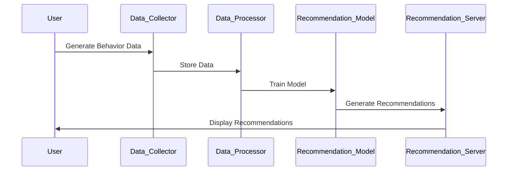

#### 8.3 核心实现

实时推荐系统的核心实现包括数据采集、数据处理、推荐模型训练、推荐结果生成和用户界面展示等。

1. **数据采集**：
   - **数据源**：从用户行为数据源（如数据库、日志文件等）中采集用户行为数据。
   - **采集工具**：使用数据采集工具（如Flume、Logstash等）定期采集数据。

2. **数据处理**：
   - **数据清洗**：去除数据中的噪声和错误，确保数据的准确性和一致性。
   - **数据转换**：将原始数据转换为适合推荐模型训练的格式，如特征向量化、数据标准化等。
   - **数据存储**：将处理后的数据存储到推荐模型训练所需的存储系统中。

3. **推荐模型训练**：
   - **模型选择**：选择适合的推荐模型，如基于协同过滤的推荐模型、基于内容匹配的推荐模型等。
   - **模型训练**：使用训练数据集训练推荐模型，如使用矩阵分解、K最近邻等方法训练推荐模型。

4. **推荐结果生成**：
   - **推荐策略**：根据用户行为数据和推荐模型，生成个性化的推荐结果。
   - **推荐结果存储**：将生成的推荐结果存储到推荐结果存储系统中，如Redis、MongoDB等。

5. **用户界面展示**：
   - **前端应用**：使用前端技术（如HTML、CSS、JavaScript等）实现用户界面的展示。
   - **推荐结果展示**：将推荐结果以适当的形式展示给用户，如推荐列表、推荐卡片等。

以下是实时推荐系统的核心实现示例：

```python
# 数据采集
data_collector = DataCollector(source='database', interval=60)
data_collector.collect_data()

# 数据处理
data_processor = DataProcessor()
processed_data = data_processor.process_data(raw_data)

# 推荐模型训练
recommendation_model = RecommendationModel(model_type='collaborative_filtering')
trained_model = recommendation_model.train_model(training_data=processed_data)

# 推荐结果生成
recommendation_generator = RecommendationGenerator(model=trained_model)
recommendations = recommendation_generator.generate_recommendations(user_id)

# 推荐结果存储
recommendation_storer = RecommendationStorer(destination='redis')
recommendation_storer.store_recommendations(user_id, recommendations)

# 用户界面展示
frontend_app = FrontendApplication()
frontend_app.display_recommendations(user_id, recommendations)
```

#### 8.4 案例分析

以下是一个实时推荐系统的案例分析：

**项目背景**：
- **电商平台**：电商平台需要为用户实时推荐相关的商品，提高用户的购买转化率和满意度。

**技术实现**：
- **数据采集**：使用日志采集工具（如Logstash）收集用户行为数据（如浏览、点击、购买记录等）。
- **数据处理**：使用Flink处理和清洗用户行为数据，生成推荐模型所需的数据。
- **推荐模型训练**：使用基于协同过滤的推荐模型训练推荐模型。
- **推荐结果生成**：根据用户行为数据和推荐模型，生成个性化的推荐结果。
- **推荐结果存储**：将推荐结果存储到Redis中，以便快速查询和展示。
- **用户界面展示**：使用Vue.js实现用户界面的展示，将推荐结果以卡片形式展示给用户。

**系统架构**：

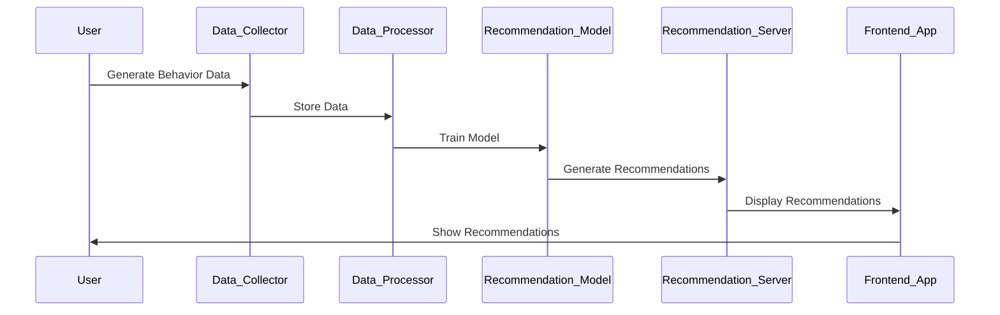

**性能评估**：
- **吞吐量**：系统每天处理用户行为数据的次数和量。
- **延迟**：从用户行为数据生成推荐结果的时间。
- **准确率**：推荐结果的准确性和用户满意度。

**项目小结**：
通过上述案例分析，我们可以看到实时推荐系统的构建过程，包括数据采集、数据处理、推荐模型训练、推荐结果生成和用户界面展示等步骤。实时推荐系统不仅可以提高用户的购买转化率和满意度，还可以为电商平台提供实时的业务洞察。

### 第9章：实时监控与告警系统

实时监控与告警系统是一种用于实时监控系统状态、及时发现和处理异常情况的系统。本章将介绍实时监控与告警系统的构建过程，包括项目背景、需求分析、系统设计、核心实现和案例分析。

#### 9.1 项目背景与需求

随着企业规模的扩大和系统复杂度的增加，实时监控与告警系统成为保障系统稳定运行的重要手段。以下是一个实时监控与告警系统的构建项目背景与需求：

**项目背景**：
- **IT基础设施**：企业需要实时监控IT基础设施（如服务器、网络设备、数据库等）的状态，确保系统的稳定性和可靠性。
- **应用系统**：企业需要实时监控应用系统的运行状态，如响应时间、吞吐量、错误率等，以便及时发现和处理异常情况。

**需求分析**：
- **实时监控**：系统能够实时收集和监控各类系统的性能指标，如CPU利用率、内存占用、磁盘空间、网络流量等。
- **异常检测**：系统能够实时检测系统异常，如CPU过高、内存泄漏、磁盘空间不足等，并触发告警。
- **告警通知**：系统能够通过多种方式（如邮件、短信、电话等）及时通知相关人员处理异常情况。
- **日志记录**：系统需要记录所有监控数据和告警信息，以便后续分析和审计。
- **可扩展性**：系统应具备良好的可扩展性，能够随着企业规模的扩大和系统复杂度的增加进行水平扩展。

#### 9.2 系统设计

实时监控与告警系统的系统设计包括数据采集、数据处理、告警规则配置、告警通知和日志记录等。

1. **数据采集**：
   - **数据源**：从各种系统组件（如操作系统、数据库、Web服务器等）中采集监控数据。
   - **采集工具**：使用采集工具（如Zabbix、Nagios等）定期采集监控数据。

2. **数据处理**：
   - **数据存储**：将采集到的监控数据存储到数据库或其他存储系统中，以便后续分析和处理。
   - **数据处理**：对监控数据进行处理和转换，如数据清洗、格式转换等。

3. **告警规则配置**：
   - **告警规则**：定义告警规则，如CPU利用率超过90%、内存占用超过80%等，触发告警。
   - **规则配置**：配置告警规则，包括告警阈值、告警方式、告警通知等。

4. **告警通知**：
   - **通知方式**：通过邮件、短信、电话等方式及时通知相关人员处理异常情况。
   - **通知流程**：定义告警通知的流程，如告警通知发送、告警确认等。

5. **日志记录**：
   - **日志记录**：记录所有监控数据和告警信息，以便后续分析和审计。
   - **日志存储**：将日志数据存储到日志存储系统中，如ELK（Elasticsearch、Logstash、Kibana）等。

以下是实时监控与告警系统的系统设计示例：

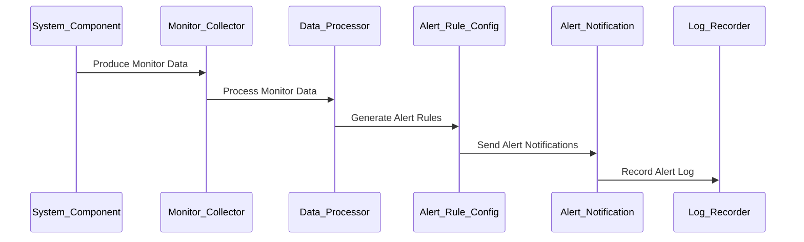

#### 9.3 核心实现

实时监控与告警系统的核心实现包括数据采集、数据处理、告警规则配置、告警通知和日志记录等。

1. **数据采集**：
   - **采集工具**：使用Zabbix进行数据采集，安装和配置Zabbix服务器和代理。
   - **监控项配置**：配置监控项，如CPU利用率、内存占用、磁盘空间等。

2. **数据处理**：
   - **数据存储**：将采集到的监控数据存储到MySQL数据库中，使用Zabbix自带的存储功能。
   - **数据处理**：使用Python编写数据处理脚本，对监控数据进行处理和转换。

3. **告警规则配置**：
   - **告警规则**：在Zabbix中配置告警规则，设置告警阈值、告警方式和告警通知等。

4. **告警通知**：
   - **通知方式**：配置告警通知方式，如邮件、短信、电话等。
   - **通知流程**：定义告警通知的流程，确保告警通知能够及时发送给相关人员。

5. **日志记录**：
   - **日志记录**：在Zabbix前端配置日志记录，记录所有监控数据和告警信息。
   - **日志存储**：将日志数据存储到ELK系统中，使用Kibana进行日志可视化展示。

以下是实时监控与告警系统的核心实现示例：

```shell
# 安装Zabbix
sudo apt-get install zabbix-server zabbix-agent

# 配置Zabbix
sudo vi /etc/zabbix/zabbix_server.conf

# 启动Zabbix服务
sudo systemctl start zabbix-server

# 部署Zabbix前端
sudo apt-get install zabbix-web

# 启动Zabbix前端
sudo systemctl start zabbix-web

# 访问Zabbix前端
http://localhost/zabbix
```

#### 9.4 案例分析

以下是一个实时监控与告警系统的案例分析：

**项目背景**：
- **IT基础设施监控**：企业需要对IT基础设施（如服务器、网络设备、数据库等）进行实时监控，确保系统的稳定运行。

**技术实现**：
- **数据采集**：使用Zabbix进行数据采集，安装和配置Zabbix服务器和代理，配置各种监控项。
- **数据处理**：使用Python编写数据处理脚本，对采集到的监控数据进行处理和转换。
- **告警规则配置**：在Zabbix中配置告警规则，设置告警阈值、告警方式和告警通知等。
- **告警通知**：配置告警通知方式，如邮件、短信、电话等，确保告警通知能够及时发送给相关人员。
- **日志记录**：在Zabbix前端配置日志记录，记录所有监控数据和告警信息，使用Kibana进行日志可视化展示。

**系统架构**：

```mermaid
sequenceDiagram
    participant System_Component
    participant Zabbix_Server
    participant Zabbix_Agent
    participant Data_Processor
    participant Alert_Rule_Config
    participant Alert_Notification
    participant Log_Recorder

    System_Component->>Zabbix_Agent: Produce Monitor Data
    Zabbix_Agent->>Zabbix_Server: Send Monitor Data
    Zabbix_Server->>Data_Processor: Process Monitor Data
    Data_Processor->>Alert_Rule_Config: Generate Alert Rules
    Alert_Rule_Config->>Alert_Notification: Send Alert Notifications
    Alert_Notification->>Log_Recorder: Record Alert Log
```

**性能评估**：
- **监控覆盖率**：系统能够监控到的基础设施数量和比例。
- **告警准确率**：系统发出的告警通知与实际异常情况的匹配程度。
- **响应时间**：从系统检测到异常到发出告警通知的时间。

**项目小结**：
通过上述案例分析，我们可以看到实时监控与告警系统的构建过程，包括数据采集、数据处理、告警规则配置、告警通知和日志记录等步骤。实时监控与告警系统不仅能够提高系统的稳定性和可靠性，还能够为企业提供实时的业务洞察。

### 第10章：流处理架构最佳实践

流处理架构的设计和实现涉及到多个方面，包括系统设计、性能优化、安全性保障等。本章将介绍流处理架构的最佳实践，包括架构优化策略、性能调优技巧、安全性保障措施等。

#### 10.1 架构优化策略

流处理架构的优化是提高系统性能、可靠性和可维护性的关键。以下是一些架构优化策略：

1. **水平扩展**：
   - **分布式架构**：流处理系统应采用分布式架构，将计算和存储资源分布在多个节点上，以提高系统的处理能力和容错性。
   - **动态扩展**：系统应具备动态扩展能力，可以根据业务需求实时调整计算资源和存储资源，以适应数据量的变化。

2. **数据分区**：
   - **合理分区**：合理划分数据分区，可以减少数据倾斜和任务负载不均，提高系统的处理效率。
   - **动态调整**：根据数据特征和任务需求，动态调整数据分区策略，以优化系统性能。

3. **缓存策略**：
   - **缓存热点数据**：使用缓存技术（如Redis、Memcached等）存储热点数据，减少数据访问延迟，提高系统响应速度。
   - **缓存预热**：在系统启动时或数据变化时，对缓存进行预热，以减少数据加载时间。

4. **负载均衡**：
   - **分布式负载均衡**：使用分布式负载均衡器（如Nginx、HAProxy等）实现负载均衡，避免单点过载，提高系统的整体性能。
   - **任务调度**：合理分配任务，避免任务过于集中在一个节点上，以提高系统的均衡性和处理效率。

5. **资源调优**：
   - **CPU资源**：合理分配CPU资源，避免CPU资源过度消耗，影响系统的性能。
   - **内存资源**：合理分配内存资源，避免内存泄漏和内存溢出，确保系统的稳定运行。
   - **网络资源**：优化网络配置，提高数据传输速度和系统的网络吞吐量。

#### 10.2 性能调优技巧

性能调优是提高流处理系统性能的重要手段。以下是一些性能调优技巧：

1. **调整并发度**：
   - **合理设置并发度**：根据系统的处理能力和负载情况，合理设置任务并发度，避免资源浪费和性能瓶颈。
   - **动态调整并发度**：根据系统的负载变化，动态调整任务并发度，以优化系统性能。

2. **优化数据结构**：
   - **选择合适的数据结构**：根据数据处理的需求，选择合适的数据结构（如数组、列表、哈希表等），以提高数据处理速度。
   - **减少数据复制**：避免无谓的数据复制和传输，减少系统的资源消耗。

3. **优化网络配置**：
   - **调整网络参数**：优化网络配置，调整网络带宽、TCP缓冲区等参数，以提高数据传输速度。
   - **网络监控**：实时监控网络性能，及时发现和处理网络故障。

4. **批处理与流处理结合**：
   - **混合处理**：对于部分计算任务，可以采用批处理与流处理结合的方式，提高处理效率。
   - **触发条件**：根据业务需求和数据特征，合理设置批处理的触发条件，以优化系统性能。

5. **优化查询性能**：
   - **创建索引**：在数据库中创建索引，提高查询性能。
   - **优化查询语句**：使用高效的查询语句，避免复杂的关联查询和子查询，以提高查询性能。

#### 10.3 安全性与可靠性保障

流处理系统的安全性与可靠性是确保系统稳定运行的关键。以下是一些安全性与可靠性保障措施：

1. **数据加密**：
   - **传输加密**：使用加密技术（如TLS、SSL等）保护数据在传输过程中的安全性。
   - **存储加密**：使用加密技术（如AES等）保护存储数据的安全性。

2. **身份认证与授权**：
   - **多因素认证**：实现多因素认证机制，如密码、指纹、短信验证码等，提高系统的安全性。
   - **权限管理**：实现严格的权限管理机制，根据用户角色和权限限制对系统的访问和操作。

3. **备份与恢复**：
   - **定期备份**：定期备份数据，确保在发生故障时能够快速恢复系统。
   - **备份策略**：制定合理的备份策略，包括数据备份的时间、频率和备份方式等。

4. **故障转移与容错**：
   - **故障转移**：实现故障转移机制，确保在发生故障时系统能够自动切换到备用节点，保证服务的连续性。
   - **容错机制**：实现容错机制，确保系统在发生故障时能够自动恢复，减少系统的停机时间。

5. **监控与审计**：
   - **实时监控**：实时监控系统状态，及时发现和处理异常情况，确保系统的稳定运行。
   - **日志审计**：记录系统操作日志，以便审计和故障排查。

#### 10.4 拓展阅读

流处理架构是一个广泛且深入的主题，以下是一些推荐的拓展阅读资源，供读者进一步学习和研究：

1. **《流处理：实时数据处理的原理与实践》**：详细介绍了流处理的基本原理、架构设计和实现方法。
2. **《实时数据流处理系统设计》**：探讨了实时数据流处理系统的设计与优化策略。
3. **《Apache Kafka：设计、实现与应用》**：深入剖析了Apache Kafka的架构、原理和应用场景。
4. **《Apache Flink：实战与优化》**：介绍了Apache Flink的使用方法和性能优化技巧。
5. **《实时推荐系统技术详解》**：详细讲解了实时推荐系统的原理、算法和应用。

通过这些拓展阅读资源，读者可以更深入地了解流处理架构的设计、实现和应用，为实际项目提供有价值的参考。

### 附录

#### 附录A：常用流处理框架API参考

附录A提供了常用流处理框架的API参考，包括Kafka、Flink、Storm等。以下是这些框架的主要API介绍：

1. **Kafka**：
   - **生产者API**：用于生产者发送消息到Kafka主题。
   - **消费者API**：用于消费者从Kafka主题中读取消息。
   - **主题管理API**：用于创建、删除和修改Kafka主题。

2. **Flink**：
   - **DataStream API**：用于创建和操作数据流。
   - **Table API**：用于创建和操作表。
   - **SQL API**：用于执行SQL查询。

3. **Storm**：
   - **Spout API**：用于生产者发送消息到Storm拓扑。
   - **Bolt API**：用于消费者从Storm拓扑中读取消息和处理消息。
   - **流数据库API**：用于与流数据库进行交互。

#### 附录B：数学模型与公式

附录B列出了流处理中常用的数学模型和公式，包括数据聚合、窗口计算、排序等。以下是这些模型和公式的介绍：

1. **数据聚合**：
   - **求和**：$\sum_{i=1}^{n} x_i$
   - **求平均值**：$\frac{\sum_{i=1}^{n} x_i}{n}$
   - **求最大值**：$max(x_1, x_2, ..., x_n)$
   - **求最小值**：$min(x_1, x_2, ..., x_n)$

2. **窗口计算**：
   - **时间窗口**：$w_t = \{t, t+w\}$
   - **滑动窗口**：$w_t = \{t, t+w-1\}$，其中$t$为当前时间，$w$为窗口大小。

3. **排序**：
   - **冒泡排序**：$a_1 \leq a_2 \leq ... \leq a_n$
   - **快速排序**：$a_1 \leq a_2 \leq ... \leq a_n$

#### 附录C：项目代码与数据集

附录C提供了实时推荐系统、实时监控与告警系统等项目的代码和数据集。以下是这些项目的代码和数据集的介绍：

1. **实时推荐系统**：
   - **代码**：提供了实时推荐系统的源代码，包括数据采集、数据处理、推荐模型训练和推荐结果生成等部分。
   - **数据集**：提供了用于训练和测试的数据集，包括用户行为数据和商品数据。

2. **实时监控与告警系统**：
   - **代码**：提供了实时监控与告警系统的源代码，包括数据采集、数据处理、告警规则配置、告警通知和日志记录等部分。
   - **数据集**：提供了用于监控的数据集，包括系统性能指标数据和告警信息。

#### 附录D：拓展阅读推荐

附录D列出了流处理领域的一些拓展阅读资源，包括书籍、论文和在线课程等。以下是这些资源的介绍：

1. **书籍**：
   - **《流处理：实时数据处理的原理与实践》**：详细介绍了流处理的基本原理、架构设计和实现方法。
   - **《大数据技术导论》**：介绍了大数据技术的原理、架构和实现方法，包括流处理技术。
   - **《Apache Kafka权威指南》**：深入剖析了Apache Kafka的架构、原理和应用场景。

2. **论文**：
   - **《大规模流处理系统设计与实现》**：讨论了大规模流处理系统的设计与实现方法。
   - **《基于协同过滤的实时推荐系统》**：介绍了基于协同过滤的实时推荐系统的原理和实现方法。
   - **《流处理技术在金融领域的应用》**：探讨了流处理技术在金融领域的应用场景和实现方法。

3. **在线课程**：
   - **《实时数据处理与流处理》**：介绍了实时数据处理和流处理的基本概念、架构设计和实现方法。
   - **《大数据流处理技术》**：探讨了大数据流处理技术的原理、架构和实现方法。
   - **《Kafka实战》**：介绍了Apache Kafka的架构、原理和应用场景，包括流处理系统的构建。

通过这些拓展阅读资源，读者可以更深入地了解流处理技术的原理和应用，为实际项目提供有价值的参考。

### 作者信息

作者：AI天才研究院/AI Genius Institute & 禅与计算机程序设计艺术 /Zen And The Art of Computer Programming

本文由AI天才研究院和禅与计算机程序设计艺术联合撰写，旨在为读者提供关于流处理架构的全面解读和实践指导。希望本文能帮助读者更好地理解和应用流处理技术，构建高性能、可靠的实时数据处理系统。如果您有任何问题或建议，欢迎随时联系我们。感谢您的阅读！
## 第1章：流处理概述

流处理技术是大数据处理领域的重要分支，随着数据量的爆炸性增长和实时性需求不断提升，流处理在多个行业和领域都展现出了其不可替代的价值。本章将详细介绍流处理技术的定义、背景、应用场景以及关键概念，帮助读者全面理解流处理的原理和重要性。

### 1.1 流处理的定义

流处理是一种数据处理方式，旨在对实时到达的数据流进行连续的、动态的处理和分析。与传统的批处理不同，批处理将数据集中在一起，在固定的时间窗口内进行处理，而流处理则是以每个数据元素为单位，实时地对数据进行处理。

流处理的定义可以从以下几个方面进行理解：

- **实时性**：流处理的核心特征是其实时性。这意味着系统需要能够快速响应用户请求和数据变化，通常在毫秒级或秒级内完成数据处理。
- **数据流**：流处理处理的不是静态的数据集，而是动态的数据流。数据流可以是时间序列数据、事件数据、日志数据等。
- **连续性**：流处理是一个持续的过程，系统需要不断地接收、处理和输出数据，而不是一次性地处理大量数据。

### 1.2 流处理的背景

流处理技术的兴起源于以下几个背景因素：

1. **大数据的爆发**：随着互联网的普及和物联网设备的广泛使用，数据量呈现指数级增长。传统的批处理系统已经无法满足对实时数据处理的需求。
2. **实时业务需求**：许多业务场景需要实时决策和反馈，如金融交易、实时监控、推荐系统等。批处理系统的延时性无法满足这些需求。
3. **技术发展**：分布式系统、云计算、内存计算等技术的发展为流处理提供了强大的技术支持，使得流处理系统更加高效、可靠和可扩展。

### 1.3 流处理的应用场景

流处理技术广泛应用于多个领域，以下是其中一些典型的应用场景：

1. **金融交易**：金融交易系统需要实时处理大量的交易数据，进行实时风险评估和交易决策。
2. **实时监控**：实时监控系统可以监控服务器、网络设备、生产设备的运行状态，及时发现和处理异常情况。
3. **推荐系统**：推荐系统根据用户的实时行为数据，提供个性化的商品推荐或内容推荐。
4. **物联网**：物联网设备产生的数据需要实时处理和分析，以便实现设备的远程监控和管理。
5. **社交媒体**：社交媒体平台需要实时处理用户发布的内容，进行内容审核、推荐和广告投放。
6. **交通运输**：交通运输系统需要实时处理交通数据，优化路线规划、交通信号控制等。

### 1.4 流处理的核心概念

流处理技术的核心概念包括数据流模型、实时计算框架、流处理引擎和流处理核心算法。以下是这些核心概念的详细介绍：

1. **数据流模型**：数据流模型描述了数据在流处理系统中的流动路径，包括数据源、数据处理节点和数据消费者。数据流模型可以用ER图或流程图表示。
   
2. **实时计算框架**：实时计算框架提供了流处理的计算资源和调度机制。常见的实时计算框架包括Apache Kafka、Apache Flink、Apache Storm等。这些框架为流处理系统的开发提供了基础工具和库。

3. **流处理引擎**：流处理引擎是流处理系统的核心组件，负责处理数据流，执行流处理任务。流处理引擎可以基于不同的实时计算框架构建，如Apache Flink、Apache Spark Streaming等。

4. **流处理核心算法**：流处理核心算法用于处理不同的数据流任务，包括数据聚合、数据排序、窗口计算等。这些算法是流处理系统性能的关键因素。

### 1.5 流处理的优点和挑战

流处理技术具有以下优点：

- **实时性**：能够实时处理和响应数据，满足实时业务需求。
- **高吞吐量**：分布式架构支持高吞吐量的数据处理，适用于大规模数据流。
- **灵活性**：能够灵活处理不同类型的数据流，支持多种数据处理算法。
- **可扩展性**：能够动态扩展计算资源，以应对不断变化的数据量。

然而，流处理技术也面临一些挑战：

- **复杂性**：流处理系统的设计和实现较为复杂，需要掌握多种技术和工具。
- **性能优化**：流处理系统需要持续的性能优化，以应对不断增长的数据量和负载。
- **数据一致性**：在分布式环境中保证数据的一致性是一个挑战。
- **系统稳定性**：流处理系统需要保证在处理大量数据时的高可用性和稳定性。

### 1.6 本章小结

本章介绍了流处理技术的定义、背景、应用场景和核心概念。流处理技术以其实时性、高吞吐量、灵活性和可扩展性，在多个领域展现出了巨大的应用价值。流处理的核心概念包括数据流模型、实时计算框架、流处理引擎和流处理核心算法。通过本章的介绍，读者可以初步了解流处理技术的基本原理和重要性，为后续章节的学习打下基础。

### 总结

流处理技术是大数据处理领域的关键技术之一，它能够实时处理和响应数据，满足实时业务需求。本章从流处理的定义、背景、应用场景、核心概念等方面进行了详细介绍，帮助读者全面理解流处理的原理和重要性。在接下来的章节中，我们将深入探讨流处理的核心概念、架构设计、实现方法和最佳实践，帮助读者构建高性能、可靠的流处理系统。让我们一起深入探讨流处理的世界，探索其无限的可能性。

## 第2章：流处理核心概念

流处理技术是现代数据处理领域的重要工具，其核心概念和架构对于构建高效、可靠的流处理系统至关重要。本章将详细讨论流处理技术的核心概念，包括数据流模型、实时计算框架、流处理引擎和流处理核心算法，帮助读者深入理解流处理系统的构建原理。

### 2.1 数据流模型

数据流模型是流处理系统的基本构建块，它描述了数据在系统中的流动路径和处理过程。一个典型的数据流模型包括以下几个部分：

1. **数据源**：数据源是数据流的起点，可以是传感器、网络日志、数据库或其他数据生成设备。数据源不断地生成数据，并将其发送到系统中。

2. **数据处理节点**：数据处理节点是对数据进行处理和转换的组件，可以是计算节点、存储节点或两者结合。数据处理节点负责对数据进行清洗、转换、聚合等操作，以生成有意义的结果。

3. **数据消费者**：数据消费者是数据流的目标，可以是应用程序、用户或其他系统。数据消费者从系统中获取处理后的数据，进行进一步的分析、展示或使用。

数据流模型可以用ER图或流程图来表示，图中的节点表示数据源、数据处理节点和数据消费者，箭头表示数据的流动方向。

#### 数据流模型示例

假设我们有一个简单的数据流模型，用于监控服务器性能。该模型包括以下组件：

- **数据源**：服务器性能传感器，定期收集CPU利用率、内存占用等性能数据。
- **数据处理节点**：数据处理服务器，对性能数据进行清洗、转换和聚合。
- **数据消费者**：监控系统前端，展示处理后的性能数据，提供实时监控界面。

数据流模型可以表示为：

```mermaid
erDiagram
    Server_Sensor ||--|{ Data_Process_Node }|>
    Data_Process_Node ||--|{ Monitoring_Interface }|>

    Server_Sensor ||--|{ Data_Process_Node }|>
    Data_Process_Node ||--|{ Monitoring_Interface }|>

    Data_Process_Node ||--|{ Data_Process_Node }|>
```

在这个ER图中，`Server_Sensor` 表示数据源，`Data_Process_Node` 表示数据处理节点，`Monitoring_Interface` 表示数据消费者。

### 2.2 实时计算框架

实时计算框架是流处理系统的核心组件，它提供了计算资源和调度机制，使得流处理系统能够高效地处理大规模数据流。常见的实时计算框架包括Apache Kafka、Apache Flink、Apache Storm等。

1. **Apache Kafka**：Apache Kafka是一个分布式消息队列系统，广泛用于构建流处理系统。它具有高吞吐量、持久化和高可用性等特点，适用于大规模数据流传输和存储。

2. **Apache Flink**：Apache Flink是一个分布式流处理框架，提供了丰富的流处理功能，包括实时计算、状态管理和容错性等。它适用于复杂的数据处理任务，如实时数据分析、推荐系统和实时监控等。

3. **Apache Storm**：Apache Storm是一个实时计算框架，具有良好的伸缩性和容错性。它适用于实时数据处理和分布式计算任务，如实时日志处理、实时数据分析和物联网数据处理等。

#### 实时计算框架比较

以下是Apache Kafka、Apache Flink和Apache Storm的主要特点比较：

| 特点 | Apache Kafka | Apache Flink | Apache Storm |
| --- | --- | --- | --- |
| 分布式架构 | 是 | 是 | 是 |
| 高吞吐量 | 是 | 是 | 是 |
| 持久化 | 是 | 是 | 否 |
| 容错性 | 是 | 是 | 是 |
| 状态管理 | 否 | 是 | 否 |
| API易用性 | 较复杂 | 较复杂 | 简单 |
| 生态支持 | 较强 | 较强 | 中等 |

根据不同的应用场景和需求，可以选择适合的实时计算框架。例如，对于需要持久化和状态管理的大规模数据流处理任务，可以选择Apache Flink；对于实时日志处理和物联网数据处理任务，可以选择Apache Storm；对于需要高吞吐量和低延迟的数据流传输和存储任务，可以选择Apache Kafka。

### 2.3 流处理引擎

流处理引擎是流处理系统的核心组件，负责处理数据流，执行流处理任务。流处理引擎的选择取决于实时计算框架和具体的应用需求。常见的流处理引擎包括Apache Flink、Apache Spark Streaming、Apache Storm等。

1. **Apache Flink**：Apache Flink是一个分布式流处理框架，提供了丰富的流处理功能，包括实时计算、状态管理和容错性等。它适用于复杂的数据处理任务，如实时数据分析、推荐系统和实时监控等。

2. **Apache Spark Streaming**：Apache Spark Streaming是Apache Spark的一个扩展，用于实时数据处理。它提供了简单易用的API，并利用Spark的核心组件（如RDD）进行数据处理，适用于大规模数据流处理任务。

3. **Apache Storm**：Apache Storm是一个实时计算框架，具有良好的伸缩性和容错性。它适用于实时数据处理和分布式计算任务，如实时日志处理、实时数据分析和物联网数据处理等。

#### 流处理引擎架构

流处理引擎通常包括以下几个核心组件：

- **数据流**：数据流是流处理引擎的基本数据结构，由一系列有序的数据元素组成。
- **计算节点**：计算节点是流处理引擎的基本计算单元，负责处理数据流中的数据元素。
- **调度器**：调度器负责分配计算任务到计算节点，管理资源调度和任务执行。
- **存储系统**：存储系统用于存储处理后的数据，支持数据的持久化和查询。

以下是流处理引擎的架构示意图：

```mermaid
sequenceDiagram
    participant Data_Stream
    participant Compute_Node
    participant Scheduler
    participant Storage_System

    Data_Stream->>Scheduler: Allocate Resources
    Scheduler->>Compute_Node: Execute Task
    Compute_Node->>Storage_System: Store Result
```

在这个序列图中，`Data_Stream` 表示数据流，`Compute_Node` 表示计算节点，`Scheduler` 表示调度器，`Storage_System` 表示存储系统。

### 2.4 流处理核心算法

流处理核心算法是流处理系统中用于处理不同类型数据流任务的算法。这些算法包括数据聚合、数据排序、窗口计算等。以下是对这些核心算法的详细介绍：

1. **数据聚合**：
   - **定义**：数据聚合是对数据进行汇总和计算，如求和、求平均值、求最大值和最小值等。
   - **应用**：数据聚合用于对实时数据进行汇总和分析，提供有意义的统计结果。

2. **数据排序**：
   - **定义**：数据排序是对数据流中的数据进行排序操作，如升序、降序等。
   - **应用**：数据排序用于对实时数据进行排序，以便进行后续分析或展示。

3. **窗口计算**：
   - **定义**：窗口计算是对数据流进行分段处理，如时间窗口、滑动窗口等。
   - **应用**：窗口计算用于对实时数据进行分段分析，提供有意义的统计结果。

以下是数据聚合算法的mermaid流程图：

```mermaid
flowchart TD
    A[Start] --> B[Read Data]
    B --> C[Aggregate Data]
    C --> D[Write Result]
    D --> E[End]
```

假设我们使用Python实现数据聚合算法，如下所示：

```python
def aggregate_data(data_stream):
    total = 0
    for data in data_stream:
        total += data
    return total
```

数据聚合算法的数学模型可以表示为：

$$
\text{total} = \sum_{i=1}^{n} \text{data}_i
$$

其中，$n$ 表示数据流的长度，$\text{data}_i$ 表示数据流中的第 $i$ 个数据。

### 2.5 流处理系统的关键因素

构建高效的流处理系统需要考虑以下几个关键因素：

1. **性能**：流处理系统需要能够以较低的延迟处理大规模数据流，保证系统的响应速度。
2. **可靠性**：系统需要具备高可靠性，能够在发生故障时自动恢复，确保数据的一致性和系统的连续性。
3. **可扩展性**：系统应具备良好的可扩展性，能够随着数据量的增长和业务需求的增加进行水平扩展。
4. **易用性**：系统应提供简单易用的API和工具，便于开发人员和运维人员进行操作和维护。
5. **安全性**：系统应具备安全性，保护数据在传输和存储过程中的安全性，防止数据泄露和未授权访问。

### 2.6 本章小结

本章详细介绍了流处理技术的核心概念，包括数据流模型、实时计算框架、流处理引擎和流处理核心算法。通过本章的学习，读者可以深入理解流处理系统的构建原理，为后续章节的深入学习打下基础。流处理技术以其实时性、高吞吐量、灵活性和可扩展性，在现代数据处理领域展现出了巨大的应用价值。在接下来的章节中，我们将继续探讨流处理架构的设计、实现方法和最佳实践，帮助读者构建高性能、可靠的流处理系统。

### 总结

流处理技术是大数据处理领域的重要工具，它能够实时处理和响应数据，满足实时业务需求。本章从数据流模型、实时计算框架、流处理引擎和流处理核心算法等方面详细介绍了流处理技术的核心概念，帮助读者深入理解流处理的原理和重要性。在接下来的章节中，我们将进一步探讨流处理架构的设计、实现方法和最佳实践，帮助读者构建高效、可靠的流处理系统。让我们一起深入探索流处理的世界，挖掘其无限的可能性。

## 第3章：流处理框架比较

流处理框架是构建流处理系统的关键组件，不同的框架在性能、功能、适用场景等方面各有特点。本章将比较几个常用的流处理框架，包括Apache Kafka、Apache Flink、Apache Storm，帮助读者选择适合自己项目的流处理框架。

### 3.1 Apache Kafka

Apache Kafka是一个分布式消息队列系统，最初由LinkedIn开发，现已成为Apache软件基金会的一个顶级项目。Kafka主要用于大规模数据流的传输和存储，具有以下特点：

1. **高吞吐量**：Kafka能够处理大规模的数据流，支持高吞吐量的数据传输，适用于需要实时处理大量数据的场景。

2. **分布式架构**：Kafka支持分布式架构，可以水平扩展，以处理更大的数据量。每个Kafka集群由多个节点组成，数据在节点之间进行复制，确保数据的高可用性和可靠性。

3. **持久化**：Kafka将数据持久化到磁盘，确保数据的安全性和可靠性。即使在发生故障时，数据也不会丢失。

4. **高可用性**：Kafka具有自动故障转移机制，确保系统的可用性。当某个节点发生故障时，其他节点会自动接管其工作。

5. **跨语言支持**：Kafka提供了多种编程语言的客户端库，包括Java、Python、C++等，使得开发人员可以轻松地集成和使用Kafka。

#### Apache Kafka的应用场景

Apache Kafka适用于以下应用场景：

- **大规模数据传输**：Kafka适用于大规模数据流的传输，如实时日志收集、实时数据处理等。
- **实时数据存储**：Kafka可以作为实时数据存储系统，用于存储和查询实时数据。
- **分布式计算**：Kafka可以作为分布式计算框架的组件，与其他流处理框架（如Flink、Spark等）集成，实现复杂的数据处理任务。

### 3.2 Apache Flink

Apache Flink是一个分布式流处理框架，最初由柏林工业大学和DataArtisans公司开发，现已成为Apache软件基金会的一个顶级项目。Flink提供了丰富的流处理功能，适用于复杂的数据处理任务。

1. **实时处理**：Flink支持实时数据处理，能够以毫秒级延迟处理数据流，适用于需要实时响应的场合。

2. **状态管理**：Flink支持状态管理，能够保存和恢复流处理任务的状态，确保数据的完整性和一致性。

3. **容错性**：Flink具有高容错性，能够在发生故障时自动恢复，确保系统的可靠性。

4. **易用性**：Flink提供了简单易用的API，使得开发人员可以轻松地构建和部署实时应用程序。

5. **生态系统**：Flink与Hadoop生态系统紧密集成，可以与HDFS、YARN、Spark等组件协同工作。

#### Apache Flink的应用场景

Apache Flink适用于以下应用场景：

- **实时数据分析**：Flink适用于实时数据分析场景，如实时股票交易分析、实时搜索引擎等。
- **实时推荐系统**：Flink适用于实时推荐系统场景，如基于用户行为的实时推荐等。
- **实时监控告警**：Flink适用于实时监控告警场景，如实时系统监控、实时异常检测等。

### 3.3 Apache Storm

Apache Storm是一个分布式实时计算框架，由Twitter开发，现已成为Apache软件基金会的一个顶级项目。Storm提供了简单的API和丰富的库，适用于实时数据处理和分布式计算任务。

1. **实时处理**：Storm支持实时数据处理，能够以毫秒级延迟处理数据流，适用于需要实时响应的场景。

2. **可扩展性**：Storm支持水平扩展，可以动态地增加计算节点，以处理更大的数据量。

3. **容错性**：Storm具有高容错性，能够在发生故障时自动恢复，确保系统的可靠性。

4. **易用性**：Storm提供了简单的API和丰富的库，使得开发人员可以轻松地构建和部署实时应用程序。

5. **与Hadoop集成**：Storm与Hadoop生态系统紧密集成，可以与HDFS、YARN、MapReduce等组件协同工作。

#### Apache Storm的应用场景

Apache Storm适用于以下应用场景：

- **实时数据处理**：Storm适用于实时数据处理场景，如实时日志处理、实时数据流处理等。
- **实时流计算**：Storm适用于实时流计算场景，如实时流数据分析、实时预测等。
- **实时物联网处理**：Storm适用于实时物联网处理场景，如实时传感器数据处理、实时设备监控等。

### 3.4 其他流处理框架

除了Apache Kafka、Apache Flink和Apache Storm，还有许多其他流处理框架，如Apache Spark Streaming、RabbitMQ等。这些框架各有特点，适用于不同的场景和需求。

1. **Apache Spark Streaming**：
   - **定义**：Apache Spark Streaming是Spark的一个扩展，用于实时数据处理。
   - **特点**：Spark Streaming与Spark的其他组件（如Spark SQL、MLlib等）紧密集成，提供了简单易用的API。
   - **应用场景**：Spark Streaming适用于实时数据分析、实时监控、实时推荐系统等场景。

2. **RabbitMQ**：
   - **定义**：RabbitMQ是一种消息队列系统，可以用于流处理。
   - **特点**：RabbitMQ具有高可靠性、可扩展性和易用性，适用于实时数据处理和分布式计算任务。
   - **应用场景**：RabbitMQ适用于实时数据处理、实时流计算、实时推荐系统等场景。

### 3.5 流处理框架选择指南

选择流处理框架时，应考虑以下因素：

1. **实时性**：如果项目需要低延迟的实时数据处理，可以选择Apache Flink或Apache Storm。

2. **数据处理能力**：如果项目需要处理大规模数据流，可以选择Apache Kafka或RabbitMQ。

3. **生态系统和集成**：如果项目需要与其他大数据组件（如Hadoop、Spark等）集成，可以选择Apache Flink。

4. **开发难度和易用性**：如果项目开发难度较高，可以选择Apache Spark Streaming或RabbitMQ，它们提供了简单易用的API。

5. **成本和资源**：如果项目成本和资源有限，可以选择开源的流处理框架，如Apache Storm。

### 3.6 本章小结

本章比较了几个常用的流处理框架，包括Apache Kafka、Apache Flink、Apache Storm等。每个框架都有其独特的特点和适用场景，读者可以根据自己的项目需求和资源选择适合的框架。流处理框架的选择对于构建高效、可靠的流处理系统至关重要。在接下来的章节中，我们将进一步探讨流处理架构的设计、实现方法和最佳实践，帮助读者构建高性能、可靠的流处理系统。

### 总结

流处理框架是构建高效流处理系统的关键组件，不同的框架在性能、功能、适用场景等方面各有特点。本章通过比较Apache Kafka、Apache Flink、Apache Storm等常用流处理框架，帮助读者选择适合自己项目的框架。选择合适的流处理框架对于构建高效、可靠的流处理系统至关重要。在接下来的章节中，我们将深入探讨流处理架构的设计、实现方法和最佳实践，帮助读者构建高性能、可靠的流处理系统。让我们一起探索流处理技术的无限可能性。

## 第4章：流处理应用场景

流处理技术因其实时性、灵活性和可扩展性，广泛应用于各个行业和领域。本章将详细介绍流处理技术在多个领域的应用场景，包括数据实时分析、实时推荐系统、实时监控告警等，帮助读者理解流处理技术的实际应用价值。

### 4.1 数据实时分析

数据实时分析是流处理技术的典型应用场景之一。它通过实时处理和分析数据流，为企业和组织提供实时的业务洞察和决策支持。以下是一些数据实时分析的应用场景：

1. **实时股票交易分析**：金融交易系统需要实时分析股票市场数据，包括交易量、价格走势等，以便快速做出交易决策。流处理技术可以实时处理大量交易数据，提供实时的市场分析和预警。

2. **实时搜索引擎**：搜索引擎需要实时分析用户搜索数据，提供个性化的搜索结果和推荐。流处理技术可以实时分析用户搜索关键词、搜索历史等数据，优化搜索结果，提高用户体验。

3. **实时销售数据分析**：零售企业需要实时分析销售数据，包括销售额、销售趋势等，以便调整营销策略和库存管理。流处理技术可以实时处理大量销售数据，提供实时的销售分析和预警。

4. **实时舆情监控**：媒体和公关公司需要实时监控社交媒体平台上的用户评论和讨论，了解公众对特定事件或产品的看法。流处理技术可以实时分析大量文本数据，提供实时的舆情分析和预警。

### 4.2 实时推荐系统

实时推荐系统是流处理技术在电子商务和社交媒体领域的典型应用。它通过实时分析用户行为数据，为用户提供个性化的推荐服务，提高用户满意度和转化率。以下是一些实时推荐系统的应用场景：

1. **电子商务平台的商品推荐**：电子商务平台需要根据用户浏览、点击、购买等行为数据，实时推荐相关的商品。流处理技术可以实时处理用户行为数据，生成个性化的商品推荐。

2. **社交媒体平台的内容推荐**：社交媒体平台需要根据用户发布、点赞、评论等行为数据，实时推荐用户感兴趣的内容。流处理技术可以实时分析用户行为数据，生成个性化的内容推荐。

3. **在线教育平台的课程推荐**：在线教育平台需要根据用户的学习行为和兴趣，实时推荐相关的课程。流处理技术可以实时处理用户学习数据，生成个性化的课程推荐。

4. **音乐和视频平台的推荐**：音乐和视频平台需要根据用户的播放记录和偏好，实时推荐用户感兴趣的音乐和视频。流处理技术可以实时分析用户播放数据，生成个性化的音乐和视频推荐。

### 4.3 实时监控告警

实时监控告警系统是流处理技术在IT系统和工业生产领域的典型应用。它通过实时监控系统的运行状态，及时发现和处理异常情况，确保系统的稳定运行。以下是一些实时监控告警系统的应用场景：

1. **IT系统监控**：企业需要实时监控服务器、网络设备、应用系统的运行状态，包括CPU利用率、内存占用、磁盘空间等。流处理技术可以实时分析监控数据，及时发现和处理异常情况。

2. **工业生产监控**：工业生产系统需要实时监控生产设备的状态，包括温度、压力、转速等。流处理技术可以实时分析设备数据，及时发现和处理设备故障，确保生产过程的稳定和高效。

3. **网络安全监控**：网络安全系统需要实时监控网络流量和日志数据，识别

