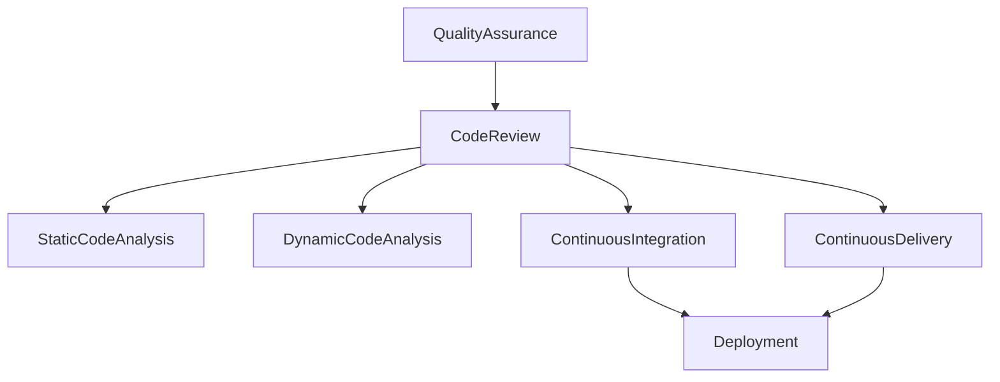

                 


### 构建高效的代码质量管理体系

---

**关键词：** 代码质量管理、质量保证策略、代码审查、静态代码分析、动态代码分析、持续集成、持续交付

**摘要：** 本文旨在探讨构建高效代码质量管理体系的方法和最佳实践，通过详细分析代码质量管理的必要性、核心概念、构建策略、代码审查、静态代码分析、动态代码分析、持续集成与持续交付，以及实战案例，帮助读者理解和实践如何提升代码质量。

---

## 第一部分：背景与概述

### 第1章：代码质量管理的必要性

#### 1.1 问题背景

在当今快速发展的软件开发行业，代码质量成为影响项目成功的关键因素。随着软件系统的复杂性和规模不断扩大，代码质量的问题日益突出。不良的代码质量可能导致以下问题：

1. **维护成本增加：** 低质量的代码需要更多的时间和精力进行修复和维护。
2. **可靠性问题：** 低质量的代码可能导致系统崩溃、数据丢失等问题。
3. **用户体验下降：** 低质量的代码可能导致系统性能下降，影响用户体验。
4. **安全漏洞：** 低质量的代码可能存在安全漏洞，容易成为黑客攻击的目标。

#### 1.2 代码质量的影响

代码质量对软件项目的影响是深远且广泛的：

1. **项目成本：** 高质量的代码可以降低维护成本，提高项目效益。
2. **交付周期：** 高质量的代码可以减少调试和修复的时间，加快项目交付速度。
3. **用户满意度：** 高质量的代码可以提高系统的稳定性和性能，提升用户满意度。
4. **团队士气：** 高质量的代码可以提升开发团队的士气和自信心。

#### 1.3 代码质量管理的重要性

代码质量管理是确保软件产品质量的重要手段。其重要性体现在以下几个方面：

1. **提升产品质量：** 通过代码质量管理，可以确保软件的可靠性、可维护性和性能。
2. **降低风险：** 通过代码质量管理，可以识别和修复潜在的问题，降低项目风险。
3. **提高开发效率：** 通过代码质量管理，可以规范开发流程，提高开发效率。
4. **增强团队协作：** 通过代码质量管理，可以促进团队成员之间的沟通和协作。

#### 1.4 代码质量管理的挑战

尽管代码质量管理的重要性不言而喻，但在实际操作中仍面临诸多挑战：

1. **复杂性：** 随着软件系统的复杂度增加，代码质量管理变得更加困难。
2. **人员素质：** 开发团队的素质直接影响到代码质量，提升人员素质是关键。
3. **持续集成：** 在持续集成和交付的过程中，如何确保代码质量是一个挑战。
4. **自动化：** 自动化是提高代码质量的重要手段，但如何有效地实施自动化仍是一个问题。

#### 1.5 本章小结

本章介绍了代码质量管理的必要性，分析了代码质量的影响和重要性，同时提出了代码质量管理的挑战。接下来，我们将深入探讨代码质量管理的核心概念和联系。

---

## 第二部分：构建代码质量管理体系

### 第2章：核心概念与联系

#### 2.1 核心概念原理

代码质量管理涉及多个核心概念，包括质量保证策略、代码审查、静态代码分析、动态代码分析、持续集成和持续交付等。以下是这些概念的基本原理：

1. **质量保证策略：** 是确保代码质量的一系列方法和措施，包括质量标准、质量度量、质量控制和质量改进等。
2. **代码审查：** 是通过人工或自动化工具对代码进行审查，识别潜在的问题和不足，提高代码质量。
3. **静态代码分析：** 是在不执行代码的情况下对代码进行分析，识别代码中的潜在问题和不足。
4. **动态代码分析：** 是在执行代码的过程中对代码进行分析，评估代码的实际运行性能和质量。
5. **持续集成：** 是将代码定期合并到主干分支，通过自动化测试确保代码的稳定性。
6. **持续交付：** 是在持续集成的基础上，通过自动化测试和部署流程，确保代码的质量和可用性。

#### 2.2 概念属性特征对比表格

以下是一个对比表格，展示了上述概念的基本属性和特征：

| 概念 | 定义 | 主要特征 | 作用 |
| --- | --- | --- | --- |
| 质量保证策略 | 确保代码质量的一系列方法和措施 | 包括质量标准、质量度量、质量控制和质量改进等 | 提高代码质量 |
| 代码审查 | 通过人工或自动化工具对代码进行审查 | 识别潜在的问题和不足，提高代码质量 | 提高代码质量 |
| 静态代码分析 | 在不执行代码的情况下对代码进行分析 | 识别代码中的潜在问题和不足 | 提高代码质量 |
| 动态代码分析 | 在执行代码的过程中对代码进行分析 | 评估代码的实际运行性能和质量 | 提高代码质量 |
| 持续集成 | 将代码定期合并到主干分支，通过自动化测试确保代码的稳定性 | 定期合并代码，自动化测试 | 提高代码质量 |
| 持续交付 | 在持续集成的基础上，通过自动化测试和部署流程，确保代码的质量和可用性 | 自动化测试和部署流程 | 提高代码质量 |

#### 2.3 ER实体关系图架构

以下是代码质量管理体系的ER实体关系图：

```mermaid
erDiagram
    CodeReview ||--|{ QualityAssurance }|-- CodeAnalysis
    CodeReview ||--|{ StaticCodeAnalysis }|-- CodeAnalysis
    CodeReview ||--|{ DynamicCodeAnalysis }|-- CodeAnalysis
    CodeReview ||--|{ ContinuousIntegration }|-- Deployment
    CodeReview ||--|{ ContinuousDelivery }|-- Deployment
```

#### 2.4 代码质量管理体系概述

代码质量管理体系是一个综合性的体系，包括质量保证策略、代码审查、静态代码分析、动态代码分析、持续集成和持续交付等环节。以下是一个简化的代码质量管理体系流程图：



#### 2.5 本章小结

本章介绍了代码质量管理的核心概念和联系，包括质量保证策略、代码审查、静态代码分析、动态代码分析、持续集成和持续交付等。通过ER实体关系图和流程图，我们了解了代码质量管理体系的基本结构和运作原理。接下来，我们将深入探讨如何构建代码质量管理体系。

---

## 第三部分：构建代码质量管理体系

### 第3章：质量保证策略

#### 3.1 质量保证策略概述

质量保证策略是确保代码质量的一系列方法和措施，包括质量标准、质量度量、质量控制和质量改进等。以下是质量保证策略的基本组成部分：

1. **质量标准：** 是对代码质量的要求和规定，通常包括代码风格、可读性、性能、可维护性等。
2. **质量度量：** 是对代码质量进行量化评估的方法，通常包括缺陷密度、代码复杂性、代码覆盖等。
3. **质量控制：** 是确保代码符合质量标准的过程，通常包括代码审查、静态代码分析、动态代码分析等。
4. **质量改进：** 是基于质量度量结果，对代码质量进行改进的过程，通常包括优化代码结构、修复缺陷等。

#### 3.2 质量管理计划

质量保证策略需要通过质量

