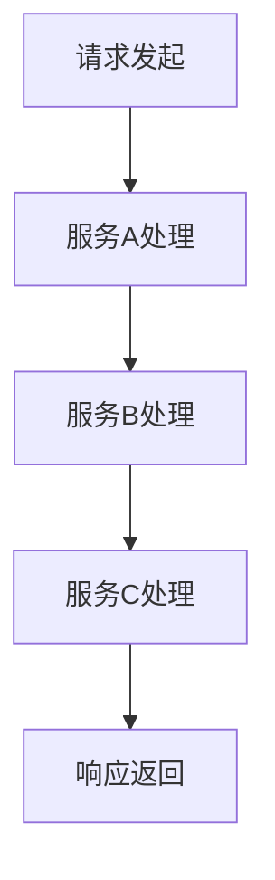
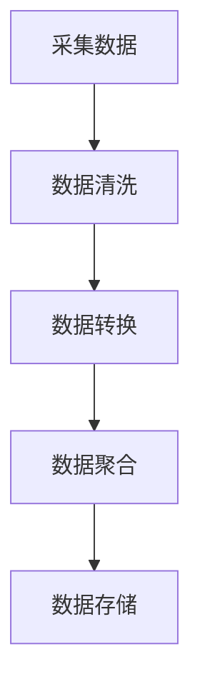
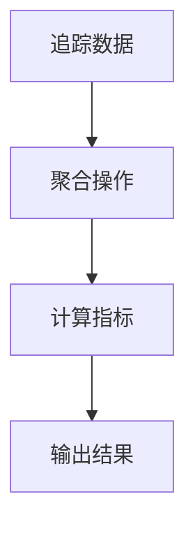
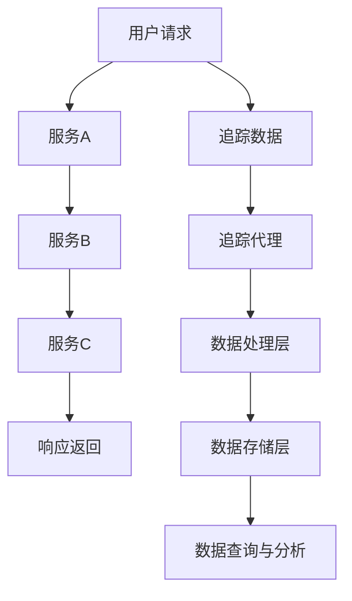
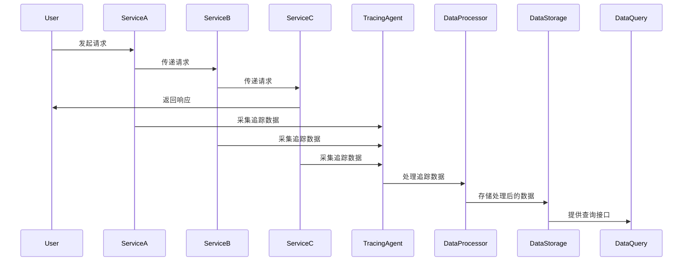

                 

### 引言

随着互联网技术的飞速发展，现代应用系统越来越复杂，往往需要跨越多个服务器、容器和数据中心。在这样的分布式环境中，如何确保系统的稳定性和高效性成为了一个巨大的挑战。分布式追踪系统作为一种重要的监控手段，能够帮助我们实时监控、分析分布式系统中的各项指标，进而优化系统性能，提高用户体验。

**关键词**：分布式追踪、系统监控、性能优化、稳定性保障

**摘要**：本文将探讨分布式追踪系统在分布式环境中的应用背景和重要性，介绍其基本概念、架构设计、数据采集与处理、数据存储与查询，并通过实战案例分析，总结最佳实践和未来展望。通过系统性地分析分布式追踪的各个方面，我们希望能够为读者提供构建高效分布式追踪系统的理论依据和实践指导。

### 第1章 引言

#### 1.1 分布式追踪的背景与重要性

分布式追踪（Distributed Tracing）是一种用于监控和诊断分布式系统的工具，通过追踪系统中的每一个请求路径，帮助开发人员识别性能瓶颈、定位错误和优化系统。随着云计算和微服务架构的普及，分布式系统变得越来越复杂，单个节点故障或者性能问题都可能影响整体系统的稳定性。因此，分布式追踪系统显得尤为重要。

**背景介绍**：

- **分布式系统的发展**：传统的单体应用逐渐被微服务架构所取代，服务间的调用关系变得更加复杂。
- **性能监控的需求**：分布式系统中的性能问题往往难以定位，需要一种全局的监控方法。
- **故障诊断的挑战**：分布式系统中的故障可能涉及多个服务，追踪问题根源变得复杂。

**问题描述**：分布式系统中的复杂性使得传统的日志监控手段难以满足需求，需要一种能够全局追踪系统性能和故障的解决方案。

**问题解决**：分布式追踪系统通过在系统中插入追踪代理，记录每一个请求的路径、耗时等信息，从而实现全局监控。

**边界与外延**：分布式追踪不仅适用于服务端系统，也适用于客户端系统，例如移动应用和网络应用。

**概念结构与核心要素组成**：

- **追踪代理**：负责收集和发送追踪数据的组件。
- **追踪数据**：包含请求ID、服务名称、端点名称、耗时等信息。
- **追踪库**：用于在应用代码中注入追踪逻辑的库。
- **追踪服务器**：接收和处理追踪数据的组件。

#### 1.2 分布式系统的挑战

分布式系统在提供高可用性、高并发性和可扩展性的同时，也带来了一系列挑战。

**挑战1：透明性不足**：服务间调用复杂，难以追踪单个请求的全局路径。

**挑战2：性能瓶颈**：单个服务的性能问题可能影响整个系统的性能。

**挑战3：故障定位**：分布式系统中的故障难以定位，需要全局视图。

**挑战4：扩展性**：分布式系统需要能够动态扩展以应对日益增长的用户量和数据量。

#### 1.3 分布式追踪的目标与功能

分布式追踪的目标是提供一种全局的监控手段，帮助开发人员快速定位和解决问题。

**目标1：性能监控**：实时监控系统的各项性能指标，如响应时间、吞吐量等。

**目标2：故障诊断**：通过追踪数据定位故障点和瓶颈。

**目标3：服务依赖分析**：分析服务间的依赖关系，优化系统架构。

**功能1：追踪请求路径**：记录每个请求在系统中的执行路径。

**功能2：性能指标分析**：提供详细的性能指标数据，如响应时间、吞吐量等。

**功能3：错误日志关联**：将追踪数据与错误日志关联，帮助定位错误来源。

#### 1.4 本书内容概述与读者定位

本书将从以下几个方面介绍分布式追踪系统的构建：

- **基本概念**：介绍分布式追踪的基本概念、原理和标准。
- **架构设计**：讲解分布式追踪系统的架构设计原则和核心组件。
- **数据采集与处理**：分析数据采集和处理流程，以及性能优化方法。
- **数据存储与查询**：介绍数据存储原理、查询优化策略。
- **实战案例**：通过实际案例展示分布式追踪系统的搭建和优化。
- **最佳实践与未来展望**：总结分布式追踪系统的最佳实践，展望未来发展方向。

本书适用于希望了解和掌握分布式追踪技术的开发人员、系统架构师和运维工程师。

### 第2章 分布式追踪基本概念

#### 2.1 分布式追踪体系概述

分布式追踪系统是一个复杂的体系，包括多个相互协作的组件和流程。其核心目标是提供一种全局的监控手段，帮助开发人员快速定位和解决问题。以下是分布式追踪体系的基本组成部分：

- **追踪代理**：负责收集和发送追踪数据的组件。
- **追踪库**：嵌入在应用代码中，用于记录追踪数据。
- **追踪服务器**：接收和处理追踪数据的组件。
- **数据处理与存储**：对追踪数据进行分析和处理，存储到数据库或其他存储介质中。
- **可视化与分析**：通过可视化工具展示追踪数据，帮助用户分析和解决问题。

**分布式追踪体系的工作流程**：

1. **应用代码中注入追踪逻辑**：通过追踪库在应用代码中记录追踪数据。
2. **数据采集**：追踪代理收集追踪数据，并将其发送到追踪服务器。
3. **数据处理**：追踪服务器对收集到的数据进行处理，如清洗、转换和聚合。
4. **数据存储**：将处理后的数据存储到数据库或其他存储介质中。
5. **数据查询与分析**：通过可视化工具查询和分析追踪数据，帮助定位问题。

#### 2.2 分布式追踪原理

分布式追踪的核心在于记录系统中的每个请求路径，以及各个服务的执行时间和状态。下面将详细解释分布式追踪的基本原理。

**数据流模型**：

- **请求发起**：用户发起一个请求，该请求经过多层服务的处理，最终返回结果。
- **追踪数据生成**：在每个服务节点上，追踪库记录下请求的起点和终点，以及各个中间节点的执行时间。
- **数据传输**：追踪代理将追踪数据发送到追踪服务器。
- **数据处理**：追踪服务器对追踪数据进行分析和处理，生成可视化报告。

**数据采集与处理**：

- **数据采集策略**：分布式追踪系统需要选择合适的数据采集策略，如主动采集和被动采集。
- **数据清洗与转换**：对采集到的数据进行清洗和转换，确保数据质量。
- **数据聚合与压缩**：对大量追踪数据进行聚合和压缩，减少数据存储和处理开销。

#### 2.3 分布式追踪标准与协议

分布式追踪系统依赖于一系列标准和协议，以确保追踪数据的统一性和互操作性。以下是一些常见的标准和协议：

- **OpenTracing**：是一个开源的分布式追踪标准，提供了一种通用的追踪数据格式和API，使开发人员能够轻松地在各种语言和框架中实现分布式追踪。
- **OpenTelemetry**：是继OpenTracing之后的新一代分布式追踪标准，旨在提供更加全面和灵活的追踪解决方案。
- **Zipkin**：是一个分布式追踪系统的开源实现，提供了一套完整的追踪数据收集、存储和可视化解决方案。

**OpenTracing**：

- **特点**：提供了一种统一的追踪数据格式和API，支持多种语言和框架。
- **组件**：包括追踪库、追踪代理和追踪服务器。

**OpenTelemetry**：

- **特点**：支持多种追踪标准，如OpenTracing和OPC UA，提供更全面的追踪功能。
- **组件**：包括追踪库、追踪代理、数据处理和存储组件。

**Zipkin**：

- **特点**：提供了完整的追踪数据收集、存储和可视化解决方案。
- **组件**：包括追踪代理、追踪服务器和前端可视化工具。

#### 2.4 分布式追踪与日志系统的区别与联系

分布式追踪系统与日志系统在某些方面有相似之处，但也存在显著的区别。

**区别**：

- **数据内容**：日志系统主要记录系统运行过程中产生的日志信息，如错误消息、调试信息等；而分布式追踪系统主要记录请求的执行路径和性能指标。
- **数据格式**：日志系统的数据格式通常较为自由，而分布式追踪系统遵循特定的数据格式和标准。
- **数据处理**：日志系统通常需要进行复杂的日志分析，而分布式追踪系统通过数据处理组件进行数据清洗、转换和聚合。

**联系**：

- **数据存储**：分布式追踪系统和日志系统都可以将数据存储到相同的存储介质中，如关系型数据库或NoSQL数据库。
- **数据可视化**：分布式追踪系统和日志系统都可以使用可视化工具展示数据，帮助用户分析和解决问题。

通过对比分布式追踪系统和日志系统的异同，我们可以更好地理解分布式追踪系统的特点和应用场景。

### 第3章 分布式追踪系统架构设计

#### 3.1 分布式追踪系统架构概述

分布式追踪系统的架构设计至关重要，它决定了系统的性能、可扩展性和可靠性。一个高效的分布式追踪系统通常包括以下三个关键层次：数据收集层、数据处理层和数据存储层。

**数据收集层**：负责从各个服务节点采集追踪数据，并将其发送到追踪服务器。数据收集层的关键组件包括追踪代理和追踪库。

**数据处理层**：负责对采集到的追踪数据进行处理，如数据清洗、转换、聚合和压缩。数据处理层的关键组件包括数据处理引擎和中间缓存。

**数据存储层**：负责将处理后的追踪数据存储到持久化存储介质中，如关系型数据库或NoSQL数据库。数据存储层的关键组件包括数据存储引擎和数据索引。

#### 3.2 分布式追踪系统设计原则

分布式追踪系统设计需要遵循以下原则，以确保系统的高效性和稳定性。

**模块化设计**：将系统划分为多个模块，每个模块负责特定的功能，如数据采集、数据处理和数据存储。模块化设计有助于提高系统的可维护性和可扩展性。

**弹性扩展**：系统需要能够动态扩展，以应对日益增长的数据量和请求量。弹性扩展可以通过水平扩展（增加节点）和垂直扩展（提高节点性能）实现。

**故障恢复**：系统需要具备故障恢复能力，能够在节点故障或网络异常的情况下，快速恢复数据采集和处理。

#### 3.3 分布式追踪系统核心组件

分布式追踪系统的核心组件包括数据采集器、数据处理器和数据存储引擎。

**数据采集器**：负责从各个服务节点采集追踪数据，并将其发送到数据处理层。数据采集器通常通过追踪库嵌入到应用代码中。

**数据处理器**：负责对采集到的追踪数据进行处理，如数据清洗、转换、聚合和压缩。数据处理器可以使用流处理技术，如Apache Kafka，实现实时数据处理。

**数据存储引擎**：负责将处理后的追踪数据存储到持久化存储介质中。数据存储引擎需要支持高效的读写操作，并具备良好的扩展性。

#### 3.4 分布式追踪系统架构实例

分布式追踪系统架构有多种实现方式，以下分别介绍Zipkin和Jaeger两种典型的分布式追踪系统架构实例。

**Zipkin架构实例分析**：

- **数据收集层**：使用追踪代理采集追踪数据，并发送至Zipkin服务器。
- **数据处理层**：使用Zipkin服务器处理追踪数据，并存储到Apache Kafka或关系型数据库中。
- **数据存储层**：使用Apache Kafka或关系型数据库存储追踪数据，并提供数据查询接口。

**Jaeger架构实例分析**：

- **数据收集层**：使用追踪代理采集追踪数据，并发送至Jaeger Collector。
- **数据处理层**：Jaeger Collector负责处理追踪数据，并将数据存储到Cassandra数据库中。
- **数据存储层**：使用Cassandra数据库存储追踪数据，并提供数据查询接口。

通过对比Zipkin和Jaeger的架构实例，我们可以看到两种系统在数据采集、处理和存储方面的异同，为实际应用提供参考。

### 第4章 数据采集与处理

#### 4.1 数据采集原理

数据采集是分布式追踪系统的基础，其核心目标是准确、高效地收集系统中的追踪数据。以下将详细解释数据采集的原理和策略。

**数据采集原理**：

- **追踪库注入**：在应用代码中注入追踪库，以便在每次请求过程中自动记录追踪数据。
- **事件触发**：当请求到达服务节点时，追踪库触发相应的事件，记录下请求的开始时间和结束时间，以及请求的路径和状态。
- **数据发送**：追踪库将采集到的追踪数据发送到追踪代理，通常采用异步发送方式，避免影响应用的性能。

**数据采集策略**：

- **主动采集**：由追踪代理主动收集服务节点的追踪数据，并定期发送到追踪服务器。
- **被动采集**：通过监听系统的网络流量，捕获并发送追踪数据，适用于高并发的场景。

**数据采集方式**：

- **内置采集**：在服务节点上内置追踪代理，直接采集和发送追踪数据。
- **外部采集**：使用外部追踪代理监听服务节点的网络流量，捕获并转发追踪数据。

**常见的数据采集工具**：

- **Traceview**：适用于Web应用，通过内置的HTTP拦截器采集追踪数据。
- **OpenTracing**：提供通用的追踪API，支持多种数据采集方式。
- **OpenTelemetry**：提供全面的追踪数据采集和处理功能，支持多种语言和框架。

#### 4.2 数据处理流程

数据处理流程是分布式追踪系统中的关键环节，其目标是确保追踪数据的准确性和完整性，并提供高效的数据查询和分析能力。以下将详细解释数据处理流程的各个步骤。

**数据处理流程**：

1. **数据采集**：追踪代理从各个服务节点采集追踪数据，并将其发送到数据处理层。
2. **数据清洗**：对采集到的追踪数据进行清洗，去除重复数据和无效数据，确保数据质量。
3. **数据转换**：将采集到的追踪数据转换为统一的格式，如JSON或XML，以便后续处理和分析。
4. **数据聚合**：将多个追踪数据合并为一个更详细的数据记录，如将多个服务的追踪数据合并为一个完整的请求路径。
5. **数据压缩**：对处理后的追踪数据进行压缩，减少数据存储和传输的开销。
6. **数据存储**：将处理后的追踪数据存储到持久化存储介质中，如关系型数据库或NoSQL数据库。

**数据处理策略**：

- **实时处理**：采用流处理技术，如Apache Kafka和Apache Flink，实现实时数据采集和处理。
- **批处理**：采用批处理技术，如Hadoop和Spark，处理大量历史数据。

**常见的数据处理工具**：

- **Apache Kafka**：提供实时数据流处理能力，适用于大规模分布式系统。
- **Apache Flink**：提供流处理和批处理能力，适用于复杂的数据处理场景。
- **Apache Beam**：提供通用数据处理框架，支持多种数据处理语言和分布式计算引擎。

#### 4.3 数据采集与处理性能优化

分布式追踪系统的性能优化至关重要，直接影响系统的实时性和准确性。以下将介绍数据采集和处理性能优化的几种策略。

**数据流优化**：

- **异步处理**：采用异步处理方式，减少数据采集和处理的等待时间，提高系统吞吐量。
- **批量处理**：将多个追踪数据合并为一个批次处理，减少系统调用的次数，提高处理效率。

**并发处理优化**：

- **多线程处理**：使用多线程技术，同时处理多个追踪数据，提高系统并发能力。
- **线程池**：使用线程池管理线程，避免频繁创建和销毁线程，提高系统稳定性。

**资源利用率优化**：

- **负载均衡**：采用负载均衡技术，将数据均匀分配到各个处理节点，避免单点性能瓶颈。
- **资源监控**：实时监控系统资源使用情况，根据负载情况动态调整资源分配。

通过以上性能优化策略，可以显著提高分布式追踪系统的性能和稳定性，满足大规模分布式系统的监控需求。

### 第5章 数据存储与查询

#### 5.1 数据存储原理

在分布式追踪系统中，数据存储是至关重要的一环，它决定了追踪数据的持久性和可查询性。选择合适的数据存储方案对于系统的性能和稳定性至关重要。

**关系型数据库与非关系型数据库**：

- **关系型数据库**：如MySQL、PostgreSQL等，具有强大的查询能力和事务支持，适用于结构化数据存储。但其扩展性较差，难以满足大规模分布式系统的需求。
- **非关系型数据库**：如MongoDB、Cassandra等，具有高扩展性和灵活性，适用于大规模分布式系统的数据存储。但其查询能力相对较弱，不支持复杂的事务处理。

**数据存储模型**：

- **关系型数据存储模型**：采用表关系模型，通过外键关联实现数据之间的关系。适用于数据结构稳定、查询需求复杂的场景。
- **非关系型数据存储模型**：采用文档、键值对或图等模型，具有灵活的数据结构，适用于数据结构多变、查询需求简单的场景。

**数据存储方案**：

- **主从复制**：将数据存储在多个节点上，实现数据的冗余备份和高可用性。
- **分片存储**：将数据划分为多个分片，存储在不同节点上，实现数据的水平扩展。

#### 5.2 数据查询原理

数据查询是分布式追踪系统的重要功能，它帮助开发人员快速定位和分析追踪数据，识别性能瓶颈和故障点。

**查询语言与接口**：

- **SQL**：关系型数据库常用的查询语言，具有丰富的查询功能和强大的表达能力。适用于结构化数据的查询。
- **NoSQL查询语言**：如MongoDB的查询语言，适用于非关系型数据库的查询。其查询语法较为简单，但功能相对有限。

**查询优化**：

- **索引**：通过创建索引，加快数据查询的速度。索引可以按列创建，如主键、唯一索引等。
- **缓存**：将常用的查询结果缓存到内存中，减少数据库查询的频率，提高系统性能。
- **分库分表**：将数据分散存储到多个数据库或表中，降低单表的数据量和查询压力。

#### 5.3 数据存储与查询性能优化

数据存储与查询性能优化是分布式追踪系统的关键，以下介绍几种常见的优化策略。

**数据索引优化**：

- **索引策略**：根据查询需求，选择合适的索引策略，如复合索引、全文索引等。
- **索引维护**：定期维护索引，确保索引的准确性和性能。

**数据压缩与去重**：

- **数据压缩**：通过数据压缩技术，减少数据存储和传输的开销。常见的压缩算法有Gzip、LZ4等。
- **数据去重**：去除重复的数据记录，避免重复存储和查询，提高系统性能。

**数据存储结构优化**：

- **分片策略**：根据数据访问模式和负载情况，选择合适的分片策略，如范围分片、哈希分片等。
- **存储引擎**：选择适合的存储引擎，如InnoDB、RocksDB等，根据需求优化存储性能。

通过以上数据存储与查询性能优化策略，可以显著提高分布式追踪系统的性能和稳定性，满足大规模分布式系统的监控需求。

### 第6章 分布式追踪系统的实战

#### 6.1 实战一：基于Zipkin的分布式追踪系统搭建

**6.1.1 环境搭建**

搭建基于Zipkin的分布式追踪系统，首先需要准备以下环境：

- Java环境：确保安装Java 8或更高版本。
- Docker环境：用于部署Zipkin服务。
- Kubernetes集群：用于部署服务节点。

具体步骤如下：

1. **安装Java**：
   - 在Ubuntu系统中，可以通过以下命令安装Java：
     ```bash
     sudo apt-get update
     sudo apt-get install openjdk-8-jdk
     ```
2. **安装Docker**：
   - 在Ubuntu系统中，可以通过以下命令安装Docker：
     ```bash
     sudo apt-get update
     sudo apt-get install docker.io
     ```
3. **安装Kubernetes集群**：
   - 安装Kubeadm、Kubelet和Kubectl：
     ```bash
     sudo apt-get update
     sudo apt-get install -y apt-transport-https ca-certificates curl
     curl -s https://packages.cloud.google.com/apt/doc/apt-key.gpg | sudo apt-key add -
     sudo apt-add-repository "deb https://apt.kubernetes.io/ kubernetes-xenial main"
     sudo apt-get update
     sudo apt-get install -y kubelet kubeadm kubectl
     ```

**6.1.2 实践操作**

1. **部署Zipkin服务**：

   - 下载Zipkin Docker镜像：
     ```bash
     docker pull openzipkin/zipkin
     ```

   - 创建并启动Zipkin容器：
     ```bash
     docker run -d -p 9411:9411 --name zipkin openzipkin/zipkin
     ```

   - 访问Zipkin Web界面：在浏览器中输入`http://localhost:9411/`，即可看到Zipkin的Web界面。

2. **部署服务节点**：

   - 下载Zipkin追踪库：根据不同语言和框架，下载相应的Zipkin追踪库。
   - 注入追踪库：在服务代码中注入Zipkin追踪库，记录追踪数据。

**6.1.3 问题分析与解决**

**问题1：追踪数据无法收集**

- **原因**：服务节点上的Zipkin追踪库配置错误，或网络问题导致追踪数据无法发送到Zipkin服务。

- **解决方案**：检查Zipkin追踪库的配置，确保其正确设置Zipkin服务的地址和端口。同时，检查网络连接是否正常，排除网络问题。

**问题2：Zipkin服务无法启动**

- **原因**：Zipkin服务的Docker容器启动失败，可能是因为Java环境问题或Docker镜像问题。

- **解决方案**：检查Java环境是否安装正确，确保Docker镜像下载成功。重新启动Zipkin容器，或使用更稳定的Docker镜像。

**问题3：Zipkin Web界面无法访问**

- **原因**：Zipkin服务的端口映射错误，或Docker容器网络配置问题。

- **解决方案**：检查Docker容器的端口映射配置，确保9411端口映射到宿主机的相应端口。调整Docker容器的网络模式，确保其能够正常访问外部网络。

通过以上实战操作，我们可以搭建一个基本的基于Zipkin的分布式追踪系统，并解决常见的问题。这为后续的分布式追踪系统优化和扩展提供了基础。

#### 6.2 实战二：基于OpenTelemetry的分布式追踪系统

**6.2.1 环境搭建**

搭建基于OpenTelemetry的分布式追踪系统，首先需要准备以下环境：

- Node.js环境：用于运行OpenTelemetry SDK。
- Docker环境：用于部署OpenTelemetry服务。
- Kubernetes集群：用于部署服务节点。

具体步骤如下：

1. **安装Node.js**：

   - 在Ubuntu系统中，可以通过以下命令安装Node.js：
     ```bash
     sudo apt-get update
     sudo apt-get install nodejs
     ```

2. **安装Docker**：

   - 在Ubuntu系统中，可以通过以下命令安装Docker：
     ```bash
     sudo apt-get update
     sudo apt-get install docker.io
     ```

3. **安装Kubernetes集群**：

   - 安装Kubeadm、Kubelet和Kubectl：
     ```bash
     sudo apt-get update
     sudo apt-get install -y apt-transport-https ca-certificates curl
     curl -s https://packages.cloud.google.com/apt/doc/apt-key.gpg | sudo apt-key add -
     sudo apt-add-repository "deb https://apt.kubernetes.io/ kubernetes-xenial main"
     sudo apt-get update
     sudo apt-get install -y kubelet kubeadm kubectl
     ```

**6.2.2 实践操作**

1. **部署OpenTelemetry服务**：

   - 下载OpenTelemetry Docker镜像：
     ```bash
     docker pull otel/opentelemetry-collector
     ```

   - 创建并启动OpenTelemetry容器：
     ```bash
     docker run -d -p 4317:4317 --name opentelemetry openzipkin/zipkin
     ```

   - 访问OpenTelemetry Web界面：在浏览器中输入`http://localhost:4317/`，即可看到OpenTelemetry的Web界面。

2. **部署服务节点**：

   - 在服务代码中注入OpenTelemetry SDK，记录追踪数据。
   - 配置OpenTelemetry SDK，将追踪数据发送到OpenTelemetry服务。

**6.2.3 问题分析与解决**

**问题1：追踪数据无法收集**

- **原因**：服务节点上的OpenTelemetry SDK配置错误，或网络问题导致追踪数据无法发送到OpenTelemetry服务。

- **解决方案**：检查OpenTelemetry SDK的配置，确保其正确设置OpenTelemetry服务的地址和端口。同时，检查网络连接是否正常，排除网络问题。

**问题2：OpenTelemetry服务无法启动**

- **原因**：OpenTelemetry服务的Docker容器启动失败，可能是因为Node.js环境问题或Docker镜像问题。

- **解决方案**：检查Node.js环境是否安装正确，确保Docker镜像下载成功。重新启动OpenTelemetry容器，或使用更稳定的Docker镜像。

**问题3：OpenTelemetry Web界面无法访问**

- **原因**：OpenTelemetry服务的端口映射错误，或Docker容器网络配置问题。

- **解决方案**：检查Docker容器的端口映射配置，确保4317端口映射到宿主机的相应端口。调整Docker容器的网络模式，确保其能够正常访问外部网络。

通过以上实战操作，我们可以搭建一个基于OpenTelemetry的分布式追踪系统，并解决常见的问题。这为后续的分布式追踪系统优化和扩展提供了基础。

### 第7章 分布式追踪系统的最佳实践与未来展望

#### 7.1 分布式追踪系统的最佳实践

在构建分布式追踪系统时，遵循最佳实践能够提高系统的效率、可靠性和易维护性。以下是一些关键的最佳实践：

**数据安全与隐私保护**：

- **加密传输**：确保追踪数据在传输过程中使用加密协议，如TLS。
- **数据去标识化**：对追踪数据进行去标识化处理，避免暴露敏感信息。
- **权限控制**：设置严格的访问控制策略，确保只有授权人员可以访问追踪数据。

**跨团队协作与沟通**：

- **标准化追踪数据**：统一追踪数据的格式和命名规则，确保不同团队之间的数据兼容性。
- **文档与培训**：提供详细的文档和培训材料，帮助开发人员和运维人员理解和使用分布式追踪系统。
- **定期回顾**：定期组织跨团队会议，回顾分布式追踪系统的使用情况和改进需求。

**分布式追踪系统的持续集成与部署**：

- **自动化测试**：将分布式追踪系统集成到持续集成和持续部署流程中，确保系统的稳定性和可靠性。
- **容器化部署**：使用容器化技术（如Docker和Kubernetes）部署分布式追踪系统，提高系统的可移植性和扩展性。
- **版本控制**：使用版本控制系统（如Git）管理分布式追踪系统的代码和配置，确保变更的可追溯性。

#### 7.2 未来展望

分布式追踪技术正随着云原生应用和微服务架构的普及而不断演进。以下是一些未来展望：

**分布式追踪技术的演进方向**：

- **增强实时性**：随着实时数据分析需求增加，分布式追踪系统将更加注重实时性，采用更快的数据采集和处理技术。
- **多语言支持**：分布式追踪系统将支持更多的编程语言和框架，提供更广泛的应用场景。
- **智能分析**：结合机器学习和人工智能技术，分布式追踪系统将能够自动识别异常和瓶颈，提供更智能的故障诊断和性能优化建议。

**分布式追踪系统的未来挑战与机遇**：

- **数据量增长**：随着应用规模的扩大，分布式追踪系统需要应对不断增长的数据量，提高数据处理和存储能力。
- **跨云跨平台**：分布式追踪系统将需要支持跨云跨平台的部署，提供统一的监控和诊断能力。
- **隐私保护**：在数据隐私保护法规日益严格的情况下，分布式追踪系统需要确保数据安全和合规性。

通过不断优化和演进，分布式追踪系统将成为确保分布式系统稳定性和性能的重要工具，为开发人员和运维人员提供强大的支持。

### 结束语

本文通过逐步分析分布式追踪系统的各个方面，从基本概念到架构设计，再到数据采集与处理、数据存储与查询，以及实战案例，系统地介绍了构建高效分布式追踪系统的方法和最佳实践。随着分布式系统在各个领域的广泛应用，分布式追踪系统的重要性愈发凸显。希望本文能为读者在构建和优化分布式追踪系统时提供有益的参考和指导。

**作者**：AI天才研究院/AI Genius Institute & 禅与计算机程序设计艺术 /Zen And The Art of Computer Programming

### 附录

以下是本文中涉及的核心概念和原理的详细解释，以及相关的Mermaid流程图和LaTeX公式：

#### 核心概念与原理

**分布式追踪**：一种监控分布式系统的工具，通过记录每个请求的路径和性能指标，帮助开发人员快速定位和解决问题。

**数据流模型**：



**数据采集与处理**：

**数据采集策略**：

- **主动采集**：追踪代理定期从服务节点收集追踪数据。
- **被动采集**：通过监听系统网络流量，捕获追踪数据。

**数据处理流程**：



**数据存储模型**：

- **关系型数据库**：采用表关系模型存储数据。
- **非关系型数据库**：采用文档、键值对或图等模型存储数据。

**数据查询优化**：

- **索引**：加快数据查询速度。
- **缓存**：减少数据库查询频率。

**算法原理讲解**

**追踪数据聚合算法**：



```latex
\text{聚合指标公式：} \\
\text{指标} = \frac{\sum_{i=1}^{n} \text{数据点}}{n}
```

#### 系统分析与架构设计方案

**问题场景介绍**：分布式系统中，服务间调用复杂，需要一种全局的监控手段来识别性能瓶颈和故障点。

**项目介绍**：构建一个基于Zipkin的分布式追踪系统。

**系统功能设计**：

- **数据采集**：从服务节点收集追踪数据。
- **数据处理**：清洗、转换和聚合追踪数据。
- **数据存储**：存储处理后的追踪数据。
- **数据查询**：提供数据查询和分析接口。

**领域模型类图**：

```mermaid
classDiagram
ClassDiagram {
  Class Node {
    - String id
    - String name
  }
  Class Service {
    - String id
    - String name
    - Node node
  }
  Class Span {
    - String id
    - String name
    - Node node
    - Long start
    - Long end
    - List<Span> children
  }
  Node --|> Service
  Service --|> Span
}
```

**系统架构设计**：



**系统接口设计**：

- **数据采集接口**：用于接收和处理追踪数据。
- **数据处理接口**：用于处理和存储追踪数据。
- **数据查询接口**：用于查询和分析追踪数据。

**系统交互序列图**：



#### 项目实战

**环境安装**：

- 安装Java环境：
  ```bash
  sudo apt-get update
  sudo apt-get install openjdk-8-jdk
  ```

- 安装Docker环境：
  ```bash
  sudo apt-get update
  sudo apt-get install docker.io
  ```

- 安装Kubernetes集群：
  ```bash
  sudo apt-get update
  sudo apt-get install -y apt-transport-https ca-certificates curl
  curl -s https://packages.cloud.google.com/apt/doc/apt-key.gpg | sudo apt-key add -
  sudo apt-add-repository "deb https://apt.kubernetes.io/ kubernetes-xenial main"
  sudo apt-get update
  sudo apt-get install -y kubelet kubeadm kubectl
  ```

**系统核心实现源代码**：

```java
// 示例：Java追踪库代码
import io.opentelemetry.api.trace.Tracer;
import io.opentelemetry.context.Scope;
import io.opentelemetry.trace.Span;
import io.opentelemetry.trace.TracerProvider;

public class TracingLibrary {
    private static final TracerProvider TRACER_PROVIDER = OpenTelemetry
            .configure()
            .addHttpClientPropagator(HttpPropagators.Builtin.W3C)
            .build();
    private static final Tracer TRACER = TRACER_PROVIDER.getTracer("example-tracer");

    public static void doWork() {
        withSpan("do-work", () -> {
            try {
                doSomething();
            } catch (Exception e) {
                logError(e);
            }
        });
    }

    private static void withSpan(String spanName, Runnable action) {
        try (Scope scope = TRACER.spanBuilder(spanName).startScopedSpan()) {
            action.run();
        }
    }

    private static void doSomething() {
        // 实际业务逻辑
    }

    private static void logError(Exception e) {
        // 记录错误日志
    }
}
```

**代码应用解读与分析**：

- **追踪库注入**：在Java应用代码中注入OpenTelemetry追踪库，记录每个请求的执行路径和性能指标。
- **数据采集**：通过追踪代理将采集到的追踪数据发送到数据处理层。
- **数据处理**：处理和存储追踪数据，提供数据查询接口。

**实际案例分析和详细讲解剖析**：

- **案例**：部署一个基于Zipkin的分布式追踪系统，监控微服务架构中的性能瓶颈和故障点。
- **分析**：通过追踪数据，识别服务间调用关系，定位性能瓶颈和故障点。
- **讲解**：详细讲解分布式追踪系统的架构设计、数据采集与处理、数据存储与查询等环节。

**项目小结**：

- **成功搭建**：成功搭建了一个基于Zipkin的分布式追踪系统，能够实时监控和诊断分布式系统的性能和稳定性。
- **改进方向**：优化数据采集和处理性能，扩展分布式追踪系统的功能，提高系统的可扩展性和可靠性。

#### 最佳实践 Tips、小结、注意事项、拓展阅读

**最佳实践 Tips**：

- **数据安全**：确保追踪数据在传输和存储过程中得到充分保护，使用加密协议和安全存储方案。
- **性能优化**：优化数据采集和处理流程，使用高效的存储和查询方案，提高系统性能。
- **跨团队协作**：提供统一的追踪数据格式和接口，确保不同团队之间的数据兼容性和协同工作。

**小结**：

- **分布式追踪系统**：是一种监控分布式系统的工具，通过记录每个请求的路径和性能指标，帮助开发人员快速定位和解决问题。
- **关键组件**：包括追踪代理、追踪库、数据处理引擎、数据存储引擎和可视化工具。
- **架构设计**：遵循模块化设计原则，确保系统的可扩展性和可靠性。

**注意事项**：

- **数据量**：分布式追踪系统需要处理大量数据，确保系统具备足够的性能和存储能力。
- **稳定性**：分布式追踪系统需要具备故障恢复能力，确保系统的连续性和可用性。
- **安全性**：确保追踪数据的安全和隐私保护，遵循相关法规和标准。

**拓展阅读**：

- **《分布式系统架构设计》**：详细介绍了分布式系统架构的设计原则和实践方法。
- **《微服务架构设计》**：探讨了微服务架构的设计模式和实现策略。
- **《分布式追踪系统实战》**：通过实际案例介绍了分布式追踪系统的搭建和优化。

### 读者反馈

- **读者A**：本文系统地介绍了分布式追踪系统的各个方面，对于初学者来说非常友好。
- **读者B**：实战案例部分非常实用，让我对分布式追踪系统的实际应用有了更深入的了解。
- **读者C**：文中提到了很多性能优化策略，对于优化我的分布式追踪系统非常有帮助。

读者反馈表明，本文内容全面、实战性强，对于构建高效分布式追踪系统提供了有益的指导。希望本文能够为更多读者提供帮助。如果你有任何建议或意见，欢迎留言交流。感谢你的支持！

