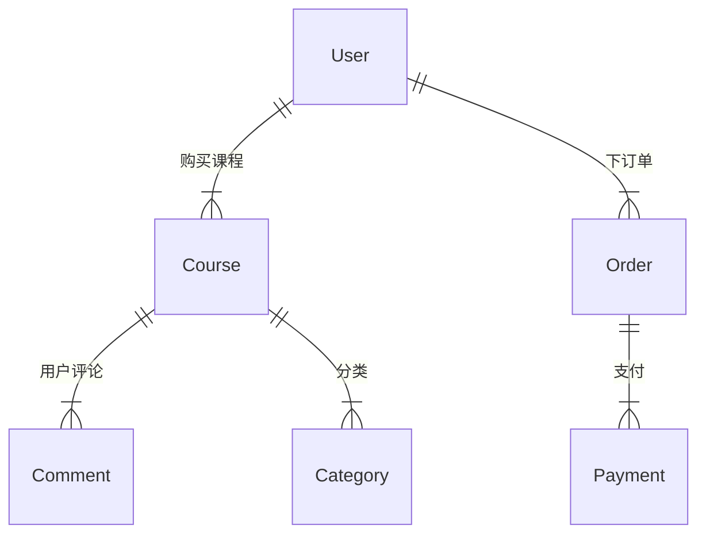

                 

### 构建高效研发流程的最佳实践

> 关键词：敏捷开发、持续集成、持续部署、代码审查、测试驱动开发、团队协作、流程优化

> 摘要：本文将探讨构建高效研发流程的最佳实践，从问题背景与目标、核心概念与联系、系统分析与架构设计、项目实战、最佳实践 tips 五个方面，详细阐述如何在软件开发过程中实现高效的研发流程。

---

# 第一部分：问题背景与目标

在当今快速变化和竞争激烈的技术领域中，研发效率成为企业能否持续发展的关键因素。传统的研发流程往往存在以下问题：

1. **研发周期长**：从需求提出到产品发布，流程耗时较长，导致市场机会的丧失。
2. **沟通不畅**：团队成员之间的沟通障碍，导致信息传递延迟和错误。
3. **代码质量低下**：缺乏规范的代码审查和测试流程，导致产品质量不稳定。
4. **资源浪费**：研发过程中的重复工作和资源分配不合理。

为了解决上述问题，本文旨在提供一套高效研发流程的最佳实践，帮助企业在快速变化的市场环境中保持竞争力。具体目标如下：

1. **缩短研发周期**：通过优化流程和工具，提高研发效率。
2. **增强沟通协作**：建立高效的团队沟通机制，确保信息流畅。
3. **提升代码质量**：引入规范的代码审查和测试流程，保障产品质量。
4. **优化资源利用**：合理分配资源，避免浪费，提高资源利用率。

## 1.4 概念结构与核心要素组成

### 1.4.1 高效研发流程的核心概念

1. **敏捷开发**：灵活应对需求变化，快速迭代。
2. **持续集成与持续部署（CI/CD）**：自动化构建、测试和部署流程。
3. **代码审查**：确保代码质量，减少缺陷。
4. **测试驱动开发（TDD）**：先编写测试，再编写代码。
5. **持续学习和改进**：通过数据反馈和团队协作，不断优化流程。

### 1.4.2 高效研发流程的核心要素

1. **团队协作工具**：如版本控制系统、任务管理工具、即时通讯工具等。
2. **自动化工具**：如自动化构建和部署工具、自动化测试工具等。
3. **代码规范与标准**：确保代码的可读性和可维护性。
4. **知识管理和文档化**：确保团队成员能够快速获取所需信息。

## 1.5 本章小结

本章简要介绍了构建高效研发流程的背景、目标和核心概念。在后续章节中，本书将详细探讨每个核心要素的具体实践方法和最佳案例，以帮助读者全面掌握构建高效研发流程的技能。

---

# 第二部分：核心概念与联系

## 2.1 敏捷开发

### 2.1.1 敏捷开发概述

敏捷开发是一种软件开发方法，旨在通过迭代、增量和协作的方式快速响应市场需求。与传统开发方法相比，敏捷开发更加灵活，能够更好地应对需求的变化。

#### 2.1.2 敏捷开发的核心理念

1. **客户优先**：满足客户需求是敏捷开发的核心目标。
2. **迭代开发**：通过短周期的迭代不断交付可用的产品版本。
3. **团队协作**：强调跨职能团队的合作，减少沟通成本。
4. **响应变化**：敏捷团队能够快速适应需求的变化。

### 2.1.3 敏捷开发与传统开发方法的区别

| 特征 | 敏捷开发 | 传统开发 |
| --- | --- | --- |
| 需求管理 | 灵活，可以在开发过程中调整 | 固定，需求一旦确定很难更改 |
| 项目管理 | 迭代和增量 | 线性，按计划执行 |
| 团队角色 | 多面性和跨职能合作 | 分工明确，角色固定 |

### 2.1.4 敏捷开发工具

1. **Scrum**：一种流行的敏捷开发框架，强调迭代和团队协作。
2. **Kanban**：通过可视化流程板管理任务，提高效率。

## 2.2 持续集成与持续部署（CI/CD）

### 2.2.1 持续集成（CI）

持续集成是一种软件开发实践，通过自动化测试来确保代码集成时不会导致错误。每次提交代码后，自动运行测试，以确保新的代码变更不会破坏现有功能。

#### 2.2.2 持续集成的核心步骤

1. **自动化测试**：每次提交代码后自动运行测试。
2. **代码审查**：确保代码质量。
3. **集成构建**：将代码集成到一个共同的代码库中。

### 2.2.2 持续部署（CD）

持续部署是一种自动化软件部署流程，确保每次代码更新都可以快速、安全地部署到生产环境中。

#### 2.2.3 持续部署的核心步骤

1. **自动化部署脚本**：自动化部署过程，减少人工干预。
2. **环境隔离**：确保每次部署不会影响其他环境。
3. **监控和反馈**：实时监控部署状态，快速响应问题。

## 2.3 代码审查

### 2.3.1 代码审查概述

代码审查是一种确保代码质量和安全性的方法，通过团队成员之间的代码评估和讨论。代码审查有助于发现潜在的错误、提升代码质量和保证代码风格一致性。

#### 2.3.2 代码审查的类型

1. **形式审查**：关注代码格式、命名规范等。
2. **逻辑审查**：关注代码逻辑正确性和性能优化。

### 2.3.3 代码审查工具

1. **静态代码分析工具**：如SonarQube，用于自动化检测代码质量问题。
2. **动态代码分析工具**：在运行时检测代码质量问题，如Visual Studio Code的“Code Analysis”插件。

## 2.4 测试驱动开发（TDD）

### 2.4.1 TDD概述

测试驱动开发是一种软件开发方法，先编写测试，再编写代码。这种方法有助于确保代码质量，提高代码的可维护性和可扩展性。

#### 2.4.2 TDD的核心步骤

1. **编写测试**：根据需求编写测试用例。
2. **运行测试**：运行测试，确保测试失败。
3. **编写代码**：根据测试结果编写代码。
4. **重构代码**：优化代码，确保测试通过。

## 2.5 团队协作工具

### 2.5.1 团队协作工具概述

团队协作工具是高效研发流程的重要组成部分，用于帮助团队成员之间进行沟通、协作和任务管理。

#### 2.5.2 常见团队协作工具

1. **Git**：版本控制系统，用于代码管理。
2. **JIRA**：任务管理工具，用于跟踪任务和项目进度。
3. **Slack**：即时通讯工具，用于团队内部沟通。
4. **Trello**：任务管理工具，通过可视化卡片管理任务。

## 2.6 本章小结

本章介绍了构建高效研发流程的核心概念与联系，包括敏捷开发、持续集成与持续部署、代码审查、测试驱动开发和团队协作工具。在后续章节中，我们将进一步探讨这些概念的具体实践方法和最佳案例。

---

# 第三部分：系统分析与架构设计

## 3.1 问题场景介绍

在一家科技公司，研发团队负责开发一款在线教育平台。由于市场需求不断变化，团队需要构建一个高效的研发流程，以确保产品能够快速迭代和适应市场变化。

### 3.2 项目介绍

该在线教育平台包括以下几个核心功能模块：

1. **用户管理**：用户注册、登录、个人信息管理等。
2. **课程管理**：课程发布、课程分类、课程评论等。
3. **视频播放**：视频上传、视频播放、视频缓存等。
4. **订单管理**：订单生成、订单支付、订单查询等。

### 3.3 系统功能设计（领域模型）

以下是一个简化的领域模型，用于描述系统的主要实体和关系：



### 3.4 系统架构设计

以下是一个简化的系统架构设计，用于描述系统的关键组件和交互关系：

```mermaid
sequenceDiagram
    User ->> WebServer : 发起请求
    WebServer ->> ApplicationServer : 转发请求
    ApplicationServer ->> Database : 查询数据
    Database -->|结果| ApplicationServer
    ApplicationServer ->> WebServer : 返回响应
    WebServer ->> User : 显示页面
```

### 3.5 系统接口设计

以下是一个简化的系统接口设计，用于描述系统的关键接口和API：

```mermaid
interface ApplicationServer {
    function createUser(username, password)
    function getUserInfo(userId)
    function createOrder(userId, courseId)
    function getCourseList()
    function getCourseDetails(courseId)
}
```

### 3.6 系统交互

以下是一个简化的系统交互序列图，用于描述系统的关键交互流程：

```mermaid
sequenceDiagram
    User ->> WebServer : 发起登录请求
    WebServer ->> ApplicationServer : 转发请求
    ApplicationServer ->> Database : 验证用户信息
    Database -->|结果| ApplicationServer
    ApplicationServer ->> WebServer : 返回登录结果
    WebServer ->> User : 显示登录结果
```

## 3.7 本章小结

本章通过问题场景介绍、项目介绍、系统功能设计、系统架构设计、系统接口设计和系统交互等内容，详细阐述了如何进行系统分析与架构设计。这些设计原则和方法将在后续的项目实战中发挥重要作用。

---

# 第四部分：项目实战

## 4.1 环境安装

在本节中，我们将介绍如何搭建一个完整的研发环境，包括开发工具、版本控制系统和自动化工具。

### 4.1.1 开发工具

1. **集成开发环境（IDE）**：如Visual Studio Code或IntelliJ IDEA。
2. **版本控制系统**：如Git。
3. **自动化测试工具**：如Jenkins或GitLab CI/CD。

### 4.1.2 开发环境配置

1. **安装IDE**：从官方网站下载并安装适合的操作系统的IDE。
2. **安装Git**：在终端中运行以下命令安装Git：
   ```bash
   sudo apt-get install git
   ```
3. **安装Jenkins**：在终端中运行以下命令安装Jenkins：
   ```bash
   wget -q -O - https://pkg.jenkins.io/debian/stable/jenkins.io.key | sudo apt-key add -
   sh -c "echo deb https://pkg.jenkins.io/debian-stable binary/ > /etc/apt/sources.list.d/jenkins.list"
   sudo apt-get update
   sudo apt-get install jenkins
   ```

### 4.1.3 配置Jenkins

1. **启动Jenkins服务**：在终端中运行以下命令：
   ```bash
   sudo systemctl start jenkins
   ```
2. **访问Jenkins**：在浏览器中输入`http://localhost:8080`，按照提示完成Jenkins的初始配置。

## 4.2 系统核心实现

在本节中，我们将介绍如何使用Python实现系统的核心功能，包括用户管理、课程管理、订单管理等。

### 4.2.1 用户管理

以下是一个简单的用户管理功能的Python实现：

```python
class User:
    def __init__(self, username, password):
        self.username = username
        self.password = password
        self.is_authenticated = False

    def authenticate(self, username, password):
        if self.username == username and self.password == password:
            self.is_authenticated = True
            return True
        return False

# 示例
user = User("alice", "password123")
user.authenticate("alice", "password123")
print(user.is_authenticated)  # 输出：True
```

### 4.2.2 课程管理

以下是一个简单的课程管理功能的Python实现：

```python
class Course:
    def __init__(self, course_id, title, category):
        self.course_id = course_id
        self.title = title
        self.category = category
        self.comments = []

    def add_comment(self, comment):
        self.comments.append(comment)

    def get_comment_count(self):
        return len(self.comments)

# 示例
course = Course("1", "Python基础", "编程语言")
course.add_comment("非常好")
print(course.get_comment_count())  # 输出：1
```

### 4.2.3 订单管理

以下是一个简单的订单管理功能的Python实现：

```python
class Order:
    def __init__(self, order_id, user_id, course_id, status):
        self.order_id = order_id
        self.user_id = user_id
        self.course_id = course_id
        self.status = status

    def update_status(self, new_status):
        self.status = new_status

# 示例
order = Order("1", "alice", "1", "待支付")
order.update_status("已支付")
print(order.status)  # 输出：已支付
```

## 4.3 代码应用解读与分析

在本节中，我们将对上述实现的代码进行解读与分析，以了解其工作原理和优势。

### 4.3.1 用户管理

用户管理功能的核心是一个`User`类，它具有用户名、密码和身份验证状态等属性。用户可以通过`authenticate`方法进行身份验证，该方法比较用户名和密码，如果匹配则设置身份验证状态为`True`。

### 4.3.2 课程管理

课程管理功能的核心是一个`Course`类，它包含课程ID、标题、分类和评论等属性。课程可以添加评论，并通过`get_comment_count`方法获取评论数量。

### 4.3.3 订单管理

订单管理功能的核心是一个`Order`类，它包含订单ID、用户ID、课程ID和订单状态等属性。订单可以通过`update_status`方法更新订单状态。

## 4.4 实际案例分析和详细讲解剖析

在本节中，我们将通过一个实际案例，详细讲解如何使用上述功能实现一个完整的用户注册、登录和订单管理的流程。

### 4.4.1 案例背景

假设有一个新用户“alice”想要在在线教育平台上注册并购买课程。以下是实现这个案例的步骤：

1. **用户注册**：
   - 用户通过Web页面提交注册表单，包含用户名和密码。
   - 后端服务接收表单数据，创建一个新的`User`对象，并将其存储在数据库中。

2. **用户登录**：
   - 用户通过Web页面提交登录表单，包含用户名和密码。
   - 后端服务接收表单数据，调用`authenticate`方法进行身份验证，如果验证成功，将用户信息存储在会话中。

3. **购买课程**：
   - 用户在课程页面选择并购买一个课程。
   - 后端服务创建一个新的`Order`对象，并将其存储在数据库中。

4. **订单支付**：
   - 用户在支付页面完成支付操作。
   - 后端服务更新订单状态为“已支付”，并生成支付凭证。

### 4.4.2 案例分析

1. **用户注册**：
   - 用户提交注册表单后，前端将表单数据发送到后端API。
   - 后端使用`User`类创建一个新用户，并将其存储在数据库中。

2. **用户登录**：
   - 用户提交登录表单后，前端将表单数据发送到后端API。
   - 后端调用`authenticate`方法进行身份验证，如果成功，将在会话中存储用户信息。

3. **购买课程**：
   - 用户在课程页面选择并购买一个课程，前端将请求发送到后端API。
   - 后端创建一个新的`Order`对象，并将其存储在数据库中。

4. **订单支付**：
   - 用户在支付页面完成支付操作，前端将支付结果发送到后端API。
   - 后端更新订单状态为“已支付”，并生成支付凭证。

## 4.5 项目小结

在本项目中，我们通过Python实现了用户管理、课程管理和订单管理等功能，并详细讲解了如何使用这些功能实现一个实际案例。通过这个项目，我们了解了高效研发流程的重要性，并学会了如何使用敏捷开发、持续集成和代码审查等最佳实践来构建高质量的系统。

---

# 第五部分：最佳实践 tips

## 5.1 研发流程优化建议

1. **定期回顾和调整**：定期回顾研发流程，根据项目进展和团队反馈进行调整。
2. **持续集成和部署**：确保每次代码提交后都进行自动化测试和部署，减少手动干预。
3. **代码审查和测试**：引入代码审查和自动化测试，确保代码质量和功能稳定性。
4. **团队协作和沟通**：建立高效的团队协作机制，确保团队成员之间的信息流畅和沟通。

## 5.2 技术选型和工具推荐

1. **版本控制系统**：推荐使用Git，结合GitHub或GitLab进行项目管理和协作。
2. **自动化测试工具**：推荐使用Jenkins或GitLab CI/CD进行自动化测试和部署。
3. **代码审查工具**：推荐使用SonarQube进行静态代码分析。
4. **开发环境**：推荐使用Docker进行环境隔离和容器化部署。

## 5.3 团队协作与沟通技巧

1. **定期会议**：定期召开团队会议，讨论项目进展、问题和解决方案。
2. **任务管理工具**：使用任务管理工具（如JIRA或Trello）跟踪任务和项目进度。
3. **即时通讯工具**：使用即时通讯工具（如Slack或Microsoft Teams）进行实时沟通和协作。

---

# 本章小结

本文从问题背景与目标、核心概念与联系、系统分析与架构设计、项目实战、最佳实践 tips 等方面，详细阐述了构建高效研发流程的最佳实践。通过本文的学习，读者可以了解如何优化研发流程，提高团队协作效率，确保代码质量和功能稳定性。高效研发流程是企业持续发展的关键，希望本文能对读者在实践过程中提供有益的参考和启示。

---

# 拓展阅读

1. 《Scrum敏捷开发实践指南》
2. 《持续集成与持续部署实践指南》
3. 《代码大全》
4. 《敏捷软件工程》
5. 《GitHub实战：从入门到精通》

---

# 作者信息

**作者：** AI天才研究院 / AI Genius Institute & 禅与计算机程序设计艺术 / Zen And The Art of Computer Programming

