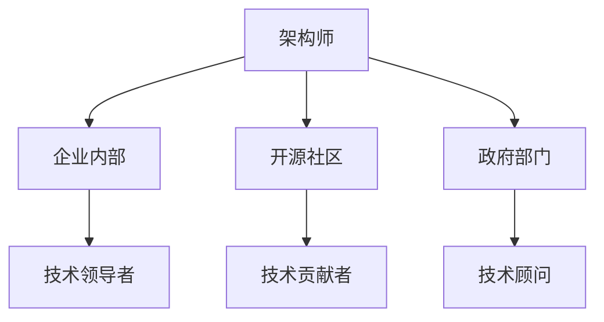

                 

## 《架构师的生态位置》

### 关键词：架构师、生态位置、职业发展、技术生态、实践与案例分析、最佳实践、未来展望

### 摘要：

本文将深入探讨架构师在现代IT行业中的生态位置。首先，我们将介绍架构师的角色和核心概念，并通过对比分析不同生态中的架构师角色，揭示其在技术生态系统中的位置。接着，我们将探讨架构师的职业发展路径及其在技术生态中的作用。随后，我们将通过实践案例展示架构师的实际工作场景，并总结最佳实践。最后，我们将展望架构师生态位置的演变趋势，为未来的发展提供指导。

### 第1章 引言与背景介绍

#### 1.1 问题背景

在当今快速发展的信息技术领域，架构师的角色日益重要。他们不仅负责技术选型和系统设计，还要协调团队、管理项目、推动技术革新。然而，架构师在技术生态中的位置和作用并未得到充分认识和明确界定。

#### 1.2 问题描述

本文旨在探讨以下问题：
- 架构师的生态位置是什么？
- 架构师在不同生态中的角色和责任有何异同？
- 架构师的职业发展路径和关键技能是什么？
- 架构师如何在技术生态中发挥作用？
- 架构师的最佳实践是什么？未来趋势如何？

#### 1.3 问题解决

通过深入分析和实践案例研究，本文将解答上述问题，为架构师在技术生态中的角色和职业发展提供指导。

#### 1.4 边界与外延

本文主要关注企业级架构师，讨论其在软件开发、系统设计、项目管理等方面的生态位置。同时，我们也会探讨架构师在开源社区、技术联盟等不同生态中的角色。

#### 1.5 概念结构与核心要素组成

本文的核心概念包括架构师、生态位置、技术生态、职业发展等。我们将通过概念解释、对比分析和案例研究，详细阐述这些核心概念及其相互关系。

### 第2章 核心概念与联系

#### 2.1 架构师的角色

架构师是技术团队的领导者和决策者，负责确保系统的可扩展性、可维护性和高性能。他们需要具备深厚的编程基础、系统架构能力和业务理解。

#### 2.2 架构师的生态位置

架构师的生态位置取决于其所处的环境。在企业内部，架构师负责整体技术战略和架构设计；在开源社区，他们则积极参与技术标准和生态建设。

#### 2.3 概念属性特征对比表格

| 生态类型 | 架构师角色 | 主要责任 |
| --- | --- | --- |
| 企业内部 | 技术领导者 | 技术规划、系统设计、团队协调 |
| 开源社区 | 技术贡献者 | 贡献代码、技术标准、生态建设 |
| 政府部门 | 技术顾问 | 政策制定、技术规划、国际合作 |

#### 2.4 ER实体关系图架构

### 第3章 架构师的职业发展

#### 3.1 架构师的角色与成长路径

架构师的成长路径通常分为三个阶段：初级架构师、中级架构师和高级架构师。每个阶段都有不同的职责和技能要求。

#### 3.2 职业发展的关键技能和挑战

架构师需要具备的关键技能包括系统设计、项目管理、技术选型、团队协作等。同时，他们还需要应对快速变化的技术环境和不断增长的业务需求。

### 第4章 技术生态与架构师

#### 4.1 技术生态的概述

技术生态是一个由多种技术、公司、社区和标准组成的复杂网络。架构师在这个生态中发挥着关键作用，推动技术进步和生态发展。

#### 4.2 架构师在技术生态中的角色

架构师在技术生态中的角色包括技术领导者、贡献者和协调者。他们需要协调不同利益相关者，推动技术标准和生态建设。

### 第5章 架构师的实践与案例分析

#### 5.1 实践指导

架构师的实践指导包括如何制定技术战略、如何进行系统设计、如何管理团队和项目等。

#### 5.2 案例分析

我们将分析几个实际案例，展示架构师在不同企业和技术生态中的工作场景和成果。

### 第6章 最佳实践与未来展望

#### 6.1 最佳实践

最佳实践包括如何制定技术战略、如何进行系统设计、如何管理团队和项目等。架构师需要不断学习和实践，以提高自身能力。

#### 6.2 未来展望

未来，架构师的生态位置将继续演变。他们需要关注新技术、新标准和新兴业务领域，以保持竞争力。

### 第7章 总结与拓展阅读

本文回顾了架构师在技术生态中的角色、职业发展和实践案例，展望了未来的趋势。读者可以通过拓展阅读深入了解相关领域。

### 作者

作者：AI天才研究院/AI Genius Institute & 禅与计算机程序设计艺术 /Zen And The Art of Computer Programming

---

以上内容是根据您的要求和目录大纲创建的文章框架。接下来，我们将逐步填充每个章节的具体内容，确保文章的完整性和深度。由于字数要求较高，我们将分多个段落进行撰写，以确保文章的连贯性和可读性。如果您有任何修改意见或需要进一步细化，请随时告知。LET'S THINK AND WRITE

