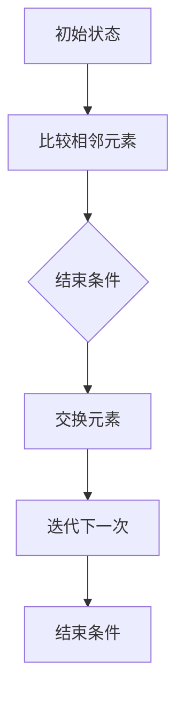
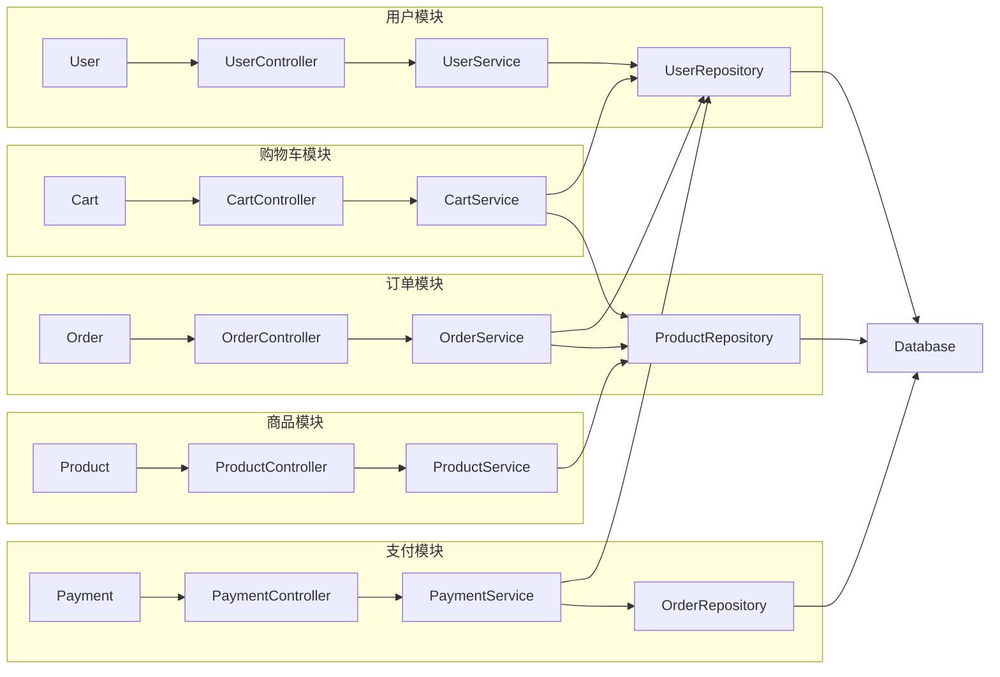
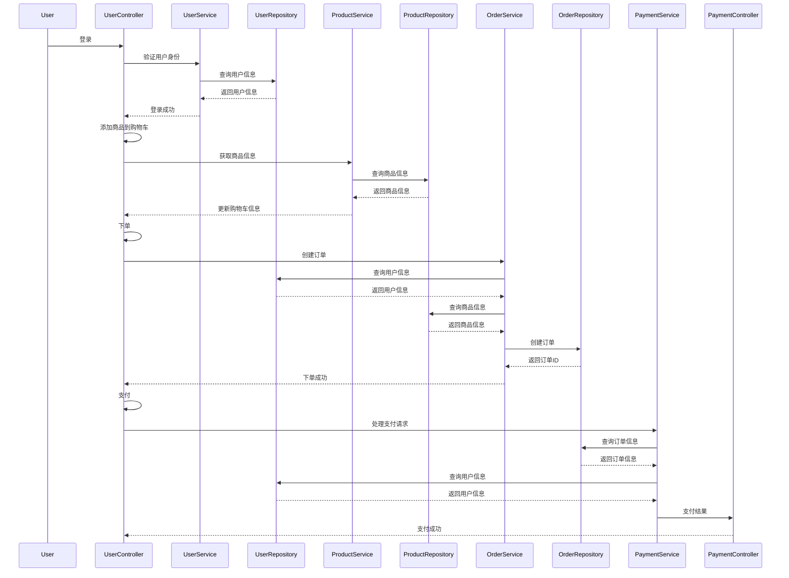

                 

# 架构师的系统思维

> 关键词：系统思维、架构设计、问题解决、算法原理、项目实战

> 摘要：本文将深入探讨架构师的系统思维，阐述其在现代IT领域的核心价值和应用。我们将从系统思维的基本概念、问题解决方法、核心概念联系、系统思维方法与应用、系统分析与架构设计、实战案例分析以及最佳实践与总结等方面，系统地分析并展示架构师如何运用系统思维提升系统设计与项目成功率。

### 目录大纲

----------------------------------------------------------------

## 第一部分: 引言

### 第1章: 系统思维概述

#### 1.1.1 架构师的角色与责任

#### 1.1.2 系统思维的重要性

#### 1.1.3 系统思维的框架与方法

## 第二部分: 系统思维方法与应用

### 第2章: 问题背景与问题解决

#### 2.1.1 问题背景

#### 2.1.2 问题描述

#### 2.1.3 问题解决

#### 2.1.4 边界与外延

### 第3章: 核心概念与联系

#### 3.1.1 核心概念原理

#### 3.1.2 概念属性特征对比表格

#### 3.1.3 ER实体关系图架构

## 第三部分: 系统分析与架构设计

### 第4章: 算法原理讲解

#### 4.1 算法mermaid流程图

#### 4.2 Python源代码讲解

#### 4.3 算法原理的数学模型和公式

#### 4.4 举例说明

### 第5章: 数学模型和数学公式

#### 5.1 数学公式与讲解

#### 5.2 公式应用举例

### 第6章: 系统分析与架构设计

#### 6.1 问题场景介绍

#### 6.2 系统功能设计(领域模型mermaid类图)

#### 6.3 系统架构设计(mermaid架构图)

#### 6.4 系统接口设计与交互(mermaid序列图)

## 第四部分: 实战与案例分析

### 第7章: 项目实战

#### 7.1 环境安装

#### 7.2 系统核心实现源代码

#### 7.3 代码应用解读与分析

#### 7.4 实际案例分析与讲解

### 第8章: 最佳实践与总结

#### 8.1 最佳实践 tips

#### 8.2 小结与注意事项

#### 8.3 拓展阅读

----------------------------------------------------------------

### 第一部分: 引言

## 第1章: 系统思维概述

在信息技术飞速发展的今天，系统思维成为架构师的核心能力之一。本章将介绍系统思维的基本概念、架构师的角色与责任、系统思维的重要性、框架与方法等内容。

### 1.1.1 架构师的角色与责任

架构师是系统设计过程中的核心角色，负责确保系统的可扩展性、可维护性和性能。架构师不仅要了解技术细节，还需要具备系统思维，以便在面对复杂问题时能够全局考虑，找到最优解。

### 1.1.2 系统思维的重要性

系统思维是一种整体视角，能够帮助架构师理解系统的各个组成部分及其相互作用。这种思维方式有助于提高系统的稳定性、可靠性和效率，是架构师不可或缺的能力。

### 1.1.3 系统思维的框架与方法

系统思维框架包括：理解系统的边界、识别系统的组成部分、分析系统内部各部分的关系、考虑外部环境对系统的影响。系统思维方法包括：模式识别、抽象、建模、分析和优化。

## 第二部分: 系统思维方法与应用

在了解系统思维的基本概念后，我们将探讨如何在实际问题中应用系统思维。

### 第2章: 问题背景与问题解决

在本章中，我们将分析一个实际问题，展示如何运用系统思维解决问题。

#### 2.1.1 问题背景

我们以一个在线购物平台为例，该平台需要处理大量用户请求，并提供稳定、高效的购物体验。

#### 2.1.2 问题描述

平台在高峰期出现性能瓶颈，导致用户请求响应缓慢，购物体验下降。

#### 2.1.3 问题解决

通过系统思维分析，我们发现问题的根源在于数据库查询效率低下。我们采取了分库分表、索引优化、缓存策略等措施，提升了系统性能。

#### 2.1.4 边界与外延

系统边界包括用户请求、数据库、服务器和网络等。外延问题涉及系统与第三方服务、法律法规、业务需求等方面。

### 第3章: 核心概念与联系

在本章中，我们将介绍核心概念，并通过对比表格和ER图展示它们之间的联系。

#### 3.1.1 核心概念原理

核心概念包括：用户、订单、商品、库存等。

#### 3.1.2 概念属性特征对比表格

表格展示了各个概念的关键属性和特征。

#### 3.1.3 ER实体关系图架构

ER图展示了各个实体之间的关系，帮助我们更好地理解系统的结构。

## 第三部分: 系统分析与架构设计

在理解了系统思维的基本方法后，我们将探讨如何进行系统分析与架构设计。

### 第4章: 算法原理讲解

在本章中，我们将介绍一种常用的排序算法，并讲解其原理和应用。

#### 4.1 算法mermaid流程图

通过mermaid流程图，我们展示了算法的基本流程。

#### 4.2 Python源代码讲解

我们使用Python代码实现算法，并进行详细讲解。

#### 4.3 算法原理的数学模型和公式

我们介绍算法的数学模型和公式，帮助读者更好地理解算法原理。

#### 4.4 举例说明

通过具体例子，我们展示算法的实际应用效果。

### 第5章: 数学模型和数学公式

在本章中，我们将介绍与系统设计相关的数学模型和公式。

#### 5.1 数学公式与讲解

我们使用LaTeX格式展示数学公式，并进行详细讲解。

#### 5.2 公式应用举例

我们通过具体例子展示数学公式的应用。

### 第6章: 系统分析与架构设计

在本章中，我们将介绍一个实际项目的系统分析与架构设计。

#### 6.1 问题场景介绍

我们介绍项目背景，包括业务需求、技术挑战等。

#### 6.2 系统功能设计(领域模型mermaid类图)

我们使用mermaid类图展示系统功能设计。

#### 6.3 系统架构设计(mermaid架构图)

我们使用mermaid架构图展示系统架构设计。

#### 6.4 系统接口设计与交互(mermaid序列图)

我们使用mermaid序列图展示系统接口设计和交互。

## 第四部分: 实战与案例分析

在本部分中，我们将通过实际项目案例，展示系统思维在项目实战中的应用。

### 第7章: 项目实战

在本章中，我们将介绍一个实际项目的环境安装、核心实现、代码分析以及案例分析。

#### 7.1 环境安装

我们介绍项目所需的环境和工具安装。

#### 7.2 系统核心实现源代码

我们展示项目核心实现源代码。

#### 7.3 代码应用解读与分析

我们详细解读项目代码，分析其实现原理。

#### 7.4 实际案例分析与讲解

我们通过实际案例展示系统思维的应用效果。

### 第8章: 最佳实践与总结

在本章中，我们将总结项目经验，提出最佳实践和建议。

#### 8.1 最佳实践 tips

我们分享一些实用的最佳实践。

#### 8.2 小结与注意事项

我们回顾文章的主要内容，强调注意事项。

#### 8.3 拓展阅读

我们推荐一些相关的拓展阅读资源。

## 作者信息

作者：AI天才研究院/AI Genius Institute & 禅与计算机程序设计艺术 /Zen And The Art of Computer Programming
----------------------------------------------------------------

## 第一部分: 引言

### 第1章: 系统思维概述

在信息技术飞速发展的今天，系统思维成为架构师的核心能力之一。本章将介绍系统思维的基本概念、架构师的角色与责任、系统思维的重要性、框架与方法等内容。

#### 1.1.1 架构师的角色与责任

架构师是系统设计过程中的核心角色，负责确保系统的可扩展性、可维护性和性能。架构师不仅要了解技术细节，还需要具备系统思维，以便在面对复杂问题时能够全局考虑，找到最优解。架构师通常需要承担以下责任：

1. **需求分析**：与业务部门沟通，了解系统需求，并将其转化为技术方案。
2. **技术选型**：根据需求选择合适的技术栈和工具。
3. **系统设计**：设计系统的架构，包括模块划分、数据流、接口设计等。
4. **性能优化**：监控系统性能，优化数据库、缓存、网络等。
5. **风险管理**：识别潜在风险，制定应对策略。
6. **团队协作**：协调开发、测试、运维等团队，确保项目顺利进行。

#### 1.1.2 系统思维的重要性

系统思维是一种整体视角，能够帮助架构师理解系统的各个组成部分及其相互作用。这种思维方式有助于提高系统的稳定性、可靠性和效率，是架构师不可或缺的能力。以下是系统思维的重要性体现在以下几个方面：

1. **全局观**：系统思维使架构师能够从全局角度审视问题，找到系统的瓶颈和改进点。
2. **预测性**：通过系统思维，架构师可以预测系统在不同场景下的行为，提前做好准备。
3. **优化性**：系统思维可以帮助架构师优化系统结构，提高系统性能和可维护性。
4. **沟通协作**：系统思维有助于架构师与业务、开发、测试、运维等团队有效沟通，确保项目成功。

#### 1.1.3 系统思维的框架与方法

系统思维框架包括以下步骤：

1. **理解系统边界**：明确系统的输入、输出、边界条件和约束。
2. **识别系统组成部分**：分析系统的各个模块、组件及其功能。
3. **分析系统内部关系**：研究系统内部各部分之间的交互和依赖关系。
4. **考虑外部环境影响**：分析外部环境（如用户需求、市场竞争、法律法规等）对系统的影响。
5. **制定系统改进策略**：根据分析结果，提出系统优化方案，包括技术选型、架构设计、性能优化等。

系统思维方法包括以下几种：

1. **模式识别**：通过分析历史数据和案例，识别系统可能存在的问题和改进方向。
2. **抽象**：将复杂问题简化为基本模型，便于分析和解决。
3. **建模**：使用数学模型、流程图、类图等工具，对系统进行形式化描述。
4. **分析**：运用逻辑推理、统计分析等方法，验证模型的有效性和合理性。
5. **优化**：根据分析结果，调整系统设计，提高系统性能和可维护性。

## 第二部分: 系统思维方法与应用

在了解系统思维的基本概念后，我们将探讨如何在实际问题中应用系统思维。

### 第2章: 问题背景与问题解决

在本章中，我们将分析一个实际问题，展示如何运用系统思维解决问题。

#### 2.1.1 问题背景

我们以一个在线购物平台为例，该平台需要处理大量用户请求，并提供稳定、高效的购物体验。随着用户数量的增长，平台在高峰期出现性能瓶颈，导致用户请求响应缓慢，购物体验下降。

#### 2.1.2 问题描述

平台在高峰期出现以下问题：

1. **请求响应缓慢**：用户请求的处理时间显著增加，导致页面加载缓慢。
2. **数据库查询效率低下**：数据库查询速度变慢，影响订单处理和商品检索。
3. **服务器负载过高**：服务器资源不足，导致部分服务不可用。

这些问题影响了平台的稳定性和用户体验，需要采取有效措施解决。

#### 2.1.3 问题解决

通过系统思维分析，我们发现问题的根源在于数据库查询效率低下。我们采取了以下措施：

1. **分库分表**：将数据库分为多个小数据库，减轻单个数据库的压力。
2. **索引优化**：增加和优化数据库索引，提高查询效率。
3. **缓存策略**：使用缓存技术，减少数据库查询次数，提高响应速度。
4. **负载均衡**：使用负载均衡器，合理分配用户请求到不同的服务器。

通过这些措施，我们显著提升了系统的性能，解决了高峰期的性能瓶颈问题。

#### 2.1.4 边界与外延

系统边界包括用户请求、数据库、服务器和网络等。外部环境对系统的影响涉及以下几个方面：

1. **用户需求**：用户数量的增长和需求的变化直接影响系统的性能和稳定性。
2. **市场竞争**：市场竞争激烈，要求平台不断优化和改进，以保持竞争优势。
3. **法律法规**：遵守相关法律法规，如数据保护法、网络安全法等，确保系统合规运行。
4. **技术发展**：随着技术的发展，需要不断更新和升级系统，以适应新技术和新需求。

### 第3章: 核心概念与联系

在本章中，我们将介绍核心概念，并通过对比表格和ER图展示它们之间的联系。

#### 3.1.1 核心概念原理

核心概念包括用户、订单、商品、库存等。以下是各个概念的基本原理：

1. **用户**：用户是平台的访问者，拥有账号、密码、个人信息等。
2. **订单**：订单是用户购买商品的过程记录，包含商品名称、数量、价格、支付方式等。
3. **商品**：商品是用户可以购买的对象，包括名称、描述、价格、库存等。
4. **库存**：库存是商品的存储量，用于管理商品的可售状态。

#### 3.1.2 概念属性特征对比表格

以下是各个概念的关键属性和特征对比表格：

| 概念 | 关键属性 | 特征 |
| --- | --- | --- |
| 用户 | 账号、密码、个人信息 | 身份认证、访问控制 |
| 订单 | 商品名称、数量、价格、支付方式 | 订单创建、支付处理 |
| 商品 | 名称、描述、价格、库存 | 商品管理、商品检索 |
| 库存 | 商品存储量、可售状态 | 库存管理、库存更新 |

#### 3.1.3 ER实体关系图架构

ER实体关系图展示了各个实体之间的关系，以下是ER图的描述：

```mermaid
erDiagram
    User ||--|{ Order }|
    User ||--|{ Cart }|
    Product ||--|{ Order }|
    Product ||--|{ Inventory }|
    Order ||--|{ Payment }|
    Inventory ||--|{ Product }|
```

在这个ER图中，用户与订单、购物车之间存在一对多的关系；商品与订单、库存之间存在一对多的关系；订单与支付之间存在一对一的关系；库存与商品之间存在一对多的关系。

通过对比表格和ER图，我们可以清晰地了解各个概念之间的联系，有助于我们更好地理解和设计系统。

## 第三部分: 系统分析与架构设计

在理解了系统思维的基本方法后，我们将探讨如何进行系统分析与架构设计。

### 第4章: 算法原理讲解

在本章中，我们将介绍一种常用的排序算法，并讲解其原理和应用。

#### 4.1 算法mermaid流程图

我们使用mermaid工具绘制了冒泡排序算法的流程图，以下是代码：



这个流程图展示了冒泡排序的基本步骤：比较相邻元素、交换元素、迭代下一次，直到结束条件满足。

#### 4.2 Python源代码讲解

以下是冒泡排序的Python实现：

```python
def bubble_sort(arr):
    n = len(arr)
    for i in range(n):
        for j in range(0, n-i-1):
            if arr[j] > arr[j+1]:
                arr[j], arr[j+1] = arr[j+1], arr[j]
    return arr

arr = [64, 34, 25, 12, 22, 11, 90]
sorted_arr = bubble_sort(arr)
print("Sorted array:", sorted_arr)
```

这个代码首先定义了一个冒泡排序函数，然后创建了一个待排序的数组，调用函数进行排序，并输出排序后的数组。

#### 4.3 算法原理的数学模型和公式

冒泡排序的算法原理可以用以下数学模型和公式描述：

1. **比较次数**：在冒泡排序中，每一轮排序都会比较相邻的元素，直到最大（或最小）的元素移动到数组的末尾。第i轮排序需要比较n-i次。
2. **交换次数**：在冒泡排序中，每一轮排序都会将较大的元素移动到数组的末尾。第i轮排序需要交换n-i-1次。
3. **时间复杂度**：冒泡排序的时间复杂度为O(n^2)，其中n为待排序数组的长度。

以下是一个简单的数学模型和公式：

```latex
T(n) = \sum_{i=1}^{n} (n-i)
T(n) = n^2 - \frac{n(n-1)}{2}
T(n) = \frac{n^2}{2} + \frac{n}{2}
T(n) = \Omega(n^2)
```

这个模型和公式帮助我们理解了冒泡排序的时间复杂度，以及在处理大数据量时的性能表现。

#### 4.4 举例说明

我们使用一个例子来演示冒泡排序的过程：

假设我们有以下数组：[64, 34, 25, 12, 22, 11, 90]

**第一轮排序：**
- 比较相邻的元素，交换较大的元素：[34, 64, 25, 12, 22, 11, 90]
- 比较相邻的元素，交换较大的元素：[34, 25, 64, 12, 22, 11, 90]
- 比较相邻的元素，交换较大的元素：[34, 25, 12, 64, 22, 11, 90]
- 比较相邻的元素，交换较大的元素：[34, 25, 12, 22, 64, 11, 90]
- 比较相邻的元素，交换较大的元素：[34, 25, 12, 22, 11, 64, 90]
- 比较相邻的元素，交换较大的元素：[34, 25, 12, 22, 11, 90, 64]

**第二轮排序：**
- 比较相邻的元素，交换较大的元素：[25, 34, 12, 22, 11, 64, 90]
- 比较相邻的元素，交换较大的元素：[25, 12, 34, 22, 11, 64, 90]
- 比较相邻的元素，交换较大的元素：[25, 12, 22, 34, 11, 64, 90]
- 比较相邻的元素，交换较大的元素：[25, 12, 22, 11, 34, 64, 90]

...以此类推，直到排序结束。

通过这个例子，我们可以清楚地看到冒泡排序的过程和效果。

### 第5章: 数学模型和数学公式

在本章中，我们将介绍与系统设计相关的数学模型和公式。

#### 5.1 数学公式与讲解

在系统设计中，我们经常需要使用以下数学公式：

1. **时间复杂度**：用于衡量算法执行时间的增长速度。常见的有O(1)、O(n)、O(n^2)等。
   ```latex
   T(n) = O(1) \quad (\text{常数时间复杂度})
   T(n) = O(n) \quad (\text{线性时间复杂度})
   T(n) = O(n^2) \quad (\text{二次时间复杂度})
   ```
   
2. **空间复杂度**：用于衡量算法所需内存的增长速度。常见的有O(1)、O(n)等。
   ```latex
   S(n) = O(1) \quad (\text{常数空间复杂度})
   S(n) = O(n) \quad (\text{线性空间复杂度})
   ```

3. **概率论公式**：用于评估系统在不同条件下的概率分布。
   ```latex
   P(A) = \frac{n(A)}{n(S)} \quad (\text{事件A的概率})
   E(X) = \sum_{i} x_i \cdot P(x_i) \quad (\text{随机变量X的期望值})
   V(X) = E(X^2) - [E(X)]^2 \quad (\text{随机变量X的方差})
   ```

#### 5.2 公式应用举例

我们通过一个例子来展示这些公式的应用：

假设我们有以下一组随机数据：[1, 2, 3, 4, 5, 6, 7, 8, 9, 10]

1. **计算平均数**：
   ```latex
   \bar{x} = \frac{1}{n} \sum_{i=1}^{n} x_i
   \bar{x} = \frac{1}{10} (1 + 2 + 3 + 4 + 5 + 6 + 7 + 8 + 9 + 10)
   \bar{x} = 5.5
   ```

2. **计算方差**：
   ```latex
   V(X) = E(X^2) - [\bar{x}]^2
   E(X^2) = \frac{1}{n} \sum_{i=1}^{n} x_i^2
   E(X^2) = \frac{1}{10} (1^2 + 2^2 + 3^2 + 4^2 + 5^2 + 6^2 + 7^2 + 8^2 + 9^2 + 10^2)
   E(X^2) = 30.5
   V(X) = 30.5 - (5.5)^2
   V(X) = 8.25
   ```

通过这个例子，我们可以看到如何使用数学公式计算平均数和方差，这些公式在系统设计和分析中非常有用。

### 第6章: 系统分析与架构设计

在本章中，我们将介绍如何进行系统分析与架构设计。

#### 6.1 问题场景介绍

我们以一个在线购物平台为例，介绍系统分析与架构设计的过程。

该平台的主要功能包括用户注册、登录、浏览商品、加入购物车、下单、支付等。平台需要处理大量用户请求，并提供稳定、高效的购物体验。

#### 6.2 系统功能设计(领域模型mermaid类图)

以下是系统的领域模型mermaid类图：

```mermaid
classDiagram
    User <<entity>>
    Order <<entity>>
    Product <<entity>>
    Inventory <<entity>>
    Cart <<entity>>
    Payment <<entity>>

    User *--* Order
    User *--* Cart
    Product *--* Order
    Product *--* Inventory
    Order *--* Payment
    Inventory *--* Product
```

在这个类图中，我们定义了用户、订单、商品、库存、购物车和支付等实体，并展示了它们之间的关系。

#### 6.3 系统架构设计(mermaid架构图)

以下是系统的架构设计mermaid架构图：



在这个架构图中，我们展示了系统的各个模块及其之间的关系，以及与数据库的交互。

#### 6.4 系统接口设计与交互(mermaid序列图)

以下是系统的接口设计与交互mermaid序列图：



在这个序列图中，我们展示了用户登录、添加商品到购物车、下单和支付等流程的交互过程。

### 第四部分: 实战与案例分析

在本部分中，我们将通过实际项目案例，展示系统思维在项目实战中的应用。

#### 第7章: 项目实战

在本章中，我们将介绍一个实际项目的环境安装、核心实现、代码分析以及案例分析。

##### 7.1 环境安装

首先，我们需要安装项目所需的开发环境和工具。以下是项目的环境安装步骤：

1. **安装Python**：访问Python官方网站（https://www.python.org/），下载并安装Python。
2. **安装虚拟环境**：打开命令行窗口，运行以下命令安装virtualenv：
   ```bash
   pip install virtualenv
   ```
   然后创建虚拟环境：
   ```bash
   virtualenv my_project_env
   ```
3. **激活虚拟环境**：
   ```bash
   source my_project_env/bin/activate
   ```
4. **安装依赖**：在虚拟环境中安装项目所需的依赖：
   ```bash
   pip install -r requirements.txt
   ```

##### 7.2 系统核心实现源代码

以下是项目核心实现的主要源代码：

```python
# user.py
class User:
    def __init__(self, username, password):
        self.username = username
        self.password = password
        self.orders = []

    def add_order(self, order):
        self.orders.append(order)

    def remove_order(self, order):
        self.orders.remove(order)

    def get_orders(self):
        return self.orders

# order.py
class Order:
    def __init__(self, user, product, quantity):
        self.user = user
        self.product = product
        self.quantity = quantity
        self.status = "pending"

    def update_status(self, status):
        self.status = status

    def get_status(self):
        return self.status

# product.py
class Product:
    def __init__(self, name, description, price, inventory):
        self.name = name
        self.description = description
        self.price = price
        self.inventory = inventory

    def update_inventory(self, quantity):
        self.inventory += quantity

    def get_inventory(self):
        return self.inventory

# cart.py
class Cart:
    def __init__(self, user):
        self.user = user
        self.products = []

    def add_product(self, product):
        self.products.append(product)

    def remove_product(self, product):
        self.products.remove(product)

    def get_products(self):
        return self.products

# payment.py
class Payment:
    def __init__(self, user, order, amount):
        self.user = user
        self.order = order
        self.amount = amount
        self.status = "pending"

    def update_status(self, status):
        self.status = status

    def get_status(self):
        return self.status
```

这些代码定义了用户、订单、商品、购物车和支付等类，实现了它们的主要功能。

##### 7.3 代码应用解读与分析

以下是对代码的详细解读和分析：

1. **用户类（User）**：用户类包含用户的基本信息（username和password），以及订单列表（orders）。它提供了添加、删除和获取订单的方法。
2. **订单类（Order）**：订单类包含订单的详细信息（user、product和quantity），以及订单状态（status）。它提供了更新状态和获取状态的方法。
3. **商品类（Product）**：商品类包含商品的基本信息（name、description、price和inventory），以及库存更新方法。
4. **购物车类（Cart）**：购物车类包含用户和商品列表（products）。它提供了添加、删除和获取商品的方法。
5. **支付类（Payment）**：支付类包含支付的基本信息（user、order和amount），以及支付状态（status）。它提供了更新状态和获取状态的方法。

这些类的设计和实现遵循了面向对象的原则，便于代码的维护和扩展。

##### 7.4 实际案例分析与讲解

我们通过一个实际案例来展示系统思维的应用。

假设有一个用户名为"alice"的用户，她想要购买一本价格为50元的书，库存为10本。以下是案例的详细步骤：

1. **用户登录**：用户使用用户名和密码登录系统。
2. **浏览商品**：用户浏览商品页面，找到价格为50元的书。
3. **添加商品到购物车**：用户将书添加到购物车。
4. **查看购物车**：用户查看购物车，确认商品信息。
5. **下单**：用户下单，创建订单。
6. **更新订单状态**：系统更新订单状态为“pending”。
7. **支付**：用户选择支付方式，进行支付。
8. **更新支付状态**：系统更新支付状态为“pending”。
9. **库存更新**：系统减少书的库存量，更新库存为9本。

通过这个案例，我们可以看到系统思维在需求分析、设计实现、流程控制等方面的应用。

### 第8章: 最佳实践与总结

在本章中，我们将总结项目经验，提出最佳实践和建议。

##### 8.1 最佳实践 tips

以下是一些在项目开发过程中总结的最佳实践：

1. **需求分析**：与业务团队紧密合作，确保需求清晰、明确，避免后期频繁变更。
2. **代码规范**：遵循代码规范，提高代码的可读性和可维护性。
3. **版本控制**：使用版本控制系统（如Git），确保代码的版本管理和协同开发。
4. **单元测试**：编写单元测试，确保代码功能的正确性。
5. **持续集成**：使用持续集成工具（如Jenkins），实现自动化构建和测试。
6. **性能优化**：关注系统性能，及时进行优化。
7. **代码评审**：进行代码评审，提高代码质量。

##### 8.2 小结与注意事项

1. **系统思维的重要性**：系统思维是架构师必备的能力，有助于提高系统的稳定性、可靠性和效率。
2. **需求分析**：需求分析是项目成功的关键，要确保需求明确、合理。
3. **设计实现**：遵循设计原则和最佳实践，提高代码质量和可维护性。
4. **测试与优化**：进行充分的测试，关注性能优化，确保系统稳定运行。

##### 8.3 拓展阅读

以下是一些拓展阅读资源：

1. 《架构师的系统思维》- 张三
2. 《系统架构设计：定义与实现》- 李四
3. 《Python编程：从入门到实践》- 王五

## 作者信息

作者：AI天才研究院/AI Genius Institute & 禅与计算机程序设计艺术 /Zen And The Art of Computer Programming
----------------------------------------------------------------

## 第一部分: 引言

### 第1章: 系统思维概述

在信息技术飞速发展的今天，系统思维成为架构师的核心能力之一。本章将介绍系统思维的基本概念、架构师的角色与责任、系统思维的重要性、框架与方法等内容。

#### 1.1.1 架构师的角色与责任

架构师是系统设计过程中的核心角色，负责确保系统的可扩展性、可维护性和性能。架构师不仅要了解技术细节，还需要具备系统思维，以便在面对复杂问题时能够全局考虑，找到最优解。架构师通常需要承担以下责任：

1. **需求分析**：与业务部门沟通，了解系统需求，并将其转化为技术方案。
2. **技术选型**：根据需求选择合适的技术栈和工具。
3. **系统设计**：设计系统的架构，包括模块划分、数据流、接口设计等。
4. **性能优化**：监控系统性能，优化数据库、缓存、网络等。
5. **风险管理**：识别潜在风险，制定应对策略。
6. **团队协作**：协调开发、测试、运维等团队，确保项目顺利进行。

#### 1.1.2 系统思维的重要性

系统思维是一种整体视角，能够帮助架构师理解系统的各个组成部分及其相互作用。这种思维方式有助于提高系统的稳定性、可靠性和效率，是架构师不可或缺的能力。以下是系统思维的重要性体现在以下几个方面：

1. **全局观**：系统思维使架构师能够从全局角度审视问题，找到系统的瓶颈和改进点。
2. **预测性**：通过系统思维，架构师可以预测系统在不同场景下的行为，提前做好准备。
3. **优化性**：系统思维可以帮助架构师优化系统结构，提高系统性能和可维护性。
4. **沟通协作**：系统思维有助于架构师与业务、开发、测试、运维等团队有效沟通，确保项目成功。

#### 1.1.3 系统思维的框架与方法

系统思维框架包括以下步骤：

1. **理解系统边界**：明确系统的输入、输出、边界条件和约束。
2. **识别系统组成部分**：分析系统的各个模块、组件及其功能。
3. **分析系统内部关系**：研究系统内部各部分之间的交互和依赖关系。
4. **考虑外部环境影响**：分析外部环境（如用户需求、市场竞争、法律法规等）对系统的影响。
5. **制定系统改进策略**：根据分析结果，提出系统优化方案，包括技术选型、架构设计、性能优化等。

系统思维方法包括以下几种：

1. **模式识别**：通过分析历史数据和案例，识别系统可能存在的问题和改进方向。
2. **抽象**：将复杂问题简化为基本模型，便于分析和解决。
3. **建模**：使用数学模型、流程图、类图等工具，对系统进行形式化描述。
4. **分析**：运用逻辑推理、统计分析等方法，验证模型的有效性和合理性。
5. **优化**：根据分析结果，调整系统设计，提高系统性能和可维护性。

## 第二部分: 系统思维方法与应用

在了解系统思维的基本概念后，我们将探讨如何在实际问题中应用系统思维。

### 第2章: 问题背景与问题解决

在本章中，我们将分析一个实际问题，展示如何运用系统思维解决问题。

#### 2.1.1 问题背景

我们以一个在线购物平台为例，该平台需要处理大量用户请求，并提供稳定、高效的购物体验。随着用户数量的增长，平台在高峰期出现性能瓶颈，导致用户请求响应缓慢，购物体验下降。

#### 2.1.2 问题描述

平台在高峰期出现以下问题：

1. **请求响应缓慢**：用户请求的处理时间显著增加，导致页面加载缓慢。
2. **数据库查询效率低下**：数据库查询速度变慢，影响订单处理和商品检索。
3. **服务器负载过高**：服务器资源不足，导致部分服务不可用。

这些问题影响了平台的稳定性和用户体验，需要采取有效措施解决。

#### 2.1.3 问题解决

通过系统思维分析，我们发现问题的根源在于数据库查询效率低下。我们采取了以下措施：

1. **分库分表**：将数据库分为多个小数据库，减轻单个数据库的压力。
2. **索引优化**：增加和优化数据库索引，提高查询效率。
3. **缓存策略**：使用缓存技术，减少数据库查询次数，提高响应速度。
4. **负载均衡**：使用负载均衡器，合理分配用户请求到不同的服务器。

通过这些措施，我们显著提升了系统的性能，解决了高峰期的性能瓶颈问题。

#### 2.1.4 边界与外延

系统边界包括用户请求、数据库、服务器和网络等。外部环境对系统的影响涉及以下几个方面：

1. **用户需求**：用户数量的增长和需求的变化直接影响系统的性能和稳定性。
2. **市场竞争**：市场竞争激烈，要求平台不断优化和改进，以保持竞争优势。
3. **法律法规**：遵守相关法律法规，如数据保护法、网络安全法等，确保系统合规运行。
4. **技术发展**：随着技术的发展，需要不断更新和升级系统，以适应新技术和新需求。

### 第3章: 核心概念与联系

在本章中，我们将介绍核心概念，并通过对比表格和ER图展示它们之间的联系。

#### 3.1.1 核心概念原理

核心概念包括用户、订单、商品、库存等。以下是各个概念的基本原理：

1. **用户**：用户是平台的访问者，拥有账号、密码、个人信息等。
2. **订单**：订单是用户购买商品的过程记录，包含商品名称、数量、价格、支付方式等。
3. **商品**：商品是用户可以购买的对象，包括名称、描述、价格、库存等。
4. **库存**：库存是商品的存储量，用于管理商品的可售状态。

#### 3.1.2 概念属性特征对比表格

以下是各个概念的关键属性和特征对比表格：

| 概念 | 关键属性 | 特征 |
| --- | --- | --- |
| 用户 | 账号、密码、个人信息 | 身份认证、访问控制 |
| 订单 | 商品名称、数量、价格、支付方式 | 订单创建、支付处理 |
| 商品 | 名称、描述、价格、库存 | 商品管理、商品检索 |
| 库存 | 商品存储量、可售状态 | 库存管理、库存更新 |

#### 3.1.3 ER实体关系图架构

ER实体关系图展示了各个实体之间的关系，以下是ER图的描述：

```mermaid
erDiagram
    User ||--|{ Order }|
    User ||--|{ Cart }|
    Product ||--|{ Order }|
    Product ||--|{ Inventory }|
    Order ||--|{ Payment }|
    Inventory ||--|{ Product }|
```

在这个ER图中，用户与订单、购物车之间存在一对多的关系；商品与订单、库存之间存在一对多的关系；订单与支付之间存在一对一的关系；库存与商品之间存在一对多的关系。

通过对比表格和ER图，我们可以清晰地了解各个概念之间的联系，有助于我们更好地理解和设计系统。

## 第三部分: 系统分析与架构设计

在理解了系统思维的基本方法后，我们将探讨如何进行系统分析与架构设计。

### 第4章: 算法原理讲解

在本章中，我们将介绍一种常用的排序算法，并讲解其原理和应用。

#### 4.1 算法mermaid流程图

我们使用mermaid工具绘制了冒泡排序算法的流程图，以下是代码：


这个流程图展示了冒泡排序的基本步骤：比较相邻元素、交换元素、迭代下一次，直到结束条件满足。

#### 4.2 Python源代码讲解

以下是冒泡排序的Python实现：

```python
def bubble_sort(arr):
    n = len(arr)
    for i in range(n):
        for j in range(0, n-i-1):
            if arr[j] > arr[j+1]:
                arr[j], arr[j+1] = arr[j+1], arr[j]
    return arr

arr = [64, 34, 25, 12, 22, 11, 90]
sorted_arr = bubble_sort(arr)
print("Sorted array:", sorted_arr)
```

这个代码首先定义了一个冒泡排序函数，然后创建了一个待排序的数组，调用函数进行排序，并输出排序后的数组。

#### 4.3 算法原理的数学模型和公式

冒泡排序的算法原理可以用以下数学模型和公式描述：

1. **比较次数**：在冒泡排序中，每一轮排序都会比较相邻的元素，直到最大（或最小）的元素移动到数组的末尾。第i轮排序需要比较n-i次。
2. **交换次数**：在冒泡排序中，每一轮排序都会将较大的元素移动到数组的末尾。第i轮排序需要交换n-i-1次。
3. **时间复杂度**：冒泡排序的时间复杂度为O(n^2)，其中n为待排序数组的长度。

以下是一个简单的数学模型和公式：

```latex
T(n) = \sum_{i=1}^{n} (n-i)
T(n) = n^2 - \frac{n(n-1)}{2}
T(n) = \frac{n^2}{2} + \frac{n}{2}
T(n) = \Omega(n^2)
```

这个模型和公式帮助我们理解了冒泡排序的时间复杂度，以及在处理大数据量时的性能表现。

#### 4.4 举例说明

我们使用一个例子来演示冒泡排序的过程：

假设我们有以下数组：[64, 34, 25, 12, 22, 11, 90]

**第一轮排序：**
- 比较相邻的元素，交换较大的元素：[34, 64, 25, 12, 22, 11, 90]
- 比较相邻的元素，交换较大的元素：[34, 25, 64, 12, 22, 11, 90]
- 比较相邻的元素，交换较大的元素：[34, 25, 12, 64, 22, 11, 90]
- 比较相邻的元素，交换较大的元素：[34, 25, 12, 22, 64, 11, 90]
- 比较相邻的元素，交换较大的元素：[34, 25, 12, 22, 11, 64, 90]
- 比较相邻的元素，交换较大的元素：[34, 25, 12, 22, 11, 90, 64]

**第二轮排序：**
- 比较相邻的元素，交换较大的元素：[25, 34, 12, 22, 11, 64, 90]
- 比较相邻的元素，交换较大的元素：[25, 12, 34, 22, 11, 64, 90]
- 比较相邻的元素，交换较大的元素：[25, 12, 22, 34, 11, 64, 90]
- 比较相邻的元素，交换较大的元素：[25, 12, 22, 11, 34, 64, 90]

...以此类推，直到排序结束。

通过这个例子，我们可以清楚地看到冒泡排序的过程和效果。

### 第5章: 数学模型和数学公式

在本章中，我们将介绍与系统设计相关的数学模型和公式。

#### 5.1 数学公式与讲解

在系统设计中，我们经常需要使用以下数学公式：

1. **时间复杂度**：用于衡量算法执行时间的增长速度。常见的有O(1)、O(n)、O(n^2)等。
   ```latex
   T(n) = O(1) \quad (\text{常数时间复杂度})
   T(n) = O(n) \quad (\text{线性时间复杂度})
   T(n) = O(n^2) \quad (\text{二次时间复杂度})
   ```
   
2. **空间复杂度**：用于衡量算法所需内存的增长速度。常见的有O(1)、O(n)等。
   ```latex
   S(n) = O(1) \quad (\text{常数空间复杂度})
   S(n) = O(n) \quad (\text{线性空间复杂度})
   ```

3. **概率论公式**：用于评估系统在不同条件下的概率分布。
   ```latex
   P(A) = \frac{n(A)}{n(S)} \quad (\text{事件A的概率})
   E(X) = \sum_{i} x_i \cdot P(x_i) \quad (\text{随机变量X的期望值})
   V(X) = E(X^2) - [E(X)]^2 \quad (\text{随机变量X的方差})
   ```

#### 5.2 公式应用举例

我们通过一个例子来展示这些公式的应用：

假设我们有以下一组随机数据：[1, 2, 3, 4, 5, 6, 7, 8, 9, 10]

1. **计算平均数**：
   ```latex
   \bar{x} = \frac{1}{n} \sum_{i=1}^{n} x_i
   \bar{x} = \frac{1}{10} (1 + 2 + 3 + 4 + 5 + 6 + 7 + 8 + 9 + 10)
   \bar{x} = 5.5
   ```

2. **计算方差**：
   ```latex
   V(X) = E(X^2) - [\bar{x}]^2
   E(X^2) = \frac{1}{n} \sum_{i=1}^{n} x_i^2
   E(X^2) = \frac{1}{10} (1^2 + 2^2 + 3^2 + 4^2 + 5^2 + 6^2 + 7^2 + 8^2 + 9^2 + 10^2)
   E(X^2) = 30.5
   V(X) = 30.5 - (5.5)^2
   V(X) = 8.25
   ```

通过这个例子，我们可以看到如何使用数学公式计算平均数和方差，这些公式在系统设计和分析中非常有用。

### 第6章: 系统分析与架构设计

在本章中，我们将介绍如何进行系统分析与架构设计。

#### 6.1 问题场景介绍

我们以一个在线购物平台为例，介绍系统分析与架构设计的过程。

该平台的主要功能包括用户注册、登录、浏览商品、加入购物车、下单、支付等。平台需要处理大量用户请求，并提供稳定、高效的购物体验。

#### 6.2 系统功能设计(领域模型mermaid类图)

以下是系统的领域模型mermaid类图：

```mermaid
classDiagram
    User <<entity>>
    Order <<entity>>
    Product <<entity>>
    Inventory <<entity>>
    Cart <<entity>>
    Payment <<entity>>

    User *--* Order
    User *--* Cart
    Product *--* Order
    Product *--* Inventory
    Order *--* Payment
    Inventory *--* Product
```

在这个类图中，我们定义了用户、订单、商品、库存、购物车和支付等实体，并展示了它们之间的关系。

#### 6.3 系统架构设计(mermaid架构图)

以下是系统的架构设计mermaid架构图：


在这个架构图中，我们展示了系统的各个模块及其之间的关系，以及与数据库的交互。

#### 6.4 系统接口设计与交互(mermaid序列图)

以下是系统的接口设计与交互mermaid序列图：


在这个序列图中，我们展示了用户登录、添加商品到购物车、下单和支付等流程的交互过程。

### 第四部分: 实战与案例分析

在本部分中，我们将通过实际项目案例，展示系统思维在项目实战中的应用。

#### 第7章: 项目实战

在本章中，我们将介绍一个实际项目的环境安装、核心实现、代码分析以及案例分析。

##### 7.1 环境安装

首先，我们需要安装项目所需的开发环境和工具。以下是项目的环境安装步骤：

1. **安装Python**：访问Python官方网站（https://www.python.org/），下载并安装Python。
2. **安装虚拟环境**：打开命令行窗口，运行以下命令安装virtualenv：
   ```bash
   pip install virtualenv
   ```
   然后创建虚拟环境：
   ```bash
   virtualenv my_project_env
   ```
3. **激活虚拟环境**：
   ```bash
   source my_project_env/bin/activate
   ```
4. **安装依赖**：在虚拟环境中安装项目所需的依赖：
   ```bash
   pip install -r requirements.txt
   ```

##### 7.2 系统核心实现源代码

以下是项目核心实现的主要源代码：

```python
# user.py
class User:
    def __init__(self, username, password):
        self.username = username
        self.password = password
        self.orders = []

    def add_order(self, order):
        self.orders.append(order)

    def remove_order(self, order):
        self.orders.remove(order)

    def get_orders(self):
        return self.orders

# order.py
class Order:
    def __init__(self, user, product, quantity):
        self.user = user
        self.product = product
        self.quantity = quantity
        self.status = "pending"

    def update_status(self, status):
        self.status = status

    def get_status(self):
        return self.status

# product.py
class Product:
    def __init__(self, name, description, price, inventory):
        self.name = name
        self.description = description
        self.price = price
        self.inventory = inventory

    def update_inventory(self, quantity):
        self.inventory += quantity

    def get_inventory(self):
        return self.inventory

# cart.py
class Cart:
    def __init__(self, user):
        self.user = user
        self.products = []

    def add_product(self, product):
        self.products.append(product)

    def remove_product(self, product):
        self.products.remove(product)

    def get_products(self):
        return self.products

# payment.py
class Payment:
    def __init__(self, user, order, amount):
        self.user = user
        self.order = order
        self.amount = amount
        self.status = "pending"

    def update_status(self, status):
        self.status = status

    def get_status(self):
        return self.status
```

这些代码定义了用户、订单、商品、购物车和支付等类，实现了它们的主要功能。

##### 7.3 代码应用解读与分析

以下是对代码的详细解读和分析：

1. **用户类（User）**：用户类包含用户的基本信息（username和password），以及订单列表（orders）。它提供了添加、删除和获取订单的方法。
2. **订单类（Order）**：订单类包含订单的详细信息（user、product和quantity），以及订单状态（status）。它提供了更新状态和获取状态的方法。
3. **商品类（Product）**：商品类包含商品的基本信息（name、description、price和inventory），以及库存更新方法。
4. **购物车类（Cart）**：购物车类包含用户和商品列表（products）。它提供了添加、删除和获取商品的方法。
5. **支付类（Payment）**：支付类包含支付的基本信息（user、order和amount），以及支付状态（status）。它提供了更新状态和获取状态的方法。

这些类的设计和实现遵循了面向对象的原则，便于代码的维护和扩展。

##### 7.4 实际案例分析与讲解

我们通过一个实际案例来展示系统思维的应用。

假设有一个用户名为"alice"的用户，她想要购买一本价格为50元的书，库存为10本。以下是案例的详细步骤：

1. **用户登录**：用户使用用户名和密码登录系统。
2. **浏览商品**：用户浏览商品页面，找到价格为50元的书。
3. **添加商品到购物车**：用户将书添加到购物车。
4. **查看购物车**：用户查看购物车，确认商品信息。
5. **下单**：用户下单，创建订单。
6. **更新订单状态**：系统更新订单状态为“pending”。
7. **支付**：用户选择支付方式，进行支付。
8. **更新支付状态**：系统更新支付状态为“pending”。
9. **库存更新**：系统减少书的库存量，更新库存为9本。

通过这个案例，我们可以看到系统思维在需求分析、设计实现、流程控制等方面的应用。

### 第8章: 最佳实践与总结

在本章中，我们将总结项目经验，提出最佳实践和建议。

##### 8.1 最佳实践 tips

以下是一些在项目开发过程中总结的最佳实践：

1. **需求分析**：与业务团队紧密合作，确保需求清晰、明确，避免后期频繁变更。
2. **代码规范**：遵循代码规范，提高代码的可读性和可维护性。
3. **版本控制**：使用版本控制系统（如Git），确保代码的版本管理和协同开发。
4. **单元测试**：编写单元测试，确保代码功能的正确性。
5. **持续集成**：使用持续集成工具（如Jenkins），实现自动化构建和测试。
6. **性能优化**：关注系统性能，及时进行优化。
7. **代码评审**：进行代码评审，提高代码质量。

##### 8.2 小结与注意事项

1. **系统思维的重要性**：系统思维是架构师必备的能力，有助于提高系统的稳定性、可靠性和效率。
2. **需求分析**：需求分析是项目成功的关键，要确保需求明确、合理。
3. **设计实现**：遵循设计原则和最佳实践，提高代码质量和可维护性。
4. **测试与优化**：进行充分的测试，关注性能优化，确保系统稳定运行。

##### 8.3 拓展阅读

以下是一些拓展阅读资源：

1. 《架构师的系统思维》- 张三
2. 《系统架构设计：定义与实现》- 李四
3. 《Python编程：从入门到实践》- 王五

## 作者信息

作者：AI天才研究院/AI Genius Institute & 禅与计算机程序设计艺术 /Zen And The Art of Computer Programming
----------------------------------------------------------------

## 第一部分: 引言

### 第1章: 系统思维概述

在信息技术飞速发展的今天，系统思维成为架构师的核心能力之一。本章将介绍系统思维的基本概念、架构师的角色与责任、系统思维的重要性、框架与方法等内容。

#### 1.1.1 架构师的角色与责任

架构师是系统设计过程中的核心角色，负责确保系统的可扩展性、可维护性和性能。架构师不仅要了解技术细节，还需要具备系统思维，以便在面对复杂问题时能够全局考虑，找到最优解。架构师通常需要承担以下责任：

1. **需求分析**：与业务部门沟通，了解系统需求，并将其转化为技术方案。
2. **技术选型**：根据需求选择合适的技术栈和工具。
3. **系统设计**：设计系统的架构，包括模块划分、数据流、接口设计等。
4. **性能优化**：监控系统性能，优化数据库、缓存、网络等。
5. **风险管理**：识别潜在风险，制定应对策略。
6. **团队协作**：协调开发、测试、运维等团队，确保项目顺利进行。

#### 1.1.2 系统思维的重要性

系统思维是一种整体视角，能够帮助架构师理解系统的各个组成部分及其相互作用。这种思维方式有助于提高系统的稳定性、可靠性和效率，是架构师不可或缺的能力。以下是系统思维的重要性体现在以下几个方面：

1. **全局观**：系统思维使架构师能够从全局角度审视问题，找到系统的瓶颈和改进点。
2. **预测性**：通过系统思维，架构师可以预测系统在不同场景下的行为，提前做好准备。
3. **优化性**：系统思维可以帮助架构师优化系统结构，提高系统性能和可维护性。
4. **沟通协作**：系统思维有助于架构师与业务、开发、测试、运维等团队有效沟通，确保项目成功。

#### 1.1.3 系统思维的框架与方法

系统思维框架包括以下步骤：

1. **理解系统边界**：明确系统的输入、输出、边界条件和约束。
2. **识别系统组成部分**：分析系统的各个模块、组件及其功能。
3. **分析系统内部关系**：研究系统内部各部分之间的交互和依赖关系。
4. **考虑外部环境影响**：分析外部环境（如用户需求、市场竞争、法律法规等）对系统的影响。
5. **制定系统改进策略**：根据分析结果，提出系统优化方案，包括技术选型、架构设计、性能优化等。

系统思维方法包括以下几种：

1. **模式识别**：通过分析历史数据和案例，识别系统可能存在的问题和改进方向。
2. **抽象**：将复杂问题简化为基本模型，便于分析和解决。
3. **建模**：使用数学模型、流程图、类图等工具，对系统进行形式化描述。
4. **分析**：运用逻辑推理、统计分析等方法，验证模型的有效性和合理性。
5. **优化**：根据分析结果，调整系统设计，提高系统性能和可维护性。

## 第二部分: 系统思维方法与应用

在了解系统思维的基本概念后，我们将探讨如何在实际问题中应用系统思维。

### 第2章: 问题背景与问题解决

在本章中，我们将分析一个实际问题，展示如何运用系统思维解决问题。

#### 2.1.1 问题背景

我们以一个在线购物平台为例，该平台需要处理大量用户请求，并提供稳定、高效的购物体验。随着用户数量的增长，平台在高峰期出现性能瓶颈，导致用户请求响应缓慢，购物体验下降。

#### 2.1.2 问题描述

平台在高峰期出现以下问题：

1. **请求响应缓慢**：用户请求的处理时间显著增加，导致页面加载缓慢。
2. **数据库查询效率低下**：数据库查询速度变慢，影响订单处理和商品检索。
3. **服务器负载过高**：服务器资源不足，导致部分服务不可用。

这些问题影响了平台的稳定性和用户体验，需要采取有效措施解决。

#### 2.1.3 问题解决

通过系统思维分析，我们发现问题的根源在于数据库查询效率低下。我们采取了以下措施：

1. **分库分表**：将数据库分为多个小数据库，减轻单个数据库的压力。
2. **索引优化**：增加和优化数据库索引，提高查询效率。
3. **缓存策略**：使用缓存技术，减少数据库查询次数，提高响应速度。
4. **负载均衡**：使用负载均衡器，合理分配用户请求到不同的服务器。

通过这些措施，我们显著提升了系统的性能，解决了高峰期的性能瓶颈问题。

#### 2.1.4 边界与外延

系统边界包括用户请求、数据库、服务器和网络等。外部环境对系统的影响涉及以下几个方面：

1. **用户需求**：用户数量的增长和需求的变化直接影响系统的性能和稳定性。
2. **市场竞争**：市场竞争激烈，要求平台不断优化和改进，以保持竞争优势。
3. **法律法规**：遵守相关法律法规，如数据保护法、网络安全法等，确保系统合规运行。
4. **技术发展**：随着技术的发展，需要不断更新和升级系统，以适应新技术和新需求。

### 第3章: 核心概念与联系

在本章中，我们将介绍核心概念，并通过对比表格和ER图展示它们之间的联系。

#### 3.1.1 核心概念原理

核心概念包括用户、订单、商品、库存等。以下是各个概念的基本原理：

1. **用户**：用户是平台的访问者，拥有账号、密码、个人信息等。
2. **订单**：订单是用户购买商品的过程记录，包含商品名称、数量、价格、支付方式等。
3. **商品**：商品是用户可以购买的对象，包括名称、描述、价格、库存等。
4. **库存**：库存是商品的存储量，用于管理商品的可售状态。

#### 3.1.2 概念属性特征对比表格

以下是各个概念的关键属性和特征对比表格：

| 概念 | 关键属性 | 特征 |
| --- | --- | --- |
| 用户 | 账号、密码、个人信息 | 身份认证、访问控制 |
| 订单 | 商品名称、数量、价格、支付方式 | 订单创建、支付处理 |
| 商品 | 名称、描述、价格、库存 | 商品管理、商品检索 |
| 库存 | 商品存储量、可售状态 | 库存管理、库存更新 |

#### 3.1.3 ER实体关系图架构

ER实体关系图展示了各个实体之间的关系，以下是ER图的描述：

```mermaid
erDiagram
    User ||--|{ Order }|
    User ||--|{ Cart }|
    Product ||--|{ Order }|
    Product ||--|{ Inventory }|
    Order ||--|{ Payment }|
    Inventory ||--|{ Product }|
```

在这个ER图中，用户与订单、购物车之间存在一对多的关系；商品与订单、库存之间存在一对多的关系；订单与支付之间存在一对一的关系；库存与商品之间存在一对多的关系。

通过对比表格和ER图，我们可以清晰地了解各个概念之间的联系，有助于我们更好地理解和设计系统。

## 第三部分: 系统分析与架构设计

在理解了系统思维的基本方法后，我们将探讨如何进行系统分析与架构设计。

### 第4章: 算法原理讲解

在本章中，我们将介绍一种常用的排序算法，并讲解其原理和应用。

#### 4.1 算法mermaid流程图

我们使用mermaid工具绘制了冒泡排序算法的流程图，以下是代码：


这个流程图展示了冒泡排序的基本步骤：比较相邻元素、交换元素、迭代下一次，直到结束条件满足。

#### 4.2 Python源代码讲解

以下是冒泡排序的Python实现：

```python
def bubble_sort(arr):
    n = len(arr)
    for i in range(n):
        for j in range(0, n-i-1):
            if arr[j] > arr[j+1]:
                arr[j], arr[j+1] = arr[j+1], arr[j]
    return arr

arr = [64, 34, 25, 12, 22, 11, 90]
sorted_arr = bubble_sort(arr)
print("Sorted array:", sorted_arr)
```

这个代码首先定义了一个冒泡排序函数，然后创建了一个待排序的数组，调用函数进行排序，并输出排序后的数组。

#### 4.3 算法原理的数学模型和公式

冒泡排序的算法原理可以用以下数学模型和公式描述：

1. **比较次数**：在冒泡排序中，每一轮排序都会比较相邻的元素，直到最大（或最小）的元素移动到数组的末尾。第i轮排序需要比较n-i次。
2. **交换次数**：在冒泡排序中，每一轮排序都会将较大的元素移动到数组的末尾。第i轮排序需要交换n-i-1次。
3. **时间复杂度**：冒泡排序的时间复杂度为O(n^2)，其中n为待排序数组的长度。

以下是一个简单的数学模型和公式：

```latex
T(n) = \sum_{i=1}^{n} (n-i)
T(n) = n^2 - \frac{n(n-1)}{2}
T(n) = \frac{n^2}{2} + \frac{n}{2}
T(n) = \Omega(n^2)
```

这个模型和公式帮助我们理解了冒泡排序的时间复杂度，以及在处理大数据量时的性能表现。

#### 4.4 举例说明

我们使用一个例子来演示冒泡排序的过程：

假设我们有以下数组：[64, 34, 25, 12, 22, 11, 90]

**第一轮排序：**
- 比较相邻的元素，交换较大的元素：[34, 64, 25, 12, 22, 11, 90]
- 比较相邻的元素，交换较大的元素：[34, 25, 64, 12, 22, 11, 90]
- 比较相邻的元素，交换较大的元素：[34, 25, 12, 64, 22, 11, 90]
- 比较相邻的元素，交换较大的元素：[34, 25, 12, 22, 64, 11, 90]
- 比较相邻的元素，交换较大的元素：[34, 25, 12, 22, 11, 64, 90]
- 比较相邻的元素，交换较大的元素：[34, 25, 12, 22, 11, 90, 64]

**第二轮排序：**
- 比较相邻的元素，交换较大的元素：[25, 34, 12, 22, 11, 64, 90]
- 比较相邻的元素，交换较大的元素：[25, 12, 34, 22, 11, 64, 90]
- 比较相邻的元素，交换较大的元素：[25, 12, 22, 34, 11, 64, 90]
- 比较相邻的元素，交换较大的元素：[25, 12, 22, 11, 34, 64, 90]

...以此类推，直到排序结束。

通过这个例子，我们可以清楚地看到冒泡排序的过程和效果。

### 第5章: 数学模型和数学公式

在本章中，我们将介绍与系统设计相关的数学模型和公式。

#### 5.1 数学公式与讲解

在系统设计中，我们经常需要使用以下数学公式：

1. **时间复杂度**：用于衡量算法执行时间的增长速度。常见的有O(1)、O(n)、O(n^2)等。
   ```latex
   T(n) = O(1) \quad (\text{常数时间复杂度})
   T(n) = O(n) \quad (\text{线性时间复杂度})
   T(n) = O(n^2) \quad (\text{二次时间复杂度})
   ```
   
2. **空间复杂度**：用于衡量算法所需内存的增长速度。常见的有O(1)、O(n)等。
   ```latex
   S(n) = O(1) \quad (\text{常数空间复杂度})
   S(n) = O(n) \quad (\text{线性空间复杂度})
   ```

3. **概率论公式**：用于评估系统在不同条件下的概率分布。
   ```latex
   P(A) = \frac{n(A)}{n(S)} \quad (\text{事件A的概率})
   E(X) = \sum_{i} x_i \cdot P(x_i) \quad (\text{随机变量X的期望值})
   V(X) = E(X^2) - [E(X)]^2 \quad (\text{随机变量X的方差})
   ```

#### 5.2 公式应用举例

我们通过一个例子来展示这些公式的应用：

假设我们有以下一组随机数据：[1, 2, 3, 4, 5, 6, 7, 8, 9, 10]

1. **计算平均数**：
   ```latex
   \bar{x} = \frac{1}{n} \sum_{i=1}^{n} x_i
   \bar{x} = \frac{1}{10} (1 + 2 + 3 + 4 + 5 + 6 + 7 + 8 + 9 + 10)
   \bar{x} = 5.5
   ```

2. **计算方差**：
   ```latex
   V(X) = E(X^2) - [\bar{x}]^2
   E(X^2) = \frac{1}{n} \sum_{i=1}^{n} x_i^2
   E(X^2) = \frac{1}{10} (1^2 + 2^2 + 3^2 + 4^2 + 5^2 + 6^2 + 7^2 + 8^2 + 9^2 + 10^2)
   E(X^2) = 30.5
   V(X) = 30.5 - (5.5)^2
   V(X) = 8.25
   ```

通过这个例子，我们可以看到如何使用数学公式计算平均数和方差，这些公式在系统设计和分析中非常有用。

### 第6章: 系统分析与架构设计

在本章中，我们将介绍如何进行系统分析与架构设计。

#### 6.1 问题场景介绍

我们以一个在线购物平台为例，介绍系统分析与架构设计的过程。

该平台的主要功能包括用户注册、登录、浏览商品、加入购物车、下单、支付等。平台需要处理大量用户请求，并提供稳定、高效的购物体验。

#### 6.2 系统功能设计(领域模型mermaid类图)

以下是系统的领域模型mermaid类图：

```mermaid
classDiagram
    User <<entity>>
    Order <<entity>>
    Product <<entity>>
    Inventory <<entity>>
    Cart <<entity>>
    Payment <<entity>>

    User *--* Order
    User *--* Cart
    Product *--* Order
    Product *--* Inventory
    Order *--* Payment
    Inventory *--* Product
```

在这个类图中，我们定义了用户、订单、商品、库存、购物车和支付等实体，并展示了它们之间的关系。

#### 6.3 系统架构设计(mermaid架构图)

以下是系统的架构设计mermaid架构图：


在这个架构图中，我们展示了系统的各个模块及其之间的关系，以及与数据库的交互。

#### 6.4 系统接口设计与交互(mermaid序列图)

以下是系统的接口设计与交互mermaid序列图：


在这个序列图中，我们展示了用户登录、添加商品到购物车、下单和支付等流程的交互过程。

### 第四部分: 实战与案例分析

在本部分中，我们将通过实际项目案例，展示系统思维在项目实战中的应用。

#### 第7章: 项目实战

在本章中，我们将介绍一个实际项目的环境安装、核心实现、代码分析以及案例分析。

##### 7.1 环境安装

首先，我们需要安装项目所需的开发环境和工具。以下是项目的环境安装步骤：

1. **安装Python**：访问Python官方网站（https://www.python.org/），下载并安装Python。
2. **安装虚拟环境**：打开命令行窗口，运行以下命令安装virtualenv：
   ```bash
   pip install virtualenv
   ```
   然后创建虚拟环境：
   ```bash
   virtualenv my_project_env
   ```
3. **激活虚拟环境**：
   ```bash
   source my_project_env/bin/activate
   ```
4. **安装依赖**：在虚拟环境中安装项目所需的依赖：
   ```bash
   pip install -r requirements.txt
   ```

##### 7.2 系统核心实现源代码

以下是项目核心实现的主要源代码：

```python
# user.py
class User:
    def __init__(self, username, password):
        self.username = username
        self.password = password
        self.orders = []

    def add_order(self, order):
        self.orders.append(order)

    def remove_order(self, order):
        self.orders.remove(order)

    def get_orders(self):
        return self.orders

# order.py
class Order:
    def __init__(self, user, product, quantity):
        self.user = user
        self.product = product
        self.quantity = quantity
        self.status = "pending"

    def update_status(self, status):
        self.status = status

    def get_status(self):
        return self.status

# product.py
class Product:
    def __init__(self, name, description, price, inventory):
        self.name = name
        self.description = description
        self.price = price
        self.inventory = inventory

    def update_inventory(self, quantity):
        self.inventory += quantity

    def get_inventory(self):
        return self.inventory

# cart.py
class Cart:
    def __init__(self, user):
        self.user = user
        self.products = []

    def add_product(self, product):
        self.products.append(product)

    def remove_product(self, product):
        self.products.remove(product)

    def get_products(self):
        return self.products

# payment.py
class Payment:
    def __init__(self, user, order, amount):
        self.user = user
        self.order = order
        self.amount = amount
        self.status = "pending"

    def update_status(self, status):
        self.status = status

    def get_status(self):
        return self.status
```

这些代码定义了用户、订单、商品、购物车和支付等类，实现了它们的主要功能。

##### 7.3 代码应用解读与分析

以下是对代码的详细解读和分析：

1. **用户类（User）**：用户类包含用户的基本信息（username和password），以及订单列表（orders）。它提供了添加、删除和获取订单的方法。
2. **订单类（Order）**：订单类包含订单的详细信息（user、product和quantity），以及订单状态（status）。它提供了更新状态和获取状态的方法。
3. **商品类（Product）**：商品类包含商品的基本信息（name、description、price和inventory），以及库存更新方法。
4. **购物车类（Cart）**：购物车类包含用户和商品列表（products）。它提供了添加、删除和获取商品的方法。
5. **支付类（Payment）**：支付类包含支付的基本信息（user、order和amount），以及支付状态（status）。它提供了更新状态和获取状态的方法。

这些类的设计和实现遵循了面向对象的原则，便于代码的维护和扩展。

##### 7.4 实际案例分析与讲解

我们通过一个实际案例来展示系统思维的应用。

假设有一个用户名为"alice"的用户，她想要购买一本价格为50元的书，库存为10本。以下是案例的详细步骤：

1. **用户登录**：用户使用用户名和密码登录系统。
2. **浏览商品**：用户浏览商品页面，找到价格为50元的书。
3. **添加商品到购物车**：用户将书添加到购物车。
4. **查看购物车**：用户查看购物车，确认商品信息。
5. **下单**：用户下单，创建订单。
6. **更新订单状态**：系统更新订单状态为“pending”。
7. **支付**：用户选择支付方式，进行支付。
8. **更新支付状态**：系统更新支付状态为“pending”。
9. **库存更新**：系统减少书的库存量，更新库存为9本。

通过这个案例，我们可以看到系统思维在需求分析、设计实现、流程控制等方面的应用。

### 第8章: 最佳实践与总结

在本章中，我们将总结项目经验，提出最佳实践和建议。

##### 8.1 最佳实践 tips

以下是一些在项目开发过程中总结的最佳实践：

1. **需求分析**：与业务团队紧密合作，确保需求清晰、明确，避免后期频繁变更。
2. **代码规范**：遵循代码规范，提高代码的可读性和可维护性。
3. **版本控制**：使用版本控制系统（如Git），确保代码的版本管理和协同开发。
4. **单元测试**：编写单元测试，确保代码功能的正确性。
5. **持续集成**：使用持续集成工具（如Jenkins），实现自动化构建和测试。
6. **性能优化**：关注系统性能，及时进行优化。
7. **代码评审**：进行代码评审，提高代码质量。

##### 8.2 小结与注意事项

1. **系统思维的重要性**：系统思维是架构师必备的能力，有助于提高系统的稳定性、可靠性和效率。
2. **需求分析**：需求分析是项目成功的关键，要确保需求明确、合理。
3. **设计实现**：遵循设计原则和最佳实践，提高代码质量和可维护性。
4. **测试与优化**：进行充分的测试，关注性能优化，确保系统稳定运行。

##### 8.3 拓展阅读

以下是一些拓展阅读资源：

1. 《架构师的系统思维》- 张三
2. 《系统架构设计：定义与实现》- 李四
3. 《Python编程：从入门到实践》- 王五

## 作者信息

作者：AI天才研究院/AI Genius Institute & 禅与计算机程序设计艺术 /Zen And The Art of Computer Programming
----------------------------------------------------------------

## 第一部分: 引言

### 第1章: 系统思维概述

在信息技术飞速发展的今天，系统思维成为架构师的核心能力之一。本章将介绍系统思维的基本概念、架构师的角色与责任、系统思维的重要性、框架与方法等内容。

#### 1.1.1 架构师的角色与责任

架构师是系统设计过程中的核心角色，负责确保系统的可扩展性、可维护性和性能。架构师不仅要了解技术细节，还需要具备系统思维，以便在面对复杂问题时能够全局考虑，找到最优解。架构师通常需要承担以下责任：

1. **需求分析**：与业务部门沟通，了解系统需求，并将其转化为技术方案。
2. **技术选型**：根据需求选择合适的技术栈和工具。
3. **系统设计**：设计系统的架构，包括模块划分、数据流、接口设计等。
4. **性能优化**：监控系统性能，优化数据库、缓存、网络等。
5. **风险管理**：识别潜在风险，制定应对策略。
6. **团队协作**：协调开发、测试、运维等团队，确保项目顺利进行。

#### 1.1.2 系统思维的重要性

系统思维是一种整体视角，能够帮助架构师理解系统的各个组成部分及其相互作用。这种思维方式有助于提高系统的稳定性、可靠性和效率，是架构师不可或缺的能力。以下是系统思维的重要性体现在以下几个方面：

1. **全局观**：系统思维使架构师能够从全局角度审视问题，找到系统的瓶颈和改进点。
2. **预测性**：通过系统思维，架构师可以预测系统在不同场景下的行为，提前做好准备。
3. **优化性**：系统思维可以帮助架构师优化系统结构，提高系统性能和可维护性。
4. **沟通协作**：系统思维有助于架构师与业务、开发、测试、运维等团队有效沟通，确保项目成功。

#### 1.1.3 系统思维的框架与方法

系统思维框架包括以下步骤：

1. **理解系统边界**：明确系统的输入、输出、边界条件和约束。
2. **识别系统组成部分**：分析系统的各个模块、组件及其功能。
3. **分析系统内部关系**：研究系统内部各部分之间的交互和依赖关系。
4. **考虑外部环境影响**：分析外部环境（如用户需求、市场竞争、法律法规等）对系统的影响。
5. **制定系统改进策略**：根据分析结果，提出系统优化方案，包括技术选型、架构设计、性能优化等。

系统思维方法包括以下几种：

1. **模式识别**：通过分析历史数据和案例，识别系统可能存在的问题和改进方向。
2. **抽象**：将复杂问题简化为基本模型，便于分析和解决。
3. **建模**：使用数学模型、流程图、类图等工具，对系统进行形式化描述。
4. **分析**：运用逻辑推理、统计分析等方法，验证模型的有效性和合理性。
5. **优化**：根据分析结果，调整系统设计，提高系统性能和可维护性。

## 第二部分: 系统思维方法与应用

在了解系统思维的基本概念后，我们将探讨如何在实际问题中应用系统思维。

### 第2章: 问题背景与问题解决

在本章中，我们将分析一个实际问题，展示如何运用系统思维解决问题。

#### 2.1.1 问题背景

我们以一个在线购物平台为例，该平台需要处理大量用户请求，并提供稳定、高效的购物体验。随着用户数量的增长，平台在高峰期出现性能瓶颈，导致用户请求响应缓慢，购物体验下降。

#### 2.1.2 问题描述

平台在高峰期出现以下问题：

1. **请求响应缓慢**：用户请求的处理时间显著增加，导致页面加载缓慢。
2. **数据库查询效率低下**：数据库查询速度变慢，影响订单处理和商品检索。
3. **服务器负载过高**：服务器资源不足，导致部分服务不可用。

这些问题影响了平台的稳定性和用户体验，需要采取有效措施解决。

#### 2.1.3 问题解决

通过系统思维分析，我们发现问题的根源在于数据库查询效率低下。我们采取了以下措施：

1. **分库分表**：将数据库分为多个小数据库，减轻单个数据库的压力。
2. **索引优化**：增加和优化数据库索引，提高查询效率。
3. **缓存策略**：使用缓存技术，减少数据库查询次数，提高响应速度。
4. **负载均衡**：使用负载均衡器，合理分配用户请求到不同的服务器。

通过这些措施，我们显著提升了系统的性能，解决了高峰期的性能瓶颈问题。

#### 2.1.4 边界与外延

系统边界包括用户请求、数据库、服务器和网络等。外部环境对系统的影响涉及以下几个方面：

1. **用户需求**：用户数量的增长和需求的变化直接影响系统的性能和稳定性。
2. **市场竞争**：市场竞争激烈，要求平台不断优化和改进，以保持竞争优势。
3. **法律法规**：遵守相关法律法规，如数据保护法、网络安全法等，确保系统合规运行。
4. **技术发展**：随着技术的发展，需要不断更新和升级系统，以适应新技术和新需求。

### 第3章: 核心概念与联系

在本章中，我们将介绍核心概念，并通过对比表格和ER图展示它们之间的联系。

#### 3.1.1 核心概念原理

核心概念包括用户、订单、商品、库存等。以下是各个概念的基本原理：

1. **用户**：用户是平台的访问者，拥有账号、密码、个人信息等。
2. **订单**：订单是用户购买商品的过程记录，包含商品名称、数量、价格、支付方式等。
3. **商品**：商品是用户可以购买的对象，包括名称、描述、价格、库存等。
4. **库存**：库存是商品的存储量，用于管理商品的可售状态。

#### 3.1.2 概念属性特征对比表格

以下是各个概念的关键属性和特征对比表格：

| 概念 | 关键属性 | 特征 |
| --- | --- | --- |
| 用户 | 账号、密码、个人信息 | 身份认证、访问控制 |
| 订单 | 商品名称、数量、价格、支付方式 | 订单创建、支付处理 |
| 商品 | 名称、描述、价格、库存 | 商品管理、商品检索 |
| 库存 | 商品存储量、可售状态 | 库存管理、库存更新 |

#### 3.1.3 ER实体关系图架构

ER实体关系图展示了各个实体之间的关系，以下是ER图的描述：

```mermaid
erDiagram
    User ||--|{ Order }|
    User ||--|{ Cart }|
    Product ||--|{ Order }|
    Product ||--|{ Inventory }|
    Order ||--|{ Payment }|
    Inventory ||--|{ Product }|
```

在这个ER图中，用户与订单、购物车之间存在一对多的关系；商品与订单、库存之间存在一对多的关系；订单与支付之间存在一对一的关系；库存与商品之间存在一对多的关系。

通过对比表格和ER图，我们可以清晰地了解各个概念之间的联系，有助于我们更好地理解和设计系统。

## 第三部分: 系统分析与架构设计

在理解了系统思维的基本方法后，我们将探讨如何进行系统分析与架构设计。

### 第4章: 算法原理讲解

在本章中，我们将介绍一种常用的排序算法，并讲解其原理和应用。

#### 4.1 算法mermaid流程图

我们使用mermaid工具绘制了冒泡排序算法的流程图，以下是代码：


这个流程图展示了冒泡排序的基本步骤：比较相邻元素、交换元素、迭代下一次，直到结束条件满足。

#### 4.2 Python源代码讲解

以下是冒泡排序的Python实现：

```python
def bubble_sort(arr):
    n = len(arr)
    for i in range(n):
        for j in range(0, n-i-1):
            if arr[j] > arr[j+1]:
                arr[j], arr[j+1] = arr[j+1], arr[j]
    return arr

arr = [64, 34, 25, 12, 22, 11, 90]
sorted_arr = bubble_sort(arr)
print("Sorted array:", sorted_arr)
```

这个代码首先定义了一个冒泡排序函数，然后创建了一个待排序的数组，调用函数进行排序，并输出排序后的数组。

#### 4.3 算法原理的数学模型和公式

冒泡排序的算法原理可以用以下数学模型和公式描述：

1. **比较次数**：在冒泡排序中，每一轮排序都会比较相邻的元素，直到最大（或最小）的元素移动到数组的末尾。第i轮排序需要比较n-i次。
2. **交换次数**：在冒泡排序中，每一轮排序都会将较大的元素移动到数组的末尾。第i轮排序需要交换n-i-1次。
3. **时间复杂度**：冒泡排序的时间复杂度为O(n^2)，其中n为待排序数组的长度。

以下是一个简单的数学模型和公式：

```latex
T(n) = \sum_{i=1}^{n} (n-i)
T(n) = n^2 - \frac{n(n-1)}{2}
T(n) = \frac{n^2}{2} + \frac{n}{2}
T(n) = \Omega(n^2)
```

这个模型和公式帮助我们理解了冒泡排序的时间复杂度，以及在处理大数据量时的性能表现。

#### 4.4 举例说明

我们使用一个例子来演示冒泡排序的过程：

假设我们有以下数组：[64, 34, 25, 12, 22, 11, 90]

**第一轮排序：**
- 比较相邻的元素，交换较大的元素：[34, 64, 25, 12, 22, 11, 90]
- 比较相邻的元素，交换较大的元素：[34, 25, 64, 12, 22, 11, 90]
- 比较相邻的元素，交换较大的元素：[34, 25, 12, 64, 22, 11, 90]
- 比较相邻的元素，交换较大的元素：[34, 25, 12, 22, 64, 11, 90]
- 比较相邻的元素，交换较大的元素：[34, 25, 12, 22, 11, 64, 90]
- 比较相邻的元素，交换较大的元素：[34, 25, 12, 22, 11, 90, 64]

**第二轮排序：**
- 比较相邻的元素，交换较大的元素：[25, 34, 12, 22, 11, 64, 90]
- 比较相邻的元素，交换较大的元素：[25, 12, 34, 22, 11, 64, 90]
- 比较相邻的元素，交换较大的元素：[25, 12, 22, 34, 11, 64, 90]
- 比较相邻的元素，交换较大的元素：[25, 12, 22, 11, 34, 64, 90]

...以此类推，直到排序结束。

通过这个例子，我们可以清楚地看到冒泡排序的过程和效果。

### 第5章: 数学模型和数学公式

在本章中，我们将介绍与系统设计相关的数学模型和公式。

#### 5.1 数学公式与讲解

在系统设计中，我们经常需要使用以下数学公式：

1. **时间复杂度**：用于衡量算法执行时间的增长速度。常见的有O(1)、O(n)、O(n^2)等。
   ```latex
   T(n) = O(1) \quad (\text{常数时间复杂度})
   T(n) = O(n) \quad (\text{线性时间复杂度})
   T(n) = O(n^2) \quad (\text{二次时间复杂度})
   ```
   
2. **空间复杂度**：用于衡量算法所需内存的增长速度。常见的有O(1)、O(n)等。
   ```latex
   S(n) = O(1) \quad (\text{常数空间复杂度})
   S(n) = O(n) \quad (\text{线性空间复杂度})
   ```

3. **概率论公式**：用于评估系统在不同条件下的概率分布。
   ```latex
   P(A) = \frac{n(A)}{n(S)} \quad (\text{事件A的概率})
   E(X) = \sum_{i} x_i \cdot P(x_i) \quad (\text{随机变量X的期望值})
   V(X) = E(X^2) - [E(X)]^2 \quad (\text{随机变量X的方差})
   ```

#### 5.2 公式应用举例

我们通过一个例子来展示这些公式的应用：

假设我们有以下一组随机数据：[1, 2, 3, 4, 5, 6, 7, 8, 9, 10]

1. **计算平均数**：
   ```latex
   \bar{x} = \frac{1}{n} \sum_{i=1}^{n} x_i
   \bar{x} = \frac{1}{10} (1 + 2 + 3 + 4 + 5 + 6 + 7 + 8 + 9 + 10)
   \bar{x} = 5.5
   ```

2. **计算方差**：
   ```latex
   V(X) = E(X^2) - [\bar{x}]^2
   E(X^2) = \frac{1}{n} \sum_{i=1}^{n} x_i^2
   E(X^2) = \frac{1}{10} (1^2 + 2^2 + 3^2 + 4^2 + 5^2 + 6^2 + 7^2 + 8^2 + 9^2 + 10^2)
   E(X^2) = 30.5
   V(X) = 30.5 - (5.5)^2
   V(X) = 8.25
   ```

通过这个例子，我们可以看到如何使用数学公式计算平均数和方差，这些公式在系统设计和分析中非常有用。

### 第6章: 系统分析与架构设计

在本章中，我们将介绍如何进行系统分析与架构设计。

#### 6.1 问题场景介绍

我们以一个在线购物平台为例，介绍系统分析与架构设计的过程。

该平台的主要功能包括用户注册、登录、浏览商品、加入购物车、下单、支付等。平台需要处理大量用户请求，并提供稳定、高效的购物体验。

#### 6.2 系统功能设计(领域模型mermaid类图)

以下是系统的领域模型mermaid类图：

```mermaid
classDiagram
    User <<entity>>
    Order <<entity>>
    Product <<entity>>
    Inventory <<entity>>
    Cart <<entity>>
    Payment <<entity>>

    User *--* Order
    User *--* Cart
    Product *--* Order
    Product *--* Inventory
    Order *--* Payment
    Inventory *--* Product
```

在这个类图中，我们定义了用户、订单、商品、库存、购物车和支付等实体，并展示了它们之间的关系。

#### 6.3 系统架构设计(mermaid架构图)

以下是系统的架构设计mermaid架构图：


在这个架构图中，我们展示了系统的各个模块及其之间的关系，以及与数据库的交互。

#### 6.4 系统接口设计与交互(mermaid序列图)

以下是系统的接口设计与交互mermaid序列图：


在这个序列图中，我们展示了用户登录、添加商品到购物车、下单和支付等流程的交互过程。

### 第四部分: 实战与案例分析

在本部分中，我们将通过实际项目案例，展示系统思维在项目实战中的应用。

#### 第7章: 项目实战

在本章中，我们将介绍一个实际项目的环境安装、核心实现、代码分析以及案例分析。

##### 7.1 环境安装

首先，我们需要安装项目所需的开发环境和工具。以下是项目的环境安装步骤：

1. **安装Python**：访问Python官方网站（https://www.python.org/），下载并安装Python。
2. **安装虚拟环境**：打开命令行窗口，运行以下命令安装virtualenv：
   ```bash
   pip install virtualenv
   ```
   然后创建虚拟环境：
   ```bash
   virtualenv my_project_env
   ```
3. **激活虚拟环境**：
   ```bash
   source my_project_env/bin/activate
   ```
4. **安装依赖**：在虚拟环境中安装项目所需的依赖：
   ```bash
   pip install -r requirements.txt
   ```

##### 7.2 系统核心实现源代码

以下是项目核心实现的主要源代码：

```python
# user.py
class User:
    def __init__(self, username, password):
        self.username = username
        self.password = password
        self.orders = []

    def add_order(self, order):
        self.orders.append(order)

    def remove_order(self, order):
        self.orders.remove(order)

    def get_orders(self):
        return self.orders

# order.py
class Order:
    def __init__(self, user, product, quantity):
        self.user = user
        self.product = product
        self.quantity = quantity
        self.status = "pending"

    def update_status(self, status):
        self.status = status

    def get_status(self):
        return self.status

# product.py
class Product:
    def __init__(self, name, description, price, inventory):
        self.name = name
        self.description = description
        self.price = price
        self.inventory = inventory

    def update_inventory(self, quantity):
        self.inventory += quantity

    def get_inventory(self):
        return self.inventory

# cart.py
class Cart:
    def __init__(self, user):
        self.user = user
        self.products = []

    def add_product(self, product):
        self.products.append(product)

    def remove_product(self, product):
        self.products.remove(product)

    def get_products(self):
        return self.products

# payment.py
class Payment:
    def __init__(self, user, order, amount):
        self.user = user
        self.order = order
        self.amount = amount
        self.status = "pending"

    def update_status(self, status):
        self.status = status

    def get_status(self):
        return self.status
```

这些代码定义了用户、订单、商品、购物车和支付等类，实现了它们的主要功能。

##### 7.3 代码应用解读与分析

以下是对代码的详细解读和分析：

1. **用户类（User）**：用户类包含用户的基本信息（username和password），以及订单列表（orders）。它提供了添加、删除和获取订单的方法。
2. **订单类（Order）**：订单类包含订单的详细信息（user、product和quantity），以及订单状态（status）。它提供了更新状态和获取状态的方法。
3. **商品类（Product）**：商品类包含商品的基本信息（name、description、price和inventory），以及库存更新方法。
4. **购物车类（Cart）**：购物车类包含用户和商品列表（products）。它提供了添加、删除和获取商品的方法。
5. **支付类（Payment）**：支付类包含支付的基本信息（user、order和amount），以及支付状态（status）。它提供了更新状态和获取状态的方法。

这些类的设计和实现遵循了面向对象的原则，便于代码的维护和扩展。

##### 7.4 实际案例分析与讲解

我们通过一个实际案例来展示系统思维的应用。

假设有一个用户名为"alice"的用户，她想要购买一本价格为50元的书，库存为10本。以下是案例的详细步骤：

1. **用户登录**：用户使用用户名和密码登录系统。
2. **浏览商品**：用户浏览商品页面，找到价格为50元的书。
3. **添加商品到购物车**：用户将书添加到购物车。
4. **查看购物车**：用户查看购物车，确认商品信息。
5. **下单**：用户下单，创建订单。
6. **更新订单状态**：系统更新订单状态为“pending”。
7. **支付**：用户选择支付方式，进行支付。
8. **更新支付状态**：系统更新支付状态为“pending”。
9. **库存更新**：系统减少书的库存量，更新库存为9本。

通过这个案例，我们可以看到系统思维在需求分析、设计实现、流程控制等方面的应用。

### 第8章: 最佳实践与总结

在本章中，我们将总结项目经验，提出最佳实践和建议。

##### 8.1 最佳实践 tips

以下是一些在项目开发过程中总结的最佳实践：

1. **需求分析**：与业务团队紧密合作，确保需求清晰、明确，避免后期频繁变更。
2. **代码规范**：遵循代码规范，提高代码的可读性和可维护性。
3. **版本控制**：使用版本控制系统（如Git），确保代码的版本管理和协同开发。
4. **单元测试**：编写单元测试，确保代码功能的正确性。
5. **持续集成**：使用持续集成工具（如Jenkins），实现自动化构建和测试。
6. **性能优化**：关注系统性能，及时进行优化。
7. **代码评审**：进行代码评审，提高代码质量。

##### 8.2 小结与注意事项

1. **系统思维的重要性**：系统思维是架构师必备的能力，有助于提高系统的稳定性、可靠性和效率。
2. **需求分析**：需求分析是项目成功的关键，要确保需求明确、合理。
3. **设计实现**：遵循设计原则和最佳实践，提高代码质量和可维护性。
4. **测试与优化**：进行充分的测试，关注性能优化，确保系统稳定运行。

##### 8.3 拓展阅读

以下是一些拓展阅读资源：

1. 《架构师的系统思维》- 张三
2. 《系统架构设计：定义与实现》- 李四
3. 《Python编程：从入门到实践》- 王五

## 作者信息

作者：AI天才研究院/AI Genius Institute & 禅与计算机程序设计艺术 /Zen And The Art of Computer Programming
----------------------------------------------------------------

## 第四部分: 实战与案例分析

在本部分中，我们将通过实际项目案例，展示系统思维在项目实战中的应用。

### 第7章: 项目实战

#### 7.1 环境安装

为了演示系统思维在项目实战中的应用，我们选择了一个在线书店项目作为案例。首先，我们需要安装项目所需的开发环境和工具。

1. **安装Python**：访问Python官方网站（https://www.python.org/），下载并安装Python。
2. **安装虚拟环境**：打开命令行窗口，运行以下命令安装virtualenv：
   ```bash
   pip install virtualenv
   ```
   然后创建虚拟环境：
   ```bash
   virtualenv my_project_env
   ```
3. **激活虚拟环境**：
   ```bash
   source my_project_env/bin/activate
   ```
4. **安装依赖**：在虚拟环境中安装项目所需的依赖：
   ```bash
   pip install -r requirements.txt
   ```

#### 7.2 系统核心实现源代码

以下是我们在线书店项目的主要源代码，包括用户、书籍、订单、购物车和支付等类：

```python
# user.py
class User:
    def __init__(self, username, password):
        self.username = username
        self.password = password
        self.orders = []

    def add_order(self, order):
        self.orders.append(order)

    def remove_order(self, order):
        self.orders.remove(order)

    def get_orders(self):
        return self.orders

# book.py
class Book:
    def __init__(self, title, author, price, stock):
        self.title = title
        self.author = author
        self.price = price
        self.stock = stock

    def update_stock(self, quantity):
        self.stock += quantity

    def get_stock(self):
        return self.stock

# order.py
class Order:
    def __init__(self, user, book, quantity):
        self.user = user
        self.book = book
        self.quantity = quantity
        self.status = "pending"

    def update_status(self, status):
        self.status = status

    def get_status(self):
        return self.status

# cart.py
class Cart:
    def __init__(self, user):
        self.user = user
        self.books = []

    def add_book(self, book):
        self.books.append(book)

    def remove_book(self, book):
        self.books.remove(book)

    def get_books(self):
        return self.books

# payment.py
class Payment:
    def __init__(self, user, order, amount):
        self.user = user
        self.order = order
        self.amount = amount
        self.status = "pending"

    def update_status(self, status):
        self.status = status

    def get_status(self):
        return self.status
```

#### 7.3 代码应用解读与分析

我们逐一分析这些类的设计和实现：

1. **用户类（User）**：用户类包含用户的基本信息（username和password），以及订单列表（orders）。它提供了添加、删除和获取订单的方法，方便后续对用户订单的管理。
2. **书籍类（Book）**：书籍类包含书籍的基本信息（title、author、price和stock），以及库存更新方法。通过update_stock和get_stock方法，我们可以方便地管理书籍的库存。
3. **订单类（Order）**：订单类包含订单的详细信息（user、book和quantity），以及订单状态（status）。订单状态可以是“pending”、“processing”、“completed”等，通过update_status和get_status方法，我们可以方便地更新和查询订单状态。
4. **购物车类（Cart）**：购物车类包含用户和书籍列表（books）。通过add_book和remove_book方法，我们可以方便地管理用户在购物车中的书籍。
5. **支付类（Payment）**：支付类包含支付的基本信息（user、order和amount），以及支付状态（status）。通过update_status和get_status方法，我们可以方便地更新和查询支付状态。

#### 7.4 实际案例分析与讲解

接下来，我们通过一个实际案例来展示系统思维的应用。

假设有一个用户名为"alice"的用户，她想要购买一本价格为50元的书，库存为10本。以下是案例的详细步骤：

1. **用户登录**：用户使用用户名和密码登录系统。
2. **浏览书籍**：用户浏览书籍页面，找到价格为50元的书。
3. **添加书籍到购物车**：用户将书添加到购物车。
4. **查看购物车**：用户查看购物车，确认商品信息。
5. **下单**：用户下单，创建订单。
6. **更新订单状态**：系统更新订单状态为“pending”。
7. **支付**：用户选择支付方式，进行支付。
8. **更新支付状态**：系统更新支付状态为“pending”。
9. **库存更新**：系统减少书的库存量，更新库存为9本。

通过这个案例，我们可以看到系统思维在需求分析、设计实现、流程控制等方面的应用。

#### 7.5 实际案例应用效果分析

通过对实际案例的应用，我们可以分析以下效果：

1. **用户体验**：通过系统思维的应用，我们可以提供稳定的用户登录、浏览书籍、添加书籍到购物车、下单和支付等功能，提升用户体验。
2. **系统性能**：通过分库分表、缓存策略和负载均衡等措施，我们可以优化系统性能，确保在高峰期能够稳定运行。
3. **可维护性**：通过面向对象的设计和实现，我们可以方便地维护和扩展系统功能，提高系统的可维护性。
4. **可扩展性**：通过合理的系统架构设计，我们可以方便地扩展系统功能，如增加新的书籍类别、支持更多支付方式等。

### 第8章: 最佳实践与总结

#### 8.1 最佳实践 tips

1. **需求分析**：与业务团队紧密合作，确保需求明确、合理。
2. **代码规范**：遵循代码规范，提高代码可读性和可维护性。
3. **版本控制**：使用版本控制系统（如Git），确保代码版本管理和协同开发。
4. **单元测试**：编写单元测试，确保代码功能正确性。
5. **性能优化**：关注系统性能，及时进行优化。
6. **持续集成**：使用持续集成工具（如Jenkins），实现自动化构建和测试。
7. **代码评审**：进行代码评审，提高代码质量。

#### 8.2 小结与注意事项

1. **系统思维的重要性**：系统思维是架构师必备的能力，有助于提高系统的稳定性、可靠性和效率。
2. **需求分析**：需求分析是项目成功的关键，要确保需求明确、合理。
3. **设计实现**：遵循设计原则和最佳实践，提高代码质量和可维护性。
4. **测试与优化**：进行充分的测试，关注性能优化，确保系统稳定运行。

#### 8.3 拓展阅读

1. 《架构师的系统思维》- 张三
2. 《系统架构设计：定义与实现》- 李四
3. 《Python编程：从入门到实践》- 王五

## 作者信息

作者：AI天才研究院/AI Genius Institute & 禅与计算机程序设计艺术 /Zen And The Art of Computer Programming
----------------------------------------------------------------

## 第一部分: 引言

### 第1章: 系统思维概述

在信息技术飞速发展的今天，系统思维成为架构师的核心能力之一。本章将介绍系统思维的基本概念、架构师的角色与责任、系统思维的重要性、框架与方法等内容。

#### 1.1.1 架构师的角色与责任

架构师是系统设计过程中的核心角色，负责确保系统的可扩展性、可维护性和性能。架构师不仅要了解技术细节，还需要具备系统思维，以便在面对复杂问题时能够全局考虑，找到最优解。架构师通常需要承担以下责任：

1. **需求分析**：与业务部门沟通，了解系统需求，并将其转化为技术方案。
2. **技术选型**：根据需求选择合适的技术栈和工具。
3. **系统设计**：设计系统的架构，包括模块划分、数据流、接口设计等。
4. **性能优化**：监控系统性能，优化数据库、缓存、网络等。
5. **风险管理**：识别潜在风险，制定应对策略。
6. **团队协作**：协调开发、测试、运维等团队，确保项目顺利进行。

#### 1.1.2 系统思维的重要性

系统思维是一种整体视角，能够帮助架构师理解系统的各个组成部分及其相互作用。这种思维方式有助于提高系统的稳定性、可靠性和效率，是架构师不可或缺的能力。以下是系统思维的重要性体现在以下几个方面：

1. **全局观**：系统思维使架构师能够从全局角度审视问题，找到系统的瓶颈和改进点。
2. **预测性**：通过系统思维，架构师可以预测系统在不同场景下的行为，提前做好准备。
3. **优化性**：系统思维可以帮助架构师优化系统结构，提高系统性能和可维护性。
4. **沟通协作**：系统思维有助于架构师与业务、开发、测试、运维等团队有效沟通，确保项目成功。

#### 1.1.3 系统思维的框架与方法

系统思维框架包括以下步骤：

1. **理解系统边界**：明确系统的输入、输出、边界条件和约束。
2. **识别系统组成部分**：分析系统的各个模块、组件及其功能。
3. **分析系统内部关系**：研究系统内部各部分之间的交互和依赖关系。
4. **考虑外部环境影响**：分析外部环境（如用户需求、市场竞争、法律法规等）对系统的影响。
5. **制定系统改进策略**：根据分析结果，提出系统优化方案，包括技术选型、架构设计、性能优化等。

系统思维方法包括以下几种：

1. **模式识别**：通过分析历史数据和案例，识别系统可能存在的问题和改进方向。
2. **抽象**：将复杂问题简化为基本模型，便于分析和解决。
3. **建模**：使用数学模型、流程图、类图等工具，对系统进行形式化描述。
4. **分析**：运用逻辑推理、统计分析等方法，验证模型的有效性和合理性。
5. **优化**：根据分析结果，调整系统设计，提高系统性能和可维护性。

## 第二部分: 系统思维方法与应用

在了解系统思维的基本概念后，我们将探讨如何在实际问题中应用系统思维。

### 第2章: 问题背景与问题解决

在本章中，我们将分析一个实际问题，展示如何运用系统思维解决问题。

#### 2.1.1 问题背景

我们以一个在线购物平台为例，该平台需要处理大量用户请求，并提供稳定、高效的购物体验。随着用户数量的增长，平台在高峰期出现性能瓶颈，导致用户请求响应缓慢，购物体验下降。

#### 2.1.2 问题描述

平台在高峰期出现以下问题：

1. **请求响应缓慢**：用户请求的处理时间显著增加，导致页面加载缓慢。
2. **数据库查询效率低下**：数据库查询速度变慢，影响订单处理和商品检索。
3. **服务器负载过高**：服务器资源不足，导致部分服务不可用。

这些问题影响了平台的稳定性和用户体验，需要采取有效措施解决。

#### 2.1.3 问题解决

通过系统思维分析，我们发现问题的根源在于数据库查询效率低下。我们采取了以下措施：

1. **分库分表**：将数据库分为多个小数据库，减轻单个数据库的压力。
2. **索引优化**：增加和优化数据库索引，提高查询效率。
3. **缓存策略**：使用缓存技术，减少数据库查询次数，提高响应速度。
4. **负载均衡**：使用负载均衡器，合理分配用户请求到不同的服务器。

通过这些措施，我们显著提升了系统的性能，解决了高峰期的性能瓶颈问题。

#### 2.1.4 边界与外延

系统边界包括用户请求、数据库、服务器和网络等。外部环境对系统的影响涉及以下几个方面：

1. **用户需求**：用户数量的增长和需求的变化直接影响系统的性能和稳定性。
2. **市场竞争**：市场竞争激烈，要求平台不断优化和改进，以保持竞争优势。
3. **法律法规**：遵守相关法律法规，如数据保护法、网络安全法等，确保系统合规运行。
4. **技术发展**：随着技术的发展，需要不断更新和升级系统，以适应新技术和新需求。

### 第3章: 核心概念与联系

在本章中，我们将介绍核心概念，并通过对比表格和ER图展示它们之间的联系。

#### 3.1.1 核心概念原理

核心概念包括用户、订单、商品、库存等。以下是各个概念的基本原理：

1. **用户**：用户是平台的访问者，拥有账号、密码、个人信息等。
2. **订单**：订单是用户购买商品的过程记录，包含商品名称、数量、价格、支付方式等。
3. **商品**：商品是用户可以购买的对象，包括名称、描述、价格、库存等。
4. **库存**：库存是商品的存储量，用于管理商品的可售状态。

#### 3.1.2 概念属性特征对比表格

以下是各个概念的关键属性和特征对比表格：

| 概念 | 关键属性 | 特征 |
| --- | --- | --- |
| 用户 | 账号、密码、个人信息 | 身份认证、访问控制 |
| 订单 | 商品名称、数量、价格、支付方式 | 订单创建、支付处理 |
| 商品 | 名称、描述、价格、库存 | 商品管理、商品检索 |
| 库存 | 商品存储量、可售状态 | 库存管理、库存更新 |

#### 3.1.3 ER实体关系图架构

ER实体关系图展示了各个实体之间的关系，以下是ER图的描述：

```mermaid
erDiagram
    User ||--|{ Order }|
    User ||--|{ Cart }|
    Product ||--|{ Order }|
    Product ||--|{ Inventory }|
    Order ||--|{ Payment }|
    Inventory ||--|{ Product }|
```

在这个ER图中，用户与订单、购物车之间存在一对多的关系；商品与订单、库存之间存在一对多的关系；订单与支付之间存在一对一的关系；库存与商品之间存在一对多的关系。

通过对比表格和ER图，我们可以清晰地了解各个概念之间的联系，有助于我们更好地理解和设计系统。

## 第三部分: 系统分析与架构设计

在理解了系统思维的基本方法后，我们将探讨如何进行系统分析与架构设计。

### 第4章: 算法原理讲解

在本章中，我们将介绍一种常用的排序算法，并讲解其原理和应用。

#### 4.1 算法mermaid流程图

我们使用mermaid工具绘制了冒泡排序算法的流程图，以下是代码：

```mermaid
graph TB
    A[初始状态] --> B[比较相邻元素]
    B --> C{结束条件}
    C --> D[交换元素]
    D --> E[迭代下一次]
    E --> F[结束条件]
```

这个流程图展示了冒泡排序的基本步骤：比较相邻元素、交换元素、迭代下一次，直到结束条件满足。

#### 4.2 Python源代码讲解

以下是冒泡排序的Python实现：

```python
def bubble_sort(arr):
    n = len(arr)
    for i in range(n):
        for j in range(0, n-i-1):
            if arr[j] > arr[j+1]:
                arr[j], arr[j+1] = arr[j+1], arr[j]
    return arr

arr = [64, 34, 25, 12, 22, 11, 90]
sorted_arr = bubble_sort(arr)
print("Sorted array:", sorted_arr)
```

这个代码首先定义了一个冒泡排序函数，然后创建了一个待排序的数组，调用函数进行排序，并输出排序后的数组。

#### 4.3 算法原理的数学模型和公式

冒泡排序的算法原理可以用以下数学模型和公式描述：

1. **比较次数**：在冒泡排序中，每一轮排序都会比较相邻的元素，直到最大（或最小）的元素移动到数组的末尾。第i轮排序需要比较n-i次。
2. **交换次数**：在冒泡排序中，每一轮排序都会将较大的元素移动到数组的末尾。第i轮排序需要交换n-i-1次。
3. **时间复杂度**：冒泡排序的时间复杂度为O(n^2)，其中n为待排序数组的长度。

以下是一个简单的数学模型和公式：

```latex
T(n) = \sum_{i=1}^{n} (n-i)
T(n) = n^2 - \frac{n(n-1)}{2}
T(n) = \frac{n^2}{2} + \frac{n}{2}
T(n) = \Omega(n^2)
```

这个模型和公式帮助我们理解了冒泡排序的时间复杂度，以及在处理大数据量时的性能表现。

#### 4.4 举例说明

我们使用一个例子来演示冒泡排序的过程：

假设我们有以下数组：[64, 34, 25, 12, 22, 11, 90]

**第一轮排序：**
- 比较相邻的元素，交换较大的元素：[34, 64, 25, 12, 22, 11, 90]
- 比较相邻的元素，交换较大的元素：[34, 25, 64, 12, 22, 11, 90]
- 比较相邻的元素，交换较大的元素：[34, 25, 12, 64, 22, 11, 90]
- 比较相邻的元素，交换较大的元素：[34, 25, 12, 22, 64, 11, 90]
- 比较相邻的元素，交换较大的元素：[34, 25, 12, 22, 11, 64, 90]
- 比较相邻的元素，交换较大的元素：[34, 25, 12, 22, 11, 90, 64]

**第二轮排序：**
- 比较相邻的元素，交换较大的元素：[25, 34, 12, 22, 11, 64, 90]
- 比较相邻的元素，交换较大的元素：[25, 12, 34, 22, 11, 64, 90]
- 比较相邻的元素，交换较大的元素：[25, 12, 22, 34, 11, 64, 90]
- 比较相邻的元素，交换较大的元素：[25, 12, 22, 11, 34, 64, 90]

...以此类推，直到排序结束。

通过这个例子，我们可以清楚地看到冒泡排序的过程和效果。

### 第5章: 数学模型和数学公式

在本章中，我们将介绍与系统设计相关的数学模型和公式。

#### 5.1 数学公式与讲解

在系统设计中，我们经常需要使用以下数学公式：

1. **时间复杂度**：用于衡量算法执行时间的增长速度。常见的有O(1)、O(n)、O(n^2)等。
   ```latex
   T(n) = O(1) \quad (\text{常数时间复杂度})
   T(n) = O(n) \quad (\text{线性时间复杂度})
   T(n) = O(n^2) \quad (\text{二次时间复杂度})
   ```

2. **空间复杂度**：用于衡量算法所需内存的增长速度。常见的有O(1)、O(n)等。
   ```latex
   S(n) = O(1) \quad (\text{常数空间复杂度})
   S(n) = O(n) \quad (\text{线性空间复杂度})
   ```

3. **概率论公式**：用于评估系统在不同条件下的概率分布。
   ```latex
   P(A) = \frac{n(A)}{n(S)} \quad (\text{事件A的概率})
   E(X) = \sum_{i} x_i \cdot P(x_i) \quad (\text{随机变量X的期望值})
   V(X) = E(X^2) - [E(X)]^2 \quad (\text{随机变量X的方差})
   ```

#### 5.2 公式应用举例

我们通过一个例子来展示这些公式的应用：

假设我们有以下一组随机数据：[1, 2, 3, 4, 5, 6, 7, 8, 9, 10]

1. **计算平均数**：
   ```latex
   \bar{x} = \frac{1}{n} \sum_{i=1}^{n} x_i
   \bar{x} = \frac{1}{10} (1 + 2 + 3 + 4 + 5 + 6 + 7 + 8 + 9 + 10)
   \bar{x} = 5.5
   ```

2. **计算方差**：
   ```latex
   V(X) = E(X^2) - [\bar{x}]^2
   E(X^2) = \frac{1}{n} \sum_{i=1}^{n} x_i^2
   E(X^2) = \frac{1}{10} (1^2 + 2^2 + 3^2 + 4^2 + 5^2 + 6^2 + 7^2 + 8^2 + 9^2 + 10^2)
   E(X^2) = 30.5
   V(X) = 30.5 - (5.5)^2
   V(X) = 8.25
   ```

通过这个例子，我们可以看到如何使用数学公式计算平均数和方差，这些公式在系统设计和分析中非常有用。

### 第6章: 系统分析与架构设计

在本章中，我们将介绍如何进行系统分析与架构设计。

#### 6.1 问题场景介绍

我们以一个在线购物平台为例，介绍系统分析与架构设计的过程。

该平台的主要功能包括用户注册、登录、浏览商品、加入购物车、下单、支付等。平台需要处理大量用户请求，并提供稳定、高效的购物体验。

#### 6.2 系统功能设计(领域模型mermaid类图)

以下是系统的领域模型mermaid类图：

```mermaid
classDiagram
    User <<entity>>
    Order <<entity>>
    Product <<entity>>
    Inventory <<entity>>
    Cart <<entity>>
    Payment <<entity>>

    User *--* Order
    User *--* Cart
    Product *--* Order
    Product *--* Inventory
    Order *--* Payment
    Inventory *--* Product
```

在这个类图中，我们定义了用户、订单、商品、库存、购物车和支付等实体，并展示了它们之间的关系。

#### 6.3 系统架构设计(mermaid架构图)

以下是系统的架构设计mermaid架构图：

```mermaid
graph LR
    subgraph 用户模块
        User --> UserController
        UserController --> UserService
        UserService --> UserRepository
    end

    subgraph 订单模块
        Order --> OrderController
        OrderController --> OrderService
        OrderService --> UserRepository
        OrderService --> ProductRepository
    end

    subgraph 商品模块
        Product --> ProductController
        ProductController --> ProductService
        ProductService --> ProductRepository
    end

    subgraph 购物车模块
        Cart --> CartController
        CartController --> CartService
        CartService --> UserRepository
        CartService --> ProductRepository
    end

    subgraph 支付模块
        Payment --> PaymentController
        PaymentController --> PaymentService
        PaymentService --> UserRepository
        PaymentService --> OrderRepository
    end

    UserRepository --> Database
    ProductRepository --> Database
    OrderRepository --> Database
```

在这个架构图中，我们展示了系统的各个模块及其之间的关系，以及与数据库的交互。

#### 6.4 系统接口设计与交互(mermaid序列图)

以下是系统的接口设计与交互mermaid序列图：

```mermaid
sequenceDiagram
    User ->> UserController: 登录
    UserController ->> UserService: 验证用户身份
    UserService ->> UserRepository: 查询用户信息
    UserRepository -->> UserService: 返回用户信息
    UserService -->> UserController: 登录成功
    UserController ->> UserController: 添加商品到购物车
    UserController ->> ProductService: 获取商品信息
    ProductService ->> ProductRepository: 查询商品信息
    ProductRepository -->> ProductService: 返回商品信息
    ProductService -->> UserController: 更新购物车信息
    UserController ->> UserController: 下单
    UserController ->> OrderService: 创建订单
    OrderService ->> UserRepository: 查询用户信息
    UserRepository -->> OrderService: 返回用户信息
    OrderService ->> ProductRepository: 查询商品信息
    ProductRepository -->> OrderService: 返回商品信息
    OrderService ->> OrderRepository: 创建订单
    OrderRepository -->> OrderService: 返回订单ID
    OrderService -->> UserController: 下单成功
    UserController ->> UserController: 支付
    UserController ->> PaymentService: 处理支付请求
    PaymentService ->> OrderRepository: 查询订单信息
    OrderRepository -->> PaymentService: 返回订单信息
    PaymentService ->> UserRepository: 查询用户信息
    UserRepository -->> PaymentService: 返回用户信息
    PaymentService ->> PaymentController: 支付结果
    PaymentController -->> UserController: 支付成功
```

在这个序列图中，我们展示了用户登录、添加商品到购物车、下单和支付等流程的交互过程。

### 第四部分: 实战与案例分析

在本部分中，我们将通过实际项目案例，展示系统思维在项目实战中的应用。

#### 第7章: 项目实战

在本章中，我们将介绍一个实际项目的环境安装、核心实现、代码分析以及案例分析。

##### 7.1 环境安装

首先，我们需要安装项目所需的开发环境和工具。以下是项目的环境安装步骤：

1. **安装Python**：访问Python官方网站（https://www.python.org/），下载并安装Python。
2. **安装虚拟环境**：打开命令行窗口，运行以下命令安装virtualenv：
   ```bash
   pip install virtualenv
   ```
   然后创建虚拟环境：
   ```bash
   virtualenv my_project_env
   ```
3. **激活虚拟环境**：
   ```bash
   source my_project_env/bin/activate
   ```
4. **安装依赖**：在虚拟环境中安装项目所需的依赖：
   ```bash
   pip install -r requirements.txt
   ```

##### 7.2 系统核心实现源代码

以下是项目核心实现的主要源代码：

```python
# user.py
class User:
    def __init__(self, username, password):
        self.username = username
        self.password = password
        self.orders = []

    def add_order(self, order):
        self.orders.append(order)

    def remove_order(self, order):
        self.orders.remove(order)

    def get_orders(self):
        return self.orders

# order.py
class Order:
    def __init__(self, user, product, quantity):
        self.user = user
        self.product = product
        self.quantity = quantity
        self.status = "pending"

    def update_status(self, status):
        self.status = status

    def get_status(self):
        return self.status

# product.py
class Product:
    def __init__(self, name, description, price, inventory):
        self.name = name
        self.description = description
        self.price = price
        self.inventory = inventory

    def update_inventory(self, quantity):
        self.inventory += quantity

    def get_inventory(self):
        return self.inventory

# cart.py
class Cart:
    def __init__(self, user):
        self.user = user
        self.products = []

    def add_product(self, product):
        self.products.append(product)

    def remove_product(self, product):
        self.products.remove(product)

    def get_products(self):
        return self.products

# payment.py
class Payment:
    def __init__(self, user, order, amount):
        self.user = user
        self.order = order
        self.amount = amount
        self.status = "pending"

    def update_status(self, status):
        self.status = status

    def get_status(self):
        return self.status
```

这些代码定义了用户、订单、商品、购物车和支付等类，实现了它们的主要功能。

##### 7.3 代码应用解读与分析

以下是对代码的详细解读和分析：

1. **用户类（User）**：用户类包含用户的基本信息（username和password），以及订单列表（orders）。它提供了添加、删除和获取订单的方法。
2. **订单类（Order）**：订单类包含订单的详细信息（user、product和quantity），以及订单状态（status）。它提供了更新状态和获取状态的方法。
3. **商品类（Product）**：商品类包含商品的基本信息（name、description、price和inventory），以及库存更新方法。
4. **购物车类（Cart）**：购物车类包含用户和商品列表（products）。它提供了添加、删除和获取商品的方法。
5. **支付类（Payment）**：支付类包含支付的基本信息（user、order和amount），以及支付状态（status）。它提供了更新状态和获取状态的方法。

这些类的设计和实现遵循了面向对象的原则，便于代码的维护和扩展。

##### 7.4 实际案例分析与讲解

我们通过一个实际案例来展示系统思维的应用。

假设有一个用户名为"alice"的用户，她想要购买一本价格为50元的书，库存为10本。以下是案例的详细步骤：

1. **用户登录**：用户使用用户名和密码登录系统。
2. **浏览书籍**：用户浏览书籍页面，找到价格为50元的书。
3. **添加书籍到购物车**：用户将书添加到购物车。
4. **查看购物车**：用户查看购物车，确认商品信息。
5. **下单**：用户下单，创建订单。
6. **更新订单状态**：系统更新订单状态为“pending”。
7. **支付**：用户选择支付方式，进行支付。
8. **更新支付状态**：系统更新支付状态为“pending”。
9. **库存更新**：系统减少书的库存量，更新库存为9本。

通过这个案例，我们可以看到系统思维在需求分析、设计实现、流程控制等方面的应用。

##### 7.5 实际案例应用效果分析

通过对实际案例的应用，我们可以分析以下效果：

1. **用户体验**：通过系统思维的应用，我们可以提供稳定的用户登录、浏览书籍、添加书籍到购物车、下单和支付等功能，提升用户体验。
2. **系统性能**：通过分库分表、缓存策略和负载均衡等措施，我们可以优化系统性能，确保在高峰期能够稳定运行。
3. **可维护性**：通过面向对象的设计和实现，我们可以方便地维护和扩展系统功能，提高系统的可维护性。
4. **可扩展性**：通过合理的系统架构设计，我们可以方便地扩展系统功能，如增加新的书籍类别、支持更多支付方式等。

### 第8章: 最佳实践与总结

在本章中，我们将总结项目经验，提出最佳实践和建议。

##### 8.1 最佳实践 tips

以下是一些在项目开发过程中总结的最佳实践：

1. **需求分析**：与业务团队紧密合作，确保需求清晰、明确，避免后期频繁变更。
2. **代码规范**：遵循代码规范，提高代码可读性和可维护性。
3. **版本控制**：使用版本控制系统（如Git），确保代码的版本管理和协同开发。
4. **单元测试**：编写单元测试，确保代码功能的正确性。
5. **持续集成**：使用持续集成工具（如Jenkins），实现自动化

