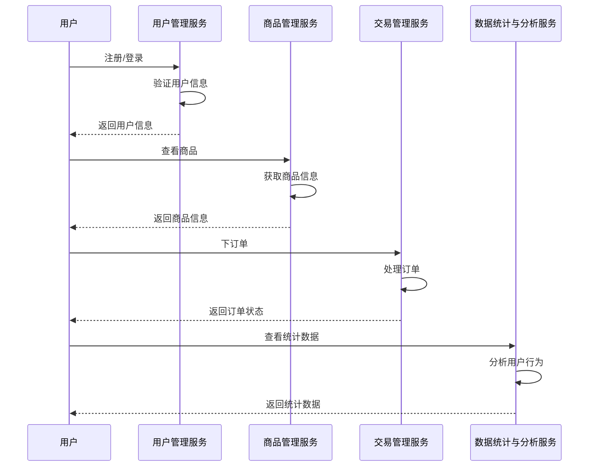

                 

# 架构演进是场持久战

> 关键词：架构演进、持续优化、技术挑战、团队协作、项目管理

> 摘要：本文旨在探讨软件系统架构演进的过程、方法论和关键策略。通过分析架构演进的原则、关键步骤、技术挑战及解决方案，结合实际案例，深入探讨架构演进在IT领域的持久战，以期为软件工程师和架构师提供有价值的参考和指导。

## 章节一：引言与背景介绍

### 1.1 问题背景

随着信息技术的迅猛发展，软件系统架构面临着越来越复杂的业务需求和多变的市场环境。传统的单体架构已经无法满足日益增长的系统复杂性和业务需求，因此，架构的演进成为了软件工程领域的重要课题。

### 1.2 问题描述

架构演进是一个长期且持续的过程，它涉及技术选型、团队协作、技术债务管理等多个方面。如何在保证系统稳定性的同时，有效地推进架构的持续优化，成为软件工程师和架构师面临的挑战。

### 1.3 问题解决

通过系统性的架构演进方法论，结合实际案例，本书将探讨如何解决架构演进过程中的关键问题。

### 1.4 边界与外延

架构演进不仅仅局限于技术层面的调整，还涉及团队文化、项目管理等多个维度。本书将提供全面而深入的视角，帮助读者理解和应对架构演进中的各种复杂情况。

### 1.5 核心概念与联系

- **架构演进**：一种持续优化软件系统架构的方法，旨在适应不断变化的业务需求和技术环境。
- **架构设计**：在软件工程中，架构设计是指对软件系统的整体结构进行规划和设计。
- **持续集成/持续部署（CI/CD）**：一种自动化软件交付流程，能够提高软件交付的效率和可靠性。

### 1.6 本章小结

本章为读者介绍了架构演进的背景、问题和解决方案，并明确了本书的研究边界和核心概念。下一章将深入探讨架构演进方法论。

## 章节二：架构演进方法论

### 2.1 架构演进的原则

架构演进的原则包括适应性、持续性、可维护性和可扩展性。这些原则指导着架构演进的方向和策略，确保系统能够适应不断变化的业务需求和技术环境。

- **适应性**：架构需具备应对业务变化的能力。这意味着在设计架构时，需要考虑到未来的扩展性和灵活性，以适应不同的业务场景。
- **持续性**：架构演进应是一个长期且持续的过程。软件系统通常需要持续优化和改进，以应对业务需求和技术的不断变化。因此，架构演进需要有一个明确的时间表和计划，确保系统能够持续保持最佳状态。
- **可维护性**：确保系统易于维护和升级。随着系统的复杂度增加，维护和升级系统的难度也会增大。因此，架构设计时需要考虑到系统的可维护性，以便在未来能够方便地进行维护和升级。
- **可扩展性**：支持系统功能的扩展和性能的提升。随着业务需求的增长，系统需要能够轻松扩展和升级，以支持更高的负载和更复杂的业务功能。

### 2.2 架构演进的关键步骤

架构演进的过程可以分为以下几个关键步骤：

- **评估当前架构**：分析现有架构的优缺点，识别问题点。这一步骤是架构演进的基础，需要对当前架构进行全面的评估，以便了解其优势和劣势，为后续的改进提供依据。
- **定义目标架构**：明确未来的架构方向和预期目标。在评估当前架构的基础上，制定未来的架构方向和预期目标，包括架构的扩展性、性能、安全性等方面。
- **制定演进计划**：制定详细的演进步骤和时间表。在明确目标架构后，需要制定详细的演进步骤和时间表，确保架构演进过程的有序进行。
- **实施与监控**：执行演进计划，并持续监控和调整。在演进过程中，需要根据实际情况对计划进行调整，确保架构演进达到预期目标。

### 2.3 架构演进策略

架构演进的过程需要采用一系列策略，以确保架构能够有效地适应业务需求和技术变化。以下是一些常见的架构演进策略：

- **逐步迭代**：通过小步快走的方式，逐步实现架构的优化。逐步迭代可以降低架构演进的风险，同时确保系统能够在每次迭代后都得到改进。
- **组件化**：将系统分解为独立的组件，提高系统的灵活性和可维护性。组件化可以使得系统更易于扩展和重构，同时提高系统的可维护性。
- **技术选型**：选择合适的编程语言、框架和工具，支持架构的演进。技术选型需要考虑到当前和未来的业务需求，确保系统能够长期稳定运行。

### 2.4 核心概念与联系

- **架构评估模型**：用于评估当前架构状态的工具和方法。架构评估模型可以帮助团队了解当前架构的优势和劣势，为后续的改进提供依据。
- **演进路径规划**：根据业务需求和架构特点，制定具体的演进路径。演进路径规划需要考虑当前架构的现状、目标架构的要求以及技术趋势，以确保架构演进的方向和策略合理。

### 2.5 本章小结

本章介绍了架构演进方法论的核心原则、关键步骤和策略。通过本章的学习，读者将能够掌握如何系统地推进架构的持续优化。下一章将探讨架构演进中的常见挑战和解决方案。

## 章节三：架构演进中的技术挑战与解决方案

### 3.1 技术债务管理

#### 问题描述

随着系统的复杂度增加，技术债务（如遗留代码、技术过时等）成为架构演进的一大障碍。技术债务是指在开发过程中积累下来的、未解决的技术问题，如代码质量差、设计不合理、技术选型不当等，这些债务会逐渐增加系统的维护成本和风险。

#### 解决方案

为了有效管理技术债务，可以采取以下解决方案：

1. **代码重构**：定期对系统中的遗留代码进行重构，提高代码质量，减少潜在的技术风险。
2. **技术升级**：及时跟进新技术的发展，将过时的技术组件升级为更高效、更稳定的替代方案。
3. **自动化测试**：建立完善的自动化测试体系，确保每次重构和升级后，系统的功能和质量都得到保证。
4. **代码审查**：定期进行代码审查，确保新的代码符合既定的编码标准和最佳实践，减少未来可能出现的技术债务。

### 3.2 持续集成与持续部署（CI/CD）

#### 问题描述

持续集成和持续部署（CI/CD）在架构演进中至关重要，但实施过程中可能面临诸多挑战，如集成过程中可能出现的问题、部署过程中可能导致的系统故障等。这些挑战会影响系统的稳定性和可靠性，阻碍架构的持续优化。

#### 解决方案

为了克服CI/CD过程中的挑战，可以采取以下解决方案：

1. **自动化测试**：建立完善的自动化测试体系，确保每次集成和部署前，系统功能和质量都经过严格的测试。
2. **环境隔离**：为每次集成和部署创建独立的测试环境，避免部署过程中的冲突和问题对其他环境造成影响。
3. **滚动部署**：采用滚动部署策略，逐步将新版本的应用部署到生产环境，减少系统故障的风险。
4. **监控与报警**：建立全面的监控系统，实时监控系统的性能和状态，及时发现并处理潜在的问题。

### 3.3 架构重构

#### 问题描述

随着业务需求的变化，系统需要进行架构重构，但过程复杂且风险高。架构重构是指在现有架构基础上，对系统进行大规模的调整和改进，以适应新的业务需求和技术环境。然而，重构过程中可能面临代码质量差、依赖关系复杂、风险控制难度大等问题。

#### 解决方案

为了有效地进行架构重构，可以采取以下解决方案：

1. **逐步重构**：采用逐步重构的方式，分阶段、分模块地完成重构任务，降低重构过程中的风险。
2. **代码审查**：在重构过程中，定期进行代码审查，确保重构后的代码符合既定的编码标准和最佳实践。
3. **风险管理**：建立完善的风险管理机制，对重构过程中的潜在风险进行识别、评估和应对。
4. **文档和培训**：编写详细的重构文档，并对团队成员进行培训，确保重构任务能够顺利执行。

### 3.4 核心概念与联系

- **技术债务**：系统中的技术债务是指由于未及时维护和优化而产生的潜在风险。
- **CI/CD实践**：持续集成和持续部署的具体实施方法，包括自动化测试、环境隔离、滚动部署等。

### 3.5 本章小结

本章讨论了架构演进中的技术挑战，并提供了相应的解决方案。通过本章的学习，读者将能够更好地应对架构演进过程中的技术问题。下一章将深入探讨架构演进中的团队协作和项目管理。

## 章节四：团队协作与项目管理

### 4.1 团队协作的重要性

架构演进是一个复杂的过程，需要多个团队的紧密协作。不同团队之间可能存在技术背景、工作习惯和沟通方式等方面的差异，这可能导致协作困难，影响架构演进的效果。

#### 问题描述

- **技术背景差异**：不同团队可能拥有不同的技术背景和经验，导致在架构演进过程中，对问题的理解、解决方案的选择等方面存在分歧。
- **工作习惯不同**：不同团队的工作习惯和流程可能不同，如代码评审、测试流程等，这可能导致协作效率低下。
- **沟通不畅**：由于团队成员之间的沟通不畅，可能导致信息传递不及时、不准确，影响团队协作效果。

#### 解决方案

为了提高团队协作效率，可以采取以下解决方案：

1. **建立有效的沟通机制**：定期召开团队会议，确保团队成员能够及时了解项目进展和需求变化，减少信息传递的滞后。
2. **代码评审与知识分享**：推行代码评审制度，确保代码质量，同时促进团队成员之间的知识分享。
3. **培训与交流**：定期组织培训和技术交流活动，提高团队成员的技术水平和协作能力。

### 4.2 项目管理策略

在架构演进项目中，项目管理策略的制定和执行至关重要。有效的项目管理策略可以确保项目按照既定的时间、质量和成本要求顺利完成。

#### 问题描述

- **进度延误**：在架构演进过程中，可能由于技术债务、人员变动等原因导致项目进度延误。
- **资源分配不合理**：在资源有限的情况下，如何合理分配资源，确保关键任务得到优先处理。
- **风险管理不足**：在架构演进过程中，可能面临各种技术风险和管理风险，如技术债务、项目进度延误等。

#### 解决方案

为了有效应对项目管理中的挑战，可以采取以下解决方案：

1. **制定详细的项目计划**：在项目开始前，制定详细的项目计划，包括任务分解、时间表、资源分配等，确保项目目标明确、进度可控。
2. **动态调整计划**：在项目执行过程中，根据实际情况对计划进行动态调整，确保项目能够按照预期目标进行。
3. **建立风险管理机制**：对项目中的潜在风险进行识别、评估和应对，确保项目能够在遇到风险时及时采取措施。

### 4.3 团队协作工具

为了提高团队协作效率，可以采用以下团队协作工具：

- **项目管理工具**：如JIRA、Trello等，用于任务管理、进度跟踪和资源分配。
- **代码管理工具**：如Git、SVN等，用于代码的版本管理和协作开发。
- **沟通工具**：如Slack、Zoom等，用于团队内部的实时沟通和协作。
- **文档管理工具**：如Confluence、Notion等，用于文档的编写、共享和版本管理。

### 4.4 核心概念与联系

- **团队协作**：团队协作是指多个团队成员在共同目标下，通过有效沟通和协作，共同完成任务的过程。
- **项目管理**：项目管理是指通过计划、组织、协调和控制等手段，确保项目在预定的时间、质量和成本内顺利完成。

### 4.5 本章小结

本章讨论了架构演进中的团队协作和项目管理问题，并提出了相应的解决方案。通过有效的团队协作和项目管理策略，可以确保架构演进项目的顺利进行。下一章将结合实际案例，进一步探讨架构演进的过程和方法。

## 章节五：实际案例研究

### 5.1 案例背景

以一家电子商务公司为例，该公司在其业务快速发展过程中，面临着系统架构的瓶颈。原有的单体架构已经无法满足日益增长的交易量和用户需求，导致系统性能下降、扩展困难、维护成本高。因此，公司决定进行架构的演进，以提升系统的性能、扩展性和稳定性。

### 5.2 系统功能设计

在架构演进之前，公司首先对现有系统进行了详细的评估，明确了系统的核心功能，包括：

1. **用户管理**：用户注册、登录、个人信息管理等。
2. **商品管理**：商品分类、商品信息展示、库存管理、订单管理、支付等。
3. **交易管理**：订单生成、支付处理、订单状态跟踪、物流信息管理等。
4. **数据统计与分析**：用户行为分析、销售数据统计、业务预测等。

### 5.3 系统架构设计

为了满足上述功能需求，公司决定采用微服务架构。微服务架构可以将整个系统拆分为多个独立的微服务，每个微服务负责一个特定的功能模块，如用户管理、商品管理、交易管理、数据统计与分析等。以下是系统架构的mermaid架构图：

### 5.4 系统接口设计

在微服务架构中，各个微服务之间通过接口进行通信。以下是系统接口设计的mermaid序列图：

### 5.5 实际案例分析与讲解

在架构演进过程中，公司面临了以下几个关键问题：

1. **技术债务管理**：由于原有单体架构的代码质量较差，存在大量的遗留代码和技术债务。为了解决这个问题，公司采用了逐步重构的方式，分阶段对各个模块进行重构。在重构过程中，公司还采用了代码审查和自动化测试，确保重构后的代码质量。
2. **持续集成与持续部署**：为了提高软件交付的效率和可靠性，公司建立了完善的CI/CD流程。每次代码提交后，都会经过自动化测试，确保代码的稳定性和质量。同时，公司采用了滚动部署策略，将新版本的应用逐步部署到生产环境，减少系统故障的风险。
3. **团队协作与项目管理**：在架构演进过程中，公司建立了多个跨职能团队，每个团队负责不同的微服务模块。通过定期的团队会议、代码评审和知识分享活动，公司确保了团队之间的紧密协作。在项目管理方面，公司采用了敏捷开发方法，灵活调整项目计划，确保项目能够按照预期目标进行。

通过架构演进，公司成功解决了原有单体架构的瓶颈问题，系统性能和扩展性得到了显著提升。用户满意度也大幅提高，业务收入实现了稳定增长。

### 5.6 本章小结

通过本章的实际案例研究，读者可以深入了解架构演进的过程和方法。通过分析案例中的关键问题，读者可以学习到如何有效地进行技术债务管理、持续集成与持续部署、团队协作和项目管理。这些经验对于其他进行架构演进的IT项目具有重要的参考价值。

## 章节六：最佳实践与总结

### 6.1 最佳实践

在架构演进过程中，以下最佳实践可以帮助团队更加高效地推进项目：

1. **持续学习与知识分享**：鼓励团队成员持续学习新技术和最佳实践，并通过定期的知识分享活动，将所学知识传递给其他成员。
2. **小步快走**：采用逐步迭代的方式，每次只进行一小部分改动，以降低风险。这样可以确保每次迭代后的系统都是稳定的，同时逐步实现整体架构的优化。
3. **代码审查与自动化测试**：在开发过程中，定期进行代码审查，确保代码质量。同时，建立完善的自动化测试体系，确保每次代码提交后，系统的功能和质量都经过严格测试。
4. **项目管理与沟通**：建立有效的项目管理机制，确保项目进度、资源和风险都得到有效管理。同时，建立良好的沟通机制，确保团队成员之间的信息传递和协作顺畅。

### 6.2 总结

架构演进是软件工程领域的一项重要任务，它关系到系统的性能、扩展性和稳定性。通过本文的探讨，读者可以了解到架构演进的方法论、技术挑战与解决方案、团队协作与项目管理，以及实际案例中的应用。以下是对本文内容的总结：

1. **架构演进的原则**：包括适应性、持续性、可维护性和可扩展性。
2. **架构演进的关键步骤**：评估当前架构、定义目标架构、制定演进计划和实施与监控。
3. **架构演进策略**：逐步迭代、组件化和技术选型。
4. **技术挑战与解决方案**：技术债务管理、持续集成与持续部署、架构重构。
5. **团队协作与项目管理**：建立有效的沟通机制、项目管理策略、团队协作工具。
6. **实际案例**：电子商务公司进行架构演进的案例，展示了如何应对技术债务、CI/CD和团队协作等挑战。

通过本文的阅读，读者可以更好地理解架构演进的过程和方法，为实际项目提供有价值的参考和指导。

### 6.3 小结

架构演进是一场持久战，它需要团队持续的努力和不断的优化。通过本文的探讨，我们了解了架构演进的核心概念、方法论、技术挑战和解决方案，以及团队协作和项目管理的策略。希望通过本文，读者能够更好地应对架构演进中的各种挑战，为软件系统的发展奠定坚实的基础。

## 作者信息

作者：AI天才研究院/AI Genius Institute & 禅与计算机程序设计艺术 /Zen And The Art of Computer Programming

