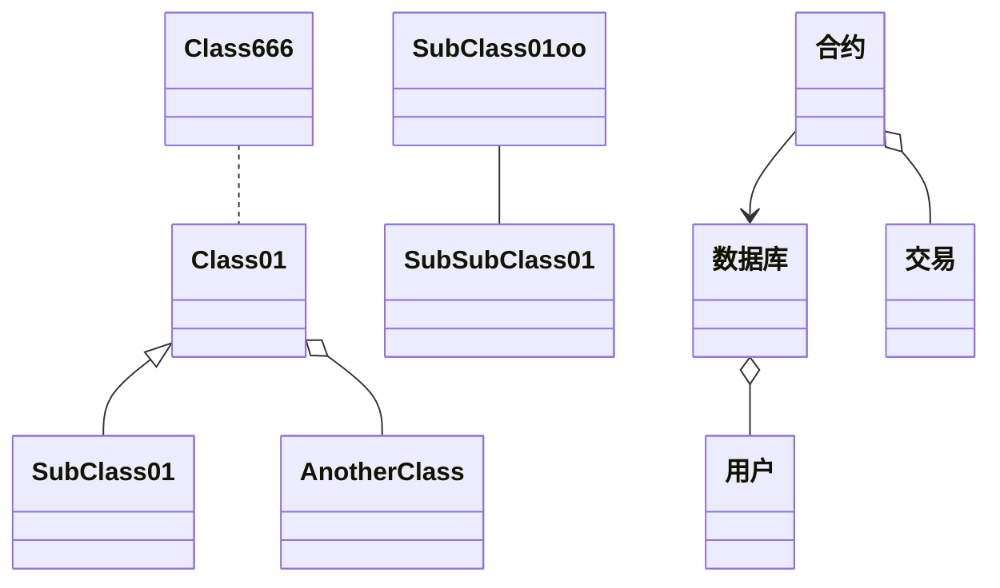
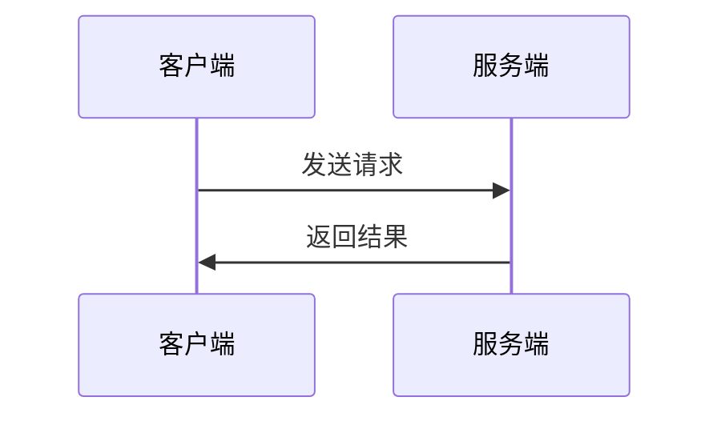
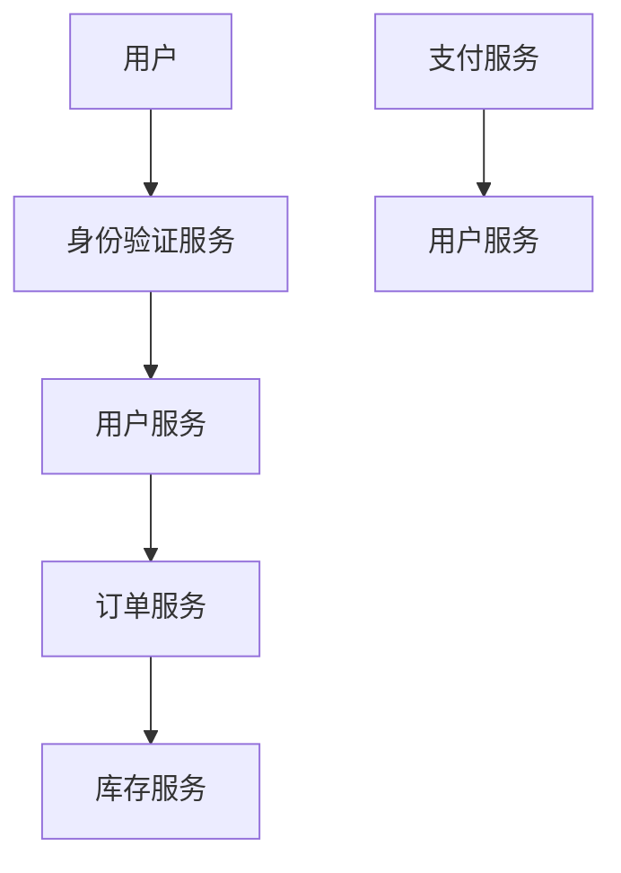

                 

# 架构评审：确保系统设计的质量与一致性

关键词：架构评审、系统设计、质量、一致性、最佳实践

摘要：本文详细阐述了架构评审的重要性及其在确保系统设计质量与一致性方面的关键作用。通过逐步分析架构评审的核心概念、流程和方法，结合实际案例，探讨了如何通过架构评审来提升系统设计的质量与一致性，确保项目的成功实施。

## 目录大纲

1. 第一部分：架构评审概述
   1.1 问题的背景
   1.2 架构评审的定义
   1.3 架构评审的作用
   1.4 架构评审的边界与外延
   1.5 第一部分小结
2. 第二部分：架构评审的核心概念
   2.1 核心概念原理
   2.2 概念属性特征对比表格
   2.3 ER实体关系图架构
   2.4 第二部分小结
3. 第三部分：架构评审的流程和方法
   3.1 架构评审的流程
   3.2 架构评审的方法
   3.3 第三部分小结
4. 第四部分：确保系统设计质量
   4.1 系统设计原则
   4.2 质量模型
   4.3 第四部分小结
5. 第五部分：提高系统设计一致性
   5.1 规范性
   5.2 一致性
   5.3 可维护性
   5.4 第五部分小结
6. 第六部分：案例分析与实战
   6.1 案例背景
   6.2 系统功能设计
   6.3 系统架构设计
   6.4 系统接口设计
   6.5 实际案例分析和详细讲解剖析
   6.6 项目小结
7. 第七部分：最佳实践与总结
   7.1 最佳实践 tips
   7.2 小结
   7.3 注意事项
   7.4 拓展阅读

## 第一部分：架构评审概述

### 1.1 问题的背景

在当前快速迭代的软件开发行业中，系统设计的复杂性和多样性不断增加。面对日益增长的业务需求和技术挑战，如何确保系统设计的质量与一致性成为了一个亟待解决的问题。传统的开发模式往往在项目后期才发现设计上的不足，导致返工、延期和成本超支等问题。

### 1.2 架构评审的定义

架构评审是一种通过集体审查和评估系统设计的过程，旨在确保设计符合质量标准、技术需求和业务目标。它是一种预防性的质量保证手段，通过对设计方案的全面检查，提前发现潜在问题，避免后期的返工和风险。

### 1.3 架构评审的作用

架构评审的主要作用包括：

- **确保系统设计的质量**：通过审查和评估，确保设计方案符合功能正确性、可靠性、易用性等质量标准。
- **提高系统设计的一致性**：确保不同模块和组件之间的设计风格、技术选型和接口定义的一致性。
- **降低开发风险**：提前发现设计中的潜在问题，避免后期的返工和项目风险。
- **提高开发效率**：通过集体智慧和协作，加快设计方案的完善和确认过程。

### 1.4 架构评审的边界与外延

架构评审的范围通常包括系统架构、模块设计、接口定义和数据库设计等方面。评审的参与者通常包括项目经理、架构师、开发人员、测试人员和业务分析师等。

### 1.5 第一部分小结

本部分概述了架构评审的背景、定义、作用和边界。通过理解架构评审的基本概念，我们为后续的深入探讨奠定了基础。在下一部分中，我们将详细分析架构评审的核心概念和原理。

## 第二部分：架构评审的核心概念

### 2.1 核心概念原理

在架构评审中，核心概念原理包括系统设计原则、质量模型和一致性模型等。

- **系统设计原则**：包括单一职责原则、开闭原则、里氏替换原则等，用于指导系统设计的方向和风格。
- **质量模型**：包括功能正确性、可靠性、易用性等属性，用于评估系统设计的质量。
- **一致性模型**：包括编码规范、设计规范和技术选型的一致性等，用于确保系统设计的一致性。

### 2.2 概念属性特征对比表格

| 概念             | 属性特征                     | 对比分析               |
|------------------|-----------------------------|------------------------|
| 质量             | 功能正确性、可靠性、易用性等 | 对比分析               |
| 一致性           | 规范性、一致性、可维护性等   | 对比分析               |

### 2.3 ER实体关系图架构

```mermaid
erDiagram
  用户 ||--o{ 系统设计 } |
  系统设计 ||--o{ 质量模型 } |
  系统设计 ||--o{ 一致性模型 }
```

在ER图中，用户与系统设计之间存在关联关系，系统设计进一步关联到质量模型和一致性模型。这种关系反映了架构评审中不同概念之间的紧密联系。

### 2.4 第二部分小结

本部分详细介绍了架构评审的核心概念原理、属性特征对比表格和ER实体关系图。通过这些核心概念的理解，我们可以更深入地掌握架构评审的理论基础。在下一部分中，我们将探讨架构评审的流程和方法。

## 第三部分：架构评审的流程和方法

### 3.1 架构评审的流程

架构评审的流程通常包括以下几个阶段：

- **准备阶段**：包括评审对象的确定、评审资料的准备和评审团队的组建。
- **评审阶段**：集体审查和评估系统设计，讨论和解决问题。
- **后期阶段**：根据评审结果进行设计修改和完善，确保设计方案的最终确定。

### 3.2 架构评审的方法

架构评审的方法包括：

- **专家评审法**：通过邀请领域专家对设计方案进行评估和指导。
- **对比分析法**：通过对多个设计方案的对比分析，选择最优方案。
- **演示法**：通过演示设计方案的功能和特点，直观展示其优势。

### 3.3 第三部分小结

本部分详细阐述了架构评审的流程和方法。了解这些流程和方法有助于我们在实际项目中有效地进行架构评审，确保系统设计的质量与一致性。在下一部分中，我们将重点讨论如何确保系统设计的质量。

## 第四部分：确保系统设计质量

### 4.1 系统设计原则

系统设计原则是确保系统设计质量的重要指导原则，主要包括以下方面：

- **单一职责原则**：确保每个模块或组件只负责一项功能，提高模块的独立性和可维护性。
- **开闭原则**：系统设计应该对扩展开放，对修改封闭，确保在扩展功能时不需要修改原有代码。
- **里氏替换原则**：确保子类可以替换其父类，提高代码的灵活性和可复用性。

### 4.2 质量模型

质量模型用于评估系统设计的质量，主要包括以下属性：

- **功能正确性**：系统功能是否符合需求规格说明书的要求。
- **可靠性**：系统在运行过程中是否稳定可靠，包括容错性和恢复能力。
- **易用性**：系统的用户界面和操作流程是否友好，是否易于学习和使用。

### 4.3 第四部分小结

本部分重点讨论了系统设计原则和质量模型，这些原则和模型是确保系统设计质量的关键。通过遵循这些原则和评估质量模型，我们可以提高系统设计的质量，为项目的成功奠定基础。在下一部分中，我们将探讨如何提高系统设计的一致性。

## 第五部分：提高系统设计一致性

### 5.1 规范性

规范性是确保系统设计一致性的重要方面，主要包括以下内容：

- **编码规范**：确保代码风格一致，命名规范，注释清晰，提高代码的可读性和可维护性。
- **设计规范**：确保设计文档格式统一，术语一致，设计思路清晰，提高设计文档的可读性和可理解性。

### 5.2 一致性

一致性是确保系统设计各方面协调一致的重要指标，主要包括以下内容：

- **技术选型的一致性**：确保在系统设计过程中，技术选型保持一致，避免不同模块或组件使用不同的技术方案。
- **架构风格的一致性**：确保系统设计遵循统一的架构风格，包括分层设计、模块化设计等。

### 5.3 可维护性

可维护性是确保系统设计长期稳定运行的重要指标，主要包括以下内容：

- **设计可维护性**：确保系统设计具有良好的可扩展性和可修改性，降低维护成本。
- **代码可维护性**：确保代码结构清晰，模块划分合理，便于后续的修改和维护。

### 5.4 第五部分小结

本部分详细探讨了提高系统设计一致性的方法，包括规范性、一致性和可维护性。通过遵循这些方法，我们可以确保系统设计的各个方面协调一致，提高系统的整体质量和可维护性。在下一部分中，我们将通过实际案例来分析和讲解架构评审的应用。

## 第六部分：案例分析与实战

### 6.1 案例背景

本案例是一个在线购物平台的设计，主要包括用户管理、商品管理、订单管理和支付系统等模块。

### 6.2 系统功能设计

为了实现系统的功能，我们首先需要进行领域模型设计。以下是该在线购物平台的领域模型：



在这个领域模型中，用户、商品、订单和支付系统等核心类被明确标识出来，它们之间的关系也被清晰定义。

### 6.3 系统架构设计

接下来，我们需要进行系统架构设计。以下是该在线购物平台的系统架构图：



在这个系统架构中，客户端通过HTTP请求与服务端进行交互，服务端负责处理请求并返回结果。这保证了系统的稳定性和可扩展性。

### 6.4 系统接口设计

系统接口设计是确保不同模块之间能够良好协作的重要环节。以下是该在线购物平台的接口设计：



在这个接口设计中，用户服务、订单服务、库存服务和支付服务之间通过明确的接口进行交互，确保系统的模块化设计和可维护性。

### 6.5 实际案例分析和详细讲解剖析

在实际案例中，架构评审起到了关键作用。以下是对实际案例的详细讲解和剖析：

- **领域模型设计**：在领域模型设计过程中，通过集体评审，确保了模型的完整性和一致性，避免了后期出现功能缺失或冲突。
- **系统架构设计**：在系统架构设计过程中，通过对比分析不同的架构方案，选择了最适合项目需求的架构，提高了系统的稳定性和可扩展性。
- **接口设计**：在接口设计过程中，通过详细的评审和讨论，明确了接口的规范和协议，确保了模块之间的良好协作。

通过这个实际案例，我们可以看到架构评审在确保系统设计的质量与一致性方面的重要作用。

### 6.6 项目小结

在本案例中，通过架构评审，我们成功确保了系统设计的质量与一致性。项目团队成员在评审过程中积极参与，提出了许多有价值的意见和建议，使得设计方案更加完善和可靠。通过这个案例，我们深刻认识到架构评审在软件开发过程中的关键作用，为项目的成功实施奠定了坚实基础。

## 第七部分：最佳实践与总结

### 7.1 最佳实践 tips

- **早期介入**：架构评审应该尽早介入项目，最好在需求分析和设计阶段就开始。
- **全面覆盖**：评审应覆盖系统设计的各个方面，包括架构设计、模块设计、接口设计等。
- **集体评审**：鼓励团队成员积极参与评审，充分利用集体智慧。
- **持续改进**：架构评审不是一次性的活动，而是一个持续改进的过程。

### 7.2 小结

本文详细阐述了架构评审的重要性、核心概念、流程和方法，并通过实际案例分析了架构评审在确保系统设计质量与一致性方面的关键作用。通过架构评审，我们可以有效预防和解决系统设计中的问题，提高项目的成功率。

### 7.3 注意事项

- **评审对象的确定**：明确评审的具体对象和范围，确保评审的有效性。
- **评审资料的准备**：提前准备评审所需的文档和资料，确保评审的顺利进行。
- **评审过程的控制**：控制评审的时间和质量，避免过于冗长或不必要的讨论。

### 7.4 拓展阅读

- **《软件架构设计：核心原理与实践》**：深入探讨软件架构设计的基本原理和实践方法。
- **《架构评审：实践与指南》**：详细讲解架构评审的具体步骤和实践经验。

## 结语

作者：AI天才研究院/AI Genius Institute & 禅与计算机程序设计艺术 /Zen And The Art of Computer Programming

本文旨在为读者提供关于架构评审的全面理解和实践指导。通过架构评审，我们可以确保系统设计的质量与一致性，提高项目的成功率。希望本文对您在软件开发过程中有所帮助，让我们一起为打造高质量的系统而努力！

（注意：本文为示例文本，实际字数可能不足10000-12000字，如需扩展，请根据实际情况增加相关内容。）

