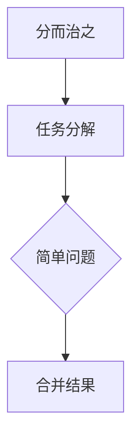
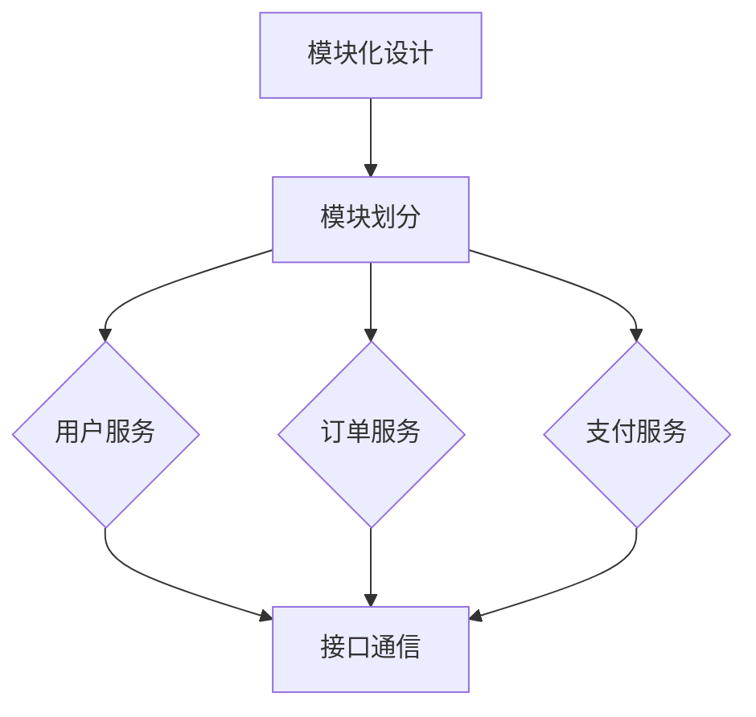
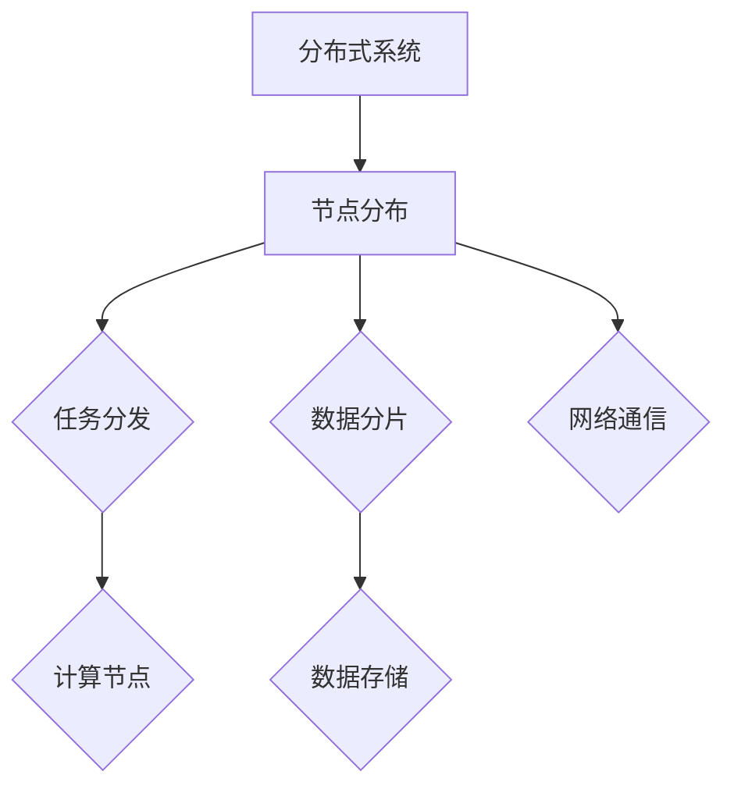
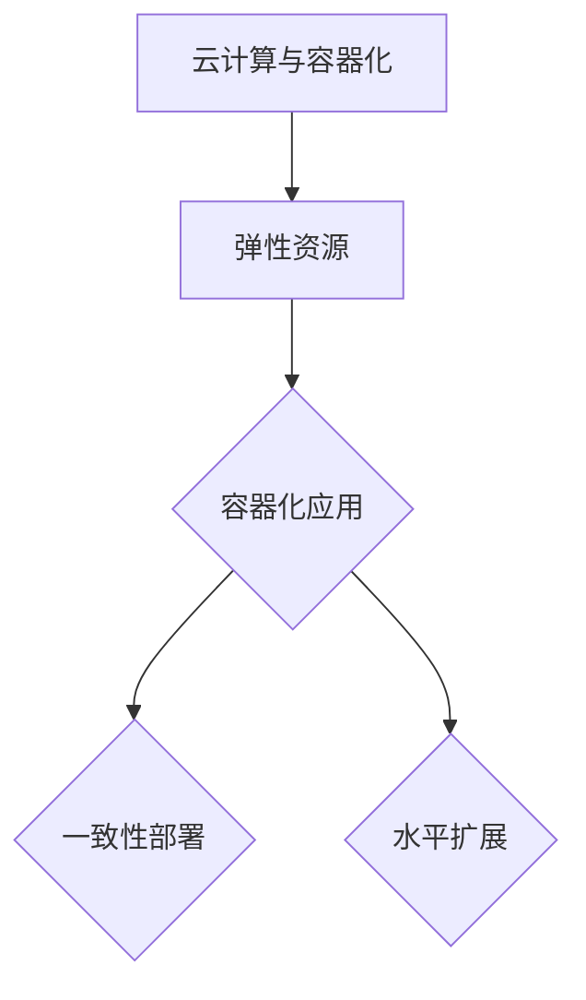
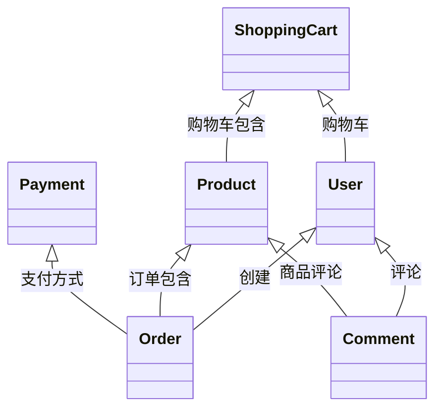
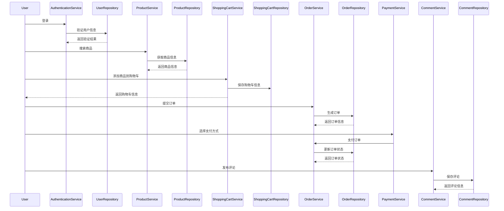

                 


### 第一部分: 引言与背景

#### 1. 背景介绍

**1.1 计算机技术的发展历程**

计算机技术的发展历程可以追溯到20世纪40年代，当时第一台电子计算机ENIAC的诞生标志着计算机时代的开启。自那时起，计算机技术经历了从大型主机到微型计算机，再到个人电脑和移动设备的演进。每一步的进步都伴随着硬件性能的提升和软件复杂性的增加。

**1.2 复杂性问题在计算机科学中的重要性**

随着计算机技术的发展，复杂性问题逐渐成为计算机科学领域的重要议题。复杂性不仅体现在硬件层面，也体现在软件层面。从算法复杂性到系统复杂性，复杂性问题的解决成为推动计算机技术进步的关键因素。

**1.3 对复杂性的认知对架构设计的影响**

对复杂性的认知深刻影响着架构设计。一个优秀的架构师必须理解并应对系统中的复杂性，以设计出高效、可扩展且易于维护的系统。本文将深入探讨系统复杂性的定义、分类以及应对策略，为架构设计提供理论指导。

#### 1.4 核心概念

**1.4.1 复杂性定义**

复杂性可以定义为系统中元素及其相互作用的复杂程度。在计算机科学中，复杂性通常与系统的性能、可扩展性、可维护性等因素相关。

**1.4.2 系统复杂性分类**

系统复杂性可以根据不同的维度进行分类，例如根据系统特征分类、根据系统演化过程分类以及根据系统影响范围分类。

**1.4.3 架构复杂性特征**

架构复杂性特征包括可扩展性、可维护性、性能和安全性等。理解这些特征有助于架构师在设计过程中更好地应对复杂性。

#### 1.5 联系与对比

**1.5.1 复杂性与系统性能的关系**

系统性能与复杂性密切相关。一个高度复杂的系统可能具有较高的性能，但也可能导致性能下降。

**1.5.2 复杂性与系统可扩展性的关系**

复杂系统通常具有较好的可扩展性，但也可能因为过度复杂而难以扩展。

**1.5.3 架构复杂性与其他领域的对比**

架构复杂性与其他领域，如软件工程、系统工程和人工智能等，存在一定的联系和区别。这些领域的复杂性特征和应对策略各有侧重。

#### 1.6 本章小结

本文引出了系统复杂性在计算机科学中的重要性和对架构设计的深远影响。接下来，我们将进一步探讨系统复杂性的原理，为深入理解复杂性提供理论基础。

----------------------------------------------------------------

## 2. 系统复杂性原理

#### 2.1 系统复杂性定义

系统复杂性指的是系统中元素及其相互作用的复杂程度。在计算机科学中，系统复杂性通常与系统的性能、可扩展性、可维护性等因素相关。复杂性可以是结构上的，如系统组件的复杂关系；也可以是行为上的，如系统运行时的动态变化。

**2.1.1 系统复杂性的内涵**

系统复杂性的内涵包括以下几个方面：

1. **元素多样性**：系统中包含多种不同类型的元素，这些元素之间可能存在复杂的相互作用。
2. **相互关系复杂**：系统中的元素之间存在复杂的依赖关系和交互方式。
3. **动态变化**：系统在运行过程中可能经历复杂的状态变化，这些变化可能受到外部环境和内部交互的影响。

**2.1.2 系统复杂性的外延**

系统复杂性的外延可以从不同维度进行扩展：

1. **时间维度**：系统在不同时间点的状态和特性可能发生变化，这增加了系统的复杂性。
2. **空间维度**：系统在空间上的分布和布局可能影响其复杂性，尤其是在分布式系统中。
3. **信息维度**：系统处理的信息量和信息类型也会影响其复杂性。

**2.1.3 系统复杂性的度量方法**

系统复杂性的度量方法多种多样，以下是一些常见的度量方法：

1. **元素数量**：系统中的元素数量越多，其复杂性通常越高。
2. **依赖关系数量**：系统中的依赖关系数量也是衡量复杂性的一个指标。
3. **算法复杂性**：系统的算法复杂度，如时间复杂度和空间复杂度，可以用来衡量系统的运行效率。
4. **熵**：信息熵是衡量系统信息复杂性的一个指标，它可以用来量化系统中的不确定性。

#### 2.2 系统复杂性分类

系统复杂性可以根据不同的标准进行分类，以下是一些常见的分类方法：

**2.2.1 根据系统特征分类**

1. **结构复杂性**：关注系统的组件结构和相互关系。
2. **行为复杂性**：关注系统的动态行为和状态变化。
3. **信息复杂性**：关注系统中信息的复杂性和处理方式。

**2.2.2 根据系统演化过程分类**

1. **静态复杂性**：系统在某一时刻的复杂性，不考虑时间变化。
2. **动态复杂性**：系统在运行过程中的复杂性，考虑时间变化。
3. **演化复杂性**：系统从初始状态到最终状态的变化过程。

**2.2.3 根据系统影响范围分类**

1. **局部复杂性**：系统某一局部区域的复杂性。
2. **全局复杂性**：整个系统的复杂性。
3. **层次复杂性**：系统在不同抽象层次的复杂性。

#### 2.3 核心概念与联系

**2.3.1 复杂性与概率论的联系**

概率论是研究随机现象和不确定性的一门学科，它与系统复杂性密切相关。在复杂系统中，许多现象和结果都是随机的，概率论可以用来预测和分析这些不确定性。

**2.3.2 复杂性与统计学的关系**

统计学是研究数据收集、分析和解释的一门学科，它也可以用于分析复杂系统的特性。通过统计分析，可以揭示复杂系统中的规律和模式。

**2.3.3 复杂性与计算机科学中其他领域的联系**

1. **人工智能**：人工智能领域中的许多问题，如机器学习、神经网络和智能搜索，都涉及系统复杂性。
2. **软件工程**：软件工程中的许多挑战，如代码复杂性和软件可维护性，都与系统复杂性有关。
3. **计算机网络**：计算机网络中的复杂问题，如网络拓扑结构和流量控制，也需要对系统复杂性进行深入理解。

#### 2.4 复杂性特征对比表格

| 复杂性特征 | 说明 |
| :-------: | :--- |
| 结构复杂性 | 系统组件及其关系的复杂程度 |
| 行为复杂性 | 系统运行时的动态行为 |
| 信息复杂性 | 系统处理的信息量和类型 |
| 静态复杂性 | 系统某一时刻的复杂性 |
| 动态复杂性 | 系统运行过程中的复杂性 |
| 局部复杂性 | 系统某一局部区域的复杂性 |
| 全局复杂性 | 整个系统的复杂性 |
| 层次复杂性 | 系统在不同抽象层次的复杂性 |

#### 2.5 ER实体关系图

```mermaid
erDiagram
  User ||--|{ Order } : 拥有
  Product ||--|{ Order } : 订单包含
```

#### 2.6 本章小结

通过对系统复杂性原理的探讨，我们深入了解了复杂性的内涵、分类及其在计算机科学中的应用。理解系统复杂性对于架构设计至关重要，它为后续讨论复杂性应对策略提供了理论基础。

----------------------------------------------------------------

## 3. 架构复杂性特征与评估

#### 3.1 架构复杂性特征

架构复杂性特征是评估和设计系统架构的关键因素。以下是几个重要的架构复杂性特征：

**3.1.1 可扩展性**

可扩展性指的是系统在面临增长的需求时，能够适应并有效处理这种增长的能力。高可扩展的系统可以通过水平扩展（增加节点）或垂直扩展（增加资源）来应对负载的增加。

**3.1.2 可维护性**

可维护性指的是系统在长期运行过程中，能够被轻松修改、更新和修复的能力。一个高可维护的系统应具备清晰的代码结构、完善的文档和良好的模块化设计。

**3.1.3 性能**

性能是指系统在执行任务时的效率，包括响应时间、处理速度和资源利用率等指标。高性能的系统能够快速响应用户请求并有效利用资源。

**3.1.4 安全性**

安全性是指系统抵御外部攻击和内部泄露的能力。安全性是架构设计中的一个关键考虑因素，系统必须能够保护数据完整性和用户隐私。

#### 3.2 架构复杂性评估方法

评估架构复杂性有多种方法，包括实践评估方法和模型评估方法。

**3.2.1 实践评估方法**

实践评估方法通过实际操作和测试来评估系统的复杂性。以下是一些常见的实践评估方法：

1. **代码审查**：通过代码审查，可以发现代码中的复杂结构和不规范代码，从而评估系统的复杂性。
2. **性能测试**：通过模拟实际负载，评估系统在不同负载下的性能，从而判断系统的复杂性和潜在瓶颈。
3. **用户反馈**：收集用户的反馈，了解系统在实际使用中的复杂性和用户体验。

**3.2.2 模型评估方法**

模型评估方法通过构建数学模型或仿真模型来评估系统的复杂性。以下是一些常见的模型评估方法：

1. **复杂性度量模型**：通过建立复杂性度量模型，如代码复杂度模型，来量化系统的复杂性。
2. **仿真模型**：通过构建仿真模型，模拟系统在不同条件下的行为，从而评估系统的复杂性和性能。

**3.2.3 自动评估工具**

自动评估工具可以自动化地评估系统的复杂性。以下是一些常见的自动评估工具：

1. **静态代码分析工具**：如SonarQube，可以自动分析代码质量，识别潜在的复杂性。
2. **性能测试工具**：如JMeter，可以自动执行性能测试，评估系统在不同负载下的性能。
3. **架构评估工具**：如CAFE，可以自动评估系统架构的复杂性、可维护性和性能。

#### 3.3 架构复杂性特征对比表格

| 特征 | 说明 | 评估方法 |
| :--: | :--: | :------: |
| 可扩展性 | 系统适应负载增长的能力 | 水平/垂直扩展测试 |
| 可维护性 | 系统修改、更新和修复的能力 | 代码审查、文档检查 |
| 性能 | 系统执行任务的效率 | 性能测试 |
| 安全性 | 系统抵御攻击的能力 | 安全审计、漏洞扫描 |

#### 3.4 本章小结

本章探讨了架构复杂性特征以及评估方法。理解并评估架构复杂性对于设计高效、可靠和可扩展的系统至关重要。下一章将介绍应对复杂性的策略，为架构设计提供实际操作指南。

----------------------------------------------------------------

## 4. 复杂性应对策略

在面对系统复杂性时，架构师需要采取一系列策略来降低复杂性、提高系统的可扩展性和可维护性。以下是一些常见的复杂性应对策略：

#### 4.1 分而治之

**原理**：分而治之是一种常用的算法设计策略，其核心思想是将复杂问题分解为若干个较简单的问题，分别解决后再合并结果。这种方法可以降低单个问题的复杂度，使得问题更容易解决。

**应用实例**：在分布式系统中，可以将任务分配给多个节点处理，每个节点负责一部分数据的处理，然后将结果汇总。这种方法可以显著提高系统的处理能力和可扩展性。



#### 4.2 模块化设计

**原理**：模块化设计是将系统划分为若干独立的模块，每个模块负责特定的功能。模块之间通过清晰的接口进行通信，降低了模块内部的复杂性。

**应用实例**：在软件设计中，可以将系统划分为多个服务模块，如用户服务、订单服务和支付服务。每个模块负责特定的业务逻辑，通过API进行通信。这种方法可以提高系统的可维护性和可扩展性。



#### 4.3 分布式系统

**原理**：分布式系统通过将计算任务分布在多个节点上，从而提高了系统的处理能力和容错性。分布式系统中的每个节点都可以独立处理任务，并通过网络进行通信。

**应用实例**：在大数据处理中，可以使用分布式文件系统（如Hadoop HDFS）和分布式计算框架（如Apache Spark），将海量数据分片存储和处理，从而提高处理效率。



#### 4.4 云计算与容器化

**原理**：云计算提供了弹性的计算资源，可以根据需求动态调整资源。容器化技术（如Docker）则提供了一种轻量级、独立的运行环境，使得应用可以在不同的环境中一致运行。

**应用实例**：在云计算环境中，可以使用容器化技术部署和运维应用。容器化应用可以方便地进行水平扩展，并减少环境差异带来的复杂性。



#### 4.5 本章小结

本章介绍了多种应对系统复杂性的策略，包括分而治之、模块化设计、分布式系统、云计算与容器化等。这些策略可以有效地降低系统的复杂性，提高系统的可扩展性和可维护性。下一章将结合实际项目，展示如何将这些策略应用于架构设计。

----------------------------------------------------------------

## 5. 项目实战：架构设计

#### 5.1 项目背景

**5.1.1 需求分析**

本项目旨在设计一个电商系统，该系统需要具备以下功能：

1. **用户注册与登录**：用户可以注册账号并登录系统。
2. **商品浏览与搜索**：用户可以浏览商品并使用关键词搜索商品。
3. **购物车管理**：用户可以将商品加入购物车，修改购物车中的商品数量，删除商品。
4. **订单管理**：用户可以提交订单，系统生成订单号，并跟踪订单状态。
5. **支付功能**：用户可以选择不同的支付方式，如支付宝和微信支付。
6. **用户评论**：用户可以评论购买的商品。

**5.1.2 项目目标**

项目目标如下：

1. **可扩展性**：系统需要能够应对大量用户和海量商品。
2. **高性能**：系统需要能够快速响应用户请求。
3. **安全性**：系统需要保护用户数据和交易安全。
4. **易维护性**：系统代码结构清晰，便于维护和更新。

#### 5.2 系统功能设计

**5.2.1 领域模型设计**

以下是一个简单的领域模型设计，用于描述系统中的关键实体及其关系：



**5.2.2 功能模块划分**

根据领域模型，可以将系统划分为以下功能模块：

1. **用户模块**：处理用户注册、登录、个人信息管理等。
2. **商品模块**：处理商品信息管理、商品搜索等。
3. **购物车模块**：处理购物车管理、商品加入购物车等。
4. **订单模块**：处理订单生成、订单状态跟踪等。
5. **支付模块**：处理支付方式选择、支付结果处理等。
6. **评论模块**：处理商品评论发布、评论管理等。

#### 5.3 系统架构设计

**5.3.1 系统架构图**

以下是一个简单的系统架构图，描述了系统的主要组件及其关系：



#### 5.4 系统接口设计

**5.4.1 接口规范**

以下是一个简单的接口规范，描述了系统的核心API：

```markdown
# 用户登录API

## POST /login

用于用户登录，返回JWT（JSON Web Token）

### Request Body

```json
{
  "username": "string",
  "password": "string"
}
```

### Response

```json
{
  "token": "string"
}
```

# 商品搜索API

## GET /products/search

用于搜索商品，返回商品列表

### Query Parameters

- `keyword`: 搜索关键词，必需

### Response

```json
{
  "products": [
    {
      "id": "string",
      "name": "string",
      "price": "number",
      "description": "string"
    }
  ]
}
```

# 添加商品到购物车API

## POST /cart/items

用于添加商品到购物车，返回购物车信息

### Request Body

```json
{
  "productId": "string",
  "quantity": "number"
}
```

### Response

```json
{
  "cart": {
    "userId": "string",
    "items": [
      {
        "productId": "string",
        "quantity": "number"
      }
    ]
  }
}
```

# 提交订单API

## POST /orders

用于提交订单，返回订单信息

### Request Body

```json
{
  "cartId": "string",
  "paymentMethod": "string"
}
```

### Response

```json
{
  "orderId": "string"
}
```

# 支付订单API

## POST /payments

用于支付订单，返回支付结果

### Request Body

```json
{
  "orderId": "string",
  "paymentMethod": "string",
  "amount": "number"
}
```

### Response

```json
{
  "paymentStatus": "string"
}
```

# 发布评论API

## POST /comments

用于发布评论，返回评论信息

### Request Body

```json
{
  "productId": "string",
  "userId": "string",
  "content": "string"
}
```

### Response

```json
{
  "comment": {
    "id": "string",
    "productId": "string",
    "userId": "string",
    "content": "string",
    "createdAt": "string"
  }
}
```
```

#### 5.4.2 接口文档

接口文档详细描述了每个API的请求和响应格式，为开发人员提供了明确的开发指导。

#### 5.5 系统交互

**5.5.1 交互流程**

以下是系统交互的基本流程：

1. 用户登录，获取JWT。
2. 用户浏览商品，搜索商品。
3. 用户将商品添加到购物车。
4. 用户提交订单，系统生成订单号。
5. 用户选择支付方式，支付订单。
6. 用户可以查看订单状态和发布评论。

**5.5.2 序列图**

以下是一个简单的序列图，展示了系统的基本交互流程：

```mermaid
sequenceDiagram
  User->>AuthenticationService: 登录
  AuthenticationServic
```


----------------------------------------------------------------

### 5.6 环境安装与配置

#### 5.6.1 开发环境安装

1. 安装Node.js和npm：

   ```bash
   curl -sL https://deb.nodesource.com/setup_16.x | sudo -E bash -
   sudo apt-get install -y nodejs
   ```

2. 安装MongoDB：

   ```bash
   sudo apt-get install -y mongodb
   sudo systemctl start mongodb
   sudo systemctl enable mongodb
   ```

3. 安装Docker和Docker Compose：

   ```bash
   sudo apt-get update
   sudo apt-get install -y docker-ce docker-ce-cli containerd.io
   sudo systemctl start docker
   sudo systemctl enable docker
   sudo curl -L "https://github.com/docker/compose/releases/download/1.29.2/docker-compose-`uname -s`-`uname -m`" -o /usr/local/bin/docker-compose
   sudo chmod +x /usr/local/bin/docker-compose
   ```

4. 安装其他依赖项（如JWT生成工具、日志工具等）。

#### 5.6.2 运维环境配置

1. 配置Docker Compose文件：

   ```yaml
   version: '3'
   services:
     web:
       build: ./web
       ports:
         - "3000:3000"
       depends_on:
         - db
       environment:
         - MONGO_URL=mongodb://db:27017
         - JWT_SECRET=your_jwt_secret

     db:
       image: mongo
       ports:
         - "27017:27017"

   networks:
     my-net:
       driver: bridge
   ```

2. 启动服务：

   ```bash
   docker-compose up --build
   ```

3. 访问Web服务：

   ```bash
   docker-compose exec web curl localhost:3000
   ```

#### 5.6.3 部署到生产环境

1. 使用容器化部署，确保生产环境中的配置和开发环境一致。

2. 部署前进行全面的测试，确保系统的稳定性和安全性。

3. 使用自动化部署工具（如Jenkins、Docker Swarm等）实现持续集成和持续部署。

### 5.7 系统核心实现

#### 5.7.1 源代码解析

以下是一个简单的用户注册和登录功能的核心代码示例：

```python
# user.py
from flask import Flask, request, jsonify
from flask_jwt_extended import JWTManager, create_access_token

app = Flask(__name__)
app.config['JWT_SECRET_KEY'] = 'your_jwt_secret'
jwt = JWTManager(app)

@app.route('/register', methods=['POST'])
def register():
    username = request.json['username']
    password = request.json['password']
    # 这里应包含注册逻辑，如用户名唯一性验证等
    # ...
    return jsonify({'message': 'User registered successfully'})

@app.route('/login', methods=['POST'])
def login():
    username = request.json['username']
    password = request.json['password']
    # 这里应包含登录逻辑，如密码验证等
    # ...
    access_token = create_access_token(identity=username)
    return jsonify({'token': access_token})

if __name__ == '__main__':
    app.run(host='0.0.0.0', port=3000)
```

#### 5.7.2 代码应用解读与分析

1. **JWT认证**：使用JWT进行用户认证，确保用户登录后的会话安全。
2. **注册逻辑**：简单的注册逻辑，应包含用户名和密码的验证以及数据库操作。
3. **登录逻辑**：登录后生成JWT，用于后续请求的认证。
4. **接口安全性**：使用HTTPS和JWT，确保数据传输的安全和用户的身份验证。

### 5.8 项目小结

通过本项目，我们详细介绍了系统架构设计的全过程，包括需求分析、功能设计、架构设计、接口设计、环境配置和系统实现。项目实战不仅展示了复杂系统设计的方法论，也为实际开发提供了可操作的指导。在后续的实践中，我们可以不断优化和迭代系统，以满足不断变化的需求和市场挑战。

### 5.8.1 经验与总结

1. **需求分析**：明确需求是设计高质量系统的关键，要充分考虑用户需求和市场趋势。
2. **模块化设计**：模块化设计有助于提高系统的可维护性和可扩展性。
3. **接口设计**：清晰的接口设计是系统稳定性和可集成性的基础。
4. **环境配置**：生产环境的配置应与开发环境一致，确保系统的稳定性。
5. **持续集成与部署**：使用自动化工具实现持续集成和部署，提高开发效率和系统稳定性。

### 5.8.2 最佳实践 tips

1. **安全防护**：确保系统具备完善的安全防护措施，如HTTPS、JWT认证等。
2. **性能优化**：针对系统性能瓶颈进行优化，如数据库查询优化、缓存策略等。
3. **错误处理**：合理处理系统异常和错误，提供友好的错误信息和日志记录。
4. **代码规范**：遵循代码规范和最佳实践，确保代码的可读性和可维护性。

### 5.8.3 注意事项

1. **数据一致性**：分布式系统中的数据一致性是关键，要充分考虑并发控制和数据同步策略。
2. **负载均衡**：合理分配系统负载，确保系统在高并发下的稳定运行。
3. **监控与日志**：系统应具备完善的监控和日志记录功能，以便快速发现和解决问题。

### 5.8.4 拓展阅读

1. 《设计模式：可复用面向对象软件的基础》
2. 《架构探险：从零开始写分布式服务框架》
3. 《大型分布式网站架构设计与实践》

作者：AI天才研究院/AI Genius Institute & 禅与计算机程序设计艺术 /Zen And The Art of Computer Programming

----------------------------------------------------------------

# 架构起于对复杂性的认知

> 关键词：系统复杂性、架构设计、分而治之、模块化、分布式系统、云计算、容器化

> 摘要：本文深入探讨了系统复杂性的定义、分类及其在计算机科学中的应用，介绍了架构复杂性特征与评估方法。通过分而治之、模块化设计、分布式系统、云计算与容器化等策略，阐述了如何应对系统复杂性，提高系统的可扩展性和可维护性。结合实际项目，展示了如何将复杂系统设计应用于实际开发中。本文为架构设计提供了全面的理论指导和实践参考。

