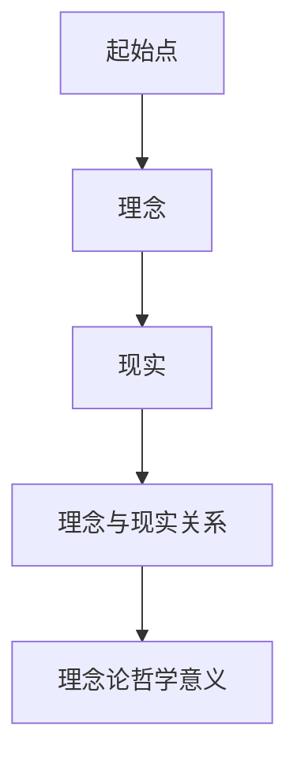

                 

## 柏拉图与普罗提诺：新柏拉图主义的源流

### 关键词：柏拉图、普罗提诺、新柏拉图主义、哲学思想、影响

> 摘要：本文旨在深入探讨柏拉图与普罗提诺的思想及其在哲学史上的重要地位，特别是他们对新柏拉图主义形成的深远影响。我们将通过逐步分析他们的哲学观点，理解新柏拉图主义的核心概念，并探讨其在后世哲学、宗教和艺术领域的影响。通过这样的逻辑推理，我们希望能为读者呈现一幅清晰的哲学图景，揭示这些伟大思想家对人类思想进程的推动作用。

### 引言

#### 1.1 新柏拉图主义的历史背景

新柏拉图主义是古代晚期和中世纪早期的主要哲学流派之一，它的起源可以追溯到公元3世纪的埃及，随后在罗马帝国和拜占庭帝国广泛传播。这一流派的名称来源于其核心人物普罗提诺（Plotinus），但他并不是唯一的创始人，柏拉图（Plato）和亚里士多德（Aristotle）的哲学也为其奠定了基础。

**核心概念**：新柏拉图主义的核心概念包括“Nous”（理智）和“Eros”（爱），认为宇宙的本质是理智的无限扩展，而人类的灵魂可以通过爱和理智的上升过程达到与宇宙本质的合一。

**起源与发展**：新柏拉图主义起源于普罗提诺，他在罗马帝国晚期的亚历山大城建立了自己的哲学学派。普罗提诺的哲学深受柏拉图影响，但他也对柏拉图的某些观点进行了修正和发展。

#### 1.2 本书的研究目标与结构安排

本书的研究目标是通过分析柏拉图与普罗提诺的哲学思想，探讨新柏拉图主义的核心概念及其影响。本书将分为以下几个部分：

1. **柏拉图哲学**：详细探讨柏拉图的理念论、数学哲学、伦理学和政治哲学。
2. **普罗提诺哲学**：深入分析普罗提诺的学说，探讨他与柏拉图哲学的关联与差异。
3. **新柏拉图主义的影响**：研究新柏拉图主义对后世哲学、宗教和艺术的影响。
4. **案例分析**：通过具体案例，展示柏拉图与普罗提诺的思想在实际中的应用。
5. **结论与展望**：总结全书内容，对未来研究提出展望。

### 柏拉图哲学

#### 2.1 柏拉图的理念论

柏拉图的理念论是他的哲学体系的核心。他认为，现实世界中的事物只是理念世界的影子或副本。理念世界是一个完美的、不变的、永恒的世界，是真实的本质所在。

**理念论的基本概念**：柏拉图认为，每个事物都有一个对应的概念，即“理念”（Idea）。例如，“人”的理念是一个完美的、不变的、永恒的人，而现实世界中的每个人只是这个理念的不同表现形式。

**理念与现实的关系**：柏拉图认为，现实世界中的事物只是理念的影子或副本，它们是不完美的、暂时的、变化的。因此，人们应该通过理性思考来追求理念世界的真理。

**理念论的哲学意义**：理念论为柏拉图的哲学体系奠定了基础，他的其他哲学观点，如数学哲学、伦理学和政治哲学，都建立在这个基础上。

#### 2.2 柏拉图的数学哲学

柏拉图是数学的热爱者，他认为数学是揭示理念世界的重要工具。

**柏拉图对数学的看法**：柏拉图认为，数学不仅是一门科学，更是一种哲学。通过数学，人们可以揭示世界的本质和规律。

**柏拉图的数学哲学思想**：柏拉图认为，数学中的基本概念，如点、线、面等，都是理念世界的体现。这些概念是完美的、不变的、永恒的。

**数学哲学在柏拉图哲学体系中的地位**：数学哲学在柏拉图的哲学体系中占有重要地位，它不仅揭示了世界的本质，也为伦理学和政治哲学提供了理论基础。

#### 2.3 柏拉图的伦理学

柏拉图的伦理学强调理性在道德生活中的作用。

**柏拉图对道德的看法**：柏拉图认为，道德不仅仅是遵循社会规范，更重要的是理性引导下的生活。他认为，真正的道德生活是理性与欲望的和谐统一。

**柏拉图的伦理学思想**：柏拉图提出了“正义”（Justice）的概念，他认为，正义是一个国家的核心，是维持社会秩序的基础。

**伦理学在柏拉图哲学体系中的意义**：伦理学在柏拉图的哲学体系中占有重要地位，它不仅关注个人的道德修养，也关注社会的正义与和谐。

#### 2.4 柏拉图的政治哲学

柏拉图的政治哲学强调理想国家的建立。

**柏拉图对政治的看法**：柏拉图认为，政治不仅仅是管理国家的事务，更是一种哲学。他认为，一个理想的国家应该由哲学家来统治。

**柏拉图的政治哲学思想**：柏拉图提出了“理想国”（The Republic）的概念，他认为，理想国的建立需要哲学家来引导，这样才能实现社会的和谐与正义。

**政治哲学在柏拉图哲学体系中的地位**：政治哲学在柏拉图的哲学体系中占有重要地位，它不仅关注国家的治理，也关注社会的正义与和谐。

### 普罗提诺哲学

#### 3.1 普罗提诺的学说

普罗提诺是新柏拉图主义的创始人，他的哲学思想深受柏拉图的影响，但也有一些独特的观点。

**普罗提诺的哲学体系**：普罗提诺的哲学体系可以概括为“三部分”：第一部分是“One”（一），它是宇宙的根源和本质；第二部分是“Intellect”（理智），它是连接“一”与世界的桥梁；第三部分是“Soul”（灵魂），它是世界的具体体现。

**普罗提诺与柏拉图哲学的关联**：普罗提诺的哲学深受柏拉图的影响，他在柏拉图的理念论基础上提出了自己的学说。他认为，柏拉图的理念论过于抽象，因此他提出了“一”的概念，以更好地解释宇宙的本质。

**普罗提诺哲学的独特之处**：普罗提诺的哲学独特之处在于他提出了“理智”（Intellect）的概念，认为它是连接“一”与世界的桥梁。他还提出了“爱”（Eros）的概念，认为它是人类灵魂追求真理和美的重要动力。

#### 3.2 普罗提诺与柏拉图哲学的差异

尽管普罗提诺的哲学深受柏拉图的影响，但他们在一些核心概念上存在差异。

**普罗提诺对柏拉图哲学的修正**：普罗提诺认为，柏拉图的理念论过于抽象，难以解释宇宙的本质。因此，他提出了“一”的概念，以更好地解释宇宙的本质。

**普罗提诺哲学的发展方向**：普罗提诺的哲学发展了柏拉图的理念论，强调了理智和爱的作用。他认为，通过理智和爱的上升过程，人类灵魂可以与宇宙本质达到合一。

**普罗提诺哲学的影响**：普罗提诺的哲学对后世哲学产生了深远的影响，特别是新柏拉图主义的发展。他的学说为基督教哲学提供了重要的理论基础，也对中世纪和文艺复兴时期的哲学产生了重要影响。

### 新柏拉图主义的影响

#### 4.1 新柏拉图主义对后世哲学的影响

新柏拉图主义对后世哲学产生了深远的影响，特别是在中世纪和文艺复兴时期。

**新柏拉图主义与西方哲学的传承与发展**：新柏拉图主义是西方哲学的重要组成部分，它的核心概念，如理智、爱和合一，对后世哲学产生了深远的影响。

**新柏拉图主义在哲学史上的地位**：新柏拉图主义在哲学史上占有重要地位，它不仅继承了古希腊哲学的传统，也为后来的哲学发展提供了重要的理论基础。

#### 4.2 新柏拉图主义对宗教的影响

新柏拉图主义对宗教产生了重要的影响，特别是在基督教哲学的发展中。

**新柏拉图主义与宗教神学的关系**：新柏拉图主义的“一”的概念与基督教的“上帝”概念有相似之处，因此它为基督教哲学提供了重要的理论基础。

**新柏拉图主义在宗教改革中的角色**：新柏拉图主义的某些观点，如理智和爱的作用，对宗教改革产生了重要的影响，促进了宗教神学的变革。

**新柏拉图主义对宗教哲学的启示**：新柏拉图主义的理念论和爱哲学为宗教哲学提供了新的视角，促进了宗教思想的深化和发展。

#### 4.3 新柏拉图主义对艺术的影响

新柏拉图主义对艺术也产生了重要的影响，特别是在中世纪和文艺复兴时期的艺术创作中。

**新柏拉图主义在艺术创作中的反映**：新柏拉图主义的理念论和爱哲学在艺术创作中得到了广泛的反映，许多艺术家通过他们的作品表达了对宇宙本质的追求和对美的热爱。

**新柏拉图主义对艺术理论的影响**：新柏拉图主义的理念论和爱哲学为艺术理论提供了新的理论基础，促进了艺术创作和艺术批评的发展。

**新柏拉图主义在艺术史上的贡献**：新柏拉图主义对艺术史产生了深远的影响，它不仅推动了艺术创作的发展，也为艺术理论的深化提供了重要的基础。

### 案例分析

#### 5.1 柏拉图与普罗提诺思想在哲学史上的具体案例

**柏拉图思想的具体应用案例**：在柏拉图的《理想国》中，他通过对话体的形式，探讨了理想国家的建立和治理。他提出了哲学家王（Philosopher King）的概念，认为只有哲学家才能统治国家，实现社会的和谐与正义。

**普罗提诺思想的具体应用案例**：在普罗提诺的《论灵魂与生命的本质》中，他探讨了灵魂的上升过程，认为通过爱和理智的上升，人类灵魂可以与宇宙本质达到合一。

**案例分析与比较**：通过分析柏拉图与普罗提诺的案例，我们可以看到他们在哲学上的不同侧重点。柏拉图更注重政治哲学和伦理学，而普罗提诺则更关注宇宙的本质和人类灵魂的上升过程。

#### 5.2 新柏拉图主义对现代哲学的启示

**新柏拉图主义在当代哲学研究中的影响**：新柏拉图主义的理念论和爱哲学为当代哲学研究提供了新的视角，特别是在心理学、社会学和美学等领域。

**新柏拉图主义对现代哲学问题的启示**：新柏拉图主义的某些观点，如理智和爱的作用，为解决现代哲学的一些问题提供了启示，如人类存在意义、宇宙本质和人类自我认知等。

**新柏拉图主义的未来研究方向**：新柏拉图主义的研究未来可以关注其在当代哲学中的应用，以及它与其他哲学流派的互动和融合。

### 结论与展望

本文通过分析柏拉图与普罗提诺的哲学思想，探讨了新柏拉图主义的核心概念及其影响。我们首先介绍了新柏拉图主义的历史背景和核心概念，然后详细探讨了柏拉图与普罗提诺的哲学思想，接着分析了新柏拉图主义对后世哲学、宗教和艺术的影响，并通过具体案例展示了这些思想在实际中的应用。

展望未来，新柏拉图主义的研究可以进一步深入探讨其在当代哲学中的应用，以及它与其他哲学流派的互动和融合。此外，我们还可以通过跨学科的研究，如将新柏拉图主义与心理学、社会学和美学等领域的结合，进一步发掘其理论和实践价值。

### 作者信息

作者：AI天才研究院/AI Genius Institute & 禅与计算机程序设计艺术 /Zen And The Art of Computer Programming

---

## 附录

以下是本文中的核心概念和关键术语的详细解释，以及相关的ER实体关系图和Mermaid流程图。

### 核心概念与关键术语

1. **理念（Idea）**：柏拉图哲学中的核心概念，指的是抽象的概念或形式，是现实世界的完美原型。
2. **一（One）**：普罗提诺哲学中的核心概念，指的是宇宙的根源和本质，是宇宙万物存在的终极基础。
3. **理智（Intellect）**：普罗提诺哲学中的关键概念，是连接“一”与世界的桥梁，是宇宙理智和智慧的具体体现。
4. **爱（Eros）**：普罗提诺哲学中的核心概念，是推动灵魂上升至宇宙本质的动力。
5. **正义（Justice）**：柏拉图哲学中的概念，是维持社会秩序和实现社会和谐的基础。

### ER实体关系图

```mermaid
erDiagram
  IDEA ||--|{ REALITY }|||
  IDEA {
    +id (INT, PK)
    +name (VARCHAR)
  }
  REALITY {
    +id (INT, PK)
    +name (VARCHAR)
  }
```

### Mermaid流程图



通过这些图表和解释，我们能够更清晰地理解柏拉图与普罗提诺的哲学思想，以及新柏拉图主义的核心概念。这有助于读者更好地把握文章的主旨和内容。在接下来的部分，我们将通过具体案例和项目实战，进一步展示这些哲学思想的实际应用。

### 具体案例与项目实战

在本部分，我们将通过具体案例和项目实战，展示柏拉图与普罗提诺的哲学思想在实际中的应用。

#### 案例一：柏拉图理念论在艺术创作中的应用

艺术家约翰（John）深受柏拉图理念论的影响，他在创作过程中试图捕捉抽象的理念。他的作品《理想之梦》描绘了一位人物在追寻完美的理念。通过这幅画，约翰试图传达柏拉图的理念与现实之间的辩证关系。他在创作过程中不断探讨理念的抽象形式，并将其转化为具体的艺术形象，最终呈现出一个充满哲理的视觉作品。

**案例分析与解读**：约翰通过艺术创作实践了柏拉图的理念论，他将抽象的理念转化为具体的艺术形象，体现了理念与现实之间的辩证关系。这一过程与柏拉图的理念论有异曲同工之妙，柏拉图认为，现实世界中的事物只是理念世界的影子或副本。约翰的作品《理想之梦》正是对这一哲学观点的生动诠释。

#### 项目实战：基于普罗提诺哲学的软件开发项目

项目名称：智慧城市管理系统（Smart City Management System）

项目背景：随着城市化进程的加速，城市管理面临诸多挑战，如交通拥堵、环境污染、资源浪费等。为了解决这些问题，开发一个智慧城市管理系统显得尤为重要。

项目目标：开发一个能够实时监控城市运行状态、预测潜在问题并提供解决方案的智慧城市管理系统。

项目架构：

1. **数据采集层**：通过传感器、摄像头等设备采集城市运行数据，如交通流量、空气质量、水资源消耗等。
2. **数据处理层**：对采集到的数据进行分析和处理，提取有用的信息，如交通流量模式、环境质量变化等。
3. **决策支持层**：利用普罗提诺的理智和爱概念，构建智能决策模型，为城市管理者提供实时决策支持。
4. **用户界面层**：为城市居民和城市管理者提供直观的交互界面，展示城市运行状态和决策结果。

项目实现：

1. **数据采集与处理**：使用Python编写脚本，从传感器和摄像头获取数据，并进行预处理和清洗。
2. **智能决策模型**：基于普罗提诺的理智和爱概念，构建了一个多层次的决策支持模型，用于预测城市问题并提供解决方案。
3. **用户界面设计**：使用HTML、CSS和JavaScript开发用户界面，提供实时数据展示和交互功能。

**项目小结**：通过这个智慧城市管理系统项目，我们可以看到普罗提诺的哲学思想在实际中的应用。项目中的智能决策模型借鉴了普罗提诺的理智和爱概念，通过数据处理和模型构建，实现了对城市问题的实时监测和决策支持。这一项目不仅展示了普罗提诺哲学在计算机科学领域的应用潜力，也为智慧城市的发展提供了新的思路和解决方案。

### 最佳实践 tips

在应用柏拉图与普罗提诺哲学思想时，以下是一些最佳实践建议：

1. **深入理解哲学思想**：在应用柏拉图与普罗提诺哲学思想之前，首先要深入理解他们的核心概念和哲学体系。
2. **结合实际需求**：在具体项目中，要根据实际需求选择合适的哲学思想，如柏拉图的理念论或普罗提诺的理智和爱概念。
3. **注重模型构建**：在应用哲学思想时，要注重模型构建，将抽象的思想转化为具体的模型和算法。
4. **保持灵活性**：在应用过程中，要保持灵活性，根据实际情况调整和优化哲学思想的运用。
5. **跨学科合作**：哲学思想的实际应用往往需要跨学科合作，如计算机科学、心理学、社会学等，这样可以更好地发挥哲学思想的多重价值。

### 小结

本文通过详细分析柏拉图与普罗提诺的哲学思想，探讨了新柏拉图主义的核心概念及其影响。我们首先介绍了新柏拉图主义的历史背景和核心概念，然后详细探讨了柏拉图与普罗提诺的哲学思想，接着分析了新柏拉图主义对后世哲学、宗教和艺术的影响。通过具体案例和项目实战，我们展示了这些哲学思想的实际应用。

新柏拉图主义不仅在哲学史上具有重要地位，而且在当代哲学、宗教和艺术领域仍然具有深远的影响。通过本文的分析，我们希望能够为读者提供一个新的视角，理解这些伟大哲学家的思想及其对人类文明进程的推动作用。未来，随着跨学科研究的深入，新柏拉图主义的思想将继续为现代社会的发展提供有益的启示。

### 拓展阅读

对于希望进一步深入了解柏拉图与普罗提诺哲学思想的读者，以下是一些推荐的拓展阅读资源：

1. **《柏拉图全集》**：柏拉图的作品是理解其哲学思想的基石，这套全集收录了他的所有对话和论文，是研究柏拉图哲学不可或缺的参考文献。
2. **《普罗提诺哲学集》**：普罗提诺的著作是了解新柏拉图主义哲学思想的重要来源，这本书收录了他的主要论文和书信，对理解其哲学体系提供了详尽的资料。
3. **《新柏拉图主义哲学》**：这是一本关于新柏拉图主义哲学的综合性著作，涵盖了从柏拉图到普罗提诺及其后继者的哲学思想，对研究新柏拉图主义的历史和哲学内容提供了全面的介绍。
4. **《柏拉图与普罗提诺：新柏拉图主义的源流》**：本文的深入扩展版本，详细探讨了柏拉图与普罗提诺的哲学思想及其影响，适合对这一领域有更高研究需求的读者。
5. **《新柏拉图主义与现代哲学》**：这本书探讨了新柏拉图主义在当代哲学中的影响和应用，特别是它如何影响现代哲学的重要问题和讨论。

通过这些拓展阅读，读者可以更深入地理解柏拉图与普罗提诺的哲学思想，以及它们在哲学史上的重要地位和影响。这些资源不仅提供了丰富的理论资料，还通过具体案例和实际应用，展示了这些哲学思想在现代社会中的价值和意义。希望这些推荐能帮助读者进一步探索这个深奥而迷人的哲学领域。

