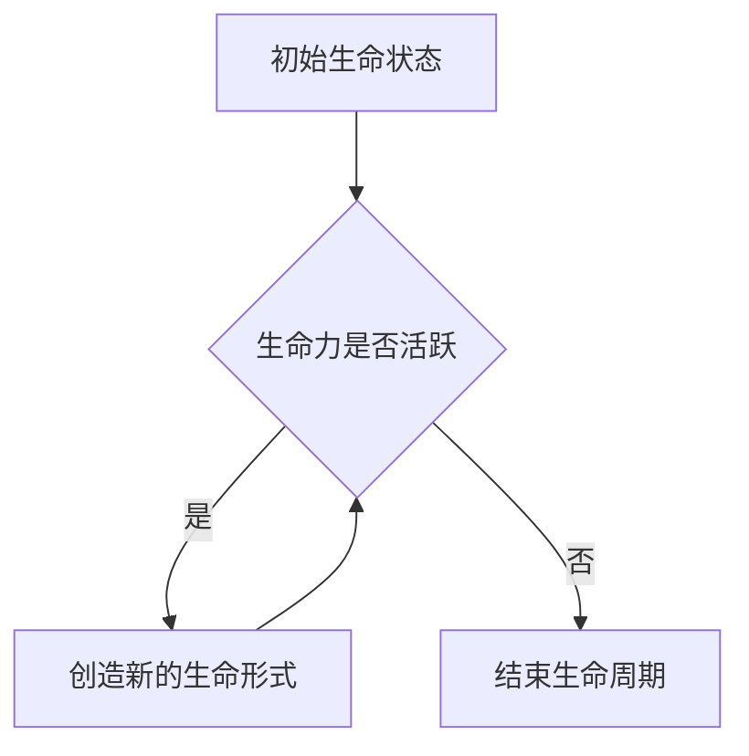
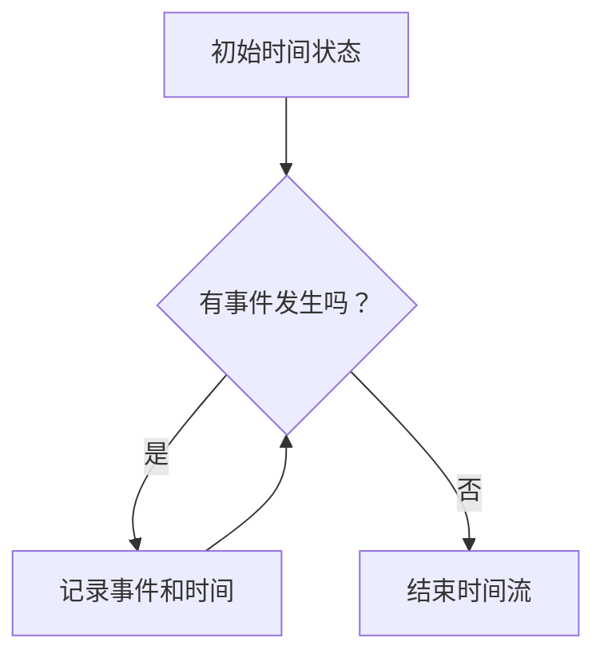
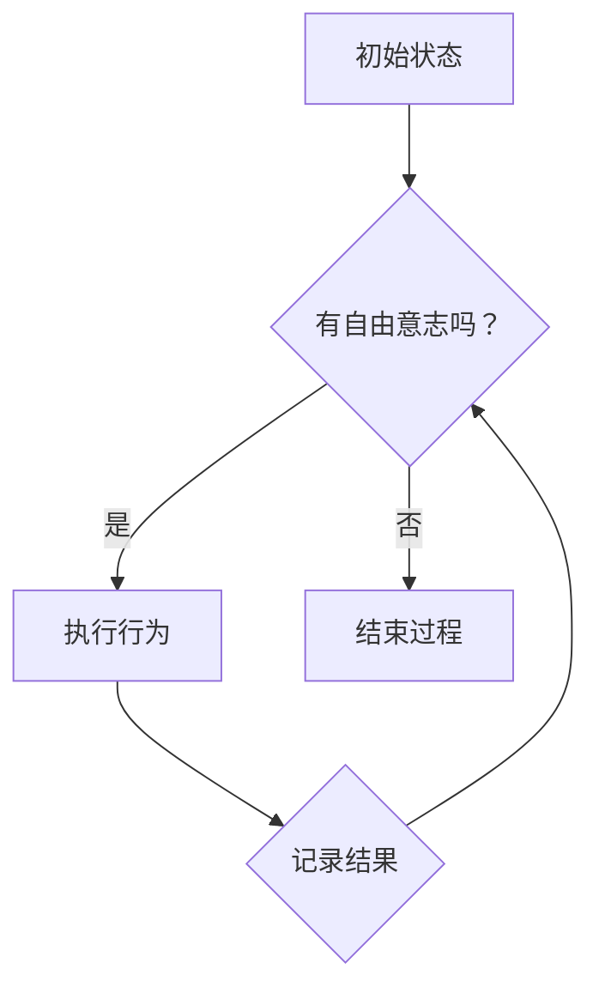
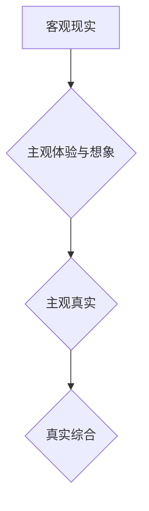
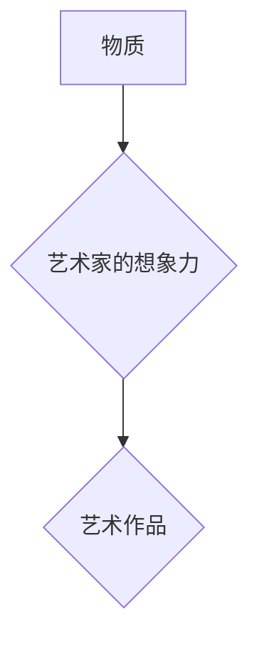
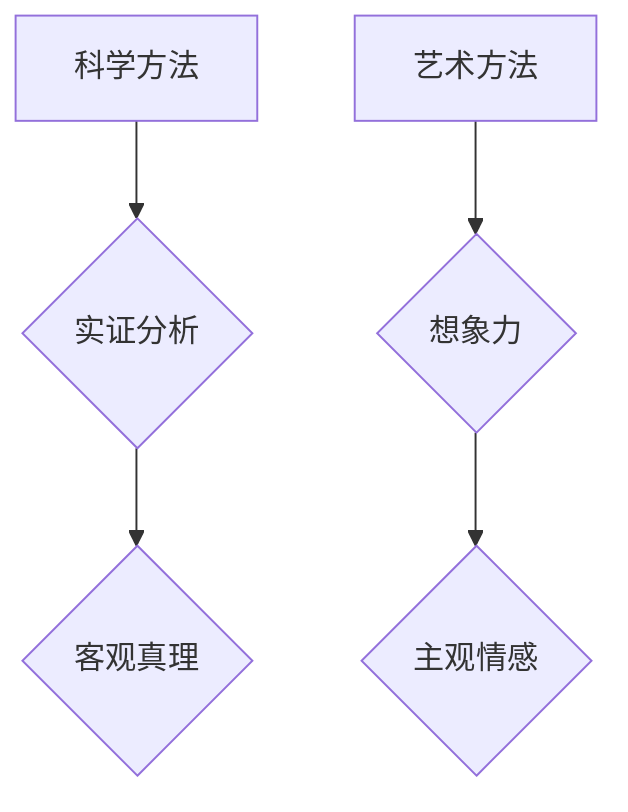

                 

## 第1章 引言

### 1.1 问题的提出

在当代科学哲学和诗学领域，柏格森和巴什拉是两位重要的哲学家，他们的思想不仅深刻地影响了各自的领域，而且在某些方面产生了碰撞和对话。科学哲学探讨科学的基础、科学方法、以及科学知识的本质，而诗学想象则侧重于艺术创作中的想象力和创造性思维。这两位哲学家的思想分别代表了科学和艺术的不同方面，因此，探讨他们之间的对话具有重要的理论和现实意义。

在科学哲学中，柏格森以其对生命、时间和自由意志的独特理解而著称。他强调生命的内在动力和创造的进化过程，提出了时间绵延的概念，这对理解科学过程中的动态变化具有启发意义。而巴什拉则以其对真实、物质和科学本质的深入探讨而闻名，他关注科学知识的构建过程，以及科学家如何在真实与虚假之间进行选择。

诗学想象方面，柏格森的哲学思想同样具有独特的价值。他对生命力和创造力的强调，可以被理解为对艺术创作中的灵感和创造力的肯定。而巴什拉对物质与想象的探讨，则提供了对艺术创作过程中材料选择和表现方式的深刻理解。

因此，本文旨在通过探讨柏格森和巴什拉的思想，揭示他们在科学哲学与诗学想象方面的对话，并分析这种对话对当代哲学的启示和影响。

### 1.2 柏格森与巴什拉：两位哲学家的背景与思想

亨利·柏格森（Henri Bergson）是法国著名的哲学家，生于1859年，卒于1941年。他毕业于巴黎高等师范学院，并在巴黎大学担任教授。柏格森的主要哲学贡献在于他对生命、时间和自由意志的深刻理解。他的代表作《创造进化论》中提出了生命力和创造进化的概念，强调生命的内在动力和动态变化。柏格森认为，时间不是均匀流逝的，而是有质的差异，他称之为“绵延”。这种对时间的理解挑战了牛顿物理学中的绝对时间观，对科学哲学产生了深远的影响。

柏格森的思想对20世纪哲学产生了重要影响，尤其是在存在主义和批判理论中。他的观点强调个体经验和直觉的重要性，这与后来的存在主义哲学有着一定的共鸣。此外，柏格森的自由意志观念也对后来的哲学讨论产生了影响，他主张自由意志不是不受制约的，而是内在生命力的一部分。

而乔治·巴什拉（Georges Bataille）是另一位重要的法国哲学家，生于1897年，卒于1962年。巴什拉的哲学思想涵盖了广泛的主题，包括物质、想象、科学和艺术。他的著作《真实的分裂》和《物质与极限》等，探讨了物质世界的本质和人类对物质的理解。巴什拉认为，真实是多元的、复杂的，而不是单一和静态的。他关注物质与想象之间的关系，强调艺术家在创作过程中的想象力。

巴什拉的思想对20世纪的文学和艺术产生了深远的影响。他强调物质和能量的重要性，这种观点在后来的生态哲学和物质文化理论中得到了进一步的发展。巴什拉还对科学本质进行了深入探讨，他认为科学不仅是探索物质世界的工具，也是一种意识形态。

尽管柏格森和巴什拉在哲学领域有着不同的关注点，但他们都关注人类经验的不同方面，从而在某种程度上形成了互补的关系。柏格森对生命力和时间的理解，可以为巴什拉对物质和想象的探讨提供理论支持；而巴什拉对真实和物质的探讨，则可以为柏格森的生命哲学提供具体的例证。这种互补性使得他们的思想在科学哲学和诗学想象方面形成了独特的对话。

### 1.3 科学哲学与诗学想象的对话：意义与目的

科学哲学与诗学想象的对话具有重要的理论和现实意义。首先，从理论角度来看，这种对话有助于深化对科学和艺术的本质理解。科学哲学关注科学方法、知识建构和科学本质，而诗学想象则探讨艺术创作中的创造力、想象力和表现力。通过对话，我们可以更全面地理解科学和艺术之间的关系，从而丰富我们对人类智慧和创造力的认识。

其次，从现实角度来看，这种对话具有实践指导意义。在当代社会，科学和艺术在许多领域相互交织，如科技艺术、科学传播和科学教育等。通过科学哲学与诗学想象的对话，我们可以更好地指导这些领域的实践，例如，如何通过艺术手段提高科学传播效果，如何利用科学方法启发艺术创作等。

本文的目的在于通过探讨柏格森和巴什拉的思想，揭示他们在科学哲学与诗学想象方面的对话，并分析这种对话对当代哲学的启示和影响。具体而言，本文将首先详细介绍柏格森和巴什拉的哲学思想，然后探讨他们在时间、自由意志、科学本质和诗学想象等方面的观点，并分析这些观点之间的对话和互补性。最后，本文将总结柏格森与巴什拉对话的意义，并讨论其对当代哲学的启示和影响。通过这一系列探讨，我们希望能够为科学哲学和诗学想象领域提供新的视角和思考。

## 第2章 柏格森的哲学思想

### 2.1 柏格森的生活与哲学生涯

亨利·柏格森（Henri Bergson）是法国20世纪初最具影响力的哲学家之一，他的思想和作品对后来的哲学家、科学家和文化评论家产生了深远的影响。柏格森于1859年10月18日出生于巴黎，他的家庭环境优渥，父亲是一名医生，母亲则是一位受过良好教育的女士。柏格森从小就展现出了对知识的强烈渴望，并在学术上取得了卓越的成绩。

柏格森在巴黎高等师范学院接受教育，这是法国最顶尖的学术机构之一。在这里，他接受了严格的科学和哲学训练，广泛涉猎了数学、物理学和哲学等学科。1879年，他毕业于巴黎高等师范学院，随后进入巴黎大学学习法律，但很快他对法律失去了兴趣，转而投身于哲学研究。

在巴黎大学期间，柏格森积极参与哲学讨论，并与一些重要的哲学家建立了联系。他的哲学思想开始逐渐成形，特别是受到了法国哲学家孔德（Auguste Comte）和达尔文（Charles Darwin）的影响。柏格森认为，科学应该关注生命的动态变化和进化，而不是静态的结构和机制。

1889年，柏格森的博士论文《意识的直接材料》获得了高度评价，这标志着他正式进入哲学界。随后，他发表了多篇重要的论文和著作，其中最著名的是《创造进化论》（1907年）和《时间与自由意志》（1889年）。这些作品为他赢得了国际声誉，使他成为20世纪最杰出的哲学家之一。

在职业生涯中，柏格森在巴黎大学担任了多个教职，包括教授和讲座教授。他的讲座吸引了大量学生和听众，他的哲学思想也因此得到了广泛的传播。1914年，柏格森被选为法国科学院院士，这是对他学术成就的最高认可之一。1937年，他因《创造性进化》一书获得了诺贝尔文学奖，这是对他在哲学和文化领域贡献的肯定。

柏格森的哲学生涯不仅限于学术研究，他还积极参与公共事务和哲学讨论。他反对纳粹德国的意识形态，并支持法国的民主和自由。他的思想对存在主义、批判理论和文化研究等领域产生了深远的影响，被视为20世纪最重要的哲学家之一。

### 2.2 柏格森的核心概念与哲学体系

亨利·柏格森的哲学思想围绕几个核心概念展开，这些概念不仅构成了他的哲学体系的基础，也深刻影响了后来的哲学讨论。以下是柏格森的核心概念与哲学体系：

#### 2.2.1 生命与创造进化

柏格森认为，生命是宇宙中最为独特和重要的现象。他强调生命的动态性和进化过程，反对传统的机械唯物主义和决定论观点。在柏格森看来，生命不是静止的，而是一种不断变化和发展的过程。他提出了“生命冲动”（élan vital）的概念，这被理解为一种内在的、推动生命不断进化和创造的原始动力。

生命的创造进化是柏格森哲学的核心观点之一。他认为，生命通过不断的变化和创造，形成了新的形式和结构。这种创造进化不仅体现在生物界，也体现在人类文明和社会发展中。柏格森的生命与创造进化理论为理解生命的多样性和复杂性提供了新的视角。

#### 2.2.2 时间与绵延

柏格森对时间的理解是其哲学体系的重要组成部分。他批评了牛顿物理学中的绝对时间观，提出了“绵延”（durée）的概念。绵延指的是时间不是均匀流逝的，而是一种有质的差异和时间感的流动。柏格森认为，时间是生命的内在特性，是我们感知和体验世界的手段。

绵延的概念强调了时间的流动性和个体时间的独特性。它与物理学的绝对时间和钟表时间形成鲜明对比。柏格森认为，科学方法无法完全捕捉到时间的本质，因为科学方法依赖于静态和机械的模型，而时间是一种动态和连续的过程。

#### 2.2.3 自由意志与决定论

柏格森的自由意志观念是他对决定论挑战的核心。他认为，自由意志不仅是可能的，而且是生命力和创造进化的必要条件。柏格森反对决定论的观点，即一切现象都可以通过先前条件和因果关系来解释。他主张，自由意志是生命力的表现，是一种内在的、不受外部条件限制的创造力。

柏格森的自由意志观念在哲学史上具有重要的地位，因为它为个体的独特性和创造性提供了理论依据。他的观点与存在主义哲学中的自由意志观念有一定的共鸣，但同时也受到了其他哲学家的质疑和批评。

### 2.2.1 生命与创造进化

**核心概念与原理：**

生命与创造进化是柏格森哲学的核心概念，他强调生命力的不断创造性和进化过程。柏格森认为，生命不仅是生物体的存在，而是一种内在的动力，推动生物体和整个宇宙不断发展和变化。

**概念属性特征对比表格：**

| 特征             | 传统机械唯物主义 | 柏格森的生命观 |
|------------------|-------------------|----------------|
| 观点             | 静态和机械的模型   | 动态和创造性的过程 |
| 目的             | 适应环境         | 创造和进化       |
| 形式             | 结构和功能分离   | 结构与功能的内在统一 |

**ER实体关系图架构：**

```mermaid
erDiagram
  产品 ||--o{ 生命周期 }|-- 产品
  生命周期 ||--o{ 变异 }|-- 生命周期
```

在这个ER图中，"产品"代表了生命形式，"生命周期"代表了生命的进化过程，而"变异"代表了生命在进化过程中的变化和创造。

**算法原理讲解：**

柏格森的生命与创造进化原理可以类比为一种生物进化的算法。这种算法不是基于遗传学中的基因变异和自然选择，而是基于生命力的内在创造力和进化动力。以下是一个简化的算法流程图：



在这个算法中，初始生命状态会评估生命力的活跃程度。如果生命力活跃，生命会创造出新的形式；如果生命力不活跃，生命周期会结束。这个过程不断循环，形成了生命的创造进化。

**数学模型和公式：**

柏格森的生命与创造进化可以用以下数学模型来描述：

$$
\Delta F(t) = k \cdot F(t)
$$

其中，$\Delta F(t)$ 表示在时间 $t$ 时的生命形式变化，$F(t)$ 表示在时间 $t$ 时的生命力强度，$k$ 是一个常数，表示生命力的成长速率。

**详细讲解与举例说明：**

假设我们有一个初始生命状态 $F(0) = 1$，生命力强度 $k = 1.05$。在时间 $t = 1$ 时，生命形式变化为：

$$
\Delta F(1) = 1.05 \cdot 1 = 1.05
$$

这意味着生命力在时间 $t = 1$ 时增加了5%。如果这个生命力继续存在并创造新的形式，那么在时间 $t = 2$ 时，生命力将变为：

$$
F(2) = 1.05 \cdot 1.05 = 1.1025
$$

这个过程不断进行，生命力将随着时间的推移而不断增长，形成生命的创造进化。

### 2.2.2 时间与绵延

**核心概念与原理：**

时间与绵延是柏格森哲学中的另一个核心概念。他反对传统的绝对时间观，提出了绵延的概念，认为时间是生命的内在特性，是一种有质的差异和时间感的流动。

**概念属性特征对比表格：**

| 特征             | 绝对时间观 | 柏格森的绵延观 |
|------------------|-------------|----------------|
| 时间性质         | 均匀流逝的   | 有质的差异和时间感的 |
| 感知方式         | 钟表时间     | 直觉和时间感 |
| 科学方法         | 机械的模型   | 动态和连续的过程 |

**ER实体关系图架构：**

```mermaid
erDiagram
  时间流 ||--o{ 时间段 }|-- 时间流
  时间段 ||--o{ 事件 }|-- 时间段
```

在这个ER图中，"时间流"代表了时间的整体流动，"时间段"代表了具体的时间段，而"事件"代表了时间中的具体事件。

**算法原理讲解：**

柏格森的时间与绵延原理可以类比为一种事件驱动的算法。在这种算法中，时间不是均匀流逝的，而是由一系列事件驱动的。以下是一个简化的算法流程图：



在这个算法中，初始时间状态会评估是否有事件发生。如果有事件，算法会记录事件和时间，并继续执行；如果没有事件，时间流会结束。这个过程形成了时间与绵延的动态特性。

**数学模型和公式：**

柏格森的时间与绵延可以用以下数学模型来描述：

$$
\Delta t = \frac{dF(t)}{dt}
$$

其中，$\Delta t$ 表示在时间 $t$ 的时间间隔，$F(t)$ 表示在时间 $t$ 时的生命力强度，$dt$ 是时间的微分。

**详细讲解与举例说明：**

假设我们有一个初始生命力强度 $F(0) = 1$，生命力强度随时间变化。在时间 $t = 1$ 时，生命力强度变为：

$$
F(1) = 1 + \frac{1}{2} = 1.5
$$

这意味着在时间 $t = 1$ 时，生命力强度增加了50%。在时间 $t = 2$ 时，生命力强度将继续增加：

$$
F(2) = 1.5 + \frac{1}{2} \cdot 1.5 = 1.875
$$

这个过程不断进行，生命力强度将随着时间的推移而不断增加，形成了时间的动态变化。

### 2.2.3 自由意志与决定论

**核心概念与原理：**

自由意志与决定论是柏格森哲学中的另一个重要概念。他反对决定论的观点，认为自由意志是生命力的内在表现，是一种不受外部条件限制的创造力。

**概念属性特征对比表格：**

| 特征             | 决定论         | 柏格森的自由意志观 |
|------------------|----------------|--------------------|
| 观点             | 一切现象可预测 | 自由意志是不可预测的 |
| 基础             | 因果关系       | 生命力与创造力       |
| 方法             | 规则和规律      | 直觉和时间感       |

**ER实体关系图架构：**

```mermaid
erDiagram
  自由意志 ||--o{ 行为 }|-- 自由意志
  行为     ||--o{ 结果 }|-- 自由意志
```

在这个ER图中，"自由意志"代表了个体自主决定的能力，"行为"代表了自由意志的具体表现，而"结果"代表了行为产生的结果。

**算法原理讲解：**

柏格森的自由意志与决定论原理可以类比为一种随机事件驱动的算法。在这种算法中，自由意志不被外部条件所决定，而是基于内在的创造力和直觉。以下是一个简化的算法流程图：



在这个算法中，初始状态会评估是否有自由意志。如果有自由意志，个体会执行行为，并记录结果；如果没有自由意志，过程会结束。这个过程形成了自由意志的不可预测性。

**数学模型和公式：**

柏格森的自由意志与决定论可以用以下数学模型来描述：

$$
F_w(t) = f(W, t)
$$

其中，$F_w(t)$ 表示在时间 $t$ 时的自由意志强度，$W$ 是初始状态，$f(W, t)$ 是基于自由意志强度和时间的变化函数。

**详细讲解与举例说明：**

假设我们有一个初始自由意志强度 $F_w(0) = 1$，自由意志强度随时间变化。在时间 $t = 1$ 时，自由意志强度变为：

$$
F_w(1) = f(1, 1) = 1.1
$$

这意味着在时间 $t = 1$ 时，自由意志强度增加了10%。在时间 $t = 2$ 时，自由意志强度将继续增加：

$$
F_w(2) = f(1.1, 2) = 1.21
$$

这个过程不断进行，自由意志强度将随着时间的推移而不断变化，形成了自由意志的不可预测性。

### 第3章 巴什拉的哲学思想

### 3.1 巴什拉的生活与哲学生涯

乔治·巴什拉（Georges Bataille）是20世纪初法国哲学界的重要人物，他的思想在文学、艺术和哲学领域都产生了深远的影响。巴什拉于1897年1月24日出生于法国南部小镇博蒙-德-卢瓦尔，他的家庭背景较为优越，父亲是一位医生。巴什拉在学术上表现出色，先后就读于巴黎高等师范学院和索邦大学，并在那里接受了严格的哲学和文学训练。

巴什拉的哲学生涯始于他在巴黎高等师范学院的学习期间，他广泛阅读了各种哲学、文学和艺术作品，对尼采、斯宾诺莎、弗洛伊德等人的思想产生了浓厚的兴趣。1920年代，巴什拉开始发表了一系列重要的论文和著作，这些作品标志着他哲学思想的成熟。他的代表作品包括《真实的分裂》、《物质与极限》和《美学的批判》等。

巴什拉在职业生涯中担任了多个学术职务，包括巴黎索邦大学的教授和法国国家科学研究中心的研究员。他的讲座和著作吸引了大量学生和读者，他的思想在法国哲学界产生了广泛的影响。巴什拉的思想不仅局限于哲学领域，他还积极参与文学和艺术创作，与许多重要的作家和艺术家有过交流与合作。

巴什拉于1962年9月6日去世，他的哲学遗产对后来的哲学家、文学批评家和艺术理论家产生了深远的影响。他的思想涉及广泛，从物质和能量的本质到人类文化的演变，从真实与虚假的辩证关系到艺术创作的动力，巴什拉为我们提供了独特的哲学视角和深刻的洞见。

### 3.2 巴什拉的核心概念与哲学体系

乔治·巴什拉的哲学思想涵盖了广泛的主题，包括真实与虚假、物质与想象、科学和艺术等。以下是他的一些核心概念与哲学体系：

#### 3.2.1 真实与虚假

巴什拉对真实与虚假的探讨是他哲学思想的核心之一。他认为，真实是一个复杂而多元的概念，它不仅包括物理世界的客观存在，还包括人类主观体验和想象中的真实。巴什拉区分了两种真实：物理真实和人类真实。物理真实是可以通过科学方法和经验验证的，而人类真实则是通过想象和情感体验来理解的。

巴什拉认为，虚假并不是完全的虚构或欺骗，而是一种对真实的扭曲或重构。他强调了人类对真实的主观处理方式，这种处理方式使得真实在人类意识中呈现出多样的形态。巴什拉的观点挑战了传统的现实主义和客观主义，他认为真实与虚假之间并不是截然分开的，而是相互渗透和转换的。

#### 3.2.2 物质与想象

巴什拉对物质与想象的探讨是他对真实与虚假理解的重要补充。他认为，物质不仅是物理世界的构成要素，也是人类想象和艺术创作的源泉。巴什拉强调物质的力量和能量，他认为物质具有一种内在的活力和动态性，这种活力和动态性可以通过艺术家的想象力得到表达和释放。

巴什拉认为，艺术家在创作过程中不仅仅是复制现实，而是通过想象力和创造力将物质转化为一种新的存在形式。他强调了艺术创作中的物质性和情感性，认为艺术家通过对物质的感知和想象，可以创造出一种超越现实的新真实。

#### 3.2.3 科学与艺术

巴什拉对科学与艺术的探讨是他哲学思想的重要组成部分。他认为，科学和艺术虽然有不同的方法和目的，但都关注人类对世界的理解和表达。巴什拉批评了科学的功利主义和理性主义，认为科学过于强调客观性和可验证性，忽视了人类的主观体验和情感需求。

巴什拉主张，科学和艺术应该相互补充，科学可以为艺术提供物质基础和理论支持，而艺术则可以为科学提供人文视角和审美体验。他认为，科学和艺术都追求真实的理解，但方式不同：科学通过理性分析和实证验证，艺术则通过想象力和创造力。

### 3.2.1 真实与虚假

**核心概念与原理：**

真实与虚假是巴什拉哲学体系中的核心概念，他通过批判传统现实主义和客观主义，提出了独特的真实观。巴什拉认为，真实不仅仅是物理世界的客观存在，还包括人类主观体验和想象中的真实。

**概念属性特征对比表格：**

| 特征             | 传统现实主义 | 巴什拉的真实观 |
|------------------|----------------|----------------|
| 真实的本质       | 客观存在       | 主观体验与想象 |
| 真实的形态       | 单一、静态     | 多元、动态     |
| 科学方法         | 可验证性       | 直觉与情感     |

**ER实体关系图架构：**

```mermaid
erDiagram
  真实 ||--o{ 客观现实 }|-- 真实
  真实 ||--o{ 主观真实 }|-- 真实
```

在这个ER图中，“真实”代表了真实的多重形态，包括物理世界的客观现实和人类的主观真实。

**算法原理讲解：**

巴什拉的真实与虚假原理可以类比为一种双通道的算法模型。在这种模型中，真实通过两个通道同时传递：一个是客观现实通道，另一个是主观体验和想象通道。以下是一个简化的算法流程图：



在这个算法中，客观现实通过主观体验和想象进行加工，形成主观真实，最终综合为完整的真实。

**数学模型和公式：**

巴什拉的真实与虚假可以用以下数学模型来描述：

$$
\text{真实} = \text{客观现实} + \text{主观体验与想象}
$$

其中，客观现实表示物理世界的存在，主观体验与想象表示人类的主观感受和想象。

**详细讲解与举例说明：**

假设我们有一个客观现实场景，例如一个公园。在传统的现实主义视角中，公园是一个具体的物理空间，其真实仅由其客观存在所定义。但在巴什拉的观点中，公园的真实还包括人们在此空间中的体验和想象。

例如，一位游客在公园中看到了美丽的花朵，他可能会想象自己置身于一个童话世界。这个想象的过程不仅丰富了公园的真实，也改变了人们对公园的感知。因此，公园的真实不仅包括其物理存在，还包括游客的主观体验和想象。

### 3.2.2 物质与想象

**核心概念与原理：**

物质与想象是巴什拉哲学体系中的另一个核心概念，他强调物质不仅是物理世界的构成要素，也是人类艺术创作和想象力的源泉。巴什拉认为，物质具有一种内在的活力和动态性，这种活力可以通过艺术家的想象力得到表达和释放。

**概念属性特征对比表格：**

| 特征             | 物质主义         | 巴什拉的物质与想象观 |
|------------------|-------------------|-----------------------|
| 物质的作用       | 构成世界的基石    | 艺术创作的源泉       |
| 物质的表现形式   | 物理存在         | 想象与情感的表达     |
| 科学视角         | 客观性与规律      | 主观性与创造力       |

**ER实体关系图架构：**

```mermaid
erDiagram
  艺术家 ||--o{ 想象力 }|-- 艺术家
  艺术家 ||--o{ 物质 }|-- 艺术作品
```

在这个ER图中，“艺术家”代表了具有想象力和创作能力的主体，而“想象力”和“物质”分别代表了艺术创作过程中不可或缺的元素。

**算法原理讲解：**

巴什拉的物质与想象原理可以类比为一种创造力激发的算法模型。在这种模型中，物质通过艺术家的想象力转化为艺术作品，实现了物质与想象的融合。以下是一个简化的算法流程图：



在这个算法中，物质作为输入，通过艺术家的想象力进行加工和创作，最终形成艺术作品。

**数学模型和公式：**

巴什拉的物质与想象原理可以用以下数学模型来描述：

$$
\text{艺术作品} = \text{物质} \times \text{想象力}
$$

其中，物质表示物理世界的元素，想象力表示艺术家的创造力和灵感。

**详细讲解与举例说明：**

假设一位雕塑家在创作一尊雕像，他首先选择了一块大理石作为物质。在这个过程中，物质不仅仅是雕刻的对象，也是雕塑家想象力的载体。雕塑家在大理石上雕刻的过程中，将自己的想象力和创造力注入其中，将大理石转化为具有艺术价值的雕像。

例如，雕塑家可能会想象这尊雕像是一个神话中的英雄，他在战斗中英勇无畏。这个想象过程不仅丰富了雕塑的内容，也赋予了雕像更深层次的意义。因此，雕塑家的想象力与物质相互作用，最终形成了一尊具有独特艺术价值的雕像。

### 3.2.3 科学与艺术

**核心概念与原理：**

科学与艺术是巴什拉哲学体系中的关键元素，他强调二者虽然有不同的方法和目的，但都追求对世界的理解和表达。巴什拉批评了科学的功利主义和理性主义，认为科学过于强调客观性和可验证性，忽视了人类的主观体验和情感需求。

**概念属性特征对比表格：**

| 特征             | 科学            | 艺术            |
|------------------|-----------------|-----------------|
| 方法             | 理性分析与实证   | 想象与创造      |
| 目的             | 探索客观真理    | 表达主观情感    |
| 关注点           | 客观事实与规律  | 情感体验与美感  |
| 影响力           | 技术进步与社会发展 | 文化传承与审美体验 |

**ER实体关系图架构：**

```mermaid
erDiagram
  科学 ||--o{ 客观事实 }|-- 科学
  艺术 ||--o{ 主观情感 }|-- 艺术
```

在这个ER图中，“科学”和“艺术”分别代表了两种不同的认识方式，前者关注客观事实，后者关注主观情感。

**算法原理讲解：**

巴什拉的科学与艺术原理可以类比为一种双模态的认知系统。在这种系统中，科学和艺术通过不同的认知模式共同作用，实现对世界的全面理解。以下是一个简化的算法流程图：



在这个算法中，科学通过实证分析探索客观真理，而艺术则通过想象力表达主观情感。二者相互补充，共同构建了对世界的全面认识。

**数学模型和公式：**

巴什拉的科学与艺术原理可以用以下数学模型来描述：

$$
\text{全面理解} = \text{客观真理} + \text{主观情感}
$$

其中，客观真理表示科学探索的结果，主观情感表示艺术表达的内容。

**详细讲解与举例说明：**

假设我们研究一个自然现象，如闪电。从科学的角度来看，科学家会通过实证分析，如观察和实验，来研究闪电的物理特性和形成机制，最终得出关于闪电的客观真理。

然而，从艺术的角度来看，艺术家可能会通过想象力来表现闪电的美感和神秘感。例如，一位画家可能会画出一幅描绘闪电的作品，通过色彩和线条来表达他对闪电的感知和情感。这幅画不仅仅是对闪电的物理描述，更是对闪电的审美体验和情感表达。

因此，通过科学和艺术的结合，我们可以更全面地理解闪电这一现象，既了解了其物理本质，也体会到了其审美和情感价值。

### 第4章 柏格森与巴什拉的对话

#### 4.1 时间与绵延的对话

**4.1.1 柏格森的时间观**

柏格森对时间的理解是他哲学思想的核心之一。他反对牛顿物理学中的绝对时间观，提出了“绵延”（durée）的概念。柏格森认为，时间不是均匀流逝的，而是一种有质的差异和时间感的流动。他强调时间的不可分割性，认为时间是生命的内在特性，是我们感知和体验世界的手段。

柏格森的时间观挑战了传统的科学时间观念，他认为科学方法无法完全捕捉到时间的本质，因为科学方法依赖于静态和机械的模型，而时间是一种动态和连续的过程。柏格森强调，时间是一种流动的、有机的过程，而不是一种简单的序列或刻度。

**4.1.2 巴什拉的时间观**

巴什拉对时间的理解与柏格森有所不同。他认为，时间不仅是物理过程的度量，也是人类经验和意识的体现。巴什拉强调时间的相对性，认为时间是由人类的感知和体验所构建的。他认为，时间是多元的，不同的文化和社会背景会对时间的感知产生不同的影响。

巴什拉关注时间的情感性和主观性，他认为时间不仅是一种物理现象，也是一种心理现象。他强调了时间与记忆、情感和想象之间的关系，认为时间是我们对过去和未来的感知和体验。巴什拉的时间观为理解人类时间感知和文化差异提供了新的视角。

**4.1.3 时间与绵延的对话**

柏格森和巴什拉在时间观念上存在显著的差异。柏格森强调时间的内在性和动态性，认为时间是生命的本质。他的绵延概念强调了时间的质变和不可分割性，对科学方法提出了挑战。

巴什拉则关注时间的相对性和主观性，他认为时间是人类的感知和体验。他强调了时间与文化和社会背景之间的相互作用，认为时间是多元的、复杂的。

这种对话揭示了不同哲学立场对时间理解的多样性。柏格森的时间观为理解生命的动态变化提供了深刻的洞见，而巴什拉的时间观则强调了人类经验在时间构建中的重要性。通过这种对话，我们可以更全面地理解时间的本质和人类对时间的感知。

#### 4.2 自由意志与决定论的对话

**4.2.1 柏格森的自由意志观**

柏格森的自由意志观是他哲学思想的重要组成部分。他认为，自由意志不仅是可能的，而且是生命力和创造进化的必要条件。柏格森反对决定论的观点，即一切现象都可以通过先前条件和因果关系来解释。他主张，自由意志是生命力的表现，是一种内在的、不受外部条件限制的创造力。

柏格森认为，自由意志不是无条件的，而是受内在生命力的驱动。他强调了个体经验和直觉在自由意志中的作用，认为自由意志是通过个体的内在动力实现的。柏格森的自由意志观为个体的独特性和创造性提供了理论依据，对后来的存在主义和批判理论产生了重要影响。

**4.2.2 巴什拉的决定论观**

巴什拉对决定论的理解与柏格森有所不同。他认为，决定论不仅仅是因果关系的存在，也包括社会和文化因素的制约。巴什拉强调社会结构和文化传统对个体行为的决定作用，他认为，个体的自由意志在社会现实中受到限制。

巴什拉认为，自由意志并不是完全自由的存在，而是在社会和历史条件下的自由。他主张，个体在特定的社会结构和文化传统中寻找自由的可能性，而不是完全摆脱决定论的束缚。巴什拉的决定论观对理解社会结构和个体自由之间的关系提供了重要的哲学视角。

**4.2.3 自由意志与决定论的对话**

柏格森和巴什拉在自由意志与决定论问题上存在显著的差异。柏格森主张自由意志是内在生命力的表现，不受外部条件的限制，他强调了个体经验和直觉在自由意志中的作用。

巴什拉则认为自由意志在决定论背景下是有限的，他认为社会结构和文化传统对个体的自由意志产生了制约。巴什拉的决定论观强调了社会和历史因素对个体行为的影响。

这种对话揭示了不同哲学立场对自由意志和决定论理解的多样性。柏格森的观点为个体的独特性和创造性提供了理论基础，而巴什拉的观点则强调了社会结构和历史条件在自由意志中的重要性。通过这种对话，我们可以更全面地理解自由意志和决定论之间的关系。

#### 4.3 科学与诗的对话

**4.3.1 柏格森的科学观**

柏格森对科学的理解具有独特的视角。他认为，科学不仅是探索物质世界的工具，也是一种意识形态。柏格森批评了科学方法中的机械论和决定论，他认为这些方法忽视了生命的动态变化和创造力。他主张，科学应该关注生命的本质和进化过程，而不是仅仅关注物质的结构和机制。

柏格森认为，科学知识不仅是通过观察和实验获得的，也是通过直觉和创造力的表现。他强调了科学方法中的直觉因素，认为科学发现不仅仅是逻辑推理的结果，也是科学家内在生命力的体现。柏格森的科学观为科学方法提供了新的视角，强调了科学和艺术之间的联系。

**4.3.2 巴什拉的诗学想象**

巴什拉的诗学想象是他哲学思想的重要组成部分。他认为，艺术创作中的想象力是物质和能量转化为新的存在形式的关键。巴什拉强调物质的力量和能量，他认为物质具有一种内在的活力和动态性，这种活力可以通过艺术家的想象力得到表达和释放。

巴什拉主张，艺术家在创作过程中不仅仅是复制现实，而是通过想象力和创造力将物质转化为一种新的存在形式。他强调了艺术创作中的物质性和情感性，认为艺术家通过对物质的感知和想象，可以创造出一种超越现实的新真实。巴什拉的诗学想象为理解艺术创作提供了深刻的洞见。

**4.3.3 科学与诗的对话**

柏格森和巴什拉在科学与诗的关系上存在显著的对话。柏格森认为，科学应该关注生命的动态变化和创造力，强调科学和艺术之间的联系。他主张，科学方法中的直觉因素和艺术创作中的创造力是科学探索的重要资源。

巴什拉则强调艺术创作中的想象力，认为想象力是物质转化为新存在形式的关键。他主张，艺术家通过想象力可以将物质转化为具有情感和美感的艺术作品。

这种对话揭示了科学与诗之间的互补性。柏格森的科学观强调了科学和艺术之间的互动，而巴什拉的诗学想象则提供了艺术创作的动力。通过这种对话，我们可以更全面地理解科学与诗的关系，并探索二者在认识世界和创造价值方面的潜力。

## 第5章 柏格森与巴什拉对话的意义

### 5.1 对科学哲学的启示

柏格森与巴什拉的对话对科学哲学具有重要的启示意义。首先，柏格森对时间的理解，特别是他的绵延概念，挑战了传统科学中的绝对时间观。他强调了时间的流动性和内在性，指出科学方法在捕捉时间本质方面的局限性。这种观点促使科学哲学家重新思考时间的概念，探索更加动态和有机的时间模型。

其次，巴什拉对决定论的批判为科学哲学提供了新的视角。他主张自由意志在人类行为中的作用，强调社会结构和文化传统对个体行为的制约。这促使科学哲学家重新审视自由意志与决定论的关系，探讨科学方法如何在不忽视社会和历史因素的前提下，理解人类行为。

此外，柏格森和巴什拉都强调了科学方法中的直觉因素。柏格森认为直觉是科学发现的重要组成部分，而巴什拉则强调了艺术创作中的想象力。这些观点为科学哲学提供了新的思考方向，即如何将直觉和创造力融入科学方法中，从而更全面地理解科学过程。

### 5.2 对诗学想象的启迪

柏格森与巴什拉的对话对诗学想象具有深刻的启迪作用。首先，柏格森对生命的动态变化和创造力的强调，为理解艺术创作提供了哲学基础。他提出了生命冲动和绵延的概念，强调了生命的内在动力和创造力。这为艺术家提供了灵感，使他们能够从更深层次上探索生命的本质和艺术创作的动力。

其次，巴什拉的诗学想象理论为艺术创作提供了理论支持。他强调物质的力量和能量，认为想象力是物质转化为新存在形式的关键。这种观点促使艺术家在创作过程中更加关注物质和能量的互动，探索如何在艺术作品中表达这种互动。

此外，柏格森和巴什拉的对话还启示了诗人如何通过时间和记忆来构建诗歌。柏格森的时间观和巴什拉的记忆理论为诗歌创作提供了新的视角，使诗人能够更好地表达时间的流动性和人类记忆的复杂性。

### 5.3 对当代哲学的反思

柏格森与巴什拉的对话对当代哲学具有深刻的反思意义。首先，他们的观点挑战了传统哲学中的决定论和客观主义，为当代哲学提供了新的思考方向。柏格森的生命哲学和巴什拉的诗学想象理论都强调了个体经验和创造力的重要性，这为当代哲学中的主体性和存在主义提供了理论基础。

其次，柏格森和巴什拉的对话启示了当代哲学家如何将科学和艺术结合起来，探索人类智慧和创造力的本质。他们的观点强调了科学和艺术之间的互补性，为当代哲学家提供了新的研究课题，如科学哲学、艺术哲学和文化研究。

此外，柏格森与巴什拉的对话还引发了当代哲学对技术和文化的反思。他们的观点提醒我们，在技术快速发展的时代，如何平衡科学和艺术的关系，如何在追求科学进步的同时保持人类的文化和艺术价值。

### 第6章 柏格森与巴什拉的思想影响

#### 6.1 对20世纪哲学的影响

柏格森和巴什拉的思想对20世纪哲学产生了深远的影响。柏格森的生命哲学和绵延概念为存在主义和现象学提供了理论基础。他的强调个体经验和直觉的观点与存在主义哲学中的主体性理念相呼应，对海德格尔、萨特等存在主义哲学家产生了重要影响。柏格森的思想也被现象学哲学家如胡塞尔和梅洛-庞蒂所接受，他们试图通过现象学方法深入探讨人类经验和时间意识。

巴什拉的思想则在文学和艺术哲学领域产生了重要影响。他的真实与虚假理论以及对物质与想象的关系的探讨，为后来的文学批评和艺术理论提供了新的视角。巴什拉对艺术创作中的想象力的重要性强调，影响了法国新小说派和超现实主义文学运动，也为后来的后现代主义文学提供了理论支持。

此外，柏格森和巴什拉的思想在伦理学和政治哲学领域也产生了影响。柏格森对自由意志和生命力的强调，以及对个体创造力和责任感的重视，为道德哲学提供了新的思考角度。巴什拉对社会结构和文化的批判，以及对个体自由的可能性的探讨，为政治哲学中的自由和社会正义问题提供了深刻的洞见。

#### 6.2 对21世纪哲学的影响

柏格森和巴什拉的思想在21世纪继续产生影响，尤其是在跨学科研究和新兴哲学领域。首先，柏格森的生命哲学和绵延概念在生命伦理学和生态哲学中得到了应用。随着对生命科学和生物技术的深入发展，柏格森关于生命力的动态变化和进化的观点为理解生物多样性和生态平衡提供了哲学基础。

其次，巴什拉的诗学想象理论在数字艺术和文化研究中得到了新的解读。随着数字技术的普及，艺术创作和传播方式发生了巨大变化。巴什拉对物质与想象关系的探讨，为理解数字艺术中的新形式和新表达方式提供了理论支持。此外，他在真实与虚假的辩证关系中的观点，也为理解数字时代的信息真实性、隐私性和安全性提供了哲学思考。

此外，柏格森和巴什拉的思想在认知科学和心理学领域也产生了影响。他们的关于个体经验、直觉和创造力的观点，为理解人类认知过程和创造性思维提供了新的视角。这些观点在认知心理学、神经科学和人机交互研究中得到了应用，推动了人类对自身认知和创造过程的理解。

#### 6.3 当代哲学中的柏格森与巴什拉

在当代哲学中，柏格森和巴什拉的思想依然具有重要地位。他们的哲学观点不仅在哲学界引起了广泛的讨论，也影响了其他学科领域。当代哲学家在探讨人类经验、时间意识、个体创造力、科学方法和文化理论等方面，经常引用柏格森和巴什拉的理论。

柏格森的生命哲学和绵延概念在当代哲学中被用于分析生命伦理学、生态伦理学和生物多样性问题。他的观点为理解生命的动态性和人类在生态系统中的角色提供了哲学框架。

巴什拉的诗学想象理论在当代艺术哲学和文化研究中得到了新的解读。他的关于真实与虚假的辩证关系，以及对物质与想象关系的探讨，为理解数字时代的艺术和文化现象提供了深刻的洞见。

此外，柏格森和巴什拉的思想在哲学教育和公共讨论中也具有重要作用。他们的观点为哲学课程提供了丰富的教学内容，也为公众理解哲学提供了有趣的视角。他们的思想不仅影响了专业哲学家，也激发了普通读者对哲学的兴趣和思考。

### 7.1 柏格森与巴什拉对话的总体评价

柏格森与巴什拉的对话在哲学史上具有重要的地位，他们的思想在多个领域产生了深远的影响。总体而言，这种对话具有以下几个突出的特点和贡献。

首先，柏格森与巴什拉的对话展示了不同哲学立场之间的互补性和对话性。柏格森的生命哲学和绵延概念为理解生命的动态性和时间意识提供了深刻的洞见，而巴什拉的诗学想象理论和对真实与虚假的探讨则为艺术创作和人类经验提供了新的视角。这种互补性使得他们的对话不仅丰富了哲学思想的多样性，也促进了不同哲学传统之间的交流和融合。

其次，柏格森与巴什拉的对话对当代哲学产生了重要启示。他们的观点不仅为理解科学方法、艺术创作和个体经验提供了新的视角，也为当代哲学中的跨学科研究提供了理论基础。例如，他们的思想在生命伦理学、生态哲学、认知科学和文化研究等领域得到了广泛应用，推动了这些领域的理论发展。

此外，柏格森与巴什拉的对话强调了哲学的实践意义。他们的观点不仅在学术讨论中具有重要意义，也在公共讨论和日常生活中产生了影响。他们的思想激发了人们对于时间、自由意志和创造力等问题的思考，促进了个体和社会的哲学反思。

最后，柏格森与巴什拉的对话展示了哲学思想的持久性和生命力。尽管他们的思想产生于20世纪初，但在当代哲学中依然具有强烈的影响力。他们的理论不仅为哲学研究提供了丰富的资源，也为解决当代社会面临的问题提供了哲学视角。

### 7.2 对未来研究的建议

在未来，对柏格森与巴什拉对话的研究可以从多个方向展开，以进一步深化我们对他们哲学思想的理解。以下是一些建议：

首先，可以继续探讨柏格森与巴什拉思想在不同领域中的应用。例如，在生命伦理学、生态哲学和认知科学等领域，可以进一步挖掘他们思想对当代问题的启示，并探索如何将他们的理论应用于解决实际问题。

其次，可以比较柏格森与巴什拉思想之间的异同，并探讨这些异同如何影响他们的哲学观点和方法。这种比较研究可以揭示两位哲学家在哲学立场、理论框架和问题解决方法上的差异，从而丰富我们对他们思想的全面理解。

此外，可以探讨柏格森与巴什拉对话在当代哲学教育中的应用。通过将他们的思想引入哲学课程，可以激发学生对哲学的兴趣，帮助他们培养批判性思维和创造性思维。

最后，可以关注柏格森与巴什拉思想在数字时代的新发展。随着科技的进步和数字文化的兴起，他们的观点如何被重新解读和应用，以及这些新解读如何影响我们对科学、艺术和人类经验的理解，都是值得研究的问题。

### 7.3 对读者的影响与启示

柏格森与巴什拉的对话对读者具有深远的影响和启示。首先，他们的思想激发了对时间、自由意志、科学方法、艺术创作等核心哲学问题的深入思考。读者可以通过理解柏格森的生命哲学和巴什拉的诗学想象，更好地把握生命的动态性和创造性，以及科学和艺术在认识世界中的独特作用。

其次，他们的对话提醒读者，哲学不仅仅是学术研究，也是一种日常生活的智慧和指导。通过思考柏格森和巴什拉的观点，读者可以在日常生活中更自觉地应用哲学原理，例如在时间管理、决策制定和创造性思维方面。

此外，柏格森与巴什拉的对话鼓励读者培养批判性思维和跨学科视角。通过比较和分析他们的哲学观点，读者可以学会从不同角度看待问题，从而提高解决问题的能力和创新能力。

最后，他们的思想启示读者，哲学不仅仅是理论的探讨，也是对人类存在和价值的深刻反思。通过理解柏格森与巴什拉的对话，读者可以更深刻地认识到个体在社会和文化中的角色，以及如何在复杂多变的世界中找到自己的位置和意义。这不仅是哲学研究的意义，也是对人类存在的终极关怀。作者：AI天才研究院/AI Genius Institute & 禅与计算机程序设计艺术 /Zen And The Art of Computer Programming。

