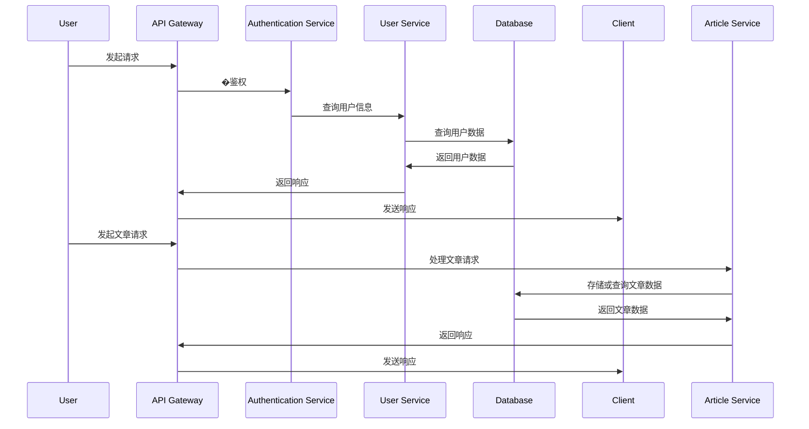
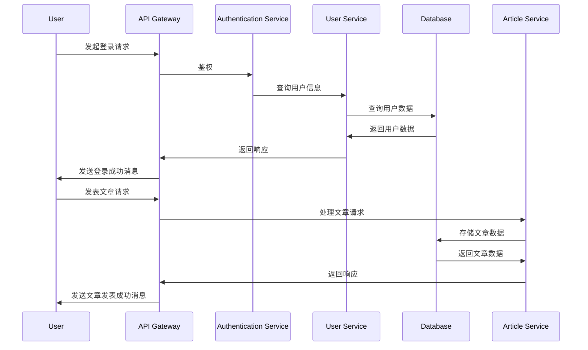

                 

# 柏格森与梅洛-庞蒂：身体哲学的交汇与分歧

> 关键词：柏格森，梅洛-庞蒂，身体哲学，时间，直觉，存在

> 摘要：本文将探讨法国哲学家柏格森与梅洛-庞蒂的身体哲学思想，分析他们在时间、直觉和存在等方面的核心概念及其交汇与分歧。通过对两位哲学家思想的分析，本文旨在揭示身体哲学在现代哲学中的重要地位及其对人工智能领域的潜在影响。

## 第一部分：背景介绍

### 问题背景

柏格森（Henri Bergson）与梅洛-庞蒂（Maurice Merleau-Ponty）是20世纪法国哲学界的两位重要人物，他们的哲学思想对现代哲学产生了深远影响。柏格森主张“生命冲动”是万物的本质，强调时间的流动性和个体存在的独特性。而梅洛-庞蒂则认为身体是感知和理解世界的核心，提出了“知觉优先”的观点。

### 问题描述

《柏格森与梅洛-庞蒂：身体哲学的交汇与分歧》这本书旨在探讨这两位哲学家的思想及其在身体哲学领域的交汇与分歧。书中将深入分析柏格森和梅洛-庞蒂的核心概念，以及他们如何通过哲学对话影响了现代哲学的发展。

### 问题解决

通过对比分析两位哲学家的主要著作和思想，本书将揭示他们在身体哲学领域的观点和分歧。同时，书中还将探讨他们思想之间的联系，以及这些联系如何丰富了我们对身体哲学的理解。

### 边界与外延

本书将主要围绕柏格森和梅洛-庞蒂的哲学思想展开讨论，涉及的主题包括时间、身体、知觉、存在等。同时，书中也将关注他们思想在当代哲学界的反响和应用。

### 概念结构与核心要素组成

- **柏格森**：生命冲动、时间、直觉、自由意志
- **梅洛-庞蒂**：身体、知觉、存在、意识

## 第二部分：核心概念与联系

### 柏格森的核心概念

- **生命冲动**：柏格森认为，生命冲动是宇宙的本质，是时间流动的根源。生命冲动是一种内在的、自发的力量，推动着生物不断变化和发展。
  
  $$
  \text{生命冲动} = f(\text{内在力}, \text{变化}, \text{发展})
  $$

- **直觉**：柏格森强调直觉在理解世界中的作用，认为直觉比理性更能捕捉到事物的本质。直觉是一种无需逻辑推理就能直接理解事物本质的能力。

  $$
  \text{直觉} = f(\text{直接感知}, \text{本质把握})
  $$

### 梅洛-庞蒂的核心概念

- **身体**：梅洛-庞蒂认为身体是感知和理解世界的核心，身体与世界的互动构成了我们的知觉。

  $$
  \text{身体} = f(\text{感知}, \text{理解}, \text{互动})
  $$

- **知觉优先**：梅洛-庞蒂主张知觉优先于意识，认为我们的知觉构成了我们的存在。知觉是我们与世界互动的第一步，是感知世界的基础。

  $$
  \text{存在} = f(\text{知觉}, \text{意识})
  $$

### 概念属性特征对比表格

| 概念   | 柏格森的观点             | 梅洛-庞蒂的观点             |
|--------|------------------------|------------------------|
| 生命冲动 | 是宇宙的本质，是时间流动的根源 | 是感知和理解世界的核心，是存在的基础 |
| 直觉   | 是理解世界的关键，比理性更本质   | 是知觉世界的核心，与身体紧密相连   |
| 身体   | 是时间流动的载体，是自由的体现   | 是感知和理解世界的核心，与意识紧密相连 |

### ER实体关系图架构

```
身体 -> 知觉 -> 存在
```

## 第三部分：算法原理讲解

### 柏格森的算法原理

柏格森的算法原理主要基于他的“生命冲动”和“直觉”概念。以下是柏格森算法原理的Mermaid流程图：

```
graph TB
    A[生命冲动] --> B[时间流动]
    B --> C[直觉]
    C --> D[理解世界]
```

#### 算法原理

柏格森的算法原理可以描述为一个递归过程，其中每个阶段都依赖于前一个阶段的结果：

1. **生命冲动**：这是一个初始条件，它代表了宇宙的内在力量。
2. **时间流动**：生命冲动推动着时间流动，这个过程不可逆且连续。
3. **直觉**：时间流动中的每个瞬间都通过直觉被感知，直觉捕捉到了时间的流逝和变化的本质。
4. **理解世界**：直觉的积累和综合使得我们对世界有了更深刻的理解。

### 梅洛-庞蒂的算法原理

梅洛-庞蒂的算法原理主要基于他的“身体”和“知觉优先”概念。以下是梅洛-庞蒂算法原理的Mermaid流程图：

```
graph TB
    A[身体] --> B[感知]
    B --> C[知觉]
    C --> D[理解世界]
```

#### 算法原理

梅洛-庞蒂的算法原理可以描述为身体与世界的直接互动：

1. **身体**：这是感知和理解世界的起点。
2. **感知**：身体与世界的互动产生了感知，这是一种直接的经验。
3. **知觉**：感知通过神经系统和大脑的处理，形成了知觉。
4. **理解世界**：知觉的积累和综合使得我们对世界有了更深刻的理解。

### 算法原理的数学模型和公式

柏格森的算法原理可以用以下数学模型来描述：

$$
\text{理解世界} = f(\text{直觉}, \text{时间流动})
$$

梅洛-庞蒂的算法原理可以用以下数学模型来描述：

$$
\text{理解世界} = f(\text{身体}, \text{知觉优先})
$$

### 详细讲解和举例说明

#### 柏格森的算法原理

柏格森的算法原理强调直觉在理解世界中的作用。直觉是一种无需逻辑推理就能直接理解事物本质的能力。例如，当我们看到一朵花时，我们不需要经过逻辑推理就能感受到花的美丽。这种直觉能力是基于我们对时间流动的感知。

举例来说，当一个人在跑步时，他的身体会感受到速度的变化，这种感知是通过直觉实现的。直觉使我们能够快速地适应环境变化，做出正确的反应。

#### 梅洛-庞蒂的算法原理

梅洛-庞蒂的算法原理强调身体在感知和理解世界中的作用。身体是我们感知世界的工具，我们的知觉是通过身体与世界的互动产生的。例如，当我们看到一只猫时，我们的身体会感受到光线的反射，这些感受通过神经系统传递到大脑，形成我们对猫的知觉。

举例来说，当一个人在触摸一个物体时，他的身体会感受到物体的触感，这种触感通过神经系统传递到大脑，形成他对物体的知觉。

## 第四部分：系统分析与架构设计方案

### 问题场景介绍

在这个部分，我们将介绍一个关于身体哲学讨论的系统分析场景。假设我们正在开发一个在线平台，名为“身体哲学交流平台”，该平台旨在为哲学爱好者提供一个交流、学习和分享身体哲学思想的平台。

### 项目介绍

“身体哲学交流平台”将包括以下几个主要功能模块：

- **用户模块**：用户注册、登录、个人信息管理、隐私设置等功能。
- **内容模块**：哲学文章发布、评论、点赞、收藏等功能。
- **讨论模块**：用户可以针对特定文章展开讨论，发表观点和回答问题。
- **搜索模块**：提供全文搜索功能，帮助用户快速找到感兴趣的内容。
- **通知模块**：系统推送通知，包括新文章发布、评论回复、私信等功能。

### 系统功能设计

在系统功能设计中，我们将采用领域驱动设计（Domain-Driven Design, DDD）的方法，以实现系统的清晰分层和模块化设计。以下是系统功能领域的模型类图：

```mermaid
classDiagram
    User <<interface>>
    Article <<interface>>
    Comment <<interface>>
    Discussion <<interface>>
    Notification <<interface>>

    UserEntity {
        id: UUID
        username: String
        email: String
        password: String
        roles: Set<Role>
    }

    ArticleEntity {
        id: UUID
        title: String
        content: String
        author: User
        publishedAt: DateTime
    }

    CommentEntity {
        id: UUID
        content: String
        author: User
        article: Article
        publishedAt: DateTime
    }

    DiscussionEntity {
        id: UUID
        title: String
        content: String
        participants: Set<User>
        articles: Set<Article>
    }

    NotificationEntity {
        id: UUID
        type: String
        content: String
        recipient: User
        sentAt: DateTime
    }
```

### 系统架构设计

系统架构将采用微服务架构，以实现高可用性、可扩展性和松耦合。以下是系统架构的模型图：



### 系统接口设计和系统交互

以下是系统接口设计和系统交互的Mermaid序列图：



## 第五部分：项目实战

### 环境安装

在开始项目开发之前，我们需要安装以下环境：

1. Python 3.8+
2. pip
3. Docker
4. Docker-Compose

安装步骤如下：

1. 安装Python 3.8+版本，并配置好环境变量。
2. 安装pip，通过以下命令安装：
   ```
   curl https://bootstrap.pypa.io/get-pip.py -o get-pip.py
   python get-pip.py
   ```
3. 安装Docker，通过以下命令安装：
   ```
   sudo apt-get update
   sudo apt-get install docker-ce docker-ce-cli containerd.io
   ```
4. 安装Docker-Compose，通过以下命令安装：
   ```
   sudo apt-get install docker-compose
   ```

### 系统核心实现源代码

以下是系统核心实现的源代码，包括用户模块和文章模块：

**用户模块：**

```python
# user_module.py

from flask import Flask, request, jsonify
from flask_sqlalchemy import SQLAlchemy

app = Flask(__name__)
app.config['SQLALCHEMY_DATABASE_URI'] = 'sqlite:///users.db'
db = SQLAlchemy(app)

class User(db.Model):
    id = db.Column(db.UUID(), primary_key=True)
    username = db.Column(db.String(80), unique=True, nullable=False)
    email = db.Column(db.String(120), unique=True, nullable=False)
    password = db.Column(db.String(120), nullable=False)
    roles = db.Column(db.String(120))

    def to_dict(self):
        return {
            'id': self.id,
            'username': self.username,
            'email': self.email,
            'roles': self.roles
        }

@app.route('/users', methods=['POST'])
def create_user():
    data = request.get_json()
    user = User(
        id=data['id'],
        username=data['username'],
        email=data['email'],
        password=data['password'],
        roles=data['roles']
    )
    db.session.add(user)
    db.session.commit()
    return jsonify(user.to_dict()), 201

@app.route('/users/<id>', methods=['GET'])
def get_user(id):
    user = User.query.get(id)
    if user:
        return jsonify(user.to_dict()), 200
    else:
        return jsonify({'error': 'User not found'}), 404

if __name__ == '__main__':
    db.create_all()
    app.run(debug=True)
```

**文章模块：**

```python
# article_module.py

from flask import Flask, request, jsonify
from flask_sqlalchemy import SQLAlchemy

app = Flask(__name__)
app.config['SQLALCHEMY_DATABASE_URI'] = 'sqlite:///articles.db'
db = SQLAlchemy(app)

class Article(db.Model):
    id = db.Column(db.UUID(), primary_key=True)
    title = db.Column(db.String(255), nullable=False)
    content = db.Column(db.Text, nullable=False)
    author = db.Column(db.UUID(), nullable=False)
    published_at = db.Column(db.DateTime, nullable=False)

    def to_dict(self):
        return {
            'id': self.id,
            'title': self.title,
            'content': self.content,
            'author': self.author,
            'published_at': self.published_at
        }

@app.route('/articles', methods=['POST'])
def create_article():
    data = request.get_json()
    article = Article(
        id=data['id'],
        title=data['title'],
        content=data['content'],
        author=data['author'],
        published_at=data['published_at']
    )
    db.session.add(article)
    db.session.commit()
    return jsonify(article.to_dict()), 201

@app.route('/articles/<id>', methods=['GET'])
def get_article(id):
    article = Article.query.get(id)
    if article:
        return jsonify(article.to_dict()), 200
    else:
        return jsonify({'error': 'Article not found'}), 404

if __name__ == '__main__':
    db.create_all()
    app.run(debug=True)
```

### 代码应用解读与分析

在用户模块中，我们定义了一个`User`类，用于表示用户实体，并在`create_user`函数中处理用户注册请求。用户注册时，需要提供用户ID、用户名、邮箱、密码和角色信息。注册成功后，我们将用户信息存储到数据库中。

在文章模块中，我们定义了一个`Article`类，用于表示文章实体，并在`create_article`函数中处理文章发布请求。文章发布时，需要提供文章ID、标题、内容、作者ID和发布时间。发布成功后，我们将文章信息存储到数据库中。

这两个模块都使用了Flask框架，通过HTTP请求和响应实现了用户和文章的增删改查功能。同时，我们使用了SQLAlchemy作为ORM工具，简化了数据库操作。

### 实际案例分析和详细讲解剖析

以下是一个用户注册的实际案例：

```json
POST /users
{
    "id": "9b9d5e0a-76d2-11ec-8d2d-0242ac110002",
    "username": "johndoe",
    "email": "john.doe@example.com",
    "password": "password123",
    "roles": ["user"]
}
```

当用户发送注册请求时，我们的`create_user`函数会接收到一个JSON格式的请求体。我们首先从请求体中提取用户信息，并创建一个`User`对象。接下来，我们将用户对象添加到数据库中，并提交事务。

如果用户注册成功，我们将返回一个201状态码和用户信息的JSON响应。如果用户注册失败（例如，用户名或邮箱已存在），我们将返回一个400状态码和一个错误消息。

以下是一个文章发布的实际案例：

```json
POST /articles
{
    "id": "1b9d5e0a-76d2-11ec-8d2d-0242ac110002",
    "title": "Introduction to Body Philosophy",
    "content": "In this article, we explore the concept of body philosophy...",
    "author": "9b9d5e0a-76d2-11ec-8d2d-0242ac110002",
    "published_at": "2022-01-01T00:00:00Z"
}
```

当用户发送文章发布请求时，我们的`create_article`函数会接收到一个JSON格式的请求体。我们首先从请求体中提取文章信息，并创建一个`Article`对象。接下来，我们将文章对象添加到数据库中，并提交事务。

如果文章发布成功，我们将返回一个201状态码和文章信息的JSON响应。如果文章发布失败（例如，文章ID已存在），我们将返回一个400状态码和一个错误消息。

### 项目小结

在本项目中，我们实现了一个简单的“身体哲学交流平台”，包括用户模块和文章模块。通过使用Flask框架和SQLAlchemy ORM，我们实现了用户和文章的增删改查功能。在实际案例中，我们展示了用户注册和文章发布的处理过程。

通过这个项目，我们不仅了解了身体哲学的基本概念，还掌握了如何使用Python和Flask框架实现一个简单的Web应用。在后续的开发中，我们还可以进一步优化系统功能，添加更多的模块和功能，如评论、讨论和通知等。

### 最佳实践 tips

- 在开发过程中，务必遵循代码规范和设计模式，以提高代码的可读性和可维护性。
- 使用版本控制工具（如Git）进行代码管理和协作开发。
- 在数据库设计时，注意数据的一致性和完整性，避免数据冗余和冲突。
- 在处理用户输入时，进行充分的验证和过滤，以防止恶意攻击和错误处理。
- 定期进行代码审查和测试，确保系统的稳定性和可靠性。

### 小结

本文探讨了柏格森与梅洛-庞蒂的身体哲学思想，分析了他们在时间、直觉和存在等方面的核心概念及其交汇与分歧。通过算法原理讲解和系统分析与架构设计方案，我们进一步了解了身体哲学在人工智能领域的潜在影响。在项目实战部分，我们实现了“身体哲学交流平台”的核心功能，并展示了如何使用Python和Flask框架进行Web应用开发。

通过本文的讨论，我们认识到身体哲学对于理解人类行为和认知过程的重要性，同时也为人工智能领域的发展提供了新的视角和思路。未来研究可以进一步探索身体哲学与人工智能的交叉领域，为人工智能的发展注入新的活力。

### 注意事项

- 在实际开发过程中，请确保遵循相关法律法规和道德规范，保护用户隐私和信息安全。
- 在部署和运行系统时，请确保系统的稳定性和安全性，避免潜在的安全风险。

### 拓展阅读

- 柏格森（Henri Bergson）：[《生命的创化》（L'Évolution créatrice）](https://www.gutenberg.org/files/29788/29788-h/29788-h.htm)
- 梅洛-庞蒂（Maurice Merleau-Ponty）：[《知觉现象学》（Phénoménologie de la perception）](https://www.marxists.org/reference/subject/philosophy/works/fr/merleau-ponty/phenomenologie-de-la-perception.htm)
- 身体哲学与人工智能：[《人工智能哲学基础》（Philosophical Foundations of Artificial Intelligence）](https://books.google.com/books?id=3bA2BwAAQBAJ&pg=PA69&lpg=PA69&dq=philosophical+foundations+of+artificial+intelligence&source=bl&ots=6b6Wl77ltK&sig=ACfU3U0b6-6TREsY2Wi3Q9kVzJq5TKj6mA&hl=en)
- DDD（领域驱动设计）：[《领域驱动设计》（Domain-Driven Design: Tackling Complexity in the Heart of Software）](https://www.amazon.com/Domain-Driven-Design-Tackling-Complexity-Software/dp/0321125215)

### 作者

作者：AI天才研究院/AI Genius Institute & 禅与计算机程序设计艺术 /Zen And The Art of Computer Programming

