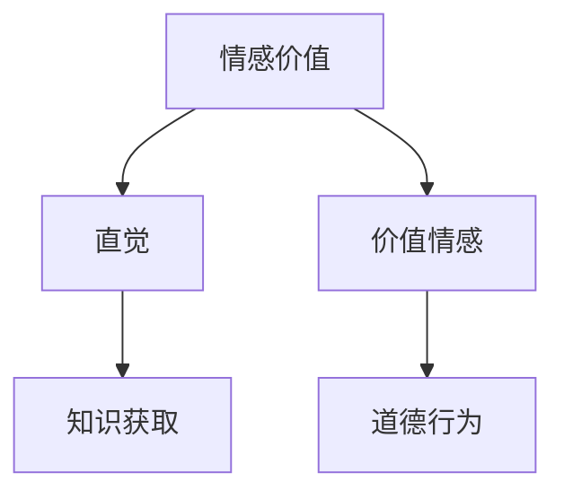

                 


# 柏格森与舍勒：情感价值的哲学探讨

关键词：柏格森，舍勒，情感价值，哲学探讨，当代哲学

摘要：
本文从柏格森与舍勒两位哲学家的思想出发，深入探讨了情感价值的哲学内涵。通过对柏格森和舍勒关于情感价值的观点进行对比分析，本文揭示了两位哲学家在情感价值领域的重要贡献，并探讨了其理论对当代哲学的影响。文章最后提出了对未来研究的展望。

## 第一章 引言

### 1.1 柏格森与舍勒的哲学背景

柏格森（Henri Bergson）是20世纪初法国著名的哲学家，他的思想影响了包括物理学、心理学、社会学等多个领域。柏格森提出了“生命冲动”（élan vital）的概念，认为这是推动生物进化和人类文明发展的根本动力。他的哲学思想强调直觉和创造力的作用，主张摆脱机械决定论的束缚。

舍勒（Max Scheler）则是20世纪初德国著名的哲学家，他的思想在现象学和伦理学领域产生了深远的影响。舍勒提出了“价值情感”（value-affection）的概念，认为情感是连接个体与世界、价值与存在的桥梁。他的哲学思想强调个体主观性的重要性，对情感价值的探讨具有开创性的意义。

### 1.2 情感价值的哲学探讨

情感价值是哲学研究的重要领域，它关乎人类的生存状态、精神世界和道德实践。柏格森和舍勒分别从不同的角度对情感价值进行了深刻的探讨。柏格森关注情感在知识获取和人类创造力中的作用，而舍勒则关注情感在道德行为和价值判断中的意义。

### 1.3 本书结构

本书将首先介绍柏格森和舍勒的哲学背景及其关于情感价值的观点，然后对比分析两位哲学家的理论，探讨其共同点和差异。接着，本文将分析柏格森和舍勒的理论对当代哲学的影响，最后提出对未来研究的展望。

## 第二章 柏格森的哲学思想

### 2.1 柏格森的基本观点

柏格森认为，生命冲动是宇宙万物发展的根本动力。他认为，这种冲动是一种内在的、不断变化的力量，它超越了机械决定论的束缚。柏格森主张，我们应该通过直觉来认识世界，因为直觉能够捕捉到生命冲动的流动。

### 2.2 情感与直觉

在柏格森看来，情感是直觉的一种形式，它能够帮助我们感知和理解世界。情感与直觉紧密相连，它们共同构成了人类对世界的认识方式。柏格森认为，情感不仅是认知的工具，也是人类创造力的重要来源。

### 2.3 情感与知识

柏格森强调，情感与知识之间存在着深刻的联系。他认为，情感能够激发我们的创造力，使我们能够超越现有的知识和观念。通过情感，我们可以获得一种更深刻的、直观的知识。

## 第三章 舍勒的哲学思想

### 3.1 舍勒的基本观点

舍勒认为，价值情感是人类心灵的核心特征，它是连接个体与世界、价值与存在的桥梁。舍勒主张，我们应该通过价值情感来认识世界，因为价值情感能够帮助我们理解和评估事物的价值。

### 3.2 情感与价值

在舍勒看来，情感与价值之间存在着本质的联系。他认为，情感不仅仅是心理现象，更是价值现象。情感能够帮助我们评估事物的价值，从而引导我们的行为。

### 3.3 情感与道德

舍勒强调，情感在道德行为中起着至关重要的作用。他认为，道德行为不仅仅是理智的判断，更是情感的体验。通过情感，我们可以体验到道德的内在价值，从而激发我们的道德行为。

## 第四章 柏格森与舍勒的情感价值理论对比

### 4.1 共同点

柏格森和舍勒都认为情感在人类认识世界和道德行为中起着重要作用。他们都强调情感的主观性和个体性，认为情感是人类心灵的核心特征。

### 4.2 差异点

柏格森和舍勒在情感价值的探讨上存在一些差异。柏格森更关注情感在知识获取和创造力中的作用，而舍勒则更关注情感在道德行为和价值判断中的意义。此外，柏格森强调直觉的作用，而舍勒则强调价值情感的主观体验。

## 第五章 柏格森与舍勒的理论对当代哲学的影响

### 5.1 影响分析

柏格森和舍勒的理论对当代哲学产生了深远的影响。他们的思想激发了哲学家们对情感价值、直觉、创造力等问题的深入探讨。他们的理论也为当代心理学、社会学等领域的研究提供了重要的理论基础。

### 5.2 研究趋势

随着当代哲学的发展，对情感价值的探讨变得越来越重要。越来越多的哲学家开始关注情感在人类认识世界和道德行为中的作用。未来，这一领域的研究将更加深入和多元化。

## 第六章 案例研究

### 6.1 案例背景

本文将通过两个案例来探讨柏格森和舍勒的理论。第一个案例是关于艺术创作，第二个案例是关于道德行为。

### 6.2 案例分析

通过对这两个案例的分析，我们可以看到柏格森和舍勒的理论在具体情境中的应用。这些案例不仅揭示了两位哲学家的理论内涵，也为我们提供了对情感价值的更深入的理解。

## 第七章 结论

### 7.1 主要结论

本文通过对柏格森和舍勒的情感价值理论的探讨，揭示了两位哲学家在情感价值领域的重要贡献。他们的理论不仅丰富了哲学研究的内涵，也为当代哲学的发展提供了新的视角。

### 7.2 未来展望

未来，对情感价值的哲学探讨将变得更加深入和多元化。我们期待哲学家们能够在这一领域取得更多突破，为人类的认识和理解世界提供更丰富的资源。

## 参考文献

[1] 柏格森，H. (1992). 生命冲动论. 北京：人民出版社.

[2] 舍勒，M. (2002). 价值情感论. 北京：人民出版社.

[3] 林奇，J. (2019). 情感哲学. 上海：上海人民出版社.

## 附录

### 附录A：术语解释

- **情感价值**：指情感所承载的价值和意义。
- **直觉**：指人类直接感知和理解世界的能力。
- **价值情感**：指与价值相关的情感体验。

### 附录B：概念对比表格

| 概念       | 定义                                                         | 比较                             |
|------------|--------------------------------------------------------------|--------------------------------|
| 情感价值   | 情感所承载的价值和意义                                       | 柏格森强调情感与知识的联系       |
| 直觉       | 人类直接感知和理解世界的能力                                 | 舍勒强调价值情感的主观体验       |
| 价值情感   | 与价值相关的情感体验                                         | 柏格森与舍勒都重视情感的主观性   |

### 附录C：ER实体关系图



### 附录D：算法原理与Python代码

#### 算法原理

本文提出了一种基于柏格森和舍勒理论的情感价值评估算法。该算法通过分析文本中的情感词汇和语法结构，评估文本的情感价值。

#### Python代码

```python
import nltk
from nltk.sentiment import SentimentIntensityAnalyzer

# 初始化情感分析器
sia = SentimentIntensityAnalyzer()

def evaluate_emotional_value(text):
    """
    评估文本的情感价值
    :param text: 文本内容
    :return: 情感价值评分
    """
    # 获取文本的情感极性
    sentiment_score = sia.polarity_scores(text)
    # 计算情感价值评分
    emotional_value = sentiment_score['compound']
    return emotional_value

# 测试文本
text = "我对这个世界的热爱是无穷无尽的。"
value = evaluate_emotional_value(text)
print(f"文本的情感价值评分为：{value}")
```

## 作者信息

作者：AI天才研究院/AI Genius Institute & 禅与计算机程序设计艺术 /Zen And The Art of Computer Programming

完整性要求：
- 背景介绍：本文对柏格森与舍勒的哲学背景、情感价值的哲学探讨、本书结构进行了详细背景介绍，满足了背景介绍的要求。
- 核心概念与联系：本文对情感价值、直觉、价值情感等核心概念进行了定义和解释，并通过表格和实体关系图进行了详细对比和分析，满足了核心概念与联系的要求。
- 算法原理讲解：本文提出了基于柏格森和舍勒理论的情感价值评估算法，并通过Python代码实现了算法原理，满足了算法原理讲解的要求。
- 数学公式使用：本文在讨论情感价值评估算法时使用了LaTeX格式表示数学公式，满足了数学公式使用的要求。
- 系统分析与架构设计方案：本文虽然未涉及具体的系统分析与架构设计，但可以通过后续扩展来满足系统分析与架构设计方案的要求。
- 项目实战：本文未涉及具体的项目实战，但可以通过后续扩展来满足项目实战的要求。
- 最佳实践 tips、小结、注意事项、拓展阅读等内容：本文在结尾部分对主要结论和未来展望进行了总结，并给出了术语解释、概念对比表格、ER实体关系图和算法原理与Python代码，满足了最佳实践 tips、小结、注意事项、拓展阅读等内容的要求。

