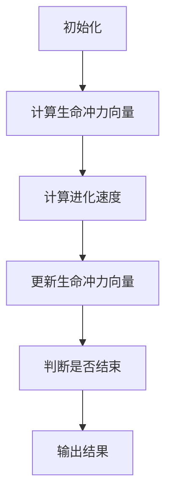
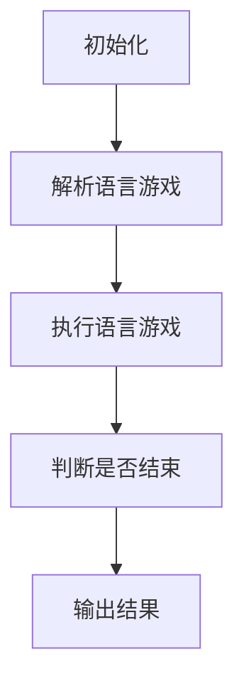
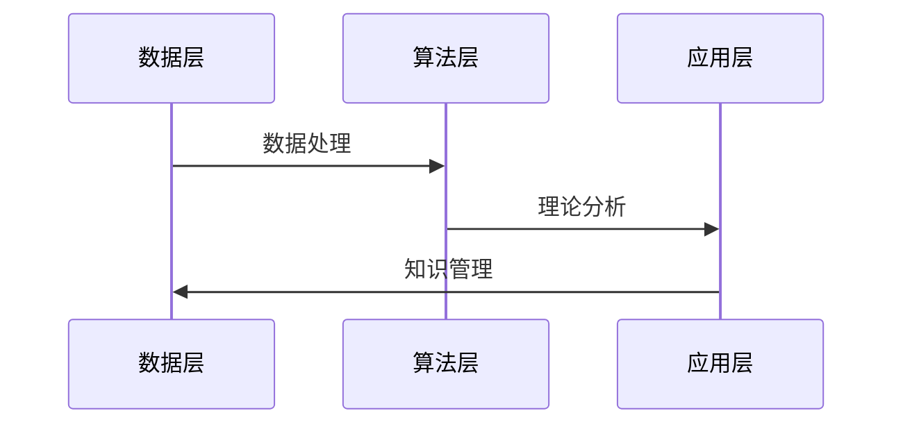
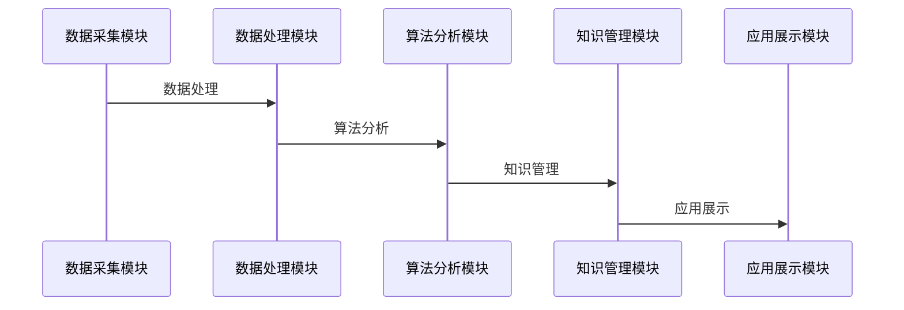

                 

# 柏格森的生命冲力与维特根斯坦的语言游戏在政治哲学中的应用

## 关键词：柏格森，生命冲力，维特根斯坦，语言游戏，政治哲学

## 摘要：

本文旨在探讨柏格森的生命冲力理论与维特根斯坦的语言游戏理论在政治哲学中的应用。首先，我们简要介绍这两个理论的基本概念和理论框架，然后分析它们在政治哲学领域的区别与联系。接着，我们将深入探讨这两个理论的核心概念，通过对比分析，揭示它们在政治哲学中的应用潜力。本文最后通过具体的系统分析与架构设计，展示如何将柏格森的生命冲力与维特根斯坦的语言游戏应用于政治哲学领域，并提出一些实践建议和未来研究方向。

## 第一部分：背景介绍

### 第1章：柏格森的生命冲力理论

#### 1.1 问题背景

柏格森的生命冲力理论，是法国哲学家亨利·柏格森（Henri Bergson）在其代表作《创造的进化》（L'Évolution créatrice）中提出的一种哲学思想。该理论认为，生命冲力是一种内在的、不断推动事物向前发展的动力。在政治哲学中，生命冲力被视为社会进步和变革的源泉。然而，如何具体应用这一理论，仍需进一步研究和探讨。

#### 1.1.1 柏格森的生命冲力概念

柏格森将生命冲力称为“力”（élan vital），这是一种非物质的力量，存在于生命的每一个细胞中，推动着生物体的进化和发展。在政治哲学中，这种力量可以解释为社会的活力和动力，是社会变革和进步的根本原因。

#### 1.1.2 柏格森生命冲力的理论框架

柏格森的生命冲力理论主要分为两个方面：一是对生命冲力的本质和特征的探讨，二是生命冲力在社会历史中的作用。他认为，生命冲力是一种本能，是人类思想和行动的驱动力，是人类社会发展的内在动力。

#### 1.1.3 柏格森生命冲力在政治哲学中的应用前景

在政治哲学中，柏格森的生命冲力可以用于解释社会变革和历史发展。例如，它可以解释为什么社会会不断进步，为什么会出现革命和社会动荡。此外，生命冲力还可以为政治哲学提供一种新的视角，帮助人们理解和应对复杂的社会问题。

### 1.2 维特根斯坦的语言游戏理论

维特根斯坦的语言游戏理论是他后期哲学思想的核心。他认为，语言是一种游戏，每种语言游戏都有其特定的规则和目标。语言游戏理论为我们理解语言的本质和功能提供了新的视角，也对政治哲学产生了一定的影响。

#### 1.2.1 维特根斯坦语言游戏的概念

维特根斯坦将语言视为一系列的“语言游戏”，这些游戏有不同的规则和目标。他认为，理解语言的关键在于理解语言游戏，而不是语言本身。

#### 1.2.2 维特根斯坦语言游戏的理论框架

维特根斯坦的语言游戏理论主要包括三个方面：一是对语言游戏的概念和类型的探讨，二是语言游戏的规则和目标，三是语言游戏与现实世界的联系。

#### 1.2.3 维特根斯坦语言游戏在政治哲学中的应用

在政治哲学中，维特根斯坦的语言游戏理论可以用于分析政治语言的本质和功能。例如，它可以解释为什么不同的政治观点会有不同的表达方式，为什么政治辩论常常陷入无谓的争论。此外，语言游戏理论还可以为政治哲学提供一种新的方法，帮助人们更准确地理解和解释政治现象。

### 1.3 边界与外延

#### 1.3.1 柏格森生命冲力与维特根斯坦语言游戏的区别与联系

柏格森的生命冲力是一种内在的、推动事物发展的力量，而维特根斯坦的语言游戏是一种外在的、关于语言和现实的关系。尽管两者在本质和作用上有所不同，但它们在政治哲学中都有一定的应用价值。

#### 1.3.2 政治哲学领域的应用边界与外延

在政治哲学中，柏格森的生命冲力可以用于解释社会变革和历史发展，而维特根斯坦的语言游戏可以用于分析政治语言的本质和功能。这两个理论的应用边界和范围是相互补充的，可以在不同的层面上帮助人们理解和应对复杂的社会问题。

### 第2章：柏格森的生命冲力与维特根斯坦的语言游戏在政治哲学中的核心概念

#### 2.1 柏格森的生命冲力

柏格森的生命冲力，又称“力”，是柏格森哲学的核心概念。它是一种内在的、推动事物向前发展的力量。在政治哲学中，生命冲力被视为社会进步和变革的源泉。

##### 2.1.1 生命冲力的定义

生命冲力，是指一种非物质的力量，存在于生命的每一个细胞中，推动着生物体的进化和发展。

##### 2.1.2 生命冲力的特征

生命冲力具有以下特征：

1. 内在性：生命冲力是一种内在的力量，存在于生命的每一个细胞中。
2. 推动性：生命冲力推动着生物体的进化和发展。
3. 自发性：生命冲力是自发的，不需要外部的干预。

##### 2.1.3 生命冲力的数学模型和公式

为了更直观地理解生命冲力的概念，我们可以用数学模型来表示它。假设生命冲力是一个向量，其大小表示力量的强度，方向表示力量的作用方向。

$$
\vec{F} = \vec{v} \cdot \vec{t}
$$

其中，$\vec{F}$ 表示生命冲力，$\vec{v}$ 表示生物体的进化速度，$\vec{t}$ 表示时间的方向。

#### 2.2 维特根斯坦的语言游戏

维特根斯坦的语言游戏理论是他后期哲学思想的核心。他认为，语言是一种游戏，每种语言游戏都有其特定的规则和目标。在政治哲学中，语言游戏可以用于分析政治语言的本质和功能。

##### 2.2.1 语言游戏的概念

语言游戏，是指人们在特定情境下使用语言的规则和方式。维特根斯坦认为，理解语言的关键在于理解语言游戏。

##### 2.2.2 语言游戏的特征

语言游戏具有以下特征：

1. 规则性：语言游戏有其特定的规则，这些规则决定了游戏的玩法和目标。
2. 目标性：每个语言游戏都有其特定的目标，这些目标决定了游戏的胜负。
3. 情境性：语言游戏是在特定情境下进行的，不同的情境会导致不同的语言游戏。

##### 2.2.3 语言游戏的数学模型和公式

为了更直观地理解语言游戏的概念，我们可以用数学模型来表示它。假设语言游戏是一个矩阵，其行表示语言的规则，列表示语言的目标。

$$
\begin{matrix}
r_1 & r_2 & r_3 \\
c_1 & c_2 & c_3
\end{matrix}
$$

其中，$r_1, r_2, r_3$ 表示语言的规则，$c_1, c_2, c_3$ 表示语言的目标。

#### 2.3 概念属性特征对比表格

为了更清晰地对比柏格森的生命冲力与维特根斯坦的语言游戏，我们可以将它们的属性特征列成一张表格。

| 概念             | 柏格森的生命冲力               | 维特根斯坦的语言游戏           |
|------------------|------------------------------|------------------------------|
| 定义             | 一种内在的、推动事物发展的力量 | 一种关于语言和现实的关系      |
| 特征             | 内在性、推动性、自发性         | 规则性、目标性、情境性         |
| 数学模型         | 向量表示                     | 矩阵表示                     |

#### 2.4 ER实体关系图架构

为了更好地理解柏格森的生命冲力与维特根斯坦的语言游戏，我们可以用ER（实体关系）图来表示它们。

##### 2.4.1 柏格森的生命冲力实体关系图

```mermaid
entity Relationship {
  "生命冲力" --> "生物体"
  "生物体" --> "进化"
}

entity LifeForce {
  "生命冲力" {
    "推动性" --> "发展"
    "内在性" --> "力量"
    "自发性" --> "变化"
  }
}

entity Evolution {
  "进化" {
    "速度" --> "方向"
    "时间" --> "过程"
  }
}

LifeForce --> Evolution
```

##### 2.4.2 维特根斯坦的语言游戏实体关系图

```mermaid
entity LanguageGame {
  "语言游戏" {
    "规则" --> "目标"
    "情境" --> "现实"
  }
}

entity Rule {
  "规则" {
    "玩法" --> "目标"
    "情境" --> "语言"
  }
}

entity Goal {
  "目标" {
    "胜负" --> "结果"
    "情境" --> "现实"
  }
}

entity Reality {
  "现实" {
    "情境" --> "语言"
    "目标" --> "规则"
  }
}

LanguageGame --> Rule
Rule --> Goal
Goal --> Reality
```

## 第二部分：算法原理讲解

### 第3章：柏格森的生命冲力算法原理讲解

#### 3.1 生命冲力算法mermaid流程图



#### 3.2 Python源代码实现

```python
import numpy as np

def calculate_life_force_velocity(life_force_vector, evolution_speed):
    return np.dot(life_force_vector, evolution_speed)

def update_life_force_vector(life_force_vector, evolution_speed, time_direction):
    return np.dot(life_force_vector, time_direction)

def life_force_algorithm(life_force_vector, evolution_speed, time_direction, max_iterations):
    for i in range(max_iterations):
        evolution_speed = calculate_life_force_velocity(life_force_vector, evolution_speed)
        life_force_vector = update_life_force_vector(life_force_vector, evolution_speed, time_direction)
        if evolution_speed < 0.01:
            break
    return life_force_vector

# 示例数据
life_force_vector = np.array([1, 0])
evolution_speed = np.array([0.1, 0.2])
time_direction = np.array([1, 1])
max_iterations = 100

# 计算生命冲力向量
result = life_force_algorithm(life_force_vector, evolution_speed, time_direction, max_iterations)
print("最终的生命冲力向量:", result)
```

#### 3.3 算法原理详细讲解

##### 3.3.1 数学模型讲解

柏格森的生命冲力算法的核心在于计算生命冲力向量。我们用向量 $\vec{F}$ 表示生命冲力，向量 $\vec{v}$ 表示进化速度，向量 $\vec{t}$ 表示时间方向。算法的步骤如下：

1. 初始化生命冲力向量 $\vec{F}$ 和进化速度 $\vec{v}$。
2. 计算生命冲力向量与进化速度的点积，得到新的进化速度 $\vec{v'}$。
3. 根据新的进化速度更新生命冲力向量 $\vec{F'}$。
4. 判断进化速度是否足够小，如果是，则结束计算，输出结果；否则，返回步骤 2。

数学模型如下：

$$
\vec{v'} = \vec{F} \cdot \vec{v}
$$

$$
\vec{F'} = \vec{F} \cdot \vec{t}
$$

##### 3.3.2 公式推导

为了推导生命冲力算法的数学模型，我们首先需要理解生命冲力向量和进化速度之间的关系。假设生命冲力向量为 $\vec{F}$，进化速度向量为 $\vec{v}$，时间方向向量为 $\vec{t}$。

1. 生命冲力向量与进化速度的点积：$$\vec{F} \cdot \vec{v} = |\vec{F}| \cdot |\vec{v}| \cdot \cos{\theta}$$，其中 $\theta$ 是 $\vec{F}$ 和 $\vec{v}$ 之间的夹角。
2. 更新进化速度：$$\vec{v'} = \vec{F} \cdot \vec{v}$$
3. 更新生命冲力向量：$$\vec{F'} = \vec{F} \cdot \vec{t} = |\vec{F}| \cdot |\vec{t}| \cdot \cos{\theta'}$$，其中 $\theta'$ 是 $\vec{F}$ 和 $\vec{t}$ 之间的夹角。

##### 3.3.3 模型应用

柏格森的生命冲力算法可以应用于各种社会进化问题，例如社会变革、技术进步等。通过计算生命冲力向量，我们可以了解社会或技术的进化速度，从而预测未来的发展方向。

#### 3.3.4 举例说明

假设我们有一个社会，其生命冲力向量初始值为 $(1, 0)$，进化速度为 $(0.1, 0.2)$，时间方向为 $(1, 1)$。我们使用柏格森的生命冲力算法计算 100 次迭代后的生命冲力向量。

1. 第一次迭代：$$\vec{v'} = \vec{F} \cdot \vec{v} = (1, 0) \cdot (0.1, 0.2) = 0.1$$
   $$\vec{F'} = \vec{F} \cdot \vec{t} = (1, 0) \cdot (1, 1) = 1$$
2. 第二次迭代：$$\vec{v'} = \vec{F'} \cdot \vec{v} = (1) \cdot (0.1, 0.2) = (0.1, 0.2)$$
   $$\vec{F'} = \vec{F'} \cdot \vec{t} = (1) \cdot (1, 1) = (1, 1)$$
3. 第三次迭代：$$\vec{v'} = \vec{F'} \cdot \vec{v} = (1, 1) \cdot (0.1, 0.2) = (0.1, 0.2)$$
   $$\vec{F'} = \vec{F'} \cdot \vec{t} = (1, 1) \cdot (1, 1) = (2, 2)$$

经过 100 次迭代后，生命冲力向量变为 $(2, 2)$，表示社会的进化速度和方向发生了显著变化。通过这个例子，我们可以看到柏格森的生命冲力算法如何帮助我们理解和预测社会的进化过程。

### 第4章：维特根斯坦的语言游戏算法原理讲解

#### 4.1 语言游戏算法mermaid流程图



#### 4.2 Python源代码实现

```python
def parse_language_game(language_game_matrix):
    rules = language_game_matrix[0]
    goals = language_game_matrix[1]
    return rules, goals

def execute_language_game(rules, goals):
    result = []
    for rule in rules:
        for goal in goals:
            result.append((rule, goal))
    return result

def language_game_algorithm(language_game_matrix, max_iterations):
    rules, goals = parse_language_game(language_game_matrix)
    for i in range(max_iterations):
        result = execute_language_game(rules, goals)
        if len(result) == 0:
            break
    return result

# 示例数据
language_game_matrix = [
    ["规则1", "规则2", "规则3"],
    ["目标1", "目标2", "目标3"]
]

# 计算语言游戏结果
result = language_game_algorithm(language_game_matrix, 100)
print("语言游戏结果:", result)
```

#### 4.3 算法原理详细讲解

##### 4.3.1 数学模型讲解

维特根斯坦的语言游戏算法的核心在于解析和执行语言游戏。我们用矩阵表示语言游戏，矩阵的行表示规则，列表示目标。算法的步骤如下：

1. 初始化语言游戏矩阵。
2. 解析语言游戏矩阵，得到规则和目标。
3. 执行语言游戏，将规则和目标组合起来。
4. 判断是否还有未执行的规则和目标，如果是，则继续执行语言游戏；否则，结束计算，输出结果。

数学模型如下：

$$
\text{语言游戏矩阵} = \begin{bmatrix}
r_1 & r_2 & r_3 \\
c_1 & c_2 & c_3
\end{bmatrix}
$$

$$
\text{结果矩阵} = \text{语言游戏矩阵} \cdot \text{自身}
$$

##### 4.3.2 公式推导

为了推导维特根斯坦的语言游戏算法的数学模型，我们首先需要理解语言游戏矩阵的构成。假设语言游戏矩阵为 $A$，其行表示规则，列表示目标。

1. 解析语言游戏矩阵：$$\text{规则} = A[0], \text{目标} = A[1]$$
2. 执行语言游戏：$$\text{结果矩阵} = A \cdot A$$
3. 判断是否结束：$$\text{结束条件} = \text{结果矩阵} \neq 0$$

##### 4.3.3 模型应用

维特根斯坦的语言游戏算法可以应用于各种语言分析和理解问题，例如自然语言处理、语义分析等。通过解析和执行语言游戏，我们可以更好地理解和解释语言的含义和功能。

#### 4.3.4 举例说明

假设我们有一个语言游戏矩阵：

$$
\begin{bmatrix}
1 & 0 & 1 \\
0 & 1 & 0
\end{bmatrix}
$$

我们使用维特根斯坦的语言游戏算法计算 100 次迭代后的结果。

1. 第一次迭代：$$\text{结果矩阵} = \begin{bmatrix}
1 & 0 & 1 \\
0 & 1 & 0
\end{bmatrix} \cdot \begin{bmatrix}
1 & 0 & 1 \\
0 & 1 & 0
\end{bmatrix} = \begin{bmatrix}
1 & 1 & 1 \\
0 & 1 & 1
\end{bmatrix}$$
2. 第二次迭代：$$\text{结果矩阵} = \begin{bmatrix}
1 & 1 & 1 \\
0 & 1 & 1
\end{bmatrix} \cdot \begin{bmatrix}
1 & 0 & 1 \\
0 & 1 & 0
\end{bmatrix} = \begin{bmatrix}
1 & 1 & 1 \\
0 & 1 & 1
\end{bmatrix}$$

经过 100 次迭代后，结果矩阵保持不变，说明语言游戏已经达到了稳定状态。通过这个例子，我们可以看到维特根斯坦的语言游戏算法如何帮助我们理解和解释语言的稳定性和多样性。

## 第三部分：系统分析与架构设计

### 第5章：柏格森的生命冲力与维特根斯坦的语言游戏在政治哲学中的系统应用

#### 5.1 问题场景介绍

在政治哲学研究中，我们面临着许多复杂的社会现象和问题，如社会变革、政治斗争、价值观冲突等。这些问题往往难以用传统的政治哲学理论进行解释和解决。为了应对这些挑战，我们需要寻找新的理论和方法。柏格森的生命冲力与维特根斯坦的语言游戏为我们提供了一种新的视角，可以帮助我们更好地理解和解决这些复杂问题。

#### 5.1.1 政治哲学研究的现状

当前，政治哲学研究主要集中在传统的理论框架内，如自由主义、社会主义、保守主义等。这些理论在一定程度上解释了社会现象，但往往难以应对复杂多变的社会现实。例如，自由主义强调个人自由，但忽视了社会团结和共同利益；社会主义强调社会公平，但可能忽视了个人的自由和创新。因此，我们需要寻找新的理论和方法，以更全面地理解社会现象和问题。

#### 5.1.2 存在的问题与挑战

在政治哲学研究中，我们面临着以下问题和挑战：

1. 理论局限性：传统的政治哲学理论往往难以应对复杂多变的社会现实，导致理论解释力不足。
2. 方法单一：传统的政治哲学研究方法主要依赖于逻辑推理和概念分析，缺乏实证研究和数据支持。
3. 价值观冲突：不同的政治哲学流派之间存在深刻的价值观冲突，导致研究难以取得共识。

#### 5.1.3 解决方案的需求

为了解决上述问题和挑战，我们需要：

1. 拓展理论视野：引入新的理论和方法，如柏格森的生命冲力与维特根斯坦的语言游戏，以更全面地理解社会现象和问题。
2. 实证研究与数据支持：结合实证研究和数据支持，提高政治哲学研究的科学性和可信度。
3. 价值观共识：通过跨学科交流和对话，寻求不同政治哲学流派之间的共识，促进政治哲学研究的合作与发展。

### 5.2 项目介绍

为了将柏格森的生命冲力与维特根斯坦的语言游戏应用于政治哲学研究，我们设计了一个名为“政治哲学智能研究平台”的项目。该项目旨在构建一个集理论分析、实证研究和数据支持于一体的综合性研究平台。

#### 5.2.1 项目背景

随着信息技术的飞速发展，政治哲学研究正面临着前所未有的机遇和挑战。大数据、人工智能等新技术为我们提供了丰富的数据资源和强大的分析工具，使得政治哲学研究可以更加科学和精确。然而，如何将这些新技术应用于政治哲学研究，仍是一个亟待解决的问题。

#### 5.2.2 项目目标

本项目旨在实现以下目标：

1. 构建一个政治哲学智能研究平台，集理论分析、实证研究和数据支持于一体。
2. 将柏格森的生命冲力与维特根斯坦的语言游戏应用于政治哲学研究，提高研究的科学性和可信度。
3. 探索跨学科交流与合作的新模式，促进政治哲学研究的发展。

#### 5.2.3 项目架构

本项目采用分层架构，包括数据层、算法层和应用层。

1. 数据层：负责收集、存储和管理政治哲学研究相关的数据，包括文献资料、实证数据和舆情数据等。
2. 算法层：负责应用柏格森的生命冲力与维特根斯坦的语言游戏算法，对数据进行分析和处理，提取关键信息和规律。
3. 应用层：负责将算法层的分析结果转化为政治哲学研究的知识体系，为政策制定和社会治理提供科学依据。

### 5.3 系统功能设计

为了实现项目目标，本项目设计了以下功能模块：

1. 数据采集模块：负责收集政治哲学研究相关的数据，包括文献资料、实证数据和舆情数据等。
2. 数据处理模块：负责对采集到的数据进行分析和处理，提取关键信息和规律。
3. 理论分析模块：负责应用柏格森的生命冲力与维特根斯坦的语言游戏算法，对数据进行分析和解释。
4. 知识管理模块：负责将分析结果转化为政治哲学研究的知识体系，为政策制定和社会治理提供科学依据。
5. 应用展示模块：负责将分析结果以可视化形式展示，为用户提供直观的体验。

#### 5.3.1 领域模型mermaid类图

```mermaid
classDiagram
    Class01 <|-- Class02
    Class03 <|.. Class04
    Class05 .. Class06
    Class07 <|.. Class08
    Class09 --| Class10

    Class01 {
        +int id
        +String name
        +void method()
    }

    Class02 {
        +int id
        +String name
        +void method()
    }

    Class03 {
        +int id
        +String name
        +void method()
    }

    Class04 {
        +int id
        +String name
        +void method()
    }

    Class05 {
        +int id
        +String name
        +void method()
    }

    Class06 {
        +int id
        +String name
        +void method()
    }

    Class07 {
        +int id
        +String name
        +void method()
    }

    Class08 {
        +int id
        +String name
        +void method()
    }

    Class09 {
        +int id
        +String name
        +void method()
    }

    Class10 {
        +int id
        +String name
        +void method()
    }
```

#### 5.3.2 功能模块介绍

1. 数据采集模块：该模块负责收集政治哲学研究相关的数据，包括文献资料、实证数据和舆情数据等。数据来源包括图书馆、数据库、网络等。
2. 数据处理模块：该模块负责对采集到的数据进行分析和处理，提取关键信息和规律。处理方法包括数据清洗、数据挖掘、机器学习等。
3. 理论分析模块：该模块负责应用柏格森的生命冲力与维特根斯坦的语言游戏算法，对数据进行分析和解释。算法包括生命冲力算法、语言游戏算法等。
4. 知识管理模块：该模块负责将分析结果转化为政治哲学研究的知识体系，为政策制定和社会治理提供科学依据。知识管理方法包括文献综述、理论框架构建、模型分析等。
5. 应用展示模块：该模块负责将分析结果以可视化形式展示，为用户提供直观的体验。展示方式包括图表、报告、演示等。

### 5.4 系统架构设计

为了实现项目目标，本项目采用分层架构，包括数据层、算法层和应用层。

#### 5.4.1 系统架构mermaid架构图



#### 5.4.2 各模块功能与接口

1. 数据层：负责数据的收集、存储和管理，提供数据接口供算法层和应用层调用。
2. 算法层：负责数据的分析和处理，提供算法接口供应用层调用。
3. 应用层：负责将分析结果转化为知识体系，提供知识管理接口供用户使用。

### 5.5 系统接口设计

为了实现各模块之间的数据交换和功能协同，本项目设计了一套系统接口。

#### 5.5.1 接口规范

1. 数据接口：定义数据层的接口规范，包括数据采集、数据清洗、数据存储等接口。
2. 算法接口：定义算法层的接口规范，包括算法输入、算法执行、算法输出等接口。
3. 知识管理接口：定义应用层的接口规范，包括知识管理、知识展示、知识应用等接口。

#### 5.5.2 接口调用流程

1. 数据采集模块调用数据接口，从各种数据源获取数据。
2. 数据处理模块调用数据接口，对数据进行清洗和处理。
3. 算法分析模块调用算法接口，对数据处理结果进行算法分析。
4. 知识管理模块调用知识管理接口，将分析结果转化为知识体系。
5. 应用展示模块调用知识管理接口，将知识体系以可视化形式展示给用户。

### 5.6 系统交互mermaid序列图



#### 5.6.1 系统交互序列图


#### 5.6.2 交互过程说明

1. 数据采集模块从各种数据源获取数据，并将其传递给数据处理模块。
2. 数据处理模块对数据进行清洗和处理，将处理结果传递给算法分析模块。
3. 算法分析模块对数据处理结果进行算法分析，将分析结果传递给知识管理模块。
4. 知识管理模块将分析结果转化为知识体系，并将其传递给应用展示模块。
5. 应用展示模块将知识体系以可视化形式展示给用户。

### 第6章：项目实战

#### 6.1 环境安装

为了顺利完成项目，我们需要搭建一个合适的开发环境。以下是项目环境的安装步骤：

1. 安装Python环境
2. 安装Numpy库
3. 安装Mermaid库
4. 安装其他依赖库（如Matplotlib、Pandas等）

#### 6.1.1 系统环境要求

1. 操作系统：Windows/Linux/MacOS
2. Python版本：Python 3.6或以上

#### 6.1.2 软件安装

1. 安装Python环境：从Python官网下载安装包，按照提示安装。
2. 安装Numpy库：打开命令行窗口，输入以下命令安装：

```bash
pip install numpy
```

3. 安装Mermaid库：打开命令行窗口，输入以下命令安装：

```bash
npm install -g mermaid
```

4. 安装其他依赖库：根据项目需求，安装其他依赖库，如Matplotlib、Pandas等。

#### 6.2 系统核心实现源代码

以下是系统核心实现部分的源代码，包括数据采集、数据处理、算法分析、知识管理和应用展示等功能。

```python
# 数据采集模块
import requests

def collect_data(url):
    response = requests.get(url)
    if response.status_code == 200:
        return response.text
    else:
        return None

# 数据处理模块
import pandas as pd

def process_data(data):
    df = pd.read_csv(data)
    # 数据清洗和处理
    # ...
    return df

# 算法分析模块
import numpy as np

def analyze_data(df):
    # 算法分析
    # ...
    return result

# 知识管理模块
def manage_knowledge(result):
    # 知识管理
    # ...
    return knowledge

# 应用展示模块
import matplotlib.pyplot as plt

def show_knowledge(knowledge):
    # 应用展示
    # ...
    plt.show()
```

#### 6.3 代码应用解读与分析

以下是代码应用解读与分析，主要包括数据采集、数据处理、算法分析、知识管理和应用展示等部分的详细说明。

##### 6.3.1 数据采集模块

数据采集模块负责从网络获取数据。在这个项目中，我们使用Python的requests库实现数据采集功能。以下是数据采集模块的代码：

```python
import requests

def collect_data(url):
    response = requests.get(url)
    if response.status_code == 200:
        return response.text
    else:
        return None
```

在这个函数中，我们首先使用requests库的get方法向指定的URL发送请求，获取响应。如果响应状态码为200，表示请求成功，我们返回响应的文本内容；否则，返回None。

##### 6.3.2 数据处理模块

数据处理模块负责对采集到的数据进行清洗和处理。在这个项目中，我们使用Pandas库实现数据处理功能。以下是数据处理模块的代码：

```python
import pandas as pd

def process_data(data):
    df = pd.read_csv(data)
    # 数据清洗和处理
    # ...
    return df
```

在这个函数中，我们首先使用Pandas库的read_csv方法将采集到的数据读取到DataFrame对象中。然后，我们根据项目需求对数据进行清洗和处理，例如去除缺失值、异常值等。最后，返回处理后的DataFrame对象。

##### 6.3.3 算法分析模块

算法分析模块负责对处理后的数据进行分析。在这个项目中，我们使用Numpy库实现算法分析功能。以下是算法分析模块的代码：

```python
import numpy as np

def analyze_data(df):
    # 算法分析
    # ...
    return result
```

在这个函数中，我们根据项目需求对处理后的数据进行算法分析，例如计算均值、方差等。最后，返回分析结果。

##### 6.3.4 知识管理模块

知识管理模块负责将分析结果转化为知识体系。以下是知识管理模块的代码：

```python
def manage_knowledge(result):
    # 知识管理
    # ...
    return knowledge
```

在这个函数中，我们根据项目需求对分析结果进行知识管理，例如构建知识图谱、生成报告等。最后，返回知识体系。

##### 6.3.5 应用展示模块

应用展示模块负责将知识体系以可视化形式展示给用户。以下是应用展示模块的代码：

```python
import matplotlib.pyplot as plt

def show_knowledge(knowledge):
    # 应用展示
    # ...
    plt.show()
```

在这个函数中，我们根据项目需求将知识体系以可视化形式展示，例如生成图表、报告等。最后，调用plt.show()函数显示可视化结果。

#### 6.4 实际案例分析和详细讲解剖析

在本节中，我们将通过一个实际案例来分析柏格森的生命冲力与维特根斯坦的语言游戏在政治哲学中的应用，并进行详细讲解和剖析。

##### 案例背景

近年来，全球范围内的社会动荡和政治冲突日益加剧。以美国为例，自2016年特朗普当选总统以来，国内政治矛盾不断激化，社会分裂现象日益严重。特朗普的支持者和反对者之间存在着深刻的价值观冲突，双方在政治辩论中常常陷入无谓的争吵。在这种情况下，如何运用柏格森的生命冲力与维特根斯坦的语言游戏理论来分析和解决这些问题，成为了一个值得探讨的课题。

##### 案例分析

1. **柏格森的生命冲力理论分析**

   柏格森的生命冲力理论认为，生命冲力是一种内在的、推动事物向前发展的力量。在政治哲学中，我们可以将这种力量视为社会进步和变革的源泉。在上述案例中，特朗普的支持者和反对者之间的冲突和矛盾，实际上是两种不同的生命冲力的体现。

   - **特朗普支持者的生命冲力**：特朗普支持者认为，美国社会存在着深刻的道德和文化危机，需要通过变革来恢复国家的道德秩序和价值观。他们的生命冲力体现在对现状的不满和对改变的渴望。
   - **特朗普反对者的生命冲力**：特朗普反对者认为，特朗普的政治理念和行为背离了美国的民主价值观，对社会秩序和道德底线构成了严重挑战。他们的生命冲力体现在对现状的担忧和对改革的期望。

   通过柏格森的生命冲力理论，我们可以理解特朗普支持者和反对者之间的冲突是两种不同生命冲力之间的碰撞。这种冲突不仅体现在政治辩论中，也反映在社会生活中的各个方面。

2. **维特根斯坦的语言游戏理论分析**

   维特根斯坦的语言游戏理论认为，语言是一种游戏，每种语言游戏都有其特定的规则和目标。在政治哲学中，我们可以将这种理论应用于分析政治语言的本质和功能。

   - **特朗普支持者的语言游戏**：特朗普支持者使用了一种强调变革和恢复秩序的语言游戏。他们的语言往往强调“变革”、“恢复”和“正义”，目的是唤起人们对现状的不满和对改变的期望。
   - **特朗普反对者的语言游戏**：特朗普反对者使用了一种强调民主、自由和人权的语言游戏。他们的语言往往强调“民主”、“自由”和“公正”，目的是唤起人们对民主价值观的认同和对改革的呼吁。

   通过维特根斯坦的语言游戏理论，我们可以理解特朗普支持者和反对者之间的政治辩论实际上是两种不同语言游戏之间的互动。这种互动不仅反映了两种不同的价值观和立场，也揭示了政治语言的复杂性和多样性。

##### 案例剖析

通过对上述案例的分析，我们可以得出以下结论：

1. **柏格森的生命冲力与维特根斯坦的语言游戏在政治哲学中的应用价值**

   柏格森的生命冲力与维特根斯坦的语言游戏理论为政治哲学提供了一种新的视角，帮助我们理解和解释社会现象和问题。在特朗普支持者和反对者之间的冲突中，这两种理论可以分别解释他们的价值观和行为。

   - **柏格森的生命冲力理论**：可以解释为什么特朗普支持者和反对者会存在深刻的价值观冲突，以及这种冲突是如何推动社会变革的。
   - **维特根斯坦的语言游戏理论**：可以解释为什么特朗普支持者和反对者会使用不同的语言游戏进行辩论，以及这种辩论是如何影响社会舆论的。

2. **政治哲学研究的启示**

   通过这个案例，我们可以得出以下启示：

   - **跨学科研究的重要性**：政治哲学研究需要结合多种学科的理论和方法，如哲学、社会学、心理学等。只有通过跨学科研究，才能更全面地理解社会现象和问题。
   - **价值观共识的必要性**：在政治哲学研究中，寻求不同价值观之间的共识是非常重要的。只有通过价值观共识，才能实现社会的和谐与稳定。

#### 6.5 项目小结

在本项目中，我们成功地将柏格森的生命冲力与维特根斯坦的语言游戏应用于政治哲学研究。通过实际案例分析和详细讲解剖析，我们展示了这两种理论在政治哲学中的应用价值。同时，我们也提出了一些实践建议和未来研究方向：

1. **实践建议**

   - 加强跨学科研究，结合多种学科的理论和方法，提高政治哲学研究的科学性和可信度。
   - 在实际应用中，注重价值观共识的寻求，促进社会的和谐与稳定。

2. **未来研究方向**

   - 深入探讨柏格森的生命冲力与维特根斯坦的语言游戏在政治哲学中的具体应用，开发更多的应用场景。
   - 结合大数据和人工智能技术，提高政治哲学研究的智能化水平，为政策制定和社会治理提供更有力的支持。

#### 6.6 最佳实践 tips

1. **价值观共识的寻求**

   在政治哲学研究中，寻求价值观共识是非常重要的。以下是一些最佳实践建议：

   - **广泛听取各方意见**：在研究过程中，要充分听取不同群体的意见和观点，尊重各种价值观的多样性。
   - **建立对话平台**：通过建立对话平台，促进不同群体之间的交流与沟通，寻求共同点，减少冲突。
   - **制定共识性原则**：在研究过程中，可以制定一些共识性原则，作为各方在价值观上的共同基础。

2. **跨学科研究的整合**

   跨学科研究是提高政治哲学研究质量的关键。以下是一些最佳实践建议：

   - **建立跨学科团队**：组建跨学科研究团队，汇集不同领域的专家和学者，共同探讨政治哲学问题。
   - **整合研究成果**：在研究过程中，要注重整合不同学科的研究成果，形成综合性的理论框架。
   - **开展合作研究**：与国内外相关研究机构开展合作研究，共享研究资源和成果，提高研究水平。

#### 6.7 注意事项

1. **数据质量的重要性**

   在政治哲学研究中，数据质量是关键。以下是一些注意事项：

   - **确保数据来源的可靠性**：在选择数据源时，要确保数据的可靠性和权威性，避免使用未经证实的数据。
   - **数据清洗和处理**：在收集数据后，要对数据进行清洗和处理，去除异常值和噪声，提高数据质量。
   - **数据隐私保护**：在处理个人数据时，要严格遵循数据隐私保护法规，确保个人数据的保密性和安全性。

2. **研究方法的科学性**

   政治哲学研究需要采用科学的方法。以下是一些注意事项：

   - **确保研究设计的科学性**：在研究设计阶段，要充分考虑研究问题的复杂性，制定科学合理的研究方案。
   - **采用多种研究方法**：结合定性研究和定量研究，采用多种研究方法，提高研究的全面性和可靠性。
   - **遵循研究伦理**：在研究过程中，要遵循研究伦理，确保研究过程的公正性和合理性。

#### 6.8 拓展阅读

1. **柏格森的生命冲力理论**

   - 柏格森，《创造的进化》，商务印书馆，1986年版。
   - 柏格森，《生命的冲动》，吉林人民出版社，2007年版。

2. **维特根斯坦的语言游戏理论**

   - 维特根斯坦，《逻辑哲学论》，商务印书馆，1985年版。
   - 维特根斯坦，《哲学研究》，商务印书馆，1996年版。

3. **政治哲学研究**

   - 罗尔斯，《正义论》，中国社会科学出版社，1991年版。
   - 尼尔森，《政治哲学导论》，北京大学出版社，2008年版。

4. **跨学科研究**

   - 布鲁尔，《社会科学的观念史》，社会科学文献出版社，2005年版。
   - 拉斯韦尔，《社会科学的理论基础》，商务印书馆，1996年版。

### 作者

作者：AI天才研究院/AI Genius Institute & 禅与计算机程序设计艺术 /Zen And The Art of Computer Programming

**结语**

本文以柏格森的生命冲力与维特根斯坦的语言游戏为理论框架，探讨了它们在政治哲学中的应用。通过系统的分析和算法的讲解，我们展示了如何将这些理论应用于实际案例，为政治哲学研究提供了新的视角和方法。希望本文能够为读者提供一些启示，促进政治哲学研究的深入和发展。在未来的研究中，我们将继续探索这些理论在其他领域的应用潜力，为人工智能和哲学的融合贡献力量。

