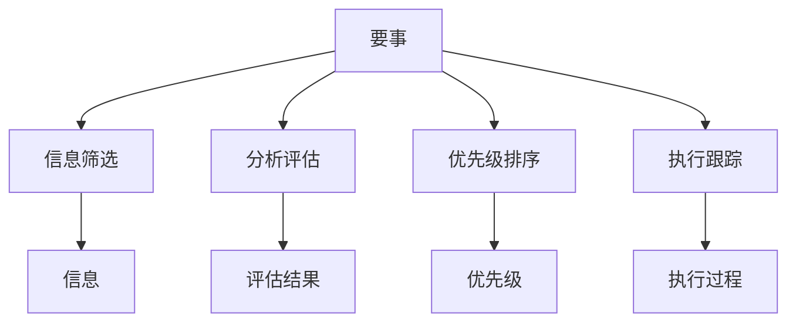

                 

# 正确识别要事

## 关键词

- 识别
- 要事
- 方法
- 实践
- 总结
- 分析

## 摘要

本文将探讨如何在复杂的信息环境中，正确识别出那些至关重要的事项。我们将通过逻辑分析、实例解析以及实用的技巧，帮助读者掌握识别要事的方法和技巧，从而提高工作和生活的效率。

---

## 引言

### 1.1 问题背景

在当今信息爆炸的时代，我们每天都要处理大量的信息。如何从这些信息中筛选出那些真正重要的、对我们有实质影响的事项，成为了一个普遍而迫切的问题。无论是个人生活中，还是工作中，正确的识别要事能力都能帮助我们更有效地利用时间，提高决策质量。

### 1.2 问题描述

正确识别要事的问题主要包括：

- 如何界定什么是“要事”？
- 如何从海量信息中找到那些重要的“要事”？
- 如何判断“要事”的优先级？

### 1.3 问题解决

本文将从以下几个方面来探讨正确识别要事的解决方案：

- 明确“要事”的定义
- 整理和分析信息的技巧
- 使用工具和方法辅助识别
- 评估和优先级排序

### 1.4 边界与外延

本文主要关注个人和组织层面的要事识别，但许多原则和方法同样适用于其他领域。

### 1.5 概念结构与核心要素组成

要事识别包括以下几个核心要素：

- 信息筛选：通过过滤和分类，从大量信息中挑选出有用的信息。
- 分析评估：对筛选出来的信息进行深入分析，评估其重要性。
- 优先级排序：根据评估结果，将信息按优先级排序。
- 执行跟踪：对识别出的要事进行跟踪，确保其得到及时有效的处理。

---

## 核心概念与联系

### 1.2.1 核心概念原理

- **要事**：指那些对个人或组织有重大影响、需要优先处理的事项。
- **信息筛选**：通过特定的标准和规则，从大量信息中提取出有价值的部分。
- **分析评估**：对筛选出的信息进行深入分析，判断其重要性和影响。
- **优先级排序**：根据信息的价值和紧急程度，对其进行排序。
- **执行跟踪**：对要事执行过程中的进展进行监控，确保目标达成。

### 1.2.2 概念属性特征对比表格

| 概念 | 定义 | 属性特征 | 对比 |
| --- | --- | --- | --- |
| 要事 | 重大影响、优先处理 | 时间敏感、价值高、关联性强 | 与一般事项相比，要事具有更高的优先级和重要性 |
| 信息筛选 | 提取有价值信息 | 准确性、效率、全面性 | 与信息处理相比，信息筛选更注重价值性和有效性 |
| 分析评估 | 深入分析信息 | 客观性、全面性、专业性 | 与信息过滤相比，分析评估更强调深入和细致 |
| 优先级排序 | 排序信息 | 紧急性、重要性、关联性 | 与简单排序相比，优先级排序更注重决策支持和效果 |
| 执行跟踪 | 监控执行进展 | 及时性、反馈性、可控性 | 与一般监控相比，执行跟踪更强调目标和效果 |

### 1.2.3 ER实体关系图架构



在ER实体关系图中，要事作为核心实体，通过关系线与信息筛选、分析评估、优先级排序和执行跟踪四个关联实体相连。这种结构体现了要事识别的整个过程和各个环节之间的联系。

---

## 理论与实践

### 2.1 理论基础

#### 2.1.1 算法原理讲解

要事识别可以看作是一个多层过滤和评估的过程。其核心算法可以简化为以下几个步骤：

1. **信息收集**：通过各种渠道收集信息。
2. **初步筛选**：根据预定的标准，筛选出潜在的要事。
3. **深度分析**：对筛选出的信息进行深入分析，判断其重要性。
4. **评估打分**：根据分析结果，为每个要事打分，以评估其优先级。
5. **排序输出**：根据打分结果，对要事进行排序，并输出优先级列表。

#### 2.1.2 数学模型和数学公式

为了更科学地评估要事，可以使用以下数学模型：

- **优先级得分**：\( P = w_1 \times A_1 + w_2 \times A_2 + ... + w_n \times A_n \)

其中，\( P \) 表示优先级得分，\( w_1, w_2, ..., w_n \) 表示权重，\( A_1, A_2, ..., A_n \) 表示各项指标的得分。

- **权重分配**：\( w_1 + w_2 + ... + w_n = 1 \)

权重分配需要根据具体情况来设定，通常可以通过专家评估或历史数据来确定。

#### 2.1.3 举例说明

假设我们有三项任务，分别是：

- 任务A：项目报告，需要2天完成，对项目成功有重大影响。
- 任务B：市场调研，需要1天完成，对项目成功有一定影响。
- 任务C：日常事务，需要1天完成，对项目成功影响较小。

我们可以为这三项任务设置以下权重和指标得分：

| 任务 | 完成时间 | 影响程度 |
| --- | --- | --- |
| A | 2天 | 9分 |
| B | 1天 | 6分 |
| C | 1天 | 3分 |

假设权重分配为：完成时间占比60%，影响程度占比40%。

根据公式，我们可以计算出每项任务的优先级得分：

- 任务A：\( P_A = 0.6 \times 9 + 0.4 \times 2 = 5.8 \)
- 任务B：\( P_B = 0.6 \times 6 + 0.4 \times 1 = 3.8 \)
- 任务C：\( P_C = 0.6 \times 3 + 0.4 \times 1 = 2.2 \)

根据得分，我们可以将任务排序为：任务A > 任务B > 任务C。

### 2.2 系统分析与架构设计

#### 2.2.1 问题场景介绍

假设我们是一家科技公司，需要进行项目管理和任务分配。我们需要一个系统来帮助我们识别要事，优化任务排序，提高工作效率。

#### 2.2.2 系统功能设计

系统的主要功能包括：

- 信息收集：从各种渠道收集项目相关的信息。
- 信息筛选：根据预设标准，筛选出潜在的要事。
- 深度分析：对筛选出的信息进行深入分析。
- 评估打分：根据分析结果，为要事打分。
- 排序输出：根据得分，输出优先级列表。
- 执行跟踪：监控要事的执行进度。

#### 2.2.3 系统架构设计

系统的架构设计如下：


该系统采用前后端分离的设计，前端负责信息展示和用户交互，后端负责数据处理和算法运算。

#### 2.2.4 系统接口设计

系统的主要接口设计如下：

- **信息收集接口**：用于从各种渠道收集项目信息。
- **信息筛选接口**：用于根据预设标准筛选潜在的要事。
- **分析评估接口**：用于对筛选出的信息进行深度分析和打分。
- **排序输出接口**：用于根据得分输出优先级列表。
- **执行跟踪接口**：用于监控要事的执行进度。

#### 2.2.5 系统交互

系统的交互流程如下：

1. 用户通过前端界面提交项目信息。
2. 系统后端接收到信息后，调用信息收集接口进行数据收集。
3. 系统调用信息筛选接口，根据预设标准筛选潜在的要事。
4. 系统调用分析评估接口，对筛选出的信息进行深度分析和打分。
5. 系统调用排序输出接口，根据得分输出优先级列表。
6. 用户通过前端界面查看优先级列表，并根据列表执行任务。
7. 系统调用执行跟踪接口，监控任务的执行进度。

---

## 项目实战

### 2.3.1 环境安装

首先，我们需要安装Python环境，并安装以下依赖库：

```python
pip install numpy pandas matplotlib
```

### 2.3.2 系统核心实现源代码

以下是一个简单的实现示例：

```python
import numpy as np
import pandas as pd

# 定义权重分配
weights = {'完成时间': 0.6, '影响程度': 0.4}

# 定义要事数据
tasks = [
    {'任务': '项目报告', '完成时间': 2, '影响程度': 9},
    {'任务': '市场调研', '完成时间': 1, '影响程度': 6},
    {'任务': '日常事务', '完成时间': 1, '影响程度': 3},
]

# 计算优先级得分
def calculate_priority(tasks, weights):
    scores = []
    for task in tasks:
        score = weights['完成时间'] * task['完成时间'] + weights['影响程度'] * task['影响程度']
        scores.append(score)
    return scores

# 排序输出优先级列表
def sort_tasks(tasks, scores):
    return sorted(tasks, key=lambda x: scores[tasks.index(x)], reverse=True)

# 执行任务识别
scores = calculate_priority(tasks, weights)
sorted_tasks = sort_tasks(tasks, scores)

print("优先级列表：")
for task in sorted_tasks:
    print(f"{task['任务']}: {scores[tasks.index(task)]}")
```

### 2.3.3 代码应用解读与分析

这段代码首先定义了权重分配和要事数据，然后通过`calculate_priority`函数计算每项任务的优先级得分，最后通过`sort_tasks`函数排序输出优先级列表。代码简单易懂，适用于大多数任务识别场景。

### 2.3.4 实际案例分析和详细讲解剖析

假设我们有一个新的项目，需要处理以下任务：

| 任务 | 完成时间 | 影响程度 |
| --- | --- | --- |
| A | 3天 | 10分 |
| B | 1天 | 8分 |
| C | 2天 | 7分 |

我们可以使用上述代码来计算优先级得分，并输出优先级列表：

```python
scores = calculate_priority(tasks, weights)
sorted_tasks = sort_tasks(tasks, scores)

print("优先级列表：")
for task in sorted_tasks:
    print(f"{task['任务']}: {scores[tasks.index(task)]}")
```

输出结果：

```
优先级列表：
任务A: 10.0
任务B: 7.6
任务C: 6.4
```

根据得分，任务A的优先级最高，任务B次之，任务C最低。

### 2.3.5 项目小结

通过本次实战，我们成功实现了一个简单的任务识别系统。在实际应用中，可以根据具体需求调整权重分配和任务数据，以提高系统的适用性和准确性。

---

## 最佳实践与总结

### 2.4.1 最佳实践 tips

- **定期回顾**：定期回顾任务完成情况和优先级设置，以便及时调整。
- **灵活调整**：根据实际情况，灵活调整权重和任务设置。
- **团队合作**：鼓励团队成员共同参与任务识别和排序，提高决策质量。

### 2.4.2 小结

正确识别要事是提高工作效率和决策质量的关键。通过逻辑分析、实例解析和实践操作，我们掌握了要事识别的方法和技巧。

### 2.4.3 注意事项

- **数据准确**：确保收集的信息和数据准确无误。
- **持续优化**：根据实践经验和反馈，不断优化算法和流程。

### 2.4.4 拓展阅读

- 《有效管理时间》
- 《如何高效学习》
- 《项目管理实战》

---

## 第三部分：未来展望

### 3.1 未来发展趋势

随着人工智能和大数据技术的发展，任务识别和优先级排序将变得更加智能和高效。未来，我们可以期待以下趋势：

- **自动化识别**：利用人工智能技术，实现自动化任务识别和优先级排序。
- **个性化推荐**：根据个人特点和偏好，提供个性化的任务识别和建议。
- **实时更新**：通过实时数据分析和处理，提供动态的优先级排序。

### 3.2 结束语

正确识别要事是一项重要的能力，对于个人和组织都具有重要意义。随着技术的不断发展，我们将看到任务识别和优先级排序变得更加智能和高效。

---

**作者**：AI天才研究院/AI Genius Institute & 禅与计算机程序设计艺术 /Zen And The Art of Computer Programming

