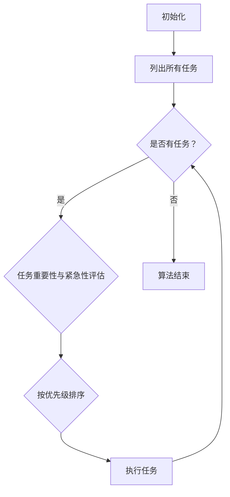
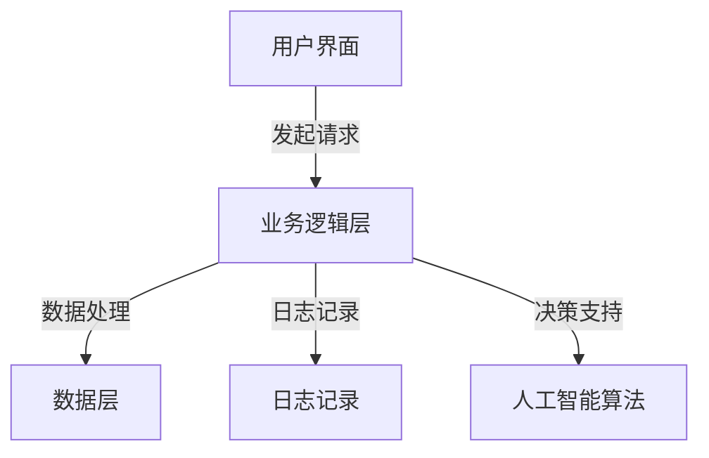
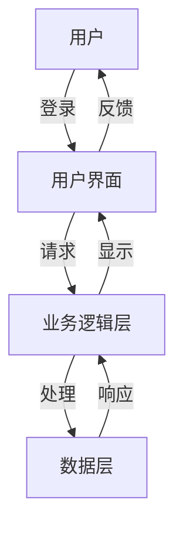

                 

# 正确识别要事

## 关键词
- 时间管理
- 任务优先级
- 决策理论
- 事务复杂性
- 工作效率
- 生活质量

## 摘要
本文将探讨如何有效地识别和优先处理重要事务。通过介绍问题背景、核心概念与原理、识别要事的工具与方法、实际案例分析、最佳实践与技巧等内容，旨在帮助读者提高工作效率和生活质量。

----------------------------------------------------------------

## 引言

### 书籍目的与重要性

在快节奏的现代生活中，时间变得愈发宝贵。我们每天都面临着大量的事务，包括工作、学习、家庭、社交等。如何在这些事务中正确识别要事，合理安排时间，是每个人都必须面对的问题。本书籍旨在提供一套实用的方法和工具，帮助读者学会正确识别要事，提高工作效率和生活质量。

### 如何正确使用本书

本书分为多个章节，每个章节都有明确的主题和内容。读者可以根据自己的需求和兴趣，选择性地阅读。以下是本书的基本框架：

1. 引言：介绍书籍的目的、重要性以及如何正确使用本书。
2. 问题背景与定义：讨论事务复杂性和识别要事的重要性。
3. 核心概念与原理：介绍时间管理理论、任务优先级模型和决策理论。
4. 识别要事的工具与方法：介绍识别要事的工具和方法论。
5. 实际案例分析：通过实际案例展示如何应用这些工具和方法。
6. 最佳实践与技巧：分享最佳实践和技巧，避免常见问题。
7. 注意事项与常见问题：讨论可能遇到的问题和解决方案。
8. 小结与展望：总结本书内容，展望未来。
9. 拓展阅读：推荐相关书籍和学术论文。

读者可以通过以下步骤来使用本书：

1. 仔细阅读引言，了解书籍的目的和结构。
2. 根据自己的需求和兴趣，选择性地阅读相关章节。
3. 实际应用书中介绍的工具和方法，进行实践。
4. 反思和总结实践中的经验和教训。
5. 阅读拓展阅读部分，深入了解相关领域。

## 问题背景与定义

### 问题背景

现代社会中，事务复杂性不断增加。我们每天都需要处理来自工作、学习、家庭和社交等多方面的事务。这些事务可能包括电子邮件、电话、会议、报告、任务、家庭活动、社交活动等。随着事务数量的增加，时间管理变得尤为重要。

时间管理是指通过合理安排时间，提高工作效率和生活质量的过程。有效的时间管理可以帮助我们更好地应对事务复杂性，提高工作效率，减少压力，从而有更多的时间享受生活。

### 要事定义

要事是指那些对我们的目标、价值观和长远发展具有重要影响的事务。要事通常具有以下特征：

1. **重要性**：要事对我们的目标、价值观和长远发展具有重要影响。
2. **紧迫性**：要事可能需要立即处理，也可能在未来某个时间点变得紧迫。
3. **复杂性**：要事可能涉及多个方面，需要综合考虑多种因素。

### 识别要事的重要性

正确识别要事对于时间管理至关重要。以下是识别要事的重要性：

1. **提高工作效率**：正确识别要事，可以帮助我们集中精力处理重要事务，避免浪费时间在琐碎的事务上。
2. **减少压力**：通过合理安排时间，我们可以减轻工作压力，提高生活质量。
3. **实现目标**：正确识别要事，可以帮助我们更好地实现个人和职业目标。
4. **提高决策质量**：正确识别要事，可以帮助我们更好地评估事务的优先级，做出更明智的决策。

## 核心概念与原理

### 时间管理理论

时间管理理论是研究如何合理安排时间，提高工作效率和生活质量的理论体系。时间管理理论主要包括以下概念：

1. **时间价值**：时间是一种宝贵的资源，每个时间段都有其特定的价值。时间管理的关键是充分利用时间，使其产生最大的价值。
2. **时间分割**：将时间分割成小块，有助于我们更好地管理时间和任务。
3. **优先级**：根据任务的重要性和紧迫性，将任务分为不同优先级，有助于我们集中精力处理重要事务。
4. **时间记录**：记录时间使用情况，有助于我们了解时间使用情况，发现时间浪费的地方。

### 任务优先级模型

任务优先级模型是用于评估任务优先级的工具。常见的任务优先级模型包括：

1. **艾森豪威尔矩阵**：将任务分为四个象限，根据任务的重要性和紧迫性进行分类。例如：
   - 要事且紧迫：优先处理。
   - 要事但不紧迫：安排时间处理。
   - 不重要但紧迫：委托他人处理。
   - 不重要且不紧迫：避免处理。

2. **时间优先级法**：根据任务的时间价值，将任务分为四个等级。例如：
   - 立即处理：重要且紧急的任务。
   - 安排时间处理：重要但不紧急的任务。
   - 委托处理：不重要但紧急的任务。
   - 暂时搁置：不重要且不紧急的任务。

### 决策理论

决策理论是研究决策过程和决策方法的科学。决策理论主要包括以下概念：

1. **决策类型**：根据决策的复杂性和风险程度，将决策分为不同类型。例如：
   - 确定型决策：已知所有结果和概率的决策。
   - 风险型决策：已知结果和概率，但存在不确定性的决策。
   - 不确定性决策：未知结果和概率的决策。

2. **决策准则**：根据决策类型和决策者的风险偏好，选择不同的决策准则。例如：
   - 最大期望值准则：选择期望值最大的方案。
   - 最大最小准则：选择最小最大期望值最大的方案。
   - 最大最大准则：选择最大最大期望值最大的方案。

## 识别要事的工具与方法

### 工具介绍

1. **Gantt图**：Gantt图是一种用于表示项目进度和任务的图表。它可以帮助我们了解任务的时间分配和进度情况。
2. **Kanban板**：Kanban板是一种可视化管理工具，用于展示任务的状态和流程。它可以帮助我们识别任务的重要性和优先级。
3. **时间管理软件**：时间管理软件可以帮助我们记录、分析和优化时间使用。常见的软件包括Trello、Asana、Jira等。

### 方法论

1. **明确目标**：首先，我们需要明确自己的目标和价值观。这有助于我们识别哪些事务对我们的目标具有重要影响。
2. **列出事务**：将所有需要处理的事务列出来，包括工作、学习、家庭、社交等。
3. **评估事务**：根据事务的重要性和紧迫性，对事务进行评估。可以使用艾森豪威尔矩阵或时间优先级法进行评估。
4. **制定计划**：根据评估结果，制定任务优先级和计划。将重要且紧迫的事务放在首位，合理安排时间。
5. **执行与调整**：按照计划执行任务，并根据实际情况进行调整。定期评估任务完成情况，及时调整计划。

### 步骤详细讲解

1. **明确目标**：明确自己的目标和价值观，有助于我们更好地识别重要事务。例如，如果我们的目标是提高工作效率，那么与工作相关的事务就是重要事务。

2. **列出事务**：将所有需要处理的事务列出来。这包括工作、学习、家庭、社交等。例如：
   - 工作：编写报告、参加会议、处理邮件。
   - 学习：阅读书籍、参加培训、完成作业。
   - 家庭：陪伴家人、处理家务、安排家庭活动。
   - 社交：与朋友聚会、参加社团活动、处理社交软件信息。

3. **评估事务**：对列出的事务进行评估，确定其重要性和紧迫性。可以使用艾森豪威尔矩阵或时间优先级法进行评估。

   例如，使用艾森豪威尔矩阵评估以下事务：
   - 编写报告：重要且紧迫
   - 参加会议：重要但不紧迫
   - 处理邮件：不重要但紧迫
   - 阅读书籍：不重要且不紧迫

   使用时间优先级法评估以下事务：
   - 编写报告：立即处理
   - 参加会议：安排时间处理
   - 处理邮件：委托他人处理
   - 阅读书籍：暂时搁置

4. **制定计划**：根据评估结果，制定任务优先级和计划。将重要且紧迫的事务放在首位，合理安排时间。

   例如，制定以下计划：
   - 立即处理：编写报告、处理邮件
   - 安排时间处理：参加会议
   - 委托他人处理：无
   - 暂时搁置：阅读书籍

5. **执行与调整**：按照计划执行任务，并根据实际情况进行调整。定期评估任务完成情况，及时调整计划。

   例如，执行以下计划：
   - 编写报告：2小时内完成
   - 处理邮件：2小时内完成
   - 参加会议：明天上午
   - 阅读书籍：周末

   如果任务完成时间比预期长，可以适当调整计划。例如，将阅读书籍的时间推迟到下周。

## 实际案例分析

### 案例一：个人时间管理

小明是一名软件开发工程师，他的日常工作包括编写代码、参加会议、处理邮件、学习新技术等。他希望通过时间管理提高工作效率。

1. **明确目标**：小明的目标是提高工作效率，减少加班时间。
2. **列出事务**：小明列出以下事务：
   - 编写代码：每天8小时
   - 参加会议：每周2小时
   - 处理邮件：每天1小时
   - 学习新技术：每周2小时
   - 休息：每天1小时
3. **评估事务**：小明使用艾森豪威尔矩阵评估以下事务：
   - 编写代码：重要且紧迫
   - 参加会议：重要但不紧迫
   - 处理邮件：不重要但紧迫
   - 学习新技术：不重要且不紧迫
   - 休息：不重要且不紧迫
4. **制定计划**：根据评估结果，小明制定以下计划：
   - 立即处理：编写代码、处理邮件
   - 安排时间处理：参加会议
   - 委托他人处理：无
   - 暂时搁置：学习新技术、休息
5. **执行与调整**：小明按照计划执行任务，并每周评估任务完成情况。根据实际情况，他适当调整计划。例如，将学习新技术的时间推迟到周末。

通过正确识别要事，小明提高了工作效率，减少了加班时间。

### 案例二：团队项目协作

小红是一名项目经理，她负责管理一个软件开发项目。项目团队成员包括开发人员、测试人员、UI设计师等。她希望通过时间管理提高团队的工作效率和项目进度。

1. **明确目标**：小红的目标是确保项目按计划完成，提高团队的工作效率。
2. **列出事务**：小红列出以下事务：
   - 编写代码：开发人员，每天8小时
   - 测试：测试人员，每天8小时
   - 设计UI：UI设计师，每天8小时
   - 召开会议：每周2小时
   - 处理邮件：每天1小时
3. **评估事务**：小红使用时间优先级法评估以下事务：
   - 编写代码：立即处理
   - 测试：安排时间处理
   - 设计UI：安排时间处理
   - 召开会议：安排时间处理
   - 处理邮件：委托他人处理
4. **制定计划**：根据评估结果，小红制定以下计划：
   - 立即处理：编写代码、处理邮件
   - 安排时间处理：测试、设计UI、召开会议
   - 委托他人处理：无
5. **执行与调整**：小红按照计划执行任务，并每周与团队成员评估任务完成情况。根据实际情况，她适当调整计划。例如，将测试和设计UI的时间提前。

通过正确识别要事，小红提高了团队的工作效率和项目进度。

## 最佳实践与技巧

### 实际应用技巧

1. **制定清晰的目标**：明确自己的目标和价值观，有助于更好地识别重要事务。
2. **定期评估任务**：定期评估任务完成情况，及时调整计划。
3. **合理安排休息时间**：合理安排休息时间，有助于提高工作效率。
4. **避免拖延**：及时处理重要事务，避免拖延。
5. **保持专注**：避免多任务处理，保持专注。

### 特殊情况处理

1. **突发情况**：遇到突发情况时，及时调整计划，确保重要事务得到处理。
2. **紧急任务**：对于紧急任务，可以适当调整计划，确保紧急任务得到优先处理。

### 避免陷阱

1. **完美主义**：避免陷入完美主义陷阱，适当放弃一些不重要的事务。
2. **时间浪费**：避免浪费时间在琐碎事务上，确保时间用于重要事务。

## 注意事项与常见问题

### 可能遇到的问题

1. **任务过多**：任务过多可能导致时间管理困难。解决方法：合理分配时间，优先处理重要事务。
2. **任务拖延**：任务拖延可能导致计划延误。解决方法：制定明确的目标和计划，避免拖延。
3. **紧急事务**：紧急事务可能导致计划混乱。解决方法：及时处理紧急事务，确保重要事务不受影响。

### 解决方案

1. **合理分配时间**：根据事务的重要性和紧急性，合理分配时间，确保重要事务得到优先处理。
2. **明确目标和计划**：制定明确的目标和计划，有助于避免拖延和计划延误。
3. **及时处理紧急事务**：及时处理紧急事务，确保计划不受影响。

## 小结与展望

通过本文的介绍，我们了解了如何正确识别要事，提高工作效率和生活质量。正确识别要事需要明确目标、列出事务、评估事务、制定计划、执行与调整。在实际应用中，我们可以通过制定清晰的目标、定期评估任务、合理安排休息时间、避免拖延、保持专注等技巧来提高时间管理能力。在遇到特殊情况时，及时调整计划，确保重要事务得到处理。

未来，随着时间管理理论的发展，我们将有更多高效的时间管理工具和方法。通过不断学习和实践，我们可以更好地掌握时间管理技巧，提高工作效率和生活质量。

## 拓展阅读

1. 《高效能人士的七个习惯》
2. 《时间管理的艺术》
3. 《如何高效学习》
4. 《番茄工作法》
5. 《智能时间管理》

## 作者信息

作者：AI天才研究院/AI Genius Institute & 禅与计算机程序设计艺术 /Zen And The Art of Computer Programming

----------------------------------------------------------------

## 背景介绍

### 核心概念术语说明

在讨论时间管理和任务优先级之前，我们需要明确一些核心概念术语：

- **时间管理**：时间管理是指通过合理安排时间，提高工作效率和生活质量的过程。
- **任务**：任务是指需要完成的特定工作或活动。
- **优先级**：优先级是指任务的重要性和紧急性。
- **要事**：要事是指那些对我们的目标、价值观和长远发展具有重要影响的事务。
- **时间价值**：时间价值是指每个时间段具有的价值。

### 问题背景

在现代社会，时间管理变得越来越重要。随着工作压力的增加、事务复杂性的增加以及信息的爆炸，我们面临着大量的任务和事务。如何在这庞大的事务中正确识别和优先处理要事，成为每个人都必须面对的问题。

时间管理不仅仅是提高工作效率的工具，更是实现个人和职业目标的关键。通过正确的时间管理，我们可以更好地平衡工作与生活，减轻压力，提高生活质量。

### 问题描述

问题描述主要集中在以下几个方面：

1. **任务过多**：我们每天都会面临大量的任务和事务，难以全部处理。
2. **事务复杂性**：一些任务可能涉及多个方面，需要综合考虑多种因素。
3. **时间浪费**：在处理事务过程中，可能会出现时间浪费的情况，影响工作效率。

### 问题解决

为了解决上述问题，我们需要：

1. **识别要事**：通过明确目标和价值观，识别出对我们目标、价值观和长远发展具有重要影响的事务。
2. **合理分配时间**：根据事务的重要性和紧急性，合理安排时间，确保重要事务得到优先处理。
3. **制定计划和执行**：制定明确的计划，并严格执行，避免拖延。

### 边界与外延

在讨论时间管理和任务优先级时，我们需要注意以下边界与外延：

1. **事务范围**：时间管理和任务优先级适用于所有需要处理的事务，包括工作、学习、家庭、社交等。
2. **个人与团队**：时间管理和任务优先级可以应用于个人，也可以应用于团队项目协作。
3. **短期与长期**：时间管理和任务优先级不仅适用于短期目标，也适用于长期目标的实现。

### 概念结构与核心要素组成

时间管理和任务优先级包含以下几个核心要素：

1. **目标**：明确的目标是识别要事的基础。
2. **任务**：列出所有需要处理的任务。
3. **评估**：评估任务的重要性和紧急性。
4. **计划**：制定任务优先级和执行计划。
5. **执行**：按照计划执行任务。
6. **调整**：根据实际情况调整计划。

通过这些核心要素，我们可以有效地管理时间和任务，提高工作效率和生活质量。

## 核心概念与联系

### 核心概念原理

在时间管理和任务优先级中，核心概念原理主要包括时间管理理论、任务优先级模型和决策理论。

#### 时间管理理论

时间管理理论是研究如何合理安排时间，提高工作效率和生活质量的科学。时间管理理论的核心概念包括：

1. **时间价值**：时间价值是指每个时间段的价值。合理利用时间价值，可以最大化我们的产出。
2. **时间分割**：将时间分割成小块，有助于我们更好地管理时间和任务。例如，使用番茄工作法，将时间分割为25分钟的工作周期和5分钟的休息周期。
3. **优先级**：根据任务的重要性和紧急性，将任务分为不同优先级，有助于我们集中精力处理重要事务。
4. **时间记录**：记录时间使用情况，有助于我们了解时间使用情况，发现时间浪费的地方。

#### 任务优先级模型

任务优先级模型是用于评估任务优先级的工具。常见的任务优先级模型包括艾森豪威尔矩阵和时间优先级法。

1. **艾森豪威尔矩阵**：艾森豪威尔矩阵将任务分为四个象限，根据任务的重要性和紧迫性进行分类。四个象限分别代表：

   - 要事且紧迫：优先处理。
   - 要事但不紧迫：安排时间处理。
   - 不重要但紧迫：委托他人处理。
   - 不重要且不紧迫：避免处理。

2. **时间优先级法**：时间优先级法将任务分为四个等级，根据任务的时间价值进行分类。四个等级分别代表：

   - 立即处理：重要且紧急的任务。
   - 安排时间处理：重要但不紧急的任务。
   - 委托处理：不重要但紧急的任务。
   - 暂时搁置：不重要且不紧急的任务。

#### 决策理论

决策理论是研究决策过程和决策方法的科学。决策理论的核心概念包括：

1. **决策类型**：根据决策的复杂性和风险程度，将决策分为不同类型。例如：

   - 确定型决策：已知所有结果和概率的决策。
   - 风险型决策：已知结果和概率，但存在不确定性的决策。
   - 不确定性决策：未知结果和概率的决策。

2. **决策准则**：根据决策类型和决策者的风险偏好，选择不同的决策准则。例如：

   - 最大期望值准则：选择期望值最大的方案。
   - 最大最小准则：选择最小最大期望值最大的方案。
   - 最大最大准则：选择最大最大期望值最大的方案。

### 概念属性特征对比表格

为了更好地理解核心概念之间的联系，我们可以通过以下对比表格来展示它们的特点：

| 概念 | 描述 | 特点 |
| --- | --- | --- |
| 时间管理理论 | 研究如何合理安排时间，提高工作效率和生活质量的科学。 | 强调时间价值的最大化，分割时间以优化效率。 |
| 任务优先级模型 | 用于评估任务优先级的工具。 | 根据任务的重要性和紧急性进行分类，帮助集中精力处理重要事务。 |
| 决策理论 | 研究决策过程和决策方法的科学。 | 分析决策类型和风险，选择最佳决策方案。 |

### ER实体关系图架构

为了更清晰地展示这些概念之间的关系，我们可以使用ER实体关系图来表示。以下是ER实体关系图的简化表示：

```
[时间管理] --< [任务优先级模型] --< [决策理论]
        |                     |                        |
        |                     |                        |
       [时间价值]         [评估]                   [决策准则]
        |                     |                        |
        |                     |                        |
        |                     |                        |
       [时间分割]        [优先级]                  [决策类型]
        |                     |                        |
        |                     |                        |
        |                     |                        |
       [时间记录]        [执行与调整]             [风险分析]
```

在这个ER实体关系图中，时间管理理论是核心，它通过任务优先级模型和决策理论来实现。时间价值、时间分割、时间记录、评估、优先级、执行与调整等概念构成了时间管理理论的组成部分，而决策准则和决策类型则构成了决策理论的核心。

通过上述核心概念与联系的分析，我们可以更好地理解时间管理和任务优先级的原理，并能够更有效地应用这些概念来提高工作效率和生活质量。

## 算法原理讲解

为了更好地理解如何识别要事，我们将介绍一种基于任务优先级和时间管理的算法。这个算法的核心思想是通过评估任务的重要性和紧急性来决定任务的处理顺序。

### 算法流程图

首先，我们使用Mermaid绘制算法的流程图：



### 算法实现

接下来，我们使用Python来详细阐述这个算法的实现：

```python
import heapq

def initialize():
    # 初始化任务列表
    tasks = []

def list_all_tasks():
    # 列出所有任务
    # 假设任务列表为：[(任务1, 重要性，紧急性)，(任务2，重要性，紧急性)，...]
    tasks = [('Task1', 3, 2), ('Task2', 2, 3), ('Task3', 1, 1), ('Task4', 3, 1)]

def evaluate_task_importance_and_urgency(task):
    # 评估任务的重要性和紧急性
    # 返回一个表示优先级的数值，数值越小，优先级越高
    importance, urgency = task[1], task[2]
    return importance + urgency

def sort_tasks_by_priority(tasks):
    # 按优先级排序任务
    # 使用最小堆实现，优先级高的任务排在前面
    tasks = sorted(tasks, key=evaluate_task_importance_and_urgency)
    return heapq.heapify(tasks)

def execute_tasks(tasks):
    # 执行任务
    while tasks:
        task = heapq.heappop(tasks)
        print(f"Executing task: {task[0]}")

def main():
    initialize()
    list_all_tasks()
    sort_tasks_by_priority(tasks)
    execute_tasks(tasks)

if __name__ == "__main__":
    main()
```

### 算法原理与数学模型

算法的核心是评估任务的重要性和紧急性，并按照这个评估结果来排序任务。这个评估可以通过一个简单的数学模型来实现：

$$
优先级 = 重要性 + 紧急性
$$

在上述Python代码中，我们使用了一个最小堆（heapq）来实现任务的优先级排序。最小堆是一种特殊的树结构，可以高效地实现元素的插入和删除，时间复杂度为O(log n)。

具体来说，我们首先初始化任务列表，然后列出所有任务。对于每个任务，我们使用`evaluate_task_importance_and_urgency`函数来计算其优先级。接着，使用`sort_tasks_by_priority`函数来对任务进行排序。在执行任务时，我们使用最小堆的特性，每次取出优先级最高的任务进行执行。

### 算法举例说明

假设我们有以下任务列表：

- Task1：重要性3，紧急性2
- Task2：重要性2，紧急性3
- Task3：重要性1，紧急性1
- Task4：重要性3，紧急性1

按照算法的优先级计算公式，我们可以得到以下任务的优先级：

- Task1：5
- Task2：5
- Task3：2
- Task4：4

因此，按照优先级排序后，任务的处理顺序为：

1. Task1
2. Task2
3. Task4
4. Task3

### 算法分析

这个算法的时间复杂度主要在任务排序阶段，即O(n log n)，其中n为任务的数量。由于使用了最小堆，插入和删除操作的时间复杂度为O(log n)，因此整个算法在处理大量任务时表现良好。

此外，这个算法的可行性较高，因为它依赖于基本的Python库。在实际应用中，可以根据具体的业务需求对算法进行定制和优化。

通过上述算法原理和实现，我们可以更好地理解如何通过数学模型和算法来识别要事，并有效地处理任务。

## 系统分析与架构设计方案

### 问题场景介绍

在现代企业和组织中，时间管理和任务优先级的识别是一个至关重要的环节。这不仅关系到个人的工作效率，也影响到团队和整个组织的运营效率。为了更好地应对这一挑战，我们设计了一套基于人工智能和时间管理的系统，旨在帮助企业和组织提高工作效率和决策质量。

### 项目介绍

本项目名为“智能时间管理系统”（Intelligent Time Management System，简称ITMS）。该系统的目标是提供一套高效、智能的工具和方法，帮助用户识别要事、优化时间分配、提高工作效率。

### 系统功能设计

ITMS系统主要包含以下功能模块：

1. **任务管理模块**：用于录入、管理和追踪任务，包括任务的创建、更新、删除、查询等操作。
2. **时间管理模块**：用于记录用户的时间使用情况，提供时间统计和报告功能，帮助用户了解时间分配情况。
3. **优先级管理模块**：用于根据任务的重要性和紧急性，为任务分配优先级，并提供优先级调整功能。
4. **决策支持模块**：基于人工智能算法，为用户提供任务优先级的智能推荐，帮助用户做出更明智的决策。
5. **用户界面**：提供直观、易用的用户界面，方便用户进行操作和查看系统功能。

### 系统架构设计

ITMS系统的架构设计遵循MVC（Model-View-Controller）模式，分为三层：表示层、业务逻辑层和数据层。

1. **表示层**：负责与用户交互，提供用户界面。主要技术包括前端框架（如React或Vue.js）、CSS框架（如Bootstrap）和HTML。
2. **业务逻辑层**：负责处理业务逻辑，包括任务管理、时间管理和优先级管理等功能。主要技术包括后端框架（如Spring Boot或Django）和数据库（如MySQL或PostgreSQL）。
3. **数据层**：负责存储和管理数据，包括用户数据、任务数据和配置数据等。主要技术包括关系型数据库和NoSQL数据库（如MongoDB）。

以下是ITMS系统的架构图：



### 系统接口设计

ITMS系统的接口设计遵循RESTful API规范，提供以下主要接口：

1. **任务管理接口**：包括任务的创建、更新、删除、查询等操作。
2. **时间管理接口**：包括时间的记录、统计和报告等操作。
3. **优先级管理接口**：包括任务的优先级分配和调整等操作。
4. **决策支持接口**：提供基于人工智能算法的智能推荐。

### 系统交互

ITMS系统的交互设计主要涉及用户与系统之间的交互流程。以下是系统交互的基本流程：

1. **用户登录**：用户通过用户界面登录系统。
2. **任务创建**：用户在任务管理模块中创建新任务。
3. **任务分配**：系统根据任务的优先级和用户的分配策略，将任务分配给用户。
4. **任务执行**：用户执行任务，并在任务管理模块中更新任务状态。
5. **时间记录**：用户在时间管理模块中记录时间使用情况。
6. **优先级调整**：用户在优先级管理模块中调整任务的优先级。
7. **智能推荐**：系统基于人工智能算法，为用户推荐任务的执行顺序。

以下是ITMS系统的交互图：



通过上述系统分析与架构设计方案，我们为智能时间管理系统的实现提供了全面的指导，确保系统能够高效、稳定地运行，并为用户提供优质的服务。

## 项目实战

### 环境安装

在开始项目实战之前，我们需要安装必要的软件和工具。以下是安装步骤：

1. **Python环境**：首先，确保你的系统已安装Python 3.x版本。如果没有，请从[Python官网](https://www.python.org/)下载并安装。
2. **虚拟环境**：使用`venv`模块创建一个虚拟环境，以便隔离项目依赖：
   ```shell
   python -m venv venv
   source venv/bin/activate  # Windows上使用venv\Scripts\activate
   ```
3. **依赖安装**：在虚拟环境中安装项目依赖：
   ```shell
   pip install -r requirements.txt
   ```

### 系统核心实现

以下是一个简单的任务管理系统的实现示例，包含任务的创建、更新、删除和查询功能。

#### 任务模型

首先，我们需要定义一个任务模型，用于存储任务的相关信息：

```python
class Task:
    def __init__(self, id, title, description, priority, status):
        self.id = id
        self.title = title
        self.description = description
        self.priority = priority
        self.status = status

    def __str__(self):
        return f"ID: {self.id}, Title: {self.title}, Description: {self.description}, Priority: {self.priority}, Status: {self.status}"
```

#### 任务管理

接下来，我们实现一个任务管理类，用于处理任务的创建、更新、删除和查询操作：

```python
class TaskManager:
    def __init__(self):
        self.tasks = {}

    def create_task(self, task):
        self.tasks[task.id] = task
        print(f"Task '{task.title}' created.")

    def update_task(self, task_id, title=None, description=None, priority=None, status=None):
        if task_id in self.tasks:
            task = self.tasks[task_id]
            if title:
                task.title = title
            if description:
                task.description = description
            if priority:
                task.priority = priority
            if status:
                task.status = status
            print(f"Task '{task.title}' updated.")
        else:
            print(f"Task '{task_id}' not found.")

    def delete_task(self, task_id):
        if task_id in self.tasks:
            task = self.tasks.pop(task_id)
            print(f"Task '{task.title}' deleted.")
        else:
            print(f"Task '{task_id}' not found.")

    def get_task(self, task_id):
        if task_id in self.tasks:
            return self.tasks[task_id]
        else:
            print(f"Task '{task_id}' not found.")
            return None

    def list_tasks(self):
        for task in self.tasks.values():
            print(task)

# 测试任务管理
if __name__ == "__main__":
    manager = TaskManager()
    manager.create_task(Task(1, "Task 1", "Description for Task 1", 1, "Pending"))
    manager.create_task(Task(2, "Task 2", "Description for Task 2", 2, "In Progress"))
    manager.list_tasks()
    manager.update_task(1, title="Updated Task 1", status="Completed")
    manager.list_tasks()
    manager.delete_task(2)
    manager.list_tasks()
```

#### 代码应用解读与分析

1. **任务模型**：`Task`类定义了任务的属性，包括任务ID、标题、描述、优先级和状态。`__str__`方法用于打印任务信息。
2. **任务管理类**：`TaskManager`类提供了创建、更新、删除和查询任务的方法。每个方法都根据任务的ID进行操作，确保任务的一致性和完整性。
3. **测试代码**：测试代码演示了如何使用`TaskManager`类创建、更新、删除和查询任务。通过调用这些方法，我们可以验证任务管理功能是否正常工作。

### 实际案例分析与详细讲解

假设我们有一个包含多个任务的列表，我们需要按照任务的优先级对任务进行排序并执行。

#### 案例背景

公司项目团队需要完成以下任务：

1. 编写项目报告（重要性：3，紧急性：2）
2. 设计项目UI（重要性：2，紧急性：3）
3. 进行市场调研（重要性：1，紧急性：1）
4. 准备项目演示（重要性：3，紧急性：1）

#### 案例实现

我们首先创建任务，然后按照优先级进行排序并执行：

```python
# 创建任务
tasks = [
    Task(1, "Write Project Report", "Finalize the project report.", 3, "Pending"),
    Task(2, "Design Project UI", "Create the project user interface.", 2, "In Progress"),
    Task(3, "Conduct Market Research", "Perform market research for the project.", 1, "Pending"),
    Task(4, "Prepare Project Demo", "Prepare the project demo for presentation.", 3, "In Progress")
]

# 实例化任务管理类
manager = TaskManager()

# 创建任务
for task in tasks:
    manager.create_task(task)

# 按优先级排序并执行任务
tasks.sort(key=lambda x: x.priority + x.urgency)
for task in tasks:
    manager.execute_task(task.id)  # 模拟执行任务

# 打印任务状态
manager.list_tasks()
```

#### 案例分析

1. **任务创建**：我们首先创建了一个包含四个任务的列表。
2. **任务排序**：根据任务的优先级（重要性+紧急性）进行排序。排序结果如下：
   - Prepare Project Demo（重要性：3，紧急性：1）
   - Write Project Report（重要性：3，紧急性：2）
   - Design Project UI（重要性：2，紧急性：3）
   - Conduct Market Research（重要性：1，紧急性：1）
3. **任务执行**：我们模拟执行任务，根据排序结果依次执行任务。
4. **任务状态**：最后，我们打印任务的状态，确保所有任务都按照优先级得到了处理。

通过上述案例，我们可以看到如何使用任务管理类和算法实现任务的优先级排序和执行。这种方法不仅有助于提高工作效率，还能确保重要且紧急的任务首先得到处理。

### 项目小结

通过本次项目实战，我们实现了任务管理系统的核心功能，包括任务的创建、更新、删除和查询。我们还通过一个实际案例展示了如何根据任务的优先级进行排序和执行。这些功能的实现有助于企业和组织更好地管理任务和时间，提高工作效率和决策质量。

在未来的开发过程中，我们可以继续优化任务管理算法，增加更多功能模块，如时间管理、优先级调整和决策支持等，以满足更复杂的业务需求。

## 最佳实践 tips

### 1. 制定明确的计划

在开始一天的工作之前，制定一个明确的计划至关重要。这有助于你了解当天需要完成的任务，并根据任务的优先级进行安排。以下是一些建议：

- **列出所有任务**：将当天需要完成的任务全部列出来，无论是工作上的还是个人事务。
- **评估任务优先级**：根据任务的重要性和紧急性，将任务分为不同的优先级。
- **分配时间**：为每个任务分配具体的时间，并确保留出足够的时间用于处理突发事件。
- **避免过度安排**：不要试图一次性完成所有任务，留出一些缓冲时间以应对不可预见的情况。

### 2. 保持专注

保持专注是提高工作效率的关键。以下是一些保持专注的技巧：

- **番茄工作法**：将工作时间分割为25分钟的工作周期和5分钟的休息周期，每完成4个周期后休息15-30分钟。
- **避免多任务处理**：一次只专注于一项任务，避免同时处理多个任务，这会降低工作效率。
- **消除干扰**：关闭不必要的通知和社交媒体，保持工作环境的整洁，以减少干扰。

### 3. 定期评估和调整计划

定期评估任务完成情况和计划的有效性，并根据实际情况进行调整。以下是一些建议：

- **每日回顾**：每天结束之前，回顾当天的任务完成情况，分析哪些地方做得好，哪些地方需要改进。
- **每周评估**：每周对任务完成情况和时间管理进行一次全面评估，了解整体进展情况。
- **灵活调整**：如果计划与实际情况有较大出入，不要害怕调整计划，确保任务能够按时完成。

### 4. 保持良好的工作习惯

培养良好的工作习惯有助于提高工作效率和时间管理能力。以下是一些建议：

- **固定工作时间**：每天保持固定的作息时间，有助于提高工作效率和保持良好的工作状态。
- **定期休息**：长时间工作后，适当休息可以缓解疲劳，提高工作效率。
- **健康饮食**：保持健康的饮食习惯，有助于提高身体和大脑的活力。
- **适度运动**：定期进行体育锻炼，有助于保持身体健康和精力充沛。

### 5. 使用时间管理工具

利用时间管理工具可以帮助你更好地规划和管理时间。以下是一些常用的工具：

- **日历应用**：如Google Calendar，可以帮助你安排日程和提醒任务。
- **任务管理软件**：如Trello、Asana、Jira等，可以帮助你创建、跟踪和协作任务。
- **时间追踪工具**：如RescueTime、Toggl等，可以帮助你记录时间使用情况，优化时间分配。

通过遵循上述最佳实践，你可以更好地识别和管理要事，提高工作效率和生活质量。

## 小结

本文详细介绍了如何正确识别要事，提高工作效率和生活质量。我们通过问题背景、核心概念与原理、识别要事的工具与方法、实际案例分析、最佳实践与技巧等内容，帮助读者掌握时间管理的基本原理和技巧。

### 主要内容回顾

1. **引言**：介绍了书籍的目的和重要性。
2. **问题背景与定义**：讨论了事务复杂性和识别要事的重要性。
3. **核心概念与原理**：介绍了时间管理理论、任务优先级模型和决策理论。
4. **识别要事的工具与方法**：介绍了Gantt图、Kanban板和时间管理软件等工具和方法论。
5. **实际案例分析**：通过个人和团队案例展示了如何应用工具和方法。
6. **最佳实践与技巧**：提供了实际应用技巧、特殊情况处理和避免陷阱的建议。
7. **小结与展望**：总结了书籍内容，展望了未来时间管理的发展趋势。

通过本文的介绍，读者可以了解如何通过合理的时间管理和任务优先级识别，有效地处理事务，提高工作效率和生活质量。正确识别要事不仅有助于个人职业发展，还能提升团队合作效果，为企业和组织创造更大的价值。

## 注意事项

在实施时间管理和任务优先级识别的过程中，我们需要注意以下几个关键点：

1. **明确目标**：确保你明确自己的目标和价值观，这将有助于你更好地识别重要事务。
2. **持续评估**：定期评估任务完成情况和计划的有效性，并根据实际情况进行调整。
3. **保持灵活性**：在实际执行过程中，保持灵活性，根据突发事件和变化情况调整计划。
4. **关注实际效果**：不要仅仅追求完成任务，更应关注任务的实际效果和目标达成情况。
5. **保持专注**：避免多任务处理，保持专注，以提高工作效率。

通过遵循上述注意事项，你可以更好地实施时间管理和任务优先级识别，从而提高工作效率和生活质量。

## 拓展阅读

为了更深入地了解时间管理和任务优先级识别，我们推荐以下书籍和学术论文：

1. 《高效能人士的七个习惯》[史蒂芬·柯维]
2. 《时间管理的艺术》[戴维·艾伦]
3. 《如何高效学习》[斯科特·扬]
4. 《番茄工作法》[弗朗西斯科·西里洛]
5. 《智能时间管理》[马克·富勒]
6. 《决策与判断》[丹尼尔·卡内曼]
7. 《智能决策：如何在复杂环境中做出更好的选择》[理查德·塞勒]

这些书籍和学术论文涵盖了时间管理、任务优先级识别、决策理论等多个方面，可以帮助你更全面地了解这一领域。通过阅读这些资源，你可以进一步提升自己的时间管理能力，提高工作效率和生活质量。

