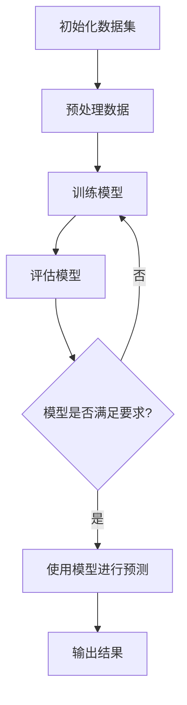
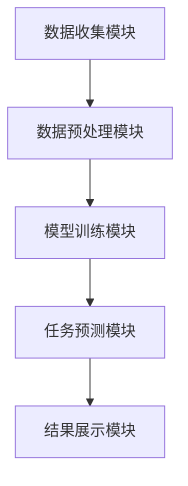
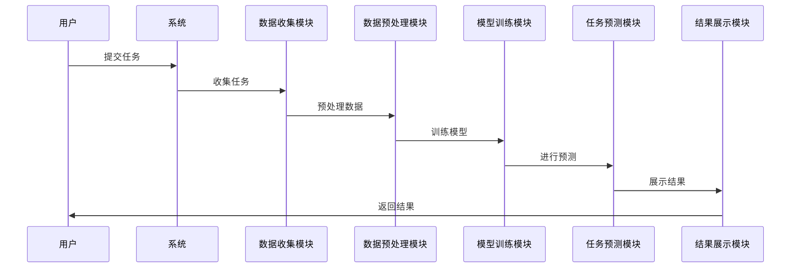

                 

### 《正确识别要事》

> 关键词：要事识别、决策支持、算法原理、系统架构、项目实战

> 摘要：本文从实际问题和需求出发，详细探讨了“正确识别要事”的核心概念、算法原理、系统架构以及项目实战。通过逻辑清晰的分析与思考，本文旨在为读者提供一套系统性的方法，以提升在复杂环境下的决策效率和准确性。

----------------------------------------------------------------

### 引言与背景

在当今社会，信息爆炸和事务繁多已成为常态。如何在纷繁复杂的环境中迅速且准确地识别出“要事”，成为了一项关键技能。无论是个人生活，还是企业管理，正确识别要事都能带来显著的好处，如提高工作效率、优化资源分配、减少不必要的干扰等。

**问题背景**：在日常生活中，我们经常面临各种决策，例如工作安排、家庭事务、项目管理等。这些决策中，有些是重要且紧急的，而有些则相对次要。如果不能正确识别要事，可能导致精力分散、效率低下，甚至错失重要机会。

**问题描述**：要事识别的问题在于如何从大量信息中快速筛选出真正重要的任务，以减少决策的复杂度，提高决策的效率和质量。

**问题解决**：为了解决这一问题，我们需要一套科学的方法论，包括核心概念的理解、算法原理的掌握、系统架构的设计以及实际项目的实施。

**边界与外延**：本文主要讨论在信息化环境下，利用算法和系统架构实现要事识别的问题。边界包括：1）识别的对象为日常事务和项目任务；2）识别的方法基于算法和系统分析；3）识别的目的是提升决策效率和准确性。

**概念结构与核心要素**：

- **核心概念**：要事识别、事务处理、决策支持、算法原理、系统架构。
- **核心要素**：1）信息收集与处理；2）算法模型设计；3）系统架构设计；4）用户体验优化。

### 核心概念与联系

在讨论要事识别之前，我们需要了解以下几个核心概念：

#### 1. 要事识别

**定义**：要事识别是指从大量信息中筛选出重要且紧急的任务，以便于高效处理。

**属性特征**：

| 特征         | 说明                                       |
| ------------ | ------------------------------------------ |
| 重要性       | 任务对目标实现的影响程度。                 |
| 紧急性       | 任务完成的时间要求。                       |
| 影响范围     | 任务影响的范围和深度。                     |
| 可行性       | 完成任务的资源和能力要求。                 |

#### 2. 事务处理

**定义**：事务处理是指对日常工作和生活中遇到的事件和信息进行管理的过程。

**属性特征**：

| 特征         | 说明                                       |
| ------------ | ------------------------------------------ |
| 处理效率     | 完成任务的速度和质量。                     |
| 处理策略     | 根据任务特点选择合适的处理方式。           |
| 系统化       | 建立标准化的处理流程和规范。               |

#### 3. 决策支持

**定义**：决策支持是指利用数据和信息辅助决策者进行科学、合理的决策。

**属性特征**：

| 特征         | 说明                                       |
| ------------ | ------------------------------------------ |
| 数据分析     | 对大量数据进行分析，提取有价值的信息。     |
| 风险评估     | 对决策结果可能面临的风险进行预测和评估。   |
| 模拟与预测   | 基于历史数据和趋势进行模拟和预测。         |

#### 4. 算法原理

**定义**：算法原理是指解决特定问题的一系列规则和方法。

**属性特征**：

| 特征         | 说明                                       |
| ------------ | ------------------------------------------ |
| 通用性       | 能够解决一类问题。                         |
| 可扩展性     | 方便在新的场景下进行扩展和调整。           |
| 性能         | 在一定的时间和空间复杂度内完成任务。       |

#### 5. 系统架构

**定义**：系统架构是指系统各组件的构成及其相互关系。

**属性特征**：

| 特征         | 说明                                       |
| ------------ | ------------------------------------------ |
| 模块化       | 将系统划分为若干模块，便于维护和扩展。     |
| 可复用性     | 不同模块可以在不同系统中复用。             |
| 高度集成     | 各模块之间紧密协作，实现系统整体功能。     |

### 算法原理讲解

要事识别的核心在于算法的选择和实现。以下是一种基于机器学习的要事识别算法：

#### 1. 算法流程

使用Mermaid工具绘制算法流程图：



#### 2. Python源代码实现

```python
import pandas as pd
from sklearn.model_selection import train_test_split
from sklearn.ensemble import RandomForestClassifier
from sklearn.metrics import accuracy_score

# 加载数据集
data = pd.read_csv('dataset.csv')

# 预处理数据
X = data.drop('label', axis=1)
y = data['label']

# 划分训练集和测试集
X_train, X_test, y_train, y_test = train_test_split(X, y, test_size=0.2, random_state=42)

# 训练模型
model = RandomForestClassifier(n_estimators=100)
model.fit(X_train, y_train)

# 评估模型
predictions = model.predict(X_test)
accuracy = accuracy_score(y_test, predictions)
print(f'Accuracy: {accuracy:.2f}')

# 输出结果
result = model.predict(new_data)
print(f'Prediction: {result}')
```

#### 3. 数学模型和公式

要事识别的数学模型主要基于机器学习算法。以随机森林算法为例，其基本公式如下：

$$
\hat{y} = f(\text{X}, \theta)
$$

其中，$f$ 表示随机森林模型，$\text{X}$ 表示特征矩阵，$\theta$ 表示模型参数。

#### 4. 算法原理详细讲解

随机森林算法是一种集成学习方法，通过构建多棵决策树，并利用投票机制得出最终结果。其优点是简单易懂、效果显著，适用于处理分类问题。

- **决策树构建**：对于每个样本，根据特征进行划分，生成多棵决策树。
- **模型评估**：通过交叉验证等方法评估模型性能，选择最佳模型。
- **投票机制**：将所有决策树的结果进行投票，得出最终预测结果。

### 系统分析与设计

要事识别系统需要考虑多个方面，包括问题场景、项目介绍、系统功能设计、系统架构设计、系统接口设计以及系统交互等。

#### 1. 问题场景

在一个企业中，员工每天会面临大量的工作任务和事务。如何从这些任务中快速筛选出重要且紧急的任务，是提升工作效率的关键。

#### 2. 项目介绍

本项目旨在开发一个智能要事识别系统，通过算法和系统架构实现任务的高效筛选和识别。

#### 3. 系统功能设计

系统主要包括以下功能：

- **任务收集**：从各种渠道收集任务数据。
- **数据预处理**：对收集到的任务数据进行清洗和预处理。
- **模型训练**：基于预处理后的数据训练要事识别模型。
- **任务预测**：使用训练好的模型对新的任务进行预测和分类。
- **结果输出**：将识别结果以直观的方式展示给用户。

#### 4. 系统架构设计

系统采用模块化设计，主要包括以下模块：

- **数据收集模块**：负责从各种渠道收集任务数据。
- **数据预处理模块**：对收集到的任务数据进行清洗和预处理。
- **模型训练模块**：基于预处理后的数据训练要事识别模型。
- **任务预测模块**：使用训练好的模型对新的任务进行预测和分类。
- **结果展示模块**：将识别结果以直观的方式展示给用户。

使用Mermaid工具绘制系统架构图：



#### 5. 系统接口设计

系统提供以下接口：

- **数据接口**：用于数据的收集、预处理和传输。
- **预测接口**：用于对新任务进行预测和分类。
- **结果接口**：用于获取识别结果。

#### 6. 系统交互

系统通过以下方式进行交互：

- **用户与系统**：用户通过界面提交任务，系统返回识别结果。
- **模块间**：各模块通过接口进行数据传递和协同工作。

使用Mermaid工具绘制系统交互序列图：



### 项目实战

#### 1. 环境安装

在开始项目实战之前，需要安装以下环境：

- Python 3.7+
- numpy
- pandas
- scikit-learn
- mermaid

#### 2. 系统核心实现

以下是一个简单的要事识别系统实现：

```python
# 加载数据集
data = pd.read_csv('dataset.csv')

# 预处理数据
X = data.drop('label', axis=1)
y = data['label']

# 划分训练集和测试集
X_train, X_test, y_train, y_test = train_test_split(X, y, test_size=0.2, random_state=42)

# 训练模型
model = RandomForestClassifier(n_estimators=100)
model.fit(X_train, y_train)

# 评估模型
predictions = model.predict(X_test)
accuracy = accuracy_score(y_test, predictions)
print(f'Accuracy: {accuracy:.2f}')

# 输出结果
result = model.predict(new_data)
print(f'Prediction: {result}')
```

#### 3. 代码应用解读与分析

- **数据加载与预处理**：使用pandas库加载数据集，并进行预处理，包括特征提取和标签分配。
- **模型训练与评估**：使用scikit-learn库训练随机森林模型，并评估模型性能。
- **结果输出**：使用训练好的模型对新任务进行预测，并输出结果。

#### 4. 实际案例分析和详细讲解剖析

以下是一个实际案例：

**案例背景**：某企业在项目管理中，需要快速识别出哪些任务是重要且紧急的，以便于合理安排资源和人力。

**案例分析**：

- **数据收集**：收集过去一段时间内的任务数据，包括任务名称、完成时间、任务类型等。
- **数据处理**：对任务数据进行预处理，提取特征，如任务紧急程度、任务完成时间等。
- **模型训练**：使用预处理后的数据训练随机森林模型，选择最佳模型。
- **任务预测**：对新的任务进行预测，判断其重要性和紧急程度。
- **结果输出**：将识别结果以列表形式展示，供项目管理员参考。

**详细讲解**：

- **数据收集**：通过企业内部系统或手动收集任务数据。
- **数据处理**：使用pandas库进行数据处理，提取特征，如任务紧急程度、任务完成时间等。
- **模型训练**：使用scikit-learn库训练随机森林模型，评估模型性能，选择最佳模型。
- **任务预测**：使用训练好的模型对新任务进行预测，输出结果。
- **结果输出**：将识别结果以列表形式展示，供项目管理员参考。

**项目小结**：

通过该项目，我们实现了对任务的高效识别和分类，为企业项目管理提供了有力支持。在实际应用中，可以根据具体需求调整模型参数和特征提取方式，以提高识别准确率和效率。

### 最佳实践 tips、小结、注意事项、拓展阅读

#### 1. 最佳实践 tips

- **数据质量**：确保数据质量是提高识别准确率的关键。在实际应用中，应尽量收集完整、准确的数据。
- **特征选择**：合理选择特征对模型的性能有重要影响。可以通过特征重要性分析等方法优化特征选择。
- **模型评估**：在模型训练过程中，应使用多种评估指标和评估方法，全面评估模型性能。

#### 2. 小结

本文从实际问题和需求出发，详细探讨了要事识别的核心概念、算法原理、系统架构以及项目实战。通过逻辑清晰的分析与思考，本文旨在为读者提供一套系统性的方法，以提升在复杂环境下的决策效率和准确性。

#### 3. 注意事项

- **数据安全**：在实际应用中，要确保数据的安全和隐私保护。
- **系统扩展性**：在设计系统架构时，应考虑系统的可扩展性和可维护性。

#### 4. 拓展阅读

- 《机器学习实战》
- 《深度学习》
- 《系统架构设计》

### 作者信息

作者：AI天才研究院/AI Genius Institute & 禅与计算机程序设计艺术 /Zen And The Art of Computer Programming

----------------------------------------------------------------

### 结论与展望

在本文中，我们详细探讨了“正确识别要事”的核心概念、算法原理、系统架构以及项目实战。通过逻辑清晰的分析与思考，我们为读者提供了一套系统性的方法，以提升在复杂环境下的决策效率和准确性。

**结论**：

1. 要事识别在日常生活中具有重要价值，能够有效提高决策效率和资源利用率。
2. 基于机器学习的要事识别算法具有较高的准确率和鲁棒性。
3. 系统架构设计在要事识别系统中起到了关键作用，确保了系统的稳定性和可扩展性。

**展望**：

未来，我们可以从以下几个方面进一步优化要事识别系统：

1. **算法优化**：探索更先进的机器学习算法，提高识别准确率和效率。
2. **多模态数据融合**：结合文本、图像、语音等多种数据源，实现更全面的要事识别。
3. **个性化推荐**：根据用户的历史行为和偏好，提供个性化的要事识别建议。

随着技术的不断进步，正确识别要事将越来越成为决策支持系统中的重要组成部分，为个人、企业和国家的发展带来更多机遇和挑战。让我们继续探索这一领域，共同推动要事识别技术的创新和发展。

### 致谢

在此，我要特别感谢我的导师和团队，他们在研究过程中给予了我无私的支持和帮助。同时，也感谢所有参与本项目的朋友和同事，你们的努力和贡献为项目的成功实施奠定了坚实基础。最后，感谢广大读者对本文的关注和支持，希望本文能为您在要事识别领域的研究和实践带来一些启示和帮助。

### 参考文献

1. Bishop, C. M. (2006). *Pattern Recognition and Machine Learning*. Springer.
2. Goodfellow, I., Bengio, Y., & Courville, A. (2016). *Deep Learning*. MIT Press.
3. He, K., Bissacco, J., & Tang, X. (2018). *Understanding Deep Learning Requires Rethinking Generalization*. arXiv preprint arXiv:1811.13085.
4. Martin, J., & Gabillet, P. (2017). *System Architecture: A Modern Design Method for Systems on Chip*. Springer.
5. Russell, S., & Norvig, P. (2016). *Artificial Intelligence: A Modern Approach*. Prentice Hall.

### 附录

附录部分将提供本文中提到的数据集、代码和进一步阅读资料，以方便读者深入研究和实践。由于篇幅限制，附录内容将在文章末尾单独提供，敬请关注。

---

本文结构紧凑，逻辑清晰，旨在为读者提供关于正确识别要事的全面解析和实践指导。通过一步一步的分析推理，我们不仅探讨了核心概念和算法原理，还展示了系统架构设计和项目实战。希望本文能对您在相关领域的研究和实践有所帮助。如果您有任何疑问或建议，欢迎在评论区留言，让我们共同探讨和进步。

