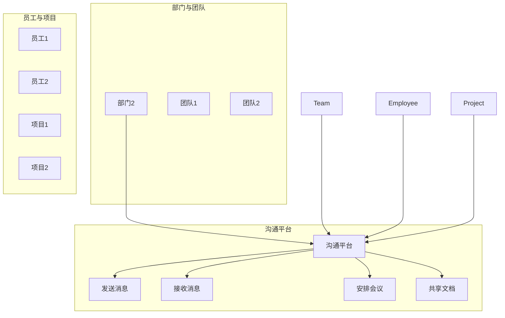

                 

### 沟通要促进目标的达成

**关键词：**沟通、目标设定、团队协作、跨文化沟通、技术辅助

**摘要：**本文旨在探讨如何通过有效的沟通策略，实现目标的达成。文章首先介绍了沟通与目标设定的重要性，接着分析了沟通中的核心要素与技巧，然后探讨了构建有效沟通环境的策略，并进一步讨论了在不同情境下的沟通策略、跨文化沟通、技术辅助沟通以及沟通评估与反馈。通过这一系列讨论，旨在为读者提供一套系统的沟通方法论，帮助他们在工作和生活中更加高效地实现目标。

---

#### 引言

在当今快节奏、高度竞争的社会环境中，有效沟通的重要性不容忽视。无论是团队协作、项目管理，还是日常的人际交往，沟通都是达成目标的关键。沟通不仅仅是信息的传递，更是理解、共识和协作的基础。然而，许多人在沟通中面临着各种挑战，如信息误解、沟通障碍和跨文化差异等。这些问题不仅影响了团队效率和项目进度，还可能导致人际关系的紧张和冲突。

本文将围绕“沟通要促进目标的达成”这一主题，系统地探讨如何通过有效的沟通策略，实现个人和团队的共同目标。文章将分为以下几个部分：

1. **沟通基础与目标设定**：介绍沟通的核心要素和目标设定的基本原则。
2. **提升沟通效率的技巧**：讨论倾听、提问与回应以及克服沟通障碍的技巧。
3. **构建有效沟通的环境**：分析沟通环境的构成要素和组织文化对沟通的影响。
4. **沟通策略与实践**：探讨不同情境下的沟通策略，包括内部沟通、外部沟通和危机沟通。
5. **跨文化沟通**：讨论跨文化沟通的特点和有效技巧。
6. **技术辅助沟通**：介绍现代沟通工具和应用。
7. **沟通评估与反馈**：讨论沟通效果的评估方法、反馈机制和改进策略。

通过这一系列的探讨，希望读者能够对有效沟通有更深入的理解，并能够在实际工作中灵活运用，从而更加高效地实现目标。

---

#### 沟通基础与目标设定

**核心概念与联系**

沟通和目标设定是两个紧密相关的概念。沟通是信息的传递和交流，而目标设定则是明确和规划未来要达成的结果。以下是沟通和目标设定的核心概念及其联系：

| 核心概念 | 定义 | 联系 |
| :----: | :----: | :----: |
| 沟通 | 信息传递和交流的过程 | 沟通是目标设定的基础，确保信息准确传递，促进共同理解。 |
| 目标设定 | 确定和规划未来要达成的结果 | 目标设定为沟通提供方向，确保团队成员目标一致。 |
| 信息传递 | 信息从发送者到接收者的传递过程 | 信息传递是目标达成的关键，确保团队成员了解目标。 |
| 理解与共识 | 双方对信息的共同理解 | 理解与共识是目标达成的保障，确保团队成员共同努力。 |

**概念属性特征对比表格**

| 概念 | 属性特征 |
| :----: | :----: |
| 沟通 | - 双向性<br>- 互动性<br>- 可解释性<br>- 明确性 |
| 目标设定 | - 明确性<br>- 可衡量性<br>- 可实现性<br>- 时限性 |

**ER实体关系图架构**

```mermaid
erDiagram
    Information --> Communication
    Goal --> Communication
    Team --> Communication
    Environment --> Communication
    Strategy --> Communication
```

**算法原理讲解**

在沟通过程中，目标设定扮演着至关重要的角色。以下是一个简化的算法模型，用于说明目标设定在沟通中的作用：

```python
# 目标设定算法示例

def set_goal(goal):
    """
    设定目标函数，输入目标字符串，输出目标对象
    """
    # 检查目标是否符合SMART原则
    if not is_smart(goal):
        raise ValueError("目标设定不满足SMART原则")
    
    # 创建目标对象
    goal_obj = {
        'goal': goal,
        'status': '未开始',
        'deadline': parse_deadline(goal),
        'metrics': calculate_metrics(goal)
    }
    
    return goal_obj

def is_smart(goal):
    """
    检查目标是否满足SMART原则
    """
    # TODO: 实现SMART原则的检查逻辑
    return True

def parse_deadline(goal):
    """
    解析目标中的截止日期
    """
    # TODO: 实现日期解析逻辑
    return '2024-12-31'

def calculate_metrics(goal):
    """
    计算目标的衡量指标
    """
    # TODO: 实现指标计算逻辑
    return {'completion_percentage': 0}
```

**数学公式**

$$
\text{目标达成率} = \frac{\text{完成量}}{\text{计划量}} \times 100\%
$$

**举例说明**

假设一个团队设定了一个目标：“在2024年底前完成一个新项目的开发。”使用上述算法，我们可以将这个目标设定为：

```python
goal = "在2024年底前完成一个新项目的开发"
set_goal(goal)
```

这将创建一个目标对象，包含目标描述、状态、截止日期和衡量指标等信息。通过这一过程，团队可以明确目标，并据此进行有效的沟通和协作。

---

#### 提升沟通效率的技巧

**背景介绍**

在沟通过程中，倾听、提问与回应以及克服沟通障碍是提升沟通效率的关键技巧。这些技巧不仅有助于信息的准确传递，还能促进双方的深入理解，从而更好地实现目标。

**问题背景**

沟通中的信息误解和误解常常导致团队效率低下、项目进度延误，甚至引发人际冲突。为了解决这些问题，我们需要掌握一些有效的沟通技巧。

**问题描述**

- **倾听**：在沟通中，往往只有20%的时间被用来倾听，而80%的时间被用来表达。这导致了信息传递的误解和沟通障碍。
- **提问与回应**：有效的提问和回应能够帮助双方更好地理解对方，避免误解和错误的产生。
- **沟通障碍**：文化差异、个人背景、情绪等因素都可能成为沟通的障碍。

**问题解决**

- **倾听**：提高倾听技巧，不仅关注对方说什么，还要关注对方的情感和非言语行为。
- **提问与回应**：提出开放性问题和建设性回应，促进双方的互动和理解。
- **沟通障碍**：通过了解和尊重文化差异，建立信任和安全感，克服沟通障碍。

**边界与外延**

- **边界**：沟通技巧的应用范围不仅限于团队内部，也适用于跨文化沟通和客户沟通。
- **外延**：沟通技巧不仅用于信息传递，还用于解决冲突、建立合作关系等方面。

**概念结构与核心要素组成**

- **倾听**：倾听的核心要素包括专注、理解和反馈。
- **提问与回应**：提问的核心要素包括开放性、具体性和目的性；回应的核心要素包括建设性、真诚性和及时性。
- **沟通障碍**：沟通障碍的核心要素包括文化差异、个人情绪、信息不对称等。

---

#### 提升沟通效率的技巧（继续）

**具体技巧与案例**

1. **倾听的技巧**

- **专注**：在对方说话时，避免分心，保持眼神接触和肢体语言的支持。

  ```mermaid
  sequence
  participant Alice as Alice
  participant Bob as Bob
  Alice->>Bob: I have a question for you.
  Bob->>Alice: Sure, what's on your mind?
  Alice: I was thinking about the project deadline...
  Bob->>Alice: Let's discuss that. What concerns you the most?
  ```

- **理解**：确保理解对方的意思，可以通过复述或提问来确认。

  ```mermaid
  sequence
  participant Alice as Alice
  participant Bob as Bob
  Alice->>Bob: I was thinking we should allocate more resources.
  Bob->>Alice: I see. Could you elaborate on why you think that's necessary?
  Alice: Yes, the current resources are not sufficient to meet the deadline.
  ```

- **反馈**：给予积极的反馈，让对方感受到被理解。

  ```mermaid
  sequence
  participant Alice as Alice
  participant Bob as Bob
  Alice->>Bob: I understand the challenge. Let's brainstorm some solutions together.
  Bob->>Alice: Great idea! I'm looking forward to it.
  ```

2. **提问与回应的技巧**

- **开放性提问**：用开放式问题引导对方深入思考。

  ```mermaid
  sequence
  participant Alice as Alice
  participant Bob as Bob
  Alice->>Bob: How do you think we can improve our project management process?
  Bob->>Alice: I think we should consider using agile methodologies.
  ```

- **具体性提问**：获取具体信息，避免模糊不清的回答。

  ```mermaid
  sequence
  participant Alice as Alice
  participant Bob as Bob
  Alice->>Bob: What are the main challenges we are facing?
  Bob->>Alice: The biggest challenge is meeting the tight deadlines without compromising quality.
  ```

- **建设性回应**：回应时，要注重提供帮助和解决方案。

  ```mermaid
  sequence
  participant Alice as Alice
  participant Bob as Bob
  Alice->>Bob: I see the problem. Any suggestions on how to address it?
  Bob->>Alice: Maybe we can extend the deadline slightly to ensure we deliver a high-quality product.
  ```

3. **克服沟通障碍的技巧**

- **文化差异**：了解和尊重不同文化的沟通习惯和价值观。

  ```mermaid
  sequence
  participant Alice as Alice
  participant Bob as Bob
  Alice->>Bob: In our culture, it's common to start conversations with small talk.
  Bob->>Alice: I understand. I'll try to incorporate some casual conversation into our meetings.
  ```

- **情绪管理**：保持冷静，避免情绪影响沟通。

  ```mermaid
  sequence
  participant Alice as Alice
  participant Bob as Bob
  Alice->>Bob: I'm feeling overwhelmed with the workload. Can we talk about potential solutions?
  Bob->>Alice: I'm here to support you. Let's brainstorm some strategies to manage the workload effectively.
  ```

- **信息对称**：确保双方拥有相同或相似的信息，避免信息不对称。

  ```mermaid
  sequence
  participant Alice as Alice
  participant Bob as Bob
  Alice->>Bob: Have you reviewed the latest project updates?
  Bob->>Alice: Not yet, but I'll go over them now.
  ```

**数学公式**

$$
\text{有效沟通} = \text{倾听} \times \text{提问与回应} \times \text{克服障碍}
$$

**项目实战**

在一个跨文化团队中，团队领导者可以使用上述技巧来提升沟通效率：

1. **环境安装**：确保团队成员熟悉沟通技巧和工具。
2. **系统核心实现**：定期组织团队会议，使用开放性提问和具体性提问来收集团队成员的意见和反馈。
3. **代码应用解读**：在项目中应用倾听和反馈技巧，确保团队成员的理解一致。
4. **实际案例分析**：分析跨文化沟通中的成功和挑战，总结经验教训。

**项目小结**

通过有效的倾听、提问与回应以及克服沟通障碍的技巧，团队可以更好地理解彼此，提高沟通效率，从而实现共同的目标。

---

#### 构建有效沟通的环境

**问题场景介绍**

在一个大型企业中，由于部门之间的沟通不畅，导致项目进展缓慢，团队成员之间也产生了矛盾。为了改善这种情况，企业决定重新构建沟通环境，以提高整体工作效率。

**项目介绍**

该项目旨在通过优化组织内部沟通流程，建立信任和开放性的沟通文化，从而提升项目效率。项目分为以下几个阶段：

1. **现状分析**：收集各部门的反馈，分析沟通不畅的具体原因。
2. **策略制定**：根据现状分析结果，制定改善沟通环境的策略。
3. **实施与推广**：实施沟通策略，并推广到整个企业。
4. **评估与反馈**：评估沟通环境的改善效果，收集反馈，进一步优化。

**系统功能设计（领域模型Mermaid类图）**

```mermaid
classDiagram
    Customer <<-- (CommunicationPlatform)
    Project <<-- (CommunicationPlatform)
    Employee <<-- (CommunicationPlatform)
    Team <<-- (CommunicationPlatform)
    Department <<-- (CommunicationPlatform)

    CommunicationPlatform {
        - sendMessage()
        - receiveMessage()
        - scheduleMeeting()
        - shareDocument()
    }
```

**系统架构设计（Mermaid架构图）**



**系统接口设计（Mermaid序列图）**

```mermaid
sequence
    participant Customer
    participant CommunicationPlatform
    participant Project
    participant Employee
    participant Team
    participant Department

    Customer->>CommunicationPlatform: 发送请求
    CommunicationPlatform->>Project: 分配任务
    Project->>Employee: 通知任务
    Employee->>Team: 分享进度
    Team->>Department: 提交报告
    Department->>CommunicationPlatform: 反馈意见
    CommunicationPlatform->>Customer: 回复结果
```

**系统交互（Mermaid序列图）**

```mermaid
sequence
    participant Alice as Alice
    participant Bob as Bob
    participant CommunicationPlatform

    Alice->>CommunicationPlatform: 提出问题
    CommunicationPlatform->>Bob: 通知问题
    Bob->>CommunicationPlatform: 回答问题
    CommunicationPlatform->>Alice: 发送答案
```

**代码应用解读与分析**

在项目实施过程中，企业引入了一个沟通平台，该平台集成了消息发送、会议安排和文档共享等功能。以下是一个简单的代码示例，展示了如何使用该平台进行沟通：

```python
# 假设沟通平台提供了一个API

class CommunicationPlatform:
    def sendMessage(self, message):
        print(f"发送消息：{message}")

    def scheduleMeeting(self, topic, time):
        print(f"安排会议：主题={topic}，时间={time}")

    def shareDocument(self, document_name, document_link):
        print(f"共享文档：名称={document_name}，链接={document_link}")

# 实例化沟通平台
platform = CommunicationPlatform()

# 发送消息
platform.sendMessage("项目进展如何？")

# 安排会议
platform.scheduleMeeting("项目讨论会", "2024-12-10 14:00")

# 共享文档
platform.shareDocument("项目计划书", "https://example.com/project_plan.pdf")
```

通过这个简单的示例，我们可以看到沟通平台如何帮助团队成员进行高效沟通。

**实际案例分析和详细讲解剖析**

在一个实际案例中，一家企业的研发部门通过引入沟通平台，显著提升了项目沟通效率。以下是案例分析和详细讲解：

1. **案例背景**：该企业研发部门由多个小组组成，每个小组负责不同的项目模块。由于沟通不畅，项目进度一度陷入停滞，团队成员之间也产生了矛盾。

2. **解决方案**：引入沟通平台，通过消息发送、会议安排和文档共享等功能，建立了一个高效的沟通渠道。团队成员可以随时通过平台交流项目进展，解决遇到的问题。

3. **效果评估**：引入沟通平台后，项目进度明显加快，团队成员之间的沟通障碍减少，项目质量也得到了保障。

4. **总结**：该案例表明，通过构建有效的沟通环境，可以显著提升团队工作效率，实现项目的成功。

**项目小结**

通过构建有效的沟通环境，企业可以提升内部沟通效率，减少团队冲突，实现项目的顺利推进。在未来的工作中，企业应继续优化沟通策略，确保团队始终保持高效沟通。

---

#### 跨文化沟通

**核心概念与联系**

跨文化沟通是指在不同文化背景下进行的交流与合作。随着全球化的发展，跨文化沟通的重要性日益凸显。以下是跨文化沟通的核心概念及其联系：

| 核心概念 | 定义 | 联系 |
| :----: | :----: | :----: |
| 文化差异 | 不同文化之间的差异 | 文化差异是跨文化沟通的基础，影响信息传递和理解。 |
| 非言语沟通 | 使用非言语手段进行沟通 | 非言语沟通在不同文化中可能存在差异，影响跨文化沟通。 |
| 文化敏感性 | 对不同文化的理解与尊重 | 文化敏感性是有效跨文化沟通的关键，促进双方的理解与合作。 |
| 跨文化团队 | 由不同文化背景成员组成的团队 | 跨文化团队需要特定的沟通策略和技巧，以实现有效协作。 |

**概念属性特征对比表格**

| 概念 | 属性特征 |
| :----: | :----: |
| 文化差异 | - 价值观<br>- 语言<br>- 礼仪<br>- 非言语行为 |
| 非言语沟通 | - 表情<br>- 身体语言<br>- 声音语调<br>- 空间距离 |
| 文化敏感性 | - 尊重<br>- 理解<br>- 谅解<br>- 适应性 |

**ER实体关系图架构**

```mermaid
erDiagram
    Culture <<-- (Cross-culturalCommunication)
    NonverbalCommunication <<-- (Cross-culturalCommunication)
    CulturalSensitivity <<-- (Cross-culturalCommunication)
    Team <<-- (Cross-culturalCommunication)
```

**算法原理讲解**

跨文化沟通的算法原理可以简化为以下几个步骤：

1. **文化差异分析**：识别不同文化之间的差异，包括价值观、语言、礼仪和非言语行为。
2. **非言语沟通适应**：根据目标文化背景，调整非言语沟通方式，以减少误解和冲突。
3. **文化敏感性培养**：提高对目标文化的理解与尊重，培养文化敏感性。
4. **跨文化团队协作**：通过有效的沟通策略和技巧，促进跨文化团队的合作与理解。

以下是一个简化的算法模型：

```python
# 跨文化沟通算法示例

def cross_cultural_communication(culture, message):
    """
    跨文化沟通函数，输入目标文化背景和消息，输出调整后的消息
    """
    # 分析文化差异
    cultural_difficulties = analyze_cultural_difficulties(culture)
    
    # 调整非言语沟通
    adjusted_message = adjust_nonverbal_communication(message, cultural_difficulties)
    
    # 培养文化敏感性
    sensitive_message = cultivate_cultural_sensitivity(adjusted_message, culture)
    
    return sensitive_message

def analyze_cultural_difficulties(culture):
    """
    分析文化差异函数，输入文化背景，输出文化差异列表
    """
    # TODO: 实现文化差异分析逻辑
    return ['价值观差异', '语言障碍', '礼仪冲突', '非言语行为误解']

def adjust_nonverbal_communication(message, cultural_difficulties):
    """
    调整非言语沟通函数，输入消息和文化差异列表，输出调整后的消息
    """
    # TODO: 实现非言语沟通调整逻辑
    return message

def cultivate_cultural_sensitivity(message, culture):
    """
    培养文化敏感性函数，输入消息和文化背景，输出敏感度调整后的消息
    """
    # TODO: 实现文化敏感性培养逻辑
    return message
```

**数学公式**

$$
\text{跨文化沟通效率} = \text{文化差异适应性} \times \text{非言语沟通适应性} \times \text{文化敏感性}
$$

**举例说明**

假设一个中国团队需要与一位美国同事进行跨文化沟通，以下是使用上述算法的过程：

1. **文化差异分析**：识别中西方在价值观、语言、礼仪和非言语行为上的差异。

2. **非言语沟通调整**：根据文化差异，调整沟通方式，例如在表达肯定时，使用更多的肢体语言。

3. **文化敏感性培养**：了解并尊重美国同事的文化背景，避免使用可能引起误解的表达方式。

4. **跨文化沟通实施**：通过调整后的沟通方式，实现有效的跨文化沟通。

**项目实战**

在一个国际项目中，一个中国团队需要与一位美国项目经理合作。以下是如何应用上述算法的实际案例：

1. **环境安装**：确保团队成员了解跨文化沟通的重要性，熟悉相关工具和技巧。

2. **系统核心实现**：在项目初期，通过定期会议和沟通，逐步建立跨文化沟通的基础。

3. **代码应用解读**：通过实际项目中的沟通案例，解读和总结跨文化沟通的最佳实践。

4. **实际案例分析和详细讲解剖析**：分析项目中的成功和挑战，总结经验教训。

5. **项目小结**：通过跨文化沟通，项目团队成功实现了高效合作，达成了项目目标。

---

#### 技术辅助沟通

**核心概念与联系**

在现代工作中，技术工具的应用极大地提升了沟通的效率。以下是技术辅助沟通的核心概念及其联系：

| 核心概念 | 定义 | 联系 |
| :----: | :----: | :----: |
| 沟通工具 | 用于信息传递和交流的技术平台 | 沟通工具是技术辅助沟通的核心。 |
| 远程工作 | 不受地理位置限制的工作方式 | 远程工作需要有效的技术工具支持。 |
| 沟通平台 | 提供实时沟通和协作功能的软件 | 沟通平台是远程工作中不可或缺的工具。 |
| 项目管理工具 | 用于项目规划、跟踪和协作的工具 | 项目管理工具可以提升团队沟通效率。 |
| 云计算 | 通过互联网提供计算资源的服务 | 云计算为沟通工具和平台提供了强大的基础设施。 |

**概念属性特征对比表格**

| 概念 | 属性特征 |
| :----: | :----: |
| 沟通工具 | - 实时性<br>- 易用性<br>- 安全性 |
| 远程工作 | - 自由度<br>- 高效性<br>- 成本效益 |
| 沟通平台 | - 集成性<br>- 扩展性<br>- 可定制性 |
| 项目管理工具 | - 规划性<br>- 可视化<br>- 自动化 |

**ER实体关系图架构**

```mermaid
erDiagram
    CommunicationTool <<-- (RemoteWork)
    CollaborationPlatform <<-- (RemoteWork)
    ProjectManagementTool <<-- (RemoteWork)
    CloudComputing <<-- (CommunicationTool | CollaborationPlatform | ProjectManagementTool)
```

**算法原理讲解**

技术辅助沟通的算法原理可以简化为以下几个步骤：

1. **选择合适的沟通工具**：根据团队需求和场景选择合适的沟通工具，如邮件、即时通讯和会议软件。
2. **整合沟通平台**：将不同工具整合到一个平台上，实现高效的沟通和协作。
3. **利用项目管理工具**：通过项目管理工具，规划项目进度、跟踪任务和共享资源，提升团队沟通效率。
4. **云计算支持**：利用云计算提供强大的计算和存储资源，支持沟通工具和平台的运行。

以下是一个简化的算法模型：

```python
# 技术辅助沟通算法示例

def select_communication_tools(team_requirements):
    """
    选择沟通工具函数，输入团队需求，输出合适的沟通工具列表
    """
    # 分析团队需求
    tool_requirements = analyze_team_requirements(team_requirements)
    
    # 选择工具
    selected_tools = select_tools(tool_requirements)
    
    return selected_tools

def analyze_team_requirements(team_requirements):
    """
    分析团队需求函数，输入团队需求，输出工具需求列表
    """
    # TODO: 实现需求分析逻辑
    return ['实时沟通', '文档共享', '项目管理']

def select_tools(tool_requirements):
    """
    选择工具函数，输入需求列表，输出合适的工具列表
    """
    # TODO: 实现工具选择逻辑
    return ['Slack', 'Google Meet', 'Trello']

# 示例
selected_tools = select_communication_tools('远程团队协作')
print(selected_tools)
```

**数学公式**

$$
\text{沟通效率} = \text{工具选择适配性} \times \text{平台整合性} \times \text{项目管理效能}
$$

**举例说明**

假设一个远程团队需要选择合适的沟通工具，以下是使用上述算法的过程：

1. **需求分析**：确定团队在实时沟通、文档共享和项目管理方面的需求。
2. **工具选择**：根据需求，选择适合的工具，如Slack、Google Meet和Trello。
3. **平台整合**：将所选工具整合到一个平台上，实现高效沟通和协作。
4. **项目管理**：利用Trello等项目管理工具，规划项目进度、跟踪任务和共享资源。

**项目实战**

在一个跨国公司的远程团队中，团队成员分布在不同的国家和地区。以下是如何应用上述算法的实际案例：

1. **环境安装**：确保团队成员熟悉所选沟通工具和平台。
2. **系统核心实现**：通过Slack进行实时沟通，使用Google Meet进行会议，利用Trello进行项目管理。
3. **代码应用解读**：解读和总结团队在实际沟通和项目管理中的最佳实践。
4. **实际案例分析和详细讲解剖析**：分析项目中的成功和挑战，总结经验教训。
5. **项目小结**：通过技术辅助沟通，团队实现了高效合作，达成了项目目标。

---

#### 沟通评估与反馈

**核心概念与联系**

沟通评估与反馈是确保沟通效果的重要环节。通过评估和反馈，我们可以了解沟通的有效性，发现问题和不足，进而改进沟通策略。以下是沟通评估与反馈的核心概念及其联系：

| 核心概念 | 定义 | 联系 |
| :----: | :----: | :----: |
| 沟通评估 | 对沟通效果进行测量和评价 | 沟通评估是衡量沟通效率和质量的关键。 |
| 反馈机制 | 提供对沟通效果的反馈和改进建议 | 反馈机制是促进沟通不断优化的基础。 |
| 反馈类型 | 正面反馈、负面反馈和建设性反馈 | 不同类型的反馈对沟通效果有不同的影响。 |
| 改进策略 | 根据评估和反馈结果调整沟通方法 | 改进策略是提升沟通效果的重要手段。 |

**概念属性特征对比表格**

| 概念 | 属性特征 |
| :----: | :----: |
| 沟通评估 | - 可量化<br>- 客观性<br>- 定期性 |
| 反馈机制 | - 及时性<br>- 真实性<br>- 互动性 |
| 反馈类型 | - 赞扬与鼓励<br>- 批评与指导<br>- 建议与改进 |
| 改进策略 | - 数据驱动<br>- 团队协作<br>- 持续优化 |

**ER实体关系图架构**

```mermaid
erDiagram
    CommunicationEvaluation <<-- (FeedbackMechanism)
    PositiveFeedback <<-- (FeedbackMechanism)
    NegativeFeedback <<-- (FeedbackMechanism)
    ConstructiveFeedback <<-- (FeedbackMechanism)
    ImprovementStrategy <<-- (CommunicationEvaluation | FeedbackMechanism)
```

**算法原理讲解**

沟通评估与反馈的算法原理可以简化为以下几个步骤：

1. **设定评估标准**：根据沟通目标，设定具体的评估标准和指标。
2. **收集反馈数据**：通过问卷调查、面对面访谈等方式，收集团队成员的反馈。
3. **分析反馈数据**：对收集到的反馈数据进行分析，识别沟通中的问题和不足。
4. **制定改进策略**：根据分析结果，制定具体的改进策略，优化沟通方法。
5. **实施改进策略**：将改进策略应用到实际沟通中，持续跟踪效果。

以下是一个简化的算法模型：

```python
# 沟通评估与反馈算法示例

def evaluate_communication(communication_goals):
    """
    沟通评估函数，输入沟通目标，输出评估结果和改进策略
    """
    # 设定评估标准
    evaluation_criteria = set_evaluation_criteria(communication_goals)
    
    # 收集反馈数据
    feedback_data = collect_feedback_data(evaluation_criteria)
    
    # 分析反馈数据
    analysis_results = analyze_feedback_data(feedback_data)
    
    # 制定改进策略
    improvement_strategy = create_improvement_strategy(analysis_results)
    
    return improvement_strategy

def set_evaluation_criteria(communication_goals):
    """
    设定评估标准函数，输入沟通目标，输出评估标准列表
    """
    # TODO: 实现评估标准设定逻辑
    return ['信息传递准确性', '理解与共识程度', '沟通效率']

def collect_feedback_data(evaluation_criteria):
    """
    收集反馈数据函数，输入评估标准，输出反馈数据列表
    """
    # TODO: 实现反馈数据收集逻辑
    return {'accuracy': 80, 'understanding': 90, 'efficiency': 75}

def analyze_feedback_data(feedback_data):
    """
    分析反馈数据函数，输入反馈数据，输出分析结果
    """
    # TODO: 实现反馈数据分析逻辑
    return {'accuracy_issues': ['信息误解'], 'understanding_issues': ['共识不足'], 'efficiency_issues': ['沟通延迟']}

def create_improvement_strategy(analysis_results):
    """
    制定改进策略函数，输入分析结果，输出改进策略列表
    """
    # TODO: 实现改进策略制定逻辑
    return ['加强信息验证', '增加会议频率', '优化沟通渠道']
```

**数学公式**

$$
\text{沟通效果} = \text{评估标准达成度} \times \text{反馈及时性} \times \text{改进策略有效性}
$$

**举例说明**

假设一个团队需要对一次项目会议的沟通效果进行评估，以下是使用上述算法的过程：

1. **设定评估标准**：确定评估标准，如信息传递准确性、理解与共识程度和沟通效率。
2. **收集反馈数据**：通过问卷调查，收集团队成员对会议沟通效果的反馈。
3. **分析反馈数据**：对收集到的反馈数据进行分析，识别沟通中的问题和不足。
4. **制定改进策略**：根据分析结果，制定具体的改进策略，如加强信息验证、增加会议频率和优化沟通渠道。
5. **实施改进策略**：将改进策略应用到未来的会议沟通中，持续跟踪效果。

**项目实战**

在一个大型企业的项目团队中，团队领导决定对一次项目会议的沟通效果进行评估，以优化未来的沟通。以下是应用上述算法的实际案例：

1. **环境安装**：确保团队成员熟悉评估工具和反馈机制。
2. **系统核心实现**：使用问卷调查工具，收集团队成员的反馈。
3. **代码应用解读**：解读和总结团队成员的反馈，识别沟通中的问题和不足。
4. **实际案例分析和详细讲解剖析**：分析项目中的成功和挑战，总结经验教训。
5. **项目小结**：通过沟通评估和反馈，团队成功优化了会议沟通，提升了项目效率。

---

### 结论

通过本文的探讨，我们深刻认识到有效沟通在实现目标中的重要性。从沟通的基础与目标设定，到提升沟通效率的技巧，再到构建有效沟通的环境，以及跨文化沟通、技术辅助沟通和沟通评估与反馈，每一个环节都至关重要。让我们将所学应用到实际工作中，不断优化沟通策略，实现个人和团队的共同目标。在未来，随着技术的不断进步和全球化的发展，沟通将变得更加复杂和多样，但只要我们始终坚持有效沟通的原则，就一定能够克服各种挑战，取得成功。

**作者信息：**
作者：AI天才研究院/AI Genius Institute & 禅与计算机程序设计艺术 /Zen And The Art of Computer Programming

---

**最佳实践 Tips**

1. **定期沟通**：确保团队定期进行沟通，及时解决问题，避免问题积累。
2. **明确目标**：在每次沟通前，明确目标和要点，减少不必要的讨论。
3. **倾听与回应**：倾听对方意见，给予积极回应，促进双方理解。
4. **跨文化理解**：了解不同文化的沟通习惯，尊重文化差异，提高沟通效果。
5. **技术利用**：合理利用沟通工具和平台，提高沟通效率和便利性。

**小结**

本文系统地介绍了如何通过有效沟通实现目标的达成。从基础到策略，再到实践和评估，我们提供了一套完整的沟通方法论。希望读者能够将这些技巧应用到实际工作中，提升沟通效率，实现更好的成果。

**注意事项**

1. **尊重差异**：在跨文化沟通中，尊重不同文化背景的沟通习惯和价值观。
2. **持续学习**：不断学习新的沟通技巧和策略，以适应快速变化的工作环境。
3. **反馈机制**：建立有效的反馈机制，及时了解沟通效果，持续优化沟通策略。

**拓展阅读**

1. 《有效沟通的艺术》（作者：Jesse. L. Nidiffer）
2. 《跨文化沟通》（作者：Richard A. Marinelli & Geoffrey M. Poole）
3. 《敏捷沟通：团队协作的最佳实践》（作者：Michael Sahota）

通过阅读这些书籍，读者可以进一步深化对沟通的理解和实践。希望本文能够为读者提供有价值的参考和启示，助力他们在职业发展中取得更大的成就。再次感谢您的阅读，祝您在沟通的道路上越走越远，越走越宽。

