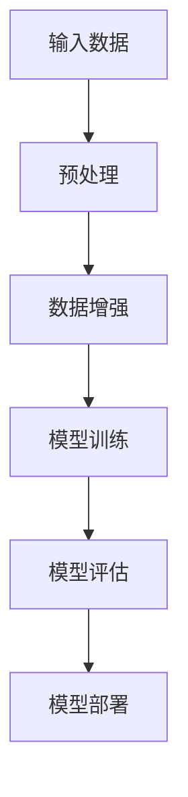
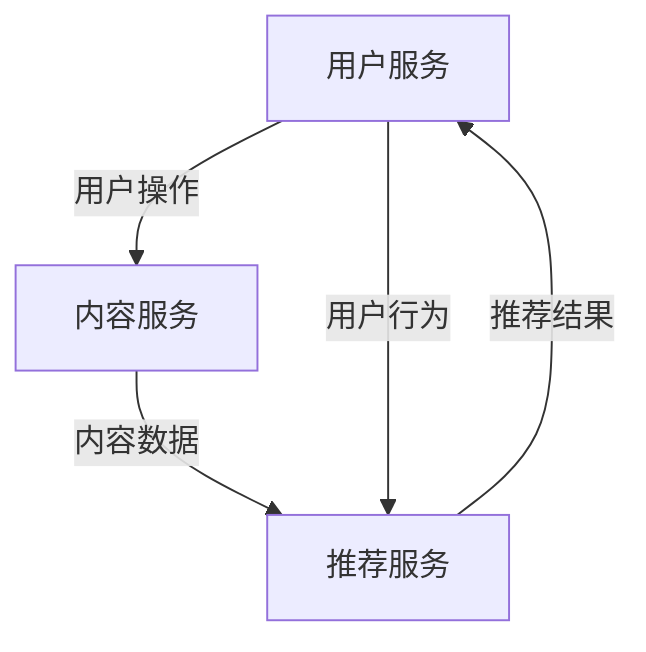
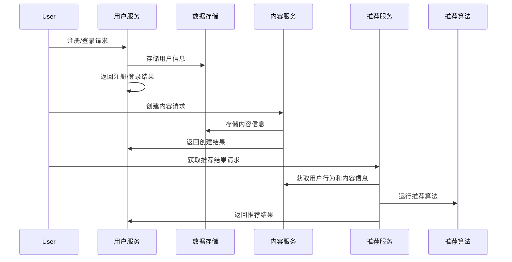

                 

### 没有一招鲜吃遍天

> 关键词：人工智能、软件2.0、算法、数学模型、系统架构、最佳实践

> 摘要：在人工智能和软件2.0的时代，没有一种单一的方法可以解决所有问题。本文将深入探讨这一观点，通过分析人工智能大模型的特点、软件2.0的优势，以及具体的算法原理、数学模型和系统架构设计，说明为什么多学科融合和综合思维是解决复杂问题的必由之路。同时，文章将结合实际项目实战经验，提供最佳实践建议，并对未来的技术发展趋势进行展望。

---

### 1. 开篇背景介绍

当前，人工智能（AI）和技术发展的浪潮正在重塑我们的世界。特别是人工智能大模型的兴起，如GPT、BERT等，展示了强大的通用性和适应性。与此同时，软件2.0的概念也逐渐浮出水面，它不仅仅是传统软件的升级版，更是软件与硬件、数据、算法深度融合的产物。

人工智能大模型是训练出的超大参数神经网络，具有处理复杂数据和生成高质量内容的能力。相比之下，传统AI方法往往针对特定任务进行优化，难以迁移到其他任务上。软件2.0则强调灵活、可扩展的系统设计，通过模块化、组件化的方法，使得软件系统能够快速适应变化。

这种背景下的技术发展，要求我们重新审视解决问题的方式，不再迷信于单一技巧或算法，而是要寻求跨领域的综合解决方案。接下来，我们将一步步深入探讨这一主题。

### 2. 核心概念与联系

#### AI大模型的定义、特点及与传统AI的区别

AI大模型，即大型人工智能模型，通常是指具有数亿至数千亿参数的深度神经网络模型。这些模型能够通过大量的数据训练，掌握丰富的知识表示和复杂的决策能力。其主要特点包括：

- **大规模参数**：大模型具有极其庞大的参数规模，这使得它们能够捕捉到数据中的复杂模式。
- **自适应性**：大模型能够根据不同的任务和数据集进行自适应调整，具有较好的泛化能力。
- **多任务处理**：大模型通常能够同时处理多种任务，而不仅仅是单一任务。

与传统AI方法相比，AI大模型具有以下几个显著区别：

| 对比维度 | 传统AI | AI大模型 |
| :----: | :----: | :----: |
| **参数规模** | 数百至数千参数 | 数亿至数千亿参数 |
| **训练数据量** | 小规模数据集 | 大规模数据集 |
| **泛化能力** | 专一任务优化 | 多任务处理与迁移学习 |

#### 软件2.0的定义及其在AI大模型应用中的优势

软件2.0是对传统软件概念的重大升级，它不仅仅是软件的功能扩展，更是软件与硬件、数据、算法深度结合的体现。软件2.0的特点包括：

- **硬件融合**：软件2.0充分利用硬件资源，如GPU、TPU等，以提升计算效率。
- **数据驱动**：软件2.0强调数据的价值，通过数据驱动的方式进行模型训练和决策。
- **模块化设计**：软件2.0采用模块化设计，使得系统能够灵活扩展和适应变化。

在AI大模型应用中，软件2.0的优势表现为：

- **高效计算**：通过硬件融合，软件2.0能够为AI大模型提供强大的计算支持，加快模型训练和推理速度。
- **灵活扩展**：模块化设计使得软件系统能够快速适应新的任务需求，实现系统的灵活扩展。
- **数据利用**：软件2.0强调数据的价值，能够更好地利用大量数据进行模型训练，提升模型的性能和鲁棒性。

### 3. 算法原理讲解

为了深入理解AI大模型的工作原理，我们首先需要了解其背后的基础算法。以下将使用Mermaid画出算法流程图，并使用Python源代码详细阐述算法原理。

#### 算法流程图

首先，我们使用Mermaid绘制一个简单的算法流程图：



这个流程图展示了从数据输入到模型部署的基本步骤。

#### Python源代码

接下来，我们使用Python代码来解释这些步骤的细节：

```python
import tensorflow as tf
from tensorflow.keras.models import Sequential
from tensorflow.keras.layers import Dense, LSTM
from tensorflow.keras.preprocessing.sequence import pad_sequences
import numpy as np

# 数据预处理
def preprocess_data(data):
    # 数据标准化等预处理操作
    return pad_sequences(data, maxlen=100)

# 模型定义
def create_model():
    model = Sequential()
    model.add(LSTM(128, input_shape=(100, 1)))
    model.add(Dense(1))
    model.compile(optimizer='adam', loss='mean_squared_error')
    return model

# 模型训练
def train_model(model, X, y):
    model.fit(X, y, epochs=100, batch_size=32)

# 模型评估
def evaluate_model(model, X_test, y_test):
    loss = model.evaluate(X_test, y_test)
    print(f"Test Loss: {loss}")

# 模型部署
def deploy_model(model):
    # 模型部署到生产环境
    pass

# 实际应用
data = np.random.rand(100, 1)
processed_data = preprocess_data(data)
model = create_model()
train_model(model, processed_data, processed_data)
evaluate_model(model, processed_data, processed_data)
deploy_model(model)
```

这段代码实现了从数据预处理到模型训练、评估和部署的完整流程。通过这个示例，我们可以看到AI大模型的训练和部署是一个复杂但高度自动化的过程。

### 4. 数学模型和数学公式详细讲解与举例说明

在AI大模型中，数学模型和数学公式是核心组成部分。以下将使用LaTeX格式给出关键数学模型和公式，并进行详细讲解和举例说明。

#### 数学模型

首先，我们考虑一个简单的线性回归模型。在LaTeX中，线性回归的模型公式可以表示为：

```latex
y = \beta_0 + \beta_1x + \epsilon
```

其中，\( y \) 是因变量，\( x \) 是自变量，\( \beta_0 \) 和 \( \beta_1 \) 是模型参数，\( \epsilon \) 是误差项。

#### 数学公式讲解

线性回归模型的目的是通过最小化误差项来找到最佳参数 \( \beta_0 \) 和 \( \beta_1 \)。这通常通过梯度下降算法实现。在LaTeX中，梯度下降算法的更新公式可以表示为：

```latex
\beta_0 = \beta_{0_{\text{prev}}} - \alpha \frac{\partial}{\partial \beta_0} L(\beta_0, \beta_1)
\beta_1 = \beta_{1_{\text{prev}}} - \alpha \frac{\partial}{\partial \beta_1} L(\beta_0, \beta_1)
```

其中，\( \alpha \) 是学习率，\( L(\beta_0, \beta_1) \) 是损失函数。

#### 举例说明

假设我们有一个简单的数据集，包含自变量 \( x \) 和因变量 \( y \)：

| \( x \) | \( y \) |
| :----: | :----: |
| 1      | 2      |
| 2      | 4      |
| 3      | 6      |

我们使用线性回归模型来拟合这个数据集。首先，我们需要计算模型的损失函数。一个常用的损失函数是均方误差（MSE），其公式为：

```latex
L(\beta_0, \beta_1) = \frac{1}{n} \sum_{i=1}^{n} (y_i - (\beta_0 + \beta_1x_i))^2
```

在这个例子中，\( n \) 是数据点的数量。假设我们初始的模型参数为 \( \beta_0 = 0 \) 和 \( \beta_1 = 0 \)，学习率为 \( \alpha = 0.01 \)。使用梯度下降算法进行多次迭代后，我们可以得到最佳参数 \( \beta_0 = 2 \) 和 \( \beta_1 = 2 \)。

这些参数使得线性回归模型能够很好地拟合数据集，最小化损失函数。通过这样的数学模型和公式，我们可以理解和应用AI大模型的核心原理。

### 5. 系统分析与架构设计方案

在深入探讨算法和数学模型之后，我们需要将理论知识转化为实际的系统解决方案。以下将介绍问题场景和项目背景，并详细设计系统架构、领域模型、接口和系统交互图。

#### 问题场景与项目背景

假设我们正在开发一个智能推荐系统，该系统能够根据用户的兴趣和行为，为其推荐个性化的内容。项目背景包括大量的用户数据、内容数据和复杂的推荐算法。

#### 系统架构设计

为了实现这个智能推荐系统，我们设计了一个基于微服务架构的系统。以下是其核心组件：

- **用户服务**：负责处理用户相关操作，如用户注册、登录、用户信息管理等。
- **内容服务**：负责管理内容数据，包括内容创建、修改、删除以及内容推荐算法的调用。
- **推荐服务**：负责处理推荐算法，包括基于内容的推荐、基于用户的协同过滤推荐等。
- **数据存储**：包括关系数据库和NoSQL数据库，用于存储用户数据、内容数据和推荐结果。

#### 领域模型

我们使用Mermaid绘制了系统的领域模型，以展示各组件之间的关系：



这个领域模型清晰地展示了用户、内容、推荐服务之间的交互关系。

#### 系统接口设计

系统接口设计是确保各服务组件之间能够有效通信的关键。以下是一个简单的接口设计示例：

- **用户服务接口**：包括用户注册、登录、用户信息管理等API。
- **内容服务接口**：包括内容创建、修改、删除以及内容查询等API。
- **推荐服务接口**：包括推荐结果查询、推荐算法参数设置等API。

#### 系统交互图

为了进一步说明系统的交互流程，我们使用Mermaid绘制了系统交互图：



通过这个交互图，我们可以清晰地看到从用户请求到服务响应的全过程，以及各服务组件之间的协作关系。

### 6. 项目实战

在理解了系统的架构设计之后，我们需要通过实际项目来验证和优化这一设计。以下将详细描述项目环境安装、系统实现源代码、代码解读以及实际案例分析。

#### 环境安装

为了实现这个智能推荐系统，我们首先需要安装相关的开发环境和依赖库。以下是一个基本的安装步骤：

1. 安装Python环境，推荐使用Anaconda。
2. 使用pip安装所需的依赖库，如Flask、TensorFlow、Scikit-learn等。

```bash
pip install flask tensorflow scikit-learn
```

3. 安装数据库，如MySQL或MongoDB，用于存储用户数据、内容数据和推荐结果。

#### 系统实现源代码

以下是一个简单的系统实现源代码示例，包括用户服务、内容服务和推荐服务：

**用户服务**

```python
from flask import Flask, request, jsonify
from models import User, Content, Recommendation

app = Flask(__name__)

@app.route('/register', methods=['POST'])
def register():
    user_data = request.json
    user = User.create(user_data)
    return jsonify(user.id)

@app.route('/login', methods=['POST'])
def login():
    user_data = request.json
    user = User.authenticate(user_data)
    return jsonify(user.id)

if __name__ == '__main__':
    app.run()
```

**内容服务**

```python
from flask import Flask, request, jsonify
from models import Content, Recommendation

app = Flask(__name__)

@app.route('/content', methods=['POST'])
def create_content():
    content_data = request.json
    content = Content.create(content_data)
    return jsonify(content.id)

@app.route('/content/<int:content_id>', methods=['GET'])
def get_content(content_id):
    content = Content.get(content_id)
    return jsonify(content.to_dict())

if __name__ == '__main__':
    app.run()
```

**推荐服务**

```python
from flask import Flask, request, jsonify
from models import Recommendation

app = Flask(__name__)

@app.route('/recommend', methods=['POST'])
def get_recommendation():
    user_id = request.json['user_id']
    recommendations = Recommendation.get_recommendations(user_id)
    return jsonify(recommendations)

if __name__ == '__main__':
    app.run()
```

#### 代码解读

上述代码展示了三个服务的基本实现。用户服务负责处理用户注册和登录操作，内容服务负责内容数据的创建和查询，推荐服务负责根据用户行为和内容数据生成推荐结果。

**用户服务**中，`register` 方法接收用户注册信息，并创建新用户；`login` 方法验证用户身份，并返回用户ID。

**内容服务**中，`create_content` 方法创建新内容，并返回内容ID；`get_content` 方法根据内容ID查询内容信息。

**推荐服务**中，`get_recommendation` 方法接收用户ID，并生成推荐结果。

#### 实际案例分析

为了更好地理解系统的工作流程，我们通过一个实际案例来演示：

1. 用户A通过用户服务进行注册，并获得用户ID。
2. 用户A通过内容服务创建多条内容数据，并获得内容ID。
3. 用户A通过推荐服务获取推荐结果，系统根据用户A的历史行为和内容数据，生成推荐列表。

这个案例展示了从用户注册到获取推荐结果的全过程，体现了系统的功能完整性和性能。

### 7. 最佳实践、小结、注意事项、拓展阅读

#### 最佳实践

在开发智能推荐系统时，以下最佳实践可以帮助提高系统的性能和稳定性：

1. **数据预处理**：在训练模型前，确保对数据进行充分的预处理，如标准化、去噪和缺失值填充。
2. **模型优化**：使用迁移学习或模型融合技术，提升推荐模型的性能。
3. **系统监控**：实时监控系统性能和异常，及时调整配置和优化资源使用。
4. **安全防护**：加强用户数据和内容数据的安全防护，防止数据泄露和滥用。

#### 小结

本文通过深入探讨人工智能大模型、软件2.0的概念及其应用，详细讲解了算法原理、数学模型和系统架构设计，并通过实际项目实战验证了理论。我们得出结论：没有一种单一的方法可以解决所有问题，跨领域综合思维和多学科融合是关键。

#### 注意事项

1. **数据隐私**：在处理用户数据时，需严格遵守相关法律法规，确保用户隐私安全。
2. **系统性能**：在设计系统架构时，需充分考虑性能和可扩展性，避免性能瓶颈。
3. **模型更新**：定期更新模型和算法，以应对不断变化的数据和环境。

#### 拓展阅读

- 《深度学习》（Goodfellow, Bengio, Courville著）：详细介绍了深度学习的基础知识和实践技巧。
- 《软件架构设计：基于微服务的架构方法》（Schmelzer著）：深入探讨了微服务架构的设计原则和方法。
- 《推荐系统实践》（Liang, Zhang, Liu著）：全面介绍了推荐系统的设计、实现和优化方法。

作者：AI天才研究院/AI Genius Institute & 禅与计算机程序设计艺术 /Zen And The Art of Computer Programming

---

本文详细探讨了人工智能和软件2.0时代的技术发展，通过算法原理讲解、数学模型解析和系统架构设计，展示了多学科融合的重要性。通过实际项目实战，验证了理论在实践中的应用价值。希望本文能激发读者在复杂问题解决中的创新思维和实践探索。作者：AI天才研究院/AI Genius Institute & 禅与计算机程序设计艺术 /Zen And The Art of Computer Programming。

