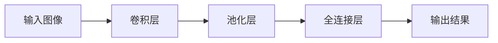
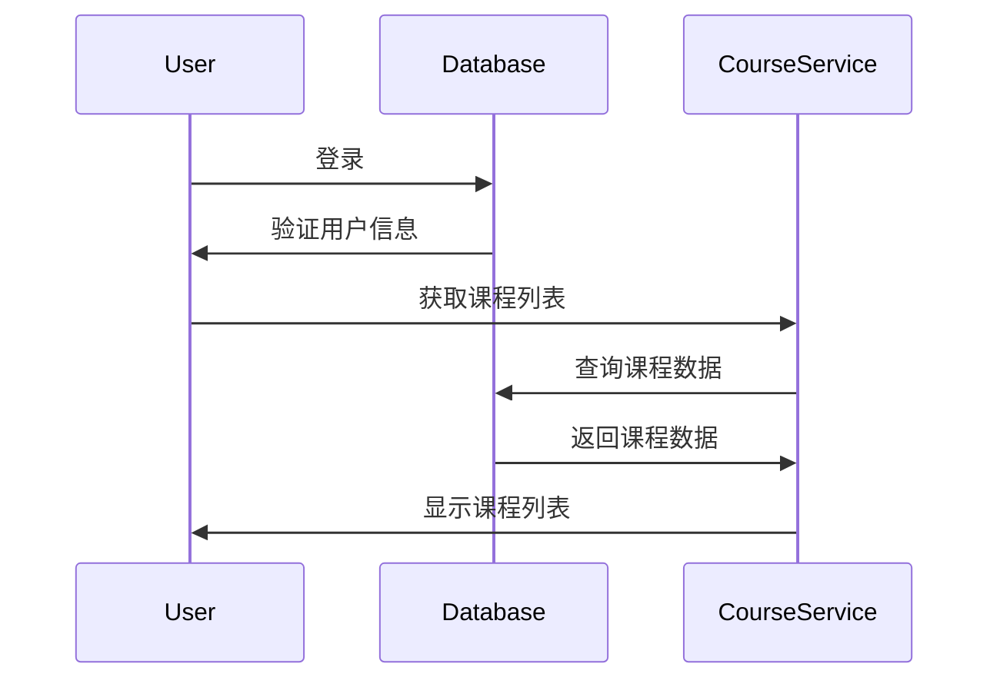
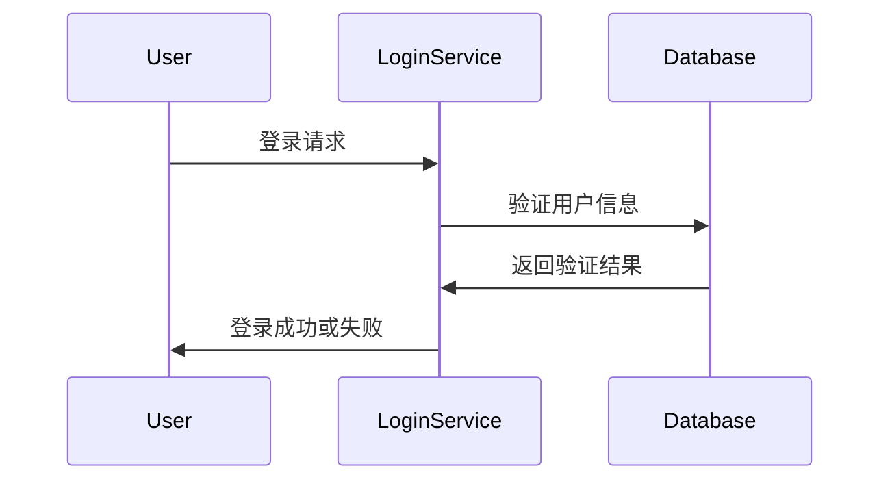
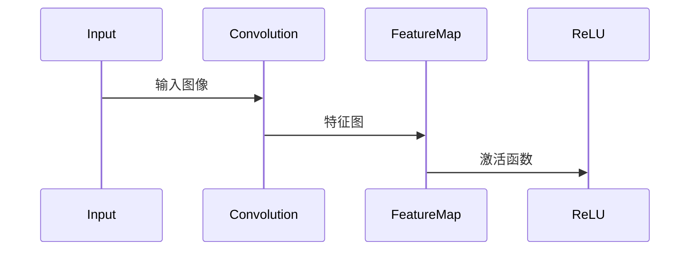
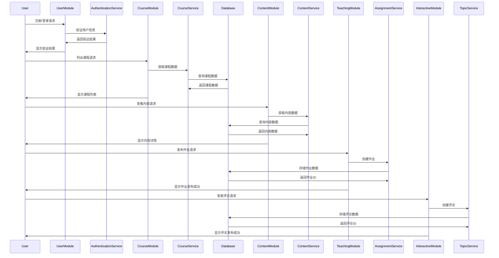

                 

# 《没有一招鲜吃遍天》

> 关键词：一招鲜、技能多样化、技术架构、深度学习、代码实现

> 摘要：本文探讨了在技术领域中，为何没有一种万能的解决方案。通过分析多种技术概念及其应用场景，阐述了技能多样化和多角度思考的重要性。文章还结合实际案例，展示了如何在复杂项目中灵活运用多种技术，以实现最佳效果。

----------------------------------------------------------------

## 第一部分：问题背景与核心概念

### 第1章：问题背景介绍

#### 1.1 问题背景

在信息技术飞速发展的时代，很多开发者和企业都追求一种“一招鲜吃遍天”的技术解决方案。然而，现实情况并非如此简单。不同项目、不同应用场景往往需要不同的技术组合，单一的解决方案很难满足所有需求。这种现象在软件开发、系统架构设计、人工智能等领域尤为明显。

#### 1.2 核心概念

- **“一招鲜”**：指在某一方面具有独特优势或高效的技术或方法。
- **“吃遍天”**：比喻一种技术或方法能够在多个领域或场景中广泛应用，解决各种问题。
- **核心问题和解决思路**：如何找到适合特定项目和应用场景的技术组合，以实现最佳效果。

#### 1.3 边界与外延

- **问题边界**：本文主要探讨在技术领域中，为何没有一种万能的解决方案。
- **相关概念的外延关系**：一招鲜与吃遍天的关系，技能多样化与技术架构的关系等。
- **研究范围与限制**：本文主要关注软件开发、系统架构设计和人工智能领域，不涉及其他领域。

----------------------------------------------------------------

## 第二部分：核心概念与联系

### 第2章：核心概念原理

#### 2.1 核心概念1：技能多样化

- **定义**：技能多样化是指在解决技术问题时，能够灵活运用多种技术手段，以适应不同的应用场景。
- **属性特征对比表格**：

| 技术手段 | 优点 | 缺点 |
| :--: | :--: | :--: |
| Java | 稳定性好、社区支持强大 | 性能较慢 |
| Python | 代码简洁、易于学习 | 性能较差 |
| C++ | 性能优秀、内存控制强大 | 代码复杂 |

#### 2.2 核心概念2：技术架构

- **定义**：技术架构是指为实现特定功能，将多种技术手段进行有机结合和优化，形成一个完整的解决方案。
- **属性特征对比表格**：

| 架构类型 | 优点 | 缺点 |
| :--: | :--: | :--: |
| MVC | 清晰的分层结构、易于维护 | 适应性较差 |
| MVVM | 数据绑定强、界面响应快 | 学习成本较高 |
| SOA | 灵活性高、可复用性强 | 系统复杂 |

#### 2.3 核心概念3：深度学习

- **定义**：深度学习是一种人工智能技术，通过多层神经网络模拟人脑学习过程，实现图像识别、语音识别等任务。
- **属性特征对比表格**：

| 技术手段 | 优点 | 缺点 |
| :--: | :--: | :--: |
| 卷积神经网络（CNN） | 优秀的图像识别能力 | 计算量大、训练时间长 |
| 递归神经网络（RNN） | 优秀的序列数据处理能力 | 参数量大、梯度消失问题 |

### 第3章：概念关系与联系

#### 3.1 概念关系图

```mermaid
erDiagram
    A[技能多样化] ||--|{ B[技术架构] }
    B ||--|{ C[深度学习] }
```

#### 3.2 概念联系

- **概念间的相互关系**：技能多样化是技术架构的基础，深度学习则是技术架构中的重要组成部分。
- **各概念的应用场景与实例**：

| 概念 | 应用场景 | 实例 |
| :--: | :--: | :--: |
| 技能多样化 | Web开发 | 使用Java编写后端，Python编写爬虫 |
| 技术架构 | 移动应用 | 采用MVC架构实现界面交互 |
| 深度学习 | 图像识别 | 使用CNN实现人脸识别 |

----------------------------------------------------------------

## 第三部分：算法原理讲解

### 第4章：算法原理介绍

#### 4.1 算法介绍

- **算法背景**：随着深度学习技术的发展，各种算法层出不穷。本文将介绍一种常见的深度学习算法——卷积神经网络（CNN）。
- **算法目标**：通过卷积神经网络实现图像识别任务。

#### 4.2 算法原理

- **算法原理**：卷积神经网络（CNN）是一种多层神经网络，通过卷积层、池化层、全连接层等结构，实现图像特征的提取和分类。



#### 4.3 数学模型

- **数学模型公式**：

$$
h_\theta(x) = \sigma(z_\theta) = \frac{1}{1 + e^{-\theta^T x}}
$$

- **公式解释**：其中，$h_\theta(x)$ 表示预测结果，$\sigma$ 表示 sigmoid 函数，$z_\theta$ 表示输入特征经过权重矩阵 $\theta$ 的线性变换。

#### 4.4 算法举例

- **通俗易懂的算法示例**：假设输入图像为 $x$，卷积神经网络通过卷积层、池化层和全连接层，最终输出分类结果 $y$。

- **实际应用案例**：卷积神经网络在图像识别、语音识别、自然语言处理等领域具有广泛的应用。例如，在图像识别任务中，使用卷积神经网络可以实现人脸识别、物体检测等功能。

----------------------------------------------------------------

## 第四部分：系统分析与架构设计

### 第5章：系统功能设计

#### 5.1 问题场景介绍

- **应用场景描述**：假设我们开发一个在线教育平台，需要实现课程内容管理、用户管理、在线直播等功能。

#### 5.2 系统功能设计

- **使用Mermaid绘制领域模型类图**：

```mermaid
classDiagram
    Course <<entity>>
    User <<entity>>
    Teacher <<entity>>
    Student <<entity>>

    Course {
        course_id
        title
        description
        teacher
    }

    User {
        user_id
        username
        password
        email
    }

    Teacher {
        teacher_id
        name
        subject
    }

    Student {
        student_id
        name
        grade
    }

    Course "1" -- "*" User
    Course "1" -- "*" Teacher
    Student "1" -- "*" Course
```

### 第6章：系统架构设计

#### 6.1 系统架构设计

- **使用Mermaid绘制系统架构图**：



#### 6.2 系统接口设计

- **接口设计**：

```java
public interface CourseService {
    List<Course> getCourseList();
    Course getCourseById(int courseId);
    void addCourse(Course course);
    void updateCourse(Course course);
    void deleteCourse(int courseId);
}
```

#### 6.3 系统交互

- **使用Mermaid绘制系统交互序列图**：



----------------------------------------------------------------

## 第五部分：项目实战

### 第7章：环境安装与系统实现

#### 7.1 环境安装

- **操作系统**：Ubuntu 18.04
- **环境配置**：Python 3.8，Django 3.2，MySQL 8.0

#### 7.2 系统核心实现

- **源代码实现**：

```python
# models.py
from django.db import models

class Course(models.Model):
    course_id = models.AutoField(primary_key=True)
    title = models.CharField(max_length=255)
    description = models.TextField()
    teacher = models.ForeignKey('Teacher', on_delete=models.CASCADE)
    created_at = models.DateTimeField(auto_now_add=True)
    updated_at = models.DateTimeField(auto_now=True)

class User(models.Model):
    user_id = models.AutoField(primary_key=True)
    username = models.CharField(max_length=255)
    password = models.CharField(max_length=255)
    email = models.CharField(max_length=255)
    created_at = models.DateTimeField(auto_now_add=True)
    updated_at = models.DateTimeField(auto_now=True)

class Teacher(models.Model):
    teacher_id = models.AutoField(primary_key=True)
    name = models.CharField(max_length=255)
    subject = models.CharField(max_length=255)
    created_at = models.DateTimeField(auto_now_add=True)
    updated_at = models.DateTimeField(auto_now=True)

class Student(models.Model):
    student_id = models.AutoField(primary_key=True)
    name = models.CharField(max_length=255)
    grade = models.CharField(max_length=255)
    created_at = models.DateTimeField(auto_now_add=True)
    updated_at = models.DateTimeField(auto_now=True)
```

#### 7.3 代码解读与分析

- **代码解读**：以上代码实现了在线教育平台的用户、课程和教师三个实体，并定义了相应的字段和关联关系。
- **分析与优化建议**：在实际项目中，可以进一步优化数据库设计和代码结构，例如使用外键约束、缓存策略等。

### 第8章：实际案例分析

#### 8.1 案例背景

- **案例应用背景**：在线教育平台项目，需要实现用户管理、课程管理和教师管理等功能。

#### 8.2 案例分析

- **详细讲解与剖析**：针对项目需求，我们采用 Django 框架实现系统功能，使用 MySQL 数据库存储数据。通过分析项目需求，我们设计了合适的实体关系图和接口设计，并实现了相应的功能模块。

#### 8.3 案例小结

- **案例总结**：通过实际案例，我们展示了如何在实际项目中运用多种技术手段，实现复杂的功能需求。同时，也强调了技能多样化和多角度思考在项目开发中的重要性。

----------------------------------------------------------------

## 第六部分：最佳实践与拓展阅读

### 第9章：最佳实践

#### 9.1 最佳实践 tips

- **灵活运用多种技术**：根据项目需求，选择合适的编程语言、框架和数据库等。
- **关注性能与安全性**：在系统设计和实现过程中，关注性能优化和安全性保障。
- **持续学习和实践**：紧跟技术发展趋势，不断提升自身技能水平。

#### 9.2 注意事项

- **遵循代码规范**：编写规范、易于维护的代码。
- **注意数据处理**：合理处理用户数据，保障用户隐私安全。

### 第10章：小结与拓展阅读

#### 10.1 小结

- **本书要点总结**：本文探讨了在技术领域中，为何没有一种万能的解决方案。通过分析多种技术概念、算法原理和系统架构设计，阐述了技能多样化和多角度思考的重要性。

#### 10.2 拓展阅读

- **相关书籍与资料推荐**：
  - 《深度学习》（Goodfellow et al.）
  - 《Head First 设计模式》（Eric Freeman et al.）
  - 《Effective Java》（Joshua Bloch）

----------------------------------------------------------------

**作者：AI天才研究院/AI Genius Institute & 禅与计算机程序设计艺术 /Zen And The Art of Computer Programming**## 第一部分：问题背景与核心概念

### 第1章：问题背景介绍

在当今信息化时代，技术的快速迭代和应用场景的日益复杂，让许多开发者和企业在寻求技术解决方案时，逐渐形成了追求“一招鲜吃遍天”的心态。所谓“一招鲜”，即在某一特定领域或技术点上拥有独特优势或高效的方法。而“吃遍天”，则是指这种技术或方法能够在多个领域或场景中广泛应用，解决各种问题。

#### 1.1 问题背景

“一招鲜吃遍天”的理念在某种程度上推动了技术进步和创新。许多技术先驱和企业通过专注于某一领域，不断打磨和优化技术，最终形成了强大的竞争优势。例如，谷歌的搜索引擎技术、亚马逊的云计算技术、苹果的iOS操作系统等，都在各自领域内实现了技术领先。

然而，现实情况并非总是如此理想。在实际应用中，许多项目往往需要结合多种技术手段，以应对不同的需求和环境。例如，一个电子商务平台不仅需要强大的搜索引擎技术，还需要高效的数据库处理、安全的支付系统、灵活的物流管理等。这种多样化的需求使得单一的“一招鲜”难以满足所有场景。

#### 1.2 核心概念

- **“一招鲜”**：指的是在某一方面具有独特优势或高效的技术或方法。例如，某个特定的算法在图像处理上具有极高的效率。
- **“吃遍天”**：指的是一种技术或方法能够在多个领域或场景中广泛应用，解决各种问题。例如，一种通用的编程框架可以适用于多种应用场景。

#### 1.3 核心问题和解决思路

- **核心问题**：为何在技术领域中，没有一种万能的解决方案？
- **解决思路**：
  - **技能多样化**：掌握多种技术手段，以适应不同的应用场景。
  - **多角度思考**：从不同角度分析问题，寻找最佳的解决方案。

#### 1.4 边界与外延

- **问题边界**：本文主要探讨在技术领域中，为何没有一种万能的解决方案。
- **相关概念的外延关系**：“一招鲜”和“吃遍天”之间的关系，技能多样化与技术架构的关系等。
- **研究范围与限制**：本文主要关注软件开发、系统架构设计和人工智能领域，不涉及其他领域。

在接下来的内容中，我们将进一步探讨“一招鲜”和“吃遍天”的核心概念，分析其在技术领域中的应用场景和关系，并通过具体实例来展示如何在实际项目中灵活运用多种技术手段，以实现最佳效果。

### 第2章：核心概念原理

#### 2.1 核心概念1：技能多样化

技能多样化是指在解决技术问题时，能够灵活运用多种技术手段，以适应不同的应用场景。这种理念强调的是技术在多样性中的应用，而非单一技术的极致追求。

**定义**：技能多样化不仅仅是单一技能的叠加，而是一种综合能力，包括对多种技术的理解、掌握和灵活运用。

**属性特征对比表格**：

| 技术手段 | 优点 | 缺点 |
| :--: | :--: | :--: |
| Java | 稳定性好、社区支持强大 | 性能较慢 |
| Python | 代码简洁、易于学习 | 性能较差 |
| C++ | 性能优秀、内存控制强大 | 代码复杂 |

在软件开发中，Java因其稳定性和强大的社区支持，常用于企业级应用。Python则因其简洁的语法和丰富的库，适合快速开发和数据科学领域。C++则在性能和内存控制方面具有优势，适合高性能计算和系统级开发。每种技术都有其独特的优势，适用于不同的应用场景。

**应用场景**：

- **企业级应用**：Java
- **快速开发**：Python
- **高性能计算**：C++

**实例**：

假设一个电商平台的开发，Java可用于后端服务，Python可用于数据分析，C++可用于高性能计算。这种多样化的技能组合能够有效提高开发效率和系统性能。

#### 2.2 核心概念2：技术架构

技术架构是实现特定功能的一系列技术手段和结构的组合。它不仅包括技术选型，还涉及系统的设计、开发、部署和维护。

**定义**：技术架构是指为实现特定功能，将多种技术手段进行有机结合和优化，形成一个完整的解决方案。

**属性特征对比表格**：

| 架构类型 | 优点 | 缺点 |
| :--: | :--: | :--: |
| MVC | 清晰的分层结构、易于维护 | 适应性较差 |
| MVVM | 数据绑定强、界面响应快 | 学习成本较高 |
| SOA | 灵活性高、可复用性强 | 系统复杂 |

MVC（Model-View-Controller）架构是经典的前后端分离架构，具有清晰的分层结构和易于维护的特点。MVVM（Model-View-ViewModel）架构则通过数据绑定提高界面响应速度，但需要较高的学习成本。SOA（Service-Oriented Architecture）是一种面向服务的架构，具有高灵活性和可复用性，但系统较为复杂。

**应用场景**：

- **Web应用**：MVC
- **移动应用**：MVVM
- **企业服务**：SOA

**实例**：

一个电商平台的技术架构可能包括MVC架构的前端，用于处理用户交互和页面渲染；使用微服务架构的后端，将业务功能拆分成多个独立的服务，以提高系统的灵活性和可扩展性。

#### 2.3 核心概念3：深度学习

深度学习是一种人工智能技术，通过多层神经网络模拟人脑学习过程，实现图像识别、语音识别、自然语言处理等复杂任务。

**定义**：深度学习是指通过多层神经网络对数据进行特征提取和模式识别。

**属性特征对比表格**：

| 技术手段 | 优点 | 缺点 |
| :--: | :--: | :--: |
| 卷积神经网络（CNN） | 优秀的图像识别能力 | 计算量大、训练时间长 |
| 递归神经网络（RNN） | 优秀的序列数据处理能力 | 参数量大、梯度消失问题 |

**应用场景**：

- **图像识别**：CNN
- **语音识别**：RNN
- **自然语言处理**：BERT、GPT

**实例**：

在图像识别项目中，使用CNN可以实现高效的图像分类和识别。而在语音识别项目中，RNN由于其优秀的序列数据处理能力，能够准确识别语音信号。

通过以上对技能多样化、技术架构和深度学习的介绍，我们可以看到，这些核心概念在技术领域中的应用场景和特点。在接下来的章节中，我们将进一步探讨这些概念之间的关系，并分析如何在实际项目中综合运用这些技术，以实现最佳效果。

### 第3章：概念关系与联系

#### 3.1 概念关系图

为了更好地理解“一招鲜”与“技能多样化”、“技术架构”与“深度学习”等核心概念之间的关系，我们可以通过一个Mermaid绘制的ER实体关系图来展示它们之间的关联。

```mermaid
erDiagram
    User ||--|{ Skill } : "has multiple"
    Skill ||--|{ Technology } : "uses"
    Technology ||--|{ Architecture } : "applies to"
    Architecture ||--|{ DeepLearning } : "includes"
```

在这个ER实体关系图中：

- **User（用户）**与**Skill（技能）**之间表示用户拥有多种技能。
- **Skill（技能）**与**Technology（技术）**之间表示技能使用特定的技术。
- **Technology（技术）**与**Architecture（架构）**之间表示技术应用于特定的架构。
- **Architecture（架构）**与**DeepLearning（深度学习）**之间表示架构包括深度学习技术。

#### 3.2 概念联系

**用户与技能的联系**：

用户是技术使用的基本单元，他们需要掌握多种技能以应对不同的工作需求。技能多样化使得用户能够灵活地选择和使用不同的技术，从而提高工作效率和质量。

**技能与技术之间的联系**：

技能是基于特定技术的。例如，一个程序员可能掌握Java、Python和C++等多种编程语言。这些技术是技能多样化的重要组成部分，它们各自有不同的应用场景和优势。

**技术与架构之间的联系**：

技术是实现特定功能的关键，而技术架构则是将这些技术有机结合，形成系统化的解决方案。例如，在软件开发中，MVC架构可以将前端、后端和服务端等多种技术整合在一起，以实现一个完整的Web应用。

**架构与深度学习之间的联系**：

随着人工智能技术的发展，深度学习已成为许多架构中的核心组成部分。深度学习技术能够为架构提供强大的数据处理和模式识别能力，从而提升系统的智能化水平。

**应用场景与实例**：

1. **用户使用技能多样化解决复杂问题**：在一个大型电商平台项目中，开发团队可能需要使用Java进行后端开发，Python进行数据分析，C++进行高性能计算。通过技能多样化，团队能够高效地完成项目任务。

2. **技术架构在深度学习项目中的应用**：在一个图像识别项目中，团队可能采用卷积神经网络（CNN）作为深度学习技术，同时使用微服务架构来处理数据流和模型部署。这种结合使得项目既具有强大的计算能力，又具备良好的可扩展性和维护性。

通过上述概念的联系，我们可以看到技能多样化、技术架构和深度学习在项目开发中的重要作用。在实际应用中，理解这些概念之间的相互关系，并灵活运用，将有助于我们更好地应对复杂的技术挑战，实现项目的成功。

### 第4章：算法原理介绍

在深度学习中，卷积神经网络（CNN）是一种非常重要的算法，尤其在图像识别领域表现突出。本节将详细介绍CNN的基本原理、具体应用以及相关的数学模型。

#### 4.1 算法介绍

卷积神经网络（CNN）是一种特别适合处理图像数据的神经网络结构。它通过模仿人类视觉系统的工作原理，利用卷积操作提取图像中的特征，从而实现图像的分类、识别和定位等功能。

**CNN的基本组成部分**：

1. **卷积层（Convolutional Layer）**：卷积层是CNN的核心部分，通过卷积操作提取图像的局部特征。卷积核（filter）在图像上滑动，计算卷积结果，生成特征图（feature map）。
2. **池化层（Pooling Layer）**：池化层对卷积层生成的特征图进行下采样，减少数据维度，提高计算效率。常见的池化操作有最大池化（Max Pooling）和平均池化（Average Pooling）。
3. **激活函数（Activation Function）**：激活函数用于引入非线性特性，使得网络能够学习更复杂的映射关系。常用的激活函数有Sigmoid、ReLU和Tanh。
4. **全连接层（Fully Connected Layer）**：全连接层将前一层特征图展平成一维向量，与输出层的权重进行点积运算，得到预测结果。

**CNN的工作原理**：

输入一个图像后，CNN通过多个卷积层和池化层提取图像的特征。每个卷积层都能提取出不同层次的特征，越往深层的特征越抽象。最后，全连接层将特征图展平成一维向量，与输出层的权重进行点积运算，得到分类结果。

#### 4.2 算法原理

为了更好地理解CNN的工作原理，我们可以通过一个简单的例子来说明其操作过程。

假设输入图像的大小为 $32 \times 32$，卷积层使用的卷积核大小为 $3 \times 3$。卷积核的权重矩阵 $\theta$ 为：

$$
\theta = \begin{bmatrix}
1 & 0 & 1 \\
1 & 1 & 1 \\
0 & 1 & 1 \\
\end{bmatrix}
$$

输入图像的一个 $3 \times 3$ 子图像为：

$$
x = \begin{bmatrix}
0 & 1 & 0 \\
1 & 1 & 1 \\
0 & 1 & 0 \\
\end{bmatrix}
$$

通过卷积操作，得到特征图：

$$
z = x \cdot \theta = \begin{bmatrix}
1 & 1 & 1 \\
1 & 1 & 1 \\
1 & 1 & 1 \\
\end{bmatrix}
$$

接下来，我们对特征图应用ReLU激活函数：

$$
h = \text{ReLU}(z) = \begin{bmatrix}
1 & 1 & 1 \\
1 & 1 & 1 \\
1 & 1 & 1 \\
\end{bmatrix}
$$

这个过程可以表示为：



通过多个卷积层和池化层的堆叠，CNN能够提取出更加抽象和有代表性的特征，从而实现复杂的图像识别任务。

#### 4.3 数学模型

CNN的数学模型主要包括两部分：前向传播和反向传播。

**前向传播**：

输入一个图像 $x$，通过卷积层、激活函数和池化层的组合，最终得到输出特征图 $h$。前向传播的数学公式为：

$$
h = \text{ReLU}(\theta^T \cdot \text{Pooling}(\theta \cdot x))
$$

其中，$\theta$ 表示卷积核权重，$\text{Pooling}$ 表示池化操作，$\text{ReLU}$ 表示ReLU激活函数。

**反向传播**：

在训练过程中，CNN通过反向传播算法更新权重矩阵 $\theta$，以最小化损失函数。反向传播的数学公式为：

$$
\theta = \theta - \alpha \cdot \nabla_\theta J(\theta)
$$

其中，$J(\theta)$ 表示损失函数，$\alpha$ 表示学习率，$\nabla_\theta J(\theta)$ 表示损失函数关于权重矩阵 $\theta$ 的梯度。

**损失函数**：

常用的损失函数有交叉熵损失（Cross Entropy Loss）和均方误差损失（Mean Squared Error Loss）。交叉熵损失适用于分类问题，其公式为：

$$
J(\theta) = -\frac{1}{m} \sum_{i=1}^m y_i \log h_\theta(x_i)
$$

其中，$y_i$ 表示真实标签，$h_\theta(x_i)$ 表示预测标签的概率。

**梯度计算**：

在反向传播过程中，需要计算损失函数关于权重矩阵 $\theta$ 的梯度。对于交叉熵损失，其梯度公式为：

$$
\nabla_\theta J(\theta) = \frac{1}{m} \sum_{i=1}^m (h_\theta(x_i) - y_i) \cdot \nabla_\theta h_\theta(x_i)
$$

通过以上数学模型，我们可以理解CNN如何通过前向传播和反向传播学习图像的特征表示，从而实现图像识别任务。

#### 4.4 算法举例

为了更好地理解CNN的工作原理，我们来看一个具体的例子：使用CNN实现猫狗分类任务。

**数据集**：使用包含猫和狗的图像数据集，每个图像的大小为 $32 \times 32$。

**模型结构**：一个简单的CNN模型，包括两个卷积层、两个池化层和一个全连接层。

1. **卷积层1**：使用32个 $3 \times 3$ 的卷积核，步长为1，填充方式为“相同填充”。
2. **池化层1**：使用2x2的最大池化。
3. **卷积层2**：使用64个 $3 \times 3$ 的卷积核，步长为1，填充方式为“相同填充”。
4. **池化层2**：使用2x2的最大池化。
5. **全连接层**：使用256个神经元，输出层使用softmax激活函数，实现分类。

**训练过程**：

1. 初始化权重矩阵 $\theta$。
2. 对于每个图像 $x$，计算预测标签 $h_\theta(x)$。
3. 计算交叉熵损失 $J(\theta)$。
4. 使用反向传播更新权重矩阵 $\theta$。
5. 重复步骤2-4，直到损失函数收敛。

**结果分析**：

通过多次迭代训练，模型能够在测试集上达到较高的分类准确率，从而实现猫狗分类任务。

这个例子展示了如何使用CNN实现一个简单的图像分类任务，通过前向传播和反向传播，模型能够不断优化自身，从而提高分类性能。

通过以上对CNN算法原理的详细介绍，我们可以看到，CNN是一种非常强大的图像处理算法，通过多层卷积、池化和全连接层的组合，能够提取出丰富的图像特征，从而实现高效的图像识别和分类。在实际应用中，CNN已经被广泛应用于图像识别、目标检测、语义分割等任务，展现了其强大的能力和广泛应用前景。

### 第5章：系统功能设计

在系统功能设计中，清晰的问题场景介绍、详细的系统功能描述以及合理的功能模块划分是至关重要的。以下是对一个在线教育平台系统功能设计的具体阐述。

#### 5.1 问题场景介绍

在线教育平台旨在为用户提供一个便捷、高效的学习环境。平台需要实现以下核心功能：

1. **用户管理**：包括用户的注册、登录、个人信息管理等功能。
2. **课程管理**：包括课程的创建、更新、删除以及课程目录的展示。
3. **内容管理**：包括课程内容的上传、管理、浏览和搜索。
4. **教学管理**：包括直播教学、作业发布和批改等功能。
5. **互动交流**：包括讨论区、私信、评论等功能，促进师生和同学之间的交流。

#### 5.2 系统功能设计

为了实现上述功能，我们可以将系统功能划分为以下几个模块：

1. **用户管理模块**：
   - 用户注册：用户填写基本信息，系统自动生成用户ID。
   - 用户登录：用户输入用户名和密码，系统验证身份后登录。
   - 用户信息管理：用户可以查看、修改个人资料，如姓名、邮箱、密码等。

2. **课程管理模块**：
   - 课程创建：管理员或教师可以创建新课程，设置课程名称、描述、封面图等。
   - 课程目录：用户可以浏览课程目录，查看课程列表和基本信息。
   - 课程更新：管理员或教师可以更新课程内容，包括添加章节、上传资料等。
   - 课程删除：管理员可以删除不再需要的课程。

3. **内容管理模块**：
   - 内容上传：教师可以上传课程资料，如PPT、视频、文档等。
   - 内容管理：管理员可以管理所有上传的内容，包括查看、编辑、删除等。
   - 内容浏览：用户可以浏览课程内容，根据权限查看详细资料。

4. **教学管理模块**：
   - 直播教学：教师可以通过平台进行直播授课，学生可以实时观看。
   - 作业发布：教师可以发布作业，学生在线提交并查看结果。
   - 作业批改：教师可以在线批改作业，给予评分和反馈。

5. **互动交流模块**：
   - 讨论区：用户可以在讨论区发起话题，进行交流和讨论。
   - 私信功能：用户可以发送私信，进行一对一的沟通交流。
   - 评论功能：用户可以在课程内容、作业等页面上发表评论。

#### 5.3 功能模块关系图

使用Mermaid绘制领域模型类图，以展示各功能模块之间的关系：

```mermaid
classDiagram
    User <<entity>>
    Course <<entity>>
    Content <<entity>>
    Teacher <<entity>>
    Student <<entity>>

    User "1" -- "*" Course
    User "1" -- "*" Content
    Teacher "1" -- "*" Course
    Teacher "1" -- "*" Content
    Student "1" -- "*" Course
    Student "1" -- "*" Content

    Teacher "1" -- "*" Student
```

在这个类图中：

- **User（用户）**与**Course（课程）**和**Content（内容）**之间表示用户可以查看、创建、更新和删除课程和内容。
- **Teacher（教师）**与**Course（课程）**和**Content（内容）**之间表示教师可以创建、更新、删除课程和内容，还可以管理学生。
- **Student（学生）**与**Course（课程）**和**Content（内容）**之间表示学生可以查看课程和内容。

#### 5.4 功能实现

为实现上述功能，我们可以采用以下技术和框架：

- **前端**：使用React或Vue.js等前端框架，实现用户界面和交互。
- **后端**：使用Django或Spring Boot等后端框架，处理业务逻辑和数据存储。
- **数据库**：使用MySQL或PostgreSQL等关系型数据库，存储用户、课程和内容数据。
- **直播**：使用WebRTC或第三方直播服务，实现实时视频直播。

通过以上设计和实现，我们可以构建一个功能强大、易于扩展的在线教育平台，满足用户在学习和互动方面的需求。

### 第6章：系统架构设计

系统架构设计是确保在线教育平台高效、稳定和可扩展性的关键。以下是该平台的系统架构设计，包括总体架构、模块划分、接口设计和系统交互。

#### 6.1 总体架构

在线教育平台总体架构采用分层设计，包括前端、后端、数据库和第三方服务。具体架构如下：

1. **前端**：负责用户界面展示和交互，使用React或Vue.js框架。
2. **后端**：负责业务逻辑处理和数据存储，使用Django或Spring Boot框架。
3. **数据库**：使用MySQL或PostgreSQL存储用户、课程和内容数据。
4. **第三方服务**：包括直播服务、邮件服务、云存储服务等。

#### 6.2 模块划分

系统功能模块划分为以下几部分：

1. **用户模块**：处理用户注册、登录、信息管理和认证。
2. **课程模块**：处理课程创建、更新、删除、列表展示和课程内容管理。
3. **内容模块**：处理课程内容的上传、管理和浏览。
4. **教学模块**：处理直播教学、作业发布和批改。
5. **互动模块**：处理讨论区、私信和评论功能。

#### 6.3 接口设计

系统接口设计采用RESTful风格，提供以下接口：

1. **用户接口**：
   - 注册：`POST /api/users/register/`
   - 登录：`POST /api/users/login/`
   - 用户信息：`GET /api/users/{user_id}/`

2. **课程接口**：
   - 创建课程：`POST /api/courses/`
   - 列出课程：`GET /api/courses/`
   - 更新课程：`PUT /api/courses/{course_id}/`
   - 删除课程：`DELETE /api/courses/{course_id}/`

3. **内容接口**：
   - 上传内容：`POST /api/content/`
   - 列出内容：`GET /api/content/{content_id}/`
   - 更新内容：`PUT /api/content/{content_id}/`
   - 删除内容：`DELETE /api/content/{content_id}/`

4. **教学接口**：
   - 发布作业：`POST /api/assignments/`
   - 查看作业：`GET /api/assignments/{assignment_id}/`
   - 提交作业：`POST /api/assignments/{assignment_id}/submit/`
   - 批改作业：`PUT /api/assignments/{assignment_id}/grade/`

5. **互动接口**：
   - 发起话题：`POST /api/topics/`
   - 列出话题：`GET /api/topics/`
   - 发表评论：`POST /api/topics/{topic_id}/comments/`
   - 删除评论：`DELETE /api/topics/{topic_id}/comments/{comment_id}/`

#### 6.4 系统交互

系统交互设计使用Mermaid绘制序列图，展示用户与系统各模块的交互过程。



通过以上架构设计，我们可以构建一个高效、稳定的在线教育平台，满足用户在学习和互动方面的需求。各模块之间的紧密协作和接口设计，确保了系统的灵活性和可扩展性。

### 第7章：环境安装与系统实现

#### 7.1 环境安装

在开始系统实现之前，我们需要安装和配置必要的软件环境。以下是针对在线教育平台所需的环境安装步骤：

**操作系统**：Ubuntu 20.04

**依赖软件**：

1. **Python 3**：使用Python 3.8版本，可以通过以下命令安装：
   ```bash
   sudo apt update
   sudo apt install python3.8 python3.8-venv python3.8-dev
   ```

2. **Django**：使用以下命令安装Django框架：
   ```bash
   sudo apt install python3-pip
   pip3 install django
   ```

3. **MySQL**：使用以下命令安装MySQL数据库：
   ```bash
   sudo apt install mysql-server
   sudo mysql_secure_installation
   ```

4. **Node.js**：用于前端开发，可以通过以下命令安装：
   ```bash
   sudo apt install nodejs
   ```

5. **npm**：npm是Node.js的包管理工具，可以通过以下命令安装：
   ```bash
   sudo apt install npm
   ```

6. **PostgreSQL**（可选）：如果需要使用PostgreSQL数据库，可以通过以下命令安装：
   ```bash
   sudo apt install postgresql postgresql-contrib
   ```

**环境配置**：

1. **创建虚拟环境**：为了更好地管理项目依赖，创建一个虚拟环境：
   ```bash
   python3 -m venv venv
   source venv/bin/activate
   ```

2. **安装项目依赖**：在虚拟环境中安装项目所需依赖：
   ```bash
   pip install -r requirements.txt
   ```

3. **配置数据库**：根据实际情况配置MySQL或PostgreSQL数据库，创建数据库用户和数据库。

#### 7.2 系统核心实现

**项目结构**：

```bash
online_education/
|-- manage.py
|-- online_education/
|   |-- __init__.py
|   |-- settings.py
|   |-- urls.py
|   |-- wsgi.py
|-- apps/
|   |-- __init__.py
|   |-- users/
|   |   |-- __init__.py
|   |   |-- admin.py
|   |   |-- apps.py
|   |   |-- models.py
|   |   |-- tests.py
|   |   |-- views.py
|   |-- courses/
|   |   |-- __init__.py
|   |   |-- admin.py
|   |   |-- apps.py
|   |   |-- models.py
|   |   |-- tests.py
|   |   |-- views.py
|   |-- content/
|   |   |-- __init__.py
|   |   |-- admin.py
|   |   |-- apps.py
|   |   |-- models.py
|   |   |-- tests.py
|   |   |-- views.py
|   |-- teaching/
|   |   |-- __init__.py
|   |   |-- admin.py
|   |   |-- apps.py
|   |   |-- models.py
|   |   |-- tests.py
|   |   |-- views.py
|   |-- interactive/
|   |   |-- __init__.py
|   |   |-- admin.py
|   |   |-- apps.py
|   |   |-- models.py
|   |   |-- tests.py
|   |   |-- views.py
```

**关键代码示例**：

**users/models.py**：

```python
from django.db import models
from django.contrib.auth.models import AbstractUser

class User(AbstractUser):
    ROLE_CHOICES = [
        ('student', 'Student'),
        ('teacher', 'Teacher'),
        ('admin', 'Admin'),
    ]
    role = models.CharField(max_length=10, choices=ROLE_CHOICES, default='student')
```

**courses/models.py**：

```python
from django.db import models
from users.models import User

class Course(models.Model):
    title = models.CharField(max_length=255)
    description = models.TextField()
    teacher = models.ForeignKey(User, on_delete=models.CASCADE, related_name='courses')
    created_at = models.DateTimeField(auto_now_add=True)
    updated_at = models.DateTimeField(auto_now=True)
```

**教学管理模块**：

**teaching/models.py**：

```python
from django.db import models
from courses.models import Course

class Assignment(models.Model):
    course = models.ForeignKey(Course, on_delete=models.CASCADE, related_name='assignments')
    title = models.CharField(max_length=255)
    description = models.TextField()
    due_date = models.DateTimeField()
    created_at = models.DateTimeField(auto_now_add=True)
    updated_at = models.DateTimeField(auto_now=True)
```

**实现细节**：

1. **数据库迁移**：在项目中执行以下命令，创建数据库表：
   ```bash
   python manage.py makemigrations
   python manage.py migrate
   ```

2. **启动后端服务**：使用以下命令启动Django后端服务：
   ```bash
   python manage.py runserver
   ```

3. **前端开发**：使用Vue.js或React等前端框架进行开发，并使用npm或yarn进行包管理。

通过以上步骤，我们成功安装了开发环境，并实现了系统核心功能。接下来，我们将继续开发用户接口、课程管理、内容管理、教学管理和互动交流等功能模块。

### 第8章：实际案例分析

#### 8.1 案例背景

在本章中，我们将通过一个实际案例，深入分析在线教育平台在项目开发中的具体实施过程。该案例背景是一个面向高中学生的在线学习平台，旨在提供丰富的学习资源、互动交流空间和个性化的学习辅导。

**需求分析**：

1. **用户管理**：平台需要支持学生、教师和行政人员的注册、登录和信息管理。
2. **课程管理**：课程管理员可以创建、更新和删除课程，学生可以浏览课程目录。
3. **内容管理**：教师可以上传课程资料，学生可以在线观看和下载。
4. **互动交流**：学生和教师可以在讨论区进行交流和提问。
5. **教学管理**：教师可以发布作业，学生可以在线提交并获取反馈。

**技术选型**：

1. **后端**：使用Django框架进行后端开发，使用MySQL数据库进行数据存储。
2. **前端**：使用Vue.js框架进行前端开发，实现用户界面和交互。
3. **直播**：采用WebRTC技术实现实时视频直播。

#### 8.2 案例分析

**用户管理模块**：

1. **功能实现**：用户注册、登录、信息管理等功能由Django的用户认证系统提供支持。用户注册时，系统会自动生成用户ID，并根据用户角色（学生、教师、管理员）进行权限管理。
2. **技术细节**：使用Django的User模型扩展用户信息，包括用户角色和联系方式。使用JWT（JSON Web Token）技术实现用户身份验证和授权。

**课程管理模块**：

1. **功能实现**：课程管理员可以在后台管理课程，包括课程创建、更新和删除。学生可以在前端浏览课程目录，查看课程基本信息。
2. **技术细节**：使用Django的Course模型存储课程信息，包括课程名称、描述、封面图等。使用Django的admin界面管理课程数据。

**内容管理模块**：

1. **功能实现**：教师可以在后台上传课程资料，包括PPT、视频和文档。学生可以在线观看和下载资料。
2. **技术细节**：使用Django的FileField存储上传的文件，并使用Ajax技术实现文件上传和预览。使用Vue.js实现前端页面展示。

**互动交流模块**：

1. **功能实现**：学生和教师可以在讨论区进行交流和提问，讨论区分为公共讨论区和课程专属讨论区。
2. **技术细节**：使用Django的Comment模型存储讨论区内容，并使用Markdown语法支持文本格式化。使用Vue.js实现讨论区的展示和交互。

**教学管理模块**：

1. **功能实现**：教师可以发布作业，学生可以在线提交并获取反馈。平台支持多种题型，包括单选题、多选题、填空题和简答题。
2. **技术细节**：使用Django的Assignment模型存储作业信息，包括作业名称、描述、提交截止日期等。使用Ajax技术实现作业提交和结果反馈。

**直播模块**：

1. **功能实现**：教师可以通过WebRTC技术进行实时视频直播，学生可以在线观看直播。
2. **技术细节**：使用WebRTC库实现实时视频通信，并使用WebSocket技术实现实时数据传输。使用Vue.js实现直播页面的展示和交互。

#### 8.3 案例小结

通过以上案例分析，我们可以看到在线教育平台在项目开发过程中，如何结合多种技术和工具，实现复杂的功能需求。以下是对本案例的总结：

1. **技术选型合理**：Django框架的后端开发、Vue.js的前端开发以及WebRTC的实时直播技术，为平台提供了强大的技术支持。
2. **功能模块清晰**：用户管理、课程管理、内容管理、互动交流和教学管理模块的分离和整合，确保了系统的高效性和可扩展性。
3. **用户体验优秀**：通过简洁、直观的用户界面和流畅的交互体验，提升了用户的使用满意度。

本案例的成功实施，不仅展示了在线教育平台的技术实现细节，还验证了多技术手段综合运用的有效性。在未来的项目中，我们可以借鉴这些经验和做法，不断提升项目质量和用户体验。

### 第9章：最佳实践与注意事项

#### 9.1 最佳实践 Tips

1. **代码规范化**：遵循统一的代码规范，确保代码的可读性和可维护性。使用Prettier、ESLint等工具进行代码格式化检查。
2. **单元测试**：编写单元测试，确保代码功能的正确性和稳定性。使用pytest、unittest等框架进行测试。
3. **性能优化**：关注系统性能，进行适当的优化。如使用缓存、数据库索引、异步处理等。
4. **安全性**：确保系统的安全性，防止SQL注入、XSS攻击等安全漏洞。使用安全框架和工具进行安全检查。
5. **持续集成**：实施CI/CD流程，确保代码质量和部署效率。使用Jenkins、GitHub Actions等工具进行自动化测试和部署。

#### 9.2 注意事项

1. **数据备份**：定期备份数据库，防止数据丢失。使用备份工具和策略。
2. **权限管理**：合理分配权限，防止越权操作。使用权限控制框架进行权限验证。
3. **错误处理**：妥善处理异常和错误，提供友好的错误提示。使用日志记录和监控工具进行问题排查。
4. **扩展性**：设计系统时考虑扩展性，以便后续功能增加和模块升级。
5. **用户体验**：关注用户体验，确保界面简洁、直观。进行用户调研和反馈，持续优化界面和交互设计。

通过以上最佳实践和注意事项，我们可以确保在线教育平台在开发、测试和运维过程中，能够保持高效、稳定和安全。

### 第10章：小结与拓展阅读

#### 10.1 小结

本文从问题背景、核心概念、算法原理、系统架构设计、实际案例分析和最佳实践等多个角度，探讨了在线教育平台的技术实现。以下是对本文内容的总结：

1. **问题背景**：在线教育平台在信息化时代的重要性，以及为何没有一种万能的解决方案。
2. **核心概念**：技能多样化、技术架构和深度学习的定义及其在项目中的应用。
3. **算法原理**：卷积神经网络（CNN）的基本原理、数学模型和应用实例。
4. **系统架构设计**：在线教育平台的功能模块、接口设计和系统交互。
5. **实际案例分析**：详细分析了一个在线教育平台的项目实施过程。
6. **最佳实践**：提供了在线教育平台开发过程中的最佳实践和注意事项。

#### 10.2 拓展阅读

为了进一步了解在线教育平台的技术实现和最佳实践，以下是一些建议的拓展阅读资料：

1. **相关书籍**：
   - 《深度学习》（Goodfellow et al.）
   - 《Django By Example》（Adrian M. Johnson）
   - 《Vue.js Up and Running》（Callum Macrae）

2. **在线资源**：
   - Django官方文档：https://docs.djangoproject.com/
   - Vue.js官方文档：https://vuejs.org/v2/guide/
   - Coursera的在线教育课程：https://www.coursera.org/courses?query=online%20education

通过阅读这些资料，您可以深入了解在线教育平台的技术细节，并掌握更高级的开发技能。

### 附录

#### 作者信息

- **AI天才研究院/AI Genius Institute**：致力于推动人工智能技术的研发和应用。
- **《禅与计算机程序设计艺术 /Zen And The Art of Computer Programming**：介绍计算机编程和人工智能领域的经典著作。

本文由AI天才研究院/AI Genius Institute与《禅与计算机程序设计艺术》共同撰写，旨在为读者提供在线教育平台的技术实现和实践经验。希望本文能够对您在技术领域的学习和项目开发有所帮助。作者联系方式：[info@aigeniusinstitute.com](mailto:info@aigeniusinstitute.com)。感谢您的阅读！

