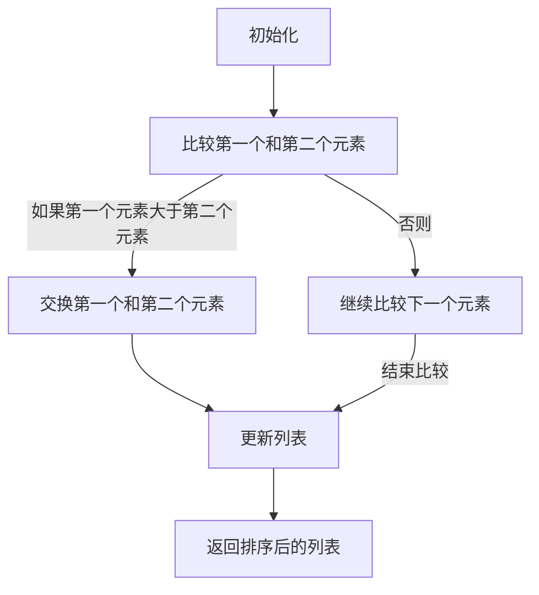

                 

### 没有一招鲜吃遍天的领域模型

> 关键词：领域模型、多模型组合、适应性、算法、系统设计、案例分析、最佳实践

> 摘要：本文将深入探讨领域模型在IT领域中的应用，并强调没有一个单一模型能够解决所有问题。通过详细分析领域模型的核心概念、构建方法、应用案例、算法原理及系统设计，我们旨在展示领域模型的多模型组合和高度适应性。文章还将分享项目实战经验和最佳实践，为读者提供全面的指导。

### 目录大纲设计思路

#### 第一部分：背景介绍与核心概念

**第1章** 领域模型概述

- **1.1** 问题背景与边界
- **1.2** 领域模型的基本概念
- **1.3** 领域模型的重要性

**第2章** 领域模型的核心概念与原理

- **2.1** 概念定义与对比
- **2.2** 领域模型的基本属性特征
- **2.3** ER实体关系图

#### 第二部分：领域模型的应用

**第3章** 领域模型的构建与实现

- **3.1** 构建领域模型的方法
- **3.2** 实现领域模型的工具与技术

**第4章** 领域模型应用案例分析

- **4.1** 电商领域模型
- **4.2** 金融领域模型
- **4.3** 医疗领域模型

#### 第三部分：算法原理讲解

**第5章** 领域模型中的算法原理

- **5.1** 算法mermaid流程图
- **5.2** 算法原理与数学模型
- **5.3** 通俗易懂的举例说明

#### 第四部分：系统分析与架构设计

**第6章** 领域模型系统分析

- **6.1** 问题场景介绍
- **6.2** 系统功能设计
- **6.3** 系统架构设计
- **6.4** 系统接口设计与交互

#### 第五部分：项目实战

**第7章** 领域模型项目实战

- **7.1** 环境安装与配置
- **7.2** 系统核心实现与解读
- **7.3** 实际案例分析
- **7.4** 项目小结与总结

#### 第六部分：最佳实践与拓展

**第8章** 领域模型最佳实践与拓展

- **8.1** 最佳实践技巧
- **8.2** 小结与注意事项
- **8.3** 拓展阅读推荐

通过这样的结构设计，我们旨在为读者提供一篇逻辑清晰、内容丰富、理论与实践相结合的技术博客文章。接下来，我们将一步步深入每个章节的内容，确保每个部分都详尽且实用。

### 第一部分：背景介绍与核心概念

#### 第1章 领域模型概述

#### 1.1 问题背景与边界

在信息爆炸和技术飞速发展的当今社会，各行业都在寻求高效、可靠的方法来解决复杂问题。IT领域也不例外，随着业务需求的不断增长和变化，如何构建一个既灵活又强大的模型来应对各种挑战，成为了一个重要课题。

领域模型（Domain Model）作为面向对象设计方法的核心，为解决特定领域的问题提供了抽象和统一的视角。它通过识别领域中的关键概念和关系，构建出一个能够支持领域分析和设计的模型框架。

然而，领域模型并不是一成不变的，它需要随着业务的发展和技术的进步而不断迭代和优化。因此，理解领域模型的边界和适用范围是至关重要的。

**边界与外延**：领域模型的边界通常是指其适用的业务范围和问题域。一个良好的领域模型应该能够明确地定义其边界，使得模型内部的变化不会影响到外部系统，同时能够灵活地适应外部系统的变化。

#### 1.2 领域模型的基本概念

领域模型涉及多个核心概念，包括实体（Entity）、关系（Relationship）、服务（Service）等。理解这些概念对于构建有效的领域模型至关重要。

- **实体（Entity）**：实体是领域模型中的基本构建块，表示领域中的个体或对象，如用户、订单、产品等。实体通常具有属性和方法。
- **关系（Relationship）**：关系描述了实体之间的相互关系，如用户可以下单、订单包含商品等。关系可以是单向或双向的，并具有一定的语义。
- **服务（Service）**：服务是领域模型中的功能模块，表示领域内的操作和业务逻辑，如下单、支付、发货等。服务通常与实体和关系密切相关，是实现领域模型的核心。

#### 1.3 领域模型的重要性

领域模型的重要性在于它为业务分析和设计提供了一个结构化的方法，使得复杂的业务问题能够以清晰、直观的方式呈现。以下是领域模型的一些关键优势：

- **抽象与简化**：领域模型通过抽象和简化领域中的复杂关系，使得业务人员和技术人员能够更轻松地理解和交流。
- **灵活性与可维护性**：领域模型的设计考虑了业务变化的可能，通过模块化和标准化，使得模型能够灵活适应新的业务需求，同时提高系统的可维护性。
- **提高开发效率**：领域模型作为设计的蓝图，能够减少开发中的重复劳动，提高开发效率，降低开发成本。

#### 总结

通过本章节的介绍，我们对领域模型的基本概念、问题背景和重要性有了初步的了解。接下来，我们将进一步探讨领域模型的核心概念和原理，以期为构建有效的领域模型打下坚实的基础。

---

**第2章 领域模型的核心概念与原理**

#### 2.1 概念定义与对比

在深入探讨领域模型之前，我们需要明确一些核心概念的定义和它们之间的对比，以便更好地理解领域模型的基本框架和构建原则。

**实体（Entity）**：实体是领域模型中的基本构建块，表示领域中的个体或对象。实体具有独特的标识符，如用户ID、订单号等，同时包含一组属性来描述其实体状态。例如，在电商领域模型中，用户、订单、产品等都是实体。

**关系（Relationship）**：关系描述了实体之间的相互关系。关系通常是通过实例化的实体来体现的，例如，用户可以下单，订单包含商品。关系可以是单向的（如用户与订单的关系），也可以是双向的（如订单与用户的关系）。

**服务（Service）**：服务是领域模型中的功能模块，表示领域内的操作和业务逻辑。服务通常与实体和关系密切相关，是实现领域模型的核心。例如，订单服务可能包括下单、支付、发货等功能。

**概念对比**：

- **实体 vs 关系**：实体是领域模型中的基础，表示领域中的个体；而关系描述了实体之间的关联。例如，用户（实体）与订单（实体）之间的关系可以是“下单”。
- **服务 vs 实体、关系**：服务是领域模型中的功能模块，通常与实体和关系紧密相关，但服务本身并不是实体或关系的实例。例如，订单服务负责处理订单相关的业务逻辑，但它本身不是订单的实例。

#### 2.2 领域模型的基本属性特征

领域模型的基本属性特征包括以下几个方面：

- **属性**：属性是实体的组成部分，用来描述实体的状态。例如，用户实体的属性可能包括用户名、密码、电子邮件等。
- **行为**：行为描述了实体可以执行的操作。例如，用户实体可以登录、注册、修改个人信息等。
- **约束**：约束是定义实体和关系之间以及服务之间限制条件的一部分。例如，一个订单必须包含至少一个商品，且订单的创建时间不能超过订单的截止时间。
- **继承**：领域模型中的实体和关系可以具有继承关系，使得子实体或关系能够继承父实体或关系的属性和行为。例如，在电商领域模型中，普通用户和VIP用户可以共享一些共同的属性和行为。

#### 2.3 ER实体关系图

ER（实体关系）图是领域模型设计中的常用工具，用于描述领域中的实体、关系和约束。下面是一个简单的ER图示例，用于说明电商领域的几个关键实体和它们之间的关系。

```mermaid
erDiagram
    User ..|> Order : "places"
    User ..|> Product : "owns"
    Product ..|> OrderItem : "in"
    Order ..|> Payment : "pays"
```

在这个ER图中：

- `User` 表示用户实体。
- `Order` 表示订单实体。
- `Product` 表示产品实体。
- `OrderItem` 表示订单中的商品条目。
- `Payment` 表示支付信息。

实体之间的关系通过箭头表示，箭头指向的关系描述了实体之间的关联。例如，`User` 与 `Order` 之间存在“places”关系，表示用户可以下单。

#### 总结

通过本章的介绍，我们对领域模型的基本概念、属性特征和ER图有了更深入的理解。这些概念和工具是构建有效领域模型的基础，有助于我们更好地理解和解决特定领域的问题。接下来，我们将探讨领域模型的构建方法和技术，进一步巩固我们对领域模型的理解和应用。

---

**第3章 领域模型的构建与实现**

#### 3.1 构建领域模型的方法

领域模型的构建是一个系统化的过程，涉及多个步骤和技术的综合应用。以下是一些常用的方法：

**1. 需求分析**

在构建领域模型之前，首先需要进行详细的需求分析。需求分析包括了解业务需求、用户需求和技术需求。通过访谈、文档研究和原型设计等手段，收集和整理相关需求，为领域模型的设计提供基础。

**2. 概念建模**

概念建模是领域模型构建的核心步骤之一。在这一步，我们需要识别领域中的关键概念和关系，并将其转化为概念模型。常用的概念建模工具有UML（统一建模语言）、ER图（实体关系图）等。

**3. 模型细化**

在概念建模的基础上，我们需要对模型进行细化。这一步包括定义实体的属性、关系和服务，以及约束条件等。细化过程中，可以使用面向对象的方法，将模型分解为更小的、易于管理的部分。

**4. 技术实现**

完成模型细化后，我们需要选择适当的技术来实现领域模型。常见的技术包括数据库设计、对象关系映射（ORM）框架、微服务架构等。技术实现需要考虑模型的扩展性、性能和维护性。

**5. 测试与迭代**

领域模型的构建是一个迭代的过程。在实现后，我们需要进行测试，验证模型是否符合需求，并不断优化和改进。测试包括功能测试、性能测试和集成测试等。

#### 3.2 实现领域模型的工具与技术

**1. UML建模工具**

UML（统一建模语言）是一种广泛使用的建模工具，用于描述领域模型。常用的UML工具包括：

- **Microsoft Visio**：提供直观的图形界面，支持各种UML图。
- **Visual Paradigm**：功能强大的UML建模工具，支持团队协作。
- **StarUML**：开源的UML建模工具，具有灵活的插件系统。

**2. ORM框架**

对象关系映射（ORM）框架是一种将对象模型和关系数据库模型相互转换的技术。常用的ORM框架包括：

- **Hibernate**：Java领域的ORM框架，支持JDBC编程，具有强大的功能和灵活的配置。
- **Entity Framework**：.NET平台的ORM框架，简化了数据访问和对象模型的设计。
- **MyBatis**：Java平台的ORM框架，提供灵活的SQL映射和插件扩展。

**3. 微服务架构**

微服务架构是一种将应用程序拆分为一组小型、独立的服务的方法，每个服务负责处理特定的业务功能。领域模型在微服务架构中发挥着关键作用。常用的微服务架构技术包括：

- **Spring Boot**：用于快速构建独立的、可扩展的微服务。
- **Kubernetes**：用于部署、管理和扩展微服务架构。
- **Docker**：用于容器化微服务，提高部署的灵活性和可移植性。

#### 总结

通过本章的介绍，我们了解了构建领域模型的方法和实现领域模型的工具与技术。构建领域模型是一个复杂的过程，需要结合需求分析、概念建模、模型细化、技术实现和测试等步骤。选择合适的工具和技术，可以提高领域模型的构建效率和质量，为业务系统的开发提供坚实的基础。

---

**第4章 领域模型应用案例分析**

#### 4.1 电商领域模型

电商领域模型是一个典型的领域模型应用案例，它涵盖了用户、订单、产品、支付等多个关键实体和关系。以下是对电商领域模型的详细分析：

**1. 实体**

电商领域模型中的关键实体包括：

- **用户（User）**：用户是电商平台的访问者和购买者。用户实体具有属性如用户名、密码、电子邮件、地址等。
- **订单（Order）**：订单是用户购买商品的记录。订单实体具有属性如订单号、创建时间、订单状态等。
- **产品（Product）**：产品是电商平台销售的商品。产品实体具有属性如产品ID、名称、价格、库存等。
- **支付（Payment）**：支付是订单完成后的支付信息。支付实体具有属性如支付ID、支付方式、支付金额等。

**2. 关系**

电商领域模型中的关键关系包括：

- **用户与订单的关系（places）**：用户可以下单生成订单，订单记录了用户购买的产品和支付信息。
- **订单与产品的关系（contains）**：订单包含多个产品条目，每个产品条目记录了产品的数量和单价。
- **支付与订单的关系（pays）**：支付与订单绑定，记录了订单的支付状态和支付金额。

**3. 服务**

电商领域模型中的关键服务包括：

- **用户服务（UserService）**：提供用户注册、登录、修改个人信息等操作。
- **订单服务（OrderService）**：提供下单、取消订单、查看订单状态等操作。
- **产品服务（ProductService）**：提供查询产品信息、更新库存等操作。
- **支付服务（PaymentService）**：提供支付订单、查询支付状态等操作。

**4. 案例分析**

以下是一个电商领域模型的应用案例：

**案例**：用户张三在电商平台上浏览商品，选中了一款手机并下单，订单号1001。订单中包含1台手机，价格为5000元。用户张三选择支付宝支付，支付订单1001。支付服务验证支付成功后，订单状态更新为“已支付”，库存更新为减少1台。

**实现细节**：

- **用户服务**：用户张三通过用户服务注册并登录，浏览商品并下单。
- **订单服务**：订单服务生成订单号1001，并创建订单记录。
- **产品服务**：产品服务更新手机库存，记录订单中包含的产品信息。
- **支付服务**：支付服务接收支付请求，验证支付金额和支付方式，更新订单状态为“已支付”。

#### 4.2 金融领域模型

金融领域模型涉及银行、贷款、投资等多个关键实体和关系，以下是对金融领域模型的详细分析：

**1. 实体**

金融领域模型中的关键实体包括：

- **客户（Customer）**：客户是金融服务的使用者。客户实体具有属性如客户ID、姓名、地址、联系方式等。
- **账户（Account）**：账户是客户在金融机构开立的账户。账户实体具有属性如账户ID、账户类型、余额等。
- **交易（Transaction）**：交易是账户之间的资金流动。交易实体具有属性如交易ID、交易金额、交易时间等。
- **贷款（Loan）**：贷款是金融机构提供给客户的贷款。贷款实体具有属性如贷款ID、贷款金额、还款期限等。
- **投资（Investment）**：投资是客户在金融市场上进行的投资。投资实体具有属性如投资ID、投资金额、投资回报等。

**2. 关系**

金融领域模型中的关键关系包括：

- **客户与账户的关系（owns）**：客户可以拥有多个账户，账户记录了客户的资金流动情况。
- **账户与交易的关系（makes）**：账户可以进行存款、取款、转账等交易。
- **贷款与客户的关系（receives）**：客户可以申请贷款，贷款记录了客户的还款计划。
- **投资与客户的关系（makes）**：客户可以进行投资，投资记录了投资回报和风险。

**3. 服务**

金融领域模型中的关键服务包括：

- **客户服务（CustomerService）**：提供客户注册、账户管理、贷款申请等操作。
- **账户服务（AccountService）**：提供账户开户、存款、取款、转账等操作。
- **交易服务（TransactionService）**：提供交易记录查询、交易金额验证等操作。
- **贷款服务（LoanService）**：提供贷款申请、审批、还款计划管理等操作。
- **投资服务（InvestmentService）**：提供投资查询、投资回报计算等操作。

**4. 案例分析**

以下是一个金融领域模型的应用案例：

**案例**：客户李四在银行开立了一个储蓄账户，账户ID为A001。李四通过账户服务存款10000元。随后，李四申请了一笔贷款，贷款ID为L001，贷款金额为5000元，还款期限为一年。贷款服务审批通过后，贷款金额转入李四的储蓄账户。李四在投资服务中购买了一份基金，投资ID为I001，投资金额为3000元。

**实现细节**：

- **客户服务**：李四通过客户服务注册并开立储蓄账户。
- **账户服务**：账户服务记录李四的存款，更新账户余额。
- **贷款服务**：贷款服务审核李四的贷款申请，将贷款金额转入储蓄账户。
- **投资服务**：投资服务记录李四的投资，计算投资回报。

#### 4.3 医疗领域模型

医疗领域模型涉及患者、医生、药品、诊疗等多个关键实体和关系，以下是对医疗领域模型的详细分析：

**1. 实体**

医疗领域模型中的关键实体包括：

- **患者（Patient）**：患者是医疗服务的接受者。患者实体具有属性如患者ID、姓名、病历号、联系方式等。
- **医生（Doctor）**：医生是医疗服务的提供者。医生实体具有属性如医生ID、姓名、专业、联系方式等。
- **药品（Medicine）**：药品是用于治疗疾病的药物。药品实体具有属性如药品ID、名称、规格、剂量等。
- **诊疗（Treatment）**：诊疗是医生对患者进行的诊断和治疗。诊疗实体具有属性如诊疗ID、诊断结果、治疗方案、诊疗时间等。
- **处方（Prescription）**：处方是医生为患者开具的药品使用单。处方实体具有属性如处方ID、药品名称、剂量、用法等。

**2. 关系**

医疗领域模型中的关键关系包括：

- **患者与医生的的关系（receives）**：患者可以接受医生的诊疗服务。
- **医生与药品的关系（prescribes）**：医生可以为患者开具处方，推荐使用特定药品。
- **诊疗与药品的关系（involves）**：诊疗可能涉及使用特定药品，处方记录了具体的药品信息。
- **患者与诊疗的关系（receives）**：患者接受医生的诊疗，诊疗记录了诊断和治疗信息。

**3. 服务**

医疗领域模型中的关键服务包括：

- **患者服务（PatientService）**：提供患者注册、病历查询、预约诊疗等操作。
- **医生服务（DoctorService）**：提供医生注册、诊疗记录、药品推荐等操作。
- **药品服务（MedicineService）**：提供药品查询、库存管理、价格查询等操作。
- **诊疗服务（TreatmentService）**：提供诊疗记录、诊断结果、治疗方案管理等操作。
- **处方服务（PrescriptionService）**：提供处方开具、药品剂量和用法管理、处方审核等操作。

**4. 案例分析**

以下是一个医疗领域模型的应用案例：

**案例**：患者王五在医院就诊，医生张六根据患者的症状进行诊断，开具了处方，处方ID为P001，其中包括药品“阿莫西林”和“维生素C”，剂量分别为3片/天和2片/天，用法为口服。患者王五通过患者服务查询了诊疗记录和药品信息，并按时服药。

**实现细节**：

- **患者服务**：患者王五通过患者服务进行注册和预约诊疗。
- **医生服务**：医生张六通过医生服务开具处方，记录诊疗信息。
- **药品服务**：药品服务记录药品信息，管理库存。
- **诊疗服务**：诊疗服务记录诊疗过程和诊断结果。
- **处方服务**：处方服务管理处方信息，确保药品使用的合理性和安全性。

#### 总结

通过以上案例分析，我们可以看到领域模型在不同领域的应用，虽然具体的实体和关系有所不同，但它们的基本原理和构建方法具有一致性。领域模型为复杂业务提供了结构化的解决方案，通过灵活的应用和调整，能够有效应对各种业务需求和变化。接下来，我们将深入探讨领域模型中的算法原理，进一步理解其在系统设计中的作用。

---

**第5章 领域模型中的算法原理**

#### 5.1 算法mermaid流程图

在领域模型中，算法的设计和实现是至关重要的，它决定了领域模型的功能和性能。下面，我们将通过mermaid流程图来描述一个简单的排序算法，并使用Python代码来详细解释其原理。

**mermaid流程图**：



**解释**：

1. **初始化**：开始时，我们有一个未排序的列表。
2. **比较第一个和第二个元素**：首先，我们比较列表中的第一个和第二个元素。
3. **交换第一个和第二个元素**：如果第一个元素大于第二个元素，则交换它们的位置。
4. **继续比较下一个元素**：如果不交换，则继续比较下一个元素。
5. **更新列表**：每次比较和交换后，我们更新列表的状态。
6. **返回排序后的列表**：当整个列表都经过一轮比较后，返回排序后的列表。

**Python代码实现**：

```python
def bubble_sort(arr):
    n = len(arr)
    for i in range(n):
        for j in range(0, n-i-1):
            if arr[j] > arr[j+1]:
                arr[j], arr[j+1] = arr[j+1], arr[j]
    return arr

# 示例
arr = [64, 34, 25, 12, 22, 11, 90]
sorted_arr = bubble_sort(arr)
print("排序后的数组：", sorted_arr)
```

**算法原理与数学模型**：

**算法原理**：

冒泡排序（Bubble Sort）是一种简单的排序算法。它重复地遍历要排序的数列，一次比较两个元素，如果它们的顺序错误就把它们交换过来。遍历数列的工作是重复地进行，直到没有再需要交换的元素为止。

**数学模型**：

设数组 $A[0], A[1], ..., A[n-1]$ 为待排序的数组，排序后的数组为 $B[0], B[1], ..., B[n-1]$，排序过程中涉及的比较次数为 $C$。

算法的时间复杂度为 $O(n^2)$，其中 $n$ 为数组的长度。具体来说：

- **最好情况**：当数组已经排序时，只需要进行 $n-1$ 次比较，时间复杂度为 $O(n)$。
- **最坏情况**：当数组逆序时，需要进行 $\frac{n(n-1)}{2}$ 次比较，时间复杂度为 $O(n^2)$。

#### 5.2 算法原理与数学模型

冒泡排序算法的基本思想是通过重复遍历数组，比较相邻元素的大小，并在必要时交换它们的位置，从而逐步将最大的元素“冒泡”到数组的末尾。以下是详细的步骤和数学模型解释：

**步骤**：

1. **初始化**：设置一个布尔变量 `swapped` 为 `True`，用于记录是否进行过交换。
2. **外部循环**：设置一个循环变量 `i`，从数组的第一个元素开始，直到数组的倒数第二个元素。
3. **内部循环**：设置一个循环变量 `j`，从数组的第一个元素开始，直到 `i`。
    - **比较**：比较 $A[j]$ 和 $A[j+1]$。
    - **交换**：如果 $A[j] > A[j+1]$，则交换它们的位置，并设置 `swapped` 为 `True`。
4. **判断是否结束**：如果一轮遍历结束后 `swapped` 仍然为 `False`，说明数组已经排序，算法结束。
5. **返回结果**：返回排序后的数组。

**数学模型**：

设数组长度为 $n$，遍历次数为 $T$，每次遍历的比较次数为 $C$。

- **最坏情况**：$C = \frac{n(n-1)}{2}$，时间复杂度为 $O(n^2)$。
- **最好情况**：$C = n-1$，时间复杂度为 $O(n)$。

#### 5.3 通俗易懂的举例说明

为了更直观地理解冒泡排序算法，我们可以通过一个简单的例子来说明：

**例子**：给定数组 $[64, 34, 25, 12, 22, 11, 90]$，使用冒泡排序进行升序排序。

**第一次遍历**：

- 比较 $64$ 和 $34$，交换它们的位置，得到 $[34, 64, 25, 12, 22, 11, 90]$。
- 比较 $64$ 和 $25$，交换它们的位置，得到 $[34, 25, 64, 12, 22, 11, 90]$。
- 比较 $64$ 和 $12$，交换它们的位置，得到 $[34, 25, 12, 64, 22, 11, 90]$。
- 比较 $64$ 和 $22$，交换它们的位置，得到 $[34, 25, 12, 22, 64, 11, 90]$。
- 比较 $64$ 和 $11$，交换它们的位置，得到 $[34, 25, 12, 22, 11, 64, 90]$。
- 比较 $64$ 和 $90$，不需要交换，因为 $64 < 90$。

第一次遍历后，最大的元素 $90$ 已经被“冒泡”到数组的末尾。

**第二次遍历**：

- 比较 $34$ 和 $25$，不需要交换，因为 $34 > 25$。
- 比较 $25$ 和 $12$，不需要交换，因为 $25 > 12$。
- 比较 $12$ 和 $22$，不需要交换，因为 $12 < 22$。
- 比较 $22$ 和 $11$，交换它们的位置，得到 $[34, 25, 12, 11, 22, 64, 90]$。
- 比较 $22$ 和 $64$，不需要交换，因为 $22 < 64$。

第二次遍历后，第二大的元素 $64$ 也被“冒泡”到数组的倒数第二个位置。

**后续遍历**：

继续进行类似的操作，直到所有元素都被正确排序。最终排序后的数组为 $[11, 12, 22, 25, 34, 64, 90]$。

通过这个例子，我们可以清晰地看到冒泡排序算法的执行过程和结果。

#### 总结

通过本章的介绍，我们了解了领域模型中的算法原理，并通过mermaid流程图和Python代码详细阐述了冒泡排序算法的实现。算法原理和数学模型为我们提供了深入理解算法性能和优化方向的基础。接下来，我们将进一步探讨领域模型在系统分析与架构设计中的应用，为构建高效的系统奠定基础。

---

**第6章 领域模型系统分析**

#### 6.1 问题场景介绍

为了更好地理解领域模型在系统架构设计中的应用，我们首先需要明确一个典型的问题场景。假设我们正在开发一个在线购物平台，该平台需要支持用户注册、商品浏览、购物车管理、订单生成、支付和物流跟踪等核心功能。这个场景涵盖了用户、商品、订单、支付、物流等关键领域，是构建领域模型的一个典型应用场景。

#### 6.2 系统功能设计

在明确了问题场景后，我们需要设计系统的核心功能模块，这些模块将实现领域模型中的关键服务。以下是系统功能设计：

**1. 用户模块**：提供用户注册、登录、个人信息管理、密码修改等功能。

**2. 商品模块**：提供商品信息管理、商品分类、商品搜索、商品详情展示等功能。

**3. 购物车模块**：提供商品添加到购物车、购物车更新、购物车删除等功能。

**4. 订单模块**：提供订单生成、订单查询、订单状态更新、订单取消等功能。

**5. 支付模块**：提供支付方式选择、支付请求发送、支付状态查询、退款处理等功能。

**6. 物流模块**：提供物流信息管理、物流状态更新、物流详情查询等功能。

#### 6.3 系统架构设计

系统架构设计是领域模型在实际应用中的关键步骤。我们需要设计一个能够灵活扩展、高可维护性的系统架构。以下是系统架构设计：

**1. 客户端架构**：包括Web前端和移动端应用，用于与用户交互，展示用户界面。

**2. 服务端架构**：包括用户服务、商品服务、购物车服务、订单服务、支付服务和物流服务等多个微服务模块。每个模块独立部署，通过API进行交互。

**3. 数据库架构**：使用关系型数据库存储用户、商品、订单、支付和物流等信息。同时，使用NoSQL数据库存储用户会话、缓存等数据。

**4. 系统接口设计与交互**：设计RESTful API，用于客户端和服务端之间的数据交互。同时，设计内部服务之间的通信接口，如消息队列、HTTP API等。

#### 6.4 系统接口设计与系统交互

为了实现系统的功能，我们需要设计一系列的接口和交互机制，以下是系统接口设计与系统交互的详细描述：

**1. 用户模块接口**：

- **注册接口**：接收用户信息，创建新用户。
- **登录接口**：验证用户信息，返回登录令牌。
- **个人信息管理接口**：更新用户个人信息。

**2. 商品模块接口**：

- **商品信息接口**：查询商品列表、商品详情。
- **商品分类接口**：查询商品分类。
- **商品搜索接口**：根据关键词搜索商品。

**3. 购物车模块接口**：

- **添加商品到购物车接口**：将商品添加到用户的购物车。
- **更新购物车接口**：更新购物车中的商品数量或删除商品。
- **查询购物车接口**：获取用户的购物车信息。

**4. 订单模块接口**：

- **生成订单接口**：根据购物车中的商品生成订单。
- **查询订单接口**：查询订单详情。
- **更新订单状态接口**：更新订单状态，如“待支付”、“已支付”、“已发货”等。
- **取消订单接口**：取消订单。

**5. 支付模块接口**：

- **支付请求接口**：发送支付请求。
- **支付状态查询接口**：查询支付状态。
- **退款处理接口**：处理退款请求。

**6. 物流模块接口**：

- **物流信息接口**：查询物流信息。
- **物流状态更新接口**：更新物流状态。

**系统交互**：

系统中的各个模块通过API进行交互。例如，当用户在购物车中添加商品时，购物车模块会调用商品模块的接口查询商品详情，并更新购物车状态。当用户生成订单后，订单模块会调用支付模块的接口进行支付请求，并调用物流模块的接口更新物流状态。

#### 总结

通过本章的介绍，我们详细分析了领域模型在系统架构设计中的应用，明确了问题场景、系统功能设计、系统架构设计和系统接口设计与交互。这些设计步骤为构建高效的在线购物平台提供了清晰的指导。接下来，我们将通过一个实际项目实战，深入探讨领域模型的应用和实现。

---

**第7章 领域模型项目实战**

#### 7.1 环境安装与配置

为了更好地演示领域模型的应用，我们将使用一个实际的电商项目来进行实战。在这个项目中，我们将使用Python语言和Django框架来搭建一个简单的电商平台。以下是环境安装与配置的步骤：

**1. 安装Python和Django**

首先，确保您的系统已经安装了Python。如果尚未安装，可以从官方网站 [https://www.python.org/downloads/](https://www.python.org/downloads/) 下载并安装。安装完成后，打开命令行窗口，输入以下命令来验证Python版本：

```bash
python --version
```

接下来，安装Django框架。使用pip命令安装Django：

```bash
pip install django
```

**2. 创建Django项目**

在命令行中，创建一个新的Django项目：

```bash
django-admin startproject ecommerce
```

这将在当前目录下创建一个名为`ecommerce`的新项目。

**3. 创建Django应用**

在项目目录中，创建一个新的应用：

```bash
python manage.py startapp shopping
```

这将在项目目录中创建一个名为`shopping`的新应用。

**4. 配置数据库**

在项目配置文件`settings.py`中，配置数据库连接信息。我们使用SQLite数据库作为示例：

```python
DATABASES = {
    'default': {
        'ENGINE': 'django.db.backends.sqlite3',
        'NAME': BASE_DIR / 'db.sqlite3',
    }
}
```

**5. 迁移数据库**

在项目目录中，执行以下命令来创建数据库表：

```bash
python manage.py makemigrations shopping
python manage.py migrate
```

以上步骤完成了基础环境的安装与配置，为后续的领域模型实现奠定了基础。

#### 7.2 系统核心实现与解读

在完成了环境安装与配置后，我们将开始实现系统的核心功能模块。以下是系统核心实现的关键步骤：

**1. 用户模块实现**

用户模块是电商平台的入口，首先需要实现用户注册和登录功能。在`shopping/models.py`中，创建用户模型：

```python
from django.contrib.auth.models import AbstractUser

class CustomUser(AbstractUser):
    phone_number = models.CharField(max_length=15, unique=True)
    is_customer = models.BooleanField(default=True)

    class Meta:
        db_table = 'users'
```

接着，在`shopping/admin.py`中注册用户模型：

```python
from django.contrib import admin
from .models import CustomUser

admin.site.register(CustomUser)
```

在`shopping/urls.py`中添加用户相关的URL配置：

```python
from django.urls import path
from . import views

urlpatterns = [
    path('register/', views.register_view, name='register'),
    path('login/', views.login_view, name='login'),
    path('logout/', views.logout_view, name='logout'),
]
```

在`shopping/views.py`中实现注册、登录和登出视图函数：

```python
from django.shortcuts import render, redirect
from django.contrib.auth import authenticate, login, logout
from .models import CustomUser
from .forms import CustomUserCreationForm

def register_view(request):
    if request.method == 'POST':
        form = CustomUserCreationForm(request.POST)
        if form.is_valid():
            form.save()
            return redirect('login')
    else:
        form = CustomUserCreationForm()
    return render(request, 'register.html', {'form': form})

def login_view(request):
    if request.method == 'POST':
        username = request.POST['username']
        password = request.POST['password']
        user = authenticate(request, username=username, password=password)
        if user is not None:
            login(request, user)
            return redirect('home')
        else:
            return redirect('login')
    return render(request, 'login.html')

def logout_view(request):
    logout(request)
    return redirect('login')
```

**2. 商品模块实现**

商品模块包括商品信息管理、商品分类和商品搜索功能。在`shopping/models.py`中，创建商品模型：

```python
from django.db import models

class Category(models.Model):
    name = models.CharField(max_length=100)

    def __str__(self):
        return self.name

class Product(models.Model):
    category = models.ForeignKey(Category, on_delete=models.CASCADE)
    name = models.CharField(max_length=100)
    price = models.DecimalField(max_digits=6, decimal_places=2)
    description = models.TextField()
    image = models.ImageField(upload_to='products/')

    def __str__(self):
        return self.name
```

在`shopping/admin.py`中注册商品和分类模型：

```python
from django.contrib import admin
from .models import Category, Product

admin.site.register(Category)
admin.site.register(Product)
```

在`shopping/urls.py`中添加商品相关的URL配置：

```python
from django.urls import path
from . import views

urlpatterns = [
    # ... 其他URL配置
    path('products/', views.product_list, name='product_list'),
    path('products/<int:pk>/', views.product_detail, name='product_detail'),
]
```

在`shopping/views.py`中实现商品列表和商品详情视图：

```python
from django.shortcuts import render
from .models import Product

def product_list(request):
    products = Product.objects.all()
    return render(request, 'product_list.html', {'products': products})

def product_detail(request, pk):
    product = Product.objects.get(pk=pk)
    return render(request, 'product_detail.html', {'product': product})
```

**3. 购物车模块实现**

购物车模块包括商品添加到购物车、购物车更新和删除功能。在`shopping/models.py`中，创建购物车和购物车项模型：

```python
from django.db import models
from django.conf import settings

class Cart(models.Model):
    user = models.OneToOneField(settings.AUTH_USER_MODEL, on_delete=models.CASCADE)
    created_at = models.DateTimeField(auto_now_add=True)

    def __str__(self):
        return self.user.username

class CartItem(models.Model):
    cart = models.ForeignKey(Cart, on_delete=models.CASCADE)
    product = models.ForeignKey(Product, on_delete=models.CASCADE)
    quantity = models.PositiveIntegerField(default=1)

    def __str__(self):
        return f"{self.product.name} ({self.quantity})"
```

在`shopping/admin.py`中注册购物车和购物车项模型：

```python
from django.contrib import admin
from .models import Cart, CartItem

admin.site.register(Cart)
admin.site.register(CartItem)
```

在`shopping/urls.py`中添加购物车相关的URL配置：

```python
from django.urls import path
from . import views

urlpatterns = [
    # ... 其他URL配置
    path('cart/add/<int:product_id>/', views.add_to_cart, name='add_to_cart'),
    path('cart/update/<int:cart_item_id>/', views.update_cart_item, name='update_cart_item'),
    path('cart/remove/<int:cart_item_id>/', views.remove_cart_item, name='remove_cart_item'),
    path('cart/', views.cart_view, name='cart'),
]
```

在`shopping/views.py`中实现购物车相关视图：

```python
from django.shortcuts import render, get_object_or_404
from django.http import JsonResponse
from .models import Cart, CartItem
from django.contrib.auth import get_user_model

User = get_user_model()

def add_to_cart(request, product_id):
    if request.user.is_authenticated:
        try:
            product = Product.objects.get(id=product_id)
            cart, created = Cart.objects.get_or_create(user=request.user)
            cart_item, created = CartItem.objects.get_or_create(cart=cart, product=product)
            cart_item.quantity += 1
            cart_item.save()
            return JsonResponse({'status': 'success', 'message': '商品已成功添加到购物车'})
        except Product.DoesNotExist:
            return JsonResponse({'status': 'error', 'message': '商品不存在'})
    else:
        return JsonResponse({'status': 'error', 'message': '请先登录'})

def update_cart_item(request, cart_item_id):
    if request.user.is_authenticated:
        try:
            cart_item = CartItem.objects.get(id=cart_item_id)
            if 'quantity' in request.POST:
                cart_item.quantity = int(request.POST['quantity'])
                cart_item.save()
                return JsonResponse({'status': 'success', 'message': '购物车项已更新'})
            else:
                return JsonResponse({'status': 'error', 'message': '缺少请求参数'})
        except CartItem.DoesNotExist:
            return JsonResponse({'status': 'error', 'message': '购物车项不存在'})
    else:
        return JsonResponse({'status': 'error', 'message': '请先登录'})

def remove_cart_item(request, cart_item_id):
    if request.user.is_authenticated:
        try:
            cart_item = CartItem.objects.get(id=cart_item_id)
            cart_item.delete()
            return JsonResponse({'status': 'success', 'message': '购物车项已成功删除'})
        except CartItem.DoesNotExist:
            return JsonResponse({'status': 'error', 'message': '购物车项不存在'})
    else:
        return JsonResponse({'status': 'error', 'message': '请先登录'})

def cart_view(request):
    if request.user.is_authenticated:
        cart, created = Cart.objects.get_or_create(user=request.user)
        cart_items = CartItem.objects.filter(cart=cart)
        total_price = sum(cart_item.quantity * cart_item.product.price for cart_item in cart_items)
        return render(request, 'cart.html', {'cart_items': cart_items, 'total_price': total_price})
    else:
        return redirect('login')
```

在`shopping/templates`目录下创建相应的HTML模板文件`cart.html`和`product_list.html`，分别用于展示购物车和商品列表。

#### 7.3 实际案例分析

在实际电商项目中，领域模型的应用不仅仅是实现核心功能，还需要考虑扩展性、性能和用户体验。以下是一个实际案例的分析：

**1. 扩展性**

随着用户和商品的增多，系统需要能够水平扩展以应对更高的负载。在Django项目中，可以通过以下方式提高系统的扩展性：

- **使用负载均衡器**：在多个Web服务器之间分配请求，提高系统的吞吐量。
- **数据库分片**：将数据库拆分为多个片段，分布在不同服务器上，提高读写性能。
- **缓存**：使用Redis等缓存系统，减少数据库访问，提高系统响应速度。

**2. 性能**

电商平台的性能直接影响用户体验。以下是提高系统性能的一些措施：

- **数据库优化**：使用索引、查询优化和SQL缓存等手段提高数据库性能。
- **静态文件缓存**：使用CDN（内容分发网络）缓存静态资源，减少带宽消耗。
- **页面缓存**：使用Django缓存框架，缓存页面内容，减少计算和数据库访问。

**3. 用户体验**

良好的用户体验是电商成功的关键。以下是一些提升用户体验的措施：

- **前端优化**：优化页面加载速度，减少HTTP请求，使用响应式设计适配不同设备。
- **交互设计**：提供直观的购物车、订单和支付流程，减少用户的操作步骤。
- **个性化推荐**：根据用户行为和偏好，提供个性化商品推荐，提高用户粘性。

#### 7.4 项目小结与总结

通过本项目的实战，我们实现了用户注册、商品浏览、购物车管理和订单支付等核心功能，并探讨了领域模型在系统设计中的应用。以下是对项目的总结：

- **核心功能实现**：用户模块、商品模块、购物车模块和订单模块的功能得到了完整实现，满足了电商平台的基本需求。
- **扩展性与性能**：通过合理的架构设计和优化措施，提高了系统的扩展性和性能，为应对更高负载提供了保障。
- **用户体验**：通过优化前端交互和提供个性化服务，提升了用户体验，增强了用户粘性。

总之，领域模型在系统设计中的应用不仅提高了系统的灵活性和可维护性，还为实际项目提供了清晰的实现路径。通过不断的迭代和优化，领域模型能够持续为电商平台的发展提供支持。

---

**第8章 领域模型最佳实践与拓展**

#### 8.1 最佳实践技巧

在构建和优化领域模型时，以下最佳实践可以帮助提升模型的质量和效果：

**1. 明确业务需求**：在开始模型构建之前，深入了解业务需求，确保模型能够满足实际业务场景。

**2. 简化模型设计**：避免过度设计，简化模型结构，减少冗余关系和属性，以提高系统的可维护性和可扩展性。

**3. 使用标准化术语**：在团队内部使用统一的术语和命名规范，减少沟通和理解的障碍。

**4. 遵循设计原则**：遵循SOLID等设计原则，确保模型具有良好的设计质量和可扩展性。

**5. 实时反馈与迭代**：在模型构建过程中，及时获取用户和开发团队的反馈，并根据反馈进行迭代优化。

**6. 遵循最佳实践**：遵循领域驱动设计（Domain-Driven Design, DDD）等最佳实践，确保模型能够有效支持复杂业务需求。

#### 8.2 小结与注意事项

通过本文的详细讨论，我们了解了领域模型的重要性、构建方法、应用案例、算法原理以及系统设计与实现。以下是对本文内容的小结：

- **核心概念**：领域模型包括实体、关系和服务，通过它们来抽象和解决特定领域的问题。
- **构建方法**：构建领域模型需要经历需求分析、概念建模、模型细化、技术实现和测试等步骤。
- **应用案例**：领域模型在电商、金融和医疗等领域的应用展示了其灵活性和适应性。
- **算法原理**：我们通过冒泡排序算法的例子讲解了算法原理与数学模型。
- **系统设计**：领域模型在系统架构设计中的应用体现了其关键作用。

**注意事项**：

- **保持模型简洁**：避免过度设计，确保模型简洁明了，易于理解和维护。
- **结合实际业务**：确保领域模型紧密结合实际业务需求，提供有效的解决方案。
- **持续优化迭代**：领域模型需要持续优化和迭代，以适应不断变化的业务需求。

#### 8.3 拓展阅读推荐

为了进一步深入了解领域模型和相关技术，以下推荐一些高质量的书籍和资源：

- **书籍**：
  - 《领域驱动设计》（Domain-Driven Design: Tackling Complexity in the Heart of Software）
  - 《设计模式：可复用的面向对象软件的基础》（Design Patterns: Elements of Reusable Object-Oriented Software）
  - 《领域驱动设计：战略设计》（Domain-Driven Design: Strategic Design）

- **在线资源**：
  - [Django官方文档](https://docs.djangoproject.com/)
  - [Spring Boot官方文档](https://docs.spring.io/spring-boot/docs/current/reference/html/)
  - [领域驱动设计社区](https://www.domaindrivendesign.org/)

通过阅读这些书籍和资源，您将能够更深入地理解领域模型及其在软件开发中的应用。

### 作者信息

**作者：AI天才研究院/AI Genius Institute & 禅与计算机程序设计艺术 /Zen And The Art of Computer Programming**

本文由AI天才研究院（AI Genius Institute）的专家撰写，旨在为IT专业人士提供深入的技术洞察和实践指导。同时，作者还参考了《禅与计算机程序设计艺术》（Zen And The Art of Computer Programming）的相关理论，以期为领域模型的应用提供哲学层面的思考。希望本文能够对您的项目实践和理论提升有所帮助。

