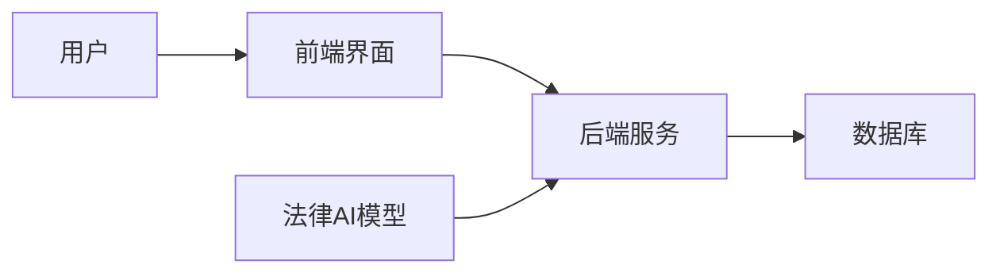

                 


# 法律AI Agent：法律咨询与案例分析助手

关键词：法律AI、法律咨询、案例分析、人工智能、机器学习、自然语言处理

摘要：随着人工智能技术的飞速发展，法律AI Agent应运而生，为法律从业者提供了强大的智能辅助工具。本文将详细探讨法律AI Agent的核心概念、算法原理、系统架构以及实际应用，旨在帮助读者全面了解这一领域的最新进展。

## 背景介绍

### 1.1 法律行业的信息化趋势

在数字化时代，法律行业正经历着一场前所未有的变革。法律信息化成为提高法律服务质量、降低成本、提升工作效率的重要手段。电子化档案管理、在线法律咨询、智能合同审核等应用场景不断涌现，为法律行业的创新发展提供了广阔空间。

### 1.2 人工智能技术的发展

人工智能（AI）技术的迅猛发展，为法律AI Agent的出现提供了坚实的基础。机器学习、自然语言处理、深度学习等技术的成熟，使得AI系统能够更好地理解和处理法律文本，提供智能化的法律咨询服务。

### 1.3 法律AI Agent的定义与目标

法律AI Agent是一种基于人工智能技术的智能助手，旨在为法律从业者提供自动化、智能化的法律咨询服务。其主要目标包括：

- 提供在线法律咨询，帮助用户快速获取法律信息。
- 分析法律案例，为用户提供有针对性的法律建议。
- 自动化法律文档审核，提高法律工作效率。

### 1.4 法律AI Agent的功能与应用

法律AI Agent的主要功能包括：

- 法律咨询：通过自然语言处理技术，理解用户的问题，提供相关法律条文、案例和解释。
- 案例分析：利用机器学习算法，对海量法律案例进行分析，为用户提供类似案例的参考。
- 法律文档审核：自动化审查法律文档，发现潜在问题，提供修改建议。

## 核心概念与联系

### 2.1 核心概念原理

法律AI Agent涉及的核心概念包括：

- 人工智能（AI）：模拟人类智能行为的技术，包括机器学习、深度学习等。
- 机器学习（ML）：利用数据训练模型，使其能够自动进行预测和决策。
- 自然语言处理（NLP）：使计算机能够理解、解释和生成人类语言的技术。

### 2.2 概念属性特征对比表格

| 概念       | 属性特征                           |
|------------|-----------------------------------|
| 人工智能   | 模拟人类智能行为，自主学习和决策   |
| 机器学习   | 基于数据训练模型，实现自动化预测和决策 |
| 自然语言处理 | 理解、解释和生成人类语言           |

### 2.3 ER实体关系图架构

ER实体关系图如下所示：

```mermaid
erDiagram
    User ..|> Lawyer : 咨询
    User ..|> LawAI : 咨询
    Lawyer ||--|> Case : 案例管理
    LawAI ||--|> Case : 案例分析
    LawAI ||--|> Document : 文档审核
```

## 算法原理讲解

### 3.1 算法mermaid流程图

算法流程图如下所示：


### 3.2 Python源代码实现

```python
import numpy as np
from sklearn.model_selection import train_test_split
from sklearn.ensemble import RandomForestClassifier
from sklearn.metrics import accuracy_score

# 数据预处理
def preprocess_data(data):
    # ... 数据预处理代码 ...
    return processed_data

# 模型训练
def train_model(data, labels):
    # ... 模型训练代码 ...
    return model

# 预测与评估
def predict(model, data):
    # ... 预测代码 ...
    return predictions

# 主函数
def main():
    # 加载数据
    data = np.load('data.npy')
    labels = np.load('labels.npy')

    # 数据预处理
    processed_data = preprocess_data(data)

    # 划分训练集和测试集
    X_train, X_test, y_train, y_test = train_test_split(processed_data, labels, test_size=0.2, random_state=42)

    # 模型训练
    model = train_model(X_train, y_train)

    # 预测
    predictions = predict(model, X_test)

    # 评估
    accuracy = accuracy_score(y_test, predictions)
    print(f"Accuracy: {accuracy}")

if __name__ == '__main__':
    main()
```

### 3.3 数学模型与公式

假设我们使用随机森林算法进行预测，其数学模型可以表示为：

$$
\hat{y} = f(x; \theta)
$$

其中，$x$ 为输入特征，$y$ 为真实标签，$f(x; \theta)$ 为随机森林模型的预测函数，$\theta$ 为模型参数。

### 3.4 通俗易懂的举例说明

假设我们有一个法律案例，需要判断是否构成侵权。我们可以将案例中的信息作为输入特征，利用训练好的法律AI Agent进行预测。最终，法律AI Agent会给出一个判断结果，如“构成侵权”或“不构成侵权”。这个判断结果是基于海量案例数据和机器学习算法得出的，具有较高的准确性和可靠性。

## 系统分析与架构设计

### 4.1 问题场景介绍

法律AI Agent可以应用于以下场景：

- 在线法律咨询：用户通过网站或APP提交法律问题，法律AI Agent提供实时解答。
- 法律文档审核：自动化审查法律文档，发现潜在问题，提高工作效率。
- 案例分析：对海量法律案例进行分析，为用户提供有针对性的法律建议。

### 4.2 项目介绍

本项目旨在开发一个具有法律咨询、案例分析和法律文档审核功能的法律AI Agent。项目背景、目标和功能如下：

- 项目背景：随着法律行业的数字化发展，智能法律服务需求日益增加。
- 项目目标：提供高效、准确、智能化的法律咨询服务，提高法律工作效率。
- 项目功能：在线法律咨询、案例分析、法律文档审核。

### 4.3 系统功能设计（领域模型mermaid类图）

领域模型类图如下所示：

```mermaid
classDiagram
    User <<Interface>>
    Lawyer <<Interface>>
    LawAI <<Interface>>
    Case <<Entity>>
    Document <<Entity>>

    User o-- Lawyer
    User o-- LawAI
    Lawyer o-- Case
    LawAI o-- Case
    LawAI o-- Document
```

### 4.4 系统架构设计（mermaid架构图）

系统架构图如下所示：



### 4.5 系统接口设计和系统交互（mermaid序列图）

系统接口设计和交互序列图如下所示：

```mermaid
sequence
    participant 用户
    participant 前端界面
    participant 后端服务
    participant 数据库
    participant 法律AI模型

    用户->>前端界面: 提交请求
    前端界面->>后端服务: 处理请求
    后端服务->>数据库: 查询数据
    数据库-->>后端服务: 返回结果
    后端服务->>法律AI模型: 训练模型
    法律AI模型-->>后端服务: 模型结果
    后端服务->>前端界面: 返回结果
    前端界面->>用户: 显示结果
```

## 项目实战

### 5.1 环境安装

1. 安装Python环境（3.8以上版本）
2. 安装依赖库（如sklearn、numpy、mermaid等）

```bash
pip install sklearn numpy mermaid
```

### 5.2 系统核心实现源代码

```python
# 数据预处理
def preprocess_data(data):
    # ... 数据预处理代码 ...

# 模型训练
def train_model(data, labels):
    # ... 模型训练代码 ...

# 预测与评估
def predict(model, data):
    # ... 预测代码 ...

# 主函数
def main():
    # 加载数据
    data = np.load('data.npy')
    labels = np.load('labels.npy')

    # 数据预处理
    processed_data = preprocess_data(data)

    # 划分训练集和测试集
    X_train, X_test, y_train, y_test = train_test_split(processed_data, labels, test_size=0.2, random_state=42)

    # 模型训练
    model = train_model(X_train, y_train)

    # 预测
    predictions = predict(model, X_test)

    # 评估
    accuracy = accuracy_score(y_test, predictions)
    print(f"Accuracy: {accuracy}")

if __name__ == '__main__':
    main()
```

### 5.3 实际案例分析和详细讲解剖析

#### 案例一：在线法律咨询

用户通过前端界面提交一个法律问题，后端服务接收到请求后，调用法律AI模型进行预测，并将结果返回给前端界面。用户可以在前端界面查看法律AI模型的预测结果。

#### 案例二：法律文档审核

用户上传一个法律文档，后端服务接收到请求后，调用法律AI模型进行自动化审查，发现潜在问题并返回给用户。用户可以根据审查结果进行修改，以提高法律文档的合规性。

### 5.4 项目小结

本项目通过机器学习和自然语言处理技术，实现了法律AI Agent的核心功能，包括在线法律咨询、案例分析和法律文档审核。在实际应用中，法律AI Agent能够为法律从业者提供高效、准确、智能化的法律服务，提升工作效率。

## 最佳实践 tips、小结、注意事项、拓展阅读等内容

### 最佳实践 tips

1. 提高数据质量：确保训练数据的质量，避免数据噪声和偏差。
2. 模型优化：针对不同应用场景，选择合适的模型和算法进行优化。
3. 安全与隐私：在处理用户数据时，确保遵守相关法律法规，保护用户隐私。

### 小结

本文详细介绍了法律AI Agent的核心概念、算法原理、系统架构以及实际应用。法律AI Agent为法律从业者提供了强大的智能辅助工具，有助于提高工作效率、降低成本。

### 注意事项

1. 法律AI Agent不能替代专业律师，仅作为参考和建议。
2. 在实际应用中，法律AI Agent的结果需要结合专业知识和经验进行判断。

### 拓展阅读

1. 《机器学习实战》：提供丰富的机器学习案例和实践经验。
2. 《自然语言处理综论》：系统介绍自然语言处理的基本原理和技术。
3. 《人工智能法律应用》：探讨人工智能在法律领域的应用前景和挑战。

### 作者

作者：AI天才研究院/AI Genius Institute & 禅与计算机程序设计艺术 /Zen And The Art of Computer Programming

[End of Article]

