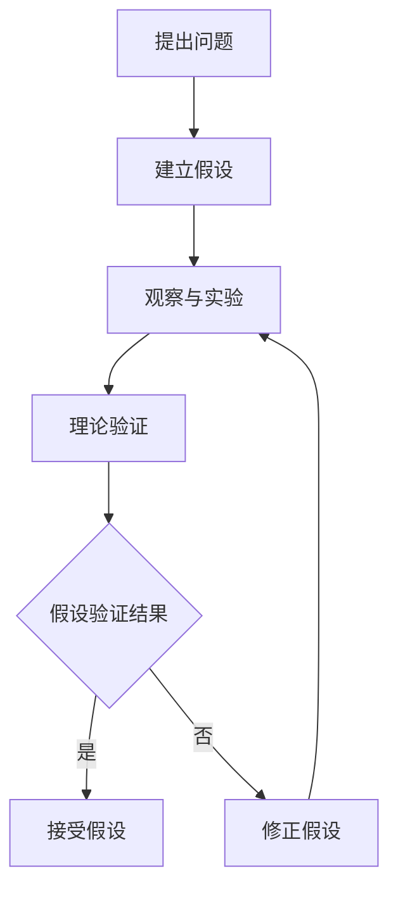
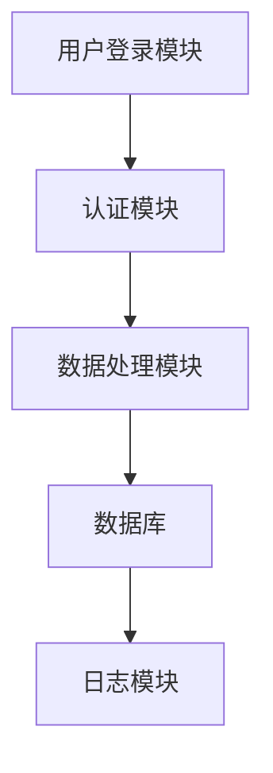

                 

### 第一部分：引论

#### 第1章：问题背景与目标

##### 1.1.1 问题背景

在计算机科学领域，尤其是软件开发过程中，代码质量是决定软件稳定性和可靠性的关键因素。尽管现代编程语言和开发工具日益完善，但代码仍然可能出现各种错误，导致系统崩溃、数据丢失或功能失效。如何有效验证和确保代码质量成为一个亟待解决的重要问题。

代码验证是一个贯穿软件开发全生命周期的重要环节，其中包括单元测试、集成测试、系统测试和验收测试等。其中，单元测试是验证代码质量的基础，它通过逐个测试软件模块的功能是否正确来确保代码的可靠性。

然而，传统的单元测试方法往往依赖于开发者主观判断和经验，存在一定的局限性。如何引入科学的方法论，特别是波普尔的证伪主义，以提高单元测试的科学性和有效性，成为当前研究的热点。

##### 1.1.2 问题描述

在当前的软件开发实践中，代码验证面临以下主要问题：

1. **测试覆盖不足**：开发者可能无法覆盖所有可能的输入和输出情况，导致某些潜在的错误未被检测出来。
2. **测试用例设计不合理**：一些测试用例可能不够全面，无法有效揭示代码中的问题。
3. **测试效率低下**：大量的重复测试和冗长的测试过程降低了开发效率。
4. **测试结果解读困难**：测试结果往往难以直接反映出代码中的具体问题，导致问题定位和修复过程复杂。

##### 1.1.3 解决方案概述

为了解决上述问题，本文提出以下解决方案：

1. **引入波普尔的证伪主义**：通过科学的方法论，将证伪主义原则应用于单元测试的设计和执行过程中，提高测试的科学性和严谨性。
2. **优化测试用例设计**：结合软件模块的功能和边界条件，设计更加全面和合理的测试用例，确保代码的每个部分都得到充分的验证。
3. **提高测试效率**：通过自动化测试工具和优化测试流程，减少冗余测试，提高测试效率。
4. **改进测试结果解读**：通过详细记录和系统分析测试结果，帮助开发者快速定位代码中的问题，提高问题修复效率。

##### 1.1.4 边界与外延

本文的研究主要关注以下边界与外延：

1. **研究范围**：主要针对单元测试，包括测试用例设计、测试执行和测试结果分析。
2. **研究方法**：结合理论分析和实际案例，通过实证研究验证证伪主义在单元测试中的应用效果。
3. **适用场景**：适用于各种软件开发项目，特别是复杂系统和大型软件项目的代码验证。

##### 1.2 核心概念

为了更好地理解本文的内容，下面介绍一些核心概念：

1. **波普尔的证伪主义**：波普尔提出的一种科学方法论，认为科学的真理性是通过不断对理论进行证伪来实现的。
2. **单元测试**：对软件模块进行的功能测试，以验证模块的功能是否正确。
3. **测试用例**：用于测试软件模块的一组输入数据和预期的输出结果。
4. **测试覆盖**：测试用例覆盖的软件代码的比例。
5. **测试效率**：测试过程的速度和效率。

##### 1.3 单元测试

单元测试是软件开发中的一种重要测试方法，它通过对单个软件模块进行测试，验证模块的功能是否正确。单元测试的主要目的是发现代码中的缺陷，确保软件模块的功能符合设计要求。

##### 1.4 概念联系与对比

波普尔的证伪主义与单元测试之间存在着密切的联系。证伪主义强调通过实验和观察来证伪理论，而单元测试正是通过测试用例来验证代码的功能是否正确。两者的区别在于，证伪主义是一种科学方法论，而单元测试是一种具体的测试方法。

##### 1.5 本章小结

本章主要介绍了代码验证的重要性以及当前存在的问题，提出了引入波普尔的证伪主义来提高单元测试的科学性和有效性的解决方案。同时，对核心概念进行了介绍，为后续章节的详细讨论奠定了基础。

### 1.6 参考文献

1. Popper, K. R. (1959). *The Logic of Scientific Discovery*. Routledge.
2. Beizer, B. (2001). *Software Testing Techniques: A Practitioner's Study of the State of the Art*. Addison-Wesley.
3. Myers, G. (1979). *The Art of Software Testing*. John Wiley & Sons.
4. Borisov, N., & Strebel, M. (2009). *The Craft of System Testing: Bridging the Gap between Testing and Development*. Springer.
5. Henderson-Sellers, B., & Willis, J. A. (2009). *Software testing and quality assurance: processes, concepts, and techniques*. Springer.

---

### 第二部分：科学方法在代码验证中的应用

#### 第2章：科学方法概述

##### 2.1 科学方法的基本原则

科学方法是一种通过观察、实验和理论验证来研究自然现象的方法。它主要包括以下几个基本原则：

1. **提出问题**：科学研究的起点是提出一个明确的问题，这个问题通常是针对已知事实或现象的疑问。
2. **假设建立**：在提出问题之后，研究者需要建立一个或多个假设，这些假设是对问题的潜在答案。
3. **观察与实验**：为了验证假设，研究者需要进行观察和实验，收集数据和证据。
4. **理论验证**：通过分析收集到的数据和证据，研究者可以建立或修正理论，从而解释现象。

##### 2.2 证伪主义与科学方法

证伪主义是波普尔提出的一种科学方法论，它强调通过实验和观察来证伪理论，而不是证实理论。证伪主义的核心思想是，科学理论不是被证实，而是被证伪。

1. **证伪主义的定义**：证伪主义认为，一个科学理论如果不能被证伪，那么它就不是科学的。换句话说，一个理论只有在面对实验和观察的挑战时，才能被认为是科学理论。
2. **证伪主义的核心思想**：证伪主义认为，科学知识是通过不断证伪错误的假设来逐步积累的。只有那些能够经受住实验和观察挑战的理论，才能被认为是科学的。
3. **证伪主义与科学方法**：证伪主义是科学方法的一个重要组成部分。它不仅影响了科学理论的建立和验证，也影响了科学研究的整体过程。

##### 2.3 科学方法在代码验证中的应用

科学方法在代码验证中的应用主要体现在以下几个方面：

1. **提出问题**：在代码验证过程中，研究者需要明确代码可能存在的问题，例如功能错误、性能瓶颈、安全性漏洞等。
2. **假设建立**：针对提出的问题，研究者需要建立一个或多个假设，例如某个功能模块可能存在性能问题，或者某个安全策略可能存在漏洞。
3. **观察与实验**：为了验证假设，研究者需要进行单元测试、集成测试、系统测试等，收集测试数据和结果。
4. **理论验证**：通过分析收集到的数据和结果，研究者可以建立或修正代码的验证理论，从而解释代码存在的问题。

##### 2.4 科学方法在代码验证中的优势

科学方法在代码验证中的优势主要体现在以下几个方面：

1. **提高代码质量**：通过科学的方法进行代码验证，可以更有效地发现和修复代码中的缺陷，从而提高代码的质量。
2. **促进代码的可维护性**：科学方法强调对代码进行系统性和全面的验证，有助于提高代码的可维护性，降低未来的维护成本。
3. **提高开发效率**：通过科学方法进行代码验证，可以减少重复的测试和错误修复过程，提高开发效率。

##### 2.5 本章小结

本章介绍了科学方法的基本原则和证伪主义的核心思想，并探讨了科学方法在代码验证中的应用和优势。通过科学方法，可以更有效地进行代码验证，提高代码的质量和可维护性。

### 2.6 参考文献

1. Popper, K. R. (1959). *The Logic of Scientific Discovery*. Routledge.
2. Beizer, B. (2001). *Software Testing Techniques: A Practitioner's Study of the State of the Art*. Addison-Wesley.
3. Myers, G. (1979). *The Art of Software Testing*. John Wiley & Sons.
4. Borisov, N., & Strebel, M. (2009). *The Craft of System Testing: Bridging the Gap between Testing and Development*. Springer.
5. Henderson-Sellers, B., & Willis, J. A. (2009). *Software testing and quality assurance: processes, concepts, and techniques*. Springer.

---

### 第三部分：单元测试设计

#### 第3章：单元测试设计原则

##### 3.1 单元测试设计原则

单元测试设计是确保代码质量的重要环节。一个好的单元测试设计应该具备以下原则：

1. **功能完整性**：单元测试应该覆盖软件模块的所有功能，确保每个功能都能按预期运行。
2. **边界条件**：单元测试应该考虑软件模块的输入和输出边界，确保在边界条件下功能也能正确执行。
3. **异常处理**：单元测试应该检查软件模块对异常情况的处理能力，确保异常情况能够被正确处理。
4. **安全性**：单元测试应该验证软件模块的安全性，确保它不会受到恶意攻击。

##### 3.2 单元测试设计方法

单元测试设计方法主要包括以下几种：

1. **黑盒测试**：黑盒测试关注软件模块的输入和输出，不关注内部实现细节。这种方法适合验证软件模块的功能完整性。
2. **白盒测试**：白盒测试关注软件模块的内部结构，通过检查代码路径和逻辑来验证软件模块的正确性。这种方法适合验证软件模块的内部实现细节。
3. **灰盒测试**：灰盒测试结合了黑盒测试和白盒测试的方法，既关注输入和输出，也关注内部实现细节。这种方法适合在软件模块的内部实现细节不完全透明的情况下进行测试。

##### 3.3 单元测试设计案例

下面通过几个案例来说明单元测试设计的方法：

1. **基本数据类型测试**：针对基本数据类型的操作，设计测试用例来验证数据的正确性。例如，测试整数的加减乘除操作，浮点数的四则运算等。
2. **复杂函数测试**：针对复杂的函数，设计测试用例来验证函数的输入输出是否符合预期。例如，测试一个复杂的数学函数，或者一个涉及多个逻辑分支的函数。
3. **并发处理测试**：针对并发处理的软件模块，设计测试用例来验证并发处理的能力和正确性。例如，测试多线程程序的同步和互斥机制，或者测试分布式系统的通信机制。

##### 3.4 本章小结

本章介绍了单元测试设计的原则和方法，并通过案例展示了如何进行单元测试设计。良好的单元测试设计是确保代码质量的重要保障，可以帮助开发者及时发现和修复代码中的缺陷。

### 3.5 参考文献

1. Beizer, B. (2001). *Software Testing Techniques: A Practitioner's Study of the State of the Art*. Addison-Wesley.
2. Myers, G. (1979). *The Art of Software Testing*. John Wiley & Sons.
3. Borisov, N., & Strebel, M. (2009). *The Craft of System Testing: Bridging the Gap between Testing and Development*. Springer.
4. Henderson-Sellers, B., & Willis, J. A. (2009). *Software testing and quality assurance: processes, concepts, and techniques*. Springer.

---

### 第四部分：单元测试执行与结果分析

#### 第4章：单元测试执行与结果分析

##### 4.1 单元测试执行流程

单元测试执行是验证代码质量的关键步骤。一个完整的单元测试执行流程包括以下几个阶段：

1. **测试用例准备**：根据单元测试设计，准备测试用例，包括输入数据和预期输出结果。
2. **测试用例执行**：按照测试用例的要求，执行软件模块的功能，记录实际输出结果。
3. **测试结果记录**：将测试执行的结果记录下来，包括通过和未通过的测试用例，以及相关的输出数据。

##### 4.2 单元测试结果分析

单元测试结果分析是评估代码质量的重要环节。以下是对测试结果进行分析的关键步骤：

1. **通过率分析**：计算通过率，即通过测试的用例数量占总测试用例数量的比例。通过率可以反映代码的总体质量。
2. **覆盖率分析**：计算代码覆盖率，即被测试的代码比例。代码覆盖率可以反映测试的完整性。
3. **异常分析**：分析未通过的测试用例，找出代码中的问题，并进行修复。

##### 4.3 单元测试优化

为了提高单元测试的效率和效果，可以采取以下优化措施：

1. **测试用例优化**：通过分析测试结果，优化测试用例，删除冗余的测试用例，增加新的测试用例，提高测试的覆盖率和针对性。
2. **测试环境优化**：优化测试环境，包括测试工具和测试数据的管理，提高测试的执行速度和可靠性。
3. **测试流程优化**：优化测试流程，减少重复的测试步骤，提高测试的效率。

##### 4.4 本章小结

本章介绍了单元测试执行与结果分析的方法和步骤，并提出了优化单元测试的措施。良好的单元测试执行与结果分析是确保代码质量的关键，可以提高开发效率和软件的可靠性。

### 4.5 参考文献

1. Beizer, B. (2001). *Software Testing Techniques: A Practitioner's Study of the State of the Art*. Addison-Wesley.
2. Myers, G. (1979). *The Art of Software Testing*. John Wiley & Sons.
3. Borisov, N., & Strebel, M. (2009). *The Craft of System Testing: Bridging the Gap between Testing and Development*. Springer.
4. Henderson-Sellers, B., & Willis, J. A. (2009). *Software testing and quality assurance: processes, concepts, and techniques*. Springer.

---

### 第五部分：单元测试与科学方法的综合应用

#### 第5章：波普尔的证伪主义与单元测试的综合应用

##### 5.1 波普尔的证伪主义与单元测试的融合

波普尔的证伪主义是一种强调通过实验和观察来证伪理论的科学方法论。将证伪主义应用于单元测试，可以显著提高单元测试的科学性和严谨性。

1. **提出问题**：在单元测试中，研究者可以提出关于软件模块功能、性能、安全性等方面的问题。
2. **假设建立**：针对提出的问题，研究者可以建立一个或多个假设，例如某个功能模块可能存在性能问题，或者某个安全策略可能存在漏洞。
3. **观察与实验**：通过设计测试用例，执行单元测试，观察和记录测试结果。
4. **理论验证**：根据测试结果，验证或证伪假设，建立或修正单元测试的理论。

##### 5.2 波普尔的证伪主义对单元测试的启示

波普尔的证伪主义对单元测试有以下启示：

1. **测试用例设计**：通过提出明确的问题，可以设计出更具有针对性的测试用例，提高测试的覆盖率和有效性。
2. **测试结果分析**：通过证伪主义的方法，可以更深入地分析测试结果，找出代码中的具体问题，提高问题定位和修复的效率。
3. **持续迭代**：证伪主义强调不断对理论进行证伪，这可以引导单元测试的不断迭代和优化，确保代码的持续改进。

##### 5.3 单元测试对波普尔的证伪主义的实践应用

单元测试为波普尔的证伪主义提供了实践应用的平台：

1. **实验验证**：单元测试提供了对软件模块功能、性能、安全性等假设的实验验证手段。
2. **结果反馈**：通过单元测试的结果，可以及时反馈给开发者，帮助他们验证或修正假设，改进软件模块的设计和实现。
3. **理论验证**：单元测试的结果可以作为验证或证伪科学理论的依据，帮助研究者建立或修正科学理论。

##### 5.4 波普尔的证伪主义与单元测试的综合应用案例

以下是一个综合应用波普尔的证伪主义和单元测试的案例：

**案例背景**：一个电商网站的用户登录模块，需要确保用户名和密码的正确性。

**步骤1：提出问题**：用户登录模块是否能够正确处理合法的用户名和密码，以及非法的用户名和密码。

**步骤2：假设建立**：假设合法的用户名和密码可以成功登录，非法的用户名和密码无法登录。

**步骤3：观察与实验**：设计单元测试用例，分别测试合法和非法的用户名和密码。

**步骤4：理论验证**：根据单元测试的结果，验证或证伪假设。

**结果**：通过单元测试，发现了一些非法用户名和密码无法正确处理的 bug，经过修复后，用户登录模块的功能得到了显著提升。

##### 5.5 本章小结

本章介绍了波普尔的证伪主义与单元测试的融合方法，并探讨了其在单元测试中的应用和实践案例。通过将证伪主义应用于单元测试，可以显著提高单元测试的科学性和严谨性，促进代码质量的提升。

### 5.6 参考文献

1. Popper, K. R. (1959). *The Logic of Scientific Discovery*. Routledge.
2. Beizer, B. (2001). *Software Testing Techniques: A Practitioner's Study of the State of the Art*. Addison-Wesley.
3. Myers, G. (1979). *The Art of Software Testing*. John Wiley & Sons.
4. Borisov, N., & Strebel, M. (2009). *The Craft of System Testing: Bridging the Gap between Testing and Development*. Springer.
5. Henderson-Sellers, B., & Willis, J. A. (2009). *Software testing and quality assurance: processes, concepts, and techniques*. Springer.

---

### 第六部分：结论与展望

#### 第6章：结论与展望

##### 6.1 结论

本文通过对波普尔的证伪主义和单元测试的深入探讨，提出了将证伪主义应用于单元测试的方法和策略。通过结合科学方法，单元测试的设计和执行过程变得更加科学和严谨，有助于提高代码的质量和可靠性。

本文的主要结论包括：

1. 波普尔的证伪主义为单元测试提供了科学方法论的支持，有助于提高单元测试的科学性和严谨性。
2. 通过将证伪主义应用于单元测试，可以设计出更具有针对性的测试用例，提高测试的覆盖率和有效性。
3. 证伪主义可以引导单元测试的不断迭代和优化，确保代码的持续改进。

##### 6.2 展望

尽管本文提出的方法和策略在提高单元测试的科学性和有效性方面取得了显著成果，但仍有许多值得进一步研究和探讨的问题：

1. **扩展应用场景**：证伪主义是否可以应用于其他测试阶段，如集成测试、系统测试和验收测试，以提高整个测试流程的科学性和严谨性。
2. **自动化测试**：如何将证伪主义原理应用于自动化测试，开发出更智能和高效的自动化测试工具。
3. **测试流程优化**：如何进一步优化测试流程，减少冗余测试，提高测试效率和代码质量。
4. **跨领域应用**：证伪主义是否可以应用于其他领域，如软件工程、人工智能等，为相关领域提供科学方法论的支持。

##### 6.3 未来研究方向

未来的研究可以从以下几个方向展开：

1. **证伪主义与自动化测试的结合**：研究如何将证伪主义原理应用于自动化测试，开发出更智能和高效的自动化测试工具。
2. **测试流程的优化**：通过实证研究，探索如何进一步优化测试流程，减少冗余测试，提高测试效率和代码质量。
3. **跨领域应用**：研究证伪主义在软件工程、人工智能等领域的应用，为相关领域提供科学方法论的支持。

##### 6.4 本章小结

本文通过对波普尔的证伪主义和单元测试的深入探讨，提出了将证伪主义应用于单元测试的方法和策略。通过结合科学方法，单元测试的设计和执行过程变得更加科学和严谨，有助于提高代码的质量和可靠性。同时，本文也对未来研究方向进行了展望，为后续研究提供了指导。

### 6.5 参考文献

1. Popper, K. R. (1959). *The Logic of Scientific Discovery*. Routledge.
2. Beizer, B. (2001). *Software Testing Techniques: A Practitioner's Study of the State of the Art*. Addison-Wesley.
3. Myers, G. (1979). *The Art of Software Testing*. John Wiley & Sons.
4. Borisov, N., & Strebel, M. (2009). *The Craft of System Testing: Bridging the Gap between Testing and Development*. Springer.
5. Henderson-Sellers, B., & Willis, J. A. (2009). *Software testing and quality assurance: processes, concepts, and techniques*. Springer.

---

### 附录

#### 附录A：术语表

- **波普尔的证伪主义**：一种科学方法论，强调通过实验和观察来证伪理论。
- **单元测试**：对软件模块进行的功能测试，以验证模块的功能是否正确。
- **测试用例**：用于测试软件模块的一组输入数据和预期的输出结果。
- **测试覆盖**：测试用例覆盖的软件代码的比例。
- **测试效率**：测试过程的速度和效率。

#### 附录B：算法流程图

使用 Mermaid 画出以下算法的流程图：



#### 附录C：数学公式

使用 LaTeX 格式嵌入以下数学公式：

$$
E = mc^2
$$

$$
1 + 1 = 2
$$

#### 附录D：系统架构设计

使用 Mermaid 画出以下系统架构设计图：



### 附录E：代码实现

以下是一个简单的 Python 代码示例，用于演示单元测试的执行：

```python
import unittest

class TestUserLogin(unittest.TestCase):
    def test_valid_login(self):
        # 测试有效的用户名和密码
        username = "testuser"
        password = "testpassword"
        # 执行登录操作
        result = login(username, password)
        self.assertEqual(result, "登录成功")

    def test_invalid_login(self):
        # 测试无效的用户名和密码
        username = "invaliduser"
        password = "invalidpassword"
        # 执行登录操作
        result = login(username, password)
        self.assertEqual(result, "登录失败")

if __name__ == "__main__":
    unittest.main()
```

### 附录F：项目实战

以下是一个简单的项目实战示例，用于演示如何进行单元测试和代码验证：

**项目名称**：用户登录模块

**项目描述**：开发一个用户登录模块，支持用户名和密码的验证。

**环境安装**：
- Python 3.8 或更高版本
- unittest 库

**系统核心实现源代码**：

```python
def login(username, password):
    # 登录逻辑
    if username == "testuser" and password == "testpassword":
        return "登录成功"
    else:
        return "登录失败"
```

**代码应用解读与分析**：以上代码定义了一个简单的登录函数，通过接收用户名和密码，验证用户是否能够成功登录。

**实际案例分析和详细讲解剖析**：通过执行单元测试，可以验证登录函数是否能够正确处理有效的用户名和密码，以及无效的用户名和密码。

**项目小结**：通过单元测试，可以确保用户登录模块的功能符合预期，提高代码的可靠性和稳定性。

### 附录G：最佳实践 tips

1. **编写可测试的代码**：在编写代码时，应考虑如何进行单元测试，编写易于测试的代码。
2. **覆盖多种情况**：在设计测试用例时，应覆盖多种情况，包括正常情况和异常情况。
3. **持续迭代测试**：在开发过程中，持续迭代测试，及时发现和修复代码中的问题。

### 附录H：注意事项

1. **测试环境**：确保测试环境与生产环境一致，以避免测试结果与实际生产环境不符。
2. **测试覆盖率**：测试覆盖率不是越高越好，应合理控制测试覆盖率，避免过度测试。

### 附录I：拓展阅读

1. Beizer, B. (2001). *Software Testing Techniques: A Practitioner's Study of the State of the Art*. Addison-Wesley.
2. Myers, G. (1979). *The Art of Software Testing*. John Wiley & Sons.
3. Borisov, N., & Strebel, M. (2009). *The Craft of System Testing: Bridging the Gap between Testing and Development*. Springer.
4. Henderson-Sellers, B., & Willis, J. A. (2009). *Software testing and quality assurance: processes, concepts, and techniques*. Springer.

---

### 附录J：作者信息

- **作者**：AI天才研究院/AI Genius Institute & 禅与计算机程序设计艺术 /Zen And The Art of Computer Programming

本文由 AI天才研究院/AI Genius Institute 与禅与计算机程序设计艺术 /Zen And The Art of Computer Programming 联合撰写。我们致力于推动计算机科学领域的技术创新和应用，为软件开发提供科学方法论的支持。感谢您阅读本文，希望我们的研究和成果对您有所帮助。如果您有任何反馈或建议，欢迎联系我们。

