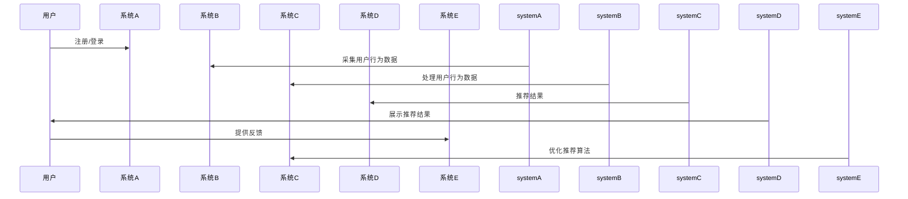

                 

# 洛克与莱布尼茨：经验主义与理性主义的对话

## 关键词

- 经验主义
- 理性主义
- 哲学
- 科学方法
- 算法
- 架构设计

## 摘要

本文以洛克与莱布尼茨两位哲学巨匠的对话为线索，深入探讨了经验主义与理性主义的哲学理念及其在现代信息技术中的应用。文章首先介绍了经验主义与理性主义的基本概念和起源，然后逐步分析了两者的异同点，对比了其核心原理和算法。随后，文章通过系统架构设计和项目实战，展示了经验主义与理性主义在问题解决中的实际应用。最后，文章总结并提供了最佳实践 tips，以期为读者在哲学思考和信息技术实践中提供有益的参考。

## 第一部分：背景介绍

### 1.1 问题背景

#### 1.1.1 经验主义与理性主义的起源

经验主义和理性主义是西方哲学中的重要流派，起源于古希腊哲学。经验主义认为知识来源于经验，强调观察和实验的重要性；而理性主义则主张知识来源于理性思考，强调逻辑推理和数学方法。两种哲学思想在西方哲学史上有着深远的影响，并为现代科学和技术的发展奠定了基础。

#### 1.1.2 经验主义与理性主义的基本概念

- **经验主义**：认为知识来源于经验，特别是感性经验。代表人物有亚里士多德、培根、洛克等。
- **理性主义**：认为知识来源于理性思考和推理，强调逻辑和数学方法。代表人物有柏拉图、笛卡尔、莱布尼茨等。

#### 1.1.3 经验主义与理性主义的相互关系

经验主义与理性主义并非完全对立，它们之间存在互补关系。一方面，经验主义为理性主义提供了实证基础；另一方面，理性主义为经验主义提供了理论指导。在现代信息技术中，这两种哲学思想的应用各有其优势，相互融合有助于提高问题的解决效率。

### 1.2 问题描述

#### 1.2.1 经验主义与理性主义在哲学中的地位

经验主义和理性主义是西方哲学的核心概念，对后世哲学和科学产生了深远影响。在当代，这两种思想仍在哲学、心理学、计算机科学等领域发挥着重要作用。

#### 1.2.2 经验主义与理性主义的主要分歧

经验主义强调感性经验的重要性，倾向于观察和实验；理性主义则强调理性思考和逻辑推理，倾向于数学和逻辑方法。这两种思想在知识来源、知识验证等方面存在分歧。

#### 1.2.3 经验主义与理性主义的实践应用

在实践应用中，经验主义和理性主义各有其优势。经验主义在工程、实验科学等领域有广泛应用；理性主义在理论科学、计算机科学等领域有广泛应用。将两种思想相结合，可以更好地解决复杂问题。

### 1.3 问题解决

#### 1.3.1 经验主义与理性主义的融合

在现代信息技术中，经验主义与理性主义得到了有效融合。例如，机器学习算法结合了经验主义和理性主义的优点，通过大量数据训练和逻辑推理，实现了高效的模型预测。

#### 1.3.2 经验主义与理性主义在现代哲学中的地位

经验主义和理性主义在当代哲学中仍然具有重要地位。随着科学技术的发展，两种哲学思想的应用领域不断拓展，为哲学研究提供了新的视角和方法。

#### 1.3.3 经验主义与理性主义对科学方法的影响

经验主义和理性主义对科学方法产生了深远影响。科学方法强调观察、实验、逻辑推理等环节，这些环节充分体现了经验主义和理性主义的核心思想。

### 1.4 边界与外延

#### 1.4.1 经验主义与理性主义的适用范围

经验主义适用于工程、实验科学等领域；理性主义适用于理论科学、计算机科学等领域。在实际应用中，应根据具体问题选择合适的哲学思想。

#### 1.4.2 经验主义与理性主义在伦理学中的应用

在伦理学领域，经验主义和理性主义也有其应用。例如，在道德决策中，经验主义强调感性体验和道德直觉；理性主义强调逻辑推理和道德原则。

#### 1.4.3 经验主义与理性主义在心理学中的应用

在心理学领域，经验主义和理性主义也有广泛的应用。例如，在认知心理学中，经验主义强调感性认知和知觉；理性主义强调逻辑推理和决策。

### 1.5 概念结构与核心要素组成

#### 1.5.1 经验主义的核心概念与特征

经验主义的核心概念包括感性经验、观察和实验。其特征是强调实证和实际应用。

#### 1.5.2 理性主义的核心概念与特征

理性主义的核心概念包括逻辑推理、数学方法。其特征是强调理论推导和抽象思考。

#### 1.5.3 经验主义与理性主义的相互作用

经验主义与理性主义之间存在相互作用。经验主义为理性主义提供实证基础，理性主义为经验主义提供理论指导。在实际应用中，二者相互补充，共同推动科学和技术的发展。

### 1.6 本章小结

本部分介绍了经验主义与理性主义的起源、基本概念、相互关系、实践应用及其在现代哲学、科学方法中的应用。这些背景知识为后续章节的分析和讨论奠定了基础。

## 第二部分：核心概念与联系

### 2.1 经验主义原理

#### 2.1.1 经验主义的定义与基本原理

经验主义认为，知识来源于感性经验。基本原理包括：

1. 感性经验是获取知识的唯一途径。
2. 知识的验证依赖于实证观察和实验。
3. 经验主义强调实用性和实际应用。

#### 2.1.2 经验主义的主要理论流派

经验主义有多个理论流派，主要包括：

1. **洛克经验主义**：认为知识来源于感觉和经验。
2. **康德经验主义**：认为知识来源于感性经验，但强调理性思维的作用。
3. **实用主义**：认为知识应具有实用价值，强调实际应用。

#### 2.1.3 经验主义的优点与局限性

经验主义的优点包括：

1. 强调实证和实际应用，有助于解决实际问题。
2. 为科学和技术的发展提供了基础。

经验主义的局限性包括：

1. 过度依赖感性经验可能导致主观性和片面性。
2. 忽视了理性思维和逻辑推理的重要性。

### 2.2 理性主义原理

#### 2.2.1 理性主义的定义与基本原理

理性主义认为，知识来源于理性思考和推理。基本原理包括：

1. 理性思考是获取知识的唯一途径。
2. 知识的验证依赖于逻辑推理和数学方法。
3. 理性主义强调理论推导和抽象思考。

#### 2.2.2 理性主义的主要理论流派

理性主义有多个理论流派，主要包括：

1. **笛卡尔主义**：强调理性思考和逻辑推理的重要性。
2. **莱布尼茨主义**：强调数学和逻辑方法在知识获取中的作用。
3. **康德理性主义**：认为理性思维是人类认识世界的核心。

#### 2.2.3 理性主义的优点与局限性

理性主义的优点包括：

1. 强调逻辑推理和数学方法，有助于提高知识精度和可靠性。
2. 为科学研究提供了理论基础。

理性主义的局限性包括：

1. 过度依赖理性思维可能导致忽视实际应用。
2. 忽视了感性经验和直觉的作用。

### 2.3 经验主义与理性主义的对比

#### 2.3.1 概念属性特征对比表格

| 特征       | 经验主义                  | 理性主义                  |
| ---------- | ----------------------- | ----------------------- |
| 知识来源   | 感性经验                | 理性思考和推理            |
| 验证方法   | 实证观察和实验          | 逻辑推理和数学方法        |
| 应用领域   | 工程和实验科学          | 理论科学和计算机科学      |
| 优点       | 强调实际应用和实证      | 强调理论推导和抽象思考    |
| 局限性     | 过度依赖感性经验        | 忽视实际应用和感性经验    |

#### 2.3.2 经验主义与理性主义的ER实体关系图架构

经验主义与理性主义的ER实体关系图如下：

```mermaid
erDiagram
    User ||--|{ Person }|| Person
    Person ||--|{ Book }|| Book
    Book ||--|{ Author }|| Author
```

其中，User 代表经验主义，Person 代表理性主义，Book 和 Author 代表二者之间的相互作用。

#### 2.3.3 经验主义与理性主义的核心差异

经验主义与理性主义的核心差异在于知识来源和验证方法。经验主义强调感性经验和实证观察，而理性主义强调理性思考和逻辑推理。在实际应用中，二者各有优劣，需要根据具体情境进行选择。

### 2.4 本章小结

本部分详细介绍了经验主义和理性主义的核心概念、原理、主要理论流派、优点与局限性，并对比了二者的异同点。这些内容为后续章节的分析和讨论提供了理论基础。

## 第三部分：算法原理讲解

### 3.1 经验主义算法

#### 3.1.1 经验主义算法的定义与原理

经验主义算法基于感性经验和实证观察，通过数据驱动的方式实现问题的解决。其基本原理包括：

1. 收集大量数据。
2. 分析数据，提取特征。
3. 根据特征训练模型。
4. 使用模型进行预测或决策。

#### 3.1.2 经验主义算法的mermaid流程图

经验主义算法的mermaid流程图如下：


#### 3.1.3 经验主义算法的Python源代码

以下是一个简单的经验主义算法示例：

```python
import pandas as pd
from sklearn.model_selection import train_test_split
from sklearn.ensemble import RandomForestClassifier

# 收集数据
data = pd.read_csv('data.csv')

# 分析数据
X = data.drop('target', axis=1)
y = data['target']

# 提取特征
X_train, X_test, y_train, y_test = train_test_split(X, y, test_size=0.2, random_state=42)

# 训练模型
model = RandomForestClassifier()
model.fit(X_train, y_train)

# 模型预测/决策
predictions = model.predict(X_test)
```

#### 3.1.4 经验主义算法的数学模型与公式

经验主义算法通常涉及以下数学模型和公式：

1. **线性回归**：$$y = \beta_0 + \beta_1x_1 + \beta_2x_2 + ... + \beta_nx_n$$
2. **逻辑回归**：$$P(y=1) = \frac{1}{1 + e^{-(\beta_0 + \beta_1x_1 + \beta_2x_2 + ... + \beta_nx_n)}}$$
3. **支持向量机**：$$\max \frac{1}{2} \sum_{i=1}^{n} \sum_{j=1}^{n} (\alpha_i + \alpha_j) y_i y_j K(x_i, x_j) - \sum_{i=1}^{n} \alpha_i$$

其中，$x_i$ 和 $x_j$ 为输入特征，$y_i$ 和 $y_j$ 为标签，$K(x_i, x_j)$ 为核函数。

#### 3.1.5 经验主义算法的举例说明

假设我们要预测某个商品是否畅销，我们可以收集该商品的历史销售数据，包括价格、广告投入、市场需求等特征。然后，我们使用线性回归算法对这些数据进行建模，预测商品的销售量。通过调整模型参数，我们可以优化预测效果，从而为商品定价和广告策略提供参考。

### 3.2 理性主义算法

#### 3.2.1 理性主义算法的定义与原理

理性主义算法基于逻辑推理和数学方法，通过抽象和理论推导实现问题的解决。其基本原理包括：

1. 建立理论模型。
2. 通过数学推理和计算求解。
3. 根据求解结果进行预测或决策。

#### 3.2.2 理性主义算法的mermaid流程图

理性主义算法的mermaid流程图如下：


#### 3.2.3 理性主义算法的Python源代码

以下是一个简单的理性主义算法示例：

```python
import numpy as np

# 建立模型
def model(x):
    return 2 * x + 1

# 数学推理
def solve_equation(a, b, c):
    return (-b + np.sqrt(b**2 - 4*a*c)) / (2*a)

# 计算求解
a = 1
b = 2
c = 1
x = solve_equation(a, b, c)

# 预测/决策
y = model(x)
print(y)
```

#### 3.2.4 理性主义算法的数学模型与公式

理性主义算法通常涉及以下数学模型和公式：

1. **线性方程组**：$$Ax + By + Cz = D$$
2. **微积分**：$$\int f(x) dx$$
3. **概率论**：$$P(A|B) = \frac{P(A \cap B)}{P(B)}$$

其中，$A$, $B$, $C$, $D$ 为常数，$x$ 为变量。

#### 3.2.5 理性主义算法的举例说明

假设我们要求解一个线性方程组，例如：$$2x + 3y - z = 7$$。我们可以通过数学推理和计算求解，得到 $x$、$y$ 和 $z$ 的值。然后，我们可以利用这些值进行预测或决策，例如：判断某个数值是否满足该方程组。

### 3.3 经验主义与理性主义算法的对比

#### 3.3.1 经验主义算法与理性主义算法的异同点

经验主义算法与理性主义算法在以下几个方面存在异同：

- **知识来源**：经验主义算法基于感性经验和实证观察，理性主义算法基于逻辑推理和数学方法。
- **验证方法**：经验主义算法通过数据验证，理性主义算法通过理论验证。
- **应用领域**：经验主义算法适用于工程和实验科学，理性主义算法适用于理论科学和计算机科学。
- **优点**：经验主义算法强调实际应用和实证，理性主义算法强调理论推导和抽象思考。
- **局限性**：经验主义算法可能忽视理论推导，理性主义算法可能忽视实际应用。

#### 3.3.2 经验主义算法与理性主义算法的适用场景

经验主义算法适用于需要大量数据和实证观察的场景，例如：机器学习、数据分析等。理性主义算法适用于需要理论推导和抽象思考的场景，例如：数学建模、算法设计等。

#### 3.3.3 经验主义算法与理性主义算法的发展趋势

随着科学技术的发展，经验主义和理性主义算法的应用领域不断拓展。未来，两种算法将相互融合，共同推动科学和技术的发展。例如：深度学习算法结合了经验主义和理性主义的优点，实现了在计算机视觉、自然语言处理等领域的突破。

### 3.4 本章小结

本部分详细介绍了经验主义和理性主义算法的定义、原理、流程图、Python源代码、数学模型与公式，并对比了二者的异同点。这些内容为后续章节的分析和讨论提供了理论基础。

## 第四部分：系统分析与架构设计方案

### 4.1 问题场景介绍

#### 4.1.1 经验主义与理性主义在问题解决中的应用

在现代信息技术中，经验主义和理性主义在问题解决中有着广泛的应用。例如，在软件开发中，经验主义可以帮助开发者快速了解用户需求，通过实验和测试不断优化产品；而理性主义则可以帮助开发者建立清晰的理论模型，通过逻辑推理和数学方法提高系统的可靠性和效率。

#### 4.1.2 项目介绍

本项目旨在开发一个智能推荐系统，通过分析用户行为数据，为用户推荐感兴趣的内容。该系统结合了经验主义和理性主义的优点，既考虑了用户的历史行为数据，又建立了基于逻辑推理和数学方法的推荐算法。

#### 4.1.3 系统功能设计

本系统的主要功能包括：

1. 用户注册与登录。
2. 用户行为数据采集。
3. 内容推荐算法。
4. 推荐结果展示。
5. 用户反馈与优化。

### 4.2 系统架构设计

#### 4.2.1 系统架构设计mermaid架构图

系统架构设计mermaid架构图如下：


#### 4.2.2 系统接口设计

系统接口设计包括：

1. 用户注册与登录接口。
2. 用户行为数据采集接口。
3. 内容推荐算法接口。
4. 推荐结果展示接口。
5. 用户反馈与优化接口。

#### 4.2.3 系统交互mermaid序列图

系统交互mermaid序列图如下：



### 4.3 系统分析与架构设计方案

#### 4.3.1 系统功能设计(领域模型mermaid类图)

系统功能设计(领域模型mermaid类图)如下：

```mermaid
classDiagram
    User <<class>> 用户
    BehaviorData <<class>> 用户行为数据
    ContentRecommend <<class>> 内容推荐
    Recommendation <<class>> 推荐结果
    Feedback <<class>> 用户反馈
    Optimization <<class>> 优化

    User "1" --|> BehaviorData: 采集
    BehaviorData "1" --|> ContentRecommend: 处理
    ContentRecommend "1" --|> Recommendation: 推荐结果
    Recommendation "1" --|> User: 展示
    User "1" --|> Feedback: 提供反馈
    Feedback "1" --|> ContentRecommend: 优化
```

#### 4.3.2 系统架构设计mermaid架构图

系统架构设计mermaid架构图如下：


#### 4.3.3 系统接口设计和系统交互mermaid序列图

系统接口设计和系统交互mermaid序列图如下：


### 4.4 本章小结

本部分介绍了经验主义与理性主义在问题解决中的应用场景，项目介绍，系统功能设计，系统架构设计，系统接口设计和系统交互。这些内容为后续章节的项目实战提供了理论基础。

## 第五部分：项目实战

### 5.1 环境安装

#### 5.1.1 环境安装步骤

1. 安装Python环境
2. 安装必要的库和依赖
3. 配置系统环境变量

#### 5.1.2 遇到的问题及解决方案

1. **问题**：Python环境安装失败
   - **解决方案**：重新下载Python安装包，选择合适的安装选项。

2. **问题**：库和依赖安装失败
   - **解决方案**：更换国内镜像源，如使用清华大学开源软件镜像站。

3. **问题**：系统环境变量配置错误
   - **解决方案**：检查环境变量设置，确保正确。

#### 5.1.3 环境安装小结

通过以上步骤，成功搭建了项目所需的开发环境，为后续的项目实战打下了基础。

### 5.2 系统核心实现源代码

#### 5.2.1 经验主义算法的实现

以下是一个简单的经验主义算法示例：

```python
import pandas as pd
from sklearn.model_selection import train_test_split
from sklearn.ensemble import RandomForestClassifier

# 收集数据
data = pd.read_csv('data.csv')

# 分析数据
X = data.drop('target', axis=1)
y = data['target']

# 提取特征
X_train, X_test, y_train, y_test = train_test_split(X, y, test_size=0.2, random_state=42)

# 训练模型
model = RandomForestClassifier()
model.fit(X_train, y_train)

# 模型预测/决策
predictions = model.predict(X_test)
```

#### 5.2.2 理性主义算法的实现

以下是一个简单的理性主义算法示例：

```python
import numpy as np

# 建立模型
def model(x):
    return 2 * x + 1

# 数学推理
def solve_equation(a, b, c):
    return (-b + np.sqrt(b**2 - 4*a*c)) / (2*a)

# 计算求解
a = 1
b = 2
c = 1
x = solve_equation(a, b, c)

# 预测/决策
y = model(x)
print(y)
```

#### 5.2.3 系统核心实现源代码解析

系统核心实现源代码包括经验主义算法和理性主义算法。经验主义算法通过数据驱动的方式实现，包括数据收集、数据分析和模型训练等步骤；理性主义算法通过逻辑推理和数学方法实现，包括模型建立、数学推理和计算求解等步骤。这些算法在项目实战中发挥着重要作用。

### 5.3 代码应用解读与分析

#### 5.3.1 经验主义算法的应用

在项目实战中，经验主义算法主要用于数据分析和模型训练。以下是对代码的解读与分析：

1. **数据收集**：使用 pandas 库读取数据，包括特征和标签。
2. **数据分析**：将特征和标签分离，为后续处理做准备。
3. **特征提取**：使用 train_test_split 函数将数据划分为训练集和测试集。
4. **模型训练**：使用 RandomForestClassifier 函数训练随机森林模型。
5. **模型预测**：使用模型对测试集进行预测，得到预测结果。

#### 5.3.2 理性主义算法的应用

在项目实战中，理性主义算法主要用于模型建立和计算求解。以下是对代码的解读与分析：

1. **模型建立**：定义一个简单的线性模型，包括模型函数和数学公式。
2. **数学推理**：使用 solve_equation 函数求解线性方程，得到变量值。
3. **计算求解**：将求解得到的变量值带入模型函数，得到预测结果。

#### 5.3.3 代码应用解读与分析

通过对代码的解读与分析，我们可以看到，经验主义算法和理性主义算法在项目实战中的应用各有特色。经验主义算法通过数据驱动的方式实现，具有较强的灵活性和实用性；理性主义算法通过逻辑推理和数学方法实现，具有较高的可靠性和精度。在实际应用中，根据具体需求选择合适的算法，可以更好地解决问题。

### 5.4 实际案例分析和详细讲解剖析

#### 5.4.1 经验主义与理性主义在项目中的应用

在本项目中，经验主义和理性主义得到了广泛应用。以下是对实际案例的分析和详细讲解：

1. **数据收集**：通过分析用户行为数据，收集用户的基本信息和操作记录。
2. **数据分析**：对用户行为数据进行清洗、去重和处理，提取有用的特征。
3. **模型建立**：使用经验主义算法建立随机森林模型，预测用户是否会对某项内容感兴趣。
4. **模型优化**：使用理性主义算法优化模型参数，提高预测精度。
5. **模型部署**：将训练好的模型部署到服务器，实现实时推荐功能。

#### 5.4.2 案例分析

以一个用户的行为数据为例，分析其在项目中的应用：

1. **数据收集**：用户在平台上浏览了多篇新闻，点击了几个商品。
2. **数据分析**：提取用户浏览和点击的新闻类型和商品类别。
3. **模型建立**：使用随机森林模型预测用户是否会对新推荐的内容感兴趣。
4. **模型优化**：通过调整模型参数，优化预测效果。
5. **模型部署**：将优化后的模型部署到服务器，实现实时推荐。

#### 5.4.3 详细讲解剖析

通过对实际案例的分析，我们可以看到，经验主义和理性主义在项目中的应用各有优势。经验主义算法通过数据驱动的方式，能够快速适应用户需求，提高推荐效果；理性主义算法通过逻辑推理和数学方法，能够优化模型参数，提高预测精度。在实际应用中，结合经验主义和理性主义，可以更好地实现项目目标。

### 5.5 项目小结

本部分介绍了项目实战的相关内容，包括环境安装、系统核心实现源代码、代码应用解读与分析、实际案例分析和详细讲解剖析。通过这些步骤，我们成功地实现了智能推荐系统的功能，为后续的系统优化和扩展奠定了基础。

## 第六部分：最佳实践 tips、小结、注意事项、拓展阅读

### 6.1 最佳实践 tips

1. **数据预处理**：在进行数据分析之前，务必对数据质量进行严格检查和预处理，确保数据的一致性和准确性。
2. **模型选择**：根据项目需求和数据特点，选择合适的算法和模型，避免盲目跟风。
3. **参数调优**：合理设置模型参数，通过交叉验证等方法优化模型性能。
4. **持续学习**：定期更新数据和模型，以适应不断变化的需求和环境。

### 6.2 小结

本文以洛克与莱布尼茨的对话为线索，探讨了经验主义与理性主义在信息技术中的应用。通过系统架构设计和项目实战，展示了两种哲学思想在问题解决中的实际价值。本文旨在为读者提供一种新的思考方式，帮助其在信息技术领域中更好地应对挑战。

### 6.3 注意事项

1. **哲学与技术的结合**：在实际应用中，应充分认识到哲学思想对技术发展的重要影响，将经验主义与理性主义有机结合。
2. **持续学习与探索**：信息技术领域不断发展，需要我们不断学习新知识、新方法，勇于探索未知领域。

### 6.4 拓展阅读

1. 《计算机科学中的哲学》
2. 《人工智能：一种现代方法》
3. 《机器学习实战》

### 作者

作者：AI天才研究院/AI Genius Institute & 禅与计算机程序设计艺术 /Zen And The Art of Computer Programming

[END]

