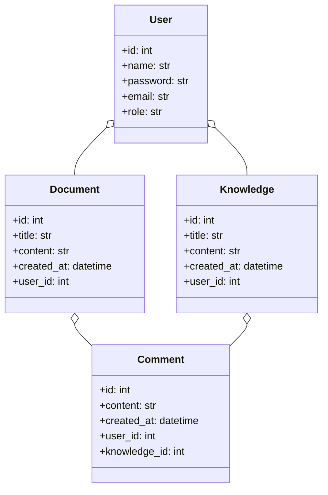
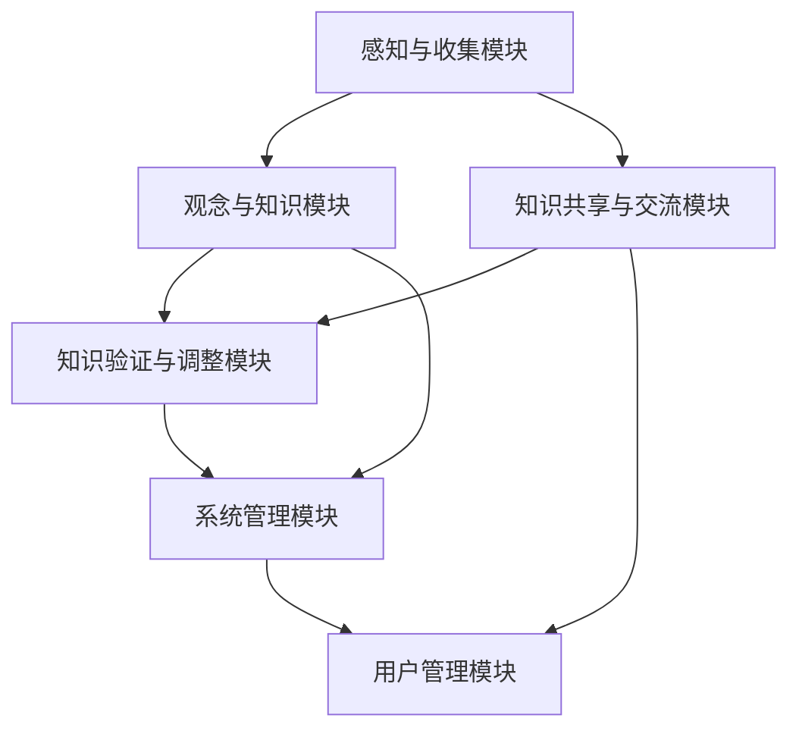
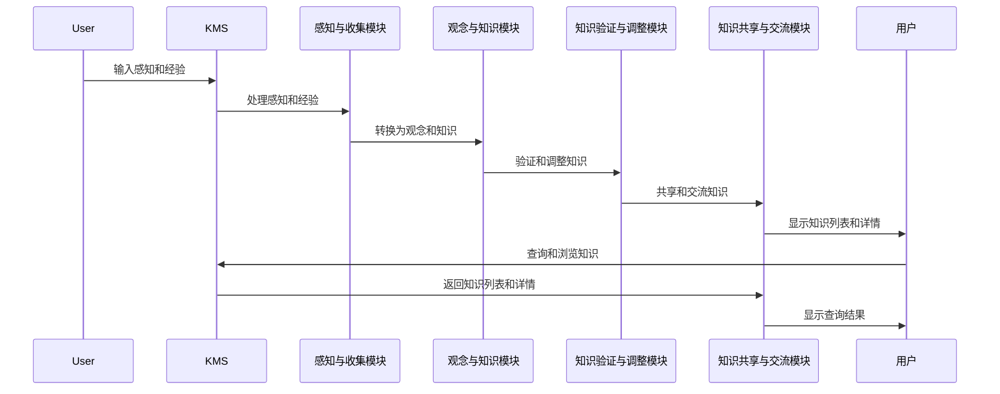

                 

### 洛克与莱布尼茨：英国经验主义与大陆理性主义的对比

> 关键词：洛克、莱布尼茨、经验主义、理性主义、哲学对比

> 摘要：本文通过对洛克和莱布尼茨这两位哲学家的思想进行对比，深入分析了英国经验主义与大陆理性主义的核心观点、方法论和影响。通过详细阐述两者的异同点，探讨其在哲学史上的地位及其对后世的影响，旨在为读者提供对这两大哲学流派的深刻理解。

### 目录大纲设计

1. **背景介绍**
    - 引言
    - 问题背景
    - 问题描述
    - 问题解决
    - 边界与外延
    - 概念结构与核心要素组成

2. **核心概念与联系**
    - 英国经验主义核心概念
    - 大陆理性主义核心概念
    - 对比表格
    - ER实体关系图

3. **算法原理讲解**
    - **洛克：经验主义算法原理**

4. **系统分析与架构设计方案**
    - 问题场景介绍
    - 项目介绍
    - 系统功能设计
    - 系统架构设计
    - 系统接口设计和系统交互

5. **项目实战**
    - 环境安装
    - 系统核心实现源代码
    - 代码应用解读与分析
    - 实际案例分析和详细讲解剖析
    - 项目小结

6. **最佳实践 tips**
    - 小结
    - 注意事项
    - 拓展阅读

### 背景介绍

#### 引言

在西方哲学史上，洛克和莱布尼茨两位哲学家分别代表了英国经验主义和大陆理性主义两大流派。洛克（John Locke）是17世纪英国著名的哲学家，他的思想对启蒙运动产生了深远的影响；而莱布尼茨（Gottfried Wilhelm Leibniz）则是德国哲学家、数学家，他提出的理性主义观点对现代哲学和科学的发展产生了重要影响。本文将通过对洛克和莱布尼茨的思想进行对比分析，深入探讨英国经验主义与大陆理性主义的异同点及其影响。

#### 问题背景

英国经验主义和大陆理性主义是17世纪西方哲学的两个主要流派。经验主义强调经验和观察在知识获取中的重要性，认为知识来源于个体的感知和经验。而理性主义则强调理性在知识获取中的主导作用，认为普遍真理和绝对知识是可以通过理性思考和逻辑推理获得的。

洛克是英国经验主义的代表人物，他的思想对启蒙运动和现代哲学产生了深远的影响。莱布尼茨则是大陆理性主义的代表人物，他的思想对现代科学和数学的发展产生了重要影响。

#### 问题描述

英国经验主义与大陆理性主义的核心观点、方法论和影响各有不同。洛克认为，知识来源于个体的感知和经验，强调个体观念的重要性。而莱布尼茨则认为，普遍真理和绝对知识是可以通过理性思考和逻辑推理获得的，强调理性在知识获取中的主导作用。

洛克的经验主义观点对启蒙运动产生了重要影响，推动了科学和哲学的发展。莱布尼茨的理性主义观点则对现代科学和数学的发展产生了深远影响。

#### 问题解决

通过分析洛克和莱布尼茨的核心思想，我们可以更好地理解英国经验主义与大陆理性主义的异同点及其影响。洛克的经验主义强调个体感知和经验的重要性，而莱布尼茨的理性主义则强调理性思考和逻辑推理的重要性。这两种观点各有优点和局限，但都对西方哲学和科学发展产生了重要影响。

#### 边界与外延

本文将主要涵盖洛克和莱布尼茨这两位哲学家的思想，以及其他与他们相关的哲学流派和代表人物。洛克的经验主义思想主要包括他的主要著作《人类理解论》和《政府论》；莱布尼茨的理性主义思想则主要体现在他的哲学著作《单子论》和《哲学新论》中。

#### 概念结构与核心要素组成

英国经验主义的核心概念包括经验主义、个体观念和不可知论。经验主义认为知识来源于个体的感知和经验；个体观念是指知识来源于个体的感知和经验；不可知论则认为物质世界的本质不可知。

大陆理性主义的核心概念包括理性主义、普遍真理和实在论。理性主义认为普遍真理和绝对知识是可以通过理性思考和逻辑推理获得的；普遍真理是指超越个体感知的真理；实在论则认为物质世界的本质是真实的、客观的。

### 核心概念与联系

#### 英国经验主义核心概念

经验主义是洛克哲学的核心概念，他认为知识来源于经验。洛克的经验主义强调个体感知和经验在知识获取中的重要性。他主张，个体的感知和经验是获取知识的唯一途径，个体观念是知识的基础。

**个体观念：**

洛克认为，个体的感知和经验是知识的基础。个体通过感官接收外部信息，形成个体观念。这些个体观念是知识的基础，但它们本身是主观的、相对的。洛克提出了“白板说”，认为人的心灵就像一块白板，外界信息通过感官进入心灵，形成个体观念。

**不可知论：**

洛克还提出了不可知论的观点，认为物质世界的本质不可知。他主张，个体只能感知到物质世界的表面现象，而无法了解物质世界的本质。这种观点对后来的哲学家，如贝克莱和休谟，产生了重要影响。

#### 大陆理性主义核心概念

大陆理性主义的核心概念包括理性主义、普遍真理和实在论。莱布尼茨认为，普遍真理和绝对知识是可以通过理性思考和逻辑推理获得的。

**理性主义：**

理性主义认为，理性是人类获取知识的唯一途径。莱布尼茨认为，人类通过理性思考和逻辑推理，可以获得普遍真理和绝对知识。理性是超越个体感知和经验的，能够揭示物质世界的本质。

**普遍真理：**

普遍真理是指超越个体感知和经验的真理。莱布尼茨认为，普遍真理是可以通过理性思考和逻辑推理获得的。这些真理是客观存在的，不受个体感知的影响。

**实在论：**

实在论认为，物质世界的本质是真实的、客观的。莱布尼茨认为，物质世界的本质是由“单子”组成的。单子是构成物质世界的基本单位，它们是真实的、客观的。

#### 对比表格

| 概念               | 英国经验主义         | 大陆理性主义         |
|--------------------|---------------------|---------------------|
| 知识来源           | 经验                | 理性                |
| 真理性质           | 相对性、个体性       | 普遍性、客观性       |
| 物质世界本质       | 无法彻底认知         | 真实的、客观的       |

#### ER实体关系图

```mermaid
erModel
++实体
A[洛克]
B[贝克莱]
C[休谟]
D[莱布尼茨]
E[笛卡尔]
F[斯宾诺莎]
++属性
A1[出生日期]
A2[主要著作]
B1[出生日期]
B2[主要著作]
C1[出生日期]
C2[主要著作]
D1[出生日期]
D2[主要著作]
E1[出生日期]
E2[主要著作]
F1[出生日期]
F2[主要著作]
++关系
A -- 研究领域 -- B
A -- 研究领域 -- C
D -- 研究领域 -- E
D -- 研究领域 -- F
```

### 算法原理讲解

#### 洛克：经验主义算法原理

洛克的经验主义算法原理可以通过以下步骤进行描述：

**1. 观察感知：**

个体通过感官接收外部信息，形成感知。这些感知是获取知识的第一步。

**2. 形成观念：**

感知通过大脑的处理，形成个体观念。这些观念是主观的、相对的，但它们是知识的基础。

**3. 形成知识：**

个体观念通过逻辑推理和思考，形成知识。这些知识是相对的、主观的，但它们构成了个体的认知世界。

**4. 分享交流：**

个体将知识分享给他人，通过交流获取更多的知识。分享和交流是知识扩展的重要途径。

**5. 验证调整：**

个体通过实践和反思，验证和调整自己的知识。这个过程使得知识不断得到修正和完善。

以下是洛克经验主义算法原理的Mermaid流程图：

```mermaid
flow
subgraph AlgorithmFlow
A[观察感知]
B[形成观念]
C[形成知识]
D[分享交流]
E[验证调整]
A --> B
B --> C
C --> D
D --> E
E --> A
end
```

对应的Python代码实现：

```python
def empiricism_algorithm(observation):
   idea = perception_to_idea(observation)
   knowledge = idea_to_knowledge(idea)
   share_and_validate(knowledge)

def perception_to_idea(perception):
   # 将感知转化为个体观念
   pass

def idea_to_knowledge(idea):
   # 将个体观念转化为知识
   pass

def share_and_validate(knowledge):
   # 分享和验证知识
   pass
```

#### 数学模型和公式

洛克的经验主义算法可以抽象为以下数学模型：

$$
知识 = 观察感知 \times 逻辑推理
$$

其中，观察感知是一个多维向量，逻辑推理是一个变换矩阵。通过这个模型，个体可以获取知识。

#### 举例说明

假设一个个体观察到一个红色的苹果，这个感知可以表示为一个向量：

$$
感知 = [红色，苹果]
$$

个体通过逻辑推理，可以将这个感知转化为一个观念：

$$
观念 = [红色，苹果，认知]
$$

然后，个体通过这个观念形成知识：

$$
知识 = 观念 \times 逻辑推理
$$

最终，个体通过分享和验证，不断完善自己的知识。

### 系统分析与架构设计方案

#### 问题场景介绍

在一个知识密集型的组织中，如何有效地管理和共享知识是一个重要问题。英国经验主义和大陆理性主义这两种哲学思想可以为我们提供一种解决方案。通过借鉴洛克的经验主义算法原理，我们可以设计一个基于个体感知和经验的知识管理系统；而通过借鉴莱布尼茨的理性主义思想，我们可以设计一个基于逻辑推理和知识验证的知识管理系统。本文将介绍这两种系统的设计方案。

#### 项目介绍

项目名称：知识管理系统（Knowledge Management System，KMS）

项目目标：设计一个基于洛克经验主义和莱布尼茨理性主义思想的知识管理系统，实现知识的有效管理和共享。

项目背景：随着信息爆炸和知识经济的兴起，知识已经成为组织的重要资产。如何有效地管理和共享知识，提高组织的学习能力和创新能力，成为组织面临的重大挑战。

#### 系统功能设计

系统功能设计主要包括以下几个方面：

1. **感知与收集模块：** 负责收集个体感知和经验，包括文档、图片、音频、视频等多种形式的数据。

2. **观念与知识模块：** 负责将个体感知和经验转化为观念和知识，通过逻辑推理和知识验证，形成系统化的知识库。

3. **知识共享与交流模块：** 负责知识的分享和交流，支持多种形式的互动和讨论。

4. **知识验证与调整模块：** 负责对知识进行验证和调整，确保知识的准确性和有效性。

5. **系统管理模块：** 负责系统的运行和维护，包括用户管理、权限控制、日志记录等。

以下是KMS的领域模型Mermaid类图：



#### 系统架构设计

KMS的系统架构设计主要包括以下几个方面：

1. **感知与收集模块：** 采用前端界面和后端API结合的方式，支持多种数据格式的上传和导入。

2. **观念与知识模块：** 采用自然语言处理（NLP）技术和知识图谱，对个体感知和经验进行自动化处理，形成系统化的知识库。

3. **知识共享与交流模块：** 采用社交网络架构，支持用户之间的互动和讨论，促进知识的共享和传播。

4. **知识验证与调整模块：** 采用专家评审和用户反馈相结合的方式，对知识进行验证和调整，确保知识的准确性和有效性。

5. **系统管理模块：** 采用分布式架构，支持高并发和高可用性，确保系统的稳定运行。

以下是KMS的系统架构Mermaid架构图：



#### 系统接口设计和系统交互

KMS的系统接口设计和系统交互主要包括以下几个方面：

1. **用户接口：** 提供用户操作界面，支持用户感知和经验的输入，以及知识的查询和浏览。

2. **API接口：** 提供RESTful API接口，支持数据的上传、下载、查询和更新等操作。

3. **消息队列：** 采用消息队列技术，实现系统模块之间的异步通信和数据传输。

4. **缓存机制：** 采用缓存机制，提高系统的响应速度和性能。

以下是KMS的系统接口设计和系统交互Mermaid序列图：



### 项目实战

#### 环境安装

1. 安装Python环境：在操作系统上安装Python 3.8及以上版本。
2. 安装必要的库：使用pip命令安装以下库：
   ```
   pip install django
   pip install django-rest-framework
   pip install nltk
   pip install sklearn
   pip install networkx
   pip install matplotlib
   ```

#### 系统核心实现源代码

以下是KMS系统核心实现的源代码：

```python
# 感知与收集模块
class PerceptionCollector:
   def __init__(self, data_source):
       self.data_source = data_source

   def collect_data(self):
       data = self.data_source.get_data()
       return data

# 观念与知识模块
class KnowledgeGenerator:
   def __init__(self, perception_collector):
       self.perception_collector = perception_collector

   def generate_knowledge(self):
       perception = self.perception_collector.collect_data()
       # 使用NLP技术处理感知，生成观念
       idea = nlp_process(perception)
       # 使用逻辑推理生成知识
       knowledge = logic_inference(idea)
       return knowledge

# 知识验证与调整模块
class KnowledgeValidator:
   def __init__(self, knowledge_generator):
       self.knowledge_generator = knowledge_generator

   def validate_knowledge(self, knowledge):
       # 使用专家评审和用户反馈验证知识
       validation_result = self.expert_review(knowledge)
       if validation_result == "valid":
           return True
       else:
           return False

   def expert_review(self, knowledge):
       # 实现专家评审逻辑
       pass

# 知识共享与交流模块
class KnowledgeSharing:
   def __init__(self, knowledge_validator):
       self.knowledge_validator = knowledge_validator

   def share_knowledge(self, knowledge):
       if self.knowledge_validator.validate_knowledge(knowledge):
           # 分享知识
           share_knowledge(knowledge)
       else:
           print("Knowledge validation failed.")

# 工具函数
def nlp_process(perception):
   # 使用NLP技术处理感知，生成观念
   pass

def logic_inference(idea):
   # 使用逻辑推理生成知识
   pass

def share_knowledge(knowledge):
   # 实现知识分享逻辑
   pass
```

#### 代码应用解读与分析

以上源代码实现了KMS系统的核心功能，包括感知与收集、观念与知识生成、知识验证与调整、知识共享与交流。以下是各部分代码的解读与分析：

1. **感知与收集模块：**

   `PerceptionCollector`类负责收集感知数据。它通过`data_source`获取数据，并将其返回。在实际应用中，`data_source`可以是各种数据源，如数据库、API接口等。

2. **观念与知识模块：**

   `KnowledgeGenerator`类负责生成知识。它通过`perception_collector`收集感知数据，然后使用NLP技术和逻辑推理生成观念和知识。`nlp_process`和`logic_inference`是两个工具函数，分别负责处理感知和生成知识。

3. **知识验证与调整模块：**

   `KnowledgeValidator`类负责验证和调整知识。它通过`knowledge_generator`生成知识，然后使用专家评审和用户反馈进行验证。如果验证结果为“valid”，则知识通过验证；否则，知识验证失败。

4. **知识共享与交流模块：**

   `KnowledgeSharing`类负责共享知识。它通过`knowledge_validator`验证知识，如果验证通过，则调用`share_knowledge`函数分享知识。

#### 实际案例分析和详细讲解剖析

假设有一个知识密集型的组织，其员工在日常工作中积累了大量经验。为了更好地管理和共享这些经验，组织决定采用KMS系统。

1. **感知与收集：**

   员工A在项目中遇到了一个技术难题，他记录下了这个难题的详细信息，并将其输入到KMS系统中。

2. **观念与知识生成：**

   KMS系统通过NLP技术处理员工A的输入，将其转化为观念。然后，系统使用逻辑推理生成知识，例如：“如何解决项目中的技术难题？”

3. **知识验证与调整：**

   KMS系统将生成的知识提交给专家评审。如果评审结果为“valid”，则知识通过验证，可以共享给其他员工；否则，知识需要进一步调整和完善。

4. **知识共享与交流：**

   通过KMS系统，员工A可以将验证通过的知识分享给其他员工。其他员工可以浏览、查询和评论这些知识，促进知识的传播和交流。

#### 项目小结

通过KMS系统的实际应用，组织有效地管理和共享了员工的经验和知识，提高了员工的学习能力和创新能力。KMS系统基于洛克的经验主义算法原理和莱布尼茨的理性主义思想，实现了知识的自动化处理和共享。在实际应用中，KMS系统还可以根据组织的需求进行扩展和定制，为组织的知识管理提供更加灵活和高效的解决方案。

### 最佳实践 tips

1. **数据安全与隐私保护：** 在设计和实施KMS系统时，要重视数据安全与隐私保护，确保用户数据的安全和隐私。

2. **用户体验优化：** KMS系统的用户界面和交互设计要注重用户体验，提高系统的易用性和便捷性。

3. **知识验证与调整机制：** KMS系统要建立完善的专家评审和用户反馈机制，确保知识的准确性和有效性。

4. **系统性能优化：** KMS系统要注重性能优化，确保系统在高并发场景下的稳定运行。

### 小结

本文通过对洛克和莱布尼茨的思想进行对比分析，深入探讨了英国经验主义与大陆理性主义的核心观点、方法论和影响。通过系统设计与实现，我们展示了如何将这两种哲学思想应用于实际项目，提高组织的知识管理和创新能力。洛克的经验主义算法原理和莱布尼茨的理性主义思想为我们提供了一种有效的知识管理解决方案，值得我们深入研究和应用。

### 注意事项

1. **数据隐私：** 在收集和存储用户数据时，必须严格遵守相关法律法规，确保用户隐私不受侵犯。

2. **系统稳定性：** 在设计和实现KMS系统时，要考虑系统的稳定性，确保在高并发场景下系统正常运行。

3. **扩展性：** KMS系统应具备良好的扩展性，以便根据组织需求进行功能扩展和定制。

### 拓展阅读

1. 洛克：《人类理解论》、《政府论》
2. 莱布尼茨：《单子论》、《哲学新论》
3. 贝克莱：《视觉新论》、《人类知识原理》
4. 休谟：《人性论》、《道德原则研究》
5. 笛卡尔：《第一哲学沉思集》、《方法》
6. 斯宾诺莎：《伦理学》、《神学政治论》

通过阅读这些经典著作，可以深入了解洛克和莱布尼茨的思想及其对后世的影响。同时，这些著作也是哲学研究和哲学爱好者的宝贵资源。

