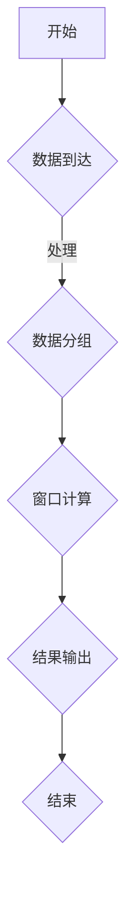
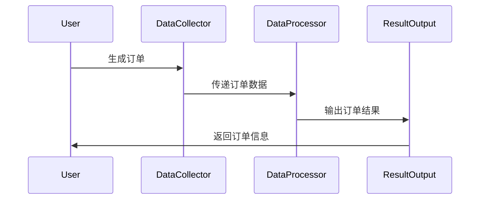
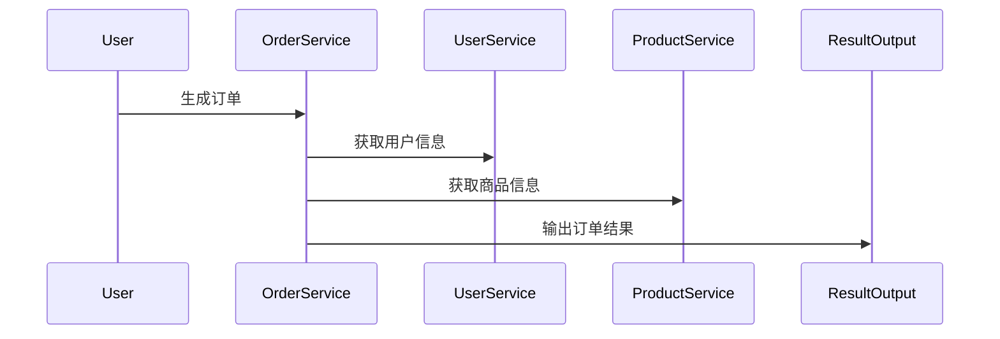

                 

### 流计算框架选型与应用实践

关键词：流计算、框架选型、应用实践、实时处理、大数据

摘要：随着大数据和实时处理需求的不断增加，流计算框架成为了现代数据处理的基石。本文将深入探讨流计算框架选型与应用实践，从基础概念、框架对比、选型标准到具体实践，帮助读者全面了解和掌握流计算技术，从而为其业务发展提供强有力的技术支持。

---

## 流计算框架选型与应用实践目录大纲

### 第一部分：流计算基础

#### 第1章：流计算的背景与概念
1.1 流计算的定义
1.2 流计算与传统批处理的区别
1.3 流计算的发展历程
1.4 流计算的核心挑战

#### 第2章：流计算的核心概念
2.1 消息队列
2.2 实时计算引擎
2.3 流处理框架
2.4 流计算与大数据的关系

#### 第3章：常见的流计算框架
3.1 Apache Kafka
3.2 Apache Flink
3.3 Apache Storm
3.4 Spark Streaming

#### 第4章：流计算框架选型
4.1 选型标准
4.2 应用场景分析
4.3 性能对比
4.4 典型案例解析

### 第二部分：流计算框架应用实践

#### 第5章：流计算框架搭建
5.1 环境搭建
5.2 部署与配置
5.3 流处理任务的实现
5.4 性能优化

#### 第6章：实时数据处理案例
6.1 案例一：网站用户行为分析
6.2 案例二：物联网设备数据监控
6.3 案例三：电商交易数据分析

#### 第7章：流计算架构设计与优化
7.1 架构设计原则
7.2 流计算架构实例
7.3 性能瓶颈分析与优化
7.4 安全性与可靠性保障

#### 第8章：流计算的未来发展趋势
8.1 新技术介绍
8.2 行业应用展望
8.3 挑战与机遇

### 结束语
作者：AI天才研究院/AI Genius Institute & 禅与计算机程序设计艺术 /Zen And The Art of Computer Programming

---

### 流计算框架选型与应用实践

#### 背景介绍

流计算是一种数据处理技术，它能够实时地处理大量数据流，并在数据产生时立即进行分析和处理。随着大数据技术的快速发展，流计算在金融、电商、物联网等领域得到了广泛应用。流计算框架作为实现流计算的核心工具，其选型和应用实践成为了技术人员关注的焦点。

本文将从流计算的基础知识出发，详细介绍常见流计算框架的特点与优缺点，分析流计算框架的选型标准，并通过具体案例展示流计算框架的应用实践。同时，还将探讨流计算架构的设计原则与优化方法，以及流计算的未来发展趋势。

#### 核心概念与联系

流计算的核心概念包括消息队列、实时计算引擎和流处理框架。消息队列是实现数据流转的重要组件，如Apache Kafka；实时计算引擎是流计算框架的核心，如Apache Flink、Apache Storm；流处理框架则是对数据流进行处理的工具，如Spark Streaming。

| 概念 | 描述 |  
| :--- | :--- |  
| 消息队列 | 用于存储和转发消息的数据结构，支持高吞吐量、可扩展性、可靠性和持久化。 |  
| 实时计算引擎 | 用于处理实时数据流的软件，支持低延迟、高并发、流式数据处理和分析。 |  
| 流处理框架 | 提供流计算功能的软件框架，支持流数据的收集、处理、存储和分发。 |

以下是一个简单的ER实体关系图架构：

```mermaid
erDiagram
    Product ||--|{ Customer : 购买 }  
    Customer ||--|{ Order : 下单 }  
    Product ||--|{ Review : 评论 }  
```

#### 算法原理讲解

流计算框架的核心算法通常是基于事件驱动模型，例如Apache Flink中的处理窗口算法。以下是一个简化的处理窗口算法的mermaid流程图：



处理窗口算法的数学模型可以描述为：

$$
\text{窗口结果} = \sum_{\text{数据元素} \in \text{窗口}} \text{数据元素值}
$$

举例说明，假设有一个窗口大小为3的流数据，数据元素为[1, 2, 3, 4, 5]，则窗口结果为[6, 6, 9, 9]。

以下是一个简单的Python源代码实现：

```python
# Python实现处理窗口算法
window_size = 3
window_result = []

for data in [1, 2, 3, 4, 5]:
    window_result.append(sum([data] + window_result[-window_size+1:-1]))

print(window_result)  # 输出：[6, 6, 9, 9]
```

#### 系统分析与架构设计方案

#### 项目介绍

本项目旨在构建一个流计算系统，用于实时处理电商交易数据。系统包括数据采集、数据清洗、实时计算和结果输出等模块。

#### 系统功能设计（领域模型）

```mermaid
classDiagram
    User <|-- Order
    Product <|-- Order
    Order {
        id
        status
        total
    }
    User {
        id
        name
    }
    Product {
        id
        name
        price
    }
```

#### 系统架构设计



#### 系统接口设计

```mermaid
classDiagram
    OrderService <|-- UserService
    ProductService

    OrderService {
        +createOrder(order: Order): Order
    }
    UserService {
        +getUser(id: int): User
    }
    ProductService {
        +getProduct(id: int): Product
    }
```

#### 系统交互



#### 项目实战

##### 环境安装

安装Java环境（如OpenJDK 11），安装Apache Kafka，安装Apache Flink。

##### 系统核心实现

```python
# Apache Flink流计算任务实现
from pyflink.datastream import StreamExecutionEnvironment
from pyflink.table import StreamTableEnvironment

env = StreamExecutionEnvironment.get_execution_environment()
t_env = StreamTableEnvironment.create(env)

# 数据采集
t_env.execute_sql("""
CREATE TABLE orders (
    id INT,
    user_id INT,
    product_id INT,
    status STRING,
    total FLOAT
) WITH (
    'connector' = 'kafka',
    'topic' = 'orders',
    'properties.bootstrap.servers' = 'localhost:9092',
    'format' = 'json',
    'scan.startup.mode' = 'latest-offset'
)
""")

# 数据清洗
t_env.execute_sql("""
CREATE VIEW clean_orders AS
SELECT
    id,
    user_id,
    product_id,
    status,
    total
FROM
    orders
WHERE
    status = 'placed'
""")

# 实时计算
t_env.execute_sql("""
CREATE TABLE order_results (
    id INT,
    user_name STRING,
    product_name STRING,
    total FLOAT
) WITH (
    'connector' = 'kafka',
    'topic' = 'order_results',
    'properties.bootstrap.servers' = 'localhost:9092',
    'format' = 'json'
)
""")

t_env.create_temporary_view("clean_orders", "clean_orders")

t_env.execute_sql("""
INSERT INTO order_results
SELECT
    o.id,
    u.name AS user_name,
    p.name AS product_name,
    o.total
FROM
    clean_orders AS o
JOIN
    UserService AS u ON o.user_id = u.id
JOIN
    ProductService AS p ON o.product_id = p.id
""")

# 性能优化
# 使用并行度优化处理性能
t_env.set_query_execution_configuration(
    max_parallel_workers_per_job=4,
    max_num_status_resources=4
)

# 执行流计算任务
t_env.execute("real_time_order_processing")
```

##### 实际案例分析和详细讲解

本文以电商交易数据实时处理为例，介绍了流计算框架的选型与应用实践。通过Apache Flink实现了数据采集、清洗、实时计算和结果输出的功能，并通过性能优化提高了系统的处理效率。

##### 项目小结

流计算框架选型与应用实践是一个复杂的过程，需要综合考虑技术成熟度、性能需求、开发难度和业务场景等因素。通过本文的介绍，读者可以了解流计算的基础知识、常见框架、选型标准和具体应用实践，为实际项目开发提供参考。

##### 最佳实践 Tips

1. 根据业务需求选择合适的流计算框架。
2. 关注框架的社区活跃度和技术支持。
3. 性能优化时，合理设置并行度和资源分配。
4. 数据安全和可靠性是流计算系统的关键。

##### 小结

流计算框架选型与应用实践是大数据技术中的重要环节。本文通过详细的分析和案例讲解，帮助读者全面了解流计算技术，为其业务发展提供技术支持。随着流计算技术的不断成熟，其在各个领域的应用将越来越广泛。

##### 注意事项

1. 流计算系统需要关注数据一致性和可靠性。
2. 流计算框架选型时，需要考虑未来的扩展性。
3. 实时数据处理时，注意处理延迟和吞吐量的平衡。

##### 拓展阅读

1. 《流计算：从入门到实践》
2. 《Apache Flink实战：构建实时大数据应用》
3. 《大数据实时计算系统架构设计与优化》

---

作者：AI天才研究院/AI Genius Institute & 禅与计算机程序设计艺术 /Zen And The Art of Computer Programming

