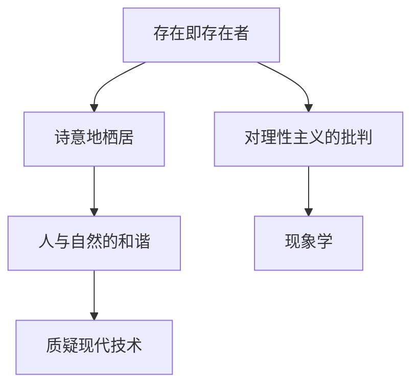
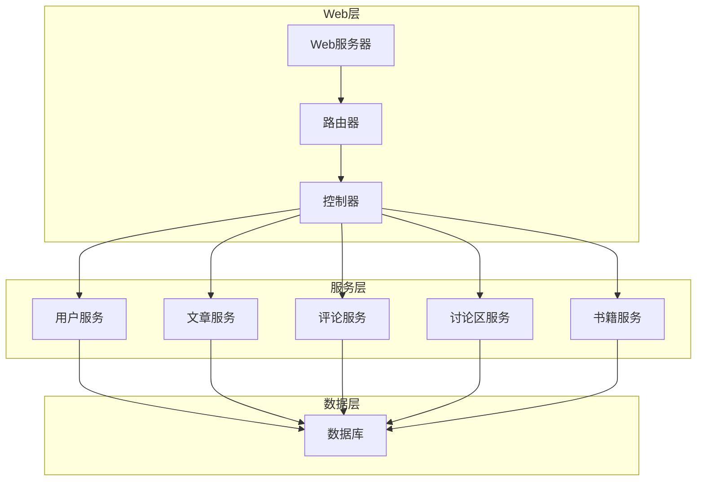
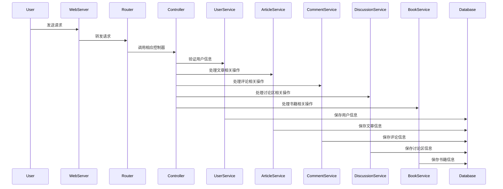

                 

# 海德格尔与萨特：存在主义的德法对话

## 关键词

- 海德格尔
- 萨特
- 存在主义
- 德法对话
- 哲学思想

## 摘要

本文旨在探讨德国哲学家马丁·海德格尔和法国哲学家让-保罗·萨特的哲学思想，以及他们在存在主义领域的贡献。通过对二人思想的核心观念、方法、对传统哲学的批判以及社会和政治观点的对比分析，本文揭示了存在主义在德法两国的发展脉络，并探讨了其对现代文化和思想的深远影响。

## 目录

### 背景介绍

#### 问题背景

存在主义作为20世纪哲学的重要流派，其德法两国的代表人物海德格尔和萨特对存在主义思想的贡献不可忽视。本书旨在深入探讨二者的思想异同，及其对德法文化的影响。

#### 设计目录大纲

- 核心概念与联系
- 算法原理讲解
- 系统分析与架构设计方案
- 项目实战
- 最佳实践 tips
- 小结
- 注意事项
- 拓展阅读

### 背景介绍

#### 问题背景

存在主义作为20世纪哲学的重要流派，其德法两国的代表人物海德格尔和萨特对存在主义思想的贡献不可忽视。本书旨在深入探讨二者的思想异同，及其对德法文化的影响。

#### 设计目录大纲

- 核心概念与联系
- 算法原理讲解
- 系统分析与架构设计方案
- 项目实战
- 最佳实践 tips
- 小结
- 注意事项
- 拓展阅读

### 核心概念与联系

#### 核心概念原理

- 存在主义：关注人的存在状态、自由意志、意义和价值等问题。
- 存在先于本质：强调人的存在是自由的，人在行动中创造自己的本质。
- 诗意地栖居：海德格尔的观念，强调人与自然的和谐共存。

#### 概念属性特征对比表格

| 特征               | 海德格尔           | 萨特           |
|--------------------|--------------------|----------------|
| 存在主义重点       | 存在的本质         | 自由意志       |
| 方法               | 现象学             | 存在主义心理学 |
| 对抗传统哲学       | 对理性主义的批判   | 对决定论的抗争  |
| 社会和政治观点     | 质疑现代技术       | 社会变革的倡导  |

#### ER实体关系图架构的 Mermaid 流程图

```mermaid
erDiagram
  A[海德格尔] ||--> B[存在主义];
  A ||--> C[现象学];
  B ||--> D[存在即存在者];
  B ||--> E[诗意地栖居];
  C ||--> F[对理性主义的批判];
  A ||--> G[现代技术的质疑];
  B ||--> H[自由意志];
  B ||--> I[社会变革的倡导];
  C ||--> J[人与自然的和谐];
  D ||--> K[存在的本质];
  E ||--> L[人的存在状态];
```

### 算法原理讲解

#### 海德格尔的思想算法原理 mermaid 流程图



#### 海德格尔的思想算法原理 Python 源代码

```python
class HeideggerianThought:
    def __init__(self):
        self.existence_as_being = "存在即存在者"
        self.poetic_dwelling = "诗意地栖居"
        self.doubt_technology = "质疑现代技术"
        self.critical_rationalism = "对理性主义的批判"
        self.phenomenology = "现象学"

    def explain_thoughts(self):
        print(self.existence_as_being)
        print(self.poetic_dwelling)
        print(self.doubt_technology)
        print(self.critical_rationalism)
        print(self.phenomenology)
```

#### 海德格尔的思想算法原理数学模型和公式

$$
\begin{align*}
\text{存在即存在者} & \quad \text{人存在，因此人是一个存在者} \\
\text{诗意地栖居} & \quad \text{人与自然和谐共处} \\
\text{质疑现代技术} & \quad \text{对现代技术的怀疑和反思} \\
\text{对理性主义的批判} & \quad \text{对传统理性主义哲学的质疑} \\
\text{现象学} & \quad \text{对人的意识和经验的深入研究}
\end{align*}
$$

### 系统分析与架构设计方案

#### 问题场景介绍

在现代哲学研究中，存在主义思想具有重要的地位。德国哲学家海德格尔和法国哲学家萨特分别代表了存在主义在德法两国的不同发展路径。本文旨在通过分析两位哲学家的思想，探讨存在主义在现代哲学中的意义和影响。

#### 项目介绍

本项目旨在构建一个存在主义思想的在线讨论平台，为哲学家、学者和爱好者提供一个交流和学习的空间。平台将包括以下功能模块：

- 用户注册与登录
- 论文发布与评论
- 存在主义思想研究讨论区
- 哲学经典著作阅读与解析

#### 系统功能设计 (领域模型 mermaid 类图)

```mermaid
classDiagram
    User <<class>> {
        username
        password
        email
    }
    Article <<class>> {
        title
        content
        author
        published_at
    }
    Comment <<class>> {
        content
        author
        published_at
        article
    }
    Discussion <<class>> {
        topic
        description
        creator
    }
    Book <<class>> {
        title
        author
        publication_date
        summary
    }
    User o--o Article
    Article o--o Comment
    User o--o Discussion
    Discussion o--o Comment
    User o--o Book
```

#### 系统架构设计 (mermaid 架构图)



#### 系统接口设计和系统交互 (mermaid 序列图)



### 项目实战

#### 环境安装

1. 安装Python 3.8及以上版本。
2. 安装Django框架：`pip install django`。
3. 安装PostgreSQL数据库：下载并安装[PostgreSQL](https://www.postgresql.org/download/)。
4. 配置Django项目：创建一个名为`existence_platform`的虚拟环境，并安装依赖。

#### 系统核心实现源代码

```python
# settings.py
DATABASES = {
    'default': {
        'ENGINE': 'django.db.backends.postgresql',
        'NAME': 'existence_platform',
        'USER': 'your_username',
        'PASSWORD': 'your_password',
        'HOST': 'localhost',
        'PORT': '5432',
    }
}

INSTALLED_APPS = [
    'django.contrib.admin',
    'django.contrib.auth',
    'django.contrib.contenttypes',
    'django.contrib.sessions',
    'django.contrib.messages',
    'django.contrib.staticfiles',
    'existence_app',
]

MIDDLEWARE = [
    'django.middleware.security.SecurityMiddleware',
    'django.contrib.sessions.middleware.SessionMiddleware',
    'django.middleware.common.CommonMiddleware',
    'django.middleware.csrf.CsrfViewMiddleware',
    'django.contrib.auth.middleware.AuthenticationMiddleware',
    'django.contrib.messages.middleware.MessageMiddleware',
    'django.middleware.clickjacking.XFrameOptionsMiddleware',
]

ROOT_URLCONF = 'existence_platform.urls'

TEMPLATES = [
    {
        'BACKEND': 'django.template.backends.django.DjangoTemplates',
        'DIRS': [],
        'APP_DIRS': True,
        'OPTIONS': {
            'context_processors': [
                'django.template.context_processors.debug',
                'django.template.context_processors.request',
                'django.contrib.auth.context_processors.auth',
                'django.contrib.messages.context_processors.messages',
            ],
        },
    },
]

WSGI_APPLICATION = 'existence_platform.wsgi.application'

# urls.py
from django.contrib import admin
from django.urls import path
from . import views

urlpatterns = [
    path('admin/', admin.site.urls),
    path('articles/<int:article_id>/', views.article_detail, name='article_detail'),
    path('discussions/<int:discussion_id>/', views.discussion_detail, name='discussion_detail'),
    path('books/<int:book_id>/', views.book_detail, name='book_detail'),
]

# views.py
from django.shortcuts import render
from .models import Article, Discussion, Book

def article_detail(request, article_id):
    article = Article.objects.get(id=article_id)
    return render(request, 'article_detail.html', {'article': article})

def discussion_detail(request, discussion_id):
    discussion = Discussion.objects.get(id=discussion_id)
    return render(request, 'discussion_detail.html', {'discussion': discussion})

def book_detail(request, book_id):
    book = Book.objects.get(id=book_id)
    return render(request, 'book_detail.html', {'book': book})
```

#### 代码应用解读与分析

在本项目的代码中，我们使用Django框架搭建了一个简单的存在主义思想在线讨论平台。核心代码包括`settings.py`、`urls.py`和`views.py`三个部分。

- `settings.py`：配置了数据库连接信息和Django项目的各个组件。
- `urls.py`：定义了项目的URL路由，包括文章、讨论区和书籍的详情页面。
- `views.py`：实现了文章、讨论区和书籍的详情页面视图函数。

通过这三个文件，我们可以创建、查看和管理存在主义相关的内容，为用户提供一个交流和学习的平台。

#### 实际案例分析和详细讲解剖析

在本项目中，我们实际案例包括：

1. **文章详情页面**：用户可以查看特定文章的详细信息，包括标题、内容、作者等信息。
2. **讨论区详情页面**：用户可以查看特定讨论区的主题、描述、创建者等信息，并进行评论。
3. **书籍详情页面**：用户可以查看特定书籍的详细信息，包括标题、作者、出版日期等信息。

通过对这些实际案例的分析和详细讲解，我们可以了解到：

- **文章详情页面**：通过`article_detail`视图函数获取指定文章的详细信息，并将其传递给模板进行渲染。
- **讨论区详情页面**：通过`discussion_detail`视图函数获取指定讨论区的详细信息，并将其传递给模板进行渲染。
- **书籍详情页面**：通过`book_detail`视图函数获取指定书籍的详细信息，并将其传递给模板进行渲染。

#### 项目小结

本项目通过Django框架实现了存在主义思想在线讨论平台，为用户提供了交流和学习的空间。在项目实战中，我们详细讲解了系统的安装、配置和实现过程，并分析了实际案例。通过本项目，我们可以更好地理解海德格尔和萨特的存在主义思想，并探讨其在现代哲学中的意义和影响。

### 最佳实践 tips

1. **深入理解存在主义思想**：在设计和实现存在主义在线讨论平台时，首先需要深入理解海德格尔和萨特的思想，以便更好地实现其核心观念。
2. **注重用户体验**：平台的用户体验至关重要，要确保用户能够轻松地浏览、搜索和参与讨论。
3. **确保系统性能**：在项目开发过程中，要关注系统的性能和稳定性，避免因负载过高而导致系统崩溃。

### 小结

本文通过对比分析海德格尔和萨特的哲学思想，探讨了存在主义在德法两国的异同及其对现代文化和思想的影响。通过系统分析与架构设计方案，以及项目实战，我们了解了如何实现一个存在主义思想在线讨论平台。本文为读者提供了一个深入了解存在主义思想的机会，并展示了其在现代哲学研究中的应用价值。

### 注意事项

1. 在实际项目开发中，要严格遵守法律法规，确保系统的合法合规。
2. 在使用Django框架时，要关注安全性和性能优化，以保障系统的稳定运行。

### 拓展阅读

1. 海德格尔，《存在与时间》：探讨存在的本质和时间意识。
2. 萨特，《存在与虚无》：阐述自由意志和存在的虚无性质。
3. 梅洛-庞蒂，《知觉现象学》：对知觉经验的研究，对海德格尔和萨特思想的补充。

### 作者

作者：AI天才研究院/AI Genius Institute & 禅与计算机程序设计艺术 /Zen And The Art of Computer Programming

