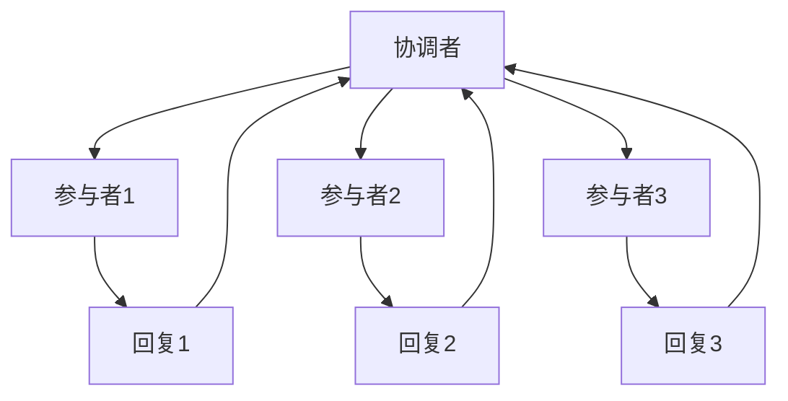
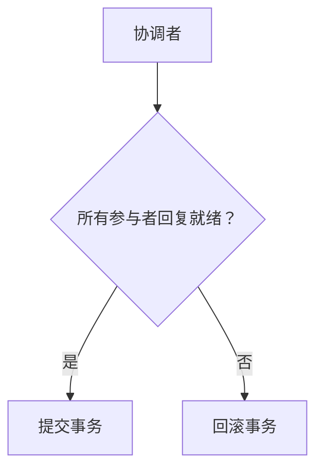
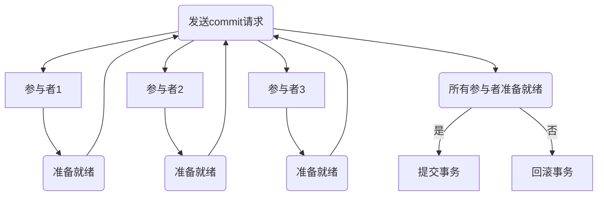
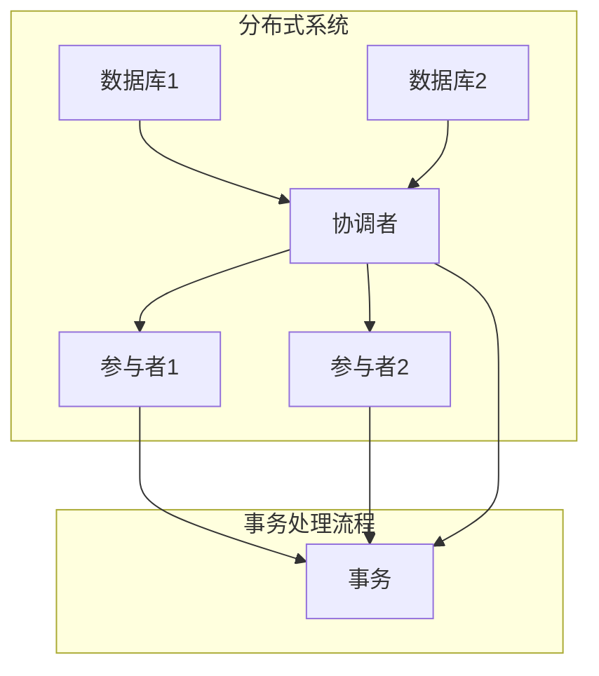
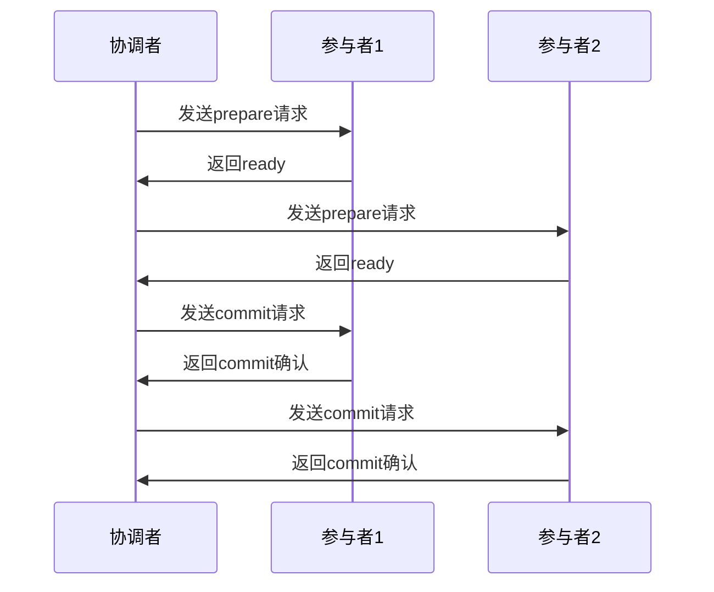
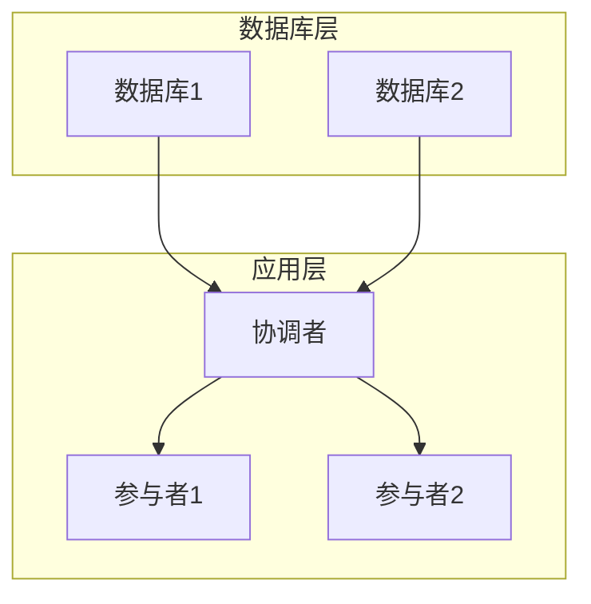

                 


## 深刻认知分布式事务原理

### 关键词

- 分布式事务
- 数据一致性
- 隔离性
- 两阶段提交
- 分布式系统

### 摘要

分布式事务是现代分布式系统中至关重要的一环，确保了跨多个节点的数据一致性。本文将深入探讨分布式事务的原理，包括其定义、面临的挑战、核心概念、解决方案及其实现。通过详细的案例分析，读者将获得对分布式事务的深刻理解，并掌握其最佳实践。

## 第1章 引言

### 1.1 分布式事务背景

#### 1.1.1 分布式系统概述

分布式系统是由多个独立的计算机节点组成的系统，这些节点通过网络进行通信，共同完成计算任务。分布式系统的核心目标是实现高可用性、高性能和可扩展性。

#### 1.1.2 分布式事务的定义与重要性

分布式事务是指在分布式系统中，多个操作被视为一个整体，这些操作要么全部成功，要么全部失败。分布式事务的重要性在于它确保了跨多个节点的数据一致性。

### 1.2 分布式事务面临的问题

#### 1.2.1 数据一致性问题

在分布式系统中，数据的一致性问题主要体现在跨节点的数据更新上。如何保证在多个节点上的数据更新是一致的，是一个巨大的挑战。

#### 1.2.2 隔离性问题

隔离性是指在一个分布式事务中，不同操作之间的相互影响应该最小。如何在分布式系统中实现有效的隔离性，是一个关键问题。

#### 1.2.3 分布式事务的挑战

分布式事务的挑战主要包括网络延迟、节点故障和数据复制等。如何解决这些挑战，是分布式系统设计者必须面对的问题。

## 第2章 核心概念与联系

### 2.1 全局事务与本地事务

#### 2.1.1 全局事务的定义

全局事务是指在一个分布式系统中，跨多个节点的操作序列。全局事务必须保证所有操作要么全部成功，要么全部失败。

#### 2.1.2 本地事务的定义

本地事务是指在一个单个数据库节点中执行的操作序列。本地事务通常具有较好的隔离性和一致性。

#### 2.1.3 全局事务与本地事务的关系

全局事务通常由多个本地事务组成。全局事务的成功依赖于所有本地事务的成功。

### 2.2 两阶段提交协议

#### 2.2.1 两阶段提交的基本原理

两阶段提交协议是一种分布式事务管理协议，它通过两个阶段来保证事务的一致性。第一阶段是准备阶段，第二阶段是提交阶段。

#### 2.2.2 两阶段提交的过程

**第一阶段：准备阶段**

1. 协调者发送prepare请求给所有参与者。
2. 参与者回复准备就绪或无法执行。

**第二阶段：提交阶段**

1. 协调者根据参与者的回复决定是否提交事务。
2. 如果所有参与者都准备就绪，协调者发送提交请求。
3. 参与者执行事务，并通知协调者。

#### 2.2.3 两阶段提交的优缺点

**优点：**

- 确保事务一致性。
- 可以处理网络分区。

**缺点：**

- 可能产生死锁。
- 性能较低。

### 2.3 分布式事务的其他解决方案

#### 2.3.1 最终一致性模型

最终一致性模型是一种分布式事务解决方案，它允许在多个节点上的数据最终达到一致，但不需要实时一致。

#### 2.3.2 脏读检测

脏读检测是一种隔离性解决方案，它通过检测未提交的修改来确保数据的一致性。

#### 2.3.3 多版本并发控制（MVCC）

多版本并发控制是一种通过存储多个版本数据来提高并发性和一致性的方法。

## 第3章 算法原理讲解

### 3.1 两阶段提交算法流程

#### 3.1.1 提交请求阶段

在提交请求阶段，协调者向所有参与者发送prepare请求。



#### 3.1.2 接受请求阶段

在接收请求阶段，协调者根据参与者的回复决定是否提交事务。



### 3.2 Python代码展示

```python
# 代码示例：两阶段提交协议实现

class Coordinator:
    def prepare(self, participants):
        responses = [participant.prepare() for participant in participants]
        if all(response == 'ready' for response in responses):
            return 'commit'
        else:
            return 'abort'

class Participant:
    def prepare(self):
        # 实现准备逻辑
        return 'ready'

coordinator = Coordinator()
participants = [Participant() for _ in range(3)]
result = coordinator.prepare(participants)
print(result)
```

### 3.3 Mermaid流程图



### 3.4 数学模型和公式

两阶段提交协议可以用以下数学模型来描述：

$$
\begin{aligned}
&\text{第一阶段：} \\
&X_i = \{ X_i^0 = \text{预备提交}, TID \} \\
&Y_i = \{ X_i^1 = \text{提交}, TID \} \\
&\text{第二阶段：} \\
&Z_i = \{ Y_i^1 = \text{提交确认}, TID \}
\end{aligned}
$$

### 3.5 算法原理详细讲解

#### 3.5.1 两阶段提交协议的流程

两阶段提交协议分为两个阶段：准备阶段和提交阶段。

**准备阶段：**

1. **协调者发送prepare请求：** 协调者向所有参与者发送prepare请求，参与者收到请求后，根据自身状态判断是否能够执行事务。如果参与者能够执行，则返回"ready"，否则返回"can't execute"。

2. **参与者回复prepare响应：** 参与者根据自身状态回复协调者。如果所有参与者都返回"ready"，则协调者进入提交阶段；如果有参与者返回"can't execute"，则协调者进入回滚阶段。

**提交阶段：**

1. **协调者发送commit请求：** 如果所有参与者都返回"ready"，协调者向所有参与者发送commit请求。

2. **参与者执行事务：** 接收到commit请求后，参与者执行事务。

3. **参与者发送commit确认：** 执行完事务后，参与者向协调者发送commit确认。

4. **协调者完成事务：** 接收到所有参与者的commit确认后，协调者完成事务。

#### 3.5.2 两阶段提交协议的数学模型

两阶段提交协议可以用以下数学模型来描述：

$$
\begin{aligned}
&\text{第一阶段：} \\
&X_i = \{ X_i^0 = \text{预备提交}, TID \} \\
&Y_i = \{ X_i^1 = \text{提交}, TID \} \\
&\text{第二阶段：} \\
&Z_i = \{ Y_i^1 = \text{提交确认}, TID \}
\end{aligned}
$$

其中，$X_i$ 表示参与者 $i$ 在第一阶段发送的消息，$Y_i$ 表示参与者 $i$ 在第二阶段发送的消息，$Z_i$ 表示参与者 $i$ 在第二阶段接收到的消息。

#### 3.5.3 两阶段提交协议的举例说明

假设有一个分布式事务，包含三个参与者：协调者 $C$ 和参与者 $P_1$、$P_2$。以下是一个两阶段提交协议的例子：

1. **第一阶段：**

   - 协调者 $C$ 向参与者 $P_1$ 发送prepare请求。
   - 参与者 $P_1$ 接收到prepare请求后，返回"ready"。
   - 协调者 $C$ 向参与者 $P_2$ 发送prepare请求。
   - 参与者 $P_2$ 接收到prepare请求后，返回"ready"。
   - 协调者 $C$ 接收到所有参与者的prepare响应，进入提交阶段。

2. **第二阶段：**

   - 协调者 $C$ 向所有参与者发送commit请求。
   - 参与者 $P_1$ 接收到commit请求后，执行事务并返回commit确认。
   - 参与者 $P_2$ 接收到commit请求后，执行事务并返回commit确认。
   - 协调者 $C$ 接收到所有参与者的commit确认后，完成事务。

通过以上例子，我们可以看到两阶段提交协议是如何保证分布式事务的一致性的。

## 第4章 系统分析与架构设计

### 4.1 问题场景介绍

#### 4.1.1 分布式事务的常见场景

在分布式系统中，常见的分布式事务场景包括：

1. 跨数据库的事务：例如，一个订单系统中的订单表和库存表分布在不同的数据库中。
2. 跨表的事务：例如，一个电商网站中的商品表和订单表位于同一数据库，但需要进行联合操作。
3. 跨节点的事务：例如，一个分布式缓存系统中的多个缓存节点需要同时更新。

#### 4.1.2 项目目标与挑战

项目目标：

- 确保分布式事务的一致性。
- 提高系统的可用性和性能。

挑战：

- 数据一致性问题：如何在多个节点之间保持数据的一致性。
- 隔离性问题：如何实现多个事务之间的隔离性。
- 性能问题：如何在保证一致性和隔离性的同时，提高系统的性能。

### 4.2 系统功能设计

#### 4.2.1 领域模型类图

```mermaid
classDiagram
    Participant <<class{参与者}>> 
    Coordinator <<class{协调者}>> 
    Transaction <<class{事务}>> 
    Database <<class{数据库}>> 

    Participant "1" --* "1" Transaction
    Coordinator "1" --* "1" Transaction
    Database "1" --* "1" Transaction
```

#### 4.2.2 系统架构设计



#### 4.2.3 系统接口设计



### 4.3 系统架构图



## 第5章 项目实战

### 5.1 环境安装说明

为了实践分布式事务，我们需要搭建一个简单的分布式系统环境。以下是在Linux环境下安装和配置分布式事务所需的基础步骤：

1. **安装MySQL数据库：**

   - 使用包管理器安装MySQL服务器和客户端。
   - 配置MySQL数据库以支持分布式事务。

2. **安装Python环境：**

   - 安装Python 3.8及以上版本。
   - 安装分布式事务相关的Python库，如`pymysql`和`分布式事务库`。

3. **配置分布式事务框架：**

   - 配置分布式事务协调者和服务器的通信机制。
   - 配置数据库参数以支持分布式事务。

### 5.2 系统核心实现源代码展示

以下是使用Python实现两阶段提交协议的示例代码：

```python
class Coordinator:
    def __init__(self, participants):
        self.participants = participants
        self.prepared = set()

    def prepare(self):
        for participant in self.participants:
            participant.prepare()
            self.prepared.add(participant)

    def commit(self):
        if len(self.prepared) == len(self.participants):
            for participant in self.participants:
                participant.commit()
        else:
            for participant in self.participants:
                participant.abort()

class Participant:
    def prepare(self):
        # 实现准备逻辑
        print("Participant prepared")
        return "ready"

    def commit(self):
        # 实现提交逻辑
        print("Participant committed")

    def abort(self):
        # 实现回滚逻辑
        print("Participant aborted")
```

### 5.3 对源代码的解读与分析

在上述代码中，`Coordinator` 类负责协调分布式事务的执行。它通过调用参与者的 `prepare` 方法来准备事务，然后根据参与者的响应决定是否提交或回滚事务。

`Participant` 类代表分布式系统中的参与者。它的 `prepare` 方法表示参与者准备执行事务，`commit` 方法表示提交事务，`abort` 方法表示回滚事务。

### 5.4 实际案例分析和详细讲解剖析

假设我们有一个订单系统，其中订单表和库存表分布在两个不同的数据库中。以下是如何使用两阶段提交协议确保分布式事务的一致性的案例：

1. **事务开始：**

   - 协调者发送prepare请求给订单表数据库和库存表数据库。
   - 两个数据库参与者返回ready。

2. **事务执行：**

   - 协调者收到所有参与者的ready响应后，发送commit请求。
   - 订单表数据库执行订单插入操作，库存表数据库执行库存更新操作。
   - 两个数据库参与者返回commit确认。

3. **事务提交：**

   - 协调者收到所有参与者的commit确认后，完成事务。
   - 订单和库存数据保持一致性。

如果某个参与者无法执行事务，协调者将发送abort请求，导致事务回滚，保证数据的一致性。

### 5.5 项目小结

通过上述实践，我们可以看到分布式事务在分布式系统中的重要性。使用两阶段提交协议，我们可以确保跨多个节点的数据一致性，从而实现分布式事务的正确执行。然而，两阶段提交协议也存在性能问题，因此在实际应用中，我们可以考虑使用其他分布式事务解决方案，如最终一致性模型和多版本并发控制。

## 第6章 最佳实践 Tips、小结、注意事项、拓展阅读

### 最佳实践 Tips

1. **选择合适的分布式事务解决方案：** 根据业务需求，选择合适的分布式事务解决方案，如两阶段提交协议、最终一致性模型等。
2. **优化数据库参数：** 调整数据库参数，如事务隔离级别、锁策略等，以优化分布式事务的性能。
3. **监控分布式事务：** 监控分布式事务的执行情况，及时发现和解决潜在问题。

### 小结

本文深入探讨了分布式事务的原理，包括定义、挑战、解决方案和实现。通过详细的案例分析和代码示例，读者可以更好地理解分布式事务的工作机制，并掌握最佳实践。

### 注意事项

1. **分布式事务的一致性：** 在实现分布式事务时，确保数据的一致性是非常重要的。
2. **性能优化：** 分布式事务可能会对系统性能产生影响，需要通过优化来提高性能。

### 拓展阅读

1. **《分布式系统原理与范型》：** 了解分布式系统的基本原理和设计模式。
2. **《两阶段提交协议：算法原理与实践》：** 深入学习两阶段提交协议的算法原理和实践方法。

## 结语

作者：AI天才研究院/AI Genius Institute & 禅与计算机程序设计艺术 /Zen And The Art of Computer Programming

本文通过对分布式事务的深入探讨，旨在为读者提供全面的理解和实践指导。希望本文能帮助您在分布式系统开发中更好地处理事务一致性挑战。如需进一步学习和研究，请参考推荐阅读。感谢您的阅读！

