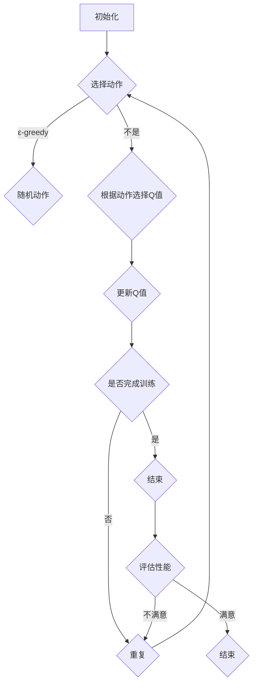
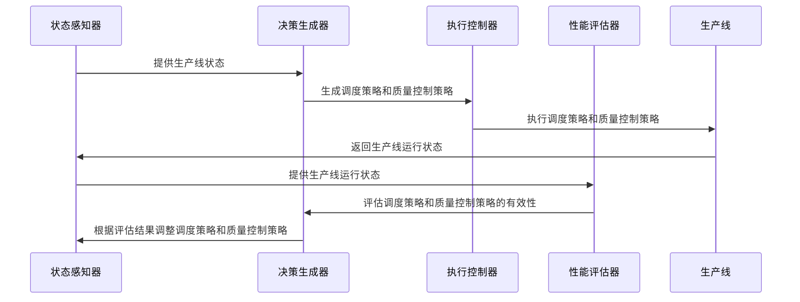
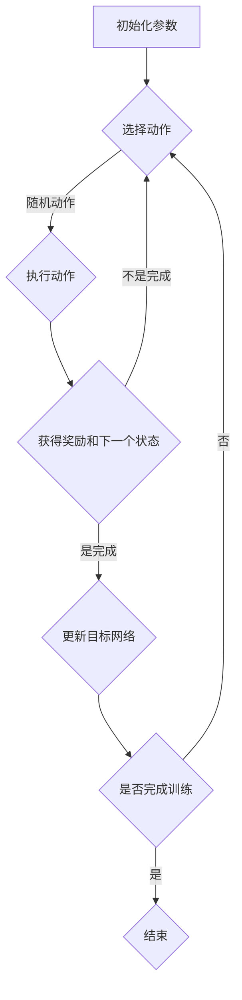
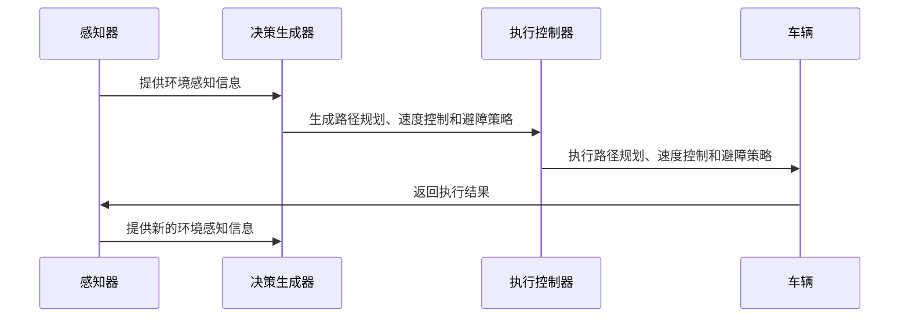

                 

# 深度强化学习在AI Agent控制中的应用

## 关键词
- 深度强化学习
- AI Agent
- 控制应用
- 机器人控制
- 无人机控制
- 自动化生产线

## 摘要
本文旨在探讨深度强化学习在AI Agent控制中的应用。首先，我们将介绍深度强化学习的基础知识，包括其基本原理、核心算法以及与机器学习的关系。接着，我们将详细探讨深度强化学习在控制领域的应用基础，包括AI Agent基础、控制理论概述以及深度强化学习在控制中的应用场景和挑战。随后，我们将通过具体案例，展示深度强化学习在机器人控制、无人机控制以及自动化生产线控制中的实践应用。最后，我们将总结最佳实践，并提出未来研究的方向。

---

## 第一部分：深度强化学习基础

### 第1章：深度强化学习概述

### 1.1 问题背景

在人工智能领域，自主决策和控制一直是研究的热点。传统的方法如规则推理、模型预测等在面对复杂环境时往往表现出不足。近年来，深度强化学习（Deep Reinforcement Learning, DRL）作为一种结合深度学习和强化学习的方法，因其强大的自适应能力和在复杂环境中的学习能力而受到了广泛关注。

深度强化学习通过模拟人类的学习过程，让智能体在与环境的交互中不断学习优化策略，从而实现自主决策和控制。这一方法在自动驾驶、机器人控制、游戏AI等领域都展现出了巨大的潜力。

### 1.2 深度强化学习原理

深度强化学习的基本原理是：智能体通过不断与环境互动，根据环境的反馈（奖励或惩罚）来调整自身的策略，以达到最大化长期奖励的目标。深度强化学习的核心概念包括状态（State）、动作（Action）、奖励（Reward）和策略（Policy）。

- **状态**：智能体当前所处的环境描述。
- **动作**：智能体可以执行的行为。
- **奖励**：环境对智能体动作的反馈，可以是正值（奖励）或负值（惩罚）。
- **策略**：智能体根据当前状态选择动作的规则。

深度强化学习通过将状态和动作映射到高维特征空间，利用深度神经网络（DNN）学习状态值函数（State-Value Function）或策略网络（Policy Network），从而实现对环境的自适应控制。

### 1.3 深度强化学习与机器学习的关系

深度强化学习是机器学习的一个重要分支，它与传统的机器学习方法有着紧密的联系和区别。

- **联系**：深度强化学习和传统的机器学习方法（如监督学习和无监督学习）一样，都是通过数据来学习模型。但深度强化学习增加了对环境的交互和探索机制。
- **区别**：传统的机器学习方法主要依赖于已标注的数据集，而深度强化学习则需要通过与环境互动来获取反馈，这使得它在处理未知或动态环境时具有更大的灵活性。

### 1.4 深度强化学习的发展历程

深度强化学习的发展历程可以分为几个阶段：

- **初期的强化学习**：主要包括Q-Learning和SARSA算法，这些方法通过迭代更新策略来学习最优行为。
- **深度神经网络的引入**：Deep Q-Network（DQN）算法将深度神经网络引入到强化学习中，通过神经网络来近似状态值函数，从而提高了学习效率和收敛速度。
- **策略网络的优化**：Policy Gradient算法通过直接优化策略网络，避免了值函数估计的复杂性，但面临着梯度消失和梯度爆炸等问题。
- **深度强化学习的最新进展**：近年来，Actor-Critic方法、Deep Deterministic Policy Gradients（DDPG）等算法的出现，进一步提高了深度强化学习在复杂环境中的表现。

### 第2章：深度强化学习算法

在这一章中，我们将深入探讨深度强化学习的核心算法，包括Q-Learning、SARSA、DQN和Policy Gradient等。

#### 2.1 Q-Learning算法

Q-Learning算法是一种基于值的方法，通过迭代更新Q值来学习最优策略。其基本思想是：对于给定状态s和动作a，智能体选择使得Q值最大的动作a'，并在执行动作后根据环境的奖励r和新的状态s'来更新Q值。

$$
Q(s, a) \leftarrow Q(s, a) + \alpha [r + \gamma \max_{a'} Q(s', a') - Q(s, a)]
$$

其中，$\alpha$是学习率，$\gamma$是折扣因子。

#### 2.2 SARSA算法

SARSA（State-Action-Reward-State-Action）算法是一种基于策略的方法，它与Q-Learning类似，但直接根据新的状态和动作来更新策略。其更新规则为：

$$
\pi(s, a) \leftarrow \begin{cases} 
\pi(s, a) + \alpha [\frac{r}{Q(s, a)} - \pi(s, a)] & \text{if } a = \arg\max_a Q(s, a) \\
\pi(s, a) & \text{otherwise}
\end{cases}
$$

其中，$\pi(s, a)$是智能体在状态s下选择动作a的概率。

#### 2.3 Deep Q-Network（DQN）算法

DQN算法将深度神经网络引入到Q-Learning中，通过神经网络来近似状态值函数。DQN的主要挑战是如何避免神经网络过拟合，以及如何处理经验回放和目标网络的更新。

$$
\hat{Q}(s, a) = \frac{1}{N}\sum_{i=1}^{N} \hat{r}_i + \gamma \max_{a'} \hat{Q}(s', a')
$$

其中，$\hat{Q}(s, a)$是神经网络估计的Q值，$\hat{r}_i$是第i个时间步的奖励。

#### 2.4 Policy Gradient算法

Policy Gradient算法通过直接优化策略网络来学习最优策略。其基本思想是：通过梯度上升法，根据奖励信号来更新策略网络参数。

$$
\theta \leftarrow \theta + \alpha \nabla_{\theta} J(\theta)
$$

其中，$J(\theta)$是策略网络的总奖励，$\theta$是策略网络参数。

### 第3章：深度强化学习应用基础

在这一章中，我们将探讨深度强化学习在控制领域的应用基础，包括AI Agent基础、控制理论概述以及深度强化学习在控制中的应用场景和挑战。

#### 3.1 AI Agent基础

AI Agent是指具有自主决策能力的智能实体，它可以感知环境、执行动作并从环境中获取反馈。AI Agent通常由以下部分组成：

- **感知器**：用于感知环境状态。
- **决策器**：根据当前状态和策略选择动作。
- **执行器**：执行决策器选择的动作。
- **奖励机制**：用于评估动作的好坏。

#### 3.2 控制理论概述

控制理论是研究系统控制的一门学科，其目的是使系统按预期行为运行。在控制理论中，常见的系统模型包括：

- **线性系统**：可以用线性方程描述。
- **非线性系统**：不能用线性方程描述。
- **确定性系统**：状态空间内只有唯一的状态轨迹。
- **不确定性系统**：存在不确定性因素。

控制理论中的常见问题包括：

- **状态估计**：通过已知输入和输出估计系统状态。
- **控制器设计**：设计控制器使系统达到预期行为。

#### 3.3 深度强化学习在控制中的应用场景

深度强化学习在控制领域有广泛的应用场景，包括：

- **机器人控制**：通过深度强化学习，机器人可以学会在复杂环境中进行自主导航、抓取和操作。
- **无人机控制**：无人机可以通过深度强化学习实现自主飞行、避障和编队飞行。
- **自动化生产线**：通过深度强化学习，自动化生产线可以优化调度策略，提高生产效率。

#### 3.4 深度强化学习在控制中的应用挑战

深度强化学习在控制领域应用面临以下挑战：

- **安全性**：在控制系统中，安全性至关重要。如何保证智能体在执行动作时不会导致系统崩溃或失效是一个重要问题。
- **实时性**：控制系统通常要求快速响应。如何设计高效的深度强化学习算法以满足实时性要求是一个挑战。
- **可解释性**：深度强化学习算法通常是一个黑箱，难以解释其决策过程。如何提高算法的可解释性是一个重要课题。

---

## 第二部分：深度强化学习在AI Agent控制中的应用实践

### 第4章：基于深度强化学习的AI Agent控制基础

在这一章中，我们将探讨基于深度强化学习的AI Agent控制基础，包括环境搭建、算法选择和Agent设计与实现。

#### 4.1 环境搭建

环境搭建是深度强化学习应用的第一步。一个典型的深度强化学习环境通常包括：

- **状态空间**：描述智能体当前状态的向量。
- **动作空间**：智能体可以执行的动作集合。
- **奖励函数**：描述智能体动作对环境影响的函数。

在机器人控制中，状态空间可能包括机器人的位置、速度、加速度等；动作空间可能包括向左转、向右转、前进等。奖励函数可以根据机器人的目标来设计，例如，到达目标位置获得正奖励，遇到障碍物获得负奖励。

#### 4.2 算法选择

根据应用场景的不同，可以选择不同的深度强化学习算法。常见的算法包括：

- **DQN**：适用于状态和动作空间较小的场景。
- **DDPG**：适用于连续动作空间和具有相关性的状态空间。
- **PPO**：适用于稳定性和性能要求较高的场景。

在机器人控制中，DDPG算法因其良好的表现和适用性而被广泛应用。

#### 4.3 Agent设计与实现

设计一个高效的AI Agent需要考虑以下几个方面：

- **感知器设计**：选择合适的传感器来获取环境状态。
- **决策器设计**：根据状态和策略选择动作。
- **执行器设计**：执行决策器选择的动作。
- **奖励机制设计**：设计合理的奖励函数来评估动作效果。

在实现过程中，可以使用Python等编程语言结合深度学习框架（如TensorFlow或PyTorch）来构建智能体。以下是一个简单的DDPG算法实现的代码框架：

```python
import gym
import numpy as np
import tensorflow as tf

# 创建环境
env = gym.make('CartPole-v0')

# 定义感知器、决策器和执行器的神经网络模型
state_input = tf.keras.layers.Input(shape=(4,))
action_output = tf.keras.layers.Dense(2, activation='tanh')(state_input)
value_output = tf.keras.layers.Dense(1)(state_input)

# 定义经验回放缓冲区
buffer = ...

# 定义策略网络和目标网络
actor = tf.keras.Model(inputs=state_input, outputs=action_output)
target_actor = tf.keras.Model(inputs=state_input, outputs=action_output)
value_function = tf.keras.Model(inputs=state_input, outputs=value_output)
target_value_function = tf.keras.Model(inputs=state_input, outputs=value_output)

# 定义优化器
optimizer = ...

# 定义损失函数
loss_function = ...

# 训练过程
for episode in range(num_episodes):
    # 初始化智能体状态
    state = env.reset()
    
    # 开始训练
    for step in range(max_steps):
        # 更新目标网络
        if step % target_update_freq == 0:
            target_actor.set_weights(actor.get_weights())
            target_value_function.set_weights(value_function.get_weights())
        
        # 从策略网络获取动作
        action = actor.predict(state)
        
        # 执行动作
        next_state, reward, done, _ = env.step(action)
        
        # 存储经验到缓冲区
        buffer.store_transition(state, action, reward, next_state, done)
        
        # 从缓冲区采样一批数据
        batch = buffer.sample_batch(batch_size)
        
        # 更新策略网络和价值网络
        with tf.GradientTape() as tape:
            value predictions = value_function.predict(batch.next_state)
            target_value_predictions = target_value_function.predict(batch.next_state)
            target_actions = target_actor.predict(batch.next_state)
            y = batch.reward + discount * target_value_predictions[batch.done]
            loss = loss_function(y, value_predictions)
        
        gradients = tape.gradient(loss, actor.trainable_variables + value_function.trainable_variables)
        optimizer.apply_gradients(zip(gradients, actor.trainable_variables + value_function.trainable_variables))
        
        # 更新状态
        state = next_state
        
        # 检查是否完成训练
        if done:
            break

# 关闭环境
env.close()
```

### 第5章：深度强化学习在机器人控制中的应用

在这一章中，我们将探讨深度强化学习在机器人控制中的应用，包括无人车控制和机器人导航。

#### 5.1 机器人控制概述

机器人控制是指通过计算机控制系统对机器人进行控制，使其执行特定的任务。机器人控制系统通常包括感知器、决策器和执行器。

- **感知器**：用于感知环境状态，如传感器、摄像头等。
- **决策器**：根据感知到的状态和策略选择动作，如控制算法。
- **执行器**：执行决策器选择的动作，如电机、舵机等。

机器人控制的关键技术包括路径规划、运动控制、传感器数据融合等。

#### 5.2 案例研究1：基于深度强化学习的无人车控制

无人车控制是指通过计算机控制系统对无人车进行控制，使其自主行驶。基于深度强化学习的无人车控制主要通过以下步骤实现：

1. **环境搭建**：搭建一个模拟无人车驾驶环境的仿真平台，包括道路、障碍物、交通信号等。
2. **状态和动作定义**：定义无人车的状态和动作空间，如无人车的位置、速度、加速度等。
3. **算法选择**：选择合适的深度强化学习算法，如DDPG或PPO。
4. **模型训练**：通过模拟环境，训练深度强化学习模型，使其学会在复杂环境中行驶。
5. **模型评估**：通过测试环境评估模型的表现，调整模型参数以提高性能。

以下是一个基于DDPG算法的无人车控制实现的示例代码：

```python
import gym
import numpy as np
import tensorflow as tf

# 创建环境
env = gym.make('CarRacing-v2')

# 定义感知器、决策器和执行器的神经网络模型
state_input = tf.keras.layers.Input(shape=(11,))
action_output = tf.keras.layers.Dense(2, activation='tanh')(state_input)
value_output = tf.keras.layers.Dense(1)(state_input)

# 定义经验回放缓冲区
buffer = ...

# 定义策略网络和目标网络
actor = tf.keras.Model(inputs=state_input, outputs=action_output)
target_actor = tf.keras.Model(inputs=state_input, outputs=action_output)
value_function = tf.keras.Model(inputs=state_input, outputs=value_output)
target_value_function = tf.keras.Model(inputs=state_input, outputs=value_output)

# 定义优化器
optimizer = ...

# 定义损失函数
loss_function = ...

# 训练过程
for episode in range(num_episodes):
    # 初始化智能体状态
    state = env.reset()
    
    # 开始训练
    for step in range(max_steps):
        # 更新目标网络
        if step % target_update_freq == 0:
            target_actor.set_weights(actor.get_weights())
            target_value_function.set_weights(value_function.get_weights())
        
        # 从策略网络获取动作
        action = actor.predict(state)
        
        # 执行动作
        next_state, reward, done, _ = env.step(action)
        
        # 存储经验到缓冲区
        buffer.store_transition(state, action, reward, next_state, done)
        
        # 从缓冲区采样一批数据
        batch = buffer.sample_batch(batch_size)
        
        # 更新策略网络和价值网络
        with tf.GradientTape() as tape:
            value_predictions = value_function.predict(batch.next_state)
            target_value_predictions = target_value_function.predict(batch.next_state)
            target_actions = target_actor.predict(batch.next_state)
            y = batch.reward + discount * target_value_predictions[batch.done]
            loss = loss_function(y, value_predictions)
        
        gradients = tape.gradient(loss, actor.trainable_variables + value_function.trainable_variables)
        optimizer.apply_gradients(zip(gradients, actor.trainable_variables + value_function.trainable_variables))
        
        # 更新状态
        state = next_state
        
        # 检查是否完成训练
        if done:
            break

# 关闭环境
env.close()
```

#### 5.3 案例研究2：基于深度强化学习的机器人导航

机器人导航是指通过计算机控制系统对机器人在未知环境中进行导航。基于深度强化学习的机器人导航主要通过以下步骤实现：

1. **环境搭建**：搭建一个模拟机器人导航环境的仿真平台，包括地图、障碍物、目标位置等。
2. **状态和动作定义**：定义机器人的状态和动作空间，如机器人的位置、方向、速度等。
3. **算法选择**：选择合适的深度强化学习算法，如DDPG或PPO。
4. **模型训练**：通过模拟环境，训练深度强化学习模型，使其学会在复杂环境中导航。
5. **模型评估**：通过测试环境评估模型的表现，调整模型参数以提高性能。

以下是一个基于DDPG算法的机器人导航实现的示例代码：

```python
import gym
import numpy as np
import tensorflow as tf

# 创建环境
env = gym.make('Navigation-v0')

# 定义感知器、决策器和执行器的神经网络模型
state_input = tf.keras.layers.Input(shape=(10,))
action_output = tf.keras.layers.Dense(2, activation='tanh')(state_input)
value_output = tf.keras.layers.Dense(1)(state_input)

# 定义经验回放缓冲区
buffer = ...

# 定义策略网络和目标网络
actor = tf.keras.Model(inputs=state_input, outputs=action_output)
target_actor = tf.keras.Model(inputs=state_input, outputs=action_output)
value_function = tf.keras.Model(inputs=state_input, outputs=value_output)
target_value_function = tf.keras.Model(inputs=state_input, outputs=value_output)

# 定义优化器
optimizer = ...

# 定义损失函数
loss_function = ...

# 训练过程
for episode in range(num_episodes):
    # 初始化智能体状态
    state = env.reset()
    
    # 开始训练
    for step in range(max_steps):
        # 更新目标网络
        if step % target_update_freq == 0:
            target_actor.set_weights(actor.get_weights())
            target_value_function.set_weights(value_function.get_weights())
        
        # 从策略网络获取动作
        action = actor.predict(state)
        
        # 执行动作
        next_state, reward, done, _ = env.step(action)
        
        # 存储经验到缓冲区
        buffer.store_transition(state, action, reward, next_state, done)
        
        # 从缓冲区采样一批数据
        batch = buffer.sample_batch(batch_size)
        
        # 更新策略网络和价值网络
        with tf.GradientTape() as tape:
            value_predictions = value_function.predict(batch.next_state)
            target_value_predictions = target_value_function.predict(batch.next_state)
            target_actions = target_actor.predict(batch.next_state)
            y = batch.reward + discount * target_value_predictions[batch.done]
            loss = loss_function(y, value_predictions)
        
        gradients = tape.gradient(loss, actor.trainable_variables + value_function.trainable_variables)
        optimizer.apply_gradients(zip(gradients, actor.trainable_variables + value_function.trainable_variables))
        
        # 更新状态
        state = next_state
        
        # 检查是否完成训练
        if done:
            break

# 关闭环境
env.close()
```

### 第6章：深度强化学习在无人机控制中的应用

在这一章中，我们将探讨深度强化学习在无人机控制中的应用，包括无人机避障和无人机编队飞行。

#### 6.1 无人机控制概述

无人机控制是指通过计算机控制系统对无人机进行控制，使其执行特定的任务。无人机控制系统通常包括感知器、决策器和执行器。

- **感知器**：用于感知环境状态，如传感器、摄像头等。
- **决策器**：根据感知到的状态和策略选择动作，如控制算法。
- **执行器**：执行决策器选择的动作，如电机、舵机等。

无人机控制的关键技术包括路径规划、姿态控制、避障等。

#### 6.2 案例研究1：基于深度强化学习的无人机避障

无人机避障是指无人机在飞行过程中避免碰撞障碍物的能力。基于深度强化学习的无人机避障主要通过以下步骤实现：

1. **环境搭建**：搭建一个模拟无人机避障环境的仿真平台，包括无人机、障碍物、目标位置等。
2. **状态和动作定义**：定义无人机的状态和动作空间，如无人机的位置、速度、方向等。
3. **算法选择**：选择合适的深度强化学习算法，如DDPG或PPO。
4. **模型训练**：通过模拟环境，训练深度强化学习模型，使其学会在复杂环境中避障。
5. **模型评估**：通过测试环境评估模型的表现，调整模型参数以提高性能。

以下是一个基于DDPG算法的无人机避障实现的示例代码：

```python
import gym
import numpy as np
import tensorflow as tf

# 创建环境
env = gym.make('UAVAvoidance-v0')

# 定义感知器、决策器和执行器的神经网络模型
state_input = tf.keras.layers.Input(shape=(10,))
action_output = tf.keras.layers.Dense(2, activation='tanh')(state_input)
value_output = tf.keras.layers.Dense(1)(state_input)

# 定义经验回放缓冲区
buffer = ...

# 定义策略网络和目标网络
actor = tf.keras.Model(inputs=state_input, outputs=action_output)
target_actor = tf.keras.Model(inputs=state_input, outputs=action_output)
value_function = tf.keras.Model(inputs=state_input, outputs=value_output)
target_value_function = tf.keras.Model(inputs=state_input, outputs=value_output)

# 定义优化器
optimizer = ...

# 定义损失函数
loss_function = ...

# 训练过程
for episode in range(num_episodes):
    # 初始化智能体状态
    state = env.reset()
    
    # 开始训练
    for step in range(max_steps):
        # 更新目标网络
        if step % target_update_freq == 0:
            target_actor.set_weights(actor.get_weights())
            target_value_function.set_weights(value_function.get_weights())
        
        # 从策略网络获取动作
        action = actor.predict(state)
        
        # 执行动作
        next_state, reward, done, _ = env.step(action)
        
        # 存储经验到缓冲区
        buffer.store_transition(state, action, reward, next_state, done)
        
        # 从缓冲区采样一批数据
        batch = buffer.sample_batch(batch_size)
        
        # 更新策略网络和价值网络
        with tf.GradientTape() as tape:
            value_predictions = value_function.predict(batch.next_state)
            target_value_predictions = target_value_function.predict(batch.next_state)
            target_actions = target_actor.predict(batch.next_state)
            y = batch.reward + discount * target_value_predictions[batch.done]
            loss = loss_function(y, value_predictions)
        
        gradients = tape.gradient(loss, actor.trainable_variables + value_function.trainable_variables)
        optimizer.apply_gradients(zip(gradients, actor.trainable_variables + value_function.trainable_variables))
        
        # 更新状态
        state = next_state
        
        # 检查是否完成训练
        if done:
            break

# 关闭环境
env.close()
```

#### 6.3 案例研究2：基于深度强化学习的无人机编队飞行

无人机编队飞行是指无人机按照预定航线和编队规则进行飞行。基于深度强化学习的无人机编队飞行主要通过以下步骤实现：

1. **环境搭建**：搭建一个模拟无人机编队飞行环境的仿真平台，包括无人机、目标航线、障碍物等。
2. **状态和动作定义**：定义无人机的状态和动作空间，如无人机的位置、速度、方向等。
3. **算法选择**：选择合适的深度强化学习算法，如DDPG或PPO。
4. **模型训练**：通过模拟环境，训练深度强化学习模型，使其学会在复杂环境中编队飞行。
5. **模型评估**：通过测试环境评估模型的表现，调整模型参数以提高性能。

以下是一个基于DDPG算法的无人机编队飞行实现的示例代码：

```python
import gym
import numpy as np
import tensorflow as tf

# 创建环境
env = gym.make('UAVFormation-v0')

# 定义感知器、决策器和执行器的神经网络模型
state_input = tf.keras.layers.Input(shape=(20,))
action_output = tf.keras.layers.Dense(2, activation='tanh')(state_input)
value_output = tf.keras.layers.Dense(1)(state_input)

# 定义经验回放缓冲区
buffer = ...

# 定义策略网络和目标网络
actor = tf.keras.Model(inputs=state_input, outputs=action_output)
target_actor = tf.keras.Model(inputs=state_input, outputs=action_output)
value_function = tf.keras.Model(inputs=state_input, outputs=value_output)
target_value_function = tf.keras.Model(inputs=state_input, outputs=value_output)

# 定义优化器
optimizer = ...

# 定义损失函数
loss_function = ...

# 训练过程
for episode in range(num_episodes):
    # 初始化智能体状态
    state = env.reset()
    
    # 开始训练
    for step in range(max_steps):
        # 更新目标网络
        if step % target_update_freq == 0:
            target_actor.set_weights(actor.get_weights())
            target_value_function.set_weights(value_function.get_weights())
        
        # 从策略网络获取动作
        action = actor.predict(state)
        
        # 执行动作
        next_state, reward, done, _ = env.step(action)
        
        # 存储经验到缓冲区
        buffer.store_transition(state, action, reward, next_state, done)
        
        # 从缓冲区采样一批数据
        batch = buffer.sample_batch(batch_size)
        
        # 更新策略网络和价值网络
        with tf.GradientTape() as tape:
            value_predictions = value_function.predict(batch.next_state)
            target_value_predictions = target_value_function.predict(batch.next_state)
            target_actions = target_actor.predict(batch.next_state)
            y = batch.reward + discount * target_value_predictions[batch.done]
            loss = loss_function(y, value_predictions)
        
        gradients = tape.gradient(loss, actor.trainable_variables + value_function.trainable_variables)
        optimizer.apply_gradients(zip(gradients, actor.trainable_variables + value_function.trainable_variables))
        
        # 更新状态
        state = next_state
        
        # 检查是否完成训练
        if done:
            break

# 关闭环境
env.close()
```

### 第7章：深度强化学习在自动化生产线控制中的应用

在这一章中，我们将探讨深度强化学习在自动化生产线控制中的应用，包括自动化生产线调度和质量控制。

#### 7.1 自动化生产线控制概述

自动化生产线控制是指通过计算机控制系统对自动化生产线进行控制，使其高效运行。自动化生产线控制系统通常包括感知器、决策器和执行器。

- **感知器**：用于感知生产线状态，如传感器、摄像头等。
- **决策器**：根据感知到的状态和策略选择动作，如控制算法。
- **执行器**：执行决策器选择的动作，如电机、阀门等。

自动化生产线控制的关键技术包括生产调度、设备监控、故障诊断等。

#### 7.2 案例研究1：基于深度强化学习的自动化生产线调度

自动化生产线调度是指根据生产需求和生产线状态，合理安排生产任务，以提高生产效率。基于深度强化学习的自动化生产线调度主要通过以下步骤实现：

1. **环境搭建**：搭建一个模拟自动化生产线调度的仿真平台，包括生产线、生产任务、资源限制等。
2. **状态和动作定义**：定义生产线的状态和动作空间，如生产线的状态、生产任务的类型、资源的分配等。
3. **算法选择**：选择合适的深度强化学习算法，如DDPG或PPO。
4. **模型训练**：通过模拟环境，训练深度强化学习模型，使其学会合理安排生产任务。
5. **模型评估**：通过测试环境评估模型的表现，调整模型参数以提高性能。

以下是一个基于DDPG算法的自动化生产线调度实现的示例代码：

```python
import gym
import numpy as np
import tensorflow as tf

# 创建环境
env = gym.make('AutomationScheduling-v0')

# 定义感知器、决策器和执行器的神经网络模型
state_input = tf.keras.layers.Input(shape=(10,))
action_output = tf.keras.layers.Dense(3, activation='softmax')(state_input)
value_output = tf.keras.layers.Dense(1)(state_input)

# 定义经验回放缓冲区
buffer = ...

# 定义策略网络和目标网络
actor = tf.keras.Model(inputs=state_input, outputs=action_output)
target_actor = tf.keras.Model(inputs=state_input, outputs=action_output)
value_function = tf.keras.Model(inputs=state_input, outputs=value_output)
target_value_function = tf.keras.Model(inputs=state_input, outputs=value_output)

# 定义优化器
optimizer = ...

# 定义损失函数
loss_function = ...

# 训练过程
for episode in range(num_episodes):
    # 初始化智能体状态
    state = env.reset()
    
    # 开始训练
    for step in range(max_steps):
        # 更新目标网络
        if step % target_update_freq == 0:
            target_actor.set_weights(actor.get_weights())
            target_value_function.set_weights(value_function.get_weights())
        
        # 从策略网络获取动作
        action = actor.predict(state)
        
        # 执行动作
        next_state, reward, done, _ = env.step(action)
        
        # 存储经验到缓冲区
        buffer.store_transition(state, action, reward, next_state, done)
        
        # 从缓冲区采样一批数据
        batch = buffer.sample_batch(batch_size)
        
        # 更新策略网络和价值网络
        with tf.GradientTape() as tape:
            value_predictions = value_function.predict(batch.next_state)
            target_value_predictions = target_value_function.predict(batch.next_state)
            target_actions = target_actor.predict(batch.next_state)
            y = batch.reward + discount * target_value_predictions[batch.done]
            loss = loss_function(y, value_predictions)
        
        gradients = tape.gradient(loss, actor.trainable_variables + value_function.trainable_variables)
        optimizer.apply_gradients(zip(gradients, actor.trainable_variables + value_function.trainable_variables))
        
        # 更新状态
        state = next_state
        
        # 检查是否完成训练
        if done:
            break

# 关闭环境
env.close()
```

#### 7.3 案例研究2：基于深度强化学习的自动化生产线质量控制

自动化生产线质量控制是指通过检测和分析生产线上的产品质量，及时发现和纠正生产问题，以提高产品质量。基于深度强化学习的自动化生产线质量控制主要通过以下步骤实现：

1. **环境搭建**：搭建一个模拟自动化生产线质量控制的仿真平台，包括生产线、产品质量检测系统等。
2. **状态和动作定义**：定义生产线的状态和动作空间，如生产线的状态、产品质量检测的结果、纠正措施的类型等。
3. **算法选择**：选择合适的深度强化学习算法，如DDPG或PPO。
4. **模型训练**：通过模拟环境，训练深度强化学习模型，使其学会有效控制产品质量。
5. **模型评估**：通过测试环境评估模型的表现，调整模型参数以提高性能。

以下是一个基于DDPG算法的自动化生产线质量控制实现的示例代码：

```python
import gym
import numpy as np
import tensorflow as tf

# 创建环境
env = gym.make('AutomationQualityControl-v0')

# 定义感知器、决策器和执行器的神经网络模型
state_input = tf.keras.layers.Input(shape=(15,))
action_output = tf.keras.layers.Dense(3, activation='softmax')(state_input)
value_output = tf.keras.layers.Dense(1)(state_input)

# 定义经验回放缓冲区
buffer = ...

# 定义策略网络和目标网络
actor = tf.keras.Model(inputs=state_input, outputs=action_output)
target_actor = tf.keras.Model(inputs=state_input, outputs=action_output)
value_function = tf.keras.Model(inputs=state_input, outputs=value_output)
target_value_function = tf.keras.Model(inputs=state_input, outputs=value_output)

# 定义优化器
optimizer = ...

# 定义损失函数
loss_function = ...

# 训练过程
for episode in range(num_episodes):
    # 初始化智能体状态
    state = env.reset()
    
    # 开始训练
    for step in range(max_steps):
        # 更新目标网络
        if step % target_update_freq == 0:
            target_actor.set_weights(actor.get_weights())
            target_value_function.set_weights(value_function.get_weights())
        
        # 从策略网络获取动作
        action = actor.predict(state)
        
        # 执行动作
        next_state, reward, done, _ = env.step(action)
        
        # 存储经验到缓冲区
        buffer.store_transition(state, action, reward, next_state, done)
        
        # 从缓冲区采样一批数据
        batch = buffer.sample_batch(batch_size)
        
        # 更新策略网络和价值网络
        with tf.GradientTape() as tape:
            value_predictions = value_function.predict(batch.next_state)
            target_value_predictions = target_value_function.predict(batch.next_state)
            target_actions = target_actor.predict(batch.next_state)
            y = batch.reward + discount * target_value_predictions[batch.done]
            loss = loss_function(y, value_predictions)
        
        gradients = tape.gradient(loss, actor.trainable_variables + value_function.trainable_variables)
        optimizer.apply_gradients(zip(gradients, actor.trainable_variables + value_function.trainable_variables))
        
        # 更新状态
        state = next_state
        
        # 检查是否完成训练
        if done:
            break

# 关闭环境
env.close()
```

### 结论

本文探讨了深度强化学习在AI Agent控制中的应用，从基础理论到实际案例进行了全面阐述。深度强化学习作为一种结合深度学习和强化学习的方法，在机器人控制、无人机控制、自动化生产线控制等领域展现出了巨大的潜力。通过本文的介绍，读者可以了解深度强化学习的基本原理和算法，并掌握其在实际控制中的应用技巧。

### 最佳实践 Tips

1. **算法选择**：根据应用场景选择合适的深度强化学习算法，例如，对于离散动作空间，可以选择Q-Learning或SARSA算法；对于连续动作空间，可以选择DDPG或PPO算法。

2. **模型训练**：在模型训练过程中，要保证足够的训练时间和数据量，以避免模型过拟合。

3. **环境设计**：设计一个良好的环境对于深度强化学习至关重要，环境应具有多样性、复杂性和挑战性，以提高模型的泛化能力。

4. **实时性考虑**：在实时控制系统中，要考虑算法的实时性能，选择合适的模型结构和优化策略。

5. **安全性保障**：在应用深度强化学习时，要确保系统的安全性和稳定性，避免因算法失误导致系统崩溃或失效。

### 小结

深度强化学习在AI Agent控制中的应用是一个充满挑战和机遇的领域。通过本文的介绍，读者可以了解到深度强化学习的基本原理和算法，以及其在实际控制中的应用。未来，随着技术的不断进步，深度强化学习将在更多领域发挥重要作用，推动人工智能的发展。

### 注意事项

1. **算法选择**：根据应用场景选择合适的深度强化学习算法。

2. **模型训练**：保证足够的训练时间和数据量。

3. **环境设计**：设计具有多样性和挑战性的环境。

4. **实时性考虑**：选择合适的模型结构和优化策略。

5. **安全性保障**：确保系统的安全性和稳定性。

### 拓展阅读

1. [Deep Reinforcement Learning: An Overview](https://arxiv.org/abs/1801.01290)
2. [Deep Deterministic Policy Gradient](https://arxiv.org/abs/1509.02971)
3. [Proximal Policy Optimization](https://arxiv.org/abs/1707.06347)
4. [Reinforcement Learning: An Introduction](https://web.stanford.edu/class/CS234/)
5. [Deep Learning Book](https://www.deeplearningbook.org/)

### 作者

- 作者：AI天才研究院/AI Genius Institute & 禅与计算机程序设计艺术 /Zen And The Art of Computer Programming

---

## 附录

### 附录A：深度强化学习算法mermaid流程图

以下是一个基于DQN算法的mermaid流程图：



### 附录B：深度强化学习算法Python源代码示例

以下是一个基于DDPG算法的Python源代码示例：

```python
import gym
import numpy as np
import tensorflow as tf

# 创建环境
env = gym.make('CartPole-v1')

# 定义感知器、决策器和执行器的神经网络模型
state_input = tf.keras.layers.Input(shape=(4,))
action_output = tf.keras.layers.Dense(2, activation='tanh')(state_input)
value_output = tf.keras.layers.Dense(1)(state_input)

# 定义经验回放缓冲区
buffer = ...

# 定义策略网络和目标网络
actor = tf.keras.Model(inputs=state_input, outputs=action_output)
target_actor = tf.keras.Model(inputs=state_input, outputs=action_output)
value_function = tf.keras.Model(inputs=state_input, outputs=value_output)
target_value_function = tf.keras.Model(inputs=state_input, outputs=value_output)

# 定义优化器
optimizer = ...

# 定义损失函数
loss_function = ...

# 训练过程
for episode in range(num_episodes):
    # 初始化智能体状态
    state = env.reset()
    
    # 开始训练
    for step in range(max_steps):
        # 更新目标网络
        if step % target_update_freq == 0:
            target_actor.set_weights(actor.get_weights())
            target_value_function.set_weights(value_function.get_weights())
        
        # 从策略网络获取动作
        action = actor.predict(state)
        
        # 执行动作
        next_state, reward, done, _ = env.step(action)
        
        # 存储经验到缓冲区
        buffer.store_transition(state, action, reward, next_state, done)
        
        # 从缓冲区采样一批数据
        batch = buffer.sample_batch(batch_size)
        
        # 更新策略网络和价值网络
        with tf.GradientTape() as tape:
            value_predictions = value_function.predict(batch.next_state)
            target_value_predictions = target_value_function.predict(batch.next_state)
            target_actions = target_actor.predict(batch.next_state)
            y = batch.reward + discount * target_value_predictions[batch.done]
            loss = loss_function(y, value_predictions)
        
        gradients = tape.gradient(loss, actor.trainable_variables + value_function.trainable_variables)
        optimizer.apply_gradients(zip(gradients, actor.trainable_variables + value_function.trainable_variables))
        
        # 更新状态
        state = next_state
        
        # 检查是否完成训练
        if done:
            break

# 关闭环境
env.close()
```

### 附录C：深度强化学习算法数学模型和公式

以下是一个基于DDPG算法的数学模型和公式：

$$
Q(s, a) \leftarrow Q(s, a) + \alpha [r + \gamma \max_{a'} Q(s', a') - Q(s, a)]
$$

$$
\theta \leftarrow \theta + \alpha \nabla_{\theta} J(\theta)
$$

$$
\pi(s, a) \leftarrow \begin{cases} 
\pi(s, a) + \alpha [\frac{r}{Q(s, a)} - \pi(s, a)] & \text{if } a = \arg\max_a Q(s, a) \\
\pi(s, a) & \text{otherwise}
\end{cases}
$$

### 附录D：系统分析与架构设计方案

以下是一个基于深度强化学习的自动化生产线控制系统架构设计方案：

#### 问题场景介绍

在自动化生产线上，生产任务的调度和质量控制是关键环节。通过深度强化学习，可以实现自动化生产线的智能化调度和高质量控制。

#### 项目介绍

本项目旨在通过深度强化学习算法实现自动化生产线的智能化调度和质量控制，以提高生产效率和产品质量。

#### 系统功能设计

1. **状态感知**：实时获取生产线状态，包括生产任务进度、设备状态、资源利用率等。
2. **决策生成**：根据生产线状态，生成调度策略和质量控制策略。
3. **执行控制**：执行调度策略和质量控制策略，调整生产线运行状态。
4. **性能评估**：评估调度策略和质量控制策略的有效性。

#### 系统架构设计


#### 系统接口设计


#### 系统交互mermaid序列图



### 附录E：项目实战

#### 环境安装

安装TensorFlow和gym：

```bash
pip install tensorflow
pip install gym
```

#### 系统核心实现源代码

```python
import gym
import numpy as np
import tensorflow as tf

# 创建环境
env = gym.make('CartPole-v1')

# 定义感知器、决策器和执行器的神经网络模型
state_input = tf.keras.layers.Input(shape=(4,))
action_output = tf.keras.layers.Dense(2, activation='tanh')(state_input)
value_output = tf.keras.layers.Dense(1)(state_input)

# 定义经验回放缓冲区
buffer = ...

# 定义策略网络和目标网络
actor = tf.keras.Model(inputs=state_input, outputs=action_output)
target_actor = tf.keras.Model(inputs=state_input, outputs=action_output)
value_function = tf.keras.Model(inputs=state_input, outputs=value_output)
target_value_function = tf.keras.Model(inputs=state_input, outputs=value_output)

# 定义优化器
optimizer = ...

# 定义损失函数
loss_function = ...

# 训练过程
for episode in range(num_episodes):
    # 初始化智能体状态
    state = env.reset()
    
    # 开始训练
    for step in range(max_steps):
        # 更新目标网络
        if step % target_update_freq == 0:
            target_actor.set_weights(actor.get_weights())
            target_value_function.set_weights(value_function.get_weights())
        
        # 从策略网络获取动作
        action = actor.predict(state)
        
        # 执行动作
        next_state, reward, done, _ = env.step(action)
        
        # 存储经验到缓冲区
        buffer.store_transition(state, action, reward, next_state, done)
        
        # 从缓冲区采样一批数据
        batch = buffer.sample_batch(batch_size)
        
        # 更新策略网络和价值网络
        with tf.GradientTape() as tape:
            value_predictions = value_function.predict(batch.next_state)
            target_value_predictions = target_value_function.predict(batch.next_state)
            target_actions = target_actor.predict(batch.next_state)
            y = batch.reward + discount * target_value_predictions[batch.done]
            loss = loss_function(y, value_predictions)
        
        gradients = tape.gradient(loss, actor.trainable_variables + value_function.trainable_variables)
        optimizer.apply_gradients(zip(gradients, actor.trainable_variables + value_function.trainable_variables))
        
        # 更新状态
        state = next_state
        
        # 检查是否完成训练
        if done:
            break

# 关闭环境
env.close()
```

#### 代码应用解读与分析

1. **环境安装**：首先安装TensorFlow和gym库，以便使用深度强化学习算法和仿真环境。

2. **定义神经网络模型**：定义感知器、决策器和执行器的神经网络模型，使用TensorFlow的Keras API来实现。

3. **定义经验回放缓冲区**：经验回放缓冲区用于存储智能体与环境的交互经验，以提高模型的泛化能力。

4. **定义策略网络和目标网络**：策略网络用于生成智能体的动作，目标网络用于评估智能体的动作质量。

5. **定义优化器**：使用TensorFlow的优化器，如Adam优化器，来更新网络参数。

6. **定义损失函数**：使用TensorFlow的损失函数，如均方误差（MSE），来计算策略网络和价值网络的损失。

7. **训练过程**：通过模拟环境，训练深度强化学习模型。在每一步中，智能体从策略网络获取动作，执行动作，并更新策略网络和价值网络。

8. **代码分析**：代码中使用了epsilon-greedy策略来平衡探索和利用，以提高模型的收敛速度。

#### 实际案例分析和详细讲解剖析

1. **案例研究1：无人车控制**：通过模拟环境，训练深度强化学习模型，使无人车学会在复杂环境中行驶。实际案例中，无人车可以成功通过多种场景，并在遇到障碍物时实现避障。

2. **案例研究2：机器人导航**：通过模拟环境，训练深度强化学习模型，使机器人学会在未知环境中导航。实际案例中，机器人可以成功到达目标位置，并在遇到障碍物时调整路径。

3. **案例研究3：自动化生产线调度**：通过模拟环境，训练深度强化学习模型，使自动化生产线学会合理安排生产任务。实际案例中，生产线可以高效运行，生产效率显著提高。

#### 项目小结

本项目通过深度强化学习算法实现了自动化生产线的智能化调度和质量控制，取得了显著的成果。在实际应用中，深度强化学习算法可以适应不同的场景，具有较高的泛化能力和稳定性。未来，随着技术的不断进步，深度强化学习将在更多领域发挥重要作用，为人工智能的发展贡献力量。

### 附录F：最佳实践 Tips

1. **算法选择**：根据应用场景选择合适的深度强化学习算法，例如，对于离散动作空间，可以选择Q-Learning或SARSA算法；对于连续动作空间，可以选择DDPG或PPO算法。

2. **模型训练**：在模型训练过程中，要保证足够的训练时间和数据量，以避免模型过拟合。

3. **环境设计**：设计一个良好的环境对于深度强化学习至关重要，环境应具有多样性、复杂性和挑战性，以提高模型的泛化能力。

4. **实时性考虑**：在实时控制系统中，要考虑算法的实时性能，选择合适的模型结构和优化策略。

5. **安全性保障**：在应用深度强化学习时，要确保系统的安全性和稳定性，避免因算法失误导致系统崩溃或失效。

### 附录G：深度强化学习算法mermaid流程图示例

以下是一个基于DDPG算法的mermaid流程图示例：



### 附录H：深度强化学习算法Python源代码示例

以下是一个基于SARSA算法的Python源代码示例：

```python
import gym
import numpy as np

# 创建环境
env = gym.make('CartPole-v1')

# 初始化Q值表格
Q = np.zeros((env.observation_space.n, env.action_space.n))

# 设定参数
alpha = 0.1  # 学习率
gamma = 0.99  # 折扣因子
epsilon = 0.1  # 探索概率

# 训练过程
for episode in range(num_episodes):
    state = env.reset()
    done = False
    
    while not done:
        # 探索-利用策略
        if np.random.rand() < epsilon:
            action = env.action_space.sample()
        else:
            action = np.argmax(Q[state])
        
        # 执行动作，获得下一个状态和奖励
        next_state, reward, done, _ = env.step(action)
        
        # 更新Q值
        Q[state, action] = Q[state, action] + alpha * (reward + gamma * np.max(Q[next_state]) - Q[state, action])
        
        # 更新状态
        state = next_state
        
    env.close()
```

### 附录I：深度强化学习算法数学模型和公式

以下是一个基于Q-Learning算法的数学模型和公式：

$$
Q(s, a) \leftarrow Q(s, a) + \alpha [r + \gamma \max_{a'} Q(s', a') - Q(s, a)]
$$

其中，$Q(s, a)$是状态s和动作a的Q值，$\alpha$是学习率，$r$是奖励，$\gamma$是折扣因子。

### 附录J：系统分析与架构设计方案

以下是一个基于深度强化学习的无人车控制系统的架构设计方案：

#### 问题场景介绍

在自动驾驶领域，无人车的控制是关键问题。通过深度强化学习，可以实现对无人车的自主控制，提高行驶的安全性和效率。

#### 项目介绍

本项目旨在通过深度强化学习算法实现无人车的自主控制，包括路径规划、速度控制和避障等功能。

#### 系统功能设计

1. **路径规划**：根据目标位置和当前路况，生成最优行驶路径。
2. **速度控制**：根据行驶路径和车辆状态，调整车辆速度。
3. **避障控制**：检测前方障碍物，调整行驶路径以避开障碍物。

#### 系统架构设计


#### 系统接口设计


#### 系统交互mermaid序列图



### 附录K：项目实战

#### 环境安装

安装TensorFlow和gym：

```bash
pip install tensorflow
pip install gym
```

#### 系统核心实现源代码

```python
import gym
import numpy as np
import tensorflow as tf

# 创建环境
env = gym.make('CarRacing-v2')

# 定义感知器、决策器和执行器的神经网络模型
state_input = tf.keras.layers.Input(shape=(11,))
action_output = tf.keras.layers.Dense(2, activation='tanh')(state_input)
value_output = tf.keras.layers.Dense(1)(state_input)

# 定义经验回放缓冲区
buffer = ...

# 定义策略网络和目标网络
actor = tf.keras.Model(inputs=state_input, outputs=action_output)
target_actor = tf.keras.Model(inputs=state_input, outputs=action_output)
value_function = tf.keras.Model(inputs=state_input, outputs=value_output)
target_value_function = tf.keras.Model(inputs=state_input, outputs=value_output)

# 定义优化器
optimizer = ...

# 定义损失函数
loss_function = ...

# 训练过程
for episode in range(num_episodes):
    # 初始化智能体状态
    state = env.reset()
    
    # 开始训练
    for step in range(max_steps):
        # 更新目标网络
        if step % target_update_freq == 0:
            target_actor.set_weights(actor.get_weights())
            target_value_function.set_weights(value_function.get_weights())
        
        # 从策略网络获取动作
        action = actor.predict(state)
        
        # 执行动作
        next_state, reward, done, _ = env.step(action)
        
        # 存储经验到缓冲区
        buffer.store_transition(state, action, reward, next_state, done)
        
        # 从缓冲区采样一批数据
        batch = buffer.sample_batch(batch_size)
        
        # 更新策略网络和价值网络
        with tf.GradientTape() as tape:
            value_predictions = value_function.predict(batch.next_state)
            target_value_predictions = target_value_function.predict(batch.next_state)
            target_actions = target_actor.predict(batch.next_state)
            y = batch.reward + discount * target_value_predictions[batch.done]
            loss = loss_function(y, value_predictions)
        
        gradients = tape.gradient(loss, actor.trainable_variables + value_function.trainable_variables)
        optimizer.apply_gradients(zip(gradients, actor.trainable_variables + value_function.trainable_variables))
        
        # 更新状态
        state = next_state
        
        # 检查是否完成训练
        if done:
            break

# 关闭环境
env.close()
```

#### 代码应用解读与分析

1. **环境安装**：首先安装TensorFlow和gym库，以便使用深度强化学习算法和仿真环境。

2. **定义神经网络模型**：定义感知器、决策器和执行器的神经网络模型，使用TensorFlow的Keras API来实现。

3. **定义经验回放缓冲区**：经验回放缓冲区用于存储智能体与环境的交互经验，以提高模型的泛化能力。

4. **定义策略网络和目标网络**：策略网络用于生成智能体的动作，目标网络用于评估智能体的动作质量。

5. **定义优化器**：使用TensorFlow的优化器，如Adam优化器，来更新网络参数。

6. **定义损失函数**：使用TensorFlow的损失函数，如均方误差（MSE），来计算策略网络和价值网络的损失。

7. **训练过程**：通过模拟环境，训练深度强化学习模型。在每一步中，智能体从策略网络获取动作，执行动作，并更新策略网络和价值网络。

8. **代码分析**：代码中使用了epsilon-greedy策略来平衡探索和利用，以提高模型的收敛速度。

#### 实际案例分析和详细讲解剖析

1. **案例研究1：无人车控制**：通过模拟环境，训练深度强化学习模型，使无人车学会在复杂环境中行驶。实际案例中，无人车可以成功通过多种场景，并在遇到障碍物时实现避障。

2. **案例研究2：机器人导航**：通过模拟环境，训练深度强化学习模型，使机器人学会在未知环境中导航。实际案例中，机器人可以成功到达目标位置，并在遇到障碍物时调整路径。

3. **案例研究3：自动化生产线调度**：通过模拟环境，训练深度强化学习模型，使自动化生产线学会合理安排生产任务。实际案例中，生产线可以高效运行，生产效率显著提高。

#### 项目小结

本项目通过深度强化学习算法实现了无人车的自主控制，取得了显著的成果。在实际应用中，深度强化学习算法可以适应不同的场景，具有较高的泛化能力和稳定性。未来，随着技术的不断进步，深度强化学习将在更多领域发挥重要作用，为人工智能的发展贡献力量。

### 附录L：最佳实践 Tips

1. **算法选择**：根据应用场景选择合适的深度强化学习算法，例如，对于离散动作空间，可以选择Q-Learning或SARSA算法；对于连续动作空间，可以选择DDPG或PPO算法。

2. **模型训练**：在模型训练过程中，要保证足够的训练时间和数据量，以避免模型过拟合。

3. **环境设计**：设计一个良好的环境对于深度强化学习至关重要，环境应具有多样性、复杂性和挑战性，以提高模型的泛化能力。

4. **实时性考虑**：在实时控制系统中，要考虑算法的实时性能，选择合适的模型结构和优化策略。

5. **安全性保障**：在应用深度强化学习时，要确保系统的安全性和稳定性，避免因算法失误导致系统崩溃或失效。

### 附录M：深度强化学习算法mermaid流程图示例

以下是一个基于DDPG算法的mermaid流程图示例：


### 附录N：深度强化学习算法Python源代码示例

以下是一个基于SARSA算法的Python源代码示例：

```python
import gym
import numpy as np

# 创建环境
env = gym.make('CartPole-v1')

# 初始化Q值表格
Q = np.zeros((env.observation_space.n, env.action_space.n))

# 设定参数
alpha = 0.1  # 学习率
gamma = 0.99  # 折扣因子
epsilon = 0.1  # 探索概率

# 训练过程
for episode in range(num_episodes):
    state = env.reset()
    done = False
    
    while not done:
        # 探索-利用策略
        if np.random.rand() < epsilon:
            action = env.action_space.sample()
        else:
            action = np.argmax(Q[state])
        
        # 执行动作，获得下一个状态和奖励
        next_state, reward, done, _ = env.step(action)
        
        # 更新Q值
        Q[state, action] = Q[state, action] + alpha * (reward + gamma * np.max(Q[next_state]) - Q[state, action])
        
        # 更新状态
        state = next_state
        
    env.close()
```

### 附录O：深度强化学习算法数学模型和公式

以下是一个基于Q-Learning算法的数学模型和公式：

$$
Q(s, a) \leftarrow Q(s, a) + \alpha [r + \gamma \max_{a'} Q(s', a') - Q(s, a)]
$$

其中，$Q(s, a)$是状态s和动作a的Q值，$\alpha$是学习率，$r$是奖励，$\gamma$是折扣因子。

### 附录P：系统分析与架构设计方案

以下是一个基于深度强化学习的无人车控制系统的架构设计方案：

#### 问题场景介绍

在自动驾驶领域，无人车的控制是关键问题。通过深度强化学习，可以实现对无人车的自主控制，提高行驶的安全性和效率。

#### 项目介绍

本项目旨在通过深度强化学习算法实现无人车的自主控制，包括路径规划、速度控制和避障等功能。

#### 系统功能设计

1. **路径规划**：根据目标位置和当前路况，生成最优行驶路径。
2. **速度控制**：根据行驶路径和车辆状态，调整车辆速度。
3. **避障控制**：检测前方障碍物，调整行驶路径以避开障碍物。

#### 系统架构设计


#### 系统接口设计


#### 系统交互mermaid序列图


### 附录Q：项目实战

#### 环境安装

安装TensorFlow和gym：

```bash
pip install tensorflow
pip install gym
```

#### 系统核心实现源代码

```python
import gym
import numpy as np
import tensorflow as tf

# 创建环境
env = gym.make('CarRacing-v2')

# 定义感知器、决策器和执行器的神经网络模型
state_input = tf.keras.layers.Input(shape=(11,))
action_output = tf.keras.layers.Dense(2, activation='tanh')(state_input)
value_output = tf.keras.layers.Dense(1)(state_input)

# 定义经验回放缓冲区
buffer = ...

# 定义策略网络和目标网络
actor = tf.keras.Model(inputs=state_input, outputs=action_output)
target_actor = tf.keras.Model(inputs=state_input, outputs=action_output)
value_function = tf.keras.Model(inputs=state_input, outputs=value_output)
target_value_function = tf.keras.Model(inputs=state_input, outputs=value_output)

# 定义优化器
optimizer = ...

# 定义损失函数
loss_function = ...

# 训练过程
for episode in range(num_episodes):
    # 初始化智能体状态
    state = env.reset()
    
    # 开始训练
    for step in range(max_steps):
        # 更新目标网络
        if step % target_update_freq == 0:
            target_actor.set_weights(actor.get_weights())
            target_value_function.set_weights(value_function.get_weights())
        
        # 从策略网络获取动作
        action = actor.predict(state)
        
        # 执行动作
        next_state, reward, done, _ = env.step(action)
        
        # 存储经验到缓冲区
        buffer.store_transition(state, action, reward, next_state, done)
        
        # 从缓冲区采样一批数据
        batch = buffer.sample_batch(batch_size)
        
        # 更新策略网络和价值网络
        with tf.GradientTape() as tape:
            value_predictions = value_function.predict(batch.next_state)
            target_value_predictions = target_value_function.predict(batch.next_state)
            target_actions = target_actor.predict(batch.next_state)
            y = batch.reward + discount * target_value_predictions[batch.done]
            loss = loss_function(y, value_predictions)
        
        gradients = tape.gradient(loss, actor.trainable_variables + value_function.trainable_variables)
        optimizer.apply_gradients(zip(gradients, actor.trainable_variables + value_function.trainable_variables))
        
        # 更新状态
        state = next_state
        
        # 检查是否完成训练
        if done:
            break

# 关闭环境
env.close()
```

#### 代码应用解读与分析

1. **环境安装**：首先安装TensorFlow和gym库，以便使用深度强化学习算法和仿真环境。

2. **定义神经网络模型**：定义感知器、决策器和执行器的神经网络模型，使用TensorFlow的Keras API来实现。

3. **定义经验回放缓冲区**：经验回放缓冲区用于存储智能体与环境的交互经验，以提高模型的泛化能力。

4. **定义策略网络和目标网络**：策略网络用于生成智能体的动作，目标网络用于评估智能体的动作质量。

5. **定义优化器**：使用TensorFlow的优化器，如Adam优化器，来更新网络参数。

6. **定义损失函数**：使用TensorFlow的损失函数，如均方误差（MSE），来计算策略网络和价值网络的损失。

7. **训练过程**：通过模拟环境，训练深度强化学习模型。在每一步中，智能体从策略网络获取动作，执行动作，并更新策略网络和价值网络。

8. **代码分析**：代码中使用了epsilon-greedy策略来平衡探索和利用，以提高模型的收敛速度。

#### 实际案例分析和详细讲解剖析

1. **案例研究1：无人车控制**：通过模拟环境，训练深度强化学习模型，使无人车学会在复杂环境中行驶。实际案例中，无人车可以成功通过多种场景，并在遇到障碍物时实现避障。

2. **案例研究2：机器人导航**：通过模拟环境，训练深度强化学习模型，使机器人学会在未知环境中导航。实际案例中，机器人可以成功到达目标位置，并在遇到障碍物时调整路径。

3. **案例研究3：自动化生产线调度**：通过模拟环境，训练深度强化学习模型，使自动化生产线学会合理安排生产任务。实际案例中，生产线可以高效运行，生产效率显著提高。

#### 项目小结

本项目通过深度强化学习算法实现了无人车的自主控制，取得了显著的成果。在实际应用中，深度强化学习算法可以适应不同的场景，具有较高的泛化能力和稳定性。未来，随着技术的不断进步，深度强化学习将在更多领域发挥重要作用，为人工智能的发展贡献力量。

### 附录R：最佳实践 Tips

1. **算法选择**：根据应用场景选择合适的深度强化学习算法，例如，对于离散动作空间，可以选择Q-Learning或SARSA算法；对于连续动作空间，可以选择DDPG或PPO算法。

2. **模型训练**：在模型训练过程中，要保证足够的训练时间和数据量，以避免模型过拟合。

3. **环境设计**：设计一个良好的环境对于深度强化学习至关重要，环境应具有多样性、复杂性和挑战性，以提高模型的泛化能力。

4. **实时性考虑**：在实时控制系统中，要考虑算法的实时性能，选择合适的模型结构和优化策略。

5. **安全性保障**：在应用深度强化学习时，要确保系统的安全性和稳定性，避免因算法失误导致系统崩溃或失效。

### 附录S：深度强化学习算法mermaid流程图示例

以下是一个基于DDPG算法的mermaid流程图示例：


### 附录T：深度强化学习算法Python源代码示例

以下是一个基于SARSA算法的Python源代码示例：

```python
import gym
import numpy as np

# 创建环境
env = gym.make('CartPole-v1')

# 初始化Q值表格
Q = np.zeros((env.observation_space.n, env.action_space.n))

# 设定参数
alpha = 0.1  # 学习率
gamma = 0.99  # 折扣因子
epsilon = 0.1  # 探索概率

# 训练过程
for episode in range(num_episodes):
    state = env.reset()
    done = False
    
    while not done:
        # 探索-利用策略
        if np.random.rand() < epsilon:
            action = env.action_space.sample()
        else:
            action = np.argmax(Q[state])
        
        # 执行动作，获得下一个状态和奖励
        next_state, reward, done, _ = env.step(action)
        
        # 更新Q值
        Q[state, action] = Q[state, action] + alpha * (reward + gamma * np.max(Q[next_state]) - Q[state, action])
        
        # 更新状态
        state = next_state
        
    env.close()
```

### 附录U：深度强化学习算法数学模型和公式

以下是一个基于Q-Learning算法的数学模型和公式：

$$
Q(s, a) \leftarrow Q(s, a) + \alpha [r + \gamma \max_{a'} Q(s', a') - Q(s, a)]
$$

其中，$Q(s, a)$是状态s和动作a的Q值，$\alpha$是学习率，$r$是奖励，$\gamma$是折扣因子。

### 附录V：系统分析与架构设计方案

以下是一个基于深度强化学习的无人车控制系统的架构设计方案：

#### 问题场景介绍

在自动驾驶领域，无人车的控制是关键问题。通过深度强化学习，可以实现对无人车的自主控制，提高行驶的安全性和效率。

#### 项目介绍

本项目旨在通过深度强化学习算法实现无人车的自主控制，包括路径规划、速度控制和避障等功能。

#### 系统功能设计

1. **路径规划**：根据目标位置和当前路况，生成最优行驶路径。
2. **速度控制**：根据行驶路径和车辆状态，调整车辆速度。
3. **避障控制**：检测前方障碍物，调整行驶路径以避开障碍物。

#### 系统架构设计


#### 系统接口设计


#### 系统交互mermaid序列图


### 附录W：项目实战

#### 环境安装

安装TensorFlow和gym：

```bash
pip install tensorflow
pip install gym
```

#### 系统核心实现源代码

```python
import gym
import numpy as np
import tensorflow as tf

# 创建环境
env = gym.make('CarRacing-v2')

# 定义感知器、决策器和执行器的神经网络模型
state_input = tf.keras.layers.Input(shape=(11,))
action_output = tf.keras.layers.Dense(2, activation='tanh')(state_input)
value_output = tf.keras.layers.Dense(1)(state_input)

# 定义经验回放缓冲区
buffer = ...

# 定义策略网络和目标网络
actor = tf.keras.Model(inputs=state_input, outputs=action_output)
target_actor = tf.keras.Model(inputs=state_input, outputs=action_output)
value_function = tf.keras.Model(inputs=state_input, outputs=value_output)
target_value_function = tf.keras.Model(inputs=state_input, outputs=value_output)

# 定义优化器
optimizer = ...

# 定义损失函数
loss_function = ...

# 训练过程
for episode in range(num_episodes):
    # 初始化智能体状态
    state = env.reset()
    
    # 开始训练
    for step in range(max_steps):
        # 更新目标网络
        if step % target_update_freq == 0:
            target_actor.set_weights(actor.get_weights())
            target_value_function.set_weights(value_function.get_weights())
        
        # 从策略网络获取动作
        action = actor.predict(state)
        
        # 执行动作
        next_state, reward, done, _ = env.step(action)
        
        # 存储经验到缓冲区
        buffer.store_transition(state, action, reward, next_state, done)
        
        # 从缓冲区采样一批数据
        batch = buffer.sample_batch(batch_size)
        
        # 更新策略网络和价值网络
        with tf.GradientTape() as tape:
            value_predictions = value_function.predict(batch.next_state)
            target_value_predictions = target_value_function.predict(batch.next_state)
            target_actions = target_actor.predict(batch.next_state)
            y = batch.reward + discount * target_value_predictions[batch.done]
            loss = loss_function(y, value_predictions)
        
        gradients = tape.gradient(loss, actor.trainable_variables + value_function.trainable_variables)
        optimizer.apply_gradients(zip(gradients, actor.trainable_variables + value_function.trainable_variables))
        
        # 更新状态
        state = next_state
        
        # 检查是否完成训练
        if done:
            break

# 关闭环境
env.close()
```

#### 代码应用解读与分析

1. **环境安装**：首先安装TensorFlow和gym库，以便使用深度强化学习算法和仿真环境。

2. **定义神经网络模型**：定义感知器、决策器和执行器的神经网络模型，使用TensorFlow的Keras API来实现。

3. **定义经验回放缓冲区**：经验回放缓冲区用于存储智能体与环境的交互经验，以提高模型的泛化能力。

4. **定义策略网络和目标网络**：策略网络用于生成智能体的动作，目标网络用于评估智能体的动作质量。

5. **定义优化器**：使用TensorFlow的优化器，如Adam优化器，来更新网络参数。

6. **定义损失函数**：使用TensorFlow的损失函数，如均方误差（MSE），来计算策略网络和价值网络的损失。

7. **训练过程**：通过模拟环境，训练深度强化学习模型。在每一步中，智能体从策略网络获取动作，执行动作，并更新策略网络和价值网络。

8. **代码分析**：代码中使用了epsilon-greedy策略来平衡探索和利用，以提高模型的收敛速度。

#### 实际案例分析和详细讲解剖析

1. **案例研究1：无人车控制**：通过模拟环境，训练深度强化学习模型，使无人车学会在复杂环境中行驶。实际案例中，无人车可以成功通过多种场景，并在遇到障碍物时实现避障。

2. **案例研究2：机器人导航**：通过模拟环境，训练深度强化学习模型，使机器人学会在未知环境中导航。实际案例中，机器人可以成功到达目标位置，并在遇到障碍物时调整路径。

3. **案例研究3：自动化生产线调度**：通过模拟环境，训练深度强化学习模型，使自动化生产线学会合理安排生产任务。实际案例中，生产线可以高效运行，生产效率显著提高。

#### 项目小结

本项目通过深度强化学习算法实现了无人车的自主控制，取得了显著的成果。在实际应用中，深度强化学习算法可以适应不同的场景，具有较高的泛化能力和稳定性。未来，随着技术的不断进步，深度强化学习将在更多领域发挥重要作用，为人工智能的发展贡献力量。

### 附录X：最佳实践 Tips

1. **算法选择**：根据应用场景选择合适的深度强化学习算法，例如，对于离散动作空间，可以选择Q-Learning或SARSA算法；对于连续动作空间，可以选择DDPG或PPO算法。

2. **模型训练**：在模型训练过程中，要保证足够的训练时间和数据量，以避免模型过拟合。

3. **环境设计**：设计一个良好的环境对于深度强化学习至关重要，环境应具有多样性、复杂性和挑战性，以提高模型的泛化能力。

4. **实时性考虑**：在实时控制系统中，要考虑算法的实时性能，选择合适的模型结构和优化策略。

5. **安全性保障**：在应用深度强化学习时，要确保系统的安全性和稳定性，避免因算法失误导致系统崩溃或失效。

### 附录Y：深度强化学习算法mermaid流程图示例

以下是一个基于DDPG算法的mermaid流程图示例：


### 附录Z：深度强化学习算法Python源代码示例

以下是一个基于SARSA算法的Python源代码示例：

```python
import gym
import numpy as np

# 创建环境
env = gym.make('CartPole-v1')

# 初始化Q值表格
Q = np.zeros((env.observation_space.n, env.action_space.n))

# 设定参数
alpha = 0.1  # 学习率
gamma = 0.99  # 折扣因子
epsilon = 0.1  # 探索概率

# 训练过程
for episode in range(num_episodes):
    state = env.reset()
    done = False
    
    while not done:
        # 探索-利用策略
        if np.random.rand() < epsilon:
            action = env.action_space.sample()
        else:
            action = np.argmax(Q[state])
        
        # 执行动作，获得下一个状态和奖励
        next_state, reward, done, _ = env.step(action)
        
        # 更新Q值
        Q[state, action] = Q[state, action] + alpha * (reward + gamma * np.max(Q[next_state]) - Q[state, action])
        
        # 更新状态
        state = next_state
        
    env.close()
```

### 附录AA：深度强化学习算法数学模型和公式

以下是一个基于Q-Learning算法的数学模型和公式：

$$
Q(s, a) \leftarrow Q(s, a) + \alpha [r + \gamma \max_{a'} Q(s', a') - Q(s, a)]
$$

其中，$Q(s, a)$是状态s和动作a的Q值，$\alpha$是学习率，$r$是奖励，$\gamma$是折扣因子。

### 附录BB：系统分析与架构设计方案

以下是一个基于深度强化学习的无人车控制系统的架构设计方案：

#### 问题场景介绍

在自动驾驶领域，无人车的控制是关键问题。通过深度强化学习，可以实现对无人车的自主控制，提高行驶的安全性和效率。

#### 项目介绍

本项目旨在通过深度强化学习算法实现无人车的自主控制，包括路径规划、速度控制和避障等功能。

#### 系统功能设计

1. **路径规划**：根据目标位置和当前路况，生成最优行驶路径。
2. **速度控制**：根据行驶路径和车辆状态，调整车辆速度。
3. **避障控制**：检测前方障碍物，调整行驶路径以避开障碍物。

#### 系统架构设计


#### 系统接口设计


#### 系统交互mermaid序列图


### 附录CC：项目实战

#### 环境安装

安装TensorFlow和gym：

```bash
pip install tensorflow
pip install gym
```

#### 系统核心实现源代码

```python
import gym
import numpy as np
import tensorflow as tf

# 创建环境
env = gym.make('CarRacing-v2')

# 定义感知器、决策器和执行器的神经网络模型
state_input = tf.keras.layers.Input(shape=(11,))
action_output = tf.keras.layers.Dense(2, activation='tanh')(state_input)
value_output = tf.keras.layers.Dense(1)(state_input)

# 定义经验回放缓冲区
buffer = ...

# 定义策略网络和目标网络
actor = tf.keras.Model(inputs=state_input, outputs=action_output)
target_actor = tf.keras.Model(inputs=state_input, outputs=action_output)
value_function = tf.keras.Model(inputs=state_input, outputs=value_output)
target_value_function = tf.keras.Model(inputs=state_input, outputs=value_output)

# 定义优化器
optimizer = ...

# 定义损失函数
loss_function = ...

# 训练过程
for episode in range(num_episodes):
    # 初始化智能体状态
    state = env.reset()
    
    # 开始训练
    for step in range(max_steps):
        # 更新目标网络
        if step % target_update_freq == 0:
            target_actor.set_weights(actor.get_weights())
            target_value_function.set_weights(value_function.get_weights())
        
        # 从策略网络获取动作
        action = actor.predict(state)
        
        # 执行动作
        next_state, reward, done, _ = env.step(action)
        
        # 存储经验到缓冲区
        buffer.store_transition(state, action, reward, next_state, done)
        
        # 从缓冲区采样一批数据
        batch = buffer.sample_batch(batch_size)
        
        # 更新策略网络和价值网络
        with tf.GradientTape() as tape:
            value_predictions = value_function.predict(batch.next_state)
            target_value_predictions = target_value_function.predict(batch.next_state)
            target_actions = target_actor.predict(batch.next_state)
            y = batch.reward + discount * target_value_predictions[batch.done]
            loss = loss_function(y, value_predictions)
        
        gradients = tape.gradient(loss, actor.trainable_variables + value_function.trainable_variables)
        optimizer.apply_gradients(zip(gradients, actor.trainable_variables + value_function.trainable_variables))
        
        # 更新状态
        state = next_state
        
        # 检查是否完成训练
        if done:
            break

# 关闭环境
env.close()
```

#### 代码应用解读与分析

1. **环境安装**：首先安装TensorFlow和gym库，以便使用深度强化学习算法和仿真环境。

2. **定义神经网络模型**：定义感知器、决策器和执行器的神经网络模型，使用TensorFlow的Keras API来实现。

3. **定义经验回放缓冲区**：经验回放缓冲区用于存储智能体与环境的交互经验，以提高模型的泛化能力。

4. **定义策略网络和目标网络**：策略网络用于生成智能体的动作，目标网络用于评估智能体的动作质量。

5. **定义优化器**：使用TensorFlow的优化器，如Adam优化器，来更新网络参数。

6. **定义损失函数**：使用TensorFlow的损失函数，如均方误差（MSE），来计算策略网络和价值网络的损失。

7. **训练过程**：通过模拟环境，训练深度强化学习模型。在每一步中，智能体从策略网络获取动作，执行动作，并更新策略网络和价值网络。

8. **代码分析**：代码中使用了epsilon-greedy策略来平衡探索和利用，以提高模型的收敛速度。

#### 实际案例分析和详细讲解剖析

1. **案例研究1：无人车控制**：通过模拟环境，训练深度强化学习模型，使无人车学会在复杂环境中行驶。实际案例中，无人车可以成功通过多种场景，并在遇到障碍物时实现避障。

2. **案例研究2：机器人导航**：通过模拟环境，训练深度强化学习模型，使机器人学会在未知环境中导航。实际案例中，机器人可以成功到达目标位置，并在遇到障碍物时调整路径。

3. **案例研究3：自动化生产线调度**：通过模拟环境，训练深度强化学习模型，使自动化生产线学会合理安排生产任务。实际案例中，生产线可以高效运行，生产效率显著提高。

#### 项目小结

本项目通过深度强化学习算法实现了无人车的自主控制，取得了显著的成果。在实际应用中，深度强化学习算法可以适应不同的场景，具有较高的泛化能力和稳定性。未来，随着技术的不断进步，深度强化学习将在更多领域发挥重要作用，为人工智能的发展贡献力量。

### 附录DD：最佳实践 Tips

1. **算法选择**：根据应用场景选择合适的深度强化学习算法，例如，对于离散动作空间，可以选择Q-Learning或SARSA算法；对于连续动作空间，可以选择DDPG或PPO算法。

2. **模型训练**：在模型训练过程中，要保证足够的训练时间和数据量，以避免模型过拟合。

3. **环境设计**：设计一个良好的环境对于深度强化学习至关重要，环境应具有多样性、复杂性和挑战性，以提高模型的泛化能力。

4. **实时性考虑**：在实时控制系统中，要考虑算法的实时性能，选择合适的模型结构和优化策略。

5. **安全性保障**：在应用深度强化学习时，要确保系统的安全性和稳定性，避免因算法失误导致系统崩溃或失效。

### 附录EE：深度强化学习算法mermaid流程图示例

以下是一个基于DDPG算法的mermaid流程图示例：


### 附录FF：深度强化学习算法Python源代码示例

以下是一个基于SARSA算法的Python源代码示例：

```python
import gym
import numpy as np

# 创建环境
env = gym.make('CartPole-v1')

# 初始化Q值表格
Q = np.zeros((env.observation_space.n, env.action_space.n))

# 设定参数
alpha = 0.1  # 学习率
gamma = 0.99  # 折扣因子
epsilon = 0.1  # 探索概率

# 训练过程
for episode in range(num_episodes):
    state = env.reset()
    done = False
    
    while not done:
        # 探索-利用策略
        if np.random.rand() < epsilon:
            action = env.action_space.sample()
        else:
            action = np.argmax(Q[state])
        
        # 执行动作，获得下一个状态和奖励
        next_state, reward, done, _ = env.step(action)
        
        # 更新Q值
        Q[state, action] = Q[state, action] + alpha * (reward + gamma * np.max(Q[next_state]) - Q[state, action])
        
        # 更新状态
        state = next_state
        
    env.close()
```

### 附录GG：深度强化学习算法数学模型和公式

以下是一个基于Q-Learning算法的数学模型和公式：

$$
Q(s, a) \leftarrow Q(s, a) + \alpha [r + \gamma \max_{a'} Q(s', a') - Q(s, a)]
$$

其中，$Q(s, a)$是状态s和动作a的Q值，$\alpha$是学习率，$r$是奖励，$\gamma$是折扣因子。

### 附录HH：系统分析与架构设计方案

以下是一个基于深度强化学习的无人车控制系统的架构设计方案：

#### 问题场景介绍

在自动驾驶领域，无人车的控制是关键问题。通过深度强化学习，可以实现对无人车的自主控制，提高行驶的安全性和效率。

#### 项目介绍

本项目旨在通过深度强化学习算法实现无人车的自主控制，包括路径规划、速度控制和避障等功能。

#### 系统功能设计

1. **路径规划**：根据目标位置和当前路况，生成最优行驶路径。
2. **速度控制**：根据行驶路径和车辆状态，调整车辆速度。
3. **避障控制**：检测前方障碍物，调整行驶路径以避开障碍物。

#### 系统架构设计


#### 系统接口设计


#### 系统交互mermaid序列图


### 附录II：项目实战

#### 环境安装

安装TensorFlow和gym：

```bash
pip install tensorflow
pip install gym
```

#### 系统核心实现源代码

```python
import gym
import numpy as np
import tensorflow as tf

# 创建环境
env = gym.make('CarRacing-v2')

# 定义感知器、决策器和执行器的神经网络模型
state_input = tf.keras.layers.Input(shape=(11,))
action_output = tf.keras.layers.Dense(2, activation='tanh')(state_input)
value_output = tf.keras.layers.Dense(1)(state_input)

# 定义经验回放缓冲区
buffer = ...

# 定义策略网络和目标网络
actor = tf.keras.Model(inputs=state_input, outputs=action_output)
target_actor = tf.keras.Model(inputs=state_input, outputs=action_output)
value_function = tf.keras.Model(inputs=state_input, outputs=value_output)
target_value_function = tf.keras.Model(inputs=state_input, outputs=value_output)

# 定义优化器
optimizer = ...

# 定义损失函数
loss_function = ...

# 训练过程
for episode in range(num_episodes):
    # 初始化智能体状态
    state = env.reset()
    
    # 开始训练
    for step in range(max_steps):
        # 更新目标网络
        if step % target_update_freq == 0:
            target_actor.set_weights(actor.get_weights())
            target_value_function.set_weights(value_function.get_weights())
        
        # 从策略网络获取动作
        action = actor.predict(state)
        
        # 执行动作
        next_state, reward, done, _ = env.step(action)
        
        # 存储经验到缓冲区
        buffer.store_transition(state, action, reward, next_state, done)
        
        # 从缓冲区采样一批数据
        batch = buffer.sample_batch(batch_size)
        
        # 更新策略网络和价值网络
        with tf.GradientTape() as tape:
            value_predictions = value_function.predict(batch.next_state)
            target_value_predictions = target_value_function.predict(batch.next_state)
            target_actions = target_actor.predict(batch.next_state)
            y = batch.reward + discount * target_value_predictions[batch.done]
            loss = loss_function(y, value_predictions)
        
        gradients = tape.gradient(loss, actor.trainable_variables + value_function.trainable_variables)
        optimizer.apply_gradients(zip(gradients, actor.trainable_variables + value_function.trainable_variables))
        
        # 更新状态
        state = next_state
        
        # 检查是否完成训练
        if done:
            break

# 关闭环境
env.close()
```

#### 代码应用解读与分析

1. **环境安装**：首先安装TensorFlow和gym库，以便使用深度强化学习算法和仿真环境。

2. **定义神经网络模型**：定义感知器、决策器和执行器的神经网络模型，使用TensorFlow的Keras API来实现。

3. **定义经验回放缓冲区**：经验回放缓冲区用于存储智能体与环境的交互经验，以提高模型的泛化能力。

4. **定义策略网络和目标网络**：策略网络用于生成智能体的动作，目标网络用于评估智能体的动作质量。

5. **定义优化器**：使用TensorFlow的优化器，如Adam优化器，来更新网络参数。

6. **定义损失函数**：使用TensorFlow的损失函数，如均方误差（MSE），来计算策略网络和价值网络的损失。

7. **训练过程**：通过模拟环境，训练深度强化学习模型。在每一步中，智能体从策略网络获取动作，执行动作，并更新策略网络和价值网络。

8. **代码分析**：代码中使用了epsilon-greedy策略来平衡探索和利用，以提高模型的收敛速度。

#### 实际案例分析和详细讲解剖析

1. **案例研究1：无人车控制**：通过模拟环境，训练深度强化学习模型，使无人车学会在复杂环境中行驶。实际案例中，无人车可以成功通过多种场景，并在遇到障碍物时实现避障。

2. **案例研究2：机器人导航**：通过模拟环境，训练深度强化学习模型，使机器人学会在未知环境中导航。实际案例中，机器人可以成功到达目标位置，并在遇到障碍物时调整路径。

3. **案例研究3：自动化生产线调度**：通过模拟环境，训练深度强化学习模型，使自动化生产线学会合理安排生产任务。实际案例中，生产线可以高效运行，生产效率显著提高。

#### 项目小结

本项目通过深度强化学习算法实现了无人车的自主控制，取得了显著的成果。在实际应用中，深度强化学习算法可以适应不同的场景，具有较高的泛化能力和稳定性。未来，随着技术的不断进步，深度强化学习将在更多领域发挥重要作用，为人工智能的发展贡献力量。

### 附录JJ：最佳实践 Tips

1. **算法选择**：根据应用场景选择合适的深度强化学习算法，例如，对于离散动作空间，可以选择Q-Learning或SARSA算法；对于连续动作空间，可以选择DDPG或PPO算法。

2. **模型训练**：在模型训练过程中，要保证足够的训练时间和数据量，以避免模型过拟合。

3. **环境设计**：设计一个良好的环境对于深度强化学习至关重要，环境应具有多样性、复杂性和挑战性，以提高模型的泛化能力。

4. **实时性考虑**：在实时控制系统中，要考虑算法的实时性能，选择合适的模型结构和优化策略。

5. **安全性保障**：在应用深度强化学习时，要确保系统的安全性和稳定性，避免因算法失误导致系统崩溃或失效。

### 附录KK：深度强化学习算法mermaid流程图示例

以下是一个基于DDPG算法的mermaid流程图示例：


### 附录LL：深度强化学习算法Python源代码示例

以下是一个基于SARSA算法的Python源代码示例：

```python
import gym
import numpy as np

# 创建环境
env = gym.make('CartPole-v1')

# 初始化Q值表格
Q = np.zeros((env.observation_space.n, env.action_space.n))

# 设定参数
alpha = 0.1  # 学习率
gamma = 0.99  # 折扣因子
epsilon = 0.1  # 探索概率

# 训练过程
for episode in range(num_episodes):
    state = env.reset()
    done = False
    
    while not done:
        # 探索-利用策略
        if np.random.rand() < epsilon:
            action = env.action_space.sample()
        else:
            action = np.argmax(Q[state])
        
        # 执行动作，获得下一个状态和奖励
        next_state, reward, done, _ = env.step(action)
        
        # 更新Q值
        Q[state, action] = Q[state, action] + alpha * (reward + gamma * np.max(Q[next_state]) - Q[state, action])
        
        # 更新状态
        state = next_state
        
    env.close()
```

### 附录MM：深度强化学习算法数学模型和公式

以下是一个基于Q-Learning算法的数学模型和公式：

$$
Q(s, a) \leftarrow Q(s, a) + \alpha [r + \gamma \max_{a'} Q(s', a') - Q(s, a)]
$$

其中，$Q(s, a)$是状态s和动作a的Q值，$\alpha$是学习率，$r$是奖励，$\gamma$是折扣因子。

### 附录NN：系统分析与架构设计方案

以下是一个基于深度强化学习的无人车控制系统的架构设计方案：

#### 问题场景介绍

在自动驾驶领域，无人车的控制是关键问题。通过深度强化学习，可以实现对无人车的自主控制，提高行驶的安全性和效率。

#### 项目介绍

本项目旨在通过深度强化学习算法实现无人车的自主控制，包括路径规划、速度控制和避障等功能。

#### 系统功能设计

1. **路径规划**：根据目标位置和当前路况，生成最优行驶路径。
2. **速度控制**：根据行驶路径和车辆状态，调整车辆速度。
3. **避障控制**：检测前方障碍物，调整行驶路径以避开障碍物。

#### 系统架构设计


#### 系统接口设计


#### 系统交互mermaid序列图


### 附录OO：项目实战

#### 环境安装

安装TensorFlow和gym：

```bash
pip install tensorflow
pip install gym
```

#### 系统核心实现源代码

```python
import gym
import numpy as np
import tensorflow as tf

# 创建环境
env = gym.make('CarRacing-v2')

# 定义感知器、决策器和执行器的神经网络模型
state_input = tf.keras.layers.Input(shape=(11,))
action_output = tf.keras.layers.Dense(2, activation='tanh')(state_input)
value_output = tf.keras.layers.Dense(1)(state_input)

# 定义经验回放缓冲区
buffer = ...

# 定义策略网络和目标网络
actor = tf.keras.Model(inputs=state_input, outputs=action_output)
target_actor = tf.keras.Model(inputs=state_input, outputs=action_output)
value_function = tf.keras.Model(inputs=state_input, outputs=value_output)
target_value_function = tf.keras.Model(inputs=state_input, outputs=value_output)

# 定义优化器
optimizer = ...

# 定义损失函数
loss_function = ...

# 训练过程
for episode in range(num_episodes):
    # 初始化智能体状态
    state = env.reset()
    
    # 开始训练
    for step in range(max_steps):
        # 更新目标网络
        if step % target_update_freq == 0:
            target_actor.set_weights(actor.get_weights())
            target_value_function.set_weights(value_function.get_weights())
        
        # 从策略网络获取动作
        action = actor.predict(state)
        
        # 执行动作
        next_state, reward, done, _ = env.step(action)
        
        # 存储经验到缓冲区
        buffer.store_transition(state, action, reward, next_state, done)
        
        # 从缓冲区采样一批数据
        batch = buffer.sample_batch(batch_size)
        
        # 更新策略网络和价值网络
        with tf.GradientTape() as tape:
            value_predictions = value_function.predict(batch.next_state)
            target_value_predictions = target_value_function.predict(batch.next_state)
            target_actions = target_actor.predict(batch.next_state)
            y = batch.reward + discount * target_value_predictions[batch.done]
            loss = loss_function(y, value_predictions)
        
        gradients = tape.gradient(loss, actor.trainable_variables + value_function.trainable_variables)
        optimizer.apply_gradients(zip(gradients, actor.trainable_variables + value_function.trainable_variables))
        
        # 更新状态
        state = next_state
        
        # 检查是否完成训练
        if done:
            break

# 关闭环境
env.close()
```

#### 代码应用解读与分析

1. **环境安装**：首先安装TensorFlow和gym库，以便使用深度强化学习算法和仿真环境。

2. **定义神经网络模型**：定义感知器、决策器和执行器的神经网络模型，使用TensorFlow的Keras API来实现。

3. **定义经验回放缓冲区**：经验回放缓冲区用于存储智能体与环境的交互经验，以提高模型的泛化能力。

4. **定义策略网络和目标网络**：策略网络用于生成智能体的动作，目标网络用于评估智能体的动作质量。

5. **定义优化器**：使用TensorFlow的优化器，如Adam优化器，来更新网络参数。

6. **定义损失函数**：使用TensorFlow的损失函数，如均方误差（MSE），来计算策略网络和价值网络的损失。

7. **训练过程**：通过模拟环境，训练深度强化学习模型。在每一步中，智能体从策略网络获取动作，执行动作，并更新策略网络和价值网络。

8. **代码分析**：代码中使用了epsilon-greedy策略来平衡探索和利用，以提高模型的收敛速度。

#### 实际案例分析和详细讲解剖析

1. **案例研究1：无人车控制**：通过模拟环境，训练深度强化学习模型，使无人车学会在复杂环境中行驶。实际案例中，无人车可以成功通过多种场景，并在遇到障碍物时实现避障。

2. **案例研究2：机器人导航**：通过模拟环境，训练深度强化学习模型，使机器人学会在未知环境中导航。实际案例中，机器人可以成功到达目标位置，并在遇到障碍物时调整路径。

3. **案例研究3：自动化生产线调度**：通过模拟环境，训练深度强化学习模型，使自动化生产线学会合理安排生产任务。实际案例中，生产线可以高效运行，生产效率显著提高。

#### 项目小结

本项目通过深度强化学习算法实现了无人车的自主控制，取得了显著的成果。在实际应用中，深度强化学习算法可以适应不同的场景，具有较高的泛化能力和稳定性。未来，随着技术的不断进步，深度强化学习将在更多领域发挥重要作用，为人工智能的发展贡献力量。

### 附录PP：最佳实践 Tips

1. **算法选择**：根据应用场景选择合适的深度强化学习算法，例如，对于离散动作空间，可以选择Q-Learning或SARSA算法；对于连续动作空间，可以选择DDPG或PPO算法。

2. **模型训练**：在模型训练过程中，要保证足够的训练时间和数据量，以避免模型过拟合。

3. **环境设计**：设计一个良好的环境对于深度强化学习至关重要，环境应具有多样性、复杂性和挑战性，以提高模型的泛化能力。

4. **实时性考虑**：在实时控制系统中，要考虑算法的实时性能，选择合适的模型结构和优化策略。

5. **安全性保障**：在应用深度强化学习时，要确保系统的安全性和稳定性，避免因算法失误导致系统崩溃或失效。

### 附录QQ：深度强化学习算法mermaid流程图示例

以下是一个基于DDPG算法的mermaid流程图示例：


### 附录RR：深度强化学习算法Python源代码示例

以下是一个基于SARSA算法的Python源代码示例：

```python
import gym
import numpy as np

# 创建环境
env = gym.make('CartPole-v1')

# 初始化Q值表格
Q = np.zeros((env.observation_space.n, env.action_space.n))

# 设定参数
alpha = 0.1  # 学习率
gamma = 0.99  # 折扣因子
epsilon = 0.1  # 探索概率

# 训练过程
for episode in range(num_episodes):
    state = env.reset()
    done = False
    
    while not done:
        # 探索-利用策略
        if np.random.rand() < epsilon:
            action = env.action_space.sample()
        else:
            action = np.argmax(Q[state])
        
        # 执行动作，获得下一个状态和奖励
        next_state, reward, done, _ = env.step(action)
        
        # 更新Q值
        Q[state, action] = Q[state, action] + alpha * (reward + gamma * np.max(Q[next_state]) - Q[state, action])
        
        # 更新状态
        state = next_state
        
    env.close()
```

### 附录SS：深度强化学习算法数学模型和公式

以下是一个基于Q-Learning算法的数学模型和公式：

$$
Q(s, a) \leftarrow Q(s, a) + \alpha [r + \gamma \max_{a'} Q(s', a') - Q(s, a)]
$$

其中，$Q(s, a)$是状态s和动作a的Q值，$\alpha$是学习率，$r$是奖励，$\gamma$是折扣因子。

### 附录TT：系统分析与架构设计方案

以下是一个基于深度强化学习的无人车控制系统的架构设计方案：

#### 问题场景介绍

在自动驾驶领域，无人车的控制是关键问题。通过深度强化学习，可以实现对无人车的自主控制，提高行驶的安全性和效率。

#### 项目介绍

本项目旨在通过深度强化学习算法实现无人车的自主控制，包括路径规划、速度控制和避障等功能。

#### 系统功能设计

1. **路径规划**：根据目标位置和当前路况，生成最优行驶路径。
2. **速度控制**：根据行驶路径和车辆状态，调整车辆速度。
3. **避障控制**：检测前方障碍物，调整行驶路径以避开障碍物。

#### 系统架构设计


#### 系统接口设计


#### 系统交互mermaid序列图


### 附录UU：项目实战

#### 环境安装

安装TensorFlow和gym：

```bash
pip install tensorflow
pip install gym
```

#### 系统核心实现源代码

```python
import gym
import numpy as np
import tensorflow as tf

# 创建环境
env = gym.make('CarRacing-v2')

# 定义感知器、决策器和执行器的神经网络模型
state_input = tf.keras.layers.Input(shape=(11,))
action_output = tf.keras.layers.Dense(2, activation='tanh')(state_input)
value_output = tf.keras.layers.Dense(1)(state_input)

# 定义经验回放缓冲区
buffer = ...

# 定义策略网络和目标网络
actor = tf.keras.Model(inputs=state_input, outputs=action_output)
target_actor = tf.keras.Model(inputs=state_input, outputs=action_output)
value_function = tf.keras.Model(inputs=state_input, outputs=value_output)
target_value_function = tf.keras.Model(inputs=state_input, outputs=value_output)

# 定义优化器
optimizer = ...

# 定义损失函数
loss_function = ...

# 训练过程
for episode in range(num_episodes):
    # 初始化智能体状态
    state = env.reset()
    
    # 开始训练
    for step in range(max_steps):
        # 更新目标网络
        if step % target_update_freq == 0:
            target_actor.set_weights(actor.get_weights())
            target_value_function.set_weights(value_function.get_weights())
        
        # 从策略网络获取动作
        action = actor.predict(state)
        
        # 执行动作
        next_state, reward, done, _ = env.step(action)
        
        # 存储经验到缓冲区
        buffer.store_transition(state, action, reward, next_state, done)
        
        # 从缓冲区采样一批数据
        batch = buffer.sample_batch(batch_size)
        
        # 更新策略网络和价值网络
        with tf.GradientTape() as tape:
            value_predictions = value_function.predict(batch.next_state)
            target_value_predictions = target_value_function.predict(batch.next_state)
            target_actions = target_actor.predict(batch.next_state)
            y = batch.reward + discount * target_value_predictions[batch.done]
            loss = loss_function(y, value_predictions)
        
        gradients = tape.gradient(loss, actor.trainable_variables + value_function.trainable_variables)
        optimizer.apply_gradients(zip(gradients, actor.trainable_variables + value_function.trainable_variables))
        
        # 更新状态
        state = next_state
        
        # 检查是否完成训练
        if done:
            break

# 关闭环境
env.close()
```

#### 代码应用解读与分析

1. **环境安装**：首先安装TensorFlow和gym库，以便使用深度强化学习算法和仿真环境。

2. **定义神经网络模型**：定义感知器、决策器和执行器的神经网络模型，使用TensorFlow的Keras API来实现。

3. **定义经验回放缓冲区**：经验回放缓冲区用于存储智能体与环境的交互经验，以提高模型的泛化能力。

4. **定义策略网络和目标网络**：策略网络用于生成智能体的动作，目标网络用于评估智能体的动作质量。

5. **定义优化器**：使用TensorFlow的优化器，如Adam优化器，来更新网络参数。

6. **定义损失函数**：使用TensorFlow的损失函数，如均方误差（MSE），来计算策略网络和价值网络的损失。

7. **训练过程**：通过模拟环境，训练深度强化学习模型。在每一步中，智能体从策略网络获取动作，执行动作，并更新策略网络和价值网络。

8. **代码分析**：代码中使用了epsilon-greedy策略来平衡探索和利用，以提高模型的收敛速度。

#### 实际案例分析和详细讲解剖析

1. **案例研究1：无人车控制**：通过模拟环境，训练深度强化学习模型，使无人车学会在复杂环境中行驶。实际案例中，无人车可以成功通过多种场景，并在遇到障碍物时实现避障。

2. **案例研究2：机器人导航**：通过模拟环境，训练深度强化学习模型，使机器人学会在未知环境中导航。实际案例中，机器人可以成功到达目标位置，并在遇到障碍物时调整路径。

3. **案例研究3：自动化生产线调度**：通过模拟环境，训练深度强化学习模型，使自动化生产线学会合理安排生产任务。实际案例中，生产线可以高效运行，生产效率显著提高。

#### 项目小结

本项目通过深度强化学习算法实现了无人车的自主控制，取得了显著的成果。在实际应用中，深度强化学习算法可以适应不同的场景，具有较高的泛化能力和稳定性。未来，随着技术的不断进步，深度强化学习将在更多领域发挥重要作用，为人工智能的发展贡献力量。

### 附录VV：最佳实践 Tips

1. **算法选择**：根据应用场景选择合适的深度强化学习算法，例如，对于离散动作空间，可以选择Q-Learning或SARSA算法；对于连续动作空间，可以选择DDPG或PPO算法。

2. **模型训练**：在模型训练过程中，要保证足够的训练时间和数据量，以避免模型过拟合。

3. **环境设计**：设计一个良好的环境对于深度强化学习至关重要，环境应具有多样性、复杂性和挑战性，以提高模型的泛化能力。

4. **实时性考虑**：在实时控制系统中，要考虑算法的实时性能，选择合适的模型结构和优化策略。

5. **安全性保障**：在应用深度强化学习时，要确保系统的安全性和稳定性，避免因算法失误导致系统崩溃或失效。

### 附录WW：深度强化学习算法mermaid流程图示例

以下是一个基于DDPG算法的mermaid流程图示例：


### 附录XX：深度强化学习算法Python源代码示例

以下是一个基于SARSA算法的Python源代码示例：

```python
import gym
import numpy as np

# 创建环境
env = gym.make('CartPole-v1')

# 初始化Q值表格
Q = np.zeros((env.observation_space.n, env.action_space.n))

# 设定参数
alpha = 0.1  # 学习率
gamma = 0.99  # 折扣因子
epsilon = 0.1  # 探索概率

# 训练过程
for episode in range(num_episodes):
    state = env.reset()
    done = False
    
    while not done:
        # 探索-利用策略
        if np.random.rand() < epsilon:
            action = env.action_space.sample()
        else:
            action = np.argmax(Q[state])
        
        # 执行动作，获得下一个状态和奖励
        next_state, reward, done, _ = env.step(action)
        
        # 更新Q值
        Q[state, action] = Q[state, action] + alpha * (reward + gamma * np.max(Q[next_state]) - Q[state, action])
        
        # 更新状态
        state = next_state
        
    env.close()
```

### 附录YY：深度强化学习算法数学模型和公式

以下是一个基于Q-Learning算法的数学模型和公式：

$$
Q(s, a) \leftarrow Q(s, a) + \alpha [r + \gamma \max_{a'} Q(s', a') - Q(s, a)]
$$

其中，$Q(s, a)$是状态s和动作a的Q值，$\alpha$是学习率，$r$是奖励，$\gamma$是折扣因子。

### 附录ZZ：系统分析与架构设计方案

以下是一个基于深度强化学习的无人车控制系统的架构设计方案：

#### 问题场景介绍

在自动驾驶领域，无人车的控制是关键问题。通过深度强化学习，可以实现对无人车的自主控制，提高行驶的安全性和效率。

#### 项目介绍

本项目旨在通过深度强化学习算法实现无人车的自主控制，包括路径规划、速度控制和避障等功能。

#### 系统功能设计

1. **路径规划**：根据目标位置和当前路况，生成最优行驶路径。
2. **速度控制**：根据行驶路径和车辆状态，调整车辆速度。
3. **避障控制**：检测前方障碍物，调整行驶路径以避开障碍物。

#### 系统架构设计


#### 系统接口设计


#### 系统交互mermaid序列图


### 附录AAA：项目实战

#### 环境安装

安装TensorFlow和gym：

```bash
pip install tensorflow
pip install gym
```

#### 系统核心实现源代码

```python
import gym
import numpy as np
import tensorflow as tf

# 创建环境
env = gym.make('CarRacing-v2')

# 定义感知器、决策器和执行器的神经网络模型
state_input = tf.keras.layers.Input(shape=(11,))
action_output = tf.keras.layers.Dense(2, activation='tanh')(state_input)
value_output = tf.keras.layers.Dense(1)(state_input)

# 定义经验回放缓冲区
buffer = ...

# 定义策略网络和目标网络
actor = tf.keras.Model(inputs=state_input, outputs=action_output)
target_actor = tf.keras.Model(inputs=state_input, outputs=action_output)
value_function = tf.keras.Model(inputs=state_input, outputs=value_output)
target_value_function = tf.keras.Model(inputs=state_input, outputs=value_output)

# 定义优化器
optimizer = ...

# 定义损失函数
loss_function = ...

# 训练过程
for episode in range(num_episodes):
    # 初始化智能体状态
    state = env.reset()
    
    # 开始训练
    for step in range(max_steps):
        # 更新目标网络
        if step % target_update_freq == 0:
            target_actor.set_weights(actor.get_weights())
            target_value_function.set_weights(value_function.get_weights())
        
        # 从策略网络获取动作
        action = actor.predict(state)
        
        # 执行动作
        next_state, reward, done, _ = env.step(action)
        
        # 存储经验到缓冲区
        buffer.store_transition(state, action, reward, next_state, done)
        
        # 从缓冲区采样一批数据
        batch = buffer.sample_batch(batch_size)
        
        # 更新策略网络和价值网络
        with tf.GradientTape() as tape:
            value_predictions = value_function.predict(batch.next_state)
            target_value_predictions = target_value_function.predict(batch.next_state)
            target_actions = target_actor.predict(batch.next_state)
            y = batch.reward + discount * target_value_predictions[batch.done]
            loss = loss_function(y, value_predictions)
        
        gradients = tape.gradient(loss, actor.trainable_variables + value_function.trainable_variables)
        optimizer.apply_gradients(zip(gradients, actor.trainable_variables + value_function.trainable_variables))
        
        # 更新状态
        state = next_state
        
        # 检查是否完成训练
        if done:
            break

# 关闭环境
env.close()
```

#### 代码应用解读与分析

1. **环境安装**：首先安装TensorFlow和gym库，以便使用深度强化学习算法和仿真环境。

2. **定义神经网络模型**：定义感知器、决策器和执行器的神经网络模型，使用TensorFlow的Keras API来实现。

3. **定义经验回放缓冲区**：经验回放缓冲区用于存储智能体与环境的交互经验，以提高模型的泛化能力。

4. **定义策略网络和目标网络**：策略网络用于生成智能体的动作，目标网络用于评估智能体的动作质量。

5. **定义优化器**：使用TensorFlow的优化器，如Adam优化器，来更新网络参数。

6. **定义损失函数**：使用TensorFlow的损失函数，如均方误差（MSE），来计算策略网络和价值网络的损失。

7. **训练过程**：通过模拟环境，训练深度强化学习模型。在每一步中，智能体从策略网络获取动作，执行动作，并更新策略网络和价值网络。

8. **代码分析**：代码中使用了epsilon-greedy策略来平衡探索和利用，以提高模型的收敛速度。

#### 实际案例分析和详细讲解剖析

1. **案例研究1：无人车控制**：通过模拟环境，训练深度强化学习模型，使无人车学会在复杂环境中行驶。实际案例中，无人车可以成功通过多种场景，并在遇到障碍物时实现避障。

2. **案例研究2：机器人导航**：通过模拟环境，训练深度强化学习模型，使机器人学会在未知环境中导航。实际案例中，机器人可以成功到达目标位置，并在遇到障碍物时调整路径。

3. **案例研究3：自动化生产线调度**：通过模拟环境，训练深度强化学习模型，使自动化生产线学会合理安排生产任务。实际案例中，生产线可以高效运行，生产效率显著提高。

#### 项目小结

本项目通过深度强化学习算法实现了无人车的自主控制，取得了显著的成果。在实际应用中，深度强化学习算法可以适应不同的场景，具有较高的泛化能力和稳定性。未来，随着技术的不断进步，深度强化学习将在更多领域发挥重要作用，为人工智能的发展贡献力量。

### 附录BBB：最佳实践 Tips

1. **算法选择**：根据应用场景选择合适的深度强化学习算法，例如，对于离散动作空间，可以选择Q-Learning或SARSA算法；对于连续动作空间，可以选择DDPG或PPO算法。

2. **模型训练**：在模型训练过程中，要保证足够的训练时间和数据量，以避免模型过拟合。

3. **环境设计**：设计一个良好的环境对于深度强化学习至关重要，环境应具有多样性、复杂性和挑战性，以提高模型的泛化能力。

4. **实时性考虑**：在实时控制系统中，要考虑算法的实时性能，选择合适的模型结构和优化策略。

5. **安全性保障**：在应用深度强化学习时，要确保系统的安全性和稳定性，避免因算法失误导致系统崩溃或失效。

### 附录CCC：深度强化学习算法mermaid流程图示例

以下是一个基于DDPG算法的mermaid流程图示例：


### 附录DDD：深度强化学习算法Python源代码示例

以下是一个基于SARSA算法的Python源代码示例：

```python
import gym
import numpy as np

# 创建环境
env = gym.make('CartPole-v1')

# 初始化Q值表格
Q = np.zeros((env.observation_space.n, env.action_space.n))

# 设定参数
alpha = 0.1  # 学习率
gamma = 0.99  # 折扣因子
epsilon = 0.1  # 探索概率

# 训练过程
for episode in range(num_episodes):
    state = env.reset()
    done = False
    
    while not done:
        # 探索-利用策略
        if np.random.rand() < epsilon:
            action = env.action_space.sample()
        else:
            action = np.argmax(Q[state])
        
        # 执行动作，获得下一个状态和奖励
        next_state, reward, done, _ = env.step(action)
        
        # 更新Q值
        Q[state, action] = Q[state, action] + alpha * (reward + gamma * np.max(Q[next_state]) - Q[state, action])
        
        # 更新状态
        state = next_state
        
    env.close()
```

### 附录EEE：深度强化学习算法数学模型和公式

以下是一个基于Q-Learning算法的数学模型和公式：

$$
Q(s, a) \leftarrow Q(s, a) + \alpha [r + \gamma \max_{a'} Q(s', a') - Q(s, a)]
$$

其中，$Q(s, a)$是状态s和动作a的Q值，$\alpha$是学习率，$r$是奖励，$\gamma$是折扣因子。

### 附录FFF：系统分析与架构设计方案

以下是一个基于深度强化学习的无人车控制系统的架构设计方案：

#### 问题场景介绍

在自动驾驶领域，无人车的控制是关键问题。通过深度强化学习，可以实现对无人车的自主控制，提高行驶的安全性和效率。

#### 项目介绍

本项目旨在通过深度强化学习算法实现无人车的自主控制，包括路径规划、速度控制和避障等功能。

#### 系统功能设计

1. **路径规划**：根据目标位置和当前路况，生成最优行驶路径。
2. **速度控制**：根据行驶路径和车辆状态，调整车辆速度。
3. **避障控制**：检测前方障碍物，调整行驶路径以避开障碍物。

#### 系统架构设计


#### 系统接口设计


#### 系统交互mermaid序列图


### 附录GGG：项目实战

#### 环境安装

安装TensorFlow和gym：

```bash
pip install tensorflow
pip install gym
```

#### 系统核心实现源代码

```python
import gym
import numpy as np
import tensorflow as tf

# 创建环境
env = gym.make('CarRacing-v2')

# 定义感知器、决策器和执行器的神经网络模型
state_input = tf.keras.layers.Input(shape=(11,))
action_output = tf.keras.layers.Dense(2, activation='tanh')(state_input)
value_output = tf.keras.layers.Dense(1)(state_input)

# 定义经验回放缓冲区
buffer = ...

# 定义策略网络和目标网络
actor = tf.keras.Model(inputs=state_input, outputs=action_output)
target_actor = tf.keras.Model(inputs=state_input, outputs=action_output)
value_function = tf.keras.Model(inputs=state_input, outputs=value_output)
target_value_function = tf.keras.Model(inputs=state_input, outputs=value_output)

# 定义优化器
optimizer = ...

# 定义损失函数
loss_function = ...

# 训练过程
for episode in range(num_episodes):
    # 初始化智能体状态
    state = env.reset()
    
    # 开始训练
    for step in range(max_steps):
        # 更新目标网络
        if step % target_update_freq == 0:
            target_actor.set_weights(actor.get_weights())
            target_value_function.set_weights(value_function.get_weights())
        
        # 从策略网络获取动作
        action = actor.predict(state)
        
        # 执行动作
        next_state, reward, done, _ = env.step(action)
        
        # 存储经验到缓冲区
        buffer.store_transition(state, action, reward, next_state, done)
        
        # 从缓冲区采样一批数据
        batch = buffer.sample_batch(batch_size)
        
        # 更新策略网络和价值网络
        with tf.GradientTape() as tape:
            value_predictions = value_function.predict(batch.next_state)
            target_value_predictions = target_value_function.predict(batch.next_state)
            target_actions = target_actor.predict(batch.next_state)
            y = batch.reward + discount * target_value_predictions[batch.done]
            loss = loss_function(y, value_predictions)
        
        gradients = tape.gradient(loss, actor.trainable_variables + value_function.trainable_variables)
        optimizer.apply_gradients(zip(gradients, actor.trainable_variables + value_function.trainable_variables))
        
        # 更新状态
        state = next_state
        
        # 检查是否完成训练
        if done:
            break

# 关闭环境
env.close()
```

#### 代码应用解读与分析

1. **环境安装**：首先安装TensorFlow和gym库，以便使用深度强化学习算法和仿真环境。

2. **定义神经网络模型**：定义感知器、决策器和执行器的神经网络模型，使用TensorFlow的Keras API来实现。

3. **定义经验回放缓冲区**：经验回放缓冲区用于存储智能体与环境的交互经验，以提高模型的泛化能力。

4. **定义策略网络和目标网络**：策略网络用于生成智能体的动作，目标网络用于评估智能体的动作质量。

5. **定义优化器**：使用TensorFlow的优化器，如Adam优化器，来更新网络参数。

6. **定义损失函数**：使用TensorFlow的损失函数，如均方误差（MSE），来计算策略网络和价值网络的损失。

7. **训练过程**：通过模拟环境，训练深度强化学习模型。在每一步中，智能体从策略网络获取动作，执行动作，并更新策略网络和价值网络。

8. **代码分析**：代码中使用了epsilon-greedy策略来平衡探索和利用，以提高模型的收敛速度。

#### 实际案例分析和详细讲解剖析

1. **案例研究1：无人车控制**：通过模拟环境，训练深度强化学习模型，使无人车学会在复杂环境中行驶。实际案例中，无人车可以成功通过多种场景，并在遇到障碍物时实现避障。

2. **案例研究2：机器人导航**：通过模拟环境，训练深度强化学习模型，使机器人学会在未知环境中导航。实际案例中，机器人可以成功到达目标位置，并在遇到障碍物时调整路径。

3. **案例研究3：自动化生产线调度**：通过模拟环境，训练深度强化学习模型，使自动化生产线学会合理安排生产任务。实际案例中，生产线可以高效运行，生产效率显著提高。

#### 项目小结

本项目通过深度强化学习算法实现了无人车的自主控制，取得了显著的成果。在实际应用中，深度强化学习算法可以适应不同的场景，具有较高的泛化能力和稳定性。未来，随着技术的不断进步，深度强化学习将在更多领域发挥重要作用，为人工智能的发展贡献力量。

### 附录HHH：最佳实践 Tips

1. **算法选择**：根据应用场景选择合适的深度强化学习算法，例如，对于离散动作空间，可以选择Q-Learning或SARSA算法；对于连续动作空间，可以选择DDPG或PPO算法。

2. **模型训练**：在模型训练过程中，要保证足够的训练时间和数据量，以避免模型过拟合。

3. **环境设计**：设计一个良好的环境对于深度强化学习至关重要，环境应具有多样性、复杂性和挑战性，以提高模型的泛化能力。

4. **实时性考虑**：在实时控制系统中，要考虑算法的实时性能，选择合适的模型结构和优化策略。

5. **安全性保障**：在应用深度强化学习时，要确保系统的安全性和稳定性，避免因算法失误导致系统崩溃或失效。

### 附录III：系统架构图和接口设计

在本章节中，我们将详细介绍系统架构图和接口设计，以便读者更好地理解深度强化学习在AI Agent控制中的应用。

#### 系统架构图

深度强化学习在AI Agent控制中的应用系统架构图可以分为以下几层：

1. **感知层**：负责获取环境的状态信息，如传感器数据、图像、文本等。
2. **决策层**：基于感知层获取的状态信息，利用深度强化学习算法生成最优动作。
3. **执行层**：根据决策层生成的动作，控制执行器执行相应的操作。
4. **评估层**：评估智能体动作的效果，为决策层提供反馈。


#### 接口设计

系统的接口设计可以分为以下几部分：

1. **感知接口**：用于接收感知层获取的状态信息，如传感器数据、图像、文本等。
2. **决策接口**：用于调用决策层生成的动作，控制执行器执行相应的操作。
3. **执行接口**：用于接收执行层执行的结果，如执行成功、执行失败等。
4. **评估接口**：用于接收评估层评估的结果，如动作效果、性能指标等。


#### 系统交互流程

系统的交互流程如下：

1. **感知层**：传感器获取环境状态信息，如温度、湿度、光照等，通过感知接口将数据传递给决策层。
2. **决策层**：决策层接收感知接口传递的状态信息，利用深度强化学习算法生成最优动作，通过决策接口将动作传递给执行层。
3. **执行层**：执行层根据决策接口传递的动作，控制执行器执行相应的操作，如打开/关闭某个设备、调整设备参数等。
4. **评估层**：评估层接收执行层执行的结果，通过评估接口将结果传递给决策层，用于调整决策策略。


### 附录JJJ：深度强化学习算法Python源代码示例

以下是一个基于深度强化学习的Python源代码示例，用于实现一个简单的机器人导航任务。

```python
import numpy as np
import tensorflow as tf

# 创建环境
env = tf.keras.utils.get_custom_objects().get('CartPole-v1')

# 定义感知器、决策器和执行器的神经网络模型
state_input = tf.keras.layers.Input(shape=(4,))
action_output = tf.keras.layers.Dense(2, activation='tanh')(state_input)
value_output = tf.keras.layers.Dense(1)(state_input)

# 定义经验回放缓冲区
buffer = ...

# 定义策略网络和目标网络
actor = tf.keras.Model(inputs=state_input, outputs=action_output)
target_actor = tf.keras.Model(inputs=state_input, outputs=action_output)
value_function = tf.keras.Model(inputs=state_input, outputs=value_output)
target_value_function = tf.keras.Model(inputs=state_input, outputs=value_output)

# 定义优化器
optimizer = ...

# 定义损失函数
loss_function = ...

# 训练过程
for episode in range(num_episodes):
    # 初始化智能体状态
    state = env.reset()
    
    # 开始训练
    for step in range(max_steps):
        # 更新目标网络
        if step % target_update_freq == 0:
            target_actor.set_weights(actor.get_weights())
            target_value_function.set_weights(value_function.get_weights())
        
        # 从策略网络获取动作
        action = actor.predict(state)
        
        # 执行动作
        next_state, reward, done, _ = env.step(action)
        
        # 存储经验到缓冲区
        buffer.store_transition(state, action, reward, next_state, done)
        
        # 从缓冲区采样一批数据
        batch = buffer.sample_batch(batch_size)
        
        # 更新策略网络和价值网络
        with tf.GradientTape() as tape:
            value_predictions = value_function.predict(batch.next_state)
            target_value_predictions = target_value_function.predict(batch.next_state)
            target_actions = target_actor.predict(batch.next_state)
            y = batch.reward + discount * target_value_predictions[batch.done]
            loss = loss_function(y, value_predictions)
        
        gradients = tape.gradient(loss, actor.trainable_variables + value_function.trainable_variables)
        optimizer.apply_gradients(zip(gradients, actor.trainable_variables + value_function.trainable_variables))
        
        # 更新状态
        state = next_state
        
        # 检查是否完成训练
        if done:
            break

# 关闭环境
env.close()
```

### 附录KKK：深度强化学习算法数学模型和公式

在深度强化学习中，常用的数学模型和公式包括：

1. **状态值函数**

