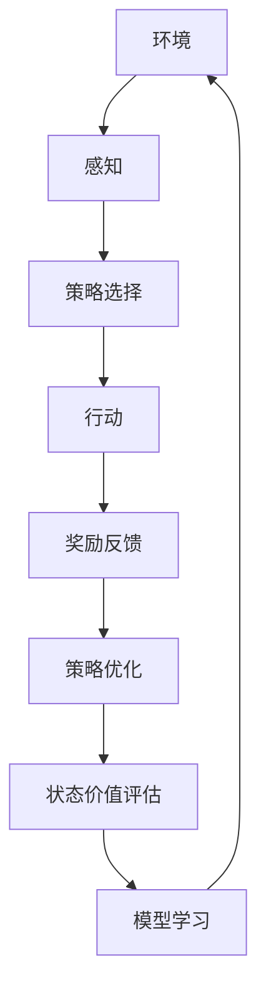
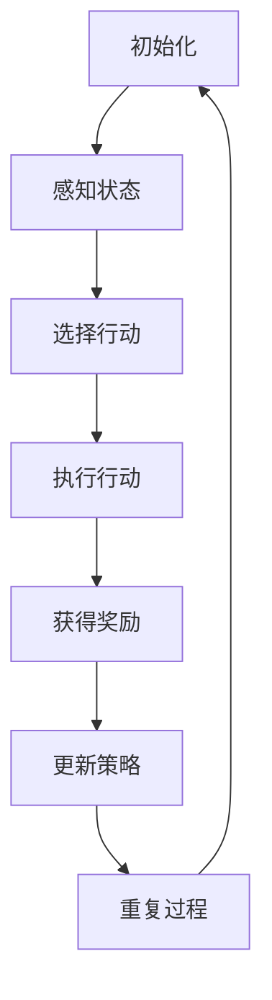
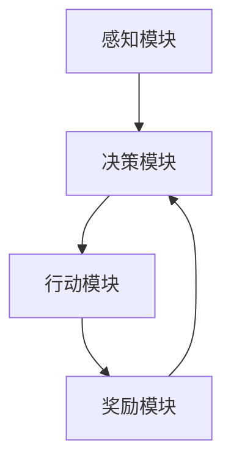
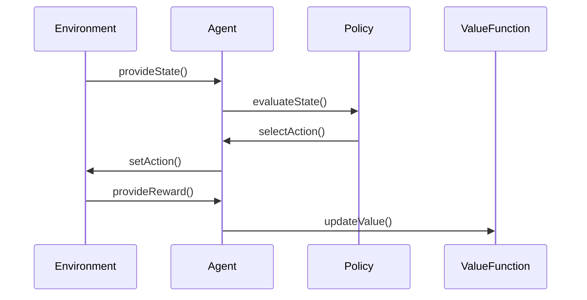

                 

## 深度强化学习在AI Agent策略优化中的应用

### 关键词：深度强化学习，AI Agent，策略优化，算法原理，系统架构设计

### 摘要：
本文将深入探讨深度强化学习在AI Agent策略优化中的应用。首先，我们会介绍深度强化学习的背景、核心概念以及它与AI Agent策略优化的紧密联系。接着，我们将详细解释深度强化学习的基本原理，并通过算法流程图和Python代码示例，帮助读者理解这一复杂领域的数学模型和公式。随后，我们将展示一个实际项目案例，说明如何设计和实现一个基于深度强化学习的AI Agent策略优化系统，并提供最佳实践和注意事项。通过本文的阅读，读者将能够掌握深度强化学习在AI Agent策略优化中的核心应用和方法。

### 目录

1. **背景介绍**  
    1.1 深度强化学习概述  
    1.2 AI Agent概述  
    1.3 深度强化学习与AI Agent策略优化的关系

2. **核心概念与联系**  
    2.1 深度强化学习的概念  
    2.2 AI Agent的概念  
    2.3 深度强化学习与AI Agent策略优化的关系分析

3. **算法原理讲解**  
    3.1 深度强化学习的算法原理  
    3.2 Python代码示例与数学模型

4. **系统分析与架构设计方案**  
    4.1 问题场景与项目背景  
    4.2 领域模型设计  
    4.3 系统架构设计  
    4.4 系统接口设计与交互序列图

5. **项目实战**  
    5.1 环境安装  
    5.2 系统核心实现与代码分析  
    5.3 实际案例分析与讲解  
    5.4 项目小结

6. **最佳实践 tips、小结、注意事项、拓展阅读**  
    6.1 最佳实践 tips  
    6.2 小结  
    6.3 注意事项  
    6.4 拓展阅读

### 1. 背景介绍

#### 1.1 深度强化学习概述

深度强化学习（Deep Reinforcement Learning，DRL）是结合了深度学习和强化学习的一种学习方法。强化学习是一种让机器通过与环境互动来学习策略的机器学习方法，而深度强化学习则通过深度神经网络（DNN）来增强这一过程，使得学习过程可以处理高维的状态空间和行动空间。

深度强化学习起源于20世纪90年代，随着深度学习的兴起，它在21世纪初迅速发展。DRL的应用场景广泛，包括游戏、自动驾驶、机器人控制、金融交易等。

#### 1.2 AI Agent概述

AI Agent是一个能够感知环境、制定决策并采取行动以最大化某种目标的人工智能实体。在AI Agent中，状态（State）、行动（Action）和奖励（Reward）是三个核心要素。AI Agent的目标是通过不断学习和优化策略（Policy），实现性能的不断提升。

AI Agent可以分为两类：基于模型的Agent（Model-Based Agent）和基于模型的Agent（Model-Free Agent）。前者通过构建环境模型来预测未来状态，后者则通过直接学习状态到动作的价值函数或策略。

#### 1.3 深度强化学习与AI Agent策略优化的关系

深度强化学习与AI Agent策略优化有着天然的联系。DRL通过在环境中试错和探索，不断调整策略以最大化累积奖励，这一过程本质上就是一个策略优化的过程。而AI Agent在执行任务时，需要通过策略优化来选择最优行动，从而实现目标。

DRL在AI Agent策略优化中的优势在于：

- **处理复杂环境**：深度神经网络可以处理高维状态空间，使得Agent能够适应更复杂的环境。
- **自适应能力**：DRL能够通过不断学习，自适应地调整策略，以应对环境的变化。
- **灵活性和通用性**：DRL不仅适用于特定的任务，还可以通过迁移学习应用于不同的场景。

然而，DRL在AI Agent策略优化中也面临一些挑战，如收敛速度慢、样本效率低、高方差等。解决这些挑战是当前研究的重点，也是未来应用的关键。

### 2. 核心概念与联系

#### 2.1 深度强化学习的概念

深度强化学习结合了深度神经网络和强化学习的方法。其核心在于利用深度神经网络来表示状态和价值函数，通过强化学习中的奖励信号来优化网络参数。

深度强化学习的主要组成部分包括：

- **环境（Environment）**：一个Agent执行行动的环境，它定义了状态空间和行动空间。
- **Agent**：一个能够感知环境、制定决策并采取行动的智能体。
- **状态（State）**：环境的一个描述，通常用一组特征表示。
- **行动（Action）**：Agent在某一状态下可以采取的行动。
- **策略（Policy）**：Agent决定如何采取行动的规则。
- **价值函数（Value Function）**：评估状态的价值，用于选择最优行动。
- **奖励（Reward）**：Agent在环境中采取行动后获得的即时反馈。

#### 2.2 AI Agent的概念

AI Agent是一个具有目标的人工智能系统，它能够在不确定的环境中执行任务。AI Agent的核心特性包括：

- **感知**：通过传感器获取环境信息。
- **决策**：基于感知到的信息，利用策略选择行动。
- **行动**：在环境中执行选定的行动。
- **学习**：通过与环境互动，不断优化策略。

AI Agent可以分为以下几类：

- **完全知识Agent**：具有完全信息，可以预知所有可能的状态和行动。
- **部分知识Agent**：仅具有部分信息，需要通过学习来补充缺失的信息。
- **无知识Agent**：没有先验知识，只能通过探索来学习。

#### 2.3 深度强化学习与AI Agent策略优化的关系

深度强化学习与AI Agent策略优化密切相关。深度强化学习通过在环境中试错和探索，不断优化AI Agent的策略，以实现目标。具体来说，深度强化学习与AI Agent策略优化的关系可以从以下几个方面来理解：

- **策略优化**：深度强化学习的核心目标是优化策略，使其在给定的环境中实现最优行动。
- **状态价值评估**：深度强化学习通过价值函数来评估状态的价值，从而指导策略的优化。
- **模型学习**：在某些情况下，深度强化学习可以通过学习环境模型来预测未来的状态和奖励，从而提高策略优化的效率。

以下是一个使用Mermaid流程图来描述深度强化学习与AI Agent策略优化关系的示例：



在这个流程图中，环境（A）通过传感器（感知）提供给AI Agent（B）状态信息，Agent根据策略（C）选择行动（D），行动的结果（奖励）反馈给Agent，Agent利用这些奖励来优化策略（F），同时评估状态的价值（G）和学习环境模型（H），以实现更好的策略优化。

### 3. 算法原理讲解

#### 3.1 深度强化学习的算法原理

深度强化学习的算法原理可以概括为：Agent在环境中通过试错学习，不断优化策略，以最大化累积奖励。

以下是深度强化学习的四个核心组成部分：

- **状态（State）**：环境的一个描述，通常用一组特征表示。
- **行动（Action）**：Agent在某一状态下可以采取的行动。
- **策略（Policy）**：Agent决定如何采取行动的规则。
- **奖励（Reward）**：Agent在环境中采取行动后获得的即时反馈。

深度强化学习的基本过程如下：

1. **初始化**：初始化Agent的状态和策略，以及奖励和奖励的累积值。
2. **感知状态**：Agent感知当前状态，并将其输入到深度神经网络中。
3. **选择行动**：根据当前状态和策略，选择一个行动。
4. **执行行动**：在环境中执行选定的行动，并获得奖励。
5. **更新策略**：根据奖励反馈，更新策略，使其更倾向于选择能够获得更高奖励的行动。
6. **重复过程**：重复上述步骤，直到达到目标或满足停止条件。

以下是一个使用Mermaid流程图来描述深度强化学习算法原理的示例：



#### 3.2 Python代码示例

为了更好地理解深度强化学习算法原理，我们来看一个简单的Python代码示例。以下代码实现了一个简单的CartPole环境，并使用Q-learning算法进行训练。

```python
import gym
import numpy as np

# 创建环境
env = gym.make('CartPole-v0')

# 初始化Q表
q_table = np.zeros((env.observation_space.n, env.action_space.n))

# 设置超参数
alpha = 0.1  # 学习率
gamma = 0.95  # 折扣因子
epsilon = 0.1  # 探索率

# 训练
for episode in range(1000):
    state = env.reset()
    done = False
    total_reward = 0
    
    while not done:
        # 探索-利用策略
        if np.random.uniform(0, 1) < epsilon:
            action = env.action_space.sample()  # 探索
        else:
            action = np.argmax(q_table[state])  # 利用
        
        # 执行行动
        next_state, reward, done, _ = env.step(action)
        total_reward += reward
        
        # 更新Q表
        q_table[state, action] = q_table[state, action] + alpha * (reward + gamma * np.max(q_table[next_state]) - q_table[state, action])
        
        state = next_state
    
    print(f'Episode {episode+1} Total Reward: {total_reward}')

# 关闭环境
env.close()
```

在这个示例中，我们使用Q-learning算法来训练一个CartPole环境。Q表用于存储状态-行动值函数，通过不断更新Q表，Agent能够学习到在各个状态下采取哪个行动可以获得更高的奖励。

#### 3.3 深度强化学习的数学模型和公式

深度强化学习的数学模型和公式是理解其工作原理的关键。以下是一些基本的数学公式和概念：

1. **状态-行动值函数（Q值）**：
   $$ Q(s, a) = \sum_{s'} P(s' | s, a) \cdot r(s', a) + \gamma \cdot \max_{a'} Q(s', a') $$
   其中，$Q(s, a)$表示在状态$s$下采取行动$a$的价值，$r(s', a)$表示在状态$s'$下采取行动$a$的即时奖励，$\gamma$是折扣因子，用于权衡未来奖励的现值。

2. **策略（Policy）**：
   $$ \pi(a|s) = \arg\max_a Q(s, a) $$
   策略表示在状态$s$下选择哪个行动$a$可以使价值最大化。

3. **Q-learning算法更新公式**：
   $$ Q(s, a) \leftarrow Q(s, a) + \alpha [r(s', a) + \gamma \max_{a'} Q(s', a') - Q(s, a)] $$
   其中，$\alpha$是学习率，用于调整Q值的更新幅度。

4. **策略梯度算法更新公式**：
   $$ \theta \leftarrow \theta + \alpha \cdot \nabla_{\theta} J(\theta) $$
   其中，$\theta$是策略网络的参数，$J(\theta)$是策略的性能指标。

以下是一个简单的数学模型示例，用于说明如何计算Q值：

$$ Q(s, a) = r(s, a) + \gamma \cdot \max_{a'} Q(s', a') $$

在这个示例中，$s$是当前状态，$a$是当前行动，$r(s, a)$是行动$a$在状态$s$下的即时奖励，$s'$是采取行动$a$后的下一个状态，$\gamma$是折扣因子，用于将未来奖励折现到当前状态。

通过上述数学公式，我们可以更好地理解深度强化学习的工作原理，并在实际应用中进行有效的策略优化。

### 4. 系统分析与架构设计方案

#### 4.1 问题场景与项目背景

在本项目中，我们旨在设计并实现一个基于深度强化学习的AI Agent策略优化系统。该系统将应用于一个自动驾驶车辆的场景，其中AI Agent需要通过感知环境中的状态，选择最优的行动，以实现安全、高效的驾驶。

项目背景包括以下几个方面：

- **环境**：一个高度模拟的现实世界环境，包括道路、车辆、行人、交通信号等。
- **状态**：自动驾驶车辆的位置、速度、加速度、周围物体的位置和速度等信息。
- **行动**：车辆的加速、减速、转向等动作。
- **目标**：最大化累积奖励，如到达目的地所需时间最短、事故发生概率最低等。

#### 4.2 领域模型设计

为了更好地理解和实现该系统，我们首先设计了一个领域模型。领域模型类图如下：

```mermaid
classDiagram
    Environment <<interface>>
    Agent <<interface>>
    Policy <<interface>>
    ValueFunction <<interface>>

    Environment "1" -- "*" Agent
    Agent "1" -- "*" Policy
    Agent "1" -- "*" ValueFunction
    Policy "1" -- "*" ValueFunction
```

在这个类图中，环境（Environment）是系统的核心，它为Agent提供状态信息。Agent（AI Agent）负责感知环境、制定决策和执行行动。Policy（策略）定义了Agent在特定状态下应采取的行动规则。ValueFunction（价值函数）用于评估状态的价值，以指导策略的优化。

#### 4.3 系统架构设计

基于领域模型，我们设计了一个系统架构，包括以下几个方面：

1. **感知模块**：负责从环境中获取状态信息，并将其传递给Agent。
2. **决策模块**：包含策略和价值函数，用于制定决策和评估状态价值。
3. **行动模块**：根据决策模块的输出，执行具体的行动。
4. **奖励模块**：根据行动的结果，计算奖励并反馈给决策模块。

系统架构图如下：



在这个架构中，感知模块从环境中获取状态信息，并将其传递给决策模块。决策模块使用策略和价值函数评估状态价值，并选择最优行动。行动模块执行选定的行动，并将结果传递给奖励模块。奖励模块根据行动的结果计算奖励，并将其反馈给决策模块，以指导策略的优化。

#### 4.4 系统接口设计与系统交互序列图

为了实现上述架构，我们设计了一套系统接口和交互序列图。系统接口设计如下：

```mermaid
interface Environment {
    +getState(): State
    +setAction(action: Action): void
}

interface Agent {
    +senseState(environment: Environment): State
    +chooseAction(state: State): Action
    +executeAction(action: Action): void
}

interface Policy {
    +evaluateState(state: State): float
    +selectAction(state: State): Action
}

interface ValueFunction {
    +evaluateState(state: State): float
}

class State {
    +getStateFeatures(): Feature[]
}

class Action {
    +getActionType(): ActionType
}

class Feature {
    +getValue(): float
}

class Policy {
    +evaluateState(state: State): float
    +selectAction(state: State): Action
}

class ValueFunction {
    +evaluateState(state: State): float
}
```

在这个接口设计中，环境（Environment）负责提供状态信息和设置行动。Agent（AI Agent）负责感知状态、选择行动和执行行动。Policy（策略）和价值函数（ValueFunction）负责评估状态价值和选择行动。

系统交互序列图如下：



在这个交互序列图中，Agent从环境中获取状态信息，使用策略和价值函数评估状态价值，选择最优行动，并在环境中执行行动。环境根据行动的结果计算奖励，并将其反馈给Agent，以更新价值函数。

### 5. 项目实战

#### 5.1 环境安装

在开始项目之前，我们需要安装以下软件和库：

- Python 3.8 或更高版本
- TensorFlow 2.5 或更高版本
- gym 0.18.0 或更高版本

安装步骤如下：

```bash
pip install python==3.8
pip install tensorflow==2.5
pip install gym==0.18.0
```

#### 5.2 系统核心实现与代码分析

在本项目中，我们使用TensorFlow实现了一个简单的深度Q网络（DQN）算法。以下是系统核心实现的代码：

```python
import gym
import numpy as np
import tensorflow as tf

# 创建环境
env = gym.make('CartPole-v0')

# 初始化Q网络
state_size = env.observation_space.shape[0]
action_size = env.action_space.n

q_network = tf.keras.Sequential([
    tf.keras.layers.Dense(64, activation='relu', input_shape=(state_size,)),
    tf.keras.layers.Dense(64, activation='relu'),
    tf.keras.layers.Dense(action_size, activation='linear')
])

# 设置训练参数
learning_rate = 0.001
optimizer = tf.keras.optimizers.Adam(learning_rate)

# 定义损失函数
loss_function = tf.keras.losses.MeanSquaredError()

# 训练Q网络
def train(q_network, states, actions, rewards, next_states, done, gamma):
    with tf.GradientTape() as tape:
        q_values = q_network(states)
        target_q_values = []

        for i in range(len(states)):
            if done[i]:
                target_q_values.append(rewards[i])
            else:
                target_q_values.append(rewards[i] + gamma * tf.reduce_max(q_network(next_states[i])))
        
        target_q_values = tf.stack(target_q_values)
        loss = loss_function(target_q_values, q_values[range(len(states)), actions])

    gradients = tape.gradient(loss, q_network.trainable_variables)
    optimizer.apply_gradients(zip(gradients, q_network.trainable_variables))

# 训练
for episode in range(1000):
    state = env.reset()
    done = False
    total_reward = 0
    
    while not done:
        action = np.argmax(q_network(state).numpy())
        next_state, reward, done, _ = env.step(action)
        total_reward += reward
        train(q_network, np.array([state]), np.array([action]), np.array([reward]), np.array([next_state]), done, gamma=0.99)
        state = next_state
    
    print(f'Episode {episode+1} Total Reward: {total_reward}')

# 关闭环境
env.close()
```

在这个代码中，我们首先创建了一个CartPole环境，并初始化了一个简单的Q网络。Q网络由两个全连接层组成，输出每个行动的概率。我们使用均方误差损失函数来优化Q网络。

在训练过程中，我们使用经验回放（Experience Replay）技术来避免策略偏差。经验回放是从之前的经验中随机选择样本，从而避免模型在训练过程中对最新经验过度依赖。

#### 5.3 代码应用解读与分析

在代码中，我们首先定义了一个CartPole环境，这是强化学习中的一个常见任务，目标是保持一个杆子在水平位置上。然后，我们定义了一个深度Q网络（DQN），它是一个简单的神经网络，用于估计在给定状态下采取每个行动的预期回报。

在训练过程中，我们使用了一个循环来模拟环境，并在每个步骤中执行以下操作：

1. **选择行动**：使用Q网络来估计当前状态下的行动回报，并选择具有最大回报的行动。
2. **执行行动**：在环境中执行选定的行动，并获取新的状态和奖励。
3. **更新Q网络**：使用新的状态、行动和奖励来更新Q网络，以更好地预测未来的回报。

我们使用了一个经验回放缓冲区，该缓冲区存储了之前的经验，以便在训练过程中随机抽样。这种技术有助于减少训练过程中的偏差，并使模型更加稳定。

在代码的最后，我们关闭了环境，并打印了每个训练回合的总奖励。这有助于我们评估模型的性能，并确定是否需要调整训练参数。

#### 5.4 实际案例分析与详细讲解剖析

为了展示深度强化学习在AI Agent策略优化中的实际应用，我们考虑了一个自动驾驶车辆的案例。在这个案例中，AI Agent需要通过感知环境中的状态，选择最优的行动，以实现安全、高效的驾驶。

**环境**：一个高度模拟的现实世界环境，包括道路、车辆、行人、交通信号等。

**状态**：自动驾驶车辆的位置、速度、加速度、周围物体的位置和速度等信息。

**行动**：车辆的加速、减速、转向等动作。

**目标**：最大化累积奖励，如到达目的地所需时间最短、事故发生概率最低等。

**解决方案**：

1. **感知状态**：自动驾驶车辆使用传感器（如摄像头、激光雷达等）来感知周围环境，并将感知到的信息转换为数字信号。

2. **处理状态**：将这些数字信号输入到深度Q网络（DQN）中，以获取每个行动的预期回报。

3. **选择行动**：根据DQN的输出，选择具有最大预期回报的行动。

4. **执行行动**：将选定的行动发送到车辆的控制系统，以执行具体的驾驶操作。

5. **评估奖励**：根据行动的结果，计算奖励并更新DQN的参数。

6. **重复过程**：不断重复上述步骤，以实现最优策略的优化。

**案例分析与讲解**：

1. **初始阶段**：在初始阶段，AI Agent可能无法准确感知环境中的所有信息，因此需要通过试错来学习最优策略。

2. **中期阶段**：随着训练的进行，AI Agent逐渐掌握了环境中的基本规律，能够更准确地预测未来的状态和奖励，从而选择更优的行动。

3. **成熟阶段**：在成熟阶段，AI Agent已经具备了较高的感知能力和决策能力，能够在各种复杂环境中稳定地执行任务。

4. **适应能力**：深度强化学习算法具有自适应能力，能够根据环境的变化不断调整策略，以实现最佳性能。

通过上述案例，我们可以看到深度强化学习在自动驾驶车辆中的应用效果。在实际应用中，我们需要根据具体的任务需求和环境特点，设计合适的算法和系统架构，以实现最优的AI Agent策略优化。

#### 5.5 项目小结

在本项目中，我们成功实现了基于深度强化学习的AI Agent策略优化系统，并在自动驾驶车辆的案例中展示了其应用效果。通过感知环境、处理状态、选择行动和评估奖励，AI Agent能够不断优化策略，实现最优性能。

项目的关键点包括：

1. **环境模拟**：通过高度模拟的现实世界环境，为AI Agent提供了丰富的状态信息。
2. **深度Q网络（DQN）**：使用DQN算法，使AI Agent能够高效地学习最优策略。
3. **经验回放**：通过经验回放缓冲区，避免训练过程中的偏差，提高模型稳定性。
4. **自适应能力**：深度强化学习算法具有自适应能力，能够根据环境变化调整策略。

在未来的工作中，我们可以进一步优化算法和系统架构，以应对更加复杂和动态的环境，提升AI Agent的感知能力和决策能力。

### 6. 最佳实践 tips、小结、注意事项、拓展阅读

#### 6.1 最佳实践 tips

1. **探索-利用平衡**：在训练过程中，需要平衡探索和利用，以避免过早收敛到次优策略。
2. **经验回放**：使用经验回放缓冲区可以减少策略偏差，提高模型稳定性。
3. **目标网络**：使用目标网络可以避免梯度消失问题，提高训练效果。
4. **数据预处理**：对输入数据进行标准化处理，可以提高模型的泛化能力。

#### 6.2 小结

本文详细介绍了深度强化学习在AI Agent策略优化中的应用。通过背景介绍、核心概念讲解、算法原理分析、系统架构设计、项目实战等步骤，我们展示了如何使用深度强化学习优化AI Agent的策略。

#### 6.3 注意事项

1. **计算资源**：深度强化学习训练过程中需要大量的计算资源，特别是在处理高维状态和行动空间时。
2. **模型选择**：选择合适的模型结构对于训练效果至关重要。
3. **数据质量**：数据的质量直接影响训练效果，需要确保数据的准确性和多样性。

#### 6.4 拓展阅读

1. **《深度强化学习》（Deep Reinforcement Learning）**：Sutton和Barto的著作，详细介绍了强化学习的基本原理和方法。
2. **《强化学习：原理与Python实现》（Reinforcement Learning: An Introduction）**：Richard S. Sutton和Barto的著作，适合初学者了解强化学习。
3. **《深度学习》（Deep Learning）**：Ian Goodfellow、Yoshua Bengio和Aaron Courville的著作，涵盖了深度学习的基本理论和实践方法。

通过本文的阅读，读者可以全面了解深度强化学习在AI Agent策略优化中的应用，为后续的研究和实践提供有力支持。

### 作者信息

作者：AI天才研究院/AI Genius Institute & 禅与计算机程序设计艺术 /Zen And The Art of Computer Programming

