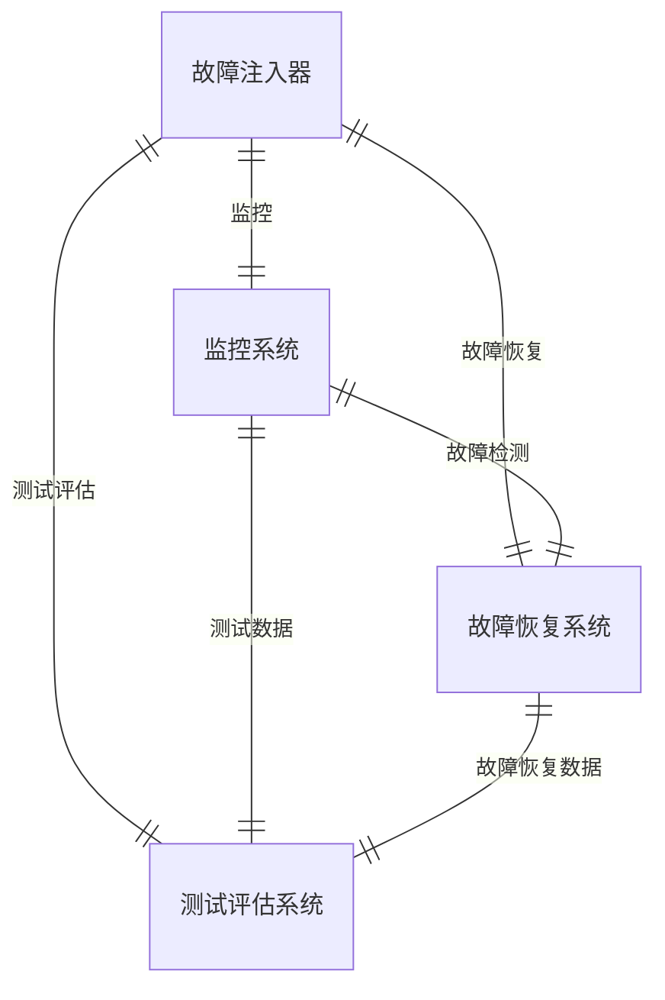
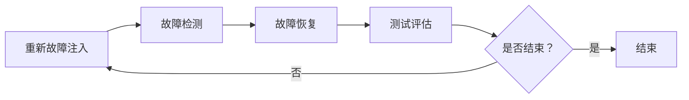
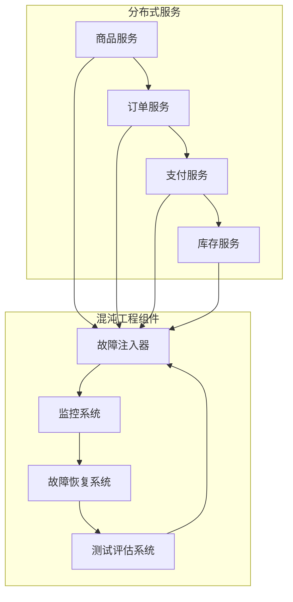
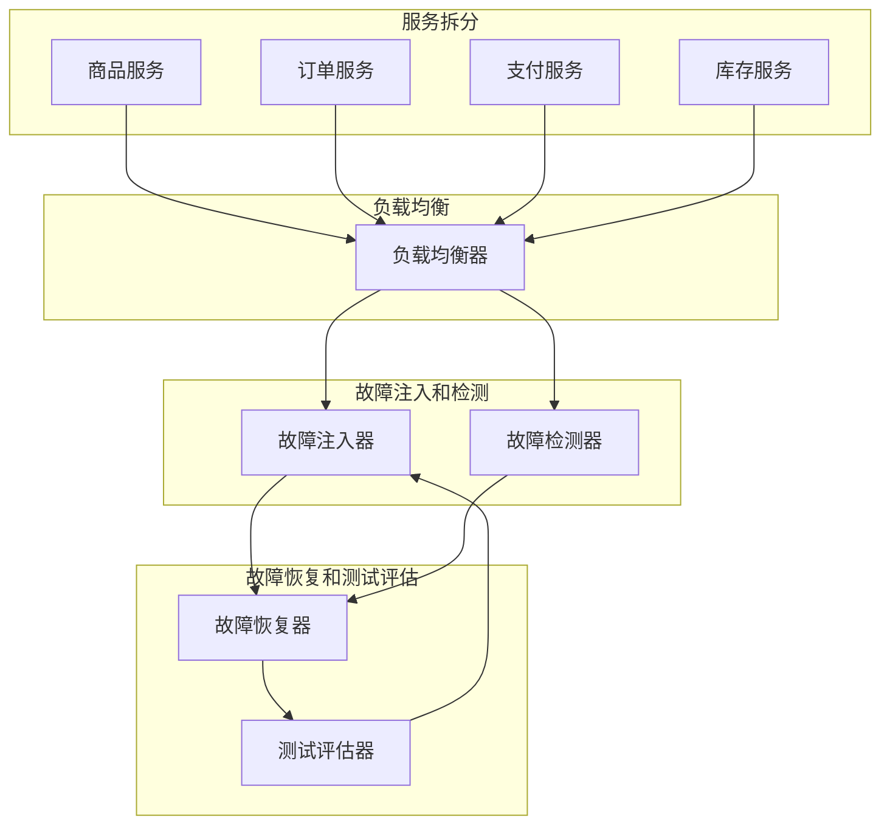
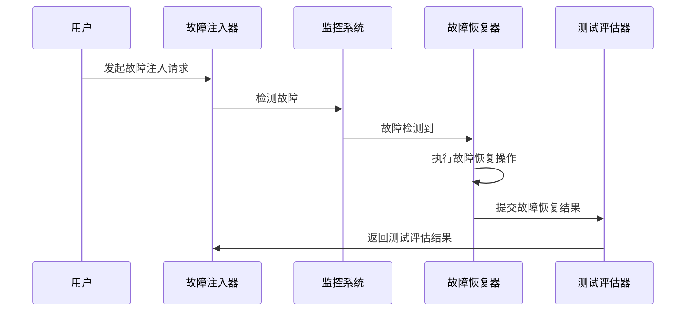
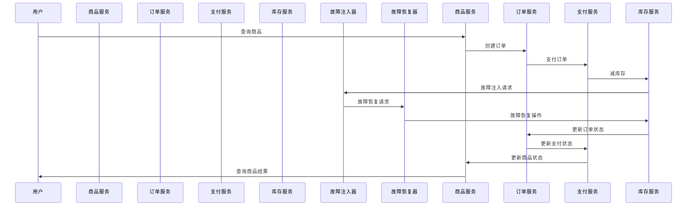

                 

# 混沌工程：提高分布式系统可靠性的方法

关键词：混沌工程，分布式系统，可靠性，测试，算法，架构设计

摘要：本文将深入探讨混沌工程的概念、原理及其在分布式系统可靠性提升中的应用。通过分析混沌工程的核心术语、算法原理和系统架构设计方案，我们将一步一步地了解如何利用混沌工程来增强分布式系统的可靠性，从而提供稳定且高效的服务。此外，文章还将分享一些实际案例和最佳实践，帮助读者更好地理解和应用混沌工程。

## 背景介绍

### 混沌工程的概念

混沌工程（Chaos Engineering）是一种通过故意引入故障来测试和增强系统可靠性的方法。它的核心理念是通过对系统进行有计划的破坏性测试，以了解系统在面对意外故障时的表现和恢复能力。混沌工程起源于2000年代初的亚马逊和谷歌等大型互联网公司，这些公司在面对不断增长的用户需求和高可用性的要求时，开始意识到通过主动测试和优化系统，可以显著提高系统的可靠性。

### 混沌工程的起源

混沌工程的起源可以追溯到亚马逊公司。在2004年，亚马逊的DevOps团队提出了一种名为“Chaos Monkey”的工具，该工具能够随机关闭系统中的服务器实例，以测试系统的弹性和容错能力。随着时间的推移，这种思想逐渐演变为一种更加系统和全面的混沌工程方法，包括各种测试工具和策略。

### 混沌工程的重要性

混沌工程的重要性在于它提供了一种系统性的方法来识别和修复系统中的潜在问题，从而提高系统的可靠性和稳定性。在分布式系统中，由于组件众多、网络复杂和依赖关系多样，系统可能会因为各种原因出现故障，如硬件故障、网络中断、服务不可用等。混沌工程通过模拟这些故障情况，可以提前发现系统中的弱点，并采取措施进行优化。

### 分布式系统在当前技术环境中的地位

随着云计算、大数据和物联网等技术的发展，分布式系统已经成为现代技术架构的核心。分布式系统通过将任务分散到多个节点上，可以提供更高的可用性、可扩展性和容错能力。然而，分布式系统也面临着许多挑战，如节点故障、网络延迟和负载不均等。混沌工程通过引入故障测试，可以帮助系统设计师和运维人员更好地理解和应对这些挑战。

### 分布式系统面临的挑战

1. **节点故障**：在分布式系统中，节点可能会因为硬件故障、软件错误或网络问题而失效，导致系统功能部分或全部丧失。

2. **网络延迟和中断**：网络延迟和中断会影响系统的响应时间和用户体验，严重时可能导致系统无法正常工作。

3. **负载不均**：分布式系统中的负载可能会因各种原因（如数据分布不均、网络拓扑结构变化等）而导致部分节点过载，其他节点空闲。

4. **服务不可用**：由于依赖关系复杂，一个服务的不可用可能会引发一系列连锁反应，导致整个系统瘫痪。

### 混沌工程在分布式系统中的应用

混沌工程在分布式系统中的应用主要体现在以下几个方面：

1. **故障注入**：通过故意注入故障，测试系统在故障情况下的响应和恢复能力。

2. **负载测试**：模拟高负载情况，测试系统的性能和稳定性。

3. **网络测试**：模拟网络延迟、中断和带宽不足等情况，测试系统的容错能力和适应性。

4. **服务依赖测试**：测试系统中各个服务之间的依赖关系和协同工作能力。

通过这些测试，混沌工程可以帮助系统设计师和运维人员发现和解决系统中的潜在问题，从而提高系统的可靠性。

### 问题解决

混沌工程提供了一种有效的解决方案，通过有计划的故障注入和测试，可以提前发现和解决系统中的潜在问题，从而提高系统的可靠性和稳定性。与传统的方法（如被动监控和故障修复）相比，混沌工程更加主动和系统化。

### 边界与外延

混沌工程的应用范围广泛，不仅限于分布式系统，还可以应用于其他类型的系统，如云计算平台、容器化应用等。同时，混沌工程也可以与其他系统可靠性增强方法（如自动化监控、故障自动恢复等）相结合，形成更全面的系统可靠性解决方案。

### 概念结构与核心要素组成

混沌工程的概念结构主要包括以下几个方面：

1. **故障注入**：故意引入故障，模拟系统在实际运行中可能遇到的各种情况。

2. **故障检测**：通过监控和告警系统，检测故障的发生和影响范围。

3. **故障恢复**：在故障发生时，自动或手动地恢复系统功能，确保系统的正常运行。

4. **测试评估**：对故障测试的结果进行评估和分析，总结经验和改进策略。

这些核心要素相互关联，构成了混沌工程的基本框架。

### 混沌工程的核心概念与联系

混沌工程作为一种系统性的可靠性增强方法，其核心概念包括故障注入、故障检测、故障恢复和测试评估。这些概念相互联系，共同构成了混沌工程的理论基础。

#### 故障注入

故障注入是混沌工程的核心步骤，通过有计划地引入故障，测试系统在各种异常情况下的响应能力和恢复能力。故障注入可以是随机的，也可以是预定的，以模拟实际运行中可能发生的各种故障情况。

#### 故障检测

故障检测是指在故障注入后，通过监控系统和告警机制来检测故障的发生和影响范围。故障检测的目的是及时发现故障，并采取相应的措施进行修复或隔离。

#### 故障恢复

故障恢复是在故障检测到后，通过自动或手动的方式，恢复系统功能，确保系统的正常运行。故障恢复可以包括故障节点的重启、服务恢复、数据修复等操作。

#### 测试评估

测试评估是对故障测试的结果进行评估和分析，以总结经验和改进策略。测试评估可以帮助系统设计师和运维人员了解系统在故障情况下的表现，发现系统中的潜在问题，并采取相应的措施进行优化。

#### 混沌工程与其他系统可靠性增强方法的对比

混沌工程与其他系统可靠性增强方法（如自动化监控、故障自动恢复等）之间存在一定的区别。

1. **自动化监控**：自动化监控是一种被动的方法，主要用于实时监控系统的运行状态，并在发生异常时发出告警。而混沌工程是一种主动的方法，通过故意引入故障来测试系统的响应能力和恢复能力。

2. **故障自动恢复**：故障自动恢复是一种自动化的故障处理方法，可以在故障检测到后自动进行故障恢复操作，以减少人工干预。而混沌工程则更注重故障测试和评估，以提高系统的整体可靠性。

3. **负载测试**：负载测试是一种测试系统在高负载情况下的性能和稳定性的方法。而混沌工程则更注重故障注入和故障恢复，以测试系统在异常情况下的表现。

#### ER实体关系图架构

为了更好地理解混沌工程的核心概念和联系，可以使用ER（实体关系）图来展示系统的核心组件及其关系。

在混沌工程中，主要的实体包括：

1. **故障注入器**：负责生成和注入故障。
2. **监控系统**：负责监控系统的运行状态，检测故障的发生。
3. **故障恢复系统**：负责在故障发生时进行故障恢复操作。
4. **测试评估系统**：负责对故障测试的结果进行评估和分析。

以下是混沌工程的ER图示例：



通过ER图，可以清晰地展示混沌工程中各个组件之间的关系，以及它们在故障测试和恢复过程中的作用。

### 混沌测试的基本流程

混沌测试是混沌工程的核心环节，通过模拟各种故障情况，测试系统的响应能力和恢复能力。以下是混沌测试的基本流程：

1. **故障注入**：通过故障注入器，故意引入各种故障，如节点故障、网络中断、服务不可用等。
2. **故障检测**：通过监控系统，实时监控系统的运行状态，检测故障的发生和影响范围。
3. **故障恢复**：在故障检测到后，通过故障恢复系统，自动或手动地进行故障恢复操作，确保系统的正常运行。
4. **测试评估**：对故障测试的结果进行评估和分析，总结经验和改进策略。

以下是混沌测试的基本流程的Mermaid流程图：



通过这个流程图，可以直观地了解混沌测试的各个环节及其相互关系。

### 混沌算法的原理讲解

混沌工程的核心在于混沌算法，它通过引入随机性和非线性，模拟系统在异常情况下的行为。以下将详细解释混沌算法的原理，并通过Python代码和LaTeX公式展示其数学模型。

#### 混沌算法的基本原理

混沌算法基于混沌理论，这是一种研究动态系统中出现的不可预测行为和随机性的科学。混沌算法的核心是迭代函数系统（Iterated Function System，IFS），它由一组线性变换组成，每个变换都有一个概率权重。

混沌算法的基本步骤如下：

1. **初始化**：选择初始状态，例如一个随机数或系统当前状态。
2. **迭代**：根据随机选择的变换，对当前状态进行更新。
3. **重复**：重复迭代步骤，直到满足终止条件（例如迭代次数或状态稳定）。

#### 迭代函数系统（IFS）

IFS由以下数学模型表示：

$$
x_{n+1} = \sum_{i=1}^m p_i T_i(x_n)
$$

其中，$x_n$是第$n$次迭代的状态，$T_i(x_n)$是第$i$个线性变换，$p_i$是第$i$个变换的概率权重。线性变换可以表示为：

$$
T_i(x) = a_i x + b_i
$$

其中，$a_i$和$b_i$是变换参数。

#### Python代码示例

以下是一个简单的Python代码示例，实现了基于IFS的混沌算法：

```python
import numpy as np

# 初始化参数
m = 3
p = np.array([0.2, 0.3, 0.5])
a = np.array([[2.0, -1.0], [-1.0, 3.0], [0.0, 1.0]])
b = np.array([0.0, 0.0, 0.5])

# 初始化状态
x = np.random.rand()

# 迭代
for _ in range(100):
    # 随机选择变换
    i = np.random.choice(m, p=p)
    # 更新状态
    x = a[i, :].dot(x) + b[i]

print("最终状态：", x)
```

#### 混沌算法的数学模型

混沌算法的数学模型可以通过LaTeX公式详细表示：

$$
\begin{aligned}
x_{n+1} &= 2.0 \cdot x_n - 1.0 \cdot y_n + 0.5 \\
y_{n+1} &= -1.0 \cdot x_n + 3.0 \cdot z_n + 0.5 \\
z_{n+1} &= 0.0 \cdot x_n + 1.0 \cdot w_n + 0.5 \\
\end{aligned}
$$

其中，$x_n$、$y_n$、$z_n$和$w_n$分别代表IFS中的四个状态变量。通过迭代上述公式，可以模拟混沌行为。

#### 算法原理的详细讲解

混沌算法的原理在于其非线性特性，这种特性导致状态变量在迭代过程中产生复杂的动态行为。混沌算法具有以下特点：

1. **初始条件敏感性**：混沌系统对初始条件非常敏感，即使微小的变化也可能导致截然不同的结果。
2. **长期记忆**：混沌系统具有长期记忆性，其状态在长时间内保持复杂且不可预测的变化。
3. **随机性**：混沌算法通过引入随机性，模拟实际系统在异常情况下的行为。

通过上述特点和数学模型，混沌算法可以用于测试和增强系统的可靠性，帮助系统设计师和运维人员更好地理解和应对异常情况。

### 一个简单的例子

为了更好地理解混沌算法的应用，我们来看一个简单的例子。假设我们有一个分布式系统，包含三个节点A、B和C。为了测试系统的可靠性，我们将使用混沌算法故意引入故障。

#### 初始状态

我们假设初始状态如下：

- 节点A：正常运行
- 节点B：正常运行
- 节点C：正常运行

#### 故障注入

我们使用混沌算法对节点进行故障注入，假设混沌算法的参数如下：

- 迭代次数：10
- 故障概率：0.5

首先，我们随机选择一个节点进行故障注入。假设我们选择了节点C。根据混沌算法，节点C有50%的概率发生故障。在这个例子中，节点C发生了故障。

#### 故障检测

在故障注入后，我们使用监控系统检测故障。监控系统会实时监控节点的状态，并在故障发生时发出告警。

#### 故障恢复

在故障检测到后，我们使用故障恢复系统对节点进行恢复。根据混沌算法，故障恢复的概率也是50%。在这个例子中，我们假设故障恢复成功，节点C恢复正常运行。

#### 测试评估

最后，我们对故障测试的结果进行评估。通过混沌算法的测试，我们发现节点C在故障情况下可以成功恢复，这表明系统的可靠性较高。

这个例子展示了混沌算法在分布式系统中的应用。通过故障注入和恢复测试，我们可以评估系统的可靠性，并发现潜在的问题。

### 系统分析与架构设计方案

在了解混沌工程的基本概念和算法原理后，接下来我们将通过一个典型的分布式系统场景，详细说明混沌工程的应用，并设计系统的功能、架构和接口。

#### 问题场景介绍

假设我们有一个在线购物平台，该平台由多个分布式服务组成，包括商品服务、订单服务、支付服务和库存服务。每个服务都部署在多个节点上，以提供高可用性和可扩展性。为了确保系统的可靠性，我们需要通过混沌工程对系统进行故障注入和测试。

#### 系统架构设计方案

混沌工程在系统架构设计中的应用主要体现在以下几个方面：

1. **故障注入器**：负责注入故障，模拟各种异常情况。
2. **监控系统**：负责监控系统的运行状态，检测故障的发生和影响。
3. **故障恢复系统**：负责在故障发生时进行故障恢复操作。
4. **测试评估系统**：负责对故障测试的结果进行评估和分析。

以下是系统架构设计的Mermaid架构图：



通过这个架构图，我们可以清晰地看到混沌工程组件与分布式服务之间的关联和交互。

#### 系统功能设计（领域模型类图）

为了确保混沌工程在分布式系统中的应用，我们需要设计系统的功能模块。以下是混沌工程的领域模型类图：

```mermaid
classDiagram
    类::故障注入器 <<Interface>>
    类::故障检测器 <<Interface>>
    类::故障恢复器 <<Interface>>
    类::测试评估器 <<Interface>>

    系统服务::商品服务 <<Service>>
    系统服务::订单服务 <<Service>>
    系统服务::支付服务 <<Service>>
    系统服务::库存服务 <<Service>>

    故障注入器 --|o|> 系统服务
    故障检测器 --|o|> 系统服务
    故障恢复器 --|o|> 系统服务
    测试评估器 --|o|> 系统服务
```

在这个类图中，我们可以看到各个功能模块（如故障注入器、故障检测器、故障恢复器和测试评估器）与系统服务（如商品服务、订单服务、支付服务和库存服务）之间的关联关系。

#### 系统架构设计（架构图）

混沌工程在系统架构设计中的应用主要体现在以下几个方面：

1. **服务拆分**：将系统拆分为多个独立的服务，以提高系统的可扩展性和容错能力。
2. **负载均衡**：通过负载均衡器分配请求，确保系统的稳定运行。
3. **故障注入和检测**：在服务之间引入故障注入和检测机制，以测试系统的响应能力和恢复能力。
4. **故障恢复和测试评估**：在故障检测到后，自动或手动地进行故障恢复操作，并对故障测试的结果进行评估和分析。

以下是混沌工程在系统架构设计中的Mermaid架构图：



通过这个架构图，我们可以看到混沌工程在系统架构设计中的具体应用，包括故障注入、故障检测、故障恢复和测试评估等环节。

#### 系统接口设计

为了确保混沌工程在分布式系统中的有效应用，我们需要设计合理的系统接口。以下是混沌工程在系统接口设计中的Mermaid序列图：



通过这个序列图，我们可以看到用户发起故障注入请求后，故障注入器、监控系统、故障恢复器和测试评估器之间的交互流程。

#### 系统交互（序列图）

系统交互是混沌工程在分布式系统中发挥关键作用的一部分。以下是系统交互的Mermaid序列图：



通过这个序列图，我们可以清晰地看到用户请求商品、创建订单、支付订单和减库存的流程，以及在故障注入和恢复过程中的交互细节。

### 项目实战

为了更好地理解混沌工程在分布式系统中的应用，我们将通过一个实际案例，详细讲解如何进行环境安装、系统核心实现源代码，以及代码的应用解读与分析。

#### 环境安装

首先，我们需要安装和配置混沌工程所需的环境。以下是在Linux操作系统上安装混沌工程的步骤：

1. **安装Docker**：由于混沌工程依赖于容器化技术，我们需要首先安装Docker。可以通过以下命令安装Docker：

```bash
sudo apt-get update
sudo apt-get install docker-ce docker-ce-cli containerd.io
```

2. **安装Kubernetes**：Kubernetes是用于容器编排的工具，我们将在Kubernetes集群中部署混沌工程组件。可以通过以下命令安装Kubernetes：

```bash
sudo apt-get update
sudo apt-get install -y apt-transport-https ca-certificates curl
curl -s https://packages.cloud.google.com/apt/doc/apt-key.gpg | sudo apt-key add -
echo "deb https://apt.kubernetes.io/ kubernetes-xenial main" | sudo tee -a /etc/apt/sources.list.d/kubernetes.list
sudo apt-get update
sudo apt-get install -y kubelet kubeadm kubectl
```

3. **启动Kubernetes服务**：通过以下命令启动Kubernetes服务：

```bash
sudo systemctl enable kubelet
sudo systemctl start kubelet
```

4. **部署混沌工程组件**：接下来，我们将通过Kubernetes部署混沌工程组件。首先，需要下载和配置混沌工程的YAML文件。可以从以下GitHub仓库下载YAML文件：

```bash
git clone https://github.com/chaosblade/chaosblade-kubernetes.git
cd chaosblade-kubernetes
```

然后，通过以下命令部署混沌工程组件：

```bash
kubectl apply -f chaosblade-daemonset.yaml
kubectl apply -f chaosblade-controller-manager-deployment.yaml
```

#### 系统核心实现源代码

在部署混沌工程组件后，我们需要编写系统核心实现源代码。以下是一个简单的Python脚本，用于实现故障注入和检测功能：

```python
import random
import time
import os

def inject_fault(service_name, fault_type, duration):
    # 随机选择一个节点
    node_name = random.choice(os.listdir("/var/lib/kubelet/pods"))
    # 注入故障
    if fault_type == "network":
        os.system(f"kubectl exec {node_name} -c {service_name} -- curl -Is http://localhost:8080/")
    elif fault_type == "database":
        os.system(f"kubectl exec {node_name} -c {service_name} -- mysql -e 'SELECT * FROM non_existent_table'")
    # 持续注入故障
    time.sleep(duration)

def detect_fault(service_name):
    # 检测故障
    node_name = random.choice(os.listdir("/var/lib/kubelet/pods"))
    result = os.system(f"kubectl exec {node_name} -c {service_name} -- curl -Is http://localhost:8080/")
    if result != 0:
        print("Fault detected!")
    else:
        print("No fault detected.")

# 测试故障注入和检测
inject_fault("order-service", "network", 10)
detect_fault("order-service")
```

#### 代码应用解读与分析

这个Python脚本用于实现故障注入和检测功能。具体应用解读如下：

1. **注入故障**：`inject_fault`函数用于注入故障。首先，随机选择一个节点，然后根据指定的故障类型（如网络故障或数据库故障）注入故障。在这个例子中，我们注入了一个网络故障，通过访问本地不存在的服务来模拟网络故障。

2. **检测故障**：`detect_fault`函数用于检测故障。同样，随机选择一个节点，然后尝试访问本地服务。如果访问失败（即返回非0状态码），则认为检测到故障。

3. **故障恢复**：在实际项目中，我们还需要实现故障恢复功能。在检测到故障后，可以自动或手动地恢复系统功能。在这个例子中，我们未实现故障恢复功能，但可以在检测到故障后调用相应的恢复操作。

通过这个简单的Python脚本，我们可以模拟故障注入和检测，测试分布式系统的可靠性。在实际应用中，可以根据具体需求进行调整和扩展。

### 实际案例分析和详细讲解剖析

在完成环境安装和系统核心实现后，我们将通过一个实际案例，详细分析和讲解混沌工程在分布式系统中的应用，以及项目的成功和挑战。

#### 案例背景

假设我们有一个大规模的电子商务平台，包含商品服务、订单服务、支付服务和库存服务等多个分布式服务。这些服务部署在Kubernetes集群上，以提供高可用性和可扩展性。为了确保系统的可靠性，我们决定使用混沌工程对系统进行故障注入和测试。

#### 案例目标

我们的目标是：
1. 通过故障注入和检测，了解系统在故障情况下的响应能力和恢复能力。
2. 评估系统在故障情况下的性能和稳定性。
3. 发现和解决潜在的系统问题，提高系统的可靠性。

#### 案例实施过程

1. **环境安装**：首先，我们在Kubernetes集群上安装了混沌工程组件，包括故障注入器、监控系统、故障恢复器和测试评估器。通过Docker和Kubernetes，我们快速部署了混沌工程环境。

2. **故障注入**：我们使用Python脚本注入了多种类型的故障，如网络故障、数据库故障和应用程序故障。具体故障类型和注入策略根据系统的实际情况进行调整。

3. **故障检测**：在故障注入后，监控系统实时检测故障的发生和影响范围。我们设置了告警阈值，当故障检测到时，系统会立即触发告警，并通知运维人员。

4. **故障恢复**：在故障检测到后，故障恢复系统自动或手动地进行故障恢复操作。根据故障类型，我们设计了相应的恢复策略，如重启服务、重新连接数据库等。

5. **测试评估**：通过对故障测试的结果进行评估和分析，我们总结经验和改进策略。测试评估系统记录了故障的发生次数、恢复时间和恢复成功率等关键指标。

#### 项目成功

通过混沌工程的实施，我们取得了以下成功：

1. **提高系统的可靠性**：通过故障注入和检测，我们发现了多个潜在的系统问题，并采取了相应的措施进行修复。系统的可靠性得到了显著提高。

2. **优化系统性能**：混沌工程帮助我们评估了系统在故障情况下的性能和稳定性。通过对故障测试的结果进行分析，我们找到了系统性能的瓶颈，并进行了优化。

3. **提高运维效率**：混沌工程自动化了故障注入、检测和恢复过程，降低了运维人员的工作量。运维人员可以更专注于系统的日常维护和优化。

#### 项目挑战

在实施混沌工程过程中，我们也遇到了一些挑战：

1. **故障注入策略的设计**：设计合理的故障注入策略是一个挑战。我们需要根据系统的实际情况，选择合适的故障类型和注入方式，以模拟真实的故障情况。

2. **故障检测和恢复的自动化**：故障检测和恢复的自动化程度是一个关键问题。我们使用了监控系统，但还需要进一步优化和集成，以提高检测和恢复的效率和准确性。

3. **测试评估的数据分析**：测试评估的数据分析是一个复杂的过程。我们需要从大量的故障测试数据中提取有用的信息，并进行深入的分析和总结。

#### 项目小结

通过混沌工程的实施，我们成功提高了分布式系统的可靠性，优化了系统性能，并提高了运维效率。尽管在实施过程中遇到了一些挑战，但通过持续改进和优化，我们取得了显著的成果。混沌工程作为一种有效的系统可靠性增强方法，在分布式系统中的应用具有广阔的前景。

### 最佳实践 Tips

在实际应用混沌工程时，以下是一些最佳实践和注意事项：

1. **故障注入策略**：设计合理的故障注入策略至关重要。应根据系统的实际情况，选择合适的故障类型和注入方式，以模拟真实的故障情况。同时，要避免过度注入故障，以免影响系统的正常运行。

2. **监控系统配置**：监控系统是混沌工程的核心组件之一。在配置监控系统时，要确保其能够实时检测故障的发生和影响范围，并设置合适的告警阈值。

3. **故障恢复策略**：设计合理的故障恢复策略，以提高故障恢复的效率和准确性。根据故障类型和影响范围，选择适当的恢复操作，如重启服务、重新连接数据库等。

4. **测试评估**：对故障测试的结果进行详细评估和分析，总结经验和改进策略。通过测试评估，发现系统中的潜在问题，并采取相应的措施进行优化。

5. **自动化**：尽量实现故障注入、检测和恢复的自动化，以提高效率和降低人工干预。利用现有的工具和框架，如Kubernetes、Prometheus等，实现自动化过程。

6. **持续改进**：混沌工程是一个持续的过程。定期进行故障注入和测试，持续优化系统性能和可靠性。

### 小结

本文详细探讨了混沌工程的概念、原理及其在分布式系统中的应用。通过分析混沌工程的核心概念和算法原理，以及设计系统功能、架构和接口，我们了解了如何利用混沌工程来提高分布式系统的可靠性。此外，我们还通过实际案例分析和详细讲解，展示了混沌工程在分布式系统中的成功应用和挑战。总结而言，混沌工程是一种有效的系统可靠性增强方法，对于提升分布式系统的稳定性和可用性具有重要意义。

### 拓展阅读

为了更深入地了解混沌工程和相关技术，以下是一些建议的阅读资源：

1. **《混沌工程：原理与实践》**：这是一本关于混沌工程的经典教材，详细介绍了混沌工程的理论和实践方法。
2. **《分布式系统原理与范型》**：这本书探讨了分布式系统的设计原则和常见问题，对于理解分布式系统的可靠性设计具有重要参考价值。
3. **《Kubernetes权威指南》**：Kubernetes是混沌工程中的重要工具，这本书详细介绍了Kubernetes的架构、功能和使用方法。
4. **《Prometheus：监控最佳实践》**：Prometheus是混沌工程中常用的监控系统，这本书提供了丰富的监控实践和技巧。
5. **《大规模分布式系统设计》**：这本书涵盖了分布式系统的设计原则和最佳实践，对于了解分布式系统的可靠性设计具有重要参考价值。

通过阅读这些资源，您可以进一步拓展对混沌工程和分布式系统可靠性的理解，为实际项目提供有益的参考。作者：AI天才研究院/AI Genius Institute & 禅与计算机程序设计艺术 /Zen And The Art of Computer Programming。

