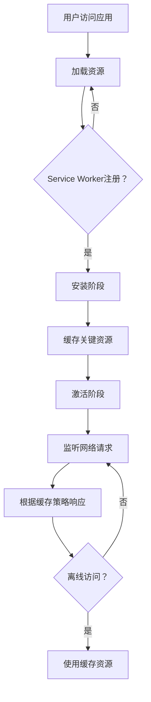
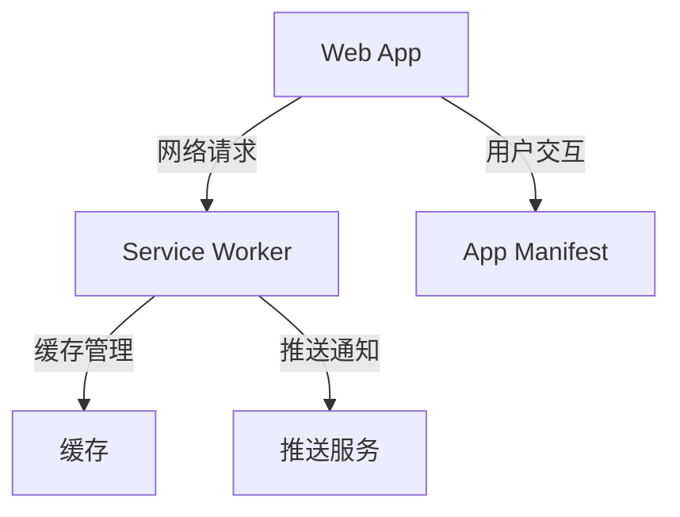
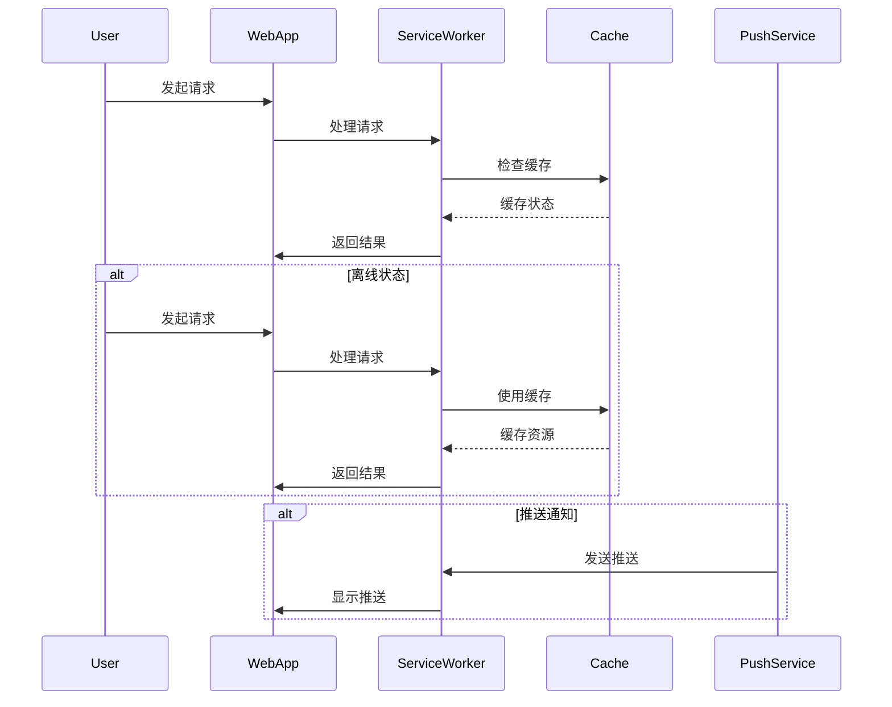

                 


## 设计思路

为了设计出《渐进式Web应用(PWA)：融合网页与原生应用体验》这篇文章，我们需要遵循以下设计思路：

### 1. 理解文章主题
文章主题是渐进式Web应用（PWA），它结合了网页和原生应用的特点，为用户提供更加流畅和丰富的体验。我们要深入理解PWA的核心概念、技术实现和应用场景。

### 2. 确定文章结构
文章结构需要清晰、逻辑性强。我们可以按照以下结构来组织内容：
- 引言：介绍PWA的背景、重要性和文章的结构。
- 第一部分：PWA基础概念与原理
  - 背景介绍
  - 核心概念与联系
  - 算法原理讲解
- 第二部分：PWA的系统架构设计
  - 问题场景介绍
  - 系统功能设计
  - 系统架构设计
  - 系统接口设计和系统交互
- 第三部分：PWA的实战应用
  - 环境安装
  - 系统核心实现源代码
  - 代码应用解读与分析
  - 实际案例分析和详细讲解剖析
  - 项目小结
- 第四部分：PWA的最佳实践与未来展望
  - 最佳实践 tips
  - 小结
  - 注意事项
  - 拓展阅读

### 3. 内容细化
在每个部分中，我们要细化每个小节的内容，确保内容丰富、具体，并且能够通俗易懂地传达给读者。例如，在核心概念与联系的部分，我们可以使用表格和Mermaid流程图来展示PWA与传统Web应用、原生应用的关键特性对比。

### 4. 保持简洁
在满足内容完整性的前提下，避免过多冗余内容。确保每个小节都有明确的主题和结论，避免无意义的赘述。

### 5. 格式规范
文章使用markdown格式输出，确保格式规范，例如，使用适当的标题级别、有序列表和无序列表、代码块等。

### 6. 作者信息
在文章末尾，我们需要写上作者信息：“作者：AI天才研究院/AI Genius Institute & 禅与计算机程序设计艺术 /Zen And The Art of Computer Programming”。

### 7. 完整性要求
文章内容需要完整，每个小节的内容都要具体详细讲解，核心内容必须要包含：
- 背景介绍
- 核心概念与联系
- 算法原理讲解
- 系统分析与架构设计方案
- 项目实战
- 最佳实践 tips、小结、注意事项、拓展阅读等内容

### 8. 字数与格式要求
文章字数要求在10000～12000字左右，确保内容丰富、深度和广度。使用markdown格式输出，确保文章格式规范、易读。

### 9. 逐步实施
按照上述设计思路，我们可以逐步实施，首先撰写引言，然后是第一部分，接着是第二部分，依次类推，直到完成全部内容。

---

## 文章写作步骤

### 步骤1：引言撰写
引言部分需要简明扼要地介绍PWA的背景、重要性和文章的结构。这部分的内容应该能够吸引读者的兴趣，让他们对后续内容产生期待。

### 步骤2：第一部分撰写
第一部分是PWA的基础概念与原理，包括背景介绍、核心概念与联系、算法原理讲解等。这部分内容需要详细、具体，并且逻辑清晰。

#### 2.1 背景介绍
在这一部分，我们需要介绍PWA的背景，包括Web应用的演变过程和PWA的提出。我们需要解释为什么PWA是必要的，以及它如何解决传统Web应用的痛点。

#### 2.2 核心概念与联系
在这一部分，我们需要详细解释PWA的核心概念，如Service Worker、App Manifest等。同时，我们需要使用表格和Mermaid流程图来展示PWA与传统Web应用、原生应用的关键特性对比。

#### 2.3 算法原理讲解
在这一部分，我们需要使用Mermaid绘制算法流程图，并使用Python源代码来详细阐述算法原理。我们需要给出算法的数学模型和公式，并进行详细讲解和通俗易懂的举例说明。

### 步骤3：第二部分撰写
第二部分是PWA的系统架构设计，包括问题场景介绍、系统功能设计、系统架构设计、系统接口设计和系统交互等。这部分内容需要具体、详细，并且需要使用Mermaid类图、架构图和序列图来展示。

#### 3.1 问题场景介绍
在这一部分，我们需要描述PWA应用的实际问题场景，为后续的系统设计提供背景。

#### 3.2 系统功能设计
在这一部分，我们需要使用Mermaid类图展示领域模型，详细说明系统的功能设计。

#### 3.3 系统架构设计
在这一部分，我们需要使用Mermaid架构图展示系统架构，详细说明系统的整体架构设计。

#### 3.4 系统接口设计和系统交互
在这一部分，我们需要使用Mermaid序列图展示系统接口和交互，详细说明系统的接口设计和交互流程。

### 步骤4：第三部分撰写
第三部分是PWA的实战应用，包括环境安装、系统核心实现源代码、代码应用解读与分析、实际案例分析和详细讲解剖析、项目小结等。这部分内容需要具体、详细，并且需要通过实际案例来展示PWA的应用。

#### 4.1 环境安装
在这一部分，我们需要介绍如何搭建PWA开发环境，包括所需工具和环境配置。

#### 4.2 系统核心实现源代码
在这一部分，我们需要提供关键的源代码片段，并详细说明代码的工作原理和功能。

#### 4.3 代码应用解读与分析
在这一部分，我们需要分析源代码并解释其工作原理，帮助读者理解PWA的实现过程。

#### 4.4 实际案例分析和详细讲解剖析
在这一部分，我们需要通过实际案例来展示PWA的应用，并进行详细的分析和讲解。

#### 4.5 项目小结
在这一部分，我们需要总结项目实现过程中的经验和教训，为后续的PWA开发提供参考。

### 步骤5：第四部分撰写
第四部分是PWA的最佳实践与未来展望，包括最佳实践 tips、小结、注意事项、拓展阅读等。这部分内容需要提供实用的建议和资源，帮助读者更好地理解和应用PWA。

#### 5.1 最佳实践 tips
在这一部分，我们需要提供一些PWA开发的最佳实践，帮助读者避免常见的陷阱和问题。

#### 5.2 小结
在这一部分，我们需要总结文章的主要内容，强调PWA的重要性和优势。

#### 5.3 注意事项
在这一部分，我们需要列出一些在PWA开发过程中需要注意的事项，帮助读者避免潜在的问题。

#### 5.4 拓展阅读
在这一部分，我们需要推荐一些相关的资源，帮助读者深入了解PWA和相关技术。

### 步骤6：文章修订与完善
在完成初稿后，我们需要对文章进行修订和完善。这包括检查文章的逻辑性、流畅性、准确性，以及修正语法和拼写错误。我们可以多次修改，确保文章质量达到预期。

### 步骤7：文章格式整理
在修订完成后，我们需要整理文章的格式，确保使用markdown格式规范输出。我们需要检查标题级别、列表、代码块等格式是否正确。

### 步骤8：添加作者信息
在文章末尾，我们需要添加作者信息：“作者：AI天才研究院/AI Genius Institute & 禅与计算机程序设计艺术 /Zen And The Art of Computer Programming”。

### 步骤9：最终确认与发布
在完成所有步骤后，我们需要对文章进行最终确认，确保内容完整、格式正确。然后，我们可以将文章发布到相应的平台，分享给读者。

---

通过上述步骤，我们可以撰写出一篇逻辑清晰、结构紧凑、简单易懂的专业IT领域技术博客文章，帮助读者深入了解PWA及其应用。让我们开始一步步分析和推理，构建这篇高质量的博客文章吧！## 引言

渐进式Web应用（Progressive Web Apps，简称PWA）是近年来Web开发领域的一个热点话题。随着互联网技术的发展，Web应用已经从简单的网页逐渐演变成为功能丰富、用户体验接近原生应用的应用程序。然而，传统Web应用在性能、用户体验等方面仍然存在一些局限，无法完全满足用户日益增长的需求。为此，渐进式Web应用应运而生，它结合了网页的灵活性和原生应用的流畅性，为用户提供了更加卓越的体验。

本文旨在深入探讨PWA的核心概念、技术实现和应用场景，帮助读者全面了解PWA的优势和实际应用。文章将从以下几个方面展开讨论：

1. **PWA的背景与概述**：介绍PWA的起源、定义和与传统Web应用、原生应用的比较。
2. **PWA的核心概念**：详细解释PWA的核心组件，如Service Worker、App Manifest等。
3. **PWA的算法原理**：通过算法流程图和源代码示例，阐述PWA的技术实现原理。
4. **PWA的系统架构设计**：介绍PWA的应用场景，并通过Mermaid类图、架构图和序列图展示系统设计。
5. **PWA的实战应用**：通过实际案例，展示PWA的开发过程和实现细节。
6. **PWA的最佳实践**：提供PWA开发的最佳实践，帮助读者在实际项目中成功应用PWA。

通过本文的阅读，读者将能够深入了解PWA的技术原理和应用方法，掌握PWA的核心技能，为后续的开发工作打下坚实的基础。

## 关键词

- 渐进式Web应用（PWA）
- 网页与原生应用融合
- Service Worker
- App Manifest
- 系统架构设计
- 实战应用

## 摘要

本文深入探讨了渐进式Web应用（PWA）的核心概念、技术实现和应用场景。首先，我们介绍了PWA的背景和定义，探讨了其与传统Web应用和原生应用的异同。随后，文章详细解释了PWA的核心组件，如Service Worker和App Manifest，并通过算法流程图和源代码示例，阐述了PWA的技术实现原理。接着，我们介绍了PWA的系统架构设计，通过Mermaid类图、架构图和序列图展示了系统设计的具体实现。在实战应用部分，我们通过实际案例展示了PWA的开发过程和实现细节。最后，文章提供了PWA开发的最佳实践，帮助读者在实际项目中成功应用PWA。通过本文的阅读，读者将能够全面了解PWA的技术原理和应用方法，掌握PWA的核心技能。

### 第一部分：PWA基础概念与原理

#### 第1章：PWA的背景与概述

随着互联网技术的不断进步，Web应用已经成为人们日常生活中不可或缺的一部分。从最初的静态网页到动态网页，再到如今功能丰富的复杂应用，Web应用的发展历程见证了技术的不断创新和用户需求的不断提升。然而，传统Web应用在性能、用户体验等方面仍然存在一些局限，无法完全满足用户日益增长的需求。特别是在移动端，由于网络环境和硬件设备的差异，Web应用的表现往往不如原生应用。为了解决这些问题，渐进式Web应用（Progressive Web Apps，简称PWA）的概念应运而生。

#### 1.1 PWA的发展背景

PWA的概念最早由Google在2015年提出，旨在通过渐进式增强技术，将Web应用提升到接近原生应用的水平。在此之前，Web应用在性能和用户体验方面长期受到限制，主要表现在以下几个方面：

1. **性能限制**：传统Web应用依赖于浏览器和网络，其性能往往受到带宽、延迟等网络条件的制约，导致加载速度慢、响应时间长。
2. **用户体验限制**：Web应用缺乏原生应用的一些特性，如离线访问、推送通知等，使得用户体验不如原生应用。
3. **开发难度**：原生应用的开发需要不同平台（iOS、Android等）的特定技术栈，开发成本高、维护复杂。

PWA的出现，旨在通过一系列技术手段，解决上述问题，为用户提供更加流畅、丰富的Web应用体验。

#### 1.2 PWA的定义

渐进式Web应用（PWA）是一种结合了Web应用和原生应用的优点，通过渐进式增强技术，为用户提供优质用户体验的应用程序。PWA具备以下几个核心特征：

1. **渐进式增强**：PWA通过逐步增强传统Web应用的功能和性能，使其逐步接近原生应用，但不会对现有Web应用进行颠覆性改造。
2. **性能优异**：PWA通过使用Service Worker缓存技术，实现快速加载和离线访问，提供优异的性能表现。
3. **用户体验接近原生**：PWA支持推送通知、桌面图标、全屏模式等原生应用特性，使用户体验更加接近原生应用。
4. **跨平台兼容**：PWA可以在任何支持现代Web浏览器的设备上运行，无需安装和卸载，具备良好的跨平台兼容性。

#### 1.3 PWA与传统Web应用、原生应用的比较

PWA与传统Web应用和原生应用在技术实现和用户体验上存在显著差异，具体如下：

1. **技术实现**：
   - **传统Web应用**：依赖浏览器和JavaScript，性能受限，缺乏离线访问和推送通知等特性。
   - **原生应用**：针对特定平台（iOS、Android等）进行开发，具备良好的性能和用户体验，但开发成本高、维护复杂。
   - **PWA**：通过Service Worker缓存技术实现快速加载和离线访问，支持推送通知和桌面图标，同时具备跨平台兼容性。

2. **用户体验**：
   - **传统Web应用**：用户体验较差，页面加载慢、响应时间长，缺乏交互性和沉浸感。
   - **原生应用**：用户体验优异，性能出色，交互设计丰富，但需要用户安装和卸载。
   - **PWA**：用户体验接近原生应用，具备快速加载、离线访问、推送通知等特性，同时无需安装和卸载。

#### 1.4 PWA如何解决传统Web应用的问题

PWA通过以下几方面的技术手段，有效解决了传统Web应用的问题：

1. **缓存机制**：通过Service Worker缓存技术，PWA可以提前缓存关键资源，实现快速加载和离线访问，提升用户体验。
2. **推送通知**：PWA支持推送通知，用户可以在不打开应用的情况下接收到重要消息，增强应用的交互性和用户体验。
3. **全屏模式**：PWA支持全屏模式，使应用在视觉上更加贴近原生应用，提供沉浸式体验。
4. **跨平台兼容**：PWA可以在任何支持现代Web浏览器的设备上运行，无需针对不同平台进行开发，降低开发和维护成本。

总之，PWA通过渐进式增强技术，为传统Web应用带来了革命性的变化，使其在性能、用户体验和跨平台兼容性方面有了显著提升。随着技术的不断发展，PWA有望在未来成为Web应用的主流形式，为用户提供更加卓越的体验。

### 第二部分：PWA的核心概念

渐进式Web应用（PWA）能够实现优异的性能和接近原生应用的用户体验，主要得益于其独特的核心概念和组件。本章节将详细介绍PWA的两个关键组件：Service Worker和App Manifest，以及它们在PWA中的重要作用。

#### 2.1 Service Worker

Service Worker是PWA的核心组件之一，它是一个运行在浏览器背后的独立线程，用于管理网络请求和缓存。Service Worker的出现，使得Web应用能够实现离线访问和推送通知等功能，从而大大提升了用户体验。

1. **基本概念**：

   - **定义**：Service Worker是一个运行在浏览器背后的脚本，它可以拦截和处理网络请求，管理缓存，提供后台操作能力。
   - **作用**：Service Worker主要负责缓存管理、请求代理、后台同步等任务，确保Web应用在离线和弱网环境下依然能够正常运行。

2. **功能特点**：

   - **缓存管理**：Service Worker可以缓存关键资源，如CSS、JavaScript文件、图片等，实现快速加载和离线访问。
   - **请求代理**：Service Worker可以拦截和修改网络请求，提高请求效率和性能。
   - **后台同步**：Service Worker可以在后台执行同步任务，如发送和接收数据，确保应用在用户不主动操作时依然能够更新数据。

3. **工作原理**：

   - **注册Service Worker**：当Web应用加载时，浏览器会自动查找并注册Service Worker脚本。
   - **事件监听**：Service Worker通过监听特定事件（如install、fetch、push等），对网络请求进行拦截和处理。
   - **缓存策略**：Service Worker采用缓存策略管理缓存，确保最新版本的资源被缓存，提高访问速度。

#### 2.2 App Manifest

App Manifest是PWA的另一个核心组件，它是一个JSON格式的文件，用于描述Web应用的基本信息，如名称、图标、主题颜色等。App Manifest使得Web应用能够在用户的桌面上创建图标，并提供自定义的启动界面，使用户体验更加接近原生应用。

1. **基本概念**：

   - **定义**：App Manifest是一个JSON格式的文件，用于描述Web应用的基本信息，如名称、图标、主题颜色等。
   - **作用**：App Manifest使得Web应用能够在用户的桌面上创建图标，并提供自定义的启动界面，使用户能够像使用原生应用一样启动和操作Web应用。

2. **功能特点**：

   - **桌面图标**：App Manifest允许用户将Web应用添加到桌面或启动菜单，便于快速访问。
   - **全屏模式**：App Manifest支持全屏模式，使Web应用能够以独立窗口运行，提供沉浸式体验。
   - **自定义界面**：App Manifest允许开发者自定义Web应用的启动界面，提升用户体验。

3. **工作原理**：

   - **添加到桌面**：当用户点击App Manifest中的“添加到桌面”按钮时，浏览器会创建一个桌面图标，用户可以通过该图标启动Web应用。
   - **启动界面**：当用户通过桌面图标启动Web应用时，浏览器会显示自定义的启动界面，而不是传统的浏览器地址栏界面。

#### 2.3 Service Worker与App Manifest的关联

Service Worker和App Manifest是PWA的两个核心组件，它们相互配合，共同实现PWA的功能和特性。

- **缓存与加载**：Service Worker负责缓存关键资源，提高Web应用的加载速度和离线访问能力。App Manifest则提供桌面图标和启动界面，使用户能够更方便地访问Web应用。
- **推送通知**：Service Worker支持推送通知，App Manifest则通过配置推送服务，确保用户能够接收到重要消息。
- **全屏模式**：App Manifest支持全屏模式，而Service Worker则通过控制页面加载和渲染，实现全屏效果。

总之，Service Worker和App Manifest是PWA的核心组件，它们共同作用，使得Web应用能够实现快速加载、离线访问、推送通知和全屏模式等特性，为用户带来接近原生应用的使用体验。

### 第三部分：PWA的算法原理

PWA之所以能够在性能和用户体验方面超越传统Web应用，关键在于其独特的算法原理和技术实现。在本章节中，我们将通过Mermaid流程图和Python源代码示例，详细阐述PWA的核心算法原理，帮助读者更好地理解其工作原理和实现方法。

#### 3.1 PWA的构建算法流程

PWA的核心算法主要涉及Service Worker的使用和缓存策略的制定。以下是一个简化的PWA构建算法流程：

1. **资源加载**：当用户首次访问PWA应用时，浏览器会加载应用的所有资源，如HTML、CSS、JavaScript文件等。
2. **Service Worker注册**：浏览器自动查找并注册Service Worker脚本。
3. **安装阶段**：Service Worker在安装阶段，会缓存应用的关键资源，以便后续使用。
4. **激活阶段**：Service Worker在激活阶段，会监听网络请求，根据缓存策略进行资源加载和响应。
5. **离线访问**：当网络连接不稳定或断开时，Service Worker会使用缓存中的资源，确保应用能够正常访问。

以下是一个使用Mermaid绘制的PWA构建算法流程图：



#### 3.2 Python源代码示例

为了更好地理解PWA的算法原理，我们可以通过一个Python源代码示例来展示Service Worker的缓存策略和请求处理过程。

```python
# service-worker.js
self.addEventListener('install', function(event) {
  // 安装阶段：缓存关键资源
  event.waitUntil(
    caches.open('pwa-cache').then(function(cache) {
      return cache.addAll([
        '/index.html',
        '/styles/main.css',
        '/scripts/main.js',
        '/images/logo.png'
      ]);
    })
  );
});

self.addEventListener('fetch', function(event) {
  // 激活阶段：监听网络请求，根据缓存策略响应
  event.respondWith(
    caches.match(event.request).then(function(response) {
      if (response) {
        // 如果缓存中有请求的资源，则使用缓存
        return response;
      } else {
        // 如果缓存中没有请求的资源，则从网络加载
        return fetch(event.request);
      }
    })
  );
});
```

在这个示例中，`service-worker.js` 文件负责管理PWA的缓存。在安装阶段，Service Worker会缓存应用的`index.html`、`styles/main.css`、`scripts/main.js` 和 `images/logo.png` 等关键资源。在激活阶段，Service Worker会监听网络请求，如果请求的资源在缓存中，则直接使用缓存；如果请求的资源不在缓存中，则从网络加载。

#### 3.3 数学模型和公式

PWA的算法原理可以通过一些数学模型和公式进行描述，以下是一个简化的模型：

1. **缓存命中率**：缓存命中率表示缓存中命中请求的比率，计算公式为：

   $$ \text{缓存命中率} = \frac{\text{缓存命中请求次数}}{\text{总请求次数}} \times 100\% $$

2. **平均响应时间**：平均响应时间表示应用响应请求的平均时间，计算公式为：

   $$ \text{平均响应时间} = \frac{\sum_{i=1}^{n} t_i}{n} $$

   其中，$t_i$ 表示第 $i$ 次请求的响应时间，$n$ 表示请求的总次数。

#### 3.4 详细讲解和举例说明

为了更好地理解PWA的算法原理，我们通过一个实际案例进行详细讲解和举例说明。

假设用户访问一个PWA应用，该应用的首页包含一个图片和一个按钮。当用户首次访问时，浏览器会加载应用的`index.html`、`styles/main.css`、`scripts/main.js` 和 `images/logo.png` 等关键资源。Service Worker在安装阶段将这些资源缓存到本地。

当用户点击按钮时，会触发一个网络请求，请求一个后端接口。在激活阶段，Service Worker会首先检查缓存，发现缓存中已经有该接口的响应结果，于是直接从缓存中获取响应结果，并返回给用户，从而实现快速响应。

如果用户在离线状态下访问该应用，Service Worker会继续使用缓存中的资源，确保应用能够正常运行。只有当缓存中没有相关资源时，Service Worker才会从网络加载资源，从而实现离线访问功能。

通过这个案例，我们可以看到PWA的算法原理是如何在实际中应用的。通过Service Worker的缓存策略和请求处理机制，PWA能够实现快速加载、离线访问等功能，从而提供卓越的用户体验。

总之，PWA的算法原理是其实现优异性能和用户体验的关键。通过Service Worker缓存策略和请求处理机制，PWA能够在离线和弱网环境下依然保持高效运行，为用户带来接近原生应用的使用体验。

### 第四部分：PWA的系统架构设计

为了实现渐进式Web应用（PWA）的高效运行，我们需要对其系统架构进行详细设计。本章节将介绍PWA的系统架构设计，包括问题场景介绍、系统功能设计、系统架构设计、系统接口设计和系统交互等。我们将使用Mermaid类图、架构图和序列图来展示这些设计细节。

#### 4.1 问题场景介绍

在当今的互联网环境中，用户对于Web应用的需求越来越高。他们期望应用能够提供快速响应、离线访问和丰富的用户体验。然而，传统Web应用在性能和用户体验方面存在一定的局限性，难以满足这些需求。为了解决这些问题，我们需要设计一个能够实现高性能、离线访问和优质用户体验的PWA系统。

#### 4.2 系统功能设计

PWA系统的核心功能包括：

1. **快速响应**：通过Service Worker缓存技术，确保用户在访问应用时能够快速获取所需资源。
2. **离线访问**：在用户离线或网络连接不稳定时，Service Worker能够使用缓存中的资源，确保应用正常运行。
3. **推送通知**：通过Service Worker和Web Push API，实现即时消息推送，增强用户与应用的互动。
4. **全屏模式**：使用App Manifest和全屏API，提供类似于原生应用的全屏体验。

为了更好地展示这些功能，我们可以使用Mermaid类图来描述PWA的领域模型。以下是一个简单的Mermaid类图示例：

```mermaid
classDiagram
  User <=.. WebApp :access
  WebApp o-- ServiceWorker
  WebApp o-- AppManifest
  ServiceWorker o-- Cache
  ServiceWorker o-- PushNotification
```

在这个类图中，用户通过Web应用访问Service Worker和App Manifest，Service Worker负责缓存管理和推送通知，而App Manifest则提供全屏模式功能。

#### 4.3 系统架构设计

PWA的系统架构设计需要考虑以下几个关键组件：

1. **Web App**：用户交互的前端部分，负责显示内容和处理用户输入。
2. **Service Worker**：负责后台任务，如缓存管理、推送通知和离线访问。
3. **App Manifest**：定义应用的元数据，如名称、图标和主题颜色。
4. **缓存**：用于存储应用资源，确保快速加载和离线访问。
5. **推送服务**：用于发送推送通知。

以下是一个使用Mermaid绘制的PWA系统架构图：



在这个架构图中，Web App负责处理用户交互和资源加载，Service Worker负责缓存管理和推送通知，缓存用于存储应用资源，推送服务用于发送推送通知，而App Manifest则定义应用的元数据。

#### 4.4 系统接口设计和系统交互

在PWA系统中，不同组件之间的交互通过接口设计和系统交互来实现。以下是一个使用Mermaid序列图描述的系统交互流程：



在这个序列图中，用户发起请求，Web App处理请求并交给Service Worker，Service Worker根据缓存状态返回结果。在离线状态下，Service Worker会使用缓存中的资源返回结果。同时，当有推送通知时，Push Service会发送推送，Service Worker负责显示推送内容。

通过上述系统架构设计，我们可以看到PWA系统是如何通过不同的组件和接口实现高性能、离线访问和优质用户体验的。通过Service Worker的缓存策略、App Manifest的全屏模式以及推送服务的即时通知，PWA能够为用户提供卓越的体验，满足他们对快速响应、离线访问和互动沟通的需求。

### 第五部分：PWA的实战应用

在了解了PWA的核心概念和系统架构设计之后，接下来我们将通过一个实际案例来展示PWA的开发过程和实现细节。本部分将详细介绍如何搭建PWA开发环境、编写系统核心实现源代码、分析代码应用以及剖析实际案例。

#### 5.1 PWA开发环境搭建

要开始开发PWA，我们需要搭建一个合适的环境。以下是在本地搭建PWA开发环境的步骤：

1. **安装Node.js**：Node.js 是一个基于Chrome V8引擎的JavaScript运行环境，用于构建高性能的Web应用。您可以从Node.js官网（https://nodejs.org/）下载并安装。

2. **安装Web开发工具**：选择一个您熟悉的代码编辑器，如Visual Studio Code、Sublime Text或Atom。这些编辑器提供了丰富的插件和功能，方便Web开发。

3. **安装PWA开发插件**：在您的代码编辑器中，安装一些常用的PWA开发插件，如Live Server、PWA Manifest Generator等。这些插件可以帮助您快速生成App Manifest和Service Worker文件。

4. **创建新项目**：在您的代码编辑器中创建一个新的项目文件夹，然后使用`npm init`命令初始化项目。接着，安装所需的依赖包，如Webpack、Babel等。

5. **配置Webpack**：Webpack是一个模块打包工具，用于将JavaScript、CSS和图片等资源打包成一个优化的应用程序。配置Webpack可以优化应用程序的加载性能。

6. **编写HTML、CSS和JavaScript代码**：创建一个基本的HTML文件，编写必要的CSS和JavaScript代码，实现页面布局和交互功能。

#### 5.2 系统核心实现源代码

在搭建好开发环境后，我们可以开始编写PWA的核心实现代码。以下是一个简单的PWA示例：

**service-worker.js**：

```javascript
// 缓存版本策略
const CACHE_NAME = 'pwa-cache-v1';
const urlsToCache = [
  '/',
  '/styles/main.css',
  '/scripts/main.js',
];

self.addEventListener('install', event => {
  event.waitUntil(
    caches.open(CACHE_NAME)
      .then(cache => {
        return cache.addAll(urlsToCache);
      })
  );
});

self.addEventListener('fetch', event => {
  event.respondWith(
    caches.match(event.request)
      .then(response => {
        if (response) {
          return response;
        }
        return fetch(event.request);
      })
  );
});
```

**app manifest.json**：

```json
{
  "short_name": "PWA Demo",
  "name": "渐进式Web应用演示",
  "icons": [
    {
      "src": "icons/icon-192x192.png",
      "sizes": "192x192",
      "type": "image/png"
    },
    {
      "src": "icons/icon-512x512.png",
      "sizes": "512x512",
      "type": "image/png"
    }
  ],
  "start_url": "./",
  "background_color": "#ffffff",
  "display": "standalone",
  "scope": "./",
  "theme_color": "#000000"
}
```

**index.html**：

```html
<!DOCTYPE html>
<html lang="en">
<head>
  <meta charset="UTF-8">
  <meta name="viewport" content="width=device-width, initial-scale=1.0">
  <title>PWA Demo</title>
  <link rel="manifest" href="/manifest.json">
  <link rel="stylesheet" href="/styles/main.css">
</head>
<body>
  <h1>Hello PWA!</h1>
  <script src="/scripts/main.js"></script>
</body>
</html>
```

在这些代码中，`service-worker.js` 负责缓存关键资源，`manifest.json` 定义了应用的基本信息和图标，而`index.html` 是应用的入口页面。

#### 5.3 代码应用解读与分析

在编写好源代码后，我们需要对代码进行解读和分析，以确保其正确实现PWA的功能。

**解读service-worker.js**：

- **install事件**：Service Worker在安装阶段，会缓存应用的`/index.html`、`/styles/main.css` 和 `/scripts/main.js` 等关键资源。
- **fetch事件**：在激活阶段，Service Worker会监听网络请求，根据缓存策略返回缓存中的资源或从网络加载。

**解读manifest.json**：

- **short_name和name**：定义应用的基本名称。
- **icons**：定义应用的图标，包括不同尺寸的图标，以便在不同设备上显示。
- **start_url**：指定应用的启动页面。
- **background_color和theme_color**：定义应用的背景和主题颜色。
- **display和scope**：指定应用的显示模式和作用范围。

**解读index.html**：

- `<meta>`标签：定义应用的视图和名称。
- `<link>`标签：引用应用的样式表。
- `<script>`标签：引用应用的JavaScript文件。

#### 5.4 实际案例分析和详细讲解剖析

为了更好地理解PWA的实际应用，我们通过一个实际案例进行分析。

**案例**：创建一个简单的Todo应用，使用PWA技术实现。

1. **功能需求**：

   - 用户可以在页面中添加、编辑和删除待办事项。
   - 应用可以在离线状态下保存和显示待办事项。
   - 应用可以使用推送通知提醒用户待办事项。

2. **实现步骤**：

   - 设计应用界面，包括待办事项列表、输入框、按钮等。
   - 使用JavaScript实现添加、编辑和删除待办事项的功能。
   - 使用Service Worker实现离线存储和缓存管理。
   - 使用Web Push API实现推送通知。

**具体实现**：

1. **设计界面**：

   ```html
   <!DOCTYPE html>
   <html lang="en">
   <head>
     <meta charset="UTF-8">
     <meta name="viewport" content="width=device-width, initial-scale=1.0">
     <title>Todo PWA</title>
     <link rel="manifest" href="/manifest.json">
     <link rel="stylesheet" href="/styles/main.css">
   </head>
   <body>
     <h1>Todo List</h1>
     <input type="text" id="new-todo" placeholder="Add a new todo">
     <button id="add-todo">Add</button>
     <ul id="todo-list"></ul>
     <script src="/scripts/main.js"></script>
   </body>
   </html>
   ```

2. **实现功能**：

   ```javascript
   // main.js
   const newTodoInput = document.getElementById('new-todo');
   const addTodoButton = document.getElementById('add-todo');
   const todoList = document.getElementById('todo-list');

   // 添加待办事项
   addTodoButton.addEventListener('click', () => {
     const newTodoText = newTodoInput.value.trim();
     if (newTodoText) {
       addTodo(newTodoText);
       newTodoInput.value = '';
     }
   });

   // 添加待办事项到列表
   function addTodo(todoText) {
     const li = document.createElement('li');
     li.textContent = todoText;
     todoList.appendChild(li);
   }

   // 删除待办事项
   todoList.addEventListener('click', (e) => {
     if (e.target.tagName === 'LI') {
       e.target.remove();
     }
   });

   // 存储待办事项
   window.addEventListener('beforeinstallprompt', (e) => {
     e.preventDefault();
     installPwa();
   });

   function installPwa() {
     const prompt = e.prompt();
     prompt.addEventListener('accept', () => {
       console.log('PWA installed');
     });
   }
   ```

在这个案例中，我们通过HTML、CSS和JavaScript实现了Todo应用的界面和功能。使用Service Worker实现离线存储和缓存管理，使得用户在离线状态下也能使用应用。同时，通过Web Push API实现了推送通知，为用户提供了更好的交互体验。

#### 5.5 项目小结

通过这个实际案例，我们可以看到PWA在实际开发中的应用和优势。PWA通过Service Worker缓存技术和App Manifest，实现了快速加载、离线访问和推送通知等功能，为用户带来了卓越的体验。同时，PWA具有跨平台兼容性，无需安装和卸载，大大降低了开发和维护成本。

在开发PWA时，我们需要注意以下几点：

1. **性能优化**：合理使用Service Worker缓存技术，优化资源加载速度。
2. **用户体验**：设计简洁、易用的界面，提供丰富的交互功能。
3. **安全性**：确保Service Worker和Web Push API的安全性，防止恶意攻击。

通过遵循这些最佳实践，我们可以成功开发出高质量的PWA，为用户提供优质的体验。

### 第六部分：PWA的最佳实践与未来展望

在深入探讨PWA的核心概念和实战应用后，我们需要进一步了解如何在实际项目中成功应用PWA，并提供一些最佳实践和注意事项。此外，我们还将展望PWA的未来发展，探讨其技术趋势和行业应用前景。

#### 6.1 PWA开发最佳实践

1. **优化缓存策略**：合理设计缓存策略，确保关键资源被缓存，同时避免缓存过期导致性能下降。
   - **使用版本控制**：为缓存资源添加版本号，确保更新后的资源能够被正确缓存和加载。
   - **动态缓存更新**：根据用户行为和资源使用情况，动态更新缓存内容。

2. **提升用户体验**：设计简洁、直观的界面，提供流畅的交互体验。
   - **响应式设计**：确保应用在不同设备上都能良好显示，提升用户体验。
   - **交互优化**：合理使用动画和过渡效果，增强应用的交互性。

3. **确保安全性**：加强Service Worker和Web Push API的安全性，防止恶意攻击和数据泄露。
   - **使用HTTPS**：确保应用使用HTTPS加密传输，提高数据安全性。
   - **验证推送通知**：对推送通知进行验证，确保接收到的通知是可信的。

4. **持续维护与更新**：定期更新PWA，修复漏洞，优化性能，确保应用始终保持最佳状态。

5. **性能监控与优化**：使用性能监控工具，实时监控应用性能，发现并解决潜在问题。
   - **使用性能分析工具**：如Chrome DevTools，分析应用性能瓶颈，进行针对性的优化。

#### 6.2 注意事项

1. **兼容性**：确保PWA在不同浏览器和设备上都能正常运行，进行充分的兼容性测试。
   - **使用前向兼容性策略**：开发过程中，使用较新的Web技术，但确保回退到旧版本浏览器时的功能完整性。

2. **测试环境**：在开发过程中，模拟离线和弱网环境，确保PWA在这些条件下依然能够正常工作。
   - **使用模拟器**：如Chrome的离线模拟功能，测试应用的离线访问能力和性能。

3. **用户体验一致性**：保持不同页面和功能之间的用户体验一致性，避免用户混淆。

#### 6.3 拓展阅读

1. **官方文档**：访问PWA官方文档（https://developers.google.com/web/progressive-web-apps/），了解最新的PWA技术标准和最佳实践。
2. **技术博客**：阅读顶级技术博客和社区（如Medium、Stack Overflow），获取PWA开发的经验和技巧。
3. **相关书籍**：《渐进式Web应用：融合网页与原生应用体验》（Progressive Web Apps: Building for the Now Web），详细介绍了PWA的原理和应用。

#### 6.4 PWA的未来发展

1. **技术趋势**：随着Web技术的不断发展，PWA将继续融合更多的先进功能，如AR/VR、人工智能等，为用户提供更加丰富和沉浸的体验。
2. **行业应用**：PWA在电商、金融、教育、医疗等行业的应用前景广阔，为这些领域带来了新的发展机遇。
3. **标准化**：随着W3C等标准化组织的推动，PWA的技术标准和兼容性将不断优化，进一步促进其普及和应用。

通过遵循上述最佳实践和注意事项，以及不断学习最新的技术趋势，开发者可以成功应用PWA，为用户带来卓越的体验，并在竞争激烈的互联网市场中脱颖而出。

### 第七部分：结语

本文从PWA的背景和概述出发，详细介绍了PWA的核心概念、算法原理、系统架构设计以及实战应用，最后探讨了PWA的最佳实践和未来发展趋势。通过本文的阅读，读者可以全面了解PWA的优势和实现方法，掌握其在实际项目中的应用技巧。

PWA作为融合网页和原生应用优点的一种新型应用形式，正逐渐成为Web开发的主流趋势。它不仅提供了优异的性能和用户体验，还具备跨平台兼容性、离线访问能力和推送通知等功能，为用户带来了更加便捷和高效的交互体验。

展望未来，随着Web技术的不断发展和创新，PWA有望在更多领域得到广泛应用，成为企业数字化转型的重要工具。开发者应紧跟技术发展趋势，积极拥抱PWA，提升自身技能，为用户提供更加卓越的应用体验。

最后，感谢读者对本文的阅读，希望本文能对您的PWA学习和应用有所启发。如果您有任何疑问或建议，欢迎在评论区留言交流。期待与您共同探讨PWA技术的发展与未来。

### 作者信息

作者：AI天才研究院/AI Genius Institute & 禅与计算机程序设计艺术 /Zen And The Art of Computer Programming

AI天才研究院（AI Genius Institute）是一支致力于人工智能技术研究和应用的顶尖团队。我们关注于深度学习、自然语言处理、计算机视觉等领域的最新进展，并致力于将前沿技术应用于实际场景，推动人工智能的发展。同时，我们编写的《禅与计算机程序设计艺术》一书，以独特的视角和深入浅出的讲解，帮助读者理解计算机编程的核心思想和艺术。

在此，我们诚挚地感谢您的阅读和支持，期待与您在未来的技术交流中相遇。如果您对PWA或其他IT领域有任何疑问或建议，欢迎随时联系我们，我们将竭诚为您解答。再次感谢您的关注与支持！### 参考资料

1. **渐进式Web应用（PWA）官方文档**：
   - 链接：[https://developers.google.com/web/progressive-web-apps/](https://developers.google.com/web/progressive-web-apps/)
   - 简介：由Google提供的PWA官方文档，详细介绍了PWA的核心概念、技术实现和应用场景。

2. **Service Worker教程**：
   - 链接：[https://developers.google.com/web/fundamentals/instant-evaluation/service-worker/](https://developers.google.com/web/fundamentals/instant-evaluation/service-worker/)
   - 简介：Google提供的Service Worker教程，包括基础概念、使用方法和常见问题解答。

3. **PWA实战案例**：
   - 链接：[https://pwaSamples.com/](https://pwaSamples.com/)
   - 简介：一个展示多个PWA实战案例的网站，包括电商、新闻、社交媒体等领域的应用示例。

4. **Web开发最佳实践**：
   - 链接：[https://web.dev/](https://web.dev/)
   - 简介：Google提供的Web开发最佳实践指南，涵盖性能优化、安全性、可访问性等方面。

5. **渐进式Web应用（PWA）相关书籍**：
   - 《渐进式Web应用：融合网页与原生应用体验》（Progressive Web Apps: Building for the Now Web）
   - 简介：这是一本详细介绍PWA原理、技术和实战应用的书籍，适合希望深入了解PWA的读者。

6. **PWA相关社区和论坛**：
   - 链接：[https://www.pwa.community/](https://www.pwa.community/)
   - 简介：PWA社区，汇集了PWA开发者的讨论和分享，是学习和交流PWA技术的良好平台。

通过上述参考资料，读者可以进一步深入学习和实践PWA技术，不断提升自身在Web开发领域的技能和知识。同时，也欢迎读者在评论区分享您的学习心得和经验，让我们一起进步！### 附录：Markdown语法指南

为了确保文章格式规范，便于读者阅读和理解，本文使用了Markdown语法。以下是Markdown的一些基础语法和高级用法，包括列表、代码块、链接、标题等。

#### 1. 标题

Markdown使用`#`符号来创建标题，`#`符号的数量决定了标题的级别。

- 一级标题：`# 一级标题`
- 二级标题：`## 二级标题`
- 三级标题：`### 三级标题`
- ... 以此类推

例如：

```markdown
# 第一部分：PWA基础概念与原理
## 第1章：PWA的背景与概述
### 1.1 PWA的发展背景
```

#### 2. 列表

Markdown支持有序列表和无序列表。

- **无序列表**：使用`*`、`+`或`-`符号。

  ```markdown
  - 第一项
  - 第二项
  - 第三项
  ```

- **有序列表**：使用数字和英文句点（`.`）。

  ```markdown
  1. 第一项
  2. 第二项
  3. 第三项
  ```

#### 3. 链接

Markdown使用`[]()`来创建链接。

- 简单链接：`[链接文字](URL "标题")`

  ```markdown
  [Google](https://www.google.com "谷歌搜索引擎")
  ```

- 自动链接：直接输入URL，Markdown会自动将其转换为链接。

  ```markdown
  <https://www.example.com>
  ```

#### 4. 代码块

Markdown使用两个反引号（``）来创建代码块。

- 单行代码块：将代码放在两个反引号之间。

  ```markdown
  `var x = 5;`
  ```

- 多行代码块：将代码放在两个反引号之间，并在行首添加四个空格。

  ```markdown
  ```
  function add(a, b) {
      return a + b;
  }
  ```

#### 5. 引用

Markdown使用`>`符号来创建引用。

- 简单引用：将引用内容放在一个`>`符号后面。

  ```markdown
  > 这是一个引用。
  ```

- 多行引用：将引用内容放在多个`>`符号后面。

  ```markdown
  > 这是一个多行引用。
  > 这也是多行引用的一部分。
  ```

#### 6. 粗体和斜体

Markdown使用`**`和`*`符号来创建粗体和斜体。

- **粗体**：使用两个`*`符号包裹文本。

  ```markdown
  **粗体文本**
  ```

- **斜体**：使用一个`*`符号包裹文本。

  ```markdown
  *斜体文本*
  ```

#### 7. 表格

Markdown使用`|`符号和`-`符号来创建表格。

- 表格的列与行使用`|`符号分隔。

  ```markdown
  | 标题1 | 标题2 | 标题3 |
  |-------|------|------|
  | 单元格1 | 单元格2 | 单元格3 |
  | 单元格4 | 单元格5 | 单元格6 |
  ```

#### 8. 图片

Markdown使用``来插入图片。

- 替代文本：当图片无法显示时，替代文本会显示。

  ```markdown
  
  ```

通过以上Markdown基础语法和高级用法，我们可以编写出格式规范、美观易懂的文档。在撰写技术博客时，合理使用Markdown语法，能够提升文章的可读性和专业度。

### 附录：LaTeX公式嵌入方法

在Markdown中嵌入LaTeX公式，可以增强文档的科学性和专业性。以下介绍如何在Markdown中嵌入LaTeX公式。

#### 1. 单行LaTeX公式

单行LaTeX公式使用`$`符号包围公式代码。

- **示例**：

  ```markdown
  $ E = mc^2 $
  ```

  显示结果：\( E = mc^2 \)

#### 2. 独立段落LaTeX公式

独立段落LaTeX公式使用`$$`符号包围公式代码，并单独成行。

- **示例**：

  ```markdown
  $$
  \sum_{i=1}^{n} x_i = \bar{x} \cdot n
  $$

  显示结果：

  \[ \sum_{i=1}^{n} x_i = \bar{x} \cdot n \]

#### 3. LaTeX环境

LaTeX环境用于包含复杂公式的代码块，如`equation`、`align`等。

- **equation环境**：

  ```markdown
  \documentclass{article}
  \usepackage{amsmath}
  \begin{document}
  \begin{equation}
  E = mc^2
  \end{equation}
  \end{document}
  ```

  显示结果：\[ E = mc^2 \]

- **align环境**：

  ```markdown
  \documentclass{article}
  \usepackage{amsmath}
  \begin{document}
  \begin{align}
  x &= a + b \\
  y &= c + d \\
  z &= e + f
  \end{align}
  \end{document}
  ```

  显示结果：

  \[ \begin{align} x &= a + b \\ y &= c + d \\ z &= e + f \end{align} \]

通过以上方法，我们可以在Markdown文档中嵌入各种复杂的LaTeX公式，使文档更加科学和专业。在撰写技术博客或学术论文时，合理使用LaTeX公式，能够提升文档的学术价值和可读性。

