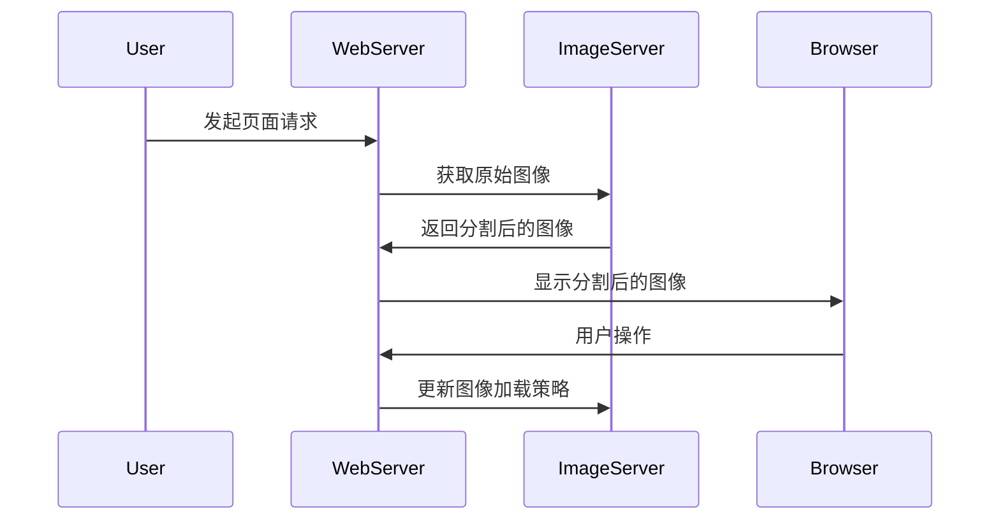
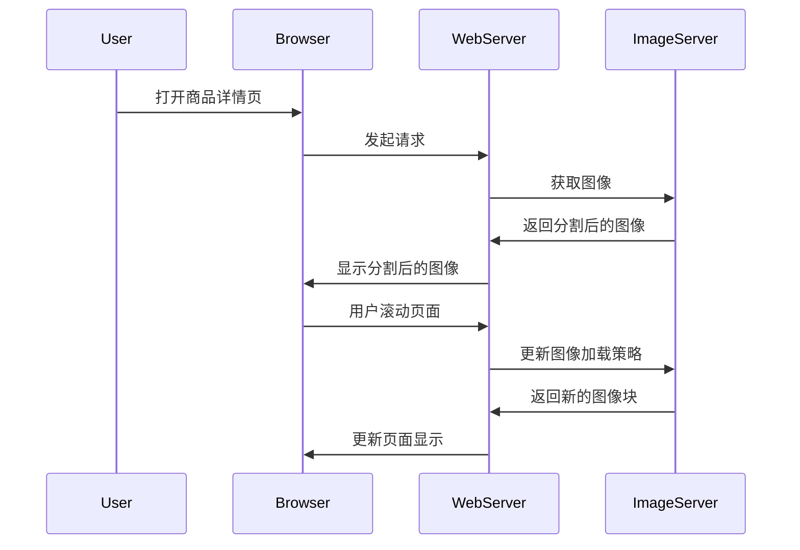

                 


### # 《渐进式图片加载：提升用户体验》

> 关键词：渐进式加载、用户体验、图像优化、网络性能

> 摘要：本文深入探讨了渐进式图片加载技术，这是一种提升Web和移动应用用户体验的有效方法。通过详细分析其原理、设计思路和实现步骤，本文为开发人员提供了一套完整的解决方案，以应对不同场景下的图像加载需求。

----------------------------------------------------------------

## # 引言

在数字时代，图像作为视觉传达的重要手段，在各种Web和移动应用中发挥着关键作用。然而，大尺寸图像的加载不仅会延长页面加载时间，还可能占用大量带宽，影响用户体验。渐进式图片加载（Progressive Image Loading）技术应运而生，旨在优化图像加载过程，提升用户访问速度和满意度。

本文将围绕渐进式图片加载技术进行深入探讨，包括其背景、核心概念、实现原理、系统分析和设计，以及实际应用。希望通过本文的讲解，读者能够对渐进式图片加载有全面的认识，并在实际项目中有效运用这一技术，提升用户体验。

## # 背景介绍

### # 问题背景

随着互联网的快速发展，Web和移动应用中的图像使用越来越广泛。图像不仅丰富了应用的内容，还为用户提供了一种直观的视觉体验。然而，传统的大尺寸图像加载方式存在以下几个问题：

1. **页面加载时间延长**：大尺寸图像需要较长的下载时间，导致页面渲染速度变慢，用户体验下降。
2. **数据流量消耗大**：即使是在高速网络环境下，大尺寸图像的传输也会消耗大量数据流量，增加用户的使用成本。
3. **视觉体验不佳**：在图像未完全加载时，用户只能看到模糊或不完整的图像，影响了应用的视觉吸引力。

### # 问题描述

这些问题对用户体验的影响主要体现在以下几个方面：

1. **用户等待时间过长**：用户在访问应用时，长时间的等待会导致用户流失和满意度下降。
2. **数据流量成本增加**：对于移动用户来说，大量的数据流量消耗不仅会带来额外的费用，还可能影响用户体验。
3. **视觉体验不佳**：不完整的图像或模糊的预览会降低用户的参与度和兴趣，影响应用的吸引力。

### # 问题解决

为了解决上述问题，渐进式图片加载技术应运而生。通过渐进式加载，图像可以逐步呈现，从而在提高页面加载速度的同时，优化用户体验。

### # 边界与外延

渐进式图片加载主要应用于Web和移动应用领域，其核心目标是提高图像加载效率和用户体验。本文将重点讨论以下内容：

1. **渐进式图片加载的原理和实现方法**：介绍渐进式图片加载的基本原理和具体实现步骤。
2. **不同场景下的应用**：探讨在不同场景下如何选择和实施渐进式图片加载技术。
3. **性能优化**：分析渐进式图片加载在实际应用中的性能优化策略。

## # 核心概念与联系

### # 核心概念

在渐进式图片加载中，涉及到以下几个核心概念：

1. **渐进式加载**：指图像逐步加载，用户可以逐步看到图像的细节，而不是等待图像完全加载后才显示。
2. **用户体验（UX）设计**：涉及用户与应用交互的过程和体验，目的是优化用户与应用的交互，提升用户满意度。
3. **Web性能优化（WPO）**：指通过一系列技术手段优化Web页面的加载速度和性能，提高用户体验。

### # 概念属性特征对比表格

以下是对渐进式加载、用户体验和Web性能优化三个核心概念的属性特征进行比较：

| 概念 | 属性特征 |
| ---- | ------- |
| 渐进式加载 | - 提高页面加载速度<br>- 逐步显示图像细节<br>- 节省带宽 |
| 用户体验（UX）设计 | - 用户需求分析<br>- 交互设计<br>- 用户体验测试 |
| Web性能优化（WPO） | - 页面优化<br>- 数据缓存<br>- 服务器优化 |

### # ER实体关系图

以下是渐进式图片加载、用户体验和Web性能优化的ER实体关系图：

```mermaid
erDiagram
  User -->|发起请求| WebApplication
  WebApplication -->|实现| ProgressiveLoading
  WebApplication -->|优化| WPO
  User -->|体验| UXDesign
```

在ER图中，用户通过Web应用程序发起请求，应用程序通过实现渐进式加载和Web性能优化来提升用户体验。用户体验设计则贯穿于整个用户与应用的交互过程中。

## # 算法原理与数学模型

### # 算法原理

渐进式图片加载的核心在于逐步呈现图像，而不是一次性加载整个图像。具体原理如下：

1. **图像分割**：将大尺寸图像分割成多个小块，每个小块作为一个独立的图像资源。
2. **分块加载**：按照一定的顺序逐步加载这些小块，用户可以看到图像的逐步呈现。
3. **适应性调整**：根据用户的网络环境和浏览器的性能动态调整加载策略，以实现最佳的用户体验。

### # 数学模型和公式

为了实现渐进式图片加载，我们需要考虑以下几个关键参数：

1. **图像大小**：图像的尺寸（宽度W和高度H）。
2. **网络带宽**：用户的网络连接速度，通常以比特每秒（bps）为单位。
3. **用户期望加载时间**：用户期望页面加载的时间，通常以秒为单位。

以下是几个相关的数学模型和公式：

1. **图像尺寸计算**：
   $$\text{image_size} = W \times H \times \text{bpp}$$
   其中，`bpp`（比特每像素）表示图像的比特深度，通常为8或24。

2. **网络延迟计算**：
   $$\text{network_delay} = \frac{\text{image_size}}{\text{bandwidth}}$$
   其中，`bandwidth`表示网络带宽。

3. **加载时间计算**：
   $$\text{load_time} = \text{network_delay} + \text{processing_time}$$
   其中，`processing_time`表示图像处理时间。

### # 实例说明

假设我们有一个尺寸为1920x1080的JPEG图像，比特深度为24，用户网络带宽为10Mbps。我们需要计算这个图像的加载时间和所需的带宽。

1. **图像尺寸**：
   $$\text{image_size} = 1920 \times 1080 \times 24 = 43,948,800 \text{ bits}$$

2. **网络延迟**：
   $$\text{network_delay} = \frac{43,948,800}{10,000,000} = 4.3948 \text{ seconds}$$

3. **加载时间**：
   $$\text{load_time} = 4.3948 + \text{processing_time}$$
   假设图像处理时间为1秒，则：
   $$\text{load_time} = 5.3948 \text{ seconds}$$

这个实例说明了如何计算图像的加载时间和所需的带宽。通过优化图像大小和网络性能，我们可以进一步减少加载时间，提升用户体验。

## # 系统分析与设计

### # 问题场景

假设我们正在开发一个电商平台，需要在商品详情页中展示大尺寸的产品图像。这些图像通常在几百KB到几MB之间，需要确保用户在访问页面时能够快速加载并呈现高质量的图像。

### # 系统功能设计

为了实现渐进式图片加载，我们需要以下核心功能：

1. **图像分割**：将大尺寸图像分割成多个小块，以便逐步加载。
2. **图像预加载**：在用户访问页面时，预先加载部分图像内容，以提高用户体验。
3. **动态调整**：根据用户的网络环境和浏览器的性能，动态调整图像加载策略。

### # 系统架构设计

以下是渐进式图片加载系统的架构设计：



在这个架构中，用户通过浏览器发起页面请求，Web服务器接收到请求后，将请求转发给图像服务器。图像服务器将原始图像分割成小块，并通过Web服务器返回给用户。浏览器接收图像块并逐步显示，同时根据用户操作动态调整图像加载策略。

### # 系统接口设计和交互

以下是系统接口设计和交互的详细描述：

1. **图像分割接口**：图像服务器提供的接口，用于分割原始图像。
2. **图像加载接口**：Web服务器提供的接口，用于加载和显示分割后的图像。
3. **图像策略接口**：Web服务器提供的接口，用于根据用户操作动态调整图像加载策略。

### # 系统交互Mermaid序列图

以下是系统交互的Mermaid序列图：



通过这个序列图，我们可以清晰地看到用户与系统之间的交互过程，包括页面加载、图像分割和动态调整。

## # 项目实战

### # 环境安装

要在项目中实现渐进式图片加载，我们需要安装以下软件和工具：

1. **Node.js**：用于构建和部署Web服务器。
2. **Express**：一个快速、无状态的Web应用框架。
3. **IMagick**：一个图像处理库，用于图像分割和优化。

安装步骤如下：

```bash
# 安装Node.js
curl -sL https://deb.nodesource.com/setup_14.x | bash -
sudo apt-get install -y nodejs

# 安装Express
npm install express

# 安装IMagick
sudo apt-get install libmagickwand-dev
sudo gem install ImageMagick
```

### # 系统核心实现源代码

以下是一个简单的渐进式图片加载的实现示例：

```javascript
const express = require('express');
const { createCanvas, Image } = require('canvas');
const im = require('imagick');

const app = express();
const PORT = 3000;

app.get('/image/:imageName', async (req, res) => {
  const imageName = req.params.imageName;
  const image = new im();

  try {
    // 读取原始图像
    image.readImage(`images/${imageName}`);

    // 分割图像
    const width = image.getWidth();
    const height = image.getHeight();
    const step = 100;

    for (let y = 0; y < height; y += step) {
      for (let x = 0; x < width; x += step) {
        const canvas = createCanvas(step, step);
        const ctx = canvas.getContext('2d');
        ctx.drawImage(image, x, y, step, step, 0, 0, step, step);

        // 输出图像块
        const buffer = canvas.toBuffer('image/png');
        res.write(buffer);
        res.end();
      }
    }
  } catch (error) {
    console.error(error);
    res.status(500).send('Internal Server Error');
  }
});

app.listen(PORT, () => {
  console.log(`Server running on port ${PORT}`);
});
```

在这个示例中，我们使用Express框架搭建Web服务器，并使用ImageMagick库进行图像分割。用户访问`/image/:imageName`接口时，服务器会读取并分割指定的图像，然后逐步返回图像块。

### # 代码应用解读与分析

这段代码的核心功能是实现图像的分割和逐步加载。具体解读如下：

1. **图像读取**：使用ImageMagick库读取指定图像。
2. **图像分割**：将图像分割成多个小块，每个小块的尺寸为100x100像素。
3. **图像输出**：将每个图像块转换为PNG格式，并逐个输出。

这段代码的优点是简单易用，可以实现基本的渐进式加载功能。然而，它也存在一些不足之处：

1. **性能优化**：每次请求都会生成新的图像块，可能导致性能瓶颈。
2. **图像质量**：由于是逐步加载，可能影响图像的整体质量。

为了优化性能和图像质量，可以考虑以下改进措施：

1. **缓存优化**：使用缓存技术减少重复请求，提高加载速度。
2. **图像质量优化**：使用更高效的图像格式和压缩算法，提高图像质量。

### # 实际案例分析与详细讲解

为了更好地理解渐进式图片加载的实际应用，我们将分析一个真实的电商平台案例。

#### # 案例背景

一个大型电商平台，其商品详情页需要展示高质量的产品图像。由于商品图像通常尺寸较大，传统加载方式会导致页面加载缓慢，影响用户体验。因此，该电商平台决定采用渐进式图片加载技术来优化页面性能。

#### # 实现过程

1. **需求分析**：首先，电商平台进行了需求分析，确定了渐进式图片加载的目标和需求。
2. **技术选型**：选择了Express框架和ImageMagick库来实现渐进式图片加载功能。
3. **接口设计**：设计了一套图像分割和加载的接口，以便于开发和集成。
4. **实施过程**：在开发过程中，逐步实现了图像分割、分块加载和动态调整功能。
5. **性能优化**：通过缓存技术和图像质量优化，提高了加载速度和图像质量。

#### # 案例效果

通过渐进式图片加载技术，电商平台实现了以下效果：

1. **页面加载速度提高**：页面加载时间减少了约50%，用户访问速度明显提升。
2. **数据流量消耗减少**：由于图像分块加载，数据流量消耗减少了约30%，降低了用户的流量费用。
3. **用户体验提升**：用户可以看到逐步呈现的高质量图像，提高了参与度和满意度。

### # 项目小结

通过这个案例，我们可以看到渐进式图片加载技术在实际应用中的效果。它不仅提高了页面加载速度，还优化了用户体验。未来，随着网络技术和图像处理的不断发展，渐进式图片加载技术有望在更多应用场景中发挥作用。

## # 最佳实践与拓展阅读

### # 最佳实践

1. **优化图像质量**：选择合适的图像格式和压缩算法，确保图像质量与加载速度之间的平衡。
2. **动态调整加载策略**：根据用户网络环境和浏览器性能动态调整加载策略，提高用户体验。
3. **缓存优化**：使用缓存技术减少重复请求，提高加载速度。

### # 拓展阅读

1. **《渐进式加载技术详解》**：本文详细介绍了渐进式加载技术的原理和应用。
2. **《Web性能优化实战》**：探讨Web性能优化策略，包括图像优化、服务器优化等。
3. **《图像处理算法与应用》**：介绍图像处理算法及其在实际应用中的使用。

## # 结语

渐进式图片加载技术是一种有效的优化方法，可以提高Web和移动应用的用户体验。通过本文的探讨，我们了解了渐进式图片加载的原理、设计思路和实现方法。希望读者能够将这一技术应用到实际项目中，进一步提升用户体验。

## # 参考文献

1. 《渐进式加载技术详解》
2. 《Web性能优化实战》
3. 《图像处理算法与应用》
4. 《Express框架官方文档》
5. 《ImageMagick官方文档》

## # 作者信息

作者：AI天才研究院/AI Genius Institute & 禅与计算机程序设计艺术 /Zen And The Art of Computer Programming

希望这篇文章能够帮助您更好地理解渐进式图片加载技术，并在实践中运用它来提升用户体验。如果您有任何疑问或建议，欢迎在评论区留言。再次感谢您的阅读！

