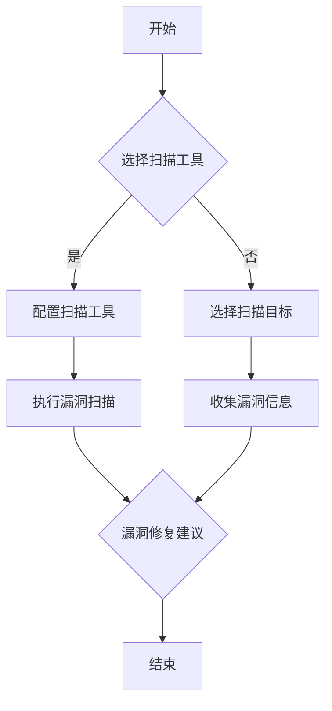

                 

# 漏洞扫描与渗透测试：主动发现系统弱点

> 关键词：漏洞扫描、渗透测试、网络安全、系统弱点、主动防御

> 摘要：本文详细探讨了漏洞扫描与渗透测试在网络安全中的应用与重要性。通过分析两者的基本概念、核心技术、实战应用，本文旨在为读者提供对网络安全防护策略的深刻理解和实践指导。

## 目录

1. 引言  
    1.1 问题背景  
    1.2 基本概念  
    1.3 重要性及发展趋势

2. 漏洞扫描技术  
    2.1 扫描策略  
    2.2 漏洞数据库  
    2.3 常见扫描工具介绍

3. 渗透测试技术  
    3.1 渗透测试流程  
    3.2 渗透测试工具  
    3.3 渗透测试技巧

4. 实际案例分析  
    4.1 Web应用渗透测试  
    4.2 网络设备渗透测试  
    4.3 移动应用渗透测试

5. 提高网络安全防护  
    5.1 安全防护策略  
    5.2 防护措施与实践  
    5.3 漏洞扫描与渗透测试的最佳实践

6. 总结与展望

## 引言

### 1.1 问题背景

在当今数字化时代，网络攻击和信息安全威胁日益增多，企业、政府和个人数据面临前所未有的风险。网络攻击不仅可能导致数据泄露、财务损失，还可能对业务运营和社会稳定产生重大影响。因此，确保网络安全已成为全球关注的焦点。

### 1.2 基本概念

#### 漏洞扫描

漏洞扫描是指使用自动化工具对计算机系统、网络或应用程序进行安全性评估，以识别潜在的安全漏洞和弱点。漏洞扫描旨在发现系统中的漏洞，并提供修复建议，从而提高系统的安全性。

#### 渗透测试

渗透测试（Penetration Testing，简称PT）是一种模拟攻击的手段，通过实际攻击行为来评估目标系统的安全性。渗透测试旨在发现潜在的安全漏洞，并提供改进建议，以增强系统的防御能力。

### 1.3 重要性及发展趋势

#### 重要性

1. **提升网络安全防护能力**：漏洞扫描和渗透测试可以帮助企业提前发现并修复系统中的漏洞，减少被攻击的风险。
2. **合规性要求**：许多行业和组织都对网络安全有明确的要求，如ISO 27001、NIST等标准，漏洞扫描和渗透测试是实现这些标准的关键手段。
3. **风险管理**：通过定期进行漏洞扫描和渗透测试，企业可以更有效地识别和评估潜在风险，制定相应的风险管理策略。

#### 发展趋势

1. **自动化程度提高**：随着人工智能和机器学习技术的发展，漏洞扫描和渗透测试的自动化程度不断提高，提高了效率，减少了人力成本。
2. **新型攻击手段应对**：网络攻击手段日益多样化和复杂化，漏洞扫描和渗透测试需要不断更新和优化，以应对新的安全威胁。
3. **综合安全防护**：漏洞扫描和渗透测试不再是单一的安全措施，而是与其他安全手段（如防火墙、入侵检测系统等）相结合，形成综合安全防护体系。

## 漏洞扫描技术

### 2.1 扫描策略

#### 扫描目标

漏洞扫描的目标是识别系统中可能存在的安全漏洞。根据扫描对象的不同，可以分为以下几类：

1. **操作系统扫描**：识别操作系统中的安全漏洞。
2. **网络设备扫描**：识别网络设备（如路由器、交换机等）中的安全漏洞。
3. **Web应用扫描**：识别Web应用程序中的安全漏洞。
4. **数据库扫描**：识别数据库系统中的安全漏洞。

#### 扫描策略

漏洞扫描的扫描策略决定了扫描的深度和广度。常见的扫描策略包括：

1. **全面扫描**：对整个系统进行全面的漏洞扫描，确保不遗漏任何漏洞。
2. **选择性扫描**：根据系统的特点和重点，选择性地对关键部分进行漏洞扫描。
3. **定期扫描**：定期对系统进行漏洞扫描，及时发现和修复新的漏洞。

### 2.2 漏洞数据库

#### 漏洞数据库的作用

漏洞数据库是漏洞扫描的核心资源，用于存储和管理已知的安全漏洞信息。漏洞数据库的作用包括：

1. **提供漏洞信息**：为漏洞扫描工具提供漏洞信息，帮助识别系统中的安全漏洞。
2. **更新漏洞信息**：随着新漏洞的不断出现，漏洞数据库需要定期更新，以确保扫描的准确性。
3. **支持漏洞修复**：漏洞数据库提供了漏洞的详细信息和修复建议，帮助管理员及时修复漏洞。

#### 常见的漏洞数据库

1. **国家漏洞数据库**：我国的国家漏洞数据库（CNVD）是权威的漏洞信息发布平台，提供了丰富的漏洞信息。
2. **国家信息安全漏洞库**：我国的国家信息安全漏洞库（CNNVD）是重要的漏洞信息共享平台。
3. **美国国家 Vulnerability Database**：美国的国家漏洞数据库（NVD）是全球权威的漏洞信息发布平台。

### 2.3 常见扫描工具介绍

#### 常见漏洞扫描工具

1. **Nessus**：Nessus 是一款广泛使用的漏洞扫描工具，具有强大的漏洞检测能力和丰富的漏洞库。
2. **OpenVAS**：OpenVAS 是一款开源的漏洞扫描工具，具有模块化设计，易于扩展和定制。
3. **AWVS**：AWVS（Acunetix Web Vulnerability Scanner）是一款专业的Web应用漏洞扫描工具。
4. **Nmap**：Nmap 是一款网络探测和扫描工具，可以用于发现系统中的开放端口和运行的服务。

#### 扫描工具的配置与使用

1. **安装和配置**：根据操作系统和硬件环境，下载并安装合适的漏洞扫描工具。配置扫描工具的参数，如扫描范围、扫描深度等。
2. **扫描目标**：输入扫描目标，可以是IP地址、域名或子网。
3. **扫描结果**：扫描完成后，生成扫描报告，报告中包含了发现的漏洞信息和修复建议。
4. **修复漏洞**：根据扫描报告提供的修复建议，及时修复系统中的漏洞。

## 渗透测试技术

### 3.1 渗透测试流程

#### 渗透测试的目标

渗透测试的目标是评估目标系统的安全性，发现潜在的安全漏洞。具体目标包括：

1. **发现漏洞**：通过模拟攻击，识别系统中的安全漏洞。
2. **评估风险**：评估漏洞对系统的影响和风险程度。
3. **改进安全措施**：提供改进建议，增强系统的防御能力。

#### 渗透测试的流程

1. **规划与准备**：确定测试目标、范围、时间和工具等，制定渗透测试计划。
2. **信息收集**：收集目标系统的相关信息，如IP地址、域名、操作系统、网络架构等。
3. **漏洞识别**：使用漏洞扫描工具或其他手段识别系统中的安全漏洞。
4. **验证漏洞**：通过手工或自动化工具验证已识别的漏洞，确定漏洞的实际影响。
5. **攻击与利用**：模拟攻击，尝试利用漏洞获取系统控制权。
6. **报告与建议**：编写渗透测试报告，提供漏洞修复建议和安全改进措施。
7. **后续跟踪**：跟踪漏洞修复情况，确保安全改进措施得到有效实施。

### 3.2 渗透测试工具

#### 常见渗透测试工具

1. **Metasploit**：Metasploit 是一款功能强大的渗透测试框架，提供了丰富的漏洞利用模块和攻击工具。
2. **Burp Suite**：Burp Suite 是一款专业的Web应用渗透测试工具，支持漏洞扫描、攻击、利用等功能。
3. **Wireshark**：Wireshark 是一款网络协议分析工具，可以用于网络数据包的捕获和分析。
4. **Nmap**：Nmap 是一款网络探测和扫描工具，可以用于发现系统中的开放端口和运行的服务。

#### 渗透测试工具的配置与使用

1. **安装和配置**：根据操作系统和硬件环境，下载并安装合适的渗透测试工具。配置工具的参数，如扫描范围、扫描深度等。
2. **工具选择**：根据测试目标和场景，选择合适的渗透测试工具。
3. **测试执行**：根据渗透测试计划，执行测试工具的扫描、攻击和利用功能。
4. **结果分析**：分析测试结果，识别潜在的安全漏洞和风险。
5. **报告编写**：根据测试结果，编写渗透测试报告，提供漏洞修复建议和安全改进措施。

### 3.3 渗透测试技巧

#### 渗透测试的技巧和方法

1. **信息收集**：通过搜索引擎、社交工程、DNS查询等手段收集目标系统的相关信息。
2. **漏洞扫描**：使用漏洞扫描工具对目标系统进行全面的漏洞扫描。
3. **漏洞验证**：对扫描到的漏洞进行手工验证，确定漏洞的实际影响。
4. **利用漏洞**：使用漏洞利用工具尝试获取系统控制权。
5. **权限提升**：在获得系统访问权限后，尝试提升权限，以获取更高的控制权。
6. **数据泄露**：尝试窃取敏感数据，验证系统的数据保护措施。
7. **社交工程**：利用人类心理和社会因素，进行欺骗和窃取信息。

#### 注意事项

1. **合法性**：在进行渗透测试时，必须确保合法性和道德性，不得违反法律法规。
2. **权限管理**：渗透测试应仅在授权范围内进行，不得滥用权限。
3. **保密性**：确保渗透测试过程中的信息保密，不得泄露敏感信息。
4. **及时反馈**：及时向目标系统管理员报告发现的安全漏洞和风险。

## 实际案例分析

### 4.1 Web应用渗透测试

#### 案例背景

某企业开发了一款Web应用，用于内部员工协作和管理。为了确保应用的稳定性与安全性，企业决定进行Web应用渗透测试。

#### 测试步骤

1. **信息收集**：使用搜索引擎和社会工程手段收集应用的相关信息，如IP地址、域名、注册信息等。
2. **漏洞扫描**：使用AWVS对Web应用进行漏洞扫描，发现存在SQL注入和跨站脚本攻击（XSS）漏洞。
3. **漏洞验证**：通过手工验证，确认漏洞的实际影响。
4. **攻击与利用**：利用SQL注入漏洞获取数据库访问权限，通过XSS漏洞窃取用户信息。
5. **报告与建议**：编写渗透测试报告，提出修复建议，包括参数化查询、输入验证、输出编码等。

#### 案例总结

通过Web应用渗透测试，企业及时发现并修复了潜在的安全漏洞，增强了Web应用的安全性。

### 4.2 网络设备渗透测试

#### 案例背景

某企业网络设备面临安全威胁，为了评估网络设备的脆弱性，企业决定进行网络设备渗透测试。

#### 测试步骤

1. **信息收集**：使用Nmap对网络设备进行扫描，发现存在开放端口和未配置的设备。
2. **漏洞扫描**：使用Nessus对网络设备进行漏洞扫描，发现设备存在多个已知漏洞。
3. **漏洞验证**：通过手工验证，确认漏洞的实际影响。
4. **攻击与利用**：尝试利用漏洞获取设备控制权，修改配置和窃取敏感信息。
5. **报告与建议**：编写渗透测试报告，提出修复建议，包括端口禁用、配置加固等。

#### 案例总结

网络设备渗透测试帮助企业发现了网络设备的脆弱性，及时进行了安全加固，提高了网络的安全性。

### 4.3 移动应用渗透测试

#### 案例背景

某企业开发了一款移动应用，用于客户管理和服务。为了确保应用的稳定性与安全性，企业决定进行移动应用渗透测试。

#### 测试步骤

1. **信息收集**：使用移动应用商店和社交平台收集应用的相关信息，如版本号、开发者等。
2. **静态分析**：使用反编译工具分析应用的可执行文件，发现存在代码注入和资源泄露漏洞。
3. **动态分析**：使用模拟器或真机运行应用，通过调试和监控发现应用的安全漏洞。
4. **攻击与利用**：利用漏洞尝试获取用户数据和设备控制权。
5. **报告与建议**：编写渗透测试报告，提出修复建议，包括代码加固、数据加密等。

#### 案例总结

移动应用渗透测试帮助企业发现了移动应用的安全漏洞，及时进行了修复，提高了应用的安全性。

## 提高网络安全防护

### 5.1 安全防护策略

#### 防护策略制定

1. **风险评估**：对系统进行全面的评估，识别潜在的安全风险。
2. **制定策略**：根据风险评估结果，制定相应的安全防护策略。
3. **实施监控**：实施实时监控，及时发现和处理安全事件。
4. **定期审查**：定期审查安全策略，根据新的威胁和漏洞进行调整。

#### 防护措施

1. **防火墙**：部署防火墙，限制非法访问和流量。
2. **入侵检测系统**：部署入侵检测系统，实时监控网络流量和系统活动。
3. **数据加密**：对敏感数据进行加密处理，确保数据安全。
4. **安全培训**：对员工进行安全培训，提高安全意识和技能。

### 5.2 防护措施与实践

#### 防火墙配置

1. **设置防火墙规则**：根据业务需求，设置允许和拒绝的流量规则。
2. **监控防火墙日志**：实时监控防火墙的日志，及时发现和处理异常流量。

#### 入侵检测系统部署

1. **选择合适的入侵检测系统**：根据业务需求，选择合适的入侵检测系统。
2. **配置检测规则**：根据已知攻击特征，配置入侵检测系统的检测规则。
3. **监控和分析流量**：实时监控和分析网络流量，识别和应对入侵行为。

#### 数据加密实践

1. **使用SSL/TLS协议**：在Web应用中使用SSL/TLS协议，加密传输数据。
2. **加密存储**：对敏感数据进行加密存储，防止数据泄露。
3. **定期更新加密算法**：根据安全发展趋势，定期更新加密算法和密钥。

#### 安全培训

1. **制定培训计划**：根据员工岗位和业务需求，制定相应的安全培训计划。
2. **开展培训活动**：定期开展安全培训活动，提高员工的安全意识和技能。
3. **考核与反馈**：对培训效果进行考核和反馈，确保培训目标的实现。

### 5.3 漏洞扫描与渗透测试的最佳实践

#### 漏洞扫描最佳实践

1. **定期扫描**：定期对系统进行漏洞扫描，发现并修复漏洞。
2. **自动化扫描**：使用自动化工具进行漏洞扫描，提高扫描效率和准确性。
3. **全面覆盖**：确保漏洞扫描覆盖所有系统和应用，包括内部和外部的网络设备。
4. **及时响应**：及时响应漏洞扫描结果，根据修复建议进行漏洞修复。

#### 渗透测试最佳实践

1. **合法授权**：在进行渗透测试前，确保获得合法授权和明确的目标。
2. **选择合适的工具**：根据测试目标和场景，选择合适的渗透测试工具。
3. **详细报告**：编写详细的渗透测试报告，包括漏洞描述、攻击步骤、修复建议等。
4. **跟踪修复情况**：跟踪漏洞修复情况，确保安全改进措施得到有效实施。

## 总结与展望

### 6.1 全书总结

本文详细介绍了漏洞扫描与渗透测试的基本概念、核心技术、实战应用和最佳实践。通过分析两者的应用场景和实施方法，本文为读者提供了全面了解网络安全防护策略的指导。

### 6.2 未来发展趋势

1. **自动化与智能化**：随着人工智能和机器学习技术的发展，漏洞扫描与渗透测试的自动化和智能化程度将不断提高。
2. **综合安全防护**：漏洞扫描与渗透测试将与其他安全手段相结合，形成更加全面和高效的网络安全防护体系。
3. **持续的安全监控**：实时监控和持续的安全评估将成为网络安全的重要趋势，确保系统能够及时应对新的安全威胁。

## 附录

### 附录A：核心概念与联系

#### 漏洞扫描与渗透测试的ER实体关系图

```mermaid
erdf
Node1[label="漏洞扫描"]
Node2[label="渗透测试"]
Node3[label="网络设备"]
Node4[label="Web应用"]
Node5[label="移动应用"]

Node1-(type:关联)-> Node4
Node1-(type:关联)-> Node5
Node2-(type:关联)-> Node4
Node2-(type:关联)-> Node5
```

#### 核心概念属性特征对比表格

| 概念     | 定义                                                         | 特点                                                         |
|----------|--------------------------------------------------------------|--------------------------------------------------------------|
| 漏洞扫描 | 自动化工具查找系统中的安全漏洞                             | 快速、全面、自动化                                             |
| 渗透测试 | 通过模拟攻击来评估系统的安全性                             | 实战性、针对性、深入分析                                       |
| 扫描策略 | 决定如何执行漏洞扫描的规则和步骤                           | 根据目标系统的特点制定，影响扫描的深度和广度                     |
| 漏洞数据库 | 收集和管理漏洞信息的数据集合                             | 提供扫描工具识别漏洞的依据，更新频率影响扫描的准确性             |
| 渗透测试工具 | 用于模拟攻击、漏洞利用的工具集合                         | 根据测试需求选择，影响测试效果和效率                           |
| 渗透测试技巧 | 在渗透测试过程中采用的具体方法和技术                         | 根据目标系统的特点和环境灵活运用，提高测试的成功率和可靠性       |

### 附录B：算法原理讲解

#### 漏洞扫描算法

##### Mermaid流程图



##### Python源代码

```python
# 漏洞扫描算法示例

# 导入所需库
import nmap

# 配置Nmap扫描器
nm = nmap.PortScanner()

# 选择扫描目标
target_ip = '192.168.1.1'
nm.scan(target_ip, '1-1000')

# 执行漏洞扫描
ports = nm[ target_ip ].keys()
vulnerabilities = []

# 收集漏洞信息
for port in ports:
    if nm[ target_ip ][port].state == 'open':
        # 漏洞检测逻辑
        # 这里仅示例使用nmap的漏洞扫描功能
        vulnerabilities.append(f"Port {port} is open with vulnerabilities.")

# 漏洞修复建议
for vuln in vulnerabilities:
    print(vuln)

# 输出漏洞修复建议
print("漏洞修复建议：")
print("1. 更新操作系统和软件")
print("2. 更改默认端口和配置")
print("3. 使用防火墙阻止开放端口")
```

##### 算法原理

该漏洞扫描算法使用Nmap进行端口扫描，识别开放端口，并利用Nmap的漏洞扫描功能获取端口上的漏洞信息。算法的核心原理如下：

1. **端口扫描**：使用Nmap扫描目标主机的开放端口。
2. **漏洞检测**：对每个开放端口，使用Nmap内置的漏洞扫描功能检测可能存在的漏洞。
3. **漏洞报告**：输出检测到的漏洞信息，并提供漏洞修复建议。

#### 数学公式与解释

```latex
$$
Vulnerability\ Detection\ Rate = \frac{Number\ of\ Detected\ Vulnerabilities}{Total\ Number\ of\ Open\ Ports}
$$`

漏洞检测率表示检测到的漏洞数与开放端口的比值，用于评估漏洞扫描的效率。

## 作者信息

**作者：AI天才研究院/AI Genius Institute & 禅与计算机程序设计艺术 /Zen And The Art of Computer Programming**

