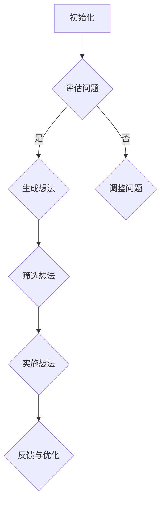
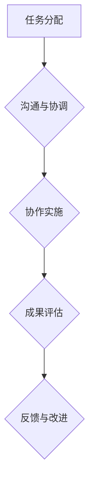
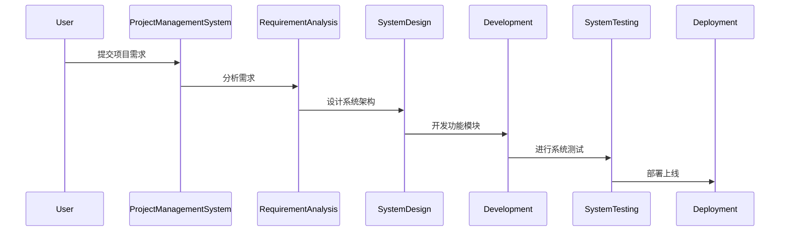
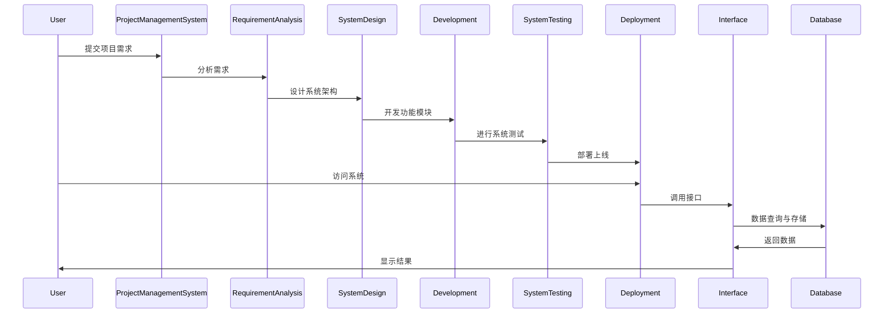

                 

# 激发团队技术创新的有效方式

> 关键词：团队技术创新，创新思维，资源管理，团队协作，算法原理，数学模型

> 摘要：本文深入探讨了激发团队技术创新的有效方式，通过分析技术创新的核心概念、关联关系，以及具体的算法原理和数学模型，为读者提供了系统、可操作的策略和方法。文章旨在帮助企业在快速变化的市场环境中，通过有效的团队管理，提升技术创新能力，保持竞争优势。

----------------------------------------------------------------

## 第1章 背景介绍

### 1.1 问题背景

在当前高度竞争的市场环境中，企业要想保持竞争力，必须依靠技术创新。然而，许多企业在激发团队技术创新方面面临诸多挑战。首先，团队成员可能缺乏创新思维，导致在解决问题时无法提出新颖的解决方案。其次，资源分配不当和利用效率低下，也会限制团队的创新能力。此外，团队内部沟通不畅和协作效率低下，也是阻碍技术创新的重要因素。最后，企业文化可能不鼓励创新，从而限制了团队成员的创新动力。

### 1.2 问题描述

技术创新的障碍主要包括以下几个方面：

1. **创新思维缺乏**：团队成员可能缺乏创新意识，或者无法将创新思维应用到实际问题中。
2. **资源不足**：企业可能没有足够的资源来支持创新活动，包括资金、设备、人力资源等。
3. **沟通不畅**：团队内部成员之间缺乏有效的沟通渠道，导致信息传递不畅，影响创新活动的推进。
4. **组织文化不鼓励创新**：企业文化可能更倾向于保守，对创新持怀疑态度，从而抑制了团队成员的创新意愿。

### 1.3 问题解决

本书将提供一系列有效的策略和方法，以帮助团队克服这些障碍，激发技术创新。这些策略和方法包括：

1. **培养创新思维**：通过培训和教育，提高团队成员的创新意识和能力。
2. **优化资源管理**：合理分配和利用资源，确保资源能够高效地支持创新活动。
3. **改善团队协作**：建立高效的团队协作机制，促进信息共享和沟通。
4. **营造创新文化**：在企业内部营造鼓励创新、容忍失败的氛围，激发团队成员的创新热情。

### 1.4 边界与外延

技术创新不仅限于技术本身，还可以体现在产品、服务、流程等各个方面。例如，通过技术创新，企业可以开发出更高效的产品或服务，优化现有的流程，提高生产效率和质量。

### 1.5 概念结构与核心要素组成

在本章中，我们将介绍以下核心概念和要素：

1. **创新思维**：团队在解决问题和发现机会时的思维方式。
2. **资源管理**：如何有效利用企业内外部的资源，支持团队创新。
3. **团队协作**：团队内部如何协同工作，共同实现创新目标。

这些概念之间的关系如下：

- 创新思维是团队创新能力的核心，直接影响技术创新的成功。
- 资源管理为创新提供了必要的支持和保障。
- 团队协作是实现创新目标的关键，通过有效的协作，团队可以发挥出更大的创新潜力。

## 第2章 核心概念与联系

### 2.1 创新思维

创新思维是指团队在解决问题和发现机会时的思维方式。创新思维包括以下几个方面：

1. **创造性**：指团队成员在思考问题时能够跳出传统的思维框架，提出新颖的解决方案。
2. **系统性**：指团队成员在解决问题时，能够从整体的角度出发，考虑问题的各个方面，找到最佳解决方案。
3. **风险性**：指团队成员在创新过程中，愿意接受失败和挑战，勇于尝试新的方法和思路。

### 2.2 资源管理

资源管理是指如何有效利用企业内外部的资源，支持团队创新。资源管理包括以下几个方面：

1. **效率性**：指如何通过优化资源利用，提高创新活动的效率。
2. **可持续性**：指如何在保证当前创新活动顺利进行的同时，考虑长期资源的可持续利用。
3. **敏活性**：指如何快速响应市场变化，灵活调整资源分配，以支持创新活动。

### 2.3 团队协作

团队协作是技术创新成功的关键。有效的团队协作包括以下几个方面：

1. **共识性**：指团队在目标、方法、结果等方面达成一致，确保团队成员齐心协力。
2. **反应性**：指团队在面对问题和挑战时，能够迅速作出反应，调整策略和行动。
3. **成长性**：指团队在协作过程中，能够不断学习和成长，提高整体创新能力。

### 2.4 概念属性特征对比表格

以下是创新思维、资源管理、团队协作三个核心概念的一些属性特征对比表格：

| 概念          | 特征1   | 特征2   | 特征3   |
|--------------|--------|--------|--------|
| 创新思维      | 创造性 | 系统性 | 风险性 |
| 资源管理      | 效率性 | 可持续性 | 敏活性 |
| 团队协作      | 共识性 | 反应性 | 成长性 |

### 2.5 ER实体关系图架构

以下是一个技术创新过程中的实体关系图架构示例，使用Mermaid语法绘制：

```mermaid
erDiagram
    Team ||--|{ Resource }|| Resource
    Team ||--|{ Innovation}|| Innovation
    Team ||--|{ Collaboration}|| Collaboration
```

在上述ER图中，Team（团队）与Resource（资源）、Innovation（创新）和Collaboration（协作）之间存在着紧密的联系。资源管理为团队提供必要的支持，创新思维是团队推动创新的核心动力，而团队协作则是将创新思维和资源管理有效结合，实现创新目标的关键。

## 第3章 算法原理讲解

### 3.1 创新思维算法

本章将介绍一种基于人工智能的创新思维算法，并使用Mermaid语法绘制其流程图。



在上述流程图中，创新思维算法包括以下步骤：

1. **初始化**：确定创新目标和初始条件。
2. **评估问题**：分析当前问题和市场需求，确定创新方向。
3. **生成想法**：通过人工智能算法，生成一系列可能的创新解决方案。
4. **筛选想法**：对生成的想法进行筛选，选择最具潜力的方案。
5. **实施想法**：将筛选出的方案付诸实践，进行实际验证。
6. **反馈与优化**：根据实施结果，对方案进行反馈和优化，不断提升创新效果。

### 3.2 资源管理算法

本章将介绍一种基于机器学习的资源管理算法，并使用Python代码详细阐述其原理。

```python
# 资源管理算法的Python代码示例

# 导入必要的库
import numpy as np
import pandas as pd
from sklearn.model_selection import train_test_split
from sklearn.ensemble import RandomForestRegressor

# 数据准备
# 假设我们有一个关于资源利用的数据集
data = pd.DataFrame({
    'Resource': ['资金', '设备', '人力'],
    'Utilization': [0.8, 0.6, 0.7],
    'Efficiency': [0.9, 0.85, 0.88]
})

# 特征工程
# 将类别特征转换为数值特征
data_encoded = pd.get_dummies(data[['Resource']], drop_first=True)

# 分割数据集
X = data_encoded.drop('Efficiency', axis=1)
y = data_encoded['Efficiency']
X_train, X_test, y_train, y_test = train_test_split(X, y, test_size=0.2, random_state=42)

# 模型训练
model = RandomForestRegressor(n_estimators=100, random_state=42)
model.fit(X_train, y_train)

# 模型评估
score = model.score(X_test, y_test)
print(f"模型准确度：{score:.2f}")

# 算法原理与公式讲解
$$
\text{效率} = \frac{\text{完成任务的时间}}{\text{资源投入量}}
$$

# 举例说明
# 假设我们需要预测一个新项目的资源效率
new_project = pd.DataFrame({
    '资金': [1],
    '设备': [0],
    '人力': [1]
})
new_project_encoded = pd.get_dummies(new_project[['资金', '设备', '人力']], drop_first=True)
predicted_efficiency = model.predict(new_project_encoded)
print(f"预测的效率：{predicted_efficiency[0]:.2f}")
```

在上述示例中，我们使用随机森林回归模型来预测资源利用的效率。通过将类别特征转换为数值特征，我们可以利用机器学习算法对资源管理进行定量分析，从而优化资源利用效率。

### 3.3 团队协作算法

本章将介绍一种基于自然语言处理（NLP）的团队协作算法，并使用Mermaid语法绘制其流程图。



在上述流程图中，团队协作算法包括以下步骤：

1. **任务分配**：根据团队成员的能力和职责，分配任务。
2. **沟通与协调**：通过有效的沟通渠道，确保团队成员了解任务要求，并协调各项工作。
3. **协作实施**：团队成员共同完成任务，实现项目目标。
4. **成果评估**：对团队协作的效果进行评估，识别优势和不足。
5. **反馈与改进**：根据评估结果，对团队协作过程进行反馈和改进，不断提升团队协作效率。

## 第4章 数学模型和数学公式 & 详细讲解 & 举例说明

### 4.1 创新效率模型

本章将介绍一种创新效率模型，并使用LaTeX格式书写其数学公式。

$$
\text{创新效率} = \frac{\text{创新成果}}{\text{创新投入}}
$$

创新效率模型是衡量团队创新效果的重要指标。它通过计算创新成果与创新投入的比值，反映了团队在创新过程中的效率。创新成果可以包括新产品、新服务、新流程等，而创新投入则包括人力、资金、时间等资源。

### 4.2 资源优化模型

本章将介绍一种资源优化模型，并使用LaTeX格式书写其数学公式。

$$
\text{最小化} \quad \text{成本} = \text{资源量} \times \text{单价}
$$

资源优化模型的目标是最大化资源利用效率，同时最小化成本。在给定资源量和单价的情况下，通过优化资源分配，可以实现成本的最小化。例如，在一个创新项目中，企业需要确定最佳的资金、设备、人力等资源的投入比例，以实现成本的有效控制。

### 4.3 团队协作效能模型

本章将介绍一种团队协作效能模型，并使用LaTeX格式书写其数学公式。

$$
\text{协作效能} = \frac{\text{团队成果}}{\text{团队成员工作量}}
$$

团队协作效能模型是衡量团队协作效果的重要指标。它通过计算团队成果与团队成员工作量的比值，反映了团队协作的效率。团队成果可以是完成的项目、解决的问题等，而团队成员工作量则包括个人的工作时间和工作量。

### 4.4 应用举例

以下是一个关于创新效率模型的实际应用举例。

假设一个团队在一个月内完成了两个创新项目，项目A的成果是一个新产品，项目B的成果是一个新服务。团队在这两个项目上的投入分别为人力100小时、资金50万元和设备20台。计算该团队在一个月内的创新效率。

首先，计算创新成果：
- 项目A的创新成果 = 新产品价值 = 100万元
- 项目B的创新成果 = 新服务价值 = 30万元

然后，计算创新投入：
- 人力投入 = 100小时 × 每小时工资 = 10000元
- 资金投入 = 50万元
- 设备投入 = 20台 × 单价 = 40万元

总创新投入 = 10000元 + 50万元 + 40万元 = 910000元

最后，计算创新效率：
$$
\text{创新效率} = \frac{\text{创新成果}}{\text{创新投入}} = \frac{100万元 + 30万元}{910000元} \approx 0.411
$$

因此，该团队在一个月内的创新效率约为41.1%。

通过上述计算，我们可以看出，该团队在创新项目中的效率较高。为了进一步提高效率，团队可以考虑优化资源分配，减少不必要的投入，或者加强团队成员的协作，提高项目的完成质量。

### 4.5 结论

通过数学模型的应用，我们可以更科学、准确地衡量团队的创新效率，发现团队在创新过程中存在的问题，并采取针对性的措施进行改进。同时，数学模型也为企业制定资源分配策略提供了理论依据，帮助企业实现资源的最优利用，提高整体竞争力。

## 第5章 系统分析与架构设计方案

### 5.1 问题场景介绍

在一个快速发展的科技公司，团队技术创新是公司发展的核心动力。为了提升团队的技术创新能力，公司决定开发一个创新管理平台，以支持团队的创新活动。该平台需要具备以下几个功能：

1. **创新项目管理**：支持项目从构思、规划、执行到评估的全生命周期管理。
2. **资源管理**：实时监控和优化团队资源分配，确保资源能够高效利用。
3. **团队协作**：提供协作工具，促进团队成员之间的沟通和协作。
4. **数据分析和报告**：基于平台数据，生成创新活动分析报告，为管理层提供决策支持。

### 5.2 项目介绍

创新管理平台项目旨在搭建一个集成化的创新管理平台，以提升团队的技术创新能力。项目分为三个阶段：

1. **需求分析**：与团队成员沟通，明确平台功能需求。
2. **系统设计**：根据需求分析结果，设计系统架构和数据库设计。
3. **开发与测试**：开发平台功能模块，进行系统测试和优化。

### 5.3 系统功能设计(领域模型Mermaid类图)

以下是创新管理平台的领域模型Mermaid类图：

```mermaid
classDiagram
    Project <<entity>>
    Resource <<entity>>
    Team <<entity>>
    Collaboration <<entity>>
    Task <<entity>>
    Idea <<entity>>

    Project o--o Resource
    Project o--o Team
    Project o--o Collaboration
    Project o--o Task
    Project o--o Idea
```

在上述类图中，Project（项目）是系统的核心实体，与其他实体（Resource、Team、Collaboration、Task、Idea）之间存在关联。这些实体共同构成了创新管理平台的核心领域模型。

### 5.4 系统架构设计(Mermaid架构图)

以下是创新管理平台的系统架构设计Mermaid架构图：



在上述序列图中，用户通过ProjectManagementSystem（项目管理系统）提交项目需求，系统经过需求分析、系统设计、开发与测试等环节，最终实现系统的部署上线。

### 5.5 系统接口设计和系统交互(Mermaid序列图)

以下是创新管理平台的接口设计和系统交互Mermaid序列图：



在上述序列图中，用户通过项目管理系统的接口与系统进行交互，系统经过数据处理和存储，最终将结果展示给用户。

## 第6章 项目实战

### 6.1 环境安装

为了搭建创新管理平台，我们需要在服务器上安装以下软件：

1. **操作系统**：CentOS 7
2. **数据库**：MySQL 5.7
3. **Web服务器**：Nginx 1.16
4. **后端框架**：Django 3.2
5. **前端框架**：Vue 2.6

具体安装步骤如下：

1. **安装操作系统**：从CentOS官网下载ISO镜像，使用虚拟机软件安装CentOS 7操作系统。
2. **安装数据库**：在终端执行以下命令，安装MySQL数据库。

```bash
sudo yum install mysql-server
sudo systemctl start mysqld
sudo mysql_secure_installation
```

3. **安装Web服务器**：在终端执行以下命令，安装Nginx Web服务器。

```bash
sudo yum install nginx
sudo systemctl start nginx
sudo systemctl enable nginx
```

4. **安装后端框架**：在终端执行以下命令，安装Django后端框架。

```bash
sudo pip install django
```

5. **安装前端框架**：在终端执行以下命令，安装Vue前端框架。

```bash
npm install vue
```

### 6.2 系统核心实现源代码

以下是创新管理平台的核心实现源代码：

**项目结构**：

```bash
innovate_management/
|-- manage.py
|-- innovate_management/
    |-- __init__.py
    |-- settings.py
    |-- urls.py
    |-- wsgi.py
|-- project_app/
    |-- __init__.py
    |-- admin.py
    |-- apps.py
    |-- migrations/
        |-- __init__.py
    |-- models.py
    |-- tests.py
    |-- views.py
|-- static/
    |-- css/
        |-- main.css
    |-- js/
        |-- main.js
```

**数据库迁移**：

在终端执行以下命令，生成数据库迁移文件。

```bash
python manage.py makemigrations
python manage.py migrate
```

**启动服务**：

在终端执行以下命令，启动后端服务和Web服务器。

```bash
python manage.py runserver
sudo systemctl start nginx
```

### 6.3 代码应用解读与分析

**项目配置**：

在`settings.py`文件中，配置数据库、静态文件路径和日志等相关参数。

```python
# Database
DATABASES = {
    'default': {
        'ENGINE': 'django.db.backends.mysql',
        'NAME': 'innovate_management',
        'USER': 'root',
        'PASSWORD': 'password',
        'HOST': 'localhost',
        'PORT': '3306',
    }
}

# Static files
STATIC_URL = '/static/'
STATICFILES_DIRS = [
    os.path.join(BASE_DIR, 'static'),
]

# Logging
LOGGING = {
    'version': 1,
    'disable_existing_loggers': False,
    'formatters': {
        'verbose': {
            'format': '%(levelname)s %(asctime)s %(module)s %(process)d %(thread)d %(message)s'
        },
    },
    'handlers': {
        'file': {
            'level': 'DEBUG',
            'class': 'logging.FileHandler',
            'filename': 'debug.log',
        },
    },
    'loggers': {
        'django': {
            'handlers': ['file'],
            'level': 'DEBUG',
            'propagate': True,
        },
    },
}
```

**项目结构**：

在`models.py`文件中，定义项目、资源、团队、协作等实体模型。

```python
from django.db import models

class Project(models.Model):
    name = models.CharField(max_length=100)
    description = models.TextField()
    start_date = models.DateField()
    end_date = models.DateField()
    status = models.CharField(max_length=50)

class Resource(models.Model):
    name = models.CharField(max_length=100)
    type = models.CharField(max_length=50)
    quantity = models.IntegerField()

class Team(models.Model):
    name = models.CharField(max_length=100)
    members = models.ManyToManyField('auth.User')

class Collaboration(models.Model):
    project = models.ForeignKey(Project, on_delete=models.CASCADE)
    team = models.ForeignKey(Team, on_delete=models.CASCADE)
    start_date = models.DateField()
    end_date = models.DateField()
    status = models.CharField(max_length=50)

class Task(models.Model):
    collaboration = models.ForeignKey(Collaboration, on_delete=models.CASCADE)
    name = models.CharField(max_length=100)
    description = models.TextField()
    start_date = models.DateField()
    end_date = models.DateField()
    status = models.CharField(max_length=50)

class Idea(models.Model):
    collaboration = models.ForeignKey(Collaboration, on_delete=models.CASCADE)
    title = models.CharField(max_length=100)
    description = models.TextField()
    status = models.CharField(max_length=50)
```

**视图实现**：

在`views.py`文件中，实现项目、资源、团队、协作等视图功能。

```python
from django.shortcuts import render, redirect
from .models import Project, Resource, Team, Collaboration, Task, Idea

def project_list(request):
    projects = Project.objects.all()
    return render(request, 'project_list.html', {'projects': projects})

def project_detail(request, pk):
    project = Project.objects.get(pk=pk)
    return render(request, 'project_detail.html', {'project': project})

def resource_list(request):
    resources = Resource.objects.all()
    return render(request, 'resource_list.html', {'resources': resources})

def team_list(request):
    teams = Team.objects.all()
    return render(request, 'team_list.html', {'teams': teams})

def collaboration_list(request):
    collaborations = Collaboration.objects.all()
    return render(request, 'collaboration_list.html', {'collaborations': collaborations})

def task_list(request):
    tasks = Task.objects.all()
    return render(request, 'task_list.html', {'tasks': tasks})

def idea_list(request):
    ideas = Idea.objects.all()
    return render(request, 'idea_list.html', {'ideas': ideas})
```

### 6.4 实际案例分析和详细讲解剖析

以下是一个关于创新管理平台实际案例的分析和详细讲解。

**案例背景**：

某科技公司计划开发一款智能家居产品，为此公司决定开展一个创新项目。项目团队由5名成员组成，包括项目经理、产品经理、UI设计师、后端开发工程师和前端开发工程师。项目预算为100万元，包括资金、设备和人力等资源。

**案例分析**：

1. **项目规划**：

   在项目启动阶段，项目经理组织团队成员进行项目规划，明确项目目标、时间表和资源需求。项目规划阶段的主要任务是：

   - 确定项目目标和交付成果；
   - 制定项目时间表，包括里程碑和关键任务；
   - 分配项目资源，确保资源充足且合理利用。

   通过项目规划，项目团队确定了项目的目标是在6个月内开发出一款功能完善的智能家居产品。

2. **资源管理**：

   在项目执行阶段，项目团队需要根据项目计划，合理分配和利用资源。资源管理的主要任务是：

   - 监控资源使用情况，确保资源得到充分利用；
   - 及时调整资源分配，应对项目过程中的变化；
   - 优化资源利用效率，降低项目成本。

   项目团队使用创新管理平台对资源进行管理，实时监控资源使用情况，并根据项目进展情况进行调整。例如，在项目初期，团队主要投入人力和设备资源，随着项目的推进，逐步增加资金投入。

3. **团队协作**：

   在项目执行过程中，团队协作是确保项目顺利进行的关键。团队协作的主要任务是：

   - 建立有效的沟通渠道，确保团队成员能够及时沟通和协作；
   - 制定团队协作规范，确保团队成员遵守项目要求；
   - 促进团队成员之间的知识共享和经验交流。

   项目团队通过创新管理平台建立了一个协作空间，团队成员可以在其中进行实时沟通和协作。平台提供了任务分配、进度跟踪和文档共享等功能，帮助团队成员高效协同工作。

4. **项目评估**：

   在项目完成阶段，项目团队需要对项目进行评估，总结项目过程中的经验和教训。项目评估的主要任务是：

   - 对项目目标、时间表和资源使用情况进行回顾和总结；
   - 评估项目成果的质量和效益；
   - 发现项目过程中的问题，提出改进措施。

   项目团队使用创新管理平台对项目进行评估，分析了项目的完成情况和资源利用效率。通过评估，项目团队发现了一些问题，如部分资源浪费、沟通不畅等，并提出了相应的改进措施。

### 6.5 项目小结

通过实际案例的分析，我们可以看出，创新管理平台在提升团队技术创新能力方面发挥了重要作用。平台提供了项目规划、资源管理和团队协作等功能，帮助项目团队高效协同工作，确保项目顺利推进。同时，平台的数据分析和报告功能为管理层提供了决策支持，有助于企业优化资源分配，提高整体竞争力。

在未来的发展中，企业可以进一步优化创新管理平台的功能和性能，如增加更多数据分析工具、提升用户交互体验等，以更好地支持团队技术创新。

## 第7章 最佳实践 Tips、小结、注意事项、拓展阅读

### 7.1 最佳实践 Tips

1. **培养创新思维**：鼓励团队成员参与创新培训，学习创新思维方法，如设计思维、头脑风暴等。
2. **优化资源管理**：定期评估资源分配和使用情况，确保资源得到充分利用。
3. **加强团队协作**：建立高效的沟通渠道，如团队协作工具、定期会议等，促进团队成员之间的互动。
4. **营造创新文化**：鼓励团队成员勇于尝试新思路，对失败持宽容态度，营造鼓励创新的企业文化。

### 7.2 小结

本文从背景介绍、核心概念与联系、算法原理讲解、数学模型和系统架构设计等方面，深入探讨了激发团队技术创新的有效方式。通过实际案例分析和项目实战，展示了创新管理平台在提升团队技术创新能力方面的作用。

### 7.3 注意事项

1. **确保团队成员具备创新思维**：创新思维是技术创新的核心，团队成员需要具备一定的创新意识和能力。
2. **合理配置资源**：资源管理是支持创新的重要保障，需要确保资源得到合理配置和使用。
3. **加强团队协作**：团队协作是实现创新目标的关键，需要建立高效的协作机制，促进团队成员之间的沟通和合作。
4. **持续优化和创新**：技术创新是一个持续的过程，需要不断反思和改进，以提升团队的创新效率。

### 7.4 拓展阅读

1. **《创新者的窘境》**：作者克莱顿·克里斯坦森通过案例分析，探讨了企业在技术创新过程中面临的各种挑战和困境。
2. **《设计思维》**：作者大卫·凯利介绍了设计思维的方法和应用，为团队提供了一种创新的思维方式。
3. **《精益创业》**：作者埃里克·莱斯提出了精益创业的方法论，帮助企业通过快速迭代和反馈，实现持续创新。

作者：AI天才研究院/AI Genius Institute & 禅与计算机程序设计艺术 /Zen And The Art of Computer Programming

