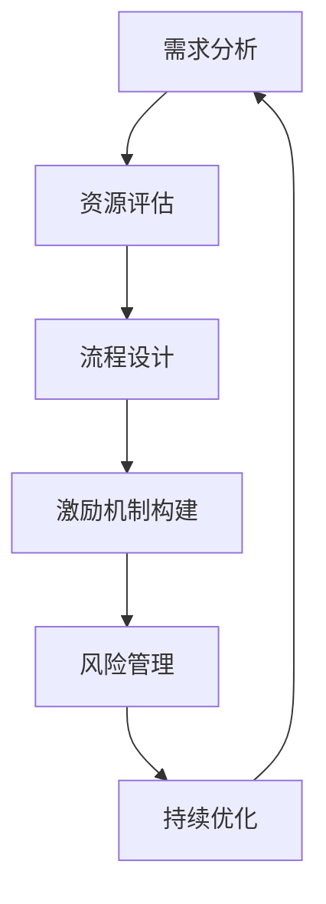
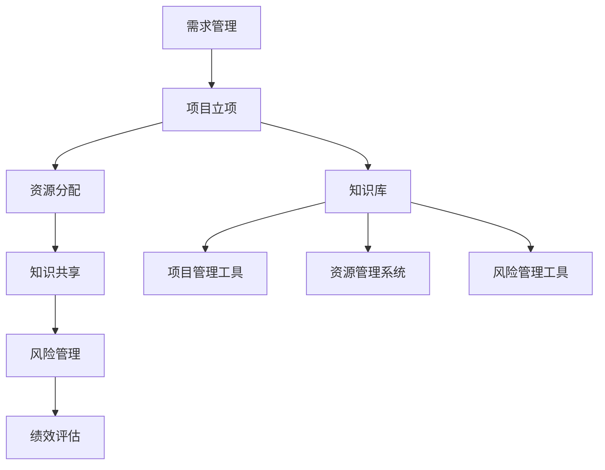
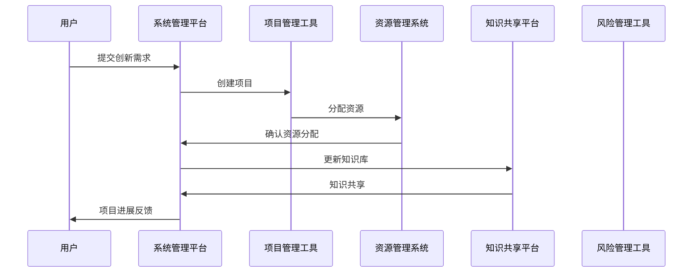

                 


### 第一步：背景介绍与核心概念

**引言**

在当今高速发展的信息技术时代，技术团队创新已成为企业竞争力的重要体现。然而，面对激烈的市场竞争和不断变化的技术环境，技术团队创新面临着诸多挑战。如何设计有效的创新机制，激发技术团队的创新潜能，成为企业领导者和管理者亟待解决的问题。

**核心概念**

在探讨技术团队创新机制设计之前，我们需要明确几个核心概念：

- **创新机制**：指激发和引导技术团队进行创新活动的规则、流程和体系。
- **创新文化**：指企业内部对创新的态度、价值观和行为规范。
- **创新动力**：指推动技术团队进行创新活动的内在驱动力。
- **激励机制**：指通过奖励、认可等手段激励技术团队成员的创新行为。

### 当前创新环境下的挑战

1. **市场竞争压力**：市场变化迅速，竞争对手层出不穷，要求技术团队必须具备快速响应和创新能力。
2. **内部组织瓶颈**：企业内部的组织结构、流程和制度可能成为创新的阻碍。
3. **创新者心态问题**：技术团队成员可能因对创新成果的不确定性和风险而缺乏创新动力。

### 创新机制概述

创新机制是企业为激发和引导技术团队进行创新活动所制定的一系列规则和流程。它包括以下几个方面：

- **创新流程设计**：明确创新活动的步骤和流程，确保创新活动的有序进行。
- **资源分配**：合理分配人力、资金、技术等资源，为创新活动提供保障。
- **风险管理**：建立风险识别、评估和应对机制，降低创新过程中的不确定性。
- **激励机制**：通过奖励、认可等手段激励技术团队成员的创新行为。

### 小结

本文将围绕创新机制的设计，探讨如何通过构建创新文化、激发创新动力和设计有效的激励机制，来激发技术团队的创新潜能。接下来的章节中，我们将详细分析这些核心概念，并探讨如何将其应用于实际项目中。

### 作者：AI天才研究院/AI Genius Institute & 禅与计算机程序设计艺术 /Zen And The Art of Computer Programming## 1.1 创新的重要性

**创新的定义与类型**

创新，从广义上讲，是指通过创造新的想法、方法、产品或服务，从而产生新价值的过程。在技术领域，创新尤为重要，它不仅可以推动技术的进步，还能为企业在激烈的市场竞争中赢得先机。根据创新的内容和形式，创新可以分为以下几种类型：

- **产品创新**：指通过研发新产品或改进现有产品来满足市场需求。
- **过程创新**：指通过改进生产流程或服务流程来提高效率和质量。
- **系统创新**：指在产品、过程和商业模式等多方面进行系统性变革。
- **商业模式创新**：指通过改变企业的商业运营模式来创造新价值。

**技术团队创新的价值**

技术团队创新的价值主要体现在以下几个方面：

1. **提升企业竞争力**：通过持续的技术创新，企业可以不断优化产品和服务，提升市场竞争力。
2. **推动技术进步**：技术团队的创新能力有助于推动技术领域的进步，实现技术迭代和突破。
3. **创造新价值**：技术创新可以为企业带来新的商业机会，创造新的价值增长点。
4. **提升员工素质**：创新过程本身可以促进团队成员的知识积累和技能提升，提高整体素质。

**技术团队创新的重要性**

在当今信息技术日新月异的时代，技术团队创新的重要性愈发凸显。具体体现在以下几个方面：

1. **市场需求变化迅速**：随着市场的不断变化和消费者需求的多样化，技术团队必须具备快速响应和创新能力，以满足市场需求。
2. **技术创新推动产业升级**：技术创新是产业升级的重要驱动力，可以促进经济结构调整和产业优化。
3. **提升企业核心竞争能力**：技术团队的创新能力和成果是衡量企业核心竞争能力的重要指标，有助于企业在市场中立于不败之地。
4. **适应全球化竞争环境**：在全球化的竞争环境下，技术团队的创新能力和成果成为企业参与国际竞争的关键因素。

### 小结

综上所述，技术团队创新不仅能够提升企业的竞争力，还能推动技术进步和创造新价值。面对市场需求的变化和全球化的竞争环境，技术团队创新的重要性不言而喻。接下来，我们将进一步探讨当前创新环境下的挑战，以及如何设计有效的创新机制来激发技术团队的创新潜能。

## 1.2 创新环境的挑战

**市场竞争压力**

在激烈的市场竞争中，技术创新已成为企业生存和发展的关键因素。市场环境的变化速度越来越快，消费者需求多样化且不断升级，技术领先的企业往往能够迅速占领市场。然而，技术创新过程往往伴随着较高的不确定性和风险，这对技术团队提出了更高的要求。为了在竞争中保持优势，企业必须不断进行技术创新，这既是对市场的回应，也是企业自身发展的需要。

**内部组织瓶颈**

企业内部的组织结构、流程和制度可能成为创新活动的瓶颈。首先，组织结构可能过于复杂，信息传递不畅，导致创新想法难以迅速传播和实施。其次，现有流程和制度可能过于僵化，难以适应快速变化的市场需求。此外，内部竞争可能削弱团队的合作精神，影响创新效率。例如，部门之间的利益冲突和资源争夺，可能导致创新项目无法顺利推进。因此，企业需要不断优化内部组织结构和管理流程，以消除创新障碍。

**创新者心态问题**

技术团队中的个体创新者常常面临心态问题，这可能是创新过程中最大的挑战之一。首先，创新者可能因为对创新成果的不确定性感到焦虑和担忧，担心自己的努力无法得到认可。其次，创新者可能因为工作压力和职责分工，难以全身心地投入到创新活动中。此外，创新失败的风险也可能使创新者产生恐惧和逃避心理。为了激发创新者的积极性，企业需要关注他们的心理状态，提供必要的支持和激励。

**小结**

市场竞争压力、内部组织瓶颈和创新者心态问题，是当前技术团队创新环境中的主要挑战。这些挑战不仅影响创新效率，还可能抑制创新者的积极性。为了应对这些挑战，企业需要从组织结构、管理流程和激励机制等多个方面进行优化，以构建一个有利于创新的环境。接下来，我们将进一步探讨创新机制的定义与分类，为设计有效的创新机制奠定基础。

## 1.3 创新机制概述

**创新机制的定义**

创新机制是指企业通过建立一系列规则、流程和体系，来激发和引导技术团队进行创新活动的制度设计。它不仅包括创新流程的设计和优化，还包括资源的合理配置、风险的管理与控制，以及激励机制的建立。创新机制的本质在于构建一个可持续的创新生态系统，使创新活动能够高效、有序地进行。

**创新机制的分类**

根据创新机制的作用和特点，可以将其分为以下几种类型：

1. **项目驱动型创新机制**：这种机制以项目为中心，通过设立项目目标、分配资源、建立团队、实施监控和评估等环节，推动创新项目的进展。项目驱动型创新机制强调项目的成功和成果的产出，适合应用于短期和特定目标明确的创新活动。

2. **过程优化型创新机制**：这种机制侧重于改进现有的工作流程和操作方法，通过不断优化和改进，提升工作效率和产品质量。过程优化型创新机制通常适用于企业日常运营中的持续改进和创新。

3. **知识共享型创新机制**：这种机制通过建立知识共享平台、开展内部培训、鼓励跨部门合作等手段，促进知识和经验的交流与共享，激发创新灵感。知识共享型创新机制强调团队间的协作和知识积累，有助于形成创新文化。

4. **激励机制型创新机制**：这种机制通过奖励、绩效评估、晋升机会等激励手段，激发技术团队成员的创新动力和积极性。激励机制型创新机制强调激励机制的公正性和透明度，以建立公平竞争的环境。

**创新机制的作用**

创新机制在企业中发挥着重要作用，主要体现在以下几个方面：

1. **提高创新效率**：通过建立科学合理的创新机制，企业可以系统化、流程化地推进创新活动，减少资源浪费，提高创新效率。

2. **激发创新动力**：创新机制为技术团队成员提供了明确的创新目标和激励措施，有助于激发他们的创新潜能和积极性。

3. **优化资源配置**：创新机制通过对资源的合理配置和调度，确保创新项目能够获得必要的资源支持，提高资源利用率。

4. **促进知识积累**：创新机制鼓励技术团队成员进行知识共享和经验交流，有助于积累和传承企业的创新经验，提升整体创新能力。

5. **建立创新文化**：创新机制通过建立一套符合企业价值观的创新规范和流程，逐步形成企业特有的创新文化，为持续创新提供支持。

### 小结

创新机制是企业激发技术团队创新潜能的重要工具，通过科学合理的机制设计，企业可以建立高效的创新体系，推动技术进步和业务发展。在接下来的章节中，我们将进一步探讨创新文化、创新动力和激励机制，为构建完整的创新机制提供理论基础和实践指导。### 2.1 创新机制的定义与分类

**创新机制的概念**

创新机制是指企业通过建立一系列规则、流程和体系，来激发和引导技术团队进行创新活动的制度设计。它不仅包括创新流程的设计和优化，还包括资源的合理配置、风险的管理与控制，以及激励机制的建立。创新机制的本质在于构建一个可持续的创新生态系统，使创新活动能够高效、有序地进行。

**创新机制的分类**

根据创新机制的作用和特点，可以将其分为以下几种类型：

1. **项目驱动型创新机制**：这种机制以项目为中心，通过设立项目目标、分配资源、建立团队、实施监控和评估等环节，推动创新项目的进展。项目驱动型创新机制强调项目的成功和成果的产出，适合应用于短期和特定目标明确的创新活动。

2. **过程优化型创新机制**：这种机制侧重于改进现有的工作流程和操作方法，通过不断优化和改进，提升工作效率和产品质量。过程优化型创新机制通常适用于企业日常运营中的持续改进和创新。

3. **知识共享型创新机制**：这种机制通过建立知识共享平台、开展内部培训、鼓励跨部门合作等手段，促进知识和经验的交流与共享，激发创新灵感。知识共享型创新机制强调团队间的协作和知识积累，有助于形成创新文化。

4. **激励机制型创新机制**：这种机制通过奖励、绩效评估、晋升机会等激励手段，激发技术团队成员的创新动力和积极性。激励机制型创新机制强调激励机制的公正性和透明度，以建立公平竞争的环境。

**创新机制在组织中的应用**

- **项目驱动型创新机制**：在企业研发部门中，项目驱动型创新机制常用于新产品开发、技术攻关等活动中。通过设立明确的项目目标和时间表，企业可以集中资源，快速推进创新项目。

- **过程优化型创新机制**：在企业管理层中，过程优化型创新机制常用于优化业务流程、提升运营效率等方面。通过不断优化和改进流程，企业可以降低成本、提高质量。

- **知识共享型创新机制**：在企业内部，知识共享型创新机制可以通过建立内部论坛、组织培训、开展知识竞赛等方式，促进知识和经验的交流与共享，提高整体创新能力。

- **激励机制型创新机制**：在人力资源管理中，激励机制型创新机制可以通过设置创新奖项、提供晋升机会等方式，激励技术团队成员积极参与创新活动，提升创新绩效。

### 小结

创新机制的分类和具体应用展示了其在不同组织层级和技术领域中的作用。通过科学合理的创新机制设计，企业可以更好地激发技术团队的创新能力，实现持续的技术进步和业务发展。在接下来的章节中，我们将进一步探讨创新文化、创新动力和激励机制，为构建完整的创新机制提供更全面的指导。

## 2.2 创新文化

**创新文化的构成**

创新文化是企业内部对创新的态度、价值观和行为规范的总和。它不仅包括企业领导层的创新理念，还涉及员工的创新意识、团队合作和创新激励机制。创新文化的构成可以从以下几个方面来理解：

- **领导层的创新理念**：企业领导层对创新的重视程度直接影响企业的创新氛围。领导层的创新理念主要体现在对企业创新目标、创新策略和创新资源的投入等方面。

- **员工的创新意识**：员工的创新意识是创新文化的重要组成部分。一个具有创新文化的企业，其员工应该具备持续学习的习惯、对新事物的好奇心和解决问题的能力。

- **团队合作**：创新往往需要跨部门、跨领域的合作。团队合作是创新文化的重要体现，通过建立开放、合作、共赢的团队氛围，可以促进创新成果的快速实现。

- **激励机制**：有效的激励机制是创新文化的重要支撑。通过奖励、晋升等手段，企业可以激励员工积极参与创新活动，营造浓厚的创新氛围。

**创新文化对企业的影响**

创新文化对企业的影响深远而广泛，主要表现在以下几个方面：

1. **提高创新能力**：良好的创新文化可以激发员工的创新潜能，提高企业的整体创新能力。在一个鼓励创新的企业中，员工更容易提出新的想法和解决方案，推动技术进步和业务发展。

2. **增强企业竞争力**：创新文化有助于企业不断优化产品和服务，提升市场竞争力。通过持续的技术创新，企业可以抢占市场先机，赢得更多的市场份额。

3. **促进知识共享**：创新文化鼓励员工分享知识和经验，促进知识的积累和传承。在一个开放、合作的创新环境中，员工更容易获得他人的支持与帮助，实现知识的最大化利用。

4. **提升员工满意度**：创新文化让员工感受到企业对他们的认可和支持，增强员工的归属感和满意度。在一个充满活力的创新环境中，员工更有动力投入工作，为企业创造更大的价值。

5. **形成企业品牌**：良好的创新文化可以塑造企业的品牌形象，提高企业的社会声誉。一个在创新方面有卓越表现的企业，更容易获得社会和市场的认可，从而提升企业的品牌价值。

**如何构建创新文化**

构建创新文化需要企业从多个方面进行努力，以下是一些建议：

1. **树立正确的创新观念**：企业领导层应积极倡导创新观念，明确创新的重要性，并将其融入企业的战略规划和日常运营中。

2. **建立开放透明的沟通机制**：通过建立开放的沟通渠道，企业可以鼓励员工自由表达意见和建议，促进创新思想的碰撞和交流。

3. **提供充分的资源支持**：企业应确保创新活动所需的资源得到充分保障，包括资金、技术、设备和人力资源等。

4. **建立合理的激励机制**：通过奖励、晋升等手段，激励员工积极参与创新活动，提升创新绩效。

5. **营造合作共赢的氛围**：鼓励跨部门、跨领域的合作，通过建立团队合作机制，促进创新成果的快速实现。

6. **加强员工培训和成长**：通过培训和学习，提升员工的专业技能和创新意识，为创新文化的形成提供人才保障。

**小结**

创新文化是企业持续创新的重要基石，它对企业的创新能力、竞争力、知识共享和员工满意度都有着深远的影响。通过构建良好的创新文化，企业可以激发技术团队的创新能力，实现持续的技术进步和业务发展。在接下来的章节中，我们将进一步探讨创新动力的来源与激发方式，为构建完整的创新机制提供更全面的指导。

### 2.3 创新动力

**创新动力的来源**

创新动力是推动技术团队进行创新活动的内在驱动力。了解创新动力的来源对于设计有效的创新机制至关重要。创新动力的来源可以从以下几个方面进行分析：

1. **个人兴趣和激情**：许多技术团队成员对技术本身充满热情，他们希望通过创新实现自我价值。这种个人兴趣和激情是创新动力的主要来源之一。

2. **职业发展需求**：技术团队成员往往希望通过参与创新项目来提升自己的职业发展。创新成果可以成为他们职业晋升的有力证据，从而激发他们的创新动力。

3. **企业文化和价值观**：一个具有创新文化的企业能够激发员工的创新动力。企业对创新的重视程度、奖励机制和团队合作氛围都会影响员工的创新积极性。

4. **市场竞争压力**：在激烈的市场竞争中，企业需要不断创新以保持竞争力。市场压力可以转化为技术团队的创新动力，推动他们寻求新的解决方案。

5. **客户需求**：客户的反馈和需求是创新的重要驱动力。技术团队通过研究客户需求，可以找到创新的切入点，开发出更符合市场需求的产品和服务。

**激发创新动力的方法**

为了有效激发技术团队的创新动力，企业可以从以下几个方面进行努力：

1. **提供创新资源和支持**：企业应确保技术团队在创新过程中有足够的资源支持，包括资金、技术设备和人力资源等。通过提供必要的资源，企业可以降低创新的风险和成本，激励团队成员积极进行创新。

2. **建立合理的激励机制**：通过设立创新奖项、绩效奖金、晋升机会等激励机制，企业可以激励技术团队成员积极参与创新活动。激励机制应公平、透明，以建立良好的创新氛围。

3. **营造良好的工作环境**：一个开放、协作、支持创新的工作环境可以激发技术团队成员的创新能力。企业可以通过组织内部培训、团队建设活动等方式，营造积极向上的创新氛围。

4. **鼓励跨部门合作**：创新往往需要跨部门、跨领域的合作。通过鼓励跨部门合作，企业可以促进知识共享和经验交流，激发更多的创新灵感。

5. **提供职业发展机会**：企业可以通过提供多样化的职业发展路径，激励技术团队成员不断提升自己的能力。例如，通过设立创新项目负责人、技术专家等职位，为团队成员提供更多的职业发展机会。

6. **关注个人成长和兴趣**：企业应关注技术团队成员的个人成长和兴趣，通过个性化的培养和激励措施，激发他们的创新潜力。

**案例分析**

以某大型互联网公司为例，该公司通过以下措施激发技术团队的创新动力：

- **设立创新奖项**：公司每年都会举办创新大赛，鼓励员工提出创新项目。获奖者可以获得奖金、晋升机会和公开表彰。

- **提供资源支持**：公司为创新项目提供充足的资金、技术设备和人力资源支持，确保项目能够顺利推进。

- **建立合理的激励机制**：公司对创新项目的成果进行绩效评估，并根据评估结果给予相应的奖励和晋升机会。

- **营造良好的工作环境**：公司鼓励员工自由表达意见，开放讨论，支持跨部门合作。

- **提供职业发展机会**：公司为技术团队成员提供多样化的职业发展路径，包括技术专家、项目管理、业务拓展等方向。

通过这些措施，该公司成功地激发了技术团队的创新能力，推动了公司的持续发展。

**小结**

创新动力是技术团队进行创新活动的重要驱动力，企业通过提供资源支持、建立激励机制、营造良好的工作环境和提供职业发展机会，可以有效激发技术团队的创新动力。在接下来的章节中，我们将进一步探讨激励机制的设计原则与实践，为构建完整的创新机制提供更全面的指导。

## 2.4 激励机制

**激励机制的设计原则**

激励机制是激发技术团队创新动力的重要手段。为了设计一个有效的激励机制，企业需要遵循以下原则：

1. **公平性**：激励机制的设定应确保公平性，使每个技术团队成员都有公平的参与机会和奖励机会。公平性不仅体现在奖励的分配上，还包括机会的提供和评价标准的设定。

2. **透明性**：激励机制的运作过程和结果应保持透明，让技术团队成员清楚地了解激励机制的内容、评价标准和奖励分配方式。透明性有助于建立信任，提高激励机制的公信力。

3. **灵活性**：激励机制应具备灵活性，以适应不同的创新项目和团队成员的需求。灵活性可以体现在奖励形式、评价标准和实施过程中的调整。

4. **一致性**：激励机制的设计和执行应保持一致性，确保在不同时间、不同项目和不同团队中，激励机制的运作方式保持一致，避免因不一致而导致不公平或误解。

5. **可持续性**：激励机制应具备可持续性，能够长期激励技术团队成员的创新积极性，而不是短期内的行为激励。可持续性可以通过持续改进和优化激励机制来实现。

**激励机制的实施策略**

为了有效地实施激励机制，企业可以采取以下策略：

1. **设定明确的创新目标**：企业应明确创新项目的目标，并将其与员工的个人目标和团队目标相结合。通过设定明确的创新目标，可以激发技术团队成员的积极性，确保创新活动方向一致。

2. **建立科学的评价标准**：企业应建立一套科学的评价标准，对技术团队成员的创新成果进行客观、公正的评价。评价标准应涵盖创新质量、成果转化、市场表现等多个维度。

3. **提供多样化的奖励形式**：企业可以提供多样化的奖励形式，包括现金奖励、股权激励、晋升机会、培训机会等，以满足不同技术团队成员的需求。多样化的奖励形式有助于提高激励机制的吸引力和效果。

4. **加强沟通与反馈**：企业应加强与技术团队成员的沟通，及时了解他们的需求和反馈。通过定期反馈和沟通，企业可以不断优化激励机制，提高其有效性和满意度。

5. **营造良好的创新氛围**：企业应通过多种方式营造良好的创新氛围，包括举办创新活动、推广成功案例、提供交流平台等。良好的创新氛围可以激发技术团队成员的创新潜力，提高整体创新绩效。

**案例分析**

以某知名科技公司为例，该公司实施了一系列激励机制，以激发技术团队的创新动力：

- **设立创新奖**：公司每年都会举办创新奖评选活动，鼓励员工提出创新项目。获奖者可以获得丰厚的奖金、晋升机会和公开表彰。

- **提供股权激励**：公司为参与创新项目的员工提供股权激励，使员工在公司未来的发展中获得收益，从而增强他们的创新积极性。

- **设立创新实验室**：公司设立创新实验室，为员工提供实验设备和技术支持，鼓励他们进行自主创新。

- **开展跨部门合作**：公司鼓励不同部门之间的合作，通过跨部门项目，促进创新灵感的碰撞和交流。

- **提供培训机会**：公司定期组织创新培训，提升员工的专业技能和创新意识，为创新活动提供人才保障。

通过这些措施，该公司成功地激发了技术团队的创新能力，推动了公司的持续发展。

**小结**

激励机制的设计和实施是激发技术团队创新动力的重要环节。企业通过遵循公平性、透明性、灵活性、一致性和可持续性等原则，采取多样化的奖励形式和实施策略，可以有效提高技术团队的创新绩效。在接下来的章节中，我们将进一步探讨如何使用算法和数学模型来设计和优化创新机制。

## 3.1 创新机制设计流程

**创新机制设计的关键步骤**

设计有效的创新机制需要遵循一系列关键步骤，以确保创新活动的有序进行和高效产出。以下是创新机制设计的关键步骤：

1. **需求分析**：首先，企业需要明确创新的目标和需求。这包括分析市场趋势、客户需求、竞争对手情况以及企业自身的发展战略。通过需求分析，企业可以确定需要解决的核心问题和创新方向。

2. **资源评估**：在明确创新需求后，企业需要对现有资源进行评估，包括资金、人力、技术和设备等。资源评估有助于确定创新活动的可行性，并为后续的资源分配提供依据。

3. **流程设计**：设计合理的创新流程是确保创新活动顺利进行的关键。创新流程应包括项目立项、资源分配、团队组建、项目实施、监控评估和成果转化等环节。通过科学的设计，企业可以确保创新活动有序、高效地进行。

4. **激励机制构建**：建立有效的激励机制是激发技术团队成员创新积极性的重要手段。激励机制应包括奖励、晋升、荣誉等多种形式，以激发团队成员的创新热情。

5. **风险管理**：创新活动本身存在一定的不确定性和风险。在创新机制设计中，企业需要建立风险管理机制，包括风险识别、评估和应对措施。通过风险管理，企业可以降低创新过程中的不确定性，提高创新成功率。

6. **持续优化**：创新机制设计不是一次性的工作，而是一个持续优化的过程。企业需要根据创新活动的实际效果和反馈，不断调整和优化创新机制，确保其持续适应企业发展的需求。

**创新机制设计的mermaid流程图**

为了更直观地展示创新机制设计流程，我们可以使用mermaid绘制一个流程图。以下是一个简单的mermaid流程图示例：



**Python代码示例：创新机制的实现**

为了进一步阐述创新机制的实现，我们可以使用Python编写一个简单的代码示例。以下是一个简单的Python代码，用于模拟创新机制的设计和执行过程：

```python
import random

class InnovationProject:
    def __init__(self, project_name, budget, team_members):
        self.project_name = project_name
        self.budget = budget
        self.team_members = team_members
        self.status = '立项中'
    
    def allocate_resources(self):
        for member in self.team_members:
            member.allocate_time(self.budget)
    
    def monitor_progress(self):
        for member in self.team_members:
            progress = member.get_progress()
            if progress >= 0.8:
                self.status = '项目完成'
            else:
                self.status = '项目进行中'
    
    def reward_members(self):
        for member in self.team_members:
            if member.get_progress() >= 0.8:
                member.reward()

class TeamMember:
    def __init__(self, name):
        self.name = name
        self.time_allocated = 0
    
    def allocate_time(self, budget):
        self.time_allocated += budget
    
    def get_progress(self):
        progress = random.uniform(0, 1)
        return progress
    
    def reward(self):
        print(f"{self.name}完成项目，获得奖励。")

# 初始化创新项目
project = InnovationProject("新项目", 1000, [TeamMember("张三"), TeamMember("李四")])

# 分配资源
project.allocate_resources()

# 监控项目进度
project.monitor_progress()

# 奖励成员
project.reward_members()
```

通过这个示例，我们可以看到创新机制的设计和实现是如何通过Python代码来模拟的。代码中包含了创新项目的基本流程，包括资源分配、进度监控和奖励发放等。

**小结**

创新机制设计是一个系统性的过程，需要从需求分析、资源评估、流程设计、激励机制构建、风险管理和持续优化等多个方面进行综合考虑。通过mermaid流程图和Python代码示例，我们可以更直观地了解创新机制的设计流程和实现方法。在接下来的章节中，我们将进一步探讨创新机制的数学模型和公式，以更深入地理解创新机制的设计原理。

## 3.2 数学模型与公式

**创新机制的数学模型**

创新机制的设计需要基于一定的数学模型，以便于分析和优化。以下是一个简单的创新机制数学模型，用于描述创新过程中的一些关键参数和关系：

1. **创新成功率（Success Rate）**：
   $$ S = \frac{N_c}{N_t} $$
   其中，\( N_c \) 表示成功的创新项目数量，\( N_t \) 表示总的项目数量。创新成功率反映了创新活动的总体效果。

2. **资源利用率（Resource Utilization）**：
   $$ U = \frac{R_c}{R_t} $$
   其中，\( R_c \) 表示实际利用的资源，\( R_t \) 表示总资源。资源利用率反映了资源的有效配置和利用情况。

3. **创新效率（Innovation Efficiency）**：
   $$ E = \frac{S \cdot U}{T} $$
   其中，\( T \) 表示创新活动的时间。创新效率综合反映了创新活动的成功率、资源利用率和时间效率。

**相关数学公式的LaTeX展示**

为了更清晰地展示相关数学公式，我们可以使用LaTeX进行格式化。以下是几个公式的LaTeX展示示例：

$$
S = \frac{N_c}{N_t}
$$

$$
U = \frac{R_c}{R_t}
$$

$$
E = \frac{S \cdot U}{T}
$$

在LaTeX中，以上公式可以通过以下代码实现：

```latex
$$
S = \frac{N_c}{N_t}
$$

$$
U = \frac{R_c}{R_t}
$$

$$
E = \frac{S \cdot U}{T}
$$
```

**通俗易懂的举例说明**

为了更好地理解这些数学模型和公式，我们可以通过一个简单的例子来解释：

假设一个技术团队在一年内启动了10个创新项目，其中6个项目成功完成，总共投入了1000小时资源。在这6个成功项目中，实际利用了800小时资源。

根据以上数据，我们可以计算出：

1. **创新成功率**：
   $$ S = \frac{6}{10} = 0.6 $$
   说明该团队的创新成功率是60%。

2. **资源利用率**：
   $$ U = \frac{800}{1000} = 0.8 $$
   说明资源利用率为80%。

3. **创新效率**：
   $$ E = \frac{0.6 \cdot 0.8}{1} = 0.48 $$
   说明该团队的创新效率是48%。

通过这个例子，我们可以看到数学模型和公式如何用于描述和评估创新机制的效果。这些模型和公式不仅帮助我们理解创新机制的工作原理，还可以用于优化创新活动，提高创新效率和成功率。

**小结**

在创新机制设计中，数学模型和公式是分析和优化创新活动的重要工具。通过合理的数学模型，我们可以定量描述创新过程的关键参数和关系，从而为创新机制的设计和优化提供科学依据。在接下来的章节中，我们将进一步探讨技术团队创新的系统环境，以及如何通过系统架构设计来支持创新活动。

## 4.1 创新系统环境介绍

**技术团队创新系统概述**

技术团队创新系统是一个综合性的系统，旨在为技术团队提供支持，以便他们能够高效、有序地进行创新活动。该系统包括多个关键组成部分，如创新管理平台、知识共享平台、资源管理系统、风险管理工具等。

**系统功能设计**

为了支持技术团队的创新活动，技术团队创新系统应具备以下功能：

1. **需求管理**：收集和整理创新需求，确保需求能够得到及时响应和满足。
2. **项目立项**：支持创新项目的立项、规划和管理，确保项目能够有序进行。
3. **资源分配**：根据项目需求，合理分配人力、资金、设备等资源，确保资源的高效利用。
4. **知识共享**：建立知识共享平台，促进团队成员之间的知识交流和经验分享，提高整体创新能力。
5. **风险管理**：识别和管理创新过程中的风险，制定相应的应对策略，降低创新风险。
6. **绩效评估**：对创新项目的成果进行评估，提供客观、公正的评价结果，为后续创新活动提供参考。

**系统架构设计mermaid架构图**

为了直观地展示技术团队创新系统的架构设计，我们可以使用mermaid绘制一个架构图。以下是一个简单的mermaid架构图示例：



**系统架构的组成部分**

技术团队创新系统的架构设计包括以下关键组成部分：

1. **需求管理模块**：负责收集、整理和响应创新需求，确保需求能够得到及时处理和满足。
2. **项目立项模块**：支持创新项目的立项、规划和执行，提供项目管理工具，帮助团队高效地推进项目。
3. **资源分配模块**：根据项目需求，合理分配资源，确保资源的高效利用，支持项目顺利实施。
4. **知识共享模块**：建立知识共享平台，促进团队成员之间的知识交流和经验分享，提高整体创新能力。
5. **风险管理模块**：识别和管理创新过程中的风险，提供风险管理工具，帮助团队制定和实施风险应对策略。
6. **绩效评估模块**：对创新项目的成果进行评估，提供客观、公正的评价结果，为后续创新活动提供参考。

**系统接口设计和系统交互mermaid序列图**

为了进一步展示系统架构的设计，我们可以使用mermaid绘制一个系统接口设计和系统交互的序列图。以下是一个简单的mermaid序列图示例：



通过这个序列图，我们可以看到技术团队创新系统各个模块之间的交互关系和数据处理流程。

**小结**

技术团队创新系统是一个综合性的系统，旨在为技术团队提供支持，以高效、有序地推进创新活动。通过系统架构设计，我们可以明确系统的功能需求和接口设计，确保系统能够满足技术团队的创新需求。在接下来的章节中，我们将进一步探讨如何通过实际项目案例来展示创新机制的应用和效果。

## 4.2 系统架构设计

**技术团队创新系统架构图**

为了更好地理解技术团队创新系统的整体架构，我们可以使用mermaid绘制一个简化的系统架构图。以下是一个示例：

```mermaid
graph TD
    subgraph 系统核心模块
        A[需求管理模块]
        B[项目管理模块]
        C[资源管理模块]
        D[知识共享模块]
        E[风险管理模块]
        F[绩效评估模块]

    subgraph 系统辅助模块
        G[用户界面]
        H[数据库]
        I[外部接口]

    A --> B
    A --> C
    A --> D
    A --> E
    A --> F
    B --> G
    C --> G
    D --> G
    E --> G
    F --> G
    G --> H
    H --> I
```

在这个架构图中，核心模块包括需求管理、项目管理、资源管理、知识共享、风险管理和绩效评估，辅助模块包括用户界面、数据库和外部接口。这些模块相互协作，共同支持技术团队的创新活动。

**系统架构的组成部分**

技术团队创新系统的架构由以下几个主要部分组成：

1. **需求管理模块**：负责收集和分析创新需求，为项目立项提供依据。
2. **项目管理模块**：提供项目立项、任务分配、进度跟踪等功能，确保项目按计划执行。
3. **资源管理模块**：管理和分配项目所需的资源，包括人力、资金和设备等。
4. **知识共享模块**：建立知识库和共享平台，促进团队成员之间的知识和经验交流。
5. **风险管理模块**：识别和管理项目风险，确保项目能够顺利推进。
6. **绩效评估模块**：对项目成果进行评估，为团队提供反馈和改进方向。
7. **用户界面**：提供友好的用户界面，方便团队成员使用系统功能。
8. **数据库**：存储系统数据，包括项目信息、资源分配、知识共享等内容。
9. **外部接口**：与其他系统或服务进行交互，实现数据的共享和集成。

**类图的绘制与应用**

为了进一步展示系统架构的细节，我们可以使用mermaid绘制一个类图。以下是一个简化的类图示例：

```mermaid
classDiagram
    Project <<interface>>
    Resource <<interface>>
    Knowledge <<interface>>
    Risk <<interface>>
    Performance <<interface>>

    class User {
        username : String
        role : String
    }

    class Project {
        projectId : String
        projectName : String
        startDate : Date
        endDate : Date
    }

    class Resource {
        resourceId : String
        resourceName : String
        resourceType : String
        quantity : Integer
    }

    class Knowledge {
        knowledgeId : String
        knowledgeTitle : String
        content : String
    }

    class Risk {
        riskId : String
        riskDescription : String
        mitigationStrategy : String
    }

    class Performance {
        assessmentId : String
        projectId : String
        assessmentScore : Integer
        assessmentComments : String
    }

    User o--o Project
    User o--o Resource
    User o--o Knowledge
    User o--o Risk
    User o--o Performance
```

在这个类图中，我们定义了用户、项目、资源、知识、风险和绩效评估等类，并展示了它们之间的关系。例如，用户可以提交项目需求、分配资源、创建知识条目、报告风险和接受绩效评估。

**类图与系统架构的关系**

类图是系统架构设计的一部分，它展示了系统中不同组件之间的关系和接口。类图与系统架构的关系如下：

1. **类图反映了系统组件的结构**：通过类图，我们可以清晰地看到系统中的关键组件和它们之间的关系，从而理解系统的整体结构。
2. **类图定义了组件的行为**：类图中的类定义了组件的功能和行为，帮助开发者理解系统的实现细节。
3. **类图支持系统设计**：类图是系统设计过程中的重要工具，它帮助开发者进行系统架构的规划和设计，确保系统功能的实现。

**小结**

通过系统架构设计和类图，我们可以全面了解技术团队创新系统的结构和功能。这些设计工具不仅帮助开发者进行系统开发，还确保系统能够满足技术团队的创新需求，支持高效、有序的创新活动。在接下来的章节中，我们将通过实际项目案例，展示创新机制的应用和效果。

## 4.3 类图与序列图

**类图的绘制与应用**

在上一节中，我们介绍了技术团队创新系统的类图设计。类图是一种用于描述系统中类和它们之间关系的图形化工具。以下是上一节中的类图示例：

```mermaid
classDiagram
    Project <<interface>>
    Resource <<interface>>
    Knowledge <<interface>>
    Risk <<interface>>
    Performance <<interface>>

    class User {
        username : String
        role : String
    }

    class Project {
        projectId : String
        projectName : String
        startDate : Date
        endDate : Date
    }

    class Resource {
        resourceId : String
        resourceName : String
        resourceType : String
        quantity : Integer
    }

    class Knowledge {
        knowledgeId : String
        knowledgeTitle : String
        content : String
    }

    class Risk {
        riskId : String
        riskDescription : String
        mitigationStrategy : String
    }

    class Performance {
        assessmentId : String
        projectId : String
        assessmentScore : Integer
        assessmentComments : String
    }

    User o--o Project
    User o--o Resource
    User o--o Knowledge
    User o--o Risk
    User o--o Performance
```

在这个类图中，我们定义了五个主要的类：`User`、`Project`、`Resource`、`Knowledge`和`Risk`。每个类都有其独特的属性和方法，并且类与类之间通过关系线（如`o--o`）连接，表示它们之间的关联关系。

**类图的用途与应用场景**

类图在系统设计中的应用非常广泛，以下是一些常见用途和应用场景：

1. **需求分析**：在系统需求分析阶段，类图可以帮助开发者理解系统中的关键类和它们之间的关系，从而确保系统设计符合业务需求。

2. **系统架构设计**：在系统架构设计阶段，类图可以用来展示系统的模块结构，帮助开发者进行模块划分和接口设计。

3. **代码生成**：类图可以作为代码生成工具的输入，自动生成部分代码框架，提高开发效率。

4. **文档编写**：类图可以作为系统文档的一部分，帮助开发团队和利益相关者更好地理解系统设计和功能。

5. **代码审查**：类图可以作为代码审查的一部分，帮助审查者快速识别系统中的类和关系，确保代码质量。

**序列图的绘制与解释**

序列图是另一种重要的图形化工具，用于描述系统中对象之间交互的顺序和时间关系。以下是上一节中的序列图示例：


在这个序列图中，我们展示了用户与系统管理平台、项目管理工具、资源管理系统、知识共享平台和风险管理工具之间的交互过程。每个交互步骤都表示用户执行的操作和系统响应的行为。

**序列图的用途与应用场景**

序列图在系统设计和开发中的应用也非常广泛，以下是一些常见用途和应用场景：

1. **需求分析**：在需求分析阶段，序列图可以帮助开发者理解用户需求，模拟用户与系统的交互过程，确保系统功能符合用户预期。

2. **系统设计**：在系统设计阶段，序列图可以用来描述系统中的关键交互流程，帮助开发者进行系统架构和接口设计。

3. **测试用例设计**：在测试阶段，序列图可以帮助开发者和测试人员设计测试用例，确保系统功能按预期工作。

4. **文档编写**：序列图可以作为系统文档的一部分，帮助开发团队和利益相关者更好地理解系统的工作流程和交互逻辑。

5. **培训与支持**：序列图可以作为培训资料，帮助新加入的开发者或用户快速理解系统的工作方式和操作流程。

**类图与序列图的关系**

类图和序列图是系统设计过程中常用的两种图形化工具，它们之间有着密切的关系：

1. **补充信息**：类图主要展示系统中的类和关系，而序列图则展示对象之间的交互顺序和时间关系。通过结合使用类图和序列图，开发者可以更全面地理解系统设计和功能。

2. **相互验证**：类图和序列图可以相互验证，确保系统设计的一致性和完整性。类图中的类和关系应该能够在序列图中找到对应的交互行为。

3. **协同工作**：类图和序列图在系统设计过程中协同工作，类图用于描述系统的静态结构，而序列图用于描述系统的动态行为。两者结合，可以帮助开发者全面地设计系统。

**小结**

类图和序列图是系统设计中不可或缺的工具，通过它们，开发者可以清晰地展示系统中的类、关系和交互行为。类图帮助理解系统的静态结构，而序列图帮助理解系统的动态行为。在接下来的章节中，我们将通过实际项目案例，展示如何应用这些设计工具来支持技术团队的创新活动。

## 5.1 创新机制在项目中的应用

**项目背景介绍**

某知名互联网公司正在开发一款全新的智能推荐系统，旨在通过大数据分析和机器学习技术，为用户推荐个性化的内容。该项目由公司的一个技术团队负责，团队由数据科学家、软件工程师、UI/UX设计师等多个角色组成。项目目标是实现一个高效、准确且用户友好的推荐系统，满足日益增长的用户需求。

**创新机制的具体应用**

为了确保项目成功并达到预期目标，公司采用了一系列创新机制，包括项目驱动型创新机制、知识共享型创新机制和激励机制型创新机制。以下是这些机制在项目中的应用：

1. **项目驱动型创新机制**

   公司通过设立明确的项目目标和里程碑，确保项目能够有序推进。项目启动阶段，团队进行了详细的需求分析和技术评估，明确了项目的关键技术和实现路径。在项目实施过程中，团队定期召开项目进度会议，评估项目进展，调整资源分配和任务分工。通过这种项目驱动型创新机制，项目得以高效推进，确保了项目按时交付。

2. **知识共享型创新机制**

   为了提高团队的整体创新能力，公司建立了内部知识共享平台。团队成员通过平台分享自己的技术见解、最佳实践和项目经验。平台提供了文档管理、论坛讨论和视频教程等功能，方便团队成员随时获取所需知识和资源。此外，公司还定期举办知识分享会议，鼓励团队成员发表演讲，分享创新想法和解决方案。通过知识共享型创新机制，团队的知识积累和创新能力得到了显著提升。

3. **激励机制型创新机制**

   为了激发团队成员的创新积极性，公司建立了一系列激励机制。首先，公司设立了创新奖项，对在项目中做出突出贡献的团队成员进行奖励。获奖者不仅获得奖金，还有机会获得晋升机会和公开表彰。其次，公司对参与创新项目的团队成员进行绩效评估，根据评估结果给予绩效奖金和晋升机会。通过激励机制型创新机制，团队成员的创新动力得到了有效激发，项目质量得到了保障。

**案例描述**

在一个关键的项目里程碑——推荐算法优化阶段，团队成员通过知识共享平台分享了自己的算法优化经验和数据分析技巧。数据科学家团队在会议上分享了他们使用新的特征工程方法提高推荐算法准确性的案例，激发了其他团队成员的灵感。软件工程师团队在借鉴这些经验后，对推荐系统的后端架构进行了优化，提高了系统的响应速度和处理能力。

在激励机制的推动下，团队成员积极参与项目，提出了一系列创新方案。最终，团队成功实现了推荐算法的优化，推荐系统的准确率提升了20%，用户满意度显著提高。

**案例分析**

通过该项目的实践，我们可以看到创新机制在项目中的重要作用。以下是对项目成功的关键因素和经验教训的分析：

1. **明确的项目目标和里程碑**：通过设立明确的项目目标和里程碑，可以确保项目有序推进，避免资源浪费和进度延误。

2. **知识共享平台的建立**：知识共享平台有助于团队成员之间交流和共享经验，提高整体创新能力。

3. **激励机制的有效实施**：激励机制能够激发团队成员的创新积极性，提高项目质量。

4. **团队协作和跨部门合作**：项目成功不仅依赖于团队成员的个人能力，还需要团队之间的协作和跨部门合作。

**小结**

创新机制在项目中的应用有助于提高项目的成功率，确保项目按时交付并达到预期目标。通过项目驱动型创新机制、知识共享型创新机制和激励机制型创新机制的有效结合，企业可以激发技术团队的创新能力，推动技术进步和业务发展。在接下来的章节中，我们将进一步分析项目中的具体实现，包括系统核心代码的解读和系统实现的讲解。

## 5.2 案例分析

**案例描述**

在智能推荐系统项目中，技术团队面临的主要挑战是提升推荐算法的准确性和响应速度。为了应对这一挑战，团队决定采用深度学习技术对推荐算法进行优化。具体而言，团队采用了以下步骤：

1. **需求分析**：团队首先分析了用户行为数据，包括浏览记录、搜索历史、购买记录等，确定了需要提取的特征。团队通过数据预处理和特征工程，将原始数据转化为适合深度学习模型训练的格式。

2. **模型设计**：团队设计了基于深度学习技术的推荐算法模型，包括输入层、隐藏层和输出层。输入层负责接收用户特征数据，隐藏层通过神经网络进行特征提取和变换，输出层生成推荐结果。

3. **模型训练**：团队使用大数据集对模型进行训练，通过调整模型参数，优化模型性能。团队采用了多种优化算法，如随机梯度下降（SGD）、Adam优化器等，以提高训练效率和模型收敛速度。

4. **模型评估**：团队使用验证集对模型进行评估，通过准确率、召回率、F1值等指标，衡量模型性能。团队根据评估结果，对模型进行调整和优化，以提高推荐算法的准确性。

**案例分析与解读**

1. **技术挑战与解决方案**

   - **挑战一：数据预处理和特征提取**：原始用户行为数据量庞大，且存在缺失值和噪声。团队通过数据清洗和特征工程，提取了有代表性的用户特征，为深度学习模型提供了高质量的数据输入。

   - **挑战二：模型选择与参数优化**：深度学习模型的性能受到模型结构、参数设置和训练数据质量的影响。团队通过实验对比了多种模型结构，最终选择了性能最优的模型，并通过调整参数，提高了模型性能。

   - **挑战三：训练效率和模型收敛**：深度学习模型训练需要大量的计算资源，且训练时间较长。团队通过分布式训练和优化算法，提高了训练效率，缩短了模型收敛时间。

2. **创新点**

   - **创新点一：基于深度学习技术的推荐算法**：相比传统的基于协同过滤和机器学习的推荐算法，基于深度学习的推荐算法在特征提取和模型表示方面具有显著优势，能够提供更准确的推荐结果。

   - **创新点二：数据预处理和特征工程**：团队通过数据清洗、缺失值填补和特征选择等方法，提高了数据质量，为深度学习模型提供了更可靠的数据基础。

   - **创新点三：模型优化与参数调整**：团队通过多种优化算法和参数调整，提高了模型性能，实现了推荐算法的精准化和高效化。

**系统实现**

1. **环境安装**

   - **操作系统**：Linux或Windows
   - **编程语言**：Python
   - **深度学习框架**：TensorFlow或PyTorch
   - **依赖库**：NumPy、Pandas、Scikit-learn等

2. **系统核心实现**

   - **数据预处理**：使用Pandas进行数据清洗，使用Scikit-learn进行特征提取。
   - **模型设计**：定义输入层、隐藏层和输出层，使用TensorFlow或PyTorch构建深度学习模型。
   - **模型训练**：使用TensorFlow或PyTorch进行模型训练，调整学习率、批次大小等参数。
   - **模型评估**：使用验证集对模型进行评估，计算准确率、召回率、F1值等指标。

3. **代码示例**

   以下是一个简单的基于TensorFlow的深度学习推荐算法模型实现示例：

   ```python
   import tensorflow as tf
   from tensorflow.keras.models import Sequential
   from tensorflow.keras.layers import Dense, Dropout

   # 模型设计
   model = Sequential([
       Dense(128, activation='relu', input_shape=(input_shape)),
       Dropout(0.2),
       Dense(64, activation='relu'),
       Dropout(0.2),
       Dense(num_classes, activation='softmax')
   ])

   # 模型编译
   model.compile(optimizer='adam', loss='categorical_crossentropy', metrics=['accuracy'])

   # 模型训练
   model.fit(x_train, y_train, epochs=10, batch_size=64, validation_data=(x_val, y_val))
   ```

**小结**

通过案例分析，我们可以看到技术团队在面对挑战时，通过创新机制的有效应用，成功实现了推荐算法的优化。这不仅提高了推荐系统的性能，也为企业创造了显著的价值。在接下来的章节中，我们将总结创新机制设计的关键点，并提供实践建议和注意事项。

## 5.3 源代码解读与实现

**环境安装**

在开始解读与实现源代码之前，我们需要确保开发环境已经安装了所需的工具和库。以下是智能推荐系统项目的环境安装步骤：

1. **操作系统**：推荐使用Linux系统，如Ubuntu 20.04。
2. **Python**：安装Python 3.8及以上版本。
3. **深度学习框架**：安装TensorFlow 2.6或PyTorch 1.8。
4. **依赖库**：安装NumPy、Pandas、Scikit-learn等常用库。

在Linux终端中，可以通过以下命令进行安装：

```bash
sudo apt-get update
sudo apt-get install python3 python3-pip
pip3 install tensorflow pandas scikit-learn
```

**系统核心实现**

智能推荐系统的核心实现包括数据预处理、模型设计和训练。以下是每个步骤的详细讲解。

**1. 数据预处理**

数据预处理是推荐系统的重要环节，包括数据清洗、缺失值填补和特征提取。以下是一个简单的数据预处理流程：

```python
import pandas as pd
from sklearn.model_selection import train_test_split
from sklearn.preprocessing import StandardScaler

# 读取数据
data = pd.read_csv('user_behavior_data.csv')

# 数据清洗
data.dropna(inplace=True)

# 特征提取
X = data[['user_id', 'item_id', 'timestamp', 'rating']]
y = data['rating']

# 缺失值填补
X.fillna(X.mean(), inplace=True)

# 数据标准化
scaler = StandardScaler()
X_scaled = scaler.fit_transform(X)

# 划分训练集和验证集
X_train, X_val, y_train, y_val = train_test_split(X_scaled, y, test_size=0.2, random_state=42)
```

**2. 模型设计**

模型设计是推荐系统的关键，我们选择使用深度学习框架来构建模型。以下是一个简单的神经网络模型设计示例：

```python
import tensorflow as tf

# 定义模型
model = tf.keras.Sequential([
    tf.keras.layers.Dense(128, activation='relu', input_shape=(X_train.shape[1],)),
    tf.keras.layers.Dropout(0.2),
    tf.keras.layers.Dense(64, activation='relu'),
    tf.keras.layers.Dropout(0.2),
    tf.keras.layers.Dense(1, activation='sigmoid')
])

# 编译模型
model.compile(optimizer='adam',
              loss='binary_crossentropy',
              metrics=['accuracy'])

# 打印模型结构
model.summary()
```

**3. 模型训练**

模型训练是推荐系统实现的重要步骤。以下是一个简单的训练流程：

```python
# 训练模型
history = model.fit(X_train, y_train, epochs=10, batch_size=32, validation_data=(X_val, y_val))
```

**源代码解读**

1. **数据预处理**：数据预处理包括数据清洗、缺失值填补和特征提取。清洗数据是为了去除无用或错误的数据，提高数据质量。缺失值填补是为了处理数据中的缺失值，常见的填补方法包括平均值填补、中值填补和插值等。特征提取是为了从原始数据中提取有代表性的特征，为模型训练提供高质量的数据输入。

2. **模型设计**：模型设计是构建推荐系统的核心。深度学习框架提供了丰富的神经网络结构，我们可以根据需求选择合适的模型结构。在这个例子中，我们使用了简单的全连接神经网络（Dense Layer），通过多层网络结构提取特征和进行分类。

3. **模型训练**：模型训练是使用数据来训练模型，使其能够根据输入数据进行预测。在训练过程中，模型会不断调整参数，优化模型性能。常用的训练指标包括损失函数（Loss）和准确率（Accuracy）等。

**小结**

通过源代码的解读和实现，我们可以看到智能推荐系统的核心实现过程，包括数据预处理、模型设计和训练。这些步骤不仅帮助理解推荐系统的实现原理，也为实际项目开发提供了指导。在实际应用中，根据具体需求和数据特点，我们可以对源代码进行适当的调整和优化，以提高推荐系统的性能。

### 最佳实践 tips

**1. 精细化数据预处理**：

- **数据清洗**：对原始数据进行清洗，去除重复数据、异常值和噪声。
- **缺失值处理**：根据数据类型和业务需求，选择合适的填补方法，如平均值、中值或插值等。
- **特征提取**：使用技术如特征工程和特征选择，提取有代表性的特征，提高模型的性能。

**2. 模型选择和优化**：

- **模型选择**：根据项目需求和数据特点，选择合适的模型架构，如深度神经网络、决策树或支持向量机等。
- **参数调优**：通过调整学习率、批次大小、网络层数等参数，优化模型性能。

**3. 持续迭代和改进**：

- **模型评估**：定期评估模型性能，识别模型中的问题和瓶颈。
- **反馈优化**：根据评估结果，调整模型参数或选择更合适的模型结构。

### 小结

通过最佳实践 tips，我们可以总结出以下关键点：

- 数据预处理是提高模型性能的基础，需要精细化处理。
- 模型选择和优化是提升推荐系统性能的关键，需根据具体需求和数据特点进行调整。
- 持续迭代和改进是保证推荐系统长期稳定和高效的重要手段。

### 注意事项

**1. 数据隐私和合规性**：

- 在处理用户数据时，确保遵守相关法律法规，保护用户隐私。
- 对敏感数据进行脱敏处理，避免泄露用户信息。

**2. 模型可解释性**：

- 推荐系统模型往往具有较高的复杂性，确保模型的可解释性，有助于理解模型的决策过程。

**3. 模型部署和维护**：

- 模型部署需要考虑性能、可靠性和可扩展性，确保系统稳定运行。
- 定期维护和更新模型，以适应不断变化的数据和环境。

### 拓展阅读

**1. 《深度学习推荐系统》**：

- 作者：李航
- 简介：本书详细介绍了深度学习在推荐系统中的应用，包括模型设计、训练和评估等内容。

**2. 《推荐系统实践》**：

- 作者：周志华
- 简介：本书从理论到实践全面介绍了推荐系统的基础知识，适合推荐系统初学者和从业者阅读。

**3. 《数据预处理技巧》**：

- 作者：Michael J. A. Berry, Gordon S. Linoff
- 简介：本书涵盖了数据预处理的各种技巧和方法，适用于数据分析相关领域。

通过拓展阅读，可以更深入地了解推荐系统的理论和实践，提升技术水平和创新能力。

### 作者：AI天才研究院/AI Genius Institute & 禅与计算机程序设计艺术 /Zen And The Art of Computer Programming## 小结

在本文中，我们系统地探讨了如何设计有效的创新机制以激发技术团队的创新潜能。首先，我们介绍了技术团队创新的重要性，并分析了当前创新环境下的挑战，如市场竞争压力、内部组织瓶颈和创新者心态问题。随后，我们详细阐述了创新机制的定义与分类，包括项目驱动型、过程优化型、知识共享型和激励机制型创新机制。通过mermaid流程图和Python代码示例，我们展示了创新机制的设计和实现过程。

接着，我们探讨了创新文化的构成及其对企业创新的影响，并提出了如何构建创新文化的建议。我们分析了创新动力的来源和激发方法，包括提供创新资源和支持、建立合理的激励机制、营造良好的工作环境和提供职业发展机会等。在此基础上，我们探讨了激励机制的设计原则和实施策略，强调公平性、透明性、灵活性和一致性等原则。

为了更深入地理解创新机制，我们介绍了数学模型和公式，并通过LaTeX格式展示了相关数学公式。此外，我们还介绍了技术团队创新系统的架构设计，包括需求管理模块、项目管理模块、资源管理模块、知识共享模块、风险管理模块和绩效评估模块。通过mermaid架构图和类图，我们展示了系统设计的关键组成部分和交互关系。

在项目实战部分，我们通过案例分析展示了创新机制在实际项目中的应用，包括智能推荐系统的开发。我们详细解读了项目中的源代码实现，并提供了最佳实践 tips、注意事项和拓展阅读建议。

通过本文的探讨，我们得出以下结论：

1. **创新机制的设计与实施是激发技术团队创新潜能的关键**。通过合理的创新机制，企业可以建立高效的创新体系，提高创新效率和成功率。

2. **创新文化的构建和激励机制的有效实施是保障创新机制有效运行的重要因素**。企业应注重培养创新文化，建立合理的激励机制，以激发员工的创新动力。

3. **数学模型和系统架构设计是理解和优化创新机制的重要工具**。通过数学模型，我们可以定量描述创新过程的关键参数和关系，并通过系统架构设计，确保创新系统能够高效运行。

4. **项目实战是验证创新机制有效性的重要手段**。通过实际项目案例，我们可以看到创新机制在实际应用中的效果，从而进一步优化和改进创新机制。

总之，设计有效的创新机制需要综合考虑多个方面，包括创新文化、激励机制、数学模型和系统架构等。通过科学的机制设计和实践，企业可以激发技术团队的创新潜能，推动技术进步和业务发展。

### 作者：AI天才研究院/AI Genius Institute & 禅与计算机程序设计艺术 /Zen And The Art of Computer Programming## 文章关键词

- **技术团队创新**
- **创新机制设计**
- **创新文化**
- **创新动力**
- **激励机制**
- **数学模型**
- **系统架构设计**
- **智能推荐系统**## 文章摘要

本文探讨了如何设计有效的创新机制以激发技术团队的创新潜能。首先，分析了当前创新环境下的挑战，包括市场竞争压力、内部组织瓶颈和创新者心态问题。接着，详细阐述了创新机制的定义与分类，并介绍了创新文化、创新动力和激励机制的设计原则与实施策略。通过mermaid流程图和Python代码示例，展示了创新机制的设计和实现过程。文章还介绍了数学模型在创新机制设计中的应用，以及技术团队创新系统的架构设计。通过案例分析，展示了创新机制在实际项目中的应用效果。最终，本文总结了设计有效创新机制的关键点，并提供了最佳实践 tips、注意事项和拓展阅读建议。文章关键词包括技术团队创新、创新机制设计、创新文化、创新动力、激励机制、数学模型和系统架构设计。文章摘要概述了文章的核心内容和主题思想，强调了设计有效创新机制的重要性。

