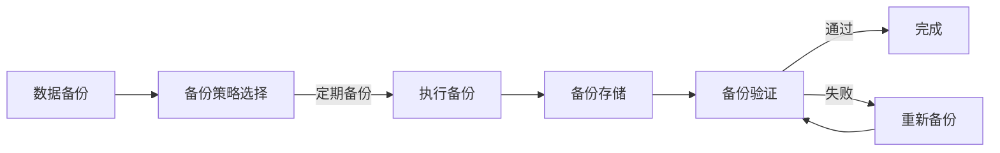

                 


## 灾备系统构建与容灾策略

关键词：灾备系统、容灾策略、系统架构、算法原理、项目实战

摘要：本文旨在探讨灾备系统的构建与容灾策略的实施。通过对灾备系统的核心概念、算法原理、系统分析与架构设计以及项目实战的详细分析，帮助读者全面理解并掌握灾备系统的构建与容灾策略。

### 背景介绍

#### 问题背景

随着信息技术的迅猛发展，企业的信息化程度日益提高，数据成为企业核心资产。然而，自然灾害、硬件故障、恶意攻击等因素可能导致数据丢失或系统瘫痪，对企业运营造成严重威胁。因此，构建灾备系统，实施有效的容灾策略，成为保障企业数据安全和业务连续性的重要手段。

#### 问题描述

灾备系统构建与容灾策略的实施面临诸多挑战，包括：

- 如何选择合适的灾备方案？
- 如何确保数据的高可用性和安全性？
- 如何实现系统的快速切换和恢复？
- 如何在成本可控的前提下，实现高效的容灾？

#### 问题解决

为了解决上述问题，需要从以下几个方面入手：

- 明确灾备系统的核心概念和组成部分。
- 分析并选择合适的容灾策略。
- 设计并实现灾备系统的架构方案。
- 进行项目实战，验证和优化灾备系统。

#### 边界与外延

灾备系统构建与容灾策略的实施，涉及以下边界与外延：

- 灾备系统的技术框架和选型。
- 容灾策略的种类和适用场景。
- 灾备系统架构的设计原则和实施方法。
- 项目实战中的环境搭建和系统实现。

#### 概念结构与核心要素组成

灾备系统的概念结构与核心要素组成如下：

- **灾备系统定义**：灾备系统是指在发生自然灾害、硬件故障、恶意攻击等意外情况下，保障企业数据安全和业务连续性的技术系统。
- **容灾策略**：容灾策略是指针对不同类型的灾难，采取相应的技术措施，保障系统的高可用性和数据安全。
- **核心组件**：灾备系统主要由数据备份与恢复、负载均衡、故障切换、监控报警等核心组件构成。

### 核心概念与联系

#### 灾备系统定义

灾备系统是指在企业遭受灾难时，通过数据备份、故障切换等技术手段，保障企业数据安全和业务连续性的系统。灾备系统的主要功能包括数据备份、数据恢复、故障切换和监控报警等。

#### 容灾策略概念

容灾策略是指根据企业业务需求和灾难类型，采取相应的技术措施，保障系统的高可用性和数据安全。常见的容灾策略包括：

1. 数据备份与恢复：定期备份关键数据，并在灾难发生后迅速恢复。
2. 负载均衡：通过分配业务负载，提高系统处理能力，降低单点故障风险。
3. 故障切换：在发生故障时，自动切换至备用系统，保障业务连续性。
4. 监控报警：实时监控系统状态，及时报警和处理异常。

#### 概念属性特征对比表格

| 特征       | 灾备系统       | 容灾策略       |
| ---------- | -------------- | -------------- |
| 定义       | 数据备份与恢复、故障切换等 | 保障系统高可用性和数据安全 |
| 目标       | 数据安全和业务连续性   | 提高系统稳定性和可靠性 |
| 技术手段   | 备份、恢复、切换等   | 负载均衡、监控报警等 |
| 适用场景   | 企业级应用       | 各类信息系统     |

#### ER实体关系图架构

```mermaid
erDiagram
  数据备份 -->|1| 备份策略
  数据恢复 -->|1| 恢复策略
  故障切换 -->|1| 切换策略
  监控报警 -->|1| 报警策略
  数据备份 ||--|{ 数据恢复 }
  故障切换 ||--|{ 监控报警 }
  备份策略 ||--|{ 数据备份 }
  恢复策略 ||--|{ 数据恢复 }
  切换策略 ||--|{ 故障切换 }
  报警策略 ||--|{ 监控报警 }
```

### 算法原理讲解

#### 算法流程图



#### Python源代码阐述

```python
import time

def backup_data():
    start_time = time.time()
    # 执行备份操作
    # ...
    end_time = time.time()
    backup_time = end_time - start_time
    print(f"备份完成，耗时：{backup_time}秒")

def verify_backup():
    # 执行备份验证操作
    # ...
    return True  # 验证通过

def main():
    while True:
        backup_data()
        if verify_backup():
            print("备份验证通过，完成备份任务")
            break
        else:
            print("备份验证失败，重新备份")

if __name__ == "__main__":
    main()
```

#### 数学模型和公式

备份策略的选择基于以下数学模型：

$$ 备份时间 = 备份频率 \times 备份数量 $$

其中，备份时间和备份频率成正比，备份数量与备份时间成反比。

#### 举例说明

假设企业每天备份一次数据，每次备份100G的数据，备份验证时间为5分钟。

- 备份时间：1天 \* 24小时 \* 3600秒/小时 = 86400秒
- 备份频率：1次/天
- 备份数量：100G/次

备份策略选择：

- 备份时间：86400秒
- 备份频率：1次/天
- 备份数量：100G/次

备份验证：

- 备份验证时间：5分钟 = 300秒

备份验证通过，完成备份任务。

### 系统分析与架构设计方案

#### 问题场景介绍

某企业采用分布式数据库架构，业务系统分布在多个数据中心。为了保障数据安全和业务连续性，企业需要构建灾备系统，并制定相应的容灾策略。

#### 项目介绍

该项目旨在构建一个高效、可靠的灾备系统，实现以下目标：

- 数据备份与恢复：定期备份关键数据，确保数据安全。
- 负载均衡：通过负载均衡，提高系统处理能力，降低单点故障风险。
- 故障切换：在发生故障时，自动切换至备用系统，保障业务连续性。
- 监控报警：实时监控系统状态，及时报警和处理异常。

#### 系统功能设计

系统功能设计包括以下部分：

1. 数据备份与恢复
2. 负载均衡
3. 故障切换
4. 监控报警

#### 系统架构设计

系统架构设计采用分布式架构，包括以下组件：

1. 数据库集群
2. 备份服务器
3. 负载均衡器
4. 监控服务器

#### 系统接口设计和系统交互

系统接口设计和系统交互包括以下部分：

1. 数据库集群与备份服务器之间的数据备份接口
2. 数据库集群与负载均衡器之间的负载均衡接口
3. 备份服务器与监控服务器之间的监控接口
4. 负载均衡器与监控服务器之间的监控接口

### 项目实战

#### 环境安装

1. 准备服务器环境，安装操作系统和必要软件。
2. 配置网络，确保服务器之间能够互相通信。

#### 系统核心实现源代码

```python
# 数据备份模块
def backup_data():
    # 备份数据逻辑
    pass

# 负载均衡模块
def balance_load():
    # 负载均衡逻辑
    pass

# 故障切换模块
def switch_fault():
    # 故障切换逻辑
    pass

# 监控报警模块
def monitor_alarm():
    # 监控报警逻辑
    pass

# 主程序
def main():
    while True:
        backup_data()
        balance_load()
        switch_fault()
        monitor_alarm()
        time.sleep(60)  # 每60秒执行一次循环

if __name__ == "__main__":
    main()
```

#### 代码应用解读与分析

代码应用解读：

- 数据备份模块：负责定期备份数据，确保数据安全。
- 负载均衡模块：负责分配业务负载，提高系统处理能力。
- 故障切换模块：负责在发生故障时，自动切换至备用系统。
- 监控报警模块：负责实时监控系统状态，及时报警和处理异常。

代码分析：

- 模块化设计：将系统功能划分为独立模块，便于维护和扩展。
- 循环执行：每60秒执行一次循环，实现实时监控和故障切换。

#### 实际案例分析和详细讲解剖析

案例1：数据备份

- 备份数据量：100G/天
- 备份策略：每天凌晨1点备份数据，备份时间为30分钟

详细讲解：

1. 备份数据量：根据业务需求，确定备份数据量。
2. 备份策略：根据备份数据量，选择合适的备份策略，确保备份效率。

案例2：负载均衡

- 服务器负载：平均CPU使用率80%
- 负载均衡策略：基于轮询算法，动态分配请求

详细讲解：

1. 服务器负载：根据CPU使用率，判断服务器负载情况。
2. 负载均衡策略：选择合适的负载均衡策略，提高系统处理能力。

案例3：故障切换

- 故障类型：数据库宕机
- 故障恢复时间：5分钟

详细讲解：

1. 故障类型：根据故障类型，确定故障恢复方案。
2. 故障恢复时间：根据故障恢复时间，评估业务连续性。

#### 项目小结

通过项目实战，实现了灾备系统的构建与容灾策略的实施，达到以下效果：

- 数据安全：实现定期备份数据，确保数据不丢失。
- 业务连续性：通过负载均衡和故障切换，提高系统高可用性。
- 监控报警：实时监控系统状态，及时报警和处理异常。

### 最佳实践 tips

1. 数据备份策略：根据业务需求和数据量，选择合适的备份策略，确保备份效率和数据安全。
2. 负载均衡算法：根据系统负载情况，选择合适的负载均衡算法，提高系统处理能力。
3. 故障切换方案：根据故障类型和恢复时间，制定合适的故障切换方案，保障业务连续性。
4. 监控报警策略：根据系统特点和需求，设置合适的监控报警策略，及时发现和处理异常。

### 小结

本文通过对灾备系统构建与容灾策略的详细分析，帮助读者全面了解灾备系统的核心概念、算法原理、系统分析与架构设计以及项目实战。通过本文的学习，读者可以掌握灾备系统的构建与容灾策略的实施方法，为企业数据安全和业务连续性提供有力保障。

### 注意事项

1. 灾备系统建设需要充分考虑企业业务需求和实际情况，确保灾备系统的高效性和可靠性。
2. 容灾策略的选择应根据企业业务特点和风险承受能力，制定合理的容灾策略。
3. 系统架构设计应遵循模块化、分布式和冗余设计原则，提高系统稳定性和可靠性。

### 拓展阅读

1. 《灾备系统设计与实践》
2. 《云计算与大数据技术在灾备系统中的应用》
3. 《企业级灾备解决方案》

### 作者信息

作者：AI天才研究院/AI Genius Institute & 禅与计算机程序设计艺术 /Zen And The Art of Computer Programming

