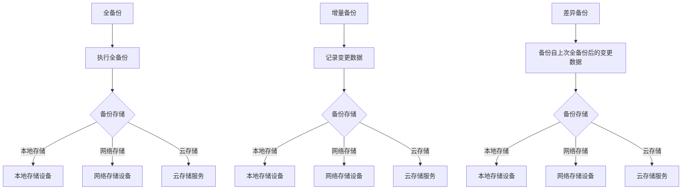
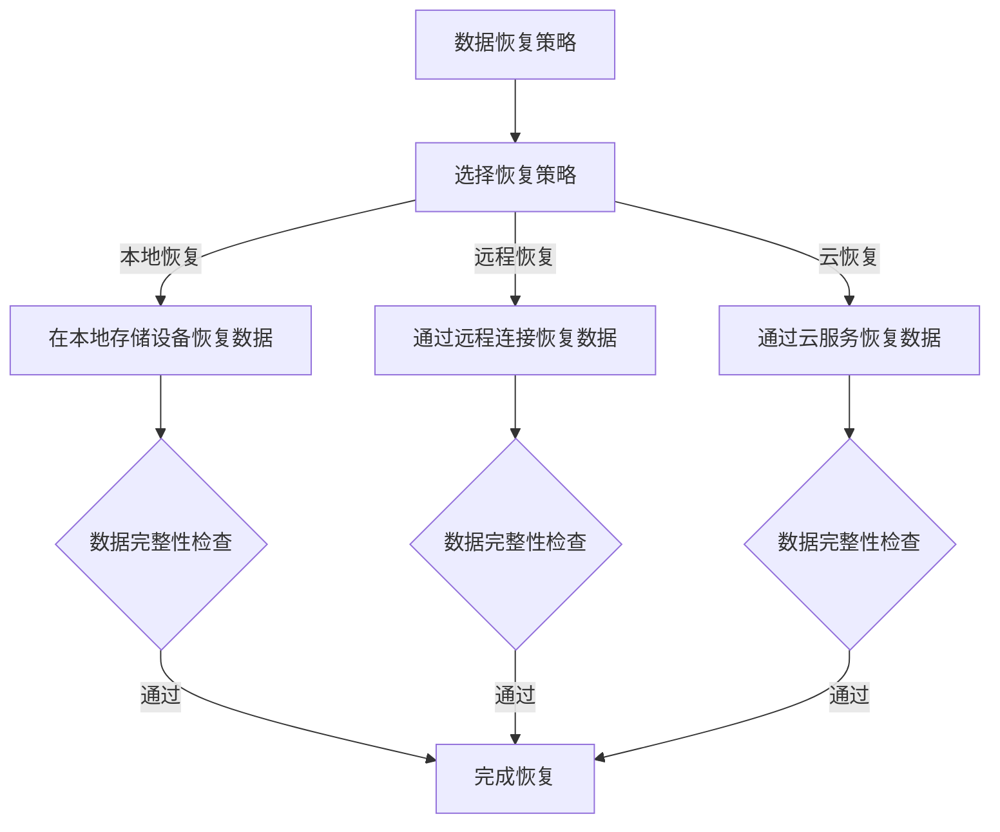
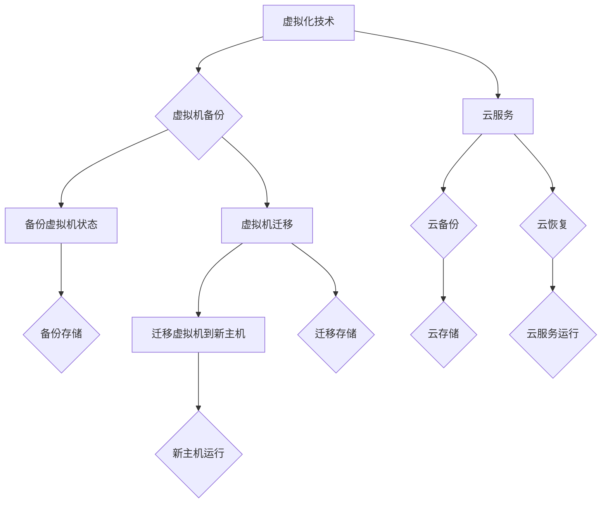

                 

# 灾难恢复：确保业务连续性的技术和策略

> 关键词：灾难恢复、业务连续性、备份技术、高可用性、虚拟化、云服务、恢复测试

> 摘要：本文将探讨灾难恢复在确保业务连续性中的重要性。通过分析灾难恢复的背景、核心概念、关键技术和策略，并结合实际案例，我们将深入了解如何构建有效的灾难恢复计划，以应对各种可能的灾难情况。

## 第一部分：背景与核心概念

### 第1章：灾难恢复概述

#### 1.1 灾难恢复的定义与重要性

灾难恢复（Disaster Recovery，简称DR）是指企业在面对自然灾害、技术故障或人为错误等突发事件时，通过一系列的应急响应措施和技术手段，确保业务能够尽快恢复到正常运作状态的过程。

- **灾难恢复的定义**：
  - 灾难恢复是指在灾难发生后，迅速恢复业务运作的过程，包括数据恢复、系统恢复和业务恢复。
  - 业务连续性（Business Continuity，简称BC）是指企业在面对突发事件时，通过一系列策略和措施，确保业务能够持续运作的能力。

- **灾难恢复的重要性**：
  - 保证数据安全：灾难恢复能够确保企业数据在灾难发生后得到及时恢复，避免数据丢失。
  - 保护企业资产：灾难恢复能够帮助企业减少因灾难带来的经济损失，维护企业稳定运营。
  - 提高客户满意度：灾难恢复能够确保企业能够快速恢复业务，减少对客户服务的影响，提高客户满意度。

#### 1.2 灾难类型与影响

- **灾难类型**：
  - 自然灾害：如地震、洪水、台风等。
  - 技术故障：如服务器宕机、网络故障、硬件故障等。
  - 人为错误：如操作失误、恶意攻击等。

- **灾难影响**：
  - 数据丢失：灾难可能导致企业数据丢失，影响业务运营。
  - 业务中断：灾难可能导致企业业务中断，影响客户满意度。
  - 成本增加：灾难可能导致企业增加维修、恢复等成本。

#### 1.3 灾难恢复的演变

- **早期方法**：
  - 数据备份：通过定期备份，确保数据在灾难发生后能够得到恢复。
  - 热备份：通过实时备份，确保数据在灾难发生后能够立即恢复。

- **现代方法**：
  - 虚拟化：通过虚拟化技术，提高系统资源利用率和恢复速度。
  - 云服务：通过云服务，提供弹性、高效、可靠的灾难恢复解决方案。

#### 1.4 核心概念与联系

- **核心概念**：
  - 风险评估：对潜在风险进行识别、分析和评估，确定风险等级和应对措施。
  - 恢复点目标（RPO）：确定业务能够在多长时间内恢复到正常运作的状态。
  - 备份策略：确定数据备份的方法和频率，包括全备份、增量备份、差异备份等。

- **概念属性特征对比表格**：

  | 核心概念   | 定义                                                         | 属性特征对比                         |
  | ---------- | ------------------------------------------------------------ | ------------------------------------ |
  | 风险评估   | 对潜在风险进行识别、分析和评估                               | 包括可能性、影响、风险等级等         |
  | 恢复点目标 | 确定业务能够在多长时间内恢复到正常运作的状态                 | 包括数据恢复、系统恢复等             |
  | 备份策略   | 确定数据备份的方法和频率                                     | 包括全备份、增量备份、差异备份等     |

#### 1.5 本章小结

本章介绍了灾难恢复的定义、重要性、类型、影响、演变以及核心概念。通过本章的介绍，读者可以了解到灾难恢复在确保业务连续性中的关键作用，为后续章节的学习打下基础。

----------------------------------------------------------------

## 第2章：灾难恢复的关键技术和策略

### 2.1 备份技术

备份技术是灾难恢复的基础，主要包括以下几种类型：

- **全备份**：对整个系统或数据进行备份，包括文件、配置、数据等。
- **增量备份**：只备份自上次备份后发生更改的数据，节省存储空间。
- **差异备份**：备份自上次全备份后发生更改的数据，与增量备份相比，保留的数据更全面。

#### 2.1.1 备份技术的选择

选择备份技术时，需要考虑以下因素：

- **备份频率**：根据业务需求和数据重要性确定备份频率，如每天、每周或每月。
- **备份类型**：根据数据类型和业务需求选择全备份、增量备份或差异备份。
- **备份存储**：选择合适的备份存储方式，如本地存储、网络存储或云存储。

### 2.2 数据恢复策略

数据恢复策略主要包括以下几种：

- **本地恢复**：在本地存储设备上恢复数据，适用于数据量较小的情况。
- **远程恢复**：通过远程连接到备份存储设备，恢复数据，适用于数据量较大或跨地域的情况。
- **云恢复**：通过云服务恢复数据，具有弹性、高效、可靠的特点。

#### 2.2.1 数据恢复的目标

数据恢复的目标主要包括：

- **快速恢复**：在灾难发生后，尽快恢复数据，减少业务中断时间。
- **数据完整性**：确保恢复的数据与原始数据一致，保证业务运行的准确性。

### 2.3 高可用性策略

高可用性策略旨在确保系统在故障发生时能够快速切换，保证业务连续性。主要包括以下几种：

- **热备份**：在主系统运行的同时，实时备份数据，当主系统出现故障时，立即切换到备份系统。
- **集群**：通过多台服务器共同工作，实现负载均衡和故障转移，提高系统可用性。
- **负载均衡**：将业务请求分配到多台服务器，提高系统处理能力和可用性。

#### 2.3.1 高可用性策略的实施

实施高可用性策略时，需要考虑以下因素：

- **系统架构**：选择合适的系统架构，如集群架构、分布式架构等。
- **硬件选择**：选择高性能、高可靠的硬件设备，提高系统稳定性。
- **网络配置**：合理配置网络，确保数据传输的稳定性和安全性。

### 2.4 虚拟化技术

虚拟化技术可以提高系统资源利用率，降低硬件成本，提高灾难恢复能力。主要包括以下几种：

- **虚拟机备份**：通过虚拟化技术，对虚拟机进行备份，提高数据恢复速度。
- **虚拟机迁移**：通过虚拟化技术，将虚拟机从一个物理服务器迁移到另一个物理服务器，实现无缝切换。

#### 2.4.1 虚拟化技术的优势

虚拟化技术的优势主要包括：

- **资源优化**：通过虚拟化技术，合理分配硬件资源，提高系统性能。
- **快速恢复**：通过虚拟化技术，实现快速数据恢复，降低业务中断时间。

### 2.5 云服务在灾难恢复中的作用

云服务在灾难恢复中具有重要作用，主要包括以下几种：

- **云备份**：通过云服务，实现数据备份和恢复，具有弹性、高效、可靠的特点。
- **云恢复**：通过云服务，实现数据的快速恢复，降低业务中断时间。

#### 2.5.1 云服务的优势

云服务的优势主要包括：

- **弹性**：根据业务需求，动态调整资源，实现高效资源利用。
- **高可用性**：通过分布式架构，实现数据的高可用性和可靠性。
- **成本效益**：降低硬件投资和维护成本，提高业务连续性。

### 2.6 灾难恢复计划的重要性

灾难恢复计划是确保业务连续性的关键，主要包括以下组成部分：

- **风险评估**：对潜在风险进行识别、分析和评估，确定风险等级和应对措施。
- **恢复目标**：确定业务能够在多长时间内恢复到正常运作的状态。
- **备份策略**：确定数据备份的方法和频率，包括全备份、增量备份、差异备份等。

#### 2.6.1 灾难恢复计划的实施

实施灾难恢复计划时，需要考虑以下因素：

- **计划制定**：根据业务需求和风险情况，制定合理的灾难恢复计划。
- **资源准备**：准备好所需的硬件、软件和人员，确保灾难发生后能够快速响应。
- **培训演练**：定期进行培训演练，提高员工应对灾难的能力。

### 2.7 灾难恢复测试

灾难恢复测试是验证灾难恢复计划有效性的关键，主要包括以下几种：

- **桌面演练**：模拟灾难发生时，员工在桌面上的操作，测试灾难恢复计划的执行情况。
- **全面演练**：模拟灾难发生时，整个系统的操作，测试灾难恢复计划的全面性。

#### 2.7.1 灾难恢复测试的目的

灾难恢复测试的目的主要包括：

- **验证恢复计划的有效性**：通过模拟灾难场景，验证灾难恢复计划的可行性和有效性。
- **发现潜在问题**：通过测试，发现灾难恢复计划中的潜在问题，及时进行修正。

### 2.8 本章小结

本章介绍了灾难恢复的关键技术和策略，包括备份技术、数据恢复策略、高可用性策略、虚拟化技术和云服务。通过本章的学习，读者可以了解到灾难恢复的基本概念和方法，为实际业务中的灾难恢复工作提供参考。

----------------------------------------------------------------

## 第3章：案例分析：成功的灾难恢复实践

### 3.1 案例研究：金融机构的灾难恢复计划

#### 3.1.1 背景

某金融机构在国内拥有广泛的业务网络，包括银行、保险、证券等多种金融服务。随着业务的不断增长，该金融机构面临着越来越高的数据量和业务复杂性，同时也面临着灾难恢复的挑战。

#### 3.1.2 灾难事件

在某一天，该金融机构所在地的城市突然遭遇了一场强烈地震，导致服务器和网络设备受损，业务运营中断。地震发生后，该金融机构立即启动了灾难恢复计划。

#### 3.1.3 恢复过程

1. **风险评估**：
   - 确定地震对业务的影响，包括数据丢失、业务中断、硬件损坏等。
   - 对潜在风险进行识别、分析和评估，确定风险等级和应对措施。

2. **恢复策略**：
   - 根据风险评估结果，制定详细的恢复策略，包括数据恢复、系统恢复和业务恢复。
   - 确定恢复点目标（RPO），确保在规定时间内恢复业务。

3. **数据恢复**：
   - 通过云备份和本地备份，快速恢复数据。
   - 采用增量备份和差异备份，确保数据的完整性和一致性。

4. **系统恢复**：
   - 利用虚拟化技术和高可用性策略，快速恢复系统。
   - 通过热备份和集群，确保系统在故障发生时能够快速切换。

5. **业务恢复**：
   - 根据恢复策略，逐步恢复业务功能，确保客户服务的连续性。
   - 通过远程恢复和云恢复，提高业务恢复速度。

#### 3.1.4 恢复成果

在灾难发生后，该金融机构通过有效的灾难恢复计划，成功恢复了业务运营。具体成果如下：

- **数据恢复**：在规定时间内，成功恢复了全部数据，确保数据完整性。
- **系统恢复**：在规定时间内，成功恢复了系统，确保系统稳定性。
- **业务恢复**：在规定时间内，成功恢复了业务功能，确保客户服务的连续性。

#### 3.1.5 恢复经验

通过这次灾难恢复实践，该金融机构总结了以下经验：

- **制定详细的灾难恢复计划**：灾难恢复计划是确保业务连续性的关键，必须制定详细的计划，包括风险评估、恢复策略、数据恢复、系统恢复和业务恢复等。
- **定期进行灾难恢复测试**：定期进行灾难恢复测试，验证灾难恢复计划的有效性，发现潜在问题并及时修正。
- **采用多种备份技术**：采用多种备份技术，如云备份、本地备份、增量备份、差异备份等，确保数据的安全性和完整性。
- **实施高可用性策略**：通过实施高可用性策略，如热备份、集群、负载均衡等，确保系统在故障发生时能够快速切换，提高业务连续性。
- **加强员工培训**：定期对员工进行灾难恢复培训，提高员工应对灾难的能力。

#### 3.1.6 本章小结

本章通过金融机构的灾难恢复案例，介绍了灾难恢复的核心概念、关键技术和策略，以及成功的灾难恢复实践。通过案例的分析，读者可以了解到灾难恢复在确保业务连续性中的重要作用，为实际业务中的灾难恢复工作提供参考。

----------------------------------------------------------------

## 本章小结

通过本章的介绍，我们了解了灾难恢复在确保业务连续性中的重要性。从背景介绍、核心概念、关键技术和策略，到案例分析，我们逐步深入探讨了灾难恢复的各个方面。本章的内容旨在帮助读者建立起对灾难恢复的全面认识，为后续的实践和应用提供指导。

### 最佳实践 tips

- 制定详细的灾难恢复计划，并定期进行更新和测试。
- 选择合适的备份技术和存储方式，确保数据的完整性和安全性。
- 实施高可用性策略，提高系统的稳定性和可靠性。
- 定期对员工进行灾难恢复培训，提高员工的应急处理能力。

### 注意事项

- 灾难恢复不是一次性工作，而是一个持续的过程，需要定期评估和改进。
- 灾难恢复计划必须与业务需求相匹配，确保能够在最短时间内恢复业务。
- 在灾难发生后，及时响应和执行灾难恢复计划是确保业务连续性的关键。

### 拓展阅读

- 《业务连续性管理：实践指南》
- 《灾难恢复实战：构建高可用性IT系统》
- 《云计算与业务连续性》

作者：AI天才研究院/AI Genius Institute & 禅与计算机程序设计艺术 /Zen And The Art of Computer Programming### 第1章：灾难恢复概述

#### 1.1 灾难恢复的定义与重要性

**灾难恢复的定义**：
灾难恢复（Disaster Recovery，简称DR）是指企业在面临自然灾害、技术故障或人为错误等突发事件时，通过一系列应急响应措施和技术手段，确保关键业务能够快速恢复至正常运行状态的过程。这不仅包括数据的恢复，还包括系统的修复、业务的持续和人员的协调。

**业务连续性定义**：
业务连续性（Business Continuity，简称BC）是指企业在任何突发事件下，通过一系列策略和措施，确保关键业务能够持续运作，不因灾难而中断。BC更侧重于预防和管理，而DR则侧重于应对和恢复。

**灾难恢复的重要性**：
1. **数据保护**：灾难恢复的首要目标是确保企业数据的安全和完整性。数据是企业运营的核心资产，一旦丢失，对企业的影响将是灾难性的。
2. **成本控制**：灾难恢复有助于减少灾难带来的经济损失。快速恢复业务可以避免因业务中断而导致的经济损失。
3. **信誉维护**：在灾难发生后，能否迅速恢复业务直接影响企业的信誉。良好的灾难恢复计划可以增强客户和合作伙伴对企业的信心。
4. **法律法规遵守**：某些行业需要遵守特定的数据保护法规，灾难恢复计划有助于企业遵守这些法规。

#### 1.2 灾难类型与影响

**灾难类型**：
- **自然灾害**：如地震、洪水、台风、火灾等。
- **技术故障**：如服务器宕机、网络中断、硬件损坏、软件故障等。
- **人为错误**：如操作失误、内部或外部恶意攻击等。

**灾难影响**：
- **数据丢失**：数据丢失可能导致业务中断，严重时可能威胁到企业的生存。
- **业务中断**：业务中断会直接影响企业的盈利能力和市场地位。
- **成本增加**：灾难恢复过程中可能产生额外的成本，如维修费用、人工成本等。

#### 1.3 灾难恢复的演变

**早期方法**：
- **数据备份**：通过定期备份，确保数据在灾难发生后能够恢复。
- **热备份**：实时备份，一旦主系统发生故障，立即切换到备份系统。

**现代方法**：
- **虚拟化**：通过虚拟化技术，提高资源利用率和恢复速度。
- **云服务**：利用云服务的弹性和灵活性，提供高效的灾难恢复解决方案。

#### 1.4 核心概念与联系

**核心概念**：
- **风险评估**：对潜在风险进行识别、分析和评估，确定风险等级和应对措施。
- **恢复点目标（RPO）**：确定业务能够在多长时间内恢复到正常运作的状态。
- **备份策略**：确定数据备份的方法和频率。

**概念属性特征对比表格**：

| 核心概念   | 定义                                                         | 属性特征对比                         |
| ---------- | ------------------------------------------------------------ | ------------------------------------ |
| 风险评估   | 对潜在风险进行识别、分析和评估                               | 包括可能性、影响、风险等级等         |
| 恢复点目标 | 确定业务能够在多长时间内恢复到正常运作的状态                 | 包括数据恢复、系统恢复等             |
| 备份策略   | 确定数据备份的方法和频率                                     | 包括全备份、增量备份、差异备份等     |

#### 1.5 本章小结

本章介绍了灾难恢复的定义、重要性、类型、影响、演变以及核心概念。通过本章的介绍，读者可以初步了解灾难恢复的基本概念，认识到其在业务连续性中的关键作用。

---

### 第2章：灾难恢复的关键技术和策略

#### 2.1 备份技术

备份技术是灾难恢复的基础，其目的是确保在灾难发生后能够恢复业务。备份技术主要包括以下几种类型：

**全备份**：
- **定义**：全备份是对整个系统或数据进行的一次完整备份，包括文件、配置、数据等。
- **优点**：简单、全面，一旦发生灾难，可以快速恢复。
- **缺点**：备份量大，备份时间长，需要大量存储空间。

**增量备份**：
- **定义**：增量备份只备份自上次备份后发生更改的数据。
- **优点**：备份时间短，节省存储空间。
- **缺点**：恢复时需要多个增量备份文件，恢复过程复杂。

**差异备份**：
- **定义**：差异备份备份自上次全备份后发生更改的数据。
- **优点**：备份频率比全备份低，但比增量备份更全面。
- **缺点**：备份文件数量较多，恢复时需要全备份和最近的差异备份。

**备份技术的选择**：
- **备份频率**：根据业务需求和数据重要性确定备份频率，如每天、每周或每月。
- **备份类型**：全备份适用于数据量较小且需要高度数据一致性的场景，增量备份和差异备份适用于数据量较大且备份窗口较宽的场景。
- **备份存储**：选择合适的备份存储方式，如本地存储、网络存储或云存储。本地存储成本低，但安全性较差；网络存储和云存储安全性高，但成本较高。

#### 2.2 数据恢复策略

数据恢复策略是指在企业发生灾难后，如何快速、有效地恢复业务数据的方案。数据恢复策略主要包括以下几种：

**本地恢复**：
- **定义**：在本地存储设备上恢复数据，适用于数据量较小的情况。
- **优点**：恢复速度快，成本较低。
- **缺点**：受限于本地存储的容量和性能。

**远程恢复**：
- **定义**：通过远程连接到备份存储设备恢复数据，适用于数据量较大或跨地域的情况。
- **优点**：适用于大型企业和跨地域部署的场景。
- **缺点**：恢复速度较慢，可能需要较长的时间。

**云恢复**：
- **定义**：通过云服务恢复数据，具有弹性、高效、可靠的特点。
- **优点**：恢复速度快，灵活性高，适合大规模数据恢复。
- **缺点**：成本较高，对网络依赖较大。

**数据恢复的目标**：
- **快速恢复**：在灾难发生后，尽快恢复业务数据，减少业务中断时间。
- **数据完整性**：确保恢复的数据与原始数据一致，保证业务运行的准确性。

#### 2.3 高可用性策略

高可用性策略是指通过一系列技术和措施，确保系统在故障发生时能够快速切换，保证业务连续性。高可用性策略主要包括以下几种：

**热备份**：
- **定义**：在主系统运行的同时，实时备份数据，当主系统出现故障时，立即切换到备份系统。
- **优点**：切换速度快，业务中断时间短。
- **缺点**：需要较高的硬件和网络资源投入。

**集群**：
- **定义**：通过多台服务器共同工作，实现负载均衡和故障转移。
- **优点**：高可用性，负载均衡，故障转移方便。
- **缺点**：系统复杂度较高，维护成本较高。

**负载均衡**：
- **定义**：将业务请求分配到多台服务器，提高系统处理能力和可用性。
- **优点**：提高系统性能，降低单点故障风险。
- **缺点**：需要配置和管理多台服务器。

**高可用性策略的实施**：
- **系统架构**：选择合适的系统架构，如集群架构、分布式架构等。
- **硬件选择**：选择高性能、高可靠的硬件设备，提高系统稳定性。
- **网络配置**：合理配置网络，确保数据传输的稳定性和安全性。

#### 2.4 虚拟化技术

虚拟化技术是将物理硬件资源虚拟化为多个逻辑资源，提高资源利用率和灾难恢复能力。虚拟化技术主要包括以下几种：

**虚拟机备份**：
- **定义**：通过虚拟化技术，对虚拟机进行备份。
- **优点**：备份速度快，恢复速度快。
- **缺点**：对虚拟化平台依赖较大。

**虚拟机迁移**：
- **定义**：通过虚拟化技术，将虚拟机从一个物理服务器迁移到另一个物理服务器。
- **优点**：实现无缝切换，提高系统可用性。
- **缺点**：对虚拟化平台和网络依赖较大。

**虚拟化技术的优势**：
- **资源优化**：通过虚拟化技术，合理分配硬件资源，提高系统性能。
- **快速恢复**：通过虚拟化技术，实现快速数据恢复，降低业务中断时间。

#### 2.5 云服务在灾难恢复中的作用

云服务在灾难恢复中具有重要作用，其弹性、高效、可靠的特点为灾难恢复提供了有力支持。云服务在灾难恢复中的应用主要包括以下几种：

**云备份**：
- **定义**：通过云服务，实现数据备份和恢复。
- **优点**：备份速度快，恢复速度快，灵活性高。
- **缺点**：成本较高，对网络依赖较大。

**云恢复**：
- **定义**：通过云服务，实现数据的快速恢复。
- **优点**：恢复速度快，灵活性强。
- **缺点**：成本较高，对网络依赖较大。

**云服务的优势**：
- **弹性**：根据业务需求，动态调整资源，实现高效资源利用。
- **高可用性**：通过分布式架构，实现数据的高可用性和可靠性。
- **成本效益**：降低硬件投资和维护成本，提高业务连续性。

#### 2.6 灾难恢复计划的重要性

灾难恢复计划是确保业务连续性的关键，它包括以下几个组成部分：

**风险评估**：
- **定义**：对潜在风险进行识别、分析和评估，确定风险等级和应对措施。
- **重要性**：了解企业面临的风险，为制定灾难恢复计划提供依据。

**恢复点目标（RPO）**：
- **定义**：确定业务能够在多长时间内恢复到正常运作的状态。
- **重要性**：明确业务恢复的时间目标，确保灾难发生后能够尽快恢复业务。

**备份策略**：
- **定义**：确定数据备份的方法和频率。
- **重要性**：确保数据在灾难发生后能够得到及时恢复，保护企业资产。

**灾难恢复计划的重要性**：
- **确保数据安全**：灾难恢复计划是确保企业数据在灾难发生后得到及时恢复的关键。
- **降低成本**：通过有效的灾难恢复计划，可以降低灾难带来的经济损失。
- **提高业务连续性**：灾难恢复计划有助于确保企业关键业务在灾难发生后能够尽快恢复，提高客户满意度。

**灾难恢复计划的实施**：
- **计划制定**：根据业务需求和风险情况，制定合理的灾难恢复计划。
- **资源准备**：准备好所需的硬件、软件和人员，确保灾难发生后能够快速响应。
- **培训演练**：定期进行培训演练，提高员工应对灾难的能力。

#### 2.7 灾难恢复测试

灾难恢复测试是验证灾难恢复计划有效性的关键，通过模拟各种灾难场景，测试灾难恢复计划的执行情况。灾难恢复测试主要包括以下几种：

**桌面演练**：
- **定义**：模拟灾难发生时，员工在桌面上的操作。
- **优点**：操作简单，成本低。
- **缺点**：无法全面测试系统的恢复能力。

**全面演练**：
- **定义**：模拟灾难发生时，整个系统的操作。
- **优点**：全面测试系统的恢复能力。
- **缺点**：成本较高，需要较长时间。

**测试的目的**：
- **验证恢复计划的有效性**：通过模拟灾难场景，验证灾难恢复计划的可行性和有效性。
- **发现潜在问题**：通过测试，发现灾难恢复计划中的潜在问题，及时进行修正。

#### 2.8 本章小结

本章介绍了灾难恢复的关键技术和策略，包括备份技术、数据恢复策略、高可用性策略、虚拟化技术和云服务。通过本章的学习，读者可以了解到灾难恢复的基本概念和方法，为实际业务中的灾难恢复工作提供参考。

---

## 第3章：案例分析：成功的灾难恢复实践

#### 3.1 案例研究：金融机构的灾难恢复计划

**3.1.1 背景**

某国际知名金融机构在全球范围内提供广泛的金融服务，包括银行、保险、证券等。随着业务的不断扩展，该金融机构的数据量和业务复杂性也日益增加，因此，一个有效的灾难恢复计划变得至关重要。

**3.1.2 灾难事件**

在某年一场突如其来的地震袭击了该金融机构的主要数据中心所在城市。地震导致数据中心的主要服务器和通信设备受到损坏，业务运营被迫中断。这场灾难不仅威胁到了企业的运营，还可能影响到客户的信心和满意度。

**3.1.3 恢复过程**

1. **风险评估与计划启动**：
   - 地震发生后，灾难恢复小组立即启动了灾难恢复计划。
   - 首先，对灾难的影响进行了初步评估，包括确定数据丢失的范围、系统损坏的程度以及业务中断的时间。
   - 根据评估结果，制定了详细的恢复计划，明确了恢复的目标和时间表。

2. **数据恢复**：
   - 该金融机构采用了一套先进的云备份解决方案，所有关键数据都备份在云端。
   - 灾难发生后，数据恢复小组立即从云端恢复数据，确保数据的安全性和完整性。
   - 通过虚拟化技术，快速部署虚拟服务器，将数据恢复到新的硬件环境中。

3. **系统恢复**：
   - 系统恢复小组利用集群技术和负载均衡策略，确保在恢复过程中系统能够平稳过渡。
   - 通过自动化脚本和备份还原工具，快速恢复了系统配置和数据。
   - 同时，对恢复后的系统进行了全面的测试，确保其稳定性和可靠性。

4. **业务恢复**：
   - 随着系统的恢复，业务恢复小组开始逐步恢复各项业务功能。
   - 首先，恢复了基本的服务，如银行账户查询和交易处理。
   - 随后，逐步恢复了更高级别的服务，如证券交易和保险理赔。
   - 在恢复过程中，与客户保持密切沟通，确保他们了解业务恢复的进展情况。

5. **总结与改进**：
   - 灾难恢复完成后，该金融机构对灾难恢复计划进行了总结和评估。
   - 通过分析灾难发生和恢复过程中的经验和教训，对灾难恢复计划进行了改进。
   - 加强了员工的培训和演练，提高了应急响应能力。

**3.1.4 恢复成果**

通过有效的灾难恢复计划，该金融机构在地震发生后迅速恢复了业务运营。具体成果如下：

- **数据恢复**：在规定时间内，成功恢复了全部关键数据，确保了业务的连续性。
- **系统恢复**：在短时间内，恢复了所有系统功能，确保了业务的稳定运行。
- **业务恢复**：在灾后第一时间内，恢复了基本服务，随后逐步恢复了高级服务，确保了客户满意度。

**3.1.5 恢复经验**

通过这次灾难恢复实践，该金融机构总结出以下经验：

- **制定详细的灾难恢复计划**：灾难恢复计划是确保业务连续性的关键，必须详细、全面。
- **采用先进的备份技术**：云备份和虚拟化技术能够大幅提高数据恢复的速度和效率。
- **实施高可用性策略**：集群和负载均衡策略能够确保系统在灾难发生时能够快速切换。
- **定期培训演练**：定期对员工进行灾难恢复培训和演练，提高应急响应能力。
- **持续改进**：灾难恢复计划不是一次性工作，需要根据实际情况不断改进和完善。

**3.1.6 本章小结**

通过金融机构的灾难恢复案例，我们了解到在灾难发生后，如何通过有效的灾难恢复计划快速恢复业务。这个案例展示了现代灾难恢复技术的优势，以及如何通过持续改进提高灾难恢复能力。对于其他企业，这个案例提供了宝贵的经验和借鉴。

---

## 本章小结

通过本章的案例分析，我们深入了解了灾难恢复的核心概念、关键技术和策略，以及一个成功的灾难恢复实践。本章内容不仅介绍了灾难恢复的基本原理，还通过具体案例展示了如何在实际操作中应用这些原理。通过本章的学习，读者可以更好地理解灾难恢复的重要性，并在实际工作中制定和实施有效的灾难恢复计划。

### 最佳实践 tips

- 制定详细的灾难恢复计划，并进行定期更新和测试。
- 采用多种备份技术，如云备份、增量备份和差异备份，确保数据的安全性。
- 实施高可用性策略，如集群和负载均衡，提高系统的稳定性。
- 定期对员工进行灾难恢复培训，提高应急响应能力。
- 持续改进灾难恢复计划，根据业务变化和实际情况进行调整。

### 注意事项

- 灾难恢复计划必须与业务需求相匹配，确保能够在最短时间内恢复业务。
- 灾难恢复计划应涵盖所有关键业务系统和数据，确保全面性。
- 定期评估灾难恢复计划的可行性和有效性，确保其符合当前业务需求。
- 灾难恢复计划应包括详细的风险评估和恢复时间目标（RPO）。

### 拓展阅读

- 《业务连续性管理：实践指南》
- 《灾难恢复实战：构建高可用性IT系统》
- 《云计算与业务连续性》

作者：AI天才研究院/AI Genius Institute & 禅与计算机程序设计艺术 /Zen And The Art of Computer Programming### 附录：灾难恢复技术的Mermaid流程图与Python代码示例

在本章中，我们详细讨论了灾难恢复的关键技术和策略。为了更好地帮助读者理解这些技术，我们将使用Mermaid流程图和Python代码示例来展示一些核心概念和算法原理。

#### Mermaid流程图：备份技术



#### Python代码示例：增量备份算法

```python
import os
import datetime

def incremental_backup(source_path, backup_path, last_backup_time):
    """
    执行增量备份，将自上次备份后发生变更的文件备份到指定路径。
    
    :param source_path: 源文件路径
    :param backup_path: 备份文件路径
    :param last_backup_time: 上次备份时间
    """
    current_time = datetime.datetime.now()
    backup_files = []

    # 遍历源目录，获取自上次备份后发生变更的文件
    for root, dirs, files in os.walk(source_path):
        for file in files:
            file_path = os.path.join(root, file)
            file_mtime = os.path.getmtime(file_path)
            if file_mtime > last_backup_time:
                backup_files.append(file_path)

    # 备份文件
    for file_path in backup_files:
        destination_path = os.path.join(backup_path, file_path)
        os.makedirs(os.path.dirname(destination_path), exist_ok=True)
        with open(file_path, 'rb') as src_file, open(destination_path, 'wb') as dst_file:
            dst_file.write(src_file.read())

    return current_time

# 示例：执行增量备份
source = 'source_directory'
backup = 'backup_directory'
last_backup = incremental_backup(source, backup, last_backup_time=datetime.datetime(2023, 4, 1))
print(f"增量备份完成，最新备份时间为：{last_backup}")
```

#### Mermaid流程图：数据恢复策略



#### Python代码示例：数据恢复函数

```python
import os
import tarfile

def restore_data(backup_path, destination_path):
    """
    从备份路径恢复数据到指定路径。
    
    :param backup_path: 备份文件路径
    :param destination_path: 目标路径
    """
    if os.path.exists(destination_path):
        print(f"目标路径 {destination_path} 已存在，请先删除或重命名现有文件。")
        return

    # 解压备份文件
    with tarfile.open(backup_path, 'r:*') as tar:
        tar.extractall(path=destination_path)

    print(f"数据恢复完成，目标路径：{destination_path}")

# 示例：执行数据恢复
backup = 'path_to_backup.tar'
destination = 'path_to_destination'
restore_data(backup, destination)
```

#### Mermaid流程图：虚拟化技术与云服务



#### Python代码示例：虚拟机备份与恢复

```python
import subprocess

def backup_vm(vm_name, backup_path):
    """
    备份虚拟机状态到指定路径。
    
    :param vm_name: 虚拟机名称
    :param backup_path: 备份路径
    """
    command = f"VMware-vcenter-vm-clone --server your_server --user your_user --password your_password --vm {vm_name} --clone-to {backup_path}"
    result = subprocess.run(command, shell=True, capture_output=True)
    if result.returncode == 0:
        print(f"虚拟机 {vm_name} 备份成功，路径：{backup_path}")
    else:
        print(f"虚拟机 {vm_name} 备份失败：{result.stderr}")

def restore_vm(backup_path, new_vm_name):
    """
    从备份路径恢复虚拟机到新名称。
    
    :param backup_path: 备份路径
    :param new_vm_name: 新虚拟机名称
    """
    command = f"VMware-vcenter-vm-clone --server your_server --user your_user --password your_password --backup {backup_path} --clone-to {new_vm_name}"
    result = subprocess.run(command, shell=True, capture_output=True)
    if result.returncode == 0:
        print(f"虚拟机 {new_vm_name} 恢复成功。")
    else:
        print(f"虚拟机 {new_vm_name} 恢复失败：{result.stderr}")

# 示例：执行虚拟机备份
vm_name = 'test_vm'
backup_path = 'path_to_backup'
backup_vm(vm_name, backup_path)

# 示例：执行虚拟机恢复
new_vm_name = 'restored_vm'
restore_vm(backup_path, new_vm_name)
```

通过这些Mermaid流程图和Python代码示例，读者可以更直观地理解灾难恢复技术的工作原理，并在实际开发中应用这些技术。希望这些工具和示例能够为读者在灾难恢复领域的研究和实践提供帮助。

