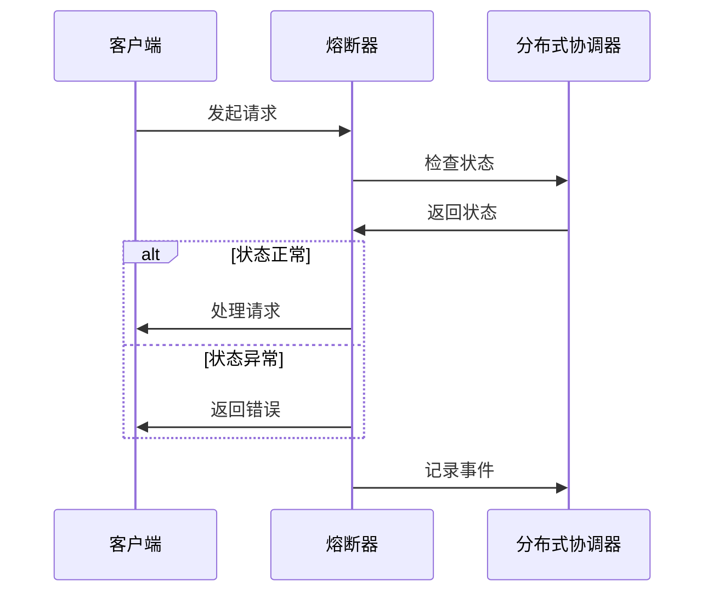

                 

## 熔断与限流：提高系统稳定性的关键技术

关键词：熔断、限流、系统稳定性、故障处理、性能优化

摘要：本文将深入探讨熔断与限流技术在现代系统中的重要性，解释这些概念的基本原理，并提供实际案例和最佳实践，以帮助读者理解和应用这些关键技术，提升系统稳定性和性能。

## 目录大纲设计思路

在设计《熔断与限流：提高系统稳定性的关键技术》的目录大纲时，我们的目标是确保内容的系统性和逻辑性，使读者能够循序渐进地了解和掌握相关概念与技能。

### 1. 确定核心章节

核心章节的确定基于书名和目标读者群体。根据书名，我们确定了以下核心章节：

- **第1章：熔断与限流的基本概念**
  - 介绍熔断与限流的基本概念，为后续内容奠定基础。
- **第2章：熔断与限流技术的原理**
  - 详细阐述熔断与限流技术的原理，包括其工作方式和应用场景。
- **第3章：熔断与限流技术的应用场景**
  - 分析熔断与限流技术在不同系统中的实际应用。
- **第4章：熔断与限流技术的实现与优化**
  - 讨论熔断与限流技术的具体实现方法和优化策略。
- **第5章：熔断与限流技术的最佳实践**
  - 提供熔断与限流技术的最佳实践案例，总结关键经验。

### 2. 确定章节顺序

章节的顺序安排遵循从基础到高级、从理论到实践的逻辑：

- **第1章：熔断与限流的基本概念**
  - 为后续章节提供必要的背景知识。
- **第2章：熔断与限流技术的原理**
  - 详细讲解熔断与限流技术的工作原理。
- **第3章：熔断与限流技术的应用场景**
  - 分析这些技术在不同系统中的应用。
- **第4章：熔断与限流技术的实现与优化**
  - 讨论实现细节和优化策略。
- **第5章：熔断与限流技术的最佳实践**
  - 提供实际操作经验和总结。

### 3. 确定每个章节的内容

每个章节的内容设计基于上述核心章节和逻辑顺序，确保内容的完整性和连贯性：

- **第1章：熔断与限流的基本概念**
  - **1.1 问题描述与背景**
  - **1.2 熔断与限流的概念**
  - **1.3 熔断与限流的边界与外延**
  - **1.4 熔断与限流的核心要素组成**
- **第2章：熔断与限流技术的原理**
  - **2.1 熔断技术原理**
  - **2.2 限流技术原理**
  - **2.3 熔断与限流的联系与区别**
- **第3章：熔断与限流技术的应用场景**
  - **3.1 熔断技术的应用场景**
  - **3.2 限流技术的应用场景**
  - **3.3 熔断与限流技术的综合应用**
- **第4章：熔断与限流技术的实现与优化**
  - **4.1 熔断技术的实现**
  - **4.2 限流技术的实现**
  - **4.3 熔断与限流的优化策略**
  - **4.4 熔断与限流技术的实现案例**
- **第5章：熔断与限流技术的最佳实践**
  - **5.1 熔断与限流技术的最佳实践总结**
  - **5.2 小结与注意事项**
  - **5.3 拓展阅读与参考资料**

### 4. 使用Markdown格式输出

为了确保文章的可读性和规范性，我们使用Markdown格式组织文章内容，确保结构清晰、层次分明。以下是Markdown格式的文章结构：

```
# 熔断与限流：提高系统稳定性的关键技术

## 关键词

- 熔断
- 限流
- 系统稳定性
- 故障处理
- 性能优化

## 摘要

本文将深入探讨熔断与限流技术在现代系统中的重要性，解释这些概念的基本原理，并提供实际案例和最佳实践，以帮助读者理解和应用这些关键技术，提升系统稳定性和性能。

## 目录大纲设计思路

...

## 第1章 熔断与限流的基本概念

### 1.1 问题描述与背景

...

### 1.2 熔断与限流的概念

...

### 1.3 熔断与限流的边界与外延

...

### 1.4 熔断与限流的核心要素组成

...

## 第2章 熔断与限流技术的原理

...

## 第3章 熔断与限流技术的应用场景

...

## 第4章 熔断与限流技术的实现与优化

...

## 第5章 熔断与限流技术的最佳实践

...

## 作者信息

作者：AI天才研究院/AI Genius Institute & 禅与计算机程序设计艺术 /Zen And The Art of Computer Programming
```

通过以上设计思路和Markdown格式输出，我们确保了文章的逻辑清晰、内容完整，并易于读者理解和跟随。接下来，我们将逐章深入探讨熔断与限流技术的核心概念、原理、应用场景以及最佳实践。

## 第1章 熔断与限流的基本概念

### 1.1 问题描述与背景

在现代分布式系统中，随着服务数量和用户规模的持续增长，系统面临的压力和复杂性也在不断增加。这种复杂性不仅体现在数据处理和存储的扩展上，还包括网络延迟、并发请求处理、资源分配等多方面。因此，如何确保系统的稳定性和可靠性成为开发者和运维人员面临的一大挑战。

在实际应用中，系统稳定性问题通常表现为以下几种情况：

1. **过载处理**：当系统面临大量请求时，服务器可能会因为处理能力不足而出现响应缓慢甚至崩溃的情况。
2. **异常处理**：系统可能遇到各种异常情况，如数据库连接失败、网络中断等，这些问题会影响系统的正常运行。
3. **资源耗尽**：系统资源（如内存、CPU、磁盘空间）不足时，会导致系统性能下降，甚至完全停止服务。

为了应对这些问题，熔断（Circuit Breaker）和限流（Rate Limiting）技术被广泛采用。这些技术旨在提高系统的稳定性，确保在异常情况下系统能够快速响应并恢复正常运行。

### 1.2 熔断与限流的概念

#### 熔断（Circuit Breaker）

熔断技术是一种用于防止系统过载和故障传播的安全机制。其基本原理类似于电力系统中的熔断器，当电流超过安全阈值时，熔断器会断开电路，防止设备损坏。在软件系统中，熔断器用于监控系统的健康状况，当系统指标（如请求失败率、响应时间）超过预设阈值时，熔断器会自动断开对某些服务或功能的访问，以防止系统过载或崩溃。

熔断器的主要功能包括：

- **监控**：持续监控系统的健康状况，包括请求成功率、响应时间等。
- **断开**：当系统指标超过阈值时，断开对特定服务或功能的访问。
- **恢复**：在断开状态一段时间后，自动尝试恢复服务，并重新监控健康状况。

#### 限流（Rate Limiting）

限流技术是一种用于控制请求速率的机制，旨在确保系统不会被过多的请求淹没。其原理类似于交通信号灯，用于控制流量，避免道路拥堵。在软件系统中，限流器通过限制请求的频率来确保系统资源得到合理分配。

限流器的主要功能包括：

- **限制请求频率**：根据预设的规则限制请求的频率，防止系统过载。
- **统计与分析**：收集请求数据，用于分析和优化限流策略。

### 1.3 熔断与限流的边界与外延

熔断和限流虽然都是用于提高系统稳定性的技术，但它们的作用和实现方式有所不同。

#### 边界

- **熔断**：主要关注系统的健康状态和异常处理，旨在防止系统过载和故障传播。
- **限流**：主要关注请求的速率和流量控制，确保系统资源得到合理利用。

#### 外延

- **熔断**：可以应用于单个服务或整个系统，适用于对系统健康状态敏感的场景。
- **限流**：通常应用于单个服务或模块，适用于处理大量请求的场景。

### 1.4 熔断与限流的核心要素组成

熔断和限流技术各有其核心要素，理解这些要素对于正确应用这些技术至关重要。

#### 熔断的核心要素

1. **监控指标**：用于衡量系统健康状况的指标，如请求失败率、响应时间等。
2. **阈值设置**：预设的阈值，用于判断系统是否达到熔断条件。
3. **断开与恢复策略**：在系统达到熔断条件时，如何断开服务访问，以及在何种情况下恢复服务。

#### 限流的核心要素

1. **限制规则**：根据业务需求预设的请求频率限制规则。
2. **统计与追踪**：收集和分析请求数据，以优化限流策略。
3. **异常处理**：在请求被限流时，如何合理处理异常请求。

通过上述内容，我们为后续章节的深入探讨奠定了基础。在接下来的章节中，我们将进一步分析熔断与限流技术的原理、应用场景、实现方法以及最佳实践，帮助读者全面了解和掌握这些关键技术。

## 第2章 熔断与限流技术的原理

### 2.1 熔断技术原理

熔断技术是一种用于处理系统异常情况的安全机制，其核心思想是通过监控系统的健康状态，当系统面临过载或故障时，自动断开对某些服务或功能的访问，以防止系统崩溃或故障扩散。熔断器的工作机制可以类比为电路中的熔断器，当电流超过安全阈值时，熔断器会自动断开电路，防止设备损坏。

#### 熔断器的工作机制

1. **监控阶段**：熔断器持续监控系统的健康状态，如请求的成功率、响应时间、错误率等指标。这些指标可以反映系统的负载情况和健康状态。
   
2. **断开阶段**：当监控指标超过预设的阈值时，熔断器会进入断开阶段，切断对特定服务或功能的访问。断开阶段通常包含以下步骤：

   - **触发熔断**：当系统健康状态恶化，达到预设的触发条件时，熔断器触发熔断。
   - **断开访问**：熔断器断开对服务或功能的访问，阻止新的请求进入。
   - **记录日志**：熔断器记录熔断事件的相关信息，如触发时间、触发条件、断开时间等，用于后续分析和优化。

3. **恢复阶段**：在断开状态持续一段时间后，熔断器会进入恢复阶段，尝试重新连接服务或功能，并重新开始监控其健康状态。恢复阶段通常包含以下步骤：

   - **健康检查**：熔断器对断开的服务或功能进行健康检查，以确定其是否恢复正常。
   - **逐步恢复**：如果健康检查通过，熔断器会逐步恢复对服务或功能的访问，并继续监控其健康状况。
   - **持续监控**：熔断器继续监控系统的健康状态，防止再次触发熔断。

#### 熔断器的监控指标与阈值设置

熔断器的监控指标和阈值设置是确保其有效性的关键因素。常见的监控指标包括：

- **请求成功率**：在一段时间内，成功处理请求的比例。
- **响应时间**：请求的平均响应时间。
- **错误率**：在一段时间内，处理失败的请求比例。
- **并发请求数**：系统同时处理的请求数量。

阈值设置需要根据业务需求和系统特点进行。例如，对于高并发系统，可以设置较低的请求成功率阈值以快速响应错误，而对于低并发系统，可以设置较高的响应时间阈值以提高用户体验。

#### 熔断器的实现方法

熔断器的实现方法多种多样，常见的有以下几种：

1. **基于计数器的熔断器**：通过计数器记录请求失败次数，当失败次数超过阈值时触发熔断。
2. **基于定时器的熔断器**：使用定时器记录请求的时间戳，当请求时间超过阈值时触发熔断。
3. **基于状态机的熔断器**：使用状态机管理熔断状态，包括监控、断开和恢复状态。

每种实现方法都有其优缺点，需要根据具体场景进行选择。

### 2.2 限流技术原理

限流技术是一种用于控制请求速率的机制，旨在确保系统资源得到合理分配，避免系统过载。其基本原理是通过限制请求的频率，确保系统在可接受的负载范围内运行。

#### 限流器的原理

1. **限制请求频率**：限流器根据预设的规则限制请求的频率，常见的规则包括固定时间窗口内的请求数量限制、滑动时间窗口内的请求数量限制等。

2. **统计与追踪**：限流器收集和分析请求数据，用于优化限流策略。例如，根据请求的失败率和响应时间调整阈值。

3. **异常处理**：当请求被限流时，限流器会根据预设的异常处理规则进行相应的处理，如返回错误码、延迟响应等。

#### 限流器的实现方法

限流器的实现方法多种多样，常见的有以下几种：

1. **令牌桶算法**：通过令牌桶模拟请求的流量，确保请求速率不超过预设的上限。桶内的令牌代表允许发送的请求，当桶内的令牌用尽时，新的请求将被延迟或拒绝。

2. **漏桶算法**：通过漏桶模拟请求的流量，确保请求速率不超过预设的上限。桶内的水代表允许发送的请求，水流出桶的速度是恒定的，因此请求的速率也是恒定的。

3. **计数器法**：使用计数器记录一段时间内的请求数量，当请求数量超过阈值时触发限流。

#### 限流器与熔断器的联系与区别

- **联系**：熔断器和限流器都是用于提高系统稳定性的技术，都关注系统的健康状态和负载情况。
- **区别**：熔断器主要关注系统的异常处理，当系统面临过载或故障时，自动断开对某些服务或功能的访问；而限流器主要关注请求的速率控制，确保系统资源得到合理分配。

通过上述内容，我们对熔断与限流技术的原理有了深入的了解。在接下来的章节中，我们将进一步探讨这些技术在不同场景中的应用。

## 第3章 熔断与限流技术的应用场景

### 3.1 熔断技术的应用场景

熔断技术因其强大的异常处理能力和系统保护功能，在各种场景中都有广泛的应用。以下是一些典型的熔断技术应用场景：

#### 1. 服务异常处理

在分布式系统中，服务之间常常通过API进行交互。当某个服务出现故障时，如果不对其他服务进行保护，可能会引发级联故障，导致整个系统崩溃。熔断技术通过监控服务健康状态，当服务失败率超过阈值时，自动断开对该服务的访问，防止故障扩散。

**示例**：在一个电商系统中，用户下单服务可能会调用库存服务、订单服务等多个后端服务。如果库存服务出现故障，熔断器可以立即断开对库存服务的访问，防止下单失败影响用户体验。

#### 2. 网络异常处理

网络异常是影响系统稳定性的常见问题。当网络连接不稳定或网络中断时，系统可能会收到大量的错误请求。熔断技术可以在这类场景中发挥重要作用，通过监控网络请求的成功率和响应时间，当网络状况恶化时自动断开服务，避免系统资源浪费。

**示例**：在一个视频点播系统中，当用户尝试观看视频时，如果网络连接不稳定，可能导致请求失败。通过熔断技术，可以检测到网络异常并断开对视频服务器的访问，防止用户收到错误信息。

#### 3. 资源耗尽处理

系统资源耗尽是另一种常见的异常情况，可能导致系统性能下降甚至崩溃。熔断技术可以在这类场景中保护系统资源，通过监控内存、CPU等资源使用情况，当资源使用率超过阈值时，断开对特定服务的访问，释放系统资源。

**示例**：在一个电商平台中，当系统内存使用率达到90%时，通过熔断技术断开商品查询服务，防止系统进一步崩溃。

#### 4. 第三方服务保护

在调用第三方服务时，如支付服务、短信服务、云存储服务等，第三方服务可能出现不稳定或不可用的情况。熔断技术可以在这类场景中起到保护作用，通过监控第三方服务的响应时间和成功率，当服务不稳定时自动断开访问。

**示例**：在一个在线购物平台中，如果支付服务出现故障，通过熔断技术断开对支付服务的访问，防止用户在支付时遇到问题。

### 3.2 限流技术的应用场景

限流技术主要用于控制请求速率，确保系统资源得到合理分配，避免系统过载。以下是一些典型的限流技术应用场景：

#### 1. API接口保护

在提供API接口给外部调用时，为了防止恶意请求和避免系统过载，需要对接口请求进行限流。限流技术可以设置每秒钟或每分钟允许的请求次数，超过限制的请求将被拒绝或延迟处理。

**示例**：一个社交媒体平台提供API接口供开发者调用，通过限流技术限制每个用户的请求频率，防止恶意刷数据影响系统稳定性。

#### 2. 高并发场景

在高并发场景中，如秒杀活动、抽奖活动等，系统可能面临大量的同时请求。限流技术可以在这类场景中发挥作用，通过限制请求速率，确保系统能够平稳运行。

**示例**：在一场大型电商促销活动中，系统可能会在短时间内收到数百万个请求。通过限流技术限制每个用户的请求速率，确保系统资源得到合理分配。

#### 3. 秒杀系统

秒杀系统是一种典型的对系统性能和稳定性要求极高的场景。限流技术可以在这类场景中通过限制请求速率，防止系统过载，确保秒杀活动顺利进行。

**示例**：一个电商平台在秒杀活动中，通过限流技术限制每个用户的秒杀请求频率，防止恶意刷单和系统崩溃。

#### 4. 审计与监控

在需要对系统请求进行审计和监控的场景中，如企业内部系统、银行系统等，限流技术可以记录每个请求的数据，帮助分析系统的使用情况，优化系统性能。

**示例**：在一个企业内部系统中，通过限流技术记录每个用户的请求次数和请求时间，帮助管理员分析系统使用情况，优化系统性能。

通过以上应用场景的介绍，我们可以看到熔断与限流技术在实际系统中具有广泛的应用价值。在接下来的章节中，我们将进一步探讨这些技术的实现方法及其优化策略。

## 第4章 熔断与限流技术的实现与优化

### 4.1 熔断技术的实现

熔断技术的实现是确保系统稳定性的关键。以下是一些常见的熔断器实现方法和优化策略：

#### 1. 简单熔断器实现

最简单的熔断器实现可以通过计数器和阈值来实现。例如，使用一个计数器记录连续失败的请求次数，当次数超过某个阈值时，熔断器触发断开状态。

**Python示例代码：**

```python
class SimpleCircuitBreaker:
    def __init__(self, failure_threshold, reset_timeout):
        self.failure_threshold = failure_threshold
        self.reset_timeout = reset_timeout
        self.failure_count = 0
        self.last_failure_time = None

    def record_failure(self):
        self.failure_count += 1
        self.last_failure_time = current_time()

    def is_open(self):
        if self.failure_count >= self.failure_threshold:
            return True
        return False

    def reset(self):
        self.failure_count = 0
        self.last_failure_time = None

def current_time():
    # 返回当前时间
    pass
```

#### 2. 带超时的熔断器实现

在实际应用中，简单的熔断器可能不够灵活，例如，我们需要在一段时间后自动重置熔断状态。可以通过引入超时机制来实现这一功能。

**Python示例代码：**

```python
import time

class TimeoutCircuitBreaker(SimpleCircuitBreaker):
    def __init__(self, failure_threshold, reset_timeout, timeout_threshold):
        super().__init__(failure_threshold, reset_timeout)
        self.timeout_threshold = timeout_threshold

    def is_open(self):
        if super().is_open():
            return True
        if (current_time() - self.last_failure_time) > self.timeout_threshold:
            self.reset()
            return False
        return True
```

#### 3. 分布式熔断器实现

在分布式系统中，熔断器需要具备分布式特性，例如，支持跨节点的状态同步和恢复。可以使用如Consul、Zookeeper等分布式协调服务来实现分布式熔断器。

**示例架构图**：



#### 4. 优化策略

- **熔断恢复策略**：可以设置熔断器在断开一段时间后自动恢复，例如，采用半开状态（Half-Open），允许一定量的请求通过，以检测系统是否恢复正常。
- **自适应阈值**：根据系统的实际负载和性能调整阈值，例如，在系统负载较低时，可以降低阈值，提高系统的响应速度。
- **监控数据的分析**：收集和分析熔断事件的数据，例如，失败请求的分布、触发熔断的原因等，用于优化熔断策略。

### 4.2 限流技术的实现

限流技术的实现多种多样，以下是一些常见的限流器实现方法和优化策略：

#### 1. 令牌桶算法实现

令牌桶算法通过一个桶模拟流量，确保流量不超过预设的上限。桶中的令牌代表允许发送的请求，当桶中的令牌用尽时，新的请求将被延迟或拒绝。

**Python示例代码：**

```python
import threading
import time

class TokenBucket:
    def __init__(self, capacity, fill_rate):
        self.capacity = capacity
        self.fill_rate = fill_rate
        self.tokens = capacity
        self.last_fill_time = time.time()
        self.lock = threading.Lock()

    def acquire(self, num_tokens=1):
        with self.lock:
            now = time.time()
            elapsed_time = now - self.last_fill_time
            self.tokens += elapsed_time * self.fill_rate
            if self.tokens > self.capacity:
                self.tokens = self.capacity
            if self.tokens >= num_tokens:
                self.tokens -= num_tokens
                return True
            return False
```

#### 2. 漏桶算法实现

漏桶算法通过一个恒定的流出速率来模拟流量，确保流量不超过预设的上限。桶中的水流代表允许发送的请求，水流出桶的速度是恒定的。

**Python示例代码：**

```python
import threading
import time

class LeakBucket:
    def __init__(self, rate):
        self.rate = rate
        self.last_time = time.time()
        self.lock = threading.Lock()

    def acquire(self):
        with self.lock:
            now = time.time()
            elapsed_time = now - self.last_time
            self.last_time = now
            if elapsed_time >= 1.0:
                self.last_time = now - (now % 1.0)
                return True
            return False
```

#### 3. 漏斗算法实现

漏斗算法是一种更加灵活的限流算法，通过调整流入速率和流出速率来控制流量。

**Python示例代码：**

```python
import threading
import time

class Funnel:
    def __init__(self, capacity, fill_rate, leak_rate):
        self.capacity = capacity
        self.fill_rate = fill_rate
        self.leak_rate = leak_rate
        self.tokens = 0
        self.last_fill_time = time.time()
        self.last_leak_time = time.time()
        self.lock = threading.Lock()

    def acquire(self, num_tokens=1):
        with self.lock:
            now = time.time()
            elapsed_time = now - self.last_fill_time
            self.tokens += elapsed_time * self.fill_rate
            if self.tokens > self.capacity:
                self.tokens = self.capacity
            self.tokens -= elapsed_time * self.leak_rate
            if self.tokens >= num_tokens:
                self.tokens -= num_tokens
                return True
            return False
```

#### 4. 优化策略

- **自适应限流**：根据系统的实际负载和性能动态调整限流策略，例如，在系统负载较低时，可以适当放宽限流限制，提高系统的响应速度。
- **多级限流**：在系统内部设置多个限流器，分别限制不同的请求类型或请求来源，确保系统资源得到更加合理地分配。
- **实时监控与反馈**：实时监控限流器的状态，根据实际请求情况动态调整限流策略，确保系统性能和用户体验。

通过以上实现方法和优化策略，我们可以构建出高效、可靠的熔断与限流系统，确保系统在面临各种负载和异常情况时能够保持稳定运行。

## 第5章 熔断与限流技术的最佳实践

### 5.1 熔断与限流技术的最佳实践总结

在应用熔断与限流技术时，为了确保系统的高可用性和性能，以下是一些最佳实践，供开发者参考：

1. **合理设置阈值**：根据系统的实际负载和性能，合理设置熔断和限流的阈值。过高或过低的阈值都可能影响系统的稳定性。

2. **监控与分析**：持续监控系统的健康状态和请求数据，分析异常事件和熔断触发原因，以便优化熔断和限流策略。

3. **分布式部署**：在分布式系统中，确保熔断和限流器能够跨节点同步状态，以提高系统的容错性和一致性。

4. **自定义实现**：对于特殊场景，可以考虑自定义熔断和限流器，以更好地适应业务需求。

5. **多级限流**：根据不同的请求类型或来源，设置多级限流策略，确保系统资源得到更加合理地分配。

6. **实时反馈**：及时响应系统异常和性能变化，通过实时调整限流和熔断策略，确保系统的高可用性和性能。

### 5.2 小结与注意事项

- **熔断与限流技术是确保系统稳定性的重要手段**：合理应用这些技术可以有效地防止系统过载和故障扩散，提高系统的可靠性和用户体验。
- **不同场景下的选择**：根据具体的业务需求和系统特点，选择合适的熔断和限流技术，例如，在高并发场景下，限流技术可能更为重要；在服务异常处理场景下，熔断技术可能更具优势。
- **持续优化**：系统的性能和稳定性是持续优化的过程，需要根据监控数据和用户反馈不断调整和优化熔断与限流策略。

### 5.3 拓展阅读与参考资料

- **熔断器与限流器的实现**：
  - 《熔断器设计与实现》（链接：[熔断器设计与实现](https://www.oreilly.com/library/view/circuit-breakers-in/9781449372238/)）
  - 《限流算法详解与实现》（链接：[限流算法详解与实现](https://cloud.tencent.com/developer/article/1470881)）

- **分布式系统中的熔断与限流**：
  - 《分布式系统熔断器与限流器实践》（链接：[分布式系统熔断器与限流器实践](https://www.infoq.cn/article/4bf6d5cf1b69c57bfe1d7c3a7c3e9e7a)）

- **相关开源库与框架**：
  - Hystrix：Netflix开源的熔断器、限流器、线程隔离和Fallback实现框架（链接：[Hystrix官方文档](https://github.com/Netflix/Hystrix)）
  - Resilience4j：一个轻量级、简单易用的Java resilience library，提供熔断、限流、回退等 resilience 功能（链接：[Resilience4j官方文档](https://resilience4j.io/docs/)）
  - RateLimiter：一个基于令牌桶和漏桶算法的限流器库（链接：[RateLimiter官方文档](https://www RateLimiter.cn/)）

通过以上最佳实践和参考资料，读者可以更好地理解和应用熔断与限流技术，提升系统的稳定性和性能。

## 作者信息

作者：AI天才研究院/AI Genius Institute & 禅与计算机程序设计艺术 /Zen And The Art of Computer Programming

AI天才研究院致力于推动人工智能和计算机科学的发展，通过深入研究和技术创新，为现代软件开发提供创新的解决方案。同时，禅与计算机程序设计艺术一书，以其深刻的哲学思想和对编程艺术的独特见解，深受程序员和软件开发者的喜爱。希望本文能帮助读者更好地理解和应用熔断与限流技术，为系统稳定性和性能的提升贡献力量。

