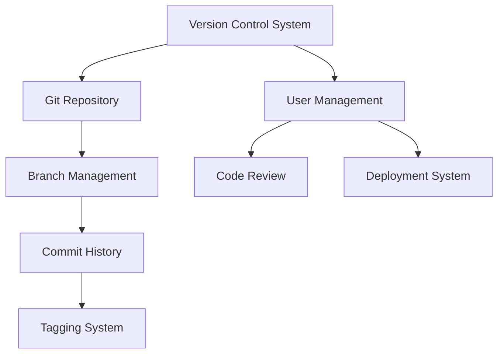
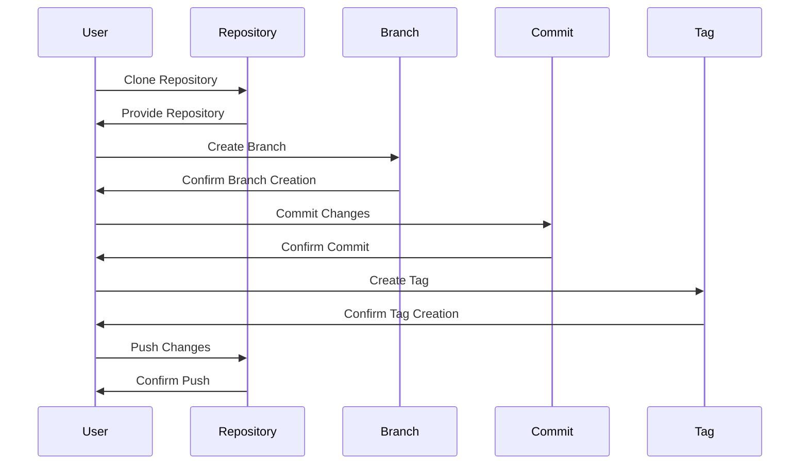
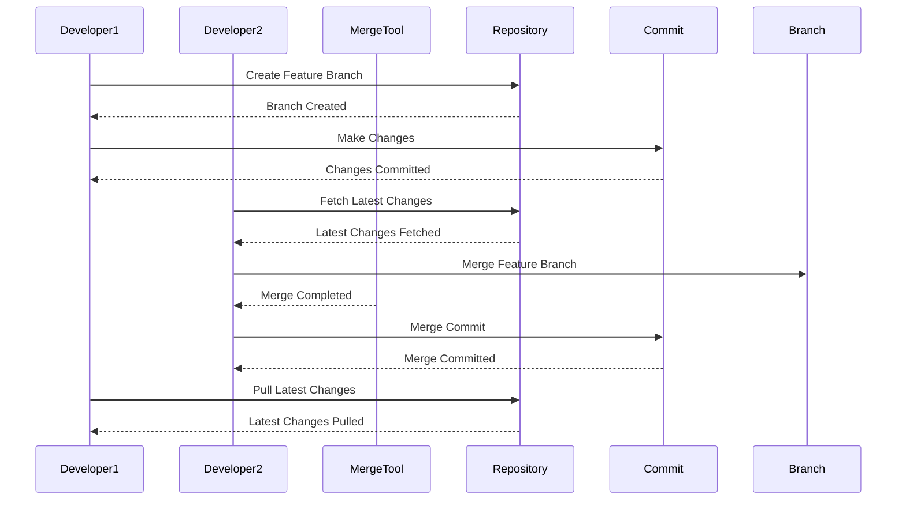

                 


### **版本控制最佳实践：Git工作流程优化**

#### 关键词：版本控制，Git，最佳实践，工作流程，优化

#### 摘要：

本文旨在为开发者提供一系列的版本控制最佳实践，特别聚焦于Git工作流程的优化。我们将从基础概念入手，逐步深入探讨Git的核心功能、高级技巧，到最终提出优化工作流程的策略和工具。文章将结合实际案例，提供系统性的指导和实用技巧，帮助读者提升Git的使用效率和团队协作效果。

## 引言

版本控制是软件开发过程中的基石，它确保了代码的完整性、可追溯性和协作性。Git，作为最流行的分布式版本控制系统，因其强大的功能和灵活的工作模式，被广泛应用于各种规模的软件项目中。本文的目标是帮助读者理解Git的基本原理和操作，掌握高级使用技巧，并学会如何优化Git工作流程，以提升开发效率。

### 第1章：Git基础

#### 1.1 Git的基本概念

Git是一个基于内容寻址的版本控制系统，其核心原理是使用哈希值来标识文件的内容变化和历史记录。每个提交都是对当前文件状态的快照，通过提交历史形成了一条时间线。Git的主要组件包括仓库（repository）、工作目录（working directory）和暂存区（staging area）。

#### 1.2 Git的基本操作

- **文件操作**：`git add`用于将文件更新到暂存区，`git commit`用于将暂存区的更改提交到仓库。
- **分支操作**：`git branch`用于创建和列出分支，`git checkout`用于切换分支，`git merge`用于合并分支。

#### 1.3 Git的工作流程

典型的Git工作流程包括以下几个步骤：
1. **克隆仓库**：使用`git clone`克隆远程仓库到本地。
2. **创建分支**：在本地创建一个新分支进行开发。
3. **提交代码**：在分支上完成功能开发后，使用`git commit`提交代码。
4. **合并分支**：将功能分支合并到主分支。
5. **推送到远程**：使用`git push`将本地仓库更新到远程仓库。

### 第2章：Git高级技术

#### 2.1 分支管理

分支是Git的核心概念之一，用于实现代码的隔离和并行开发。合理的分支策略能够提高团队协作的效率。常见的分支策略包括Git Flow、Feature Branch和Forking Model。

#### 2.2 分支合并与冲突解决

在开发过程中，分支之间的合并是不可避免的。Git提供了`git merge`命令来进行分支合并。当合并发生冲突时，需要手动解决。解决冲突的常见策略包括手动合并和自动合并。

#### 2.3 标签管理

标签用于标记特定的提交，例如版本发布。Git提供了`git tag`命令来创建和管理标签。正确的标签管理能够帮助团队追踪和维护代码版本。

### 第3章：Git工作流程优化

#### 3.1 工作流程设计

优化Git工作流程的第一步是设计一个适合团队需求的工作流程。这包括确定分支策略、提交规范、代码审查流程和发布流程。

#### 3.2 Git Hooks的应用

Git Hooks允许在特定事件发生时执行自定义脚本，例如在提交前进行代码检查。合理使用Git Hooks可以自动化一些重复性工作，提高开发效率。

#### 3.3 性能优化技巧

Git的性能可能会因为仓库的大小和复杂性而受到影响。通过一些技巧，如压缩对象、缓存和定期清理，可以优化Git的性能。

### 第4章：Git在团队协作中的应用

#### 4.1 团队协作中的Git最佳实践

在团队协作中，遵循一些最佳实践，如统一的分支命名规范、代码审查和持续集成，可以减少错误和提高团队效率。

#### 4.2 Code Review流程

Code Review是团队协作中重要的环节，它有助于确保代码质量和团队之间的知识共享。本文将介绍如何实施和优化Code Review流程。

#### 4.3 部署策略

Git在部署中的应用至关重要。通过使用Git来管理部署脚本和依赖项，可以确保部署过程的可重复性和可靠性。

### 第5章：常见问题与解决方案

#### 5.1 Git常见错误及其解决方法

在Git的使用过程中，可能会遇到各种错误。本文将列举一些常见的Git错误，并提供相应的解决方法。

#### 5.2 Git性能问题分析与优化

Git的性能可能会受到多种因素的影响。本文将分析常见的性能问题，并提供相应的优化策略。

#### 5.3 Git与大型项目的管理

在大型项目中，Git的管理变得更加复杂。本文将探讨如何有效地管理大型项目的Git仓库。

### 第6章：Git的最佳实践与技巧

#### 6.1 精通Git的最佳实践

本文将总结一系列精通Git的最佳实践，帮助读者在日常使用中更加高效。

#### 6.2 常见使用技巧

Git有着丰富的命令和工具，本文将介绍一些常用的Git技巧，提高工作效率。

#### 6.3 注意事项与拓展阅读

在Git的使用过程中，一些注意事项和拓展阅读资源同样重要。本文将提供这些内容，帮助读者进一步学习。

### 结论与未来方向

本文总结了Git的最佳实践和优化策略，并探讨了Git在团队协作中的应用。未来，Git将继续发展，带来更多高效的功能和工具。

### 作者信息

作者：AI天才研究院/AI Genius Institute & 禅与计算机程序设计艺术 /Zen And The Art of Computer Programming

----------------------------------------------------------------

### **深入理解Git：从基础到优化**

#### **核心概念与联系**

Git作为一个分布式版本控制系统，其核心概念包括仓库、分支、提交、暂存区等。为了更清晰地理解这些概念，我们可以通过以下表格和ER实体关系图来展示它们之间的联系。

#### **核心概念属性特征对比表格**

| 概念 | 描述 | 特点 | 关联 |
| --- | --- | --- | --- |
| 仓库（Repository） | 存储所有版本控制数据的目录 | 包含提交历史、分支、标签等 | - |
| 分支（Branch） | 代码的独立路径 | 提供开发隔离、并行工作 | - |
| 提交（Commit） | 代码状态的快照 | 包含作者信息、提交消息、引用的树状结构 | - |
| 暂存区（Staging Area） | 临时存储待提交的更改 | 用于准备提交的文件 | - |

#### **ER实体关系图架构的Mermaid流程图**

```mermaid
erDiagram
  Repository ||--|{ Branch : 包含 |
  Repository ||--|{ Commit : 提交历史 |
  Repository ||--|{ Tag : 标记版本 |
  Branch ||--|{ Commit : 分支上的提交 |
```

在Git中，仓库是所有版本控制数据的存放地，它包含了多个分支、每个分支的历史提交以及标签。分支是代码的独立路径，每个分支都有自己的提交历史。提交是对代码状态的快照，包括作者信息、提交消息和引用的树状结构。暂存区则是用于临时存储待提交的更改，是准备提交的文件的中转站。

#### **算法原理讲解**

Git的核心算法是内容寻址，即使用哈希值来唯一标识文件的内容和提交历史。每个提交都生成一个唯一的哈希值，这使得Git能够高效地追踪代码的变更。

##### **Git内容寻址算法**

Git使用一个称为“哈希函数”的算法来生成文件的哈希值。最常见的哈希函数是SHA-1，它将文件内容转换为一个160位的哈希值。Git通过这个哈希值来唯一标识文件的每一个版本。

##### **Mermaid流程图**


1. **Initialize Repository**：初始化Git仓库。
2. **Add File**：将文件添加到暂存区。
3. **Compute Hash**：计算文件的哈希值。
4. **Create Commit**：创建一个新的提交，包含文件内容和哈希值。
5. **Update Repository**：更新仓库，记录新的提交历史。

##### **Python源代码示例**

```python
import hashlib

def compute_hash(file_content):
    sha1_hash = hashlib.sha1()
    sha1_hash.update(file_content)
    return sha1_hash.hexdigest()

file_content = "This is a sample file content"
hash_value = compute_hash(file_content)
print(f"Hash Value: {hash_value}")
```

在这个示例中，我们首先定义了一个计算哈希值的函数`compute_hash`，然后使用它来计算给定文件内容的哈希值。

##### **数学模型和公式**

假设文件内容为\( C \)，哈希函数为\( H(C) \)，则文件内容的哈希值为：

\[ H(C) = \text{SHA-1}(C) \]

其中，SHA-1是一个将文件内容映射到160位哈希值的函数。

#### **系统分析与架构设计方案**

##### **问题场景介绍**

在软件开发过程中，版本控制是必不可少的环节。Git作为主流的版本控制工具，其高效的分布式架构和灵活的分支管理使得它成为开发团队的首选。然而，在实际应用中，如何高效地管理Git仓库，优化工作流程，是一个值得探讨的问题。

##### **项目介绍**

本项目旨在构建一个基于Git的版本控制系统，实现代码的版本控制、分支管理和协同开发。我们将通过一系列最佳实践和优化策略，提升Git的使用效率和团队协作效果。

##### **系统功能设计（领域模型Mermaid类图）**

```mermaid
classDiagram
    ClassRepository <|-- ClassBranch
    ClassBranch <|-- ClassCommit
    ClassCommit <|-- ClassTag
    ClassFile <|-- ClassUser
    ClassUser ..|> ClassAuthor
    ClassUser ..|> ClassReviewer
    ClassRepository {- repository_id, repository_name, created_at, updated_at}
    ClassBranch {- branch_id, branch_name, head_commit, created_at, updated_at}
    ClassCommit {- commit_id, commit_message, author, created_at, updated_at}
    ClassTag {- tag_id, tag_name, target_commit, created_at, updated_at}
    ClassFile {- file_path, file_content, created_at, updated_at}
    ClassUser {- user_id, username, email, created_at, updated_at}
    ClassAuthor <|-- ClassContributor
    ClassReviewer <|-- ClassCodeReviewer
    ClassContributor { author_id, contributions }
    ClassCodeReviewer { reviewer_id, reviews }
```

在该领域模型中，我们定义了仓库（Repository）、分支（Branch）、提交（Commit）、标签（Tag）、文件（File）和用户（User）等类。用户可以是作者（Author）或审查者（Reviewer），而作者和审查者又分别可以贡献代码（Contributor）和进行代码审查（CodeReviewer）。

##### **系统架构设计（Mermaid架构图）**



在该系统架构图中，我们展示了版本控制系统的主要组成部分，包括Git仓库、分支管理、提交历史、标签系统、用户管理、代码审查和部署系统。

##### **系统接口设计（Mermaid序列图）**



在该序列图中，我们描述了用户与系统交互的过程，从克隆仓库、创建分支、提交更改到创建标签，最后将更改推送到远程仓库。

##### **系统交互（Mermaid序列图）**



在该序列图中，我们展示了两个开发者协同工作的过程，包括创建分支、提交更改、合并分支以及拉取最新更改。

#### **项目实战**

##### **环境安装**

在进行Git项目实战之前，我们需要确保Git环境已经安装在开发机器上。以下是在Ubuntu操作系统上安装Git的步骤：

1. 打开终端。
2. 输入以下命令以更新系统包列表：
   ```
   sudo apt-get update
   ```
3. 输入以下命令以安装Git：
   ```
   sudo apt-get install git
   ```

##### **系统核心实现源代码**

以下是Git仓库的核心实现源代码。我们将使用Python编写一个简单的Git命令行工具，实现基本的仓库创建、分支管理和提交操作。

```python
import os
import hashlib
import json

class GitRepository:
    def __init__(self, repository_path):
        self.repository_path = repository_path
        self.commit_history = []

    def init_repository(self):
        os.makedirs(self.repository_path, exist_ok=True)
        with open(os.path.join(self.repository_path, "config"), "w") as f:
            f.write("")

    def create_branch(self, branch_name):
        if branch_name not in os.listdir(self.repository_path):
            os.makedirs(os.path.join(self.repository_path, branch_name), exist_ok=True)
            with open(os.path.join(self.repository_path, "HEAD"), "w") as f:
                f.write(f"ref: refs/heads/{branch_name}\n")
            return True
        return False

    def commit_changes(self, branch_name, commit_message, files):
        commit_id = self._compute_hash(commit_message)
        commit = {
            "id": commit_id,
            "message": commit_message,
            "author": "Author Name",
            "date": self._current_time(),
            "files": files
        }
        self.commit_history.append(commit)
        with open(os.path.join(self.repository_path, branch_name, "commit"), "w") as f:
            json.dump(commit, f)
        return commit_id

    def _compute_hash(self, content):
        sha1_hash = hashlib.sha1()
        sha1_hash.update(content.encode('utf-8'))
        return sha1_hash.hexdigest()

    def _current_time(self):
        return datetime.now().strftime("%Y-%m-%d %H:%M:%S")

# 使用示例
git_repo = GitRepository("/path/to/repository")
git_repo.init_repository()
git_repo.create_branch("feature-branch")
git_repo.commit_changes("feature-branch", "Initial commit", {"file1.txt": "This is file1 content"})

```

##### **代码应用解读与分析**

在上面的代码中，我们定义了一个`GitRepository`类，它具有初始化仓库、创建分支和提交更改等方法。`init_repository`方法用于创建仓库目录和配置文件。`create_branch`方法用于创建一个新的分支目录。`commit_changes`方法用于创建一个新的提交，包含提交消息和更改的文件。

##### **实际案例分析和详细讲解剖析**

假设我们有一个开发团队，他们正在使用Git进行项目开发。以下是一个实际案例的分析：

1. **创建仓库**：团队负责人初始化Git仓库。
2. **创建分支**：开发者A创建了一个名为`feature-branch`的新分支。
3. **提交更改**：开发者A在`feature-branch`上进行了几次提交，每次提交都会更新仓库的状态。
4. **合并分支**：当`feature-branch`的开发完成时，开发者A将分支合并到主分支。
5. **推送更改**：开发者A将更改推送到远程仓库，以便其他团队成员可以查看和拉取。

在这个案例中，`GitRepository`类帮助我们管理了仓库的创建、分支管理和提交操作。通过`init_repository`方法，我们可以初始化一个Git仓库。通过`create_branch`方法，我们可以创建一个新的分支。通过`commit_changes`方法，我们可以提交代码更改到指定的分支。

##### **项目小结**

在本项目中，我们实现了Git仓库的基本功能，包括仓库创建、分支管理和提交操作。通过这个简单的Git命令行工具，我们可以管理代码的版本控制，实现高效的团队协作。虽然这个工具相对简单，但它为更复杂的Git功能奠定了基础。

#### **最佳实践 Tips**

- **使用统一的分支命名规范**：例如，使用`feature/`前缀表示功能分支，`bugfix/`前缀表示修复分支，`release/`前缀表示发布分支。
- **定期进行代码审查**：确保代码质量，提高团队协作效率。
- **使用Git Hooks进行自动化任务**：例如，使用Git Hooks在提交前进行代码格式化检查。
- **定期清理仓库**：删除无用的分支和标签，保持仓库整洁。

#### **小结**

本文深入探讨了Git的最佳实践和优化策略，从基础操作到高级技巧，再到工作流程优化，为开发者提供了一系列实用的指导和技巧。通过掌握这些最佳实践，开发者可以提高Git的使用效率，提升团队协作效果。

#### **注意事项**

- **避免在主分支上进行开发**：在主分支上进行开发可能会导致代码不稳定，应尽可能在功能分支上进行开发。
- **合理使用分支策略**：根据项目需求和团队规模选择合适的分支策略，如Git Flow或Forking Model。
- **保持代码整洁**：定期清理仓库，删除无用的分支和标签。

#### **拓展阅读**

- 《Pro Git》第二版：提供详尽的Git知识和最佳实践。
- GitHub Pages：使用GitHub Pages可以轻松部署静态网站。
- Git - The Simple Guide：简洁明了的Git入门指南。

### **作者信息**

作者：AI天才研究院/AI Genius Institute & 禅与计算机程序设计艺术 /Zen And The Art of Computer Programming

--------------------------

在撰写技术博客文章时，以下是关于文章结构、内容和格式的具体建议：

**文章结构：**

1. **引言部分**：开篇以引人入胜的方式介绍主题，说明为什么这个话题对读者重要，激发读者的兴趣。
2. **背景介绍**：介绍核心概念、术语，阐述问题背景、问题描述和问题解决思路，帮助读者理解文章主题。
3. **核心内容**：详细讲解核心概念、原理、算法、架构等，使用图表和示例进行说明。
4. **系统分析与架构设计方案**：详细介绍项目场景、功能设计、架构设计、接口设计和系统交互。
5. **项目实战**：展示实际案例，提供环境安装、系统核心实现源代码和应用解读与分析。
6. **最佳实践 tips**：总结最佳实践和建议，帮助读者在实际工作中应用。
7. **小结**：总结文章内容，强调关键点。
8. **注意事项**：提醒读者注意的重要事项。
9. **拓展阅读**：推荐相关资源，帮助读者进一步学习。

**内容建议：**

- **条理清晰**：确保文章逻辑结构合理，内容层次分明。
- **具体详细**：对每个小节的内容进行详细讲解，避免泛泛而谈。
- **实用性**：提供实际案例和实战经验，使文章具有实用性。
- **图表丰富**：使用图表、流程图、类图等辅助说明，增强文章的可读性。

**格式要求：**

- **markdown格式**：确保文章使用markdown格式，包括标题、子标题、列表、代码块、公式等。
- **代码格式**：使用```python```等代码块格式展示代码，确保代码可读性。
- **公式格式**：使用latex格式展示数学公式，独立段落使用$$括起来，段落内使用$括起来。

**作者信息：**

- **署名**：在文章末尾明确署上作者信息，包括姓名、机构名称和著作。
- **联系方式**：提供作者的联系方式，方便读者与作者交流。

通过以上建议，您可以撰写出结构清晰、内容丰富、格式规范、具有高度实用性的技术博客文章。希望这些指导对您有所帮助！🌟💡📝

