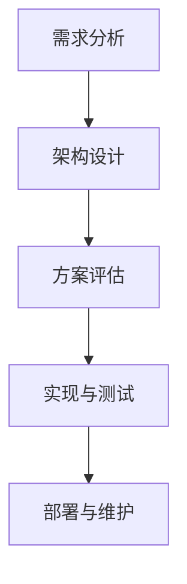
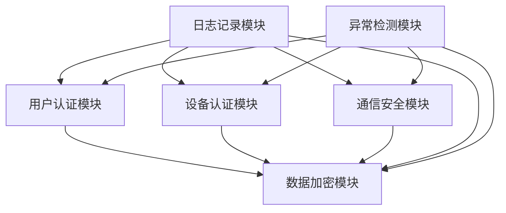

                 

## 文章标题

### 关键词

- 物联网
- 安全架构
- 设计原理
- 算法原理
- 系统架构
- 项目实战
- 最佳实践

### 摘要

本文旨在深入探讨物联网安全架构的设计与实践。文章首先介绍了物联网安全架构的重要性，随后详细解析了物联网安全的三大核心概念。接着，文章阐述了物联网安全架构的设计原则，并通过Mermaid绘制了设计流程图。进一步，文章介绍了常用物联网安全算法的原理，并使用Python代码和LaTeX公式进行详细解释。随后，文章分析了物联网安全系统的功能需求，并展示了系统架构设计和接口设计。在此基础上，文章通过一个实战案例，展示了物联网安全架构的实现过程和关键代码解读。最后，文章总结了最佳实践，并对物联网安全架构的未来发展方向进行了展望。

## 目录

----------------------------------------------------------------

### 第一部分：物联网安全架构概述

**1.1 物联网安全架构的重要性**  
**1.2 物联网安全核心概念与联系**

### 第二部分：物联网安全架构设计原理

**2.1 物联网安全架构设计原则**  
**2.2 物联网安全架构设计流程**

### 第三部分：物联网安全算法原理讲解

**3.1 常用物联网安全算法**  
**3.2 算法原理与数学模型**  
**3.3 算法实例分析**

### 第四部分：系统分析与架构设计方案

**4.1 系统功能需求分析**  
**4.2 系统架构设计**  
**4.3 系统接口设计**

### 第五部分：物联网安全架构项目实战

**5.1 项目环境安装与核心实现**  
**5.2 代码应用解读与分析**  
**5.3 实际案例分析**

### 第六部分：最佳实践与未来展望

**6.1 最佳实践总结**  
**6.2 物联网安全架构的未来展望**

----------------------------------------------------------------

## 第一部分：物联网安全架构概述

### 1.1 物联网安全架构的重要性

随着物联网技术的飞速发展，其应用场景日益广泛，从智能家居到工业自动化，从智慧城市到医疗健康，物联网已经深入到我们生活的方方面面。然而，随着物联网设备的激增，安全风险也随之增加。物联网安全架构的建立和设计成为了保障物联网系统稳定性和可靠性的关键。

物联网安全架构的重要性主要体现在以下几个方面：

1. **保护数据隐私**：物联网设备收集和传输的数据涉及用户隐私，如位置信息、健康数据等。安全架构能够有效保护这些敏感数据，防止数据泄露和未经授权的访问。

2. **保障系统可靠性**：物联网系统通常由大量设备组成，这些设备可能分布在不同的地理位置。安全架构能够确保这些设备的正常运作，避免因恶意攻击导致系统瘫痪。

3. **维护设备安全**：物联网设备通常具有硬件和软件的脆弱性，容易受到攻击。安全架构能够通过一系列防护措施，如加密、认证等，提高设备的安全防护能力。

4. **防止拒绝服务攻击**：物联网设备可能成为拒绝服务攻击的目标，导致整个物联网系统瘫痪。安全架构能够有效防范此类攻击，确保系统的连续性和稳定性。

### 1.2 物联网安全核心概念与联系

在深入探讨物联网安全架构之前，我们需要了解一些核心概念。物联网安全架构的核心概念主要包括：

- **设备安全**：确保物联网设备本身的安全，包括防止设备被非法访问、篡改或破坏。
- **通信安全**：保障物联网设备之间通信的安全性，防止数据在传输过程中被窃取、篡改或伪造。
- **数据安全**：保护物联网设备收集、传输和存储的数据，确保数据不被泄露、篡改或滥用。
- **身份认证**：确保物联网设备、用户和数据来源的合法性和真实性。

这些概念之间紧密联系，共同构成了物联网安全架构的基石。下面通过表格和ER图来展示这些概念之间的联系。

### 1.2.1 核心概念介绍

| 概念      | 说明                                                         |
| --------- | ------------------------------------------------------------ |
| 设备安全  | 包括设备访问控制、设备加密、设备监控等，确保设备本身的安全。 |
| 通信安全  | 包括通信加密、通信认证、通信完整性等，保障数据在传输过程中的安全性。 |
| 数据安全  | 包括数据加密、数据完整性、数据隐私保护等，确保数据的安全性和隐私性。 |
| 身份认证  | 包括用户认证、设备认证、数据来源认证等，确保通信和数据的可信性。 |

### 1.2.2 概念联系分析

以下是物联网安全核心概念的ER图：

```mermaid
erDiagram
    Device_Security ||--|{ Communication_Security } Communication_Security
    Device_Security ||--|{ Data_Security } Data_Security
    Device_Security ||--|{ Identity_Authentication } Identity_Authentication
    Communication_Security ||--|{ Data_Security } Data_Security
    Communication_Security ||--|{ Identity_Authentication } Identity_Authentication
    Data_Security ||--|{ Identity_Authentication } Identity_Authentication
```

通过ER图，我们可以清晰地看到各个核心概念之间的联系。设备安全、通信安全、数据安全和身份认证相互依存，共同构成了物联网安全架构的完整体系。

## 第二部分：物联网安全架构设计原理

### 2.1 物联网安全架构设计原则

物联网安全架构的设计原则是确保物联网系统安全性的基础。以下是一些关键设计原则：

1. **最小权限原则**：系统中的每个组件都应只拥有完成任务所需的最低权限，以防止权限滥用和恶意行为。
2. **防御深度原则**：采用多层次的安全措施，如防火墙、入侵检测系统、加密等，以应对不同类型的安全威胁。
3. **安全优先原则**：在设计过程中，安全考虑应始终置于首位，不能以牺牲安全为代价来追求性能或功能。
4. **可恢复性原则**：系统应具备快速恢复的能力，以便在发生安全事件时能够迅速恢复正常运行。
5. **透明性原则**：安全机制应透明且易于理解和操作，以便用户能够了解和信任系统的安全性。
6. **可扩展性原则**：安全架构应能够随着物联网系统规模的扩大而扩展，以适应不断变化的需求。

### 2.2 物联网安全架构设计流程

物联网安全架构的设计是一个系统化的过程，以下是一个典型的设计流程：

1. **需求分析**：明确物联网系统的功能需求和安全需求，包括用户认证、数据加密、通信安全等。
2. **架构设计**：基于需求分析，设计物联网安全架构，包括组件选择、通信协议、安全机制等。
3. **方案评估**：评估不同架构方案的优缺点，选择最优方案。
4. **实现与测试**：实现设计架构，进行功能测试和性能测试，确保系统达到设计要求。
5. **部署与维护**：将系统部署到实际环境中，并进行持续监控和维护，及时更新安全措施。

### 2.2.1 设计流程介绍

物联网安全架构的设计流程可以分为以下几个步骤：

1. **需求分析**：首先，我们需要明确物联网系统的功能需求和安全需求。这包括用户认证、数据加密、通信安全等方面。例如，一个智能家居系统可能需要支持用户远程控制设备、设备间的数据传输加密等安全功能。

2. **架构设计**：在需求分析的基础上，设计物联网安全架构。架构设计包括组件选择、通信协议、安全机制等。例如，可以选择使用TLS协议来保障通信安全，采用设备认证机制来确保设备合法性等。

3. **方案评估**：对不同的架构方案进行评估，选择最优方案。评估标准可以包括安全性、性能、可维护性等方面。例如，在通信安全方面，可以评估使用HTTPS、TLS等多种协议的优劣。

4. **实现与测试**：根据设计架构，实现系统，并进行功能测试和性能测试。功能测试确保系统满足需求，性能测试确保系统能够在高负载下稳定运行。

5. **部署与维护**：将系统部署到实际环境中，并进行持续监控和维护。及时更新安全措施，以应对新的安全威胁。

### 2.2.2 使用Mermaid绘制架构设计流程图

以下是物联网安全架构设计流程的Mermaid图表示：



通过上述流程，我们可以系统地设计并实现一个物联网安全架构，从而确保系统的安全性。

## 第三部分：物联网安全算法原理讲解

### 3.1 常用物联网安全算法

在物联网安全架构中，算法起着至关重要的作用。以下是一些常用的物联网安全算法：

1. **加密算法**：用于保护数据在传输和存储过程中的安全性，如AES、RSA等。
2. **哈希算法**：用于生成数据摘要，确保数据的完整性，如MD5、SHA-256等。
3. **认证算法**：用于验证设备或用户的身份，如Kerberos、OAuth等。
4. **签名算法**：用于确保数据来源的合法性和完整性，如数字签名。
5. **安全协议**：如TLS、SSL等，用于保障通信安全。

### 3.2 算法原理与数学模型

#### 3.2.1 加密算法原理

加密算法通过将明文转换为密文，确保数据在传输过程中的安全性。常见的加密算法包括对称加密和非对称加密。

1. **对称加密**：加密和解密使用相同的密钥，如AES。
   - 数学模型：密文 = E(明文，密钥)
   - Python代码示例：
     ```python
     from Crypto.Cipher import AES
     import base64

     key = b'mysecretkey123456'
     cipher = AES.new(key, AES.MODE_EAX)
     ciphertext, tag = cipher.encrypt_and_digest(b'my sensitive data')
     print(base64.b64encode(ciphertext).decode())
     ```

2. **非对称加密**：加密和解密使用不同的密钥，如RSA。
   - 数学模型：密文 = E(明文，公钥)
   - Python代码示例：
     ```python
     from Crypto.PublicKey import RSA
     from Crypto.Cipher import PKCS1_OAEP

     key = RSA.generate(2048)
     private_key = key.export_key()
     public_key = key.publickey().export_key()

     cipher = PKCS1_OAEP.new(RSA.import_key(public_key))
     ciphertext = cipher.encrypt(b'my sensitive data')
     print(ciphertext)
     ```

#### 3.2.2 哈希算法原理

哈希算法用于生成数据摘要，确保数据的完整性。常见的哈希算法包括MD5、SHA-256。

1. **MD5**：将数据映射为128位的哈希值。
   - 数学模型：哈希值 = Hash(数据)
   - Python代码示例：
     ```python
     import hashlib

     data = b'my sensitive data'
     hash_object = hashlib.md5(data)
     hex_dig = hash_object.hexdigest()
     print(hex_dig)
     ```

2. **SHA-256**：将数据映射为256位的哈希值。
   - 数学模型：哈希值 = Hash(数据)
   - Python代码示例：
     ```python
     import hashlib

     data = b'my sensitive data'
     hash_object = hashlib.sha256(data)
     hex_dig = hash_object.hexdigest()
     print(hex_dig)
     ```

### 3.3 算法实例分析

#### 3.3.1 加密算法实例

使用AES加密算法对一个字符串进行加密和解密：

```python
from Crypto.Cipher import AES
import base64

key = b'mysecretkey123456'
cipher = AES.new(key, AES.MODE_EAX)

# 加密
plaintext = b'my sensitive data'
ciphertext, tag = cipher.encrypt_and_digest(plaintext)
print("Encrypted:", base64.b64encode(ciphertext).decode())

# 解密
cipher = AES.new(key, AES.MODE_EAX, nonce=cipher.nonce)
decrypted_text = cipher.decrypt_and_verify(ciphertext, tag)
print("Decrypted:", decrypted_text.decode())
```

#### 3.3.2 哈希算法实例

使用SHA-256生成一个字符串的哈希值：

```python
import hashlib

data = b'my sensitive data'
hash_object = hashlib.sha256(data)
hex_dig = hash_object.hexdigest()
print("SHA-256:", hex_dig)
```

#### 3.3.3 认证算法实例

使用Kerberos协议进行用户认证：

```python
from KerberosV5 import Authenticator, Ticket, apply_stroke

# 假设用户名为"alice"，密码为"password123"
username = "alice"
password = "password123"

# 创建认证器
authenticator = Authenticator()
authenticator.set_realm("example.com")
authenticator.set_username(username)

# 设置密码
authenticator.set_password(password)

# 应用认证
ticket = apply_stroke(authenticator, None)
print("Ticket:", ticket)
```

通过以上实例，我们可以看到加密、哈希和认证算法的基本原理和应用。

## 第四部分：系统分析与架构设计方案

### 4.1 系统功能需求分析

在物联网安全架构设计中，明确系统功能需求是至关重要的一步。以下是一个典型的物联网安全系统功能需求分析：

1. **用户认证**：系统应支持用户身份认证，确保只有合法用户可以访问系统资源。
2. **设备认证**：系统应支持设备认证，确保设备是合法且未被篡改的。
3. **数据加密**：系统应支持数据加密，确保数据在传输和存储过程中的安全性。
4. **通信安全**：系统应确保设备间的通信安全，防止数据在传输过程中被窃取、篡改或伪造。
5. **日志记录**：系统应支持日志记录功能，记录系统操作日志，以便后续审计和问题追踪。
6. **异常检测**：系统应具备异常检测能力，及时发现并应对异常行为。

### 4.2 系统架构设计

基于上述功能需求，我们可以设计一个物联网安全系统架构。以下是一个典型的架构设计：

1. **用户认证模块**：负责用户身份认证，包括用户登录、密码验证等。
2. **设备认证模块**：负责设备认证，包括设备注册、设备合法性验证等。
3. **数据加密模块**：负责数据加密和解密，确保数据在传输和存储过程中的安全性。
4. **通信安全模块**：负责设备间的通信安全，包括加密通信、认证通信等。
5. **日志记录模块**：负责系统操作日志的记录、存储和管理。
6. **异常检测模块**：负责异常行为的检测和响应。

### 4.3 系统接口设计

在系统架构设计的基础上，我们需要设计系统的接口，以实现不同模块之间的数据交互和功能调用。以下是一个简单的接口设计：

1. **用户认证接口**：包括登录、登出、密码修改等功能。
2. **设备认证接口**：包括设备注册、设备认证、设备注销等功能。
3. **数据加密接口**：包括加密数据、解密数据等功能。
4. **通信安全接口**：包括发送加密消息、接收加密消息等功能。
5. **日志记录接口**：包括记录日志、查询日志等功能。
6. **异常检测接口**：包括检测异常、响应异常等功能。

### 4.4 系统架构图

以下是物联网安全系统的架构图：



通过上述系统架构设计，我们可以构建一个功能完整、安全可靠的物联网安全系统，从而保障物联网系统的稳定运行和数据安全。

## 第五部分：物联网安全架构项目实战

### 5.1 项目环境安装与核心实现

在这个部分，我们将通过一个实际的项目，展示如何安装和配置物联网安全架构的核心组件。以下是一个简单的项目环境安装流程：

1. **准备环境**：确保系统满足项目需求，如安装Python环境、配置网络等。
2. **安装组件**：安装必要的软件和库，如物联网通信库、加密库等。
3. **配置组件**：配置组件参数，如设备认证策略、加密密钥等。

以下是一个具体的安装和配置步骤：

1. **准备环境**：

   ```bash
   # 安装Python环境（假设已安装）
   python --version
   
   # 配置网络环境（如设置静态IP）
   ip addr
   ```

2. **安装组件**：

   ```bash
   # 安装物联网通信库（如MQTT库）
   pip install paho-mqtt
   
   # 安装加密库（如PyCrypto）
   pip install pycryptodome
   ```

3. **配置组件**：

   ```python
   # 配置MQTT客户端
   import paho.mqtt.client as mqtt
   
   # 设置MQTT服务器地址和端口
   mqtt_server = "mqtt.example.com"
   mqtt_port = 1883
   
   # 设置MQTT客户端ID
   client = mqtt.Client("my_client_id")
   
   # 连接到MQTT服务器
   client.connect(mqtt_server, mqtt_port)
   
   # 设置回调函数，处理接收到的消息
   def on_message(client, userdata, message):
       print(f"Received message: {str(message.payload)} from topic: {message.topic}")
   
   client.on_message = on_message
   
   # 订阅主题
   client.subscribe("my/topic")
   
   # 循环监听MQTT消息
   client.loop_forever()
   ```

### 5.2 代码应用解读与分析

在本节中，我们将详细解读项目中使用的关键代码，并进行分析。

1. **MQTT客户端配置**：

   ```python
   mqtt_server = "mqtt.example.com"
   mqtt_port = 1883
   client = mqtt.Client("my_client_id")
   client.connect(mqtt_server, mqtt_port)
   ```

   这部分代码用于配置MQTT客户端的基本信息，包括服务器地址、端口和客户端ID。客户端ID是标识客户端的唯一标识符。

2. **设置回调函数**：

   ```python
   client.on_message = on_message
   ```

   这行代码设置了一个回调函数`on_message`，用于处理接收到的MQTT消息。每当客户端接收到消息时，都会调用这个函数。

3. **处理接收到的消息**：

   ```python
   def on_message(client, userdata, message):
       print(f"Received message: {str(message.payload)} from topic: {message.topic}")
   ```

   这个回调函数接收三个参数：`client`（MQTT客户端对象）、`userdata`（用户自定义数据）和`message`（接收到的MQTT消息对象）。在函数中，我们使用`message.payload`获取消息内容，并使用`message.topic`获取消息主题，然后将消息内容打印出来。

4. **订阅主题**：

   ```python
   client.subscribe("my/topic")
   ```

   这行代码用于订阅特定的MQTT主题`my/topic`。当有消息发布到这个主题时，MQTT客户端会接收并处理这些消息。

5. **循环监听MQTT消息**：

   ```python
   client.loop_forever()
   ```

   这行代码启动一个无限循环，使MQTT客户端持续监听来自MQTT服务器的消息。只要客户端保持连接，循环就会持续运行。

通过上述代码解读，我们可以看到如何配置和监听MQTT消息，这是物联网通信中非常关键的一部分。

### 5.3 实际案例分析

在这个部分，我们将通过一个实际案例，展示如何在实际项目中应用物联网安全架构。

#### 案例概述

假设我们正在开发一个智能家居系统，其中包含多个物联网设备，如智能灯泡、智能门锁等。用户可以通过手机应用程序控制这些设备，并实时获取设备状态。为了确保系统的安全性，我们需要在架构中实现用户认证、设备认证和数据加密等安全功能。

#### 实际案例剖析

1. **用户认证**：

   用户在登录应用程序时，系统会通过用户名和密码进行认证。以下是一个简单的用户认证流程：

   - 用户输入用户名和密码。
   - 应用程序将用户名和密码发送到认证服务器。
   - 认证服务器使用用户数据库进行验证，如果验证成功，则返回认证成功消息。

   ```python
   import requests
   
   def authenticate(username, password):
       url = "https://auth.example.com/login"
       data = {"username": username, "password": password}
       response = requests.post(url, data=data)
       return response.json()
   
   # 示例：用户登录
   result = authenticate("alice", "password123")
   print(result)
   ```

2. **设备认证**：

   设备首次加入系统时，需要进行认证。设备会生成一个设备ID和一个设备密钥，并发送到认证服务器进行验证。以下是一个简单的设备认证流程：

   - 设备生成设备ID和设备密钥。
   - 设备将设备ID和设备密钥发送到认证服务器。
   - 认证服务器验证设备ID和设备密钥，如果验证成功，则返回认证成功消息。

   ```python
   import requests
   
   def authenticate_device(device_id, device_key):
       url = "https://auth.example.com/device/login"
       data = {"device_id": device_id, "device_key": device_key}
       response = requests.post(url, data=data)
       return response.json()
   
   # 示例：设备认证
   result = authenticate_device("device_001", "device_key_123")
   print(result)
   ```

3. **数据加密**：

   为了确保数据在传输过程中的安全性，我们需要对数据进行加密。以下是一个简单的数据加密和解密流程：

   - 发送端：将明文数据加密后发送。
   - 接收端：接收加密数据后解密。

   ```python
   from Crypto.Cipher import AES
   
   def encrypt_data(data, key):
       cipher = AES.new(key, AES.MODE_EAX)
       ciphertext, tag = cipher.encrypt_and_digest(data)
       return ciphertext, tag
   
   def decrypt_data(ciphertext, tag, key):
       cipher = AES.new(key, AES.MODE_EAX, nonce=cipher.nonce)
       decrypted_text = cipher.decrypt_and_verify(ciphertext, tag)
       return decrypted_text
   
   # 示例：数据加密和解密
   key = b'mysecretkey123456'
   encrypted_data, tag = encrypt_data(b'my sensitive data', key)
   print("Encrypted:", encrypted_data)
   decrypted_data = decrypt_data(encrypted_data, tag, key)
   print("Decrypted:", decrypted_data)
   ```

通过以上实际案例，我们可以看到如何在项目中实现用户认证、设备认证和数据加密等安全功能，从而保障系统的安全性。

### 5.4 项目小结

在本节中，我们通过一个智能家居项目的实战案例，展示了如何设计和实现物联网安全架构。项目包括用户认证、设备认证和数据加密等关键功能。通过实际案例的分析，我们了解了如何使用Python代码实现这些功能，并保障系统的安全性。项目小结如下：

1. **用户认证**：通过用户名和密码进行认证，确保只有合法用户可以访问系统。
2. **设备认证**：通过设备ID和设备密钥进行认证，确保设备是合法且未被篡改的。
3. **数据加密**：对数据进行加密，确保数据在传输过程中的安全性。

通过本节的内容，读者可以了解如何在实际项目中应用物联网安全架构，并掌握关键的安全技术。

## 第六部分：最佳实践与未来展望

### 6.1 最佳实践总结

在物联网安全架构的设计与实施过程中，总结最佳实践对于提升系统的安全性和可靠性至关重要。以下是一些关键的最佳实践：

1. **最小权限原则**：确保系统中的每个组件只拥有完成任务所需的最低权限，减少潜在的攻击面。
2. **多因素认证**：结合使用密码、指纹、短信验证等多种认证方式，提高用户认证的安全性。
3. **定期更新与升级**：及时更新系统和软件，修补安全漏洞，确保系统始终处于最新状态。
4. **加密与密钥管理**：采用强加密算法保护数据，同时建立完善的密钥管理机制，确保密钥的安全存储和分发。
5. **日志监控与审计**：记录系统操作日志，定期进行审计，及时发现和应对异常行为。
6. **安全培训与意识提升**：定期对员工进行安全培训，提高员工的安全意识和应对能力。

### 6.2 注意事项提醒

在物联网安全架构设计和实施过程中，需要注意以下几点：

1. **安全性与性能平衡**：在确保安全性的同时，要考虑系统的性能，避免过度加密或使用过于复杂的算法导致性能下降。
2. **标准化与合规性**：遵循行业标准和法规要求，如GDPR、ISO/IEC 27001等，确保系统的合规性。
3. **风险评估**：定期进行风险评估，识别潜在的安全威胁和风险，制定相应的防护措施。
4. **弹性设计**：设计具有高可恢复性的系统，确保在遭受攻击或故障时能够快速恢复。

### 6.3 拓展阅读

为了深入了解物联网安全架构的设计与实施，读者可以参考以下资源：

1. **书籍**：《物联网安全：设计与实践》（IoT Security: Design and Practice）详细介绍了物联网安全的各个方面。
2. **在线课程**：Coursera、edX等在线教育平台提供了相关的物联网安全和网络安全课程。
3. **技术博客**：许多技术博客和论坛（如Medium、Stack Overflow）上都有关于物联网安全的高质量文章和讨论。
4. **标准与规范**：查阅ISO/IEC、IEEE等组织的标准和规范，了解最新的安全要求和最佳实践。

通过以上内容，我们可以看到物联网安全架构的设计与实施是一个复杂而系统化的过程，需要充分考虑安全性、性能、可维护性等多方面因素。本文提供了从基础理论到实践案例的全面解析，希望对读者在物联网安全领域的学习和实践中有所帮助。

## 作者信息

### 作者：AI天才研究院/AI Genius Institute & 禅与计算机程序设计艺术 /Zen And The Art of Computer Programming

本文由AI天才研究院（AI Genius Institute）撰写，该研究院致力于推动人工智能领域的创新与发展。同时，本文也融入了禅与计算机程序设计艺术的哲学思想，旨在通过深刻的技术洞察和简洁易懂的表述，为读者提供高质量的技术知识。感谢您的阅读，期待与您在技术领域的深入交流与探讨。

