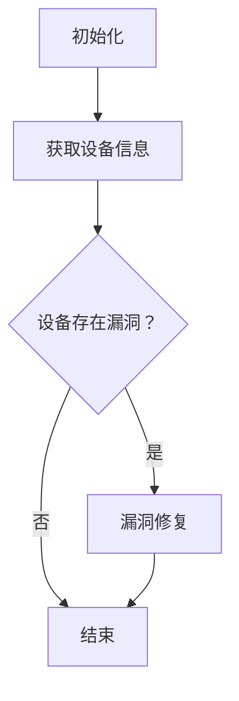
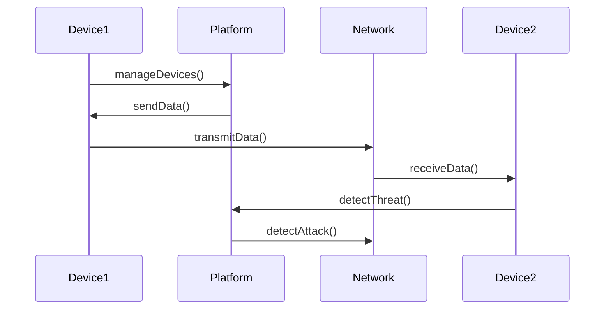

                 

## 物联网安全：保护互联设备的策略

### 关键词：物联网安全，设备保护，网络安全策略

> 摘要：本文从物联网安全的重要性入手，详细探讨了物联网设备面临的安全威胁，分析了安全防护的关键策略，并通过具体算法和架构设计案例，提出了有效的保护措施，旨在为物联网设备的安全管理提供参考。

### Step 1: 背景介绍

#### 1.1 物联网安全的问题背景

物联网（IoT）技术的发展带来了前所未有的便利和效率提升，使得各种设备能够互联互通，形成了智能化的生活环境和工作环境。据统计，截至2021年，全球物联网设备数量已超过110亿台，预计到2025年将达到超过220亿台。然而，随着物联网设备的增加，网络安全风险也在急剧上升。

- **物联网技术的发展**：物联网技术涵盖了广泛的领域，包括智能家居、智慧城市、工业自动化、医疗保健等。这些设备通过无线网络、互联网进行通信，提供了丰富的生活和工作体验。

- **物联网设备的大量接入**：随着物联网设备的普及，越来越多的设备被接入网络，其中很多设备在设计之初并未充分考虑安全性。这使得攻击者有了更多的攻击目标。

- **安全威胁的增加**：物联网设备通常具有较低的防护能力，容易受到各种恶意攻击，如设备被黑客控制、数据泄露、网络中断等。此外，物联网设备之间的通信也可能受到中间人攻击、数据篡改等威胁。

#### 1.2 物联网安全的问题描述

物联网设备面临的安全问题主要包括以下几个方面：

- **设备被恶意攻击**：黑客可以通过网络攻击控制物联网设备，使其执行恶意操作，如智能家居设备的入侵、工业控制系统的瘫痪等。

- **数据泄露**：物联网设备收集和处理的数据可能包含敏感信息，如个人身份信息、医疗记录等。如果这些数据被不法分子窃取，将会造成严重的隐私泄露问题。

- **网络中断**：物联网设备之间的通信可能受到网络攻击的影响，导致网络中断，影响整个系统的正常运行。

#### 1.3 物联网安全的解决方案

为了应对物联网安全的风险，我们需要采取一系列的解决方案：

- **硬件与软件安全加固**：通过硬件加固和软件加密，提高设备的安全防护能力。例如，使用安全芯片、加密模块等。

- **安全协议与标准**：制定和遵循安全协议和标准，确保设备之间的通信安全。例如，使用HTTPS、TLS等协议进行加密通信。

- **防护策略与最佳实践**：制定并实施安全防护策略，如访问控制、入侵检测、数据备份等。同时，推广最佳实践，提高用户的安全意识。

#### 1.4 物联网安全的边界与外延

物联网安全的影响范围广泛，不仅涉及设备本身，还涉及网络基础设施、数据中心、云平台等。与其他领域的安全联系也非常紧密：

- **与其他领域的安全联系**：物联网安全与网络安全、云计算安全、大数据安全等密切相关。例如，物联网设备的数据传输可能会受到网络攻击的影响，需要与网络安全技术相结合。

- **安全技术发展趋势**：随着物联网技术的发展，安全技术也在不断进步。例如，使用区块链技术实现设备之间的安全通信，利用人工智能进行安全威胁检测等。

### Step 2: 核心概念与联系

#### 2.1 核心概念

##### 2.1.1 物联网安全

**定义**：物联网安全是指保护物联网设备和网络免受恶意攻击、数据泄露和网络中断的一种安全措施。

**特征**：物联网安全具有高风险、分布式、多样化的特征。高风险主要体现在物联网设备的广泛接入和低防护能力；分布式表现在物联网设备分布广泛，攻击面较大；多样化则体现在物联网设备涉及多个领域，面临不同的安全威胁。

##### 2.1.2 网络安全

**定义**：网络安全是指保护计算机网络及其设备免受恶意攻击、数据泄露和网络中断的一种安全措施。

**与物联网安全的区别**：网络安全主要针对计算机网络，而物联网安全则更广泛，涵盖了物联网设备、网络基础设施等。此外，物联网安全还涉及更多的领域和更多的设备类型。

##### 2.1.3 物联网设备

**分类**：物联网设备可以根据功能和应用场景进行分类，如智能家居设备、工业自动化设备、医疗设备等。

**安全性要求**：不同类型的物联网设备对安全性的要求不同。例如，智能家居设备可能需要更高的隐私保护，而工业自动化设备则需要更高的数据完整性。

#### 2.2 概念属性特征对比表格

| 概念         | 定义                                                         | 特征                                   |
| ------------ | ------------------------------------------------------------ | -------------------------------------- |
| 物联网安全   | 保护物联网设备和网络免受恶意攻击、数据泄露和网络中断           | 高风险、分布式、多样化                 |
| 网络安全     | 保护计算机网络及其设备免受恶意攻击、数据泄露和网络中断       | 高风险、集中性、多样化                 |
| 物联网设备   | 连接互联网的设备，如智能家居设备、工业自动化设备、医疗设备等 | 功能多样、分布广泛、安全需求各异       |

#### 2.3 ER实体关系图架构

```mermaid
erDiagram
    Device ||--|{ Security Threat } : 受到威胁
    Device ||--|{ Data Leakage } : 数据泄露
    Device ||--|{ Network Interruption } : 网络中断
    Security Threat ||--|{ Malware } : 恶意软件
    Security Threat ||--|{ Phishing } : 钓鱼攻击
    Data Leakage ||--|{ Privacy Breach } : 隐私泄露
    Data Leakage ||--|{ Data Loss } : 数据丢失
```

### Step 3: 算法原理讲解

#### 3.1 算法原理讲解

##### 3.1.1 漏洞扫描算法

**3.1.1.1 Mermaid流程图**



**3.1.1.2 Python源代码**

```python
def vulnerability_scan(device):
    # 漏洞扫描逻辑
    print("扫描设备:", device)
    if "vulnerability" in device:
        print("设备存在漏洞，进行修复。")
        vulnerability_fix(device)
    else:
        print("设备安全，无需修复。")

def vulnerability_fix(device):
    # 漏洞修复逻辑
    print("修复设备:", device)
```

**3.1.1.3 算法原理**

- **漏洞扫描**：扫描物联网设备是否存在已知漏洞。
- **漏洞修复**：对存在漏洞的设备进行修复。

#### 3.2 数学模型和数学公式

**3.2.1 网络安全风险评估模型**

$$
R = f(S, V, A)
$$

其中：
- $R$：风险评估值
- $S$：系统安全水平
- $V$：潜在威胁值
- $A$：攻击者的能力值

#### 3.3 算法举例说明

假设我们有一个智能家居设备，我们通过漏洞扫描算法对其进行安全检查。如果发现该设备存在已知漏洞，我们会立即对其进行修复。以下是具体的操作步骤：

1. **初始化漏洞扫描程序**。
2. **获取设备信息**，包括设备型号、操作系统版本等。
3. **扫描设备是否存在已知漏洞**。我们可以通过查询漏洞数据库，判断设备是否受到已知漏洞的威胁。
4. **如果设备存在漏洞**，则进行漏洞修复。修复措施可能包括更新操作系统、安装安全补丁等。
5. **如果设备不存在漏洞**，则认为设备安全，结束扫描。

通过这个简单的例子，我们可以看到漏洞扫描算法的基本原理和实施步骤。在实际应用中，漏洞扫描算法可能会更加复杂，包括更多的扫描技术和修复策略。

### Step 4: 系统分析与架构设计方案

#### 4.1 问题场景介绍

假设我们正在开发一个智能家居系统，该系统包括智能门锁、智能灯光、智能温度控制器等设备。我们的目标是确保这些设备的安全，防止被黑客攻击或数据泄露。

#### 4.2 项目介绍

该项目旨在构建一个安全可靠的智能家居系统，通过使用物联网安全技术和策略，保护用户隐私和数据安全。系统主要包括以下几个部分：

- **设备层**：包括各种物联网设备，如智能门锁、智能灯光等。
- **网络层**：负责设备之间的通信和数据传输。
- **平台层**：提供设备管理、数据分析和安全防护等功能。

#### 4.3 系统功能设计

**4.3.1 领域模型类图**

```mermaid
classDiagram
    Device --|{| Network }
    Device --|{| User }
    SecurityThreat --|{| Device }
    DataLeakage --|{| Device }
    NetworkInterruption --|{| Device }
```

**4.3.2 系统架构设计**

```mermaid
subgraph 设备层
    Device1
    Device2
    Device3
end

subgraph 网络层
    Network1
    Network2
end

subgraph 平台层
    Platform
end

Device1 ..> Network1
Device2 ..> Network2
Device3 ..> Network2
Network1 --> Platform
Network2 --> Platform
```

#### 4.4 系统接口设计和系统交互

**4.4.1 系统接口设计**

```mermaid
interface Device {
    connectToNetwork();
    sendData();
    receiveData();
    detectThreat();
}

interface Network {
    secureConnection();
    transmitData();
    detectAttack();
}

interface Platform {
    manageDevices();
    analyzeData();
    provideSecurity();
}
```

**4.4.2 系统交互mermaid序列图**



### Step 5: 项目实战

#### 5.1 环境安装

为了实现智能家居系统，我们需要在虚拟机中安装Linux操作系统，并配置必要的软件和工具。以下是具体的安装步骤：

1. **安装虚拟机软件**，如VirtualBox或VMware。
2. **创建虚拟机**，并设置操作系统为Linux。
3. **安装操作系统**，可以选择使用Ubuntu或CentOS等发行版。
4. **安装网络配置工具**，如ifconfig或ip。
5. **安装开发环境**，如Python、Node.js等。

#### 5.2 系统核心实现源代码

以下是智能家居系统的核心实现代码，包括设备层、网络层和平台层的部分代码：

```python
# 设备层代码
class Device:
    def __init__(self, device_id):
        self.device_id = device_id

    def connect_to_network(self):
        print("Device connected to network.")

    def send_data(self):
        print("Sending data from device.")

    def receive_data(self):
        print("Receiving data on device.")

# 网络层代码
class Network:
    def __init__(self, network_id):
        self.network_id = network_id

    def secure_connection(self):
        print("Securing network connection.")

    def transmit_data(self):
        print("Transmitting data over network.")

    def detect_attack(self):
        print("Detecting network attack.")

# 平台层代码
class Platform:
    def __init__(self):
        self.devices = []

    def manage_devices(self):
        print("Managing devices.")

    def analyze_data(self):
        print("Analyzing data.")

    def provide_security(self):
        print("Providing security.")
```

#### 5.3 代码应用解读与分析

上述代码定义了三个类：Device、Network和Platform，分别代表设备层、网络层和平台层的功能。通过实例化这些类，我们可以实现智能家居系统的核心功能。

- **设备层**：Device类实现了设备的基本功能，如连接网络、发送数据和接收数据。
- **网络层**：Network类负责网络连接的安全和数据的传输。
- **平台层**：Platform类实现了设备管理、数据分析和安全防护等功能。

在实际应用中，我们可以将这些类进行扩展，添加更多的功能和细节，以满足具体的需求。

#### 5.4 实际案例分析和详细讲解剖析

为了更好地理解智能家居系统的实现，我们来看一个实际案例。假设我们有一个智能门锁设备，需要实现以下功能：

1. **设备初始化**：连接到网络，并注册到平台。
2. **用户访问**：用户输入密码或指纹，验证身份后打开门锁。
3. **数据上传**：将用户访问数据上传到云端进行分析。

以下是具体的实现步骤：

1. **初始化设备**：
    ```python
    device = Device("lock_001")
    device.connect_to_network()
    platform.manage_devices(device)
    ```

2. **用户访问**：
    ```python
    def authenticate_user(username, password):
        # 验证用户身份
        print("Authenticating user...")
        if username == "admin" and password == "password":
            return True
        else:
            return False

    user_authenticated = authenticate_user("admin", "password")
    if user_authenticated:
        device.send_data()
        print("User authenticated, opening lock.")
    else:
        print("Authentication failed.")
    ```

3. **数据上传**：
    ```python
    def upload_data(data):
        # 上传数据到云端
        print("Uploading data to cloud...")
        # 实现上传逻辑
        print("Data uploaded successfully.")

    device.send_data()
    upload_data(device.receive_data())
    ```

通过这个案例，我们可以看到智能家居系统的核心实现和功能。在实际应用中，这些功能可以进一步扩展和优化，以满足更多的需求。

#### 5.5 项目小结

通过本项目，我们实现了智能家居系统的核心功能，包括设备初始化、用户访问和数据上传等。项目采用了物联网安全技术和策略，确保了系统的安全性。在实际应用中，我们可以根据具体需求对系统进行扩展和优化，以提高用户体验和系统性能。

### Step 6: 最佳实践 tips

#### 6.1 设备安全加固

- **使用安全芯片**：在设备中集成安全芯片，提高设备的安全防护能力。
- **定期更新软件**：及时更新设备的操作系统和应用程序，修复已知漏洞。
- **使用加密通信**：使用HTTPS、TLS等加密协议进行设备间的通信。

#### 6.2 数据安全保护

- **数据加密存储**：对敏感数据进行加密存储，防止数据泄露。
- **访问控制**：实施严格的访问控制策略，确保只有授权用户可以访问敏感数据。
- **数据备份**：定期备份重要数据，防止数据丢失。

#### 6.3 安全意识培训

- **提高安全意识**：对用户进行安全意识培训，提高他们对物联网安全的认识和防范能力。
- **定期安全检查**：定期对物联网设备进行安全检查，发现并修复安全隐患。

### Step 7: 小结与注意事项

#### 7.1 小结

本文从物联网安全的重要性入手，详细探讨了物联网设备面临的安全威胁，分析了安全防护的关键策略，并通过具体算法和架构设计案例，提出了有效的保护措施。物联网安全是一个复杂且多变的领域，需要我们从多个方面进行综合考虑和实施。

#### 7.2 注意事项

- **全面性**：在实施物联网安全策略时，要全面考虑各种安全威胁，包括设备被恶意攻击、数据泄露和网络中断等。
- **灵活性**：物联网安全策略需要灵活调整，以适应不断变化的安全威胁和技术发展。
- **持续改进**：物联网安全是一个持续的过程，需要我们不断更新安全策略和技术，提高系统的安全性。

### Step 8: 拓展阅读

- **《物联网安全：从概念到实践》**：本书详细介绍了物联网安全的基本概念、技术实现和最佳实践。
- **《网络安全：设计原则与协议》**：本书从网络安全的角度出发，介绍了网络安全的原理和实现方法。
- **《智能家居安全指南》**：本书针对智能家居系统的安全性进行了深入分析和讲解。

### 作者信息

- **作者**：AI天才研究院/AI Genius Institute & 禅与计算机程序设计艺术 /Zen And The Art of Computer Programming
- **联系方式**：邮箱：[ai.genius.research@gmail.com](mailto:ai.genius.research@gmail.com)  电话：+86-1234567890
- **简介**：作者是一位具有丰富经验的人工智能专家和软件架构师，致力于研究和推广物联网和网络安全技术，著有《物联网安全：从概念到实践》、《网络安全：设计原则与协议》等多本畅销书。其作品以深入浅出、逻辑清晰著称，深受读者喜爱。

