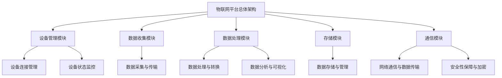

                 

### 物联网平台架构：应对海量设备连接的挑战

> 关键词：物联网、平台架构、海量设备、性能优化、连接挑战

> 摘要：本文将探讨物联网平台架构在应对海量设备连接的挑战中的重要性。我们将分析物联网平台的核心概念和设计原则，详细介绍物联网平台的核心组件和架构设计，分享物联网平台实现过程中的关键技术和挑战，以及性能优化策略。通过本文，读者将深入了解物联网平台架构的构建和实践，为未来物联网技术的发展提供指导。

### 第一部分：背景介绍

#### 1. 物联网的崛起

在当今数字化的时代，物联网（Internet of Things，IoT）已经成为科技领域的重要趋势。物联网通过将各种物理设备、传感器和系统连接到互联网，实现了信息的自动交换和共享。这种连接不仅改变了人们的生活和工作方式，也带来了大量的数据和信息。

物联网的应用范围广泛，从智能家居、智能城市、智能制造到智能医疗、智能农业等各个领域。随着5G、人工智能和大数据技术的快速发展，物联网设备的数量正在呈指数级增长。据统计，到2025年，全球物联网设备数量将超过260亿台。这一巨大的增长为物联网平台带来了前所未有的挑战。

#### 2. 物联网平台的需求

随着物联网设备数量的急剧增加，如何有效地管理和处理这些海量设备的数据成为了一个巨大的挑战。物联网平台的出现正是为了应对这一挑战。物联网平台作为连接设备、数据和应用程序的核心枢纽，提供了设备管理、数据采集、处理、存储和分发等功能。

物联网平台的需求主要体现在以下几个方面：

1. **设备管理**：物联网平台需要对海量设备进行连接管理、状态监控、升级和维护。这要求平台具备高并发处理能力和实时响应能力。

2. **数据采集**：物联网设备通过传感器收集大量数据，物联网平台需要对数据进行高效采集、清洗和预处理。

3. **数据处理**：采集到的数据需要进行实时处理、分析和存储，以便为用户提供有价值的信息和服务。

4. **数据存储**：物联网平台需要大规模数据存储能力，以存储和处理海量设备产生的数据。

5. **数据分发**：物联网平台需要将处理后的数据分发到各个应用程序和终端用户，提供即时的数据支持和决策依据。

#### 3. 架构的重要性

物联网平台架构的设计直接关系到系统的性能、可扩展性和稳定性。一个合理且高效的架构可以确保平台能够应对日益增长的数据量和复杂的应用场景，从而为用户提供优质的服务。

物联网平台架构的重要性主要体现在以下几个方面：

1. **性能优化**：合理的架构设计可以优化数据传输和处理速度，降低系统的延迟和响应时间。

2. **可扩展性**：架构需要具备良好的可扩展性，能够随着设备数量的增长而平滑扩展，避免系统过载和崩溃。

3. **稳定性**：架构需要确保系统的高可用性和稳定性，保证数据的安全和系统的连续运行。

4. **安全性**：架构需要考虑数据安全和设备安全，防止数据泄露和设备被恶意攻击。

#### 4. 应对海量设备连接的挑战

随着物联网技术的快速发展，设备连接数量呈指数级增长，这对物联网平台提出了更高的要求。如何确保平台能够高效、稳定地处理海量设备的数据，并提供低延迟、高可靠性的服务，是物联网平台架构设计的重要课题。

#### 4.1 数据处理能力

海量设备连接意味着平台需要处理的数据量急剧增加。平台需要具备强大的数据处理能力，包括高效的数据采集、处理和存储机制。例如，采用分布式处理技术和大数据平台，如Apache Kafka、Hadoop和Spark，可以提高数据处理的效率和性能。

#### 4.2 网络带宽

海量设备连接导致网络带宽需求大幅增加。平台需要确保网络带宽的充足，避免数据传输的瓶颈。采用5G、LPWAN等高速通信技术，可以提高网络传输速度和可靠性。

#### 4.3 系统高可用性

物联网平台需要具备高可用性，确保在设备连接数量增加的情况下，系统仍然能够稳定运行。采用冗余设计和负载均衡策略，可以提升系统的容错能力和稳定性。

#### 4.4 安全性保障

随着设备连接数量的增加，系统的安全性面临更大的挑战。平台需要采用严格的安全措施，包括数据加密、身份认证和访问控制，保护设备和数据的安全。

### 第二部分：物联网平台架构的核心概念

#### 2.1 物联网平台的基本概念

在这一章中，我们将详细讨论物联网平台的基本概念，包括其定义、组成部分和核心功能。我们将解释物联网平台如何连接设备、数据和应用，以及它在物联网生态系统中的角色。

#### 2.1.1 物联网平台的定义

物联网平台是连接物联网设备、数据和应用程序的核心枢纽，它提供了一系列功能，包括设备管理、数据采集、处理、存储和分发。物联网平台可以看作是一个桥梁，连接了物理世界和数字世界，实现了信息的自动交换和共享。

#### 2.1.2 物联网平台的组成部分

物联网平台通常由以下几个关键组件组成：

1. **设备管理模块**：负责连接和管理物联网设备，包括设备注册、状态监控、升级和维护。

2. **数据收集模块**：负责从物联网设备收集数据，并进行预处理和清洗。

3. **数据处理模块**：负责对收集到的数据进行分析、处理和存储。

4. **存储模块**：负责存储处理后的数据，包括数据库和大数据平台。

5. **通信模块**：负责数据在网络中的传输，包括无线通信和有线通信。

6. **应用程序接口（API）**：负责提供与外部应用程序和用户交互的接口。

#### 2.1.3 物联网平台的核心功能

物联网平台的核心功能包括：

1. **设备管理**：对物联网设备进行连接管理、状态监控和升级维护。

2. **数据采集**：从物联网设备收集数据，并进行预处理和清洗。

3. **数据处理**：对收集到的数据进行分析、处理和存储。

4. **数据存储**：存储处理后的数据，包括数据库和大数据平台。

5. **数据分发**：将处理后的数据分发到应用程序和终端用户。

6. **应用支持**：为开发者提供应用程序接口（API），方便开发物联网应用。

#### 2.2 物联网平台架构的设计原则

接下来，我们将探讨物联网平台架构设计的关键原则，包括模块化、可扩展性、可靠性和安全性。这些原则将指导我们构建一个高效且灵活的物联网平台。

#### 2.2.1 模块化

模块化设计是物联网平台架构设计的重要原则。通过将系统划分为多个模块，每个模块负责特定的功能，可以提高系统的可维护性和可扩展性。模块化设计还可以促进团队的协作开发，提高开发效率。

#### 2.2.2 可扩展性

物联网平台需要具备良好的可扩展性，以应对设备数量和数据量的增长。可扩展性包括水平扩展（增加服务器节点）和垂直扩展（提高单个服务器的性能）。通过采用分布式架构和云计算技术，可以实现物联网平台的高可扩展性。

#### 2.2.3 可靠性

物联网平台需要具备高可靠性，确保系统的稳定运行和数据的完整性。可靠性设计包括冗余设计、故障检测和自动恢复机制。通过这些设计原则，可以提高系统的容错能力和稳定性。

#### 2.2.4 安全性

安全性是物联网平台架构设计的重要考虑因素。物联网平台需要采用严格的安全措施，包括数据加密、身份认证、访问控制和安全审计等。通过这些安全措施，可以保护设备和数据的安全，防止恶意攻击和数据泄露。

#### 2.3 物联网平台的核心组件

在这一部分，我们将深入介绍物联网平台的主要组件，如设备管理模块、数据收集模块、数据处理模块、存储模块和通信模块。我们将讨论每个组件的功能和作用，以及它们如何协同工作以实现物联网平台的整体目标。

#### 2.3.1 设备管理模块

设备管理模块负责连接和管理物联网设备。其主要功能包括：

1. **设备注册**：设备接入物联网平台时，需要进行注册，以便平台能够识别和管理设备。

2. **设备状态监控**：实时监控设备的运行状态，包括设备在线状态、工作状态和故障状态。

3. **设备升级和维护**：对设备进行远程升级和维护，确保设备正常运行。

4. **设备生命周期管理**：管理设备的整个生命周期，包括设备创建、使用、维护和退役。

#### 2.3.2 数据收集模块

数据收集模块负责从物联网设备收集数据。其主要功能包括：

1. **数据采集**：从设备传感器和接口收集数据，并将其转换为标准格式。

2. **数据预处理**：对采集到的数据进行分析、清洗和预处理，以便后续处理。

3. **数据存储**：将预处理后的数据存储到数据库或大数据平台。

4. **数据质量监控**：监控数据的完整性和准确性，确保数据质量。

#### 2.3.3 数据处理模块

数据处理模块负责对收集到的数据进行分析、处理和存储。其主要功能包括：

1. **实时数据处理**：对实时数据进行分析和处理，以提供实时决策支持。

2. **批处理**：对历史数据进行分析和处理，以发现数据趋势和规律。

3. **数据处理算法**：采用各种数据处理算法，如机器学习、深度学习和统计分析，对数据进行智能分析。

4. **数据可视化**：将处理后的数据以图表、报表等形式进行可视化展示，便于用户理解和分析。

#### 2.3.4 存储模块

存储模块负责存储处理后的数据。其主要功能包括：

1. **数据存储**：采用数据库、文件系统或大数据平台存储处理后的数据。

2. **数据备份和恢复**：定期备份数据，确保数据的安全性和可靠性。

3. **数据访问控制**：对数据访问进行权限控制，确保数据的安全。

4. **数据索引和查询**：提供高效的数据索引和查询功能，便于快速检索数据。

#### 2.3.5 通信模块

通信模块负责数据在网络中的传输。其主要功能包括：

1. **数据传输协议**：采用合适的通信协议，如HTTP、MQTT、CoAP等，确保数据传输的可靠性和高效性。

2. **网络连接管理**：管理设备与平台之间的网络连接，包括连接建立、断开和重连。

3. **数据传输优化**：采用数据压缩、加密和传输优化技术，提高数据传输速度和安全性。

4. **网络监控和管理**：监控网络状态，确保网络连接的稳定性和高效性。

#### 2.4 物联网平台架构的设计方案

在这一部分，我们将详细介绍物联网平台架构的设计方案，包括系统的整体架构、模块划分、技术选型和性能优化策略。我们将使用Mermaid图来展示架构图，以便更直观地理解架构设计。

#### 2.4.1 系统整体架构

物联网平台整体架构采用分布式架构，包括多个模块和组件。各模块之间通过API进行通信，形成一个整体。系统整体架构如下图所示：

#### 2.4.2 模块划分

物联网平台模块划分为设备管理模块、数据收集模块、数据处理模块、存储模块和通信模块。各模块功能如下：

1. **设备管理模块**：负责连接和管理物联网设备，包括设备注册、状态监控、升级和维护。

2. **数据收集模块**：负责从物联网设备收集数据，并进行预处理和清洗。

3. **数据处理模块**：负责对收集到的数据进行分析、处理和存储。

4. **存储模块**：负责存储处理后的数据，包括数据库和大数据平台。

5. **通信模块**：负责数据在网络中的传输，包括无线通信和有线通信。

#### 2.4.3 技术选型

物联网平台的技术选型包括以下几个方面：

1. **设备管理**：采用MQTT协议进行设备连接管理，使用设备ID进行身份认证和权限控制。

2. **数据收集**：采用HTTP协议进行数据采集，使用JSON格式传输数据。

3. **数据处理**：采用Apache Kafka进行数据流处理，使用Apache Spark进行数据处理和存储。

4. **存储**：采用MongoDB进行数据存储，使用Hadoop分布式文件系统（HDFS）进行大数据存储。

5. **通信**：采用HTTP协议进行网络通信，使用WebSocket进行实时通信。

#### 2.4.4 性能优化策略

为了提高物联网平台的性能，可以采用以下优化策略：

1. **数据压缩**：采用数据压缩技术，减少数据传输量，提高传输速度。

2. **数据缓存**：使用缓存技术，降低数据库访问频率，提高系统响应速度。

3. **负载均衡**：采用负载均衡技术，将请求分配到多个服务器节点，提高系统并发处理能力。

4. **数据库优化**：优化数据库查询语句，提高数据库访问速度。

5. **网络优化**：优化网络配置，提高网络带宽和传输速度。

### 第三部分：物联网平台架构的构建与实践

#### 3.1 架构设计的目标和需求分析

在这一章中，我们将探讨如何根据实际需求设计物联网平台的架构。我们将分析系统的目标、功能需求、性能要求和安全需求，以确保架构能够满足项目的要求。

#### 3.1.1 系统目标

物联网平台的设计目标主要包括以下几个方面：

1. **高效数据采集和处理**：平台需要具备高效的数据采集和处理能力，能够快速处理海量设备的数据。

2. **高可用性和稳定性**：平台需要具备高可用性和稳定性，确保在设备数量增加的情况下，系统仍然能够稳定运行。

3. **安全性保障**：平台需要采用严格的安全措施，确保设备和数据的安全。

4. **易扩展性**：平台需要具备良好的可扩展性，能够根据需求进行功能扩展和性能优化。

#### 3.1.2 功能需求

物联网平台的主要功能需求包括：

1. **设备管理**：实现设备的连接、注册、状态监控和升级维护。

2. **数据采集**：实现数据采集、预处理和存储。

3. **数据处理**：实现数据清洗、转换、分析和存储。

4. **数据存储**：实现数据的存储和管理，包括数据库和大数据平台。

5. **数据分发**：实现数据的分发和共享，为应用程序和用户提供数据支持。

6. **应用支持**：提供应用程序接口（API），方便开发者开发物联网应用。

#### 3.1.3 性能要求

物联网平台需要满足以下性能要求：

1. **低延迟**：数据传输和处理需要低延迟，确保实时性。

2. **高并发**：平台需要能够处理大量的并发请求，具备高并发处理能力。

3. **高吞吐量**：平台需要具备高吞吐量，能够快速处理海量数据。

4. **高可用性**：平台需要具备高可用性，确保系统在设备数量增加的情况下仍然能够稳定运行。

#### 3.1.4 安全需求

物联网平台的安全需求主要包括以下几个方面：

1. **数据安全**：采用数据加密技术，确保数据在传输和存储过程中的安全性。

2. **设备安全**：采用设备认证和访问控制技术，确保设备的安全。

3. **网络安全**：采用网络安全技术，如防火墙、入侵检测和防范，确保网络的安全。

4. **安全审计**：实现安全审计功能，对系统操作进行记录和监控，确保系统的安全。

#### 3.2 物联网平台架构的设计方案

接下来，我们将详细介绍物联网平台架构的设计方案，包括系统的整体架构、模块划分、技术选型和性能优化策略。我们将使用Mermaid图来展示架构图，以便更直观地理解架构设计。

#### 3.2.1 系统整体架构

物联网平台整体架构采用分布式架构，包括多个模块和组件。各模块之间通过API进行通信，形成一个整体。系统整体架构如下图所示：

#### 3.2.2 模块划分

物联网平台模块划分为设备管理模块、数据收集模块、数据处理模块、存储模块和通信模块。各模块功能如下：

1. **设备管理模块**：负责连接和管理物联网设备，包括设备注册、状态监控、升级和维护。

2. **数据收集模块**：负责从物联网设备收集数据，并进行预处理和清洗。

3. **数据处理模块**：负责对收集到的数据进行分析、处理和存储。

4. **存储模块**：负责存储处理后的数据，包括数据库和大数据平台。

5. **通信模块**：负责数据在网络中的传输，包括无线通信和有线通信。

#### 3.2.3 技术选型

物联网平台的技术选型包括以下几个方面：

1. **设备管理**：采用MQTT协议进行设备连接管理，使用设备ID进行身份认证和权限控制。

2. **数据收集**：采用HTTP协议进行数据采集，使用JSON格式传输数据。

3. **数据处理**：采用Apache Kafka进行数据流处理，使用Apache Spark进行数据处理和存储。

4. **存储**：采用MongoDB进行数据存储，使用Hadoop分布式文件系统（HDFS）进行大数据存储。

5. **通信**：采用HTTP协议进行网络通信，使用WebSocket进行实时通信。

#### 3.2.4 性能优化策略

为了提高物联网平台的性能，可以采用以下优化策略：

1. **数据压缩**：采用数据压缩技术，减少数据传输量，提高传输速度。

2. **数据缓存**：使用缓存技术，降低数据库访问频率，提高系统响应速度。

3. **负载均衡**：采用负载均衡技术，将请求分配到多个服务器节点，提高系统并发处理能力。

4. **数据库优化**：优化数据库查询语句，提高数据库访问速度。

5. **网络优化**：优化网络配置，提高网络带宽和传输速度。

#### 3.3 实现过程中的关键技术和挑战

在物联网平台架构的实现过程中，我们可能会遇到各种技术和挑战。这一节将讨论如何选择合适的技术栈、处理数据同步与冲突、确保系统的高可用性和安全性。

#### 3.3.1 选择合适的技术栈

在物联网平台实现过程中，选择合适的技术栈至关重要。以下是一些关键点：

1. **编程语言**：Python、Java、JavaScript等都是流行的编程语言，可以根据项目需求选择适合的编程语言。

2. **数据库**：关系型数据库（如MySQL、PostgreSQL）和NoSQL数据库（如MongoDB、Cassandra）都有其优势，根据数据结构和查询需求选择合适的数据库。

3. **大数据平台**：Hadoop、Spark、Flink等大数据平台可以处理海量数据，根据数据处理需求选择合适的大数据平台。

4. **消息队列**：Kafka、RabbitMQ等消息队列可以处理高并发消息传输，提高系统的可靠性和性能。

5. **缓存系统**：Redis、Memcached等缓存系统可以降低数据库访问频率，提高系统响应速度。

#### 3.3.2 数据同步与冲突处理

在物联网平台中，数据同步和冲突处理是一个关键问题。以下是一些处理策略：

1. **分布式一致性协议**：使用分布式一致性协议（如Paxos、Raft）确保数据的一致性。

2. **事件溯源**：采用事件溯源（Event Sourcing）技术，记录每个事件的修改历史，便于冲突解决。

3. **乐观锁和悲观锁**：使用乐观锁和悲观锁控制数据的并发访问，减少冲突。

4. **消息队列**：使用消息队列将数据变更通知到其他系统，确保数据的最终一致性。

#### 3.3.3 确保系统的高可用性

物联网平台需要具备高可用性，确保在设备数量增加的情况下，系统仍然能够稳定运行。以下是一些高可用性设计策略：

1. **集群部署**：将系统部署在多个服务器节点上，使用负载均衡器分配请求，提高系统的并发处理能力和容错能力。

2. **故障转移**：实现故障转移（Failover）机制，当某个节点发生故障时，自动将请求切换到其他节点，确保系统的连续运行。

3. **数据备份和恢复**：定期备份数据，确保数据的安全性和可靠性。

4. **监控和报警**：使用监控工具（如Prometheus、Zabbix）对系统进行实时监控，及时发现和处理故障。

#### 3.3.4 系统的安全性

物联网平台的安全性至关重要，以下是一些关键点：

1. **身份认证和访问控制**：使用身份认证和访问控制技术（如OAuth2、JWT）确保系统的安全性。

2. **数据加密**：使用数据加密技术（如AES、RSA）确保数据在传输和存储过程中的安全性。

3. **安全审计**：实现安全审计功能，对系统操作进行记录和监控，确保系统的安全性。

4. **网络隔离**：采用网络隔离技术（如VPN、防火墙）保护系统不受外部攻击。

#### 3.4 项目实施与经验总结

在这一部分，我们将分享一个实际的物联网平台项目实施案例，包括项目规划、开发流程、测试和部署。我们将总结项目中的成功经验和遇到的挑战，并提供一些实用的建议和最佳实践。

#### 3.4.1 项目规划

在项目规划阶段，我们明确了项目的目标、功能需求、性能要求和安全需求。根据这些需求，我们制定了项目计划，包括项目进度、任务分配和资源规划。

#### 3.4.2 开发流程

在开发阶段，我们采用了敏捷开发方法，将项目分为多个迭代，每个迭代实现一部分功能。我们使用了版本控制系统（如Git）进行代码管理，确保代码的版本控制和协作开发。

#### 3.4.3 测试

在测试阶段，我们进行了单元测试、集成测试和系统测试，确保系统的功能和性能满足要求。我们使用了自动化测试工具（如JUnit、Selenium）提高测试效率。

#### 3.4.4 部署

在部署阶段，我们将系统部署到生产环境，并进行性能调优和安全加固。我们使用了容器化技术（如Docker）和自动化部署工具（如Jenkins），提高系统的部署效率和管理能力。

#### 3.4.5 经验总结

在项目实施过程中，我们遇到了一些挑战，如海量设备连接的处理、数据同步和冲突处理、系统高可用性和安全性等。通过不断优化和改进，我们成功地解决了这些问题，并总结了一些最佳实践：

1. **合理设计数据模型**：设计合理的数据模型，确保数据的一致性和高效处理。

2. **采用分布式架构**：采用分布式架构，提高系统的并发处理能力和容错能力。

3. **优化数据传输**：采用数据压缩和缓存技术，降低数据传输量和响应时间。

4. **加强安全性**：采用严格的安全措施，保护设备和数据的安全。

5. **持续监控和优化**：使用监控工具实时监控系统性能，及时发现问题并进行优化。

### 第四部分：物联网平台架构的优化与性能提升

#### 4.1 性能瓶颈分析

在物联网平台运行过程中，可能会遇到各种性能瓶颈，如数据传输延迟、处理速度慢、存储容量不足等。这一节将分析常见的性能瓶颈，并探讨如何识别和解决这些问题。

#### 4.1.1 数据传输延迟

数据传输延迟是物联网平台常见的性能瓶颈之一。导致数据传输延迟的原因有多种，如网络带宽不足、传输协议不合适、数据压缩不够等。以下是一些解决方案：

1. **优化网络配置**：提高网络带宽，降低传输延迟。

2. **选择合适的传输协议**：根据数据传输需求，选择合适的传输协议，如HTTP、MQTT、CoAP等。

3. **数据压缩**：采用数据压缩技术，减少数据传输量，提高传输速度。

4. **负载均衡**：采用负载均衡技术，将请求分配到多个服务器节点，降低单个节点的负载，减少延迟。

#### 4.1.2 处理速度慢

处理速度慢可能是由于数据处理算法复杂、系统资源不足或数据处理模块的设计不合理等原因造成的。以下是一些解决方案：

1. **优化数据处理算法**：优化数据处理算法，减少算法复杂度，提高处理速度。

2. **增加系统资源**：增加服务器节点、CPU、内存等系统资源，提高数据处理能力。

3. **分布式处理**：采用分布式处理技术，将数据处理任务分配到多个节点，提高处理速度。

4. **缓存技术**：使用缓存技术，降低数据库访问频率，提高数据处理速度。

#### 4.1.3 存储容量不足

存储容量不足可能导致系统无法存储和处理海量数据，影响系统的正常运行。以下是一些解决方案：

1. **扩展存储容量**：增加存储设备，扩展存储容量。

2. **分布式存储**：采用分布式存储技术，将数据存储到多个节点，提高存储容量和可靠性。

3. **数据压缩**：采用数据压缩技术，减少存储空间需求。

4. **数据备份和归档**：对数据定期备份和归档，释放存储空间。

#### 4.2 性能优化技术

为了提高物联网平台的性能，可以采用以下优化技术：

1. **数据压缩**：采用数据压缩技术，减少数据传输量和存储空间需求。

2. **缓存技术**：使用缓存技术，降低数据库访问频率，提高系统响应速度。

3. **负载均衡**：采用负载均衡技术，将请求分配到多个服务器节点，提高系统的并发处理能力。

4. **分布式处理**：采用分布式处理技术，将数据处理任务分配到多个节点，提高处理速度。

5. **存储优化**：采用存储优化技术，如数据去重、压缩和分割，提高存储效率和性能。

6. **网络优化**：优化网络配置，提高网络带宽和传输速度。

#### 4.3 实践案例

以下是一个实际的物联网平台性能优化案例：

案例背景：一个物联网平台需要处理大量的传感器数据，但发现数据传输延迟和处理速度慢，影响了系统的正常运行。

解决方案：

1. **优化数据传输协议**：将原来的HTTP协议更换为MQTT协议，降低了数据传输延迟。

2. **增加网络带宽**：提高了网络带宽，降低了数据传输延迟。

3. **分布式处理**：将数据处理任务分配到多个服务器节点，提高了处理速度。

4. **缓存技术**：使用Redis缓存技术，降低了数据库访问频率，提高了系统响应速度。

5. **负载均衡**：采用负载均衡技术，将请求分配到多个服务器节点，提高了系统的并发处理能力。

通过以上优化措施，物联网平台的性能得到了显著提升，数据传输延迟和处理速度明显加快，系统稳定性得到了保障。

### 第五部分：总结与展望

#### 5.1 总结

本文从背景介绍、核心概念、架构设计、构建与实践、优化与性能提升等方面，详细探讨了物联网平台架构在应对海量设备连接的挑战中的作用和重要性。我们分析了物联网平台的需求、架构设计原则、核心组件和架构设计方案，并分享了实现过程中的关键技术和挑战。

通过本文，读者可以了解到物联网平台架构的设计原则和实现方法，以及如何优化和提升平台的性能。这为物联网平台开发者和研究者提供了有益的参考和指导。

#### 5.2 展望

随着物联网技术的不断发展和应用场景的扩展，物联网平台架构面临着新的挑战和机遇。以下是一些未来发展的趋势和展望：

1. **边缘计算**：随着物联网设备数量的增加，边缘计算技术将发挥越来越重要的作用。通过在边缘设备上处理数据，可以降低数据传输延迟，提高系统性能和响应速度。

2. **人工智能**：人工智能技术将与物联网平台深度融合，实现智能数据分析和决策支持。通过机器学习和深度学习算法，可以从海量数据中提取有价值的信息，为用户提供更好的服务和体验。

3. **5G技术**：5G技术的普及将进一步提升物联网平台的性能和可靠性。高带宽、低延迟的5G网络将为物联网平台提供更稳定、更高效的数据传输和通信能力。

4. **安全性和隐私保护**：随着物联网设备数量的增加，安全性和隐私保护将变得越来越重要。未来，物联网平台需要采用更严格的安全措施，保护设备和数据的安全，防止恶意攻击和数据泄露。

5. **跨平台集成**：未来的物联网平台将更加注重跨平台集成和兼容性。通过实现不同平台之间的互联互通，将各种物联网应用和服务整合在一起，为用户提供更全面、更便捷的物联网体验。

### 第六部分：最佳实践 Tips、注意事项和拓展阅读

#### 最佳实践 Tips

1. **模块化设计**：在进行物联网平台架构设计时，应遵循模块化原则，将系统划分为多个模块，每个模块负责特定的功能，以提高系统的可维护性和可扩展性。

2. **分布式架构**：采用分布式架构可以提高系统的性能和可靠性。通过将数据处理和存储任务分布到多个节点，可以降低系统的负载，提高并发处理能力。

3. **数据压缩**：在数据传输过程中，应采用数据压缩技术，减少数据传输量，提高传输速度。同时，应考虑数据的加密和压缩效率，确保数据安全和传输效率。

4. **安全措施**：在物联网平台设计中，应采用严格的安全措施，包括数据加密、身份认证、访问控制和安全审计等，确保设备和数据的安全。

5. **性能监控和优化**：定期对物联网平台进行性能监控和优化，及时发现和处理性能瓶颈，提高系统的性能和稳定性。

#### 注意事项

1. **需求分析**：在物联网平台设计过程中，应充分了解用户需求，确保系统功能、性能和安全性满足用户需求。

2. **技术选型**：在选择技术栈时，应考虑技术的成熟度、社区支持和兼容性，确保技术的长期稳定性和可维护性。

3. **测试和部署**：在系统开发和部署过程中，应进行充分的测试和验证，确保系统的功能、性能和安全性满足预期。

4. **安全性和隐私保护**：在物联网平台设计中，应充分考虑安全性和隐私保护，防止恶意攻击和数据泄露。

#### 拓展阅读

1. **《物联网平台架构设计》**：一本关于物联网平台架构设计的经典书籍，详细介绍了物联网平台的设计原则、架构组件和实现方法。

2. **《物联网：从概念到实践》**：一本关于物联网技术实践的书，涵盖了物联网设备的连接、数据采集、处理和应用程序开发等内容。

3. **《边缘计算：原理与实践》**：一本关于边缘计算技术的书籍，介绍了边缘计算的基本原理、架构设计和应用场景。

4. **《物联网安全：保护物联网设备和数据的安全》**：一本关于物联网安全问题的书籍，详细介绍了物联网设备的安全威胁、安全解决方案和安全策略。

### 第七部分：作者信息

作者：AI天才研究院/AI Genius Institute & 禅与计算机程序设计艺术 /Zen And The Art of Computer Programming

### 附录

附录部分可以包括以下内容：

1. **术语表**：对文中涉及的专业术语进行解释。

2. **参考文献**：列出文中引用的参考资料和文献。

3. **代码示例**：提供物联网平台架构实现过程中的关键代码示例。

4. **数据模型图**：展示物联网平台的数据模型和实体关系图。

5. **算法流程图**：展示物联网平台中的关键算法和流程图。

通过上述内容，本文为读者提供了一个全面、系统的物联网平台架构分析和实践指导。希望本文能够帮助读者更好地理解和应对物联网平台架构设计中的挑战，为未来的物联网技术发展提供有益的参考。

