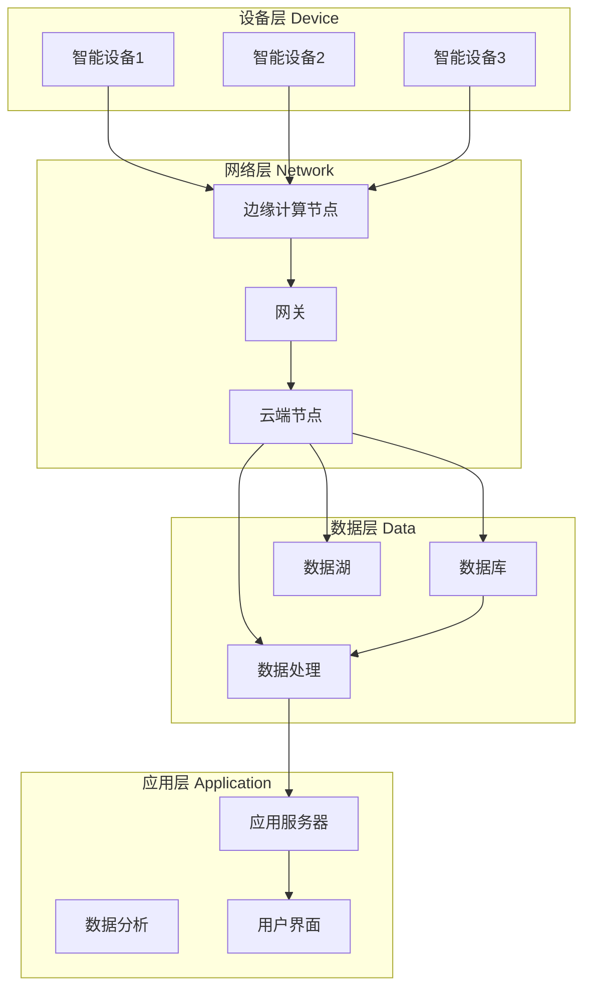

                 

### 第一部分：背景介绍

#### 问题背景

随着信息技术的飞速发展，物联网（IoT）已逐渐成为现代科技的关键领域。物联网平台是连接智能设备和云端的桥梁，它使得各类设备能够协同工作，实现数据的采集、处理、传输和应用。然而，物联网平台的建设并非易事，涉及硬件、软件、网络、安全等多个层面的复杂挑战。

#### 问题描述

物联网平台需要实现以下几个核心功能：

1. **设备连接与管理**：确保各种智能设备能够稳定、安全地接入平台。
2. **数据收集与处理**：对设备产生的海量数据进行高效处理，提取有价值的信息。
3. **数据分析与应用**：利用先进的数据分析技术，为用户提供智能化的服务。
4. **安全防护**：保障设备和数据的安全，防止潜在的网络攻击和数据泄露。

#### 问题解决

本书旨在为开发者和管理者提供一套全面、系统的物联网平台构建指南。通过以下内容，解决物联网平台建设的核心问题：

1. **技术基础**：介绍物联网平台所需的关键技术，包括网络通信、数据存储和处理、安全机制等。
2. **架构设计**：详细讲解物联网平台的系统架构，包括硬件层、网络层、数据层、应用层等。
3. **设备连接**：探讨如何高效地连接和管理智能设备，确保数据的稳定传输。
4. **数据处理与分析**：介绍数据收集、存储、处理和分析的方法，提高数据利用效率。
5. **安全防护**：提供物联网平台的安全设计策略，确保设备和数据的安全。
6. **最佳实践**：分享行业内的最佳实践案例，为实际应用提供参考。

#### 边界与外延

物联网平台的构建不仅涉及技术层面，还包括商业模式、用户体验等多个方面。因此，本书将不限于技术讨论，也会涉及物联网平台的运营管理和创新应用。

#### 概念结构与核心要素组成

- **物联网平台**：一个集成硬件、软件和网络技术的系统，用于连接和管理智能设备，提供数据收集、处理、传输和应用服务。
- **智能设备**：具有感知、处理和通信能力的设备，能够采集数据并接入物联网平台。
- **数据**：物联网平台的核心资产，包括设备状态、环境参数、用户行为等。
- **网络**：物联网平台的传输通道，支持设备与云端的数据交换。
- **安全**：确保设备和数据在传输和处理过程中的安全性和隐私保护。

### 第二部分：核心概念与联系

在深入探讨物联网平台之前，我们需要明确几个核心概念及其相互关系。以下是物联网平台中的一些关键概念：

#### 核心概念

1. **边缘计算**：边缘计算是一种在靠近数据源的地方进行计算的技术，旨在减少数据传输的延迟，提高系统的响应速度。它通常用于处理实时性要求较高的应用，如自动驾驶、智能工厂等。
2. **雾计算**：雾计算是介于边缘计算和云计算之间的一种计算模式，它将计算任务分布在更广泛的网络节点上，从而实现数据的分布式处理。雾计算适用于处理大规模、分布式数据的应用场景。
3. **物联网协议**：物联网协议是用于设备通信和数据交换的标准化协议，如MQTT（消息队列遥测传输协议）、CoAP（约束应用协议）等。这些协议确保不同设备之间的互操作性，是实现物联网互联互通的基础。
4. **物联网安全**：物联网安全是确保设备和数据在传输、处理和应用过程中的安全性和隐私保护的一系列技术和策略。随着物联网设备的增多，安全问题变得越来越重要。

#### 概念属性特征对比表格

| 概念 | 定义 | 属性特征 | 关联关系 |
| --- | --- | --- | --- |
| 边缘计算 | 近源计算 | 高响应速度、低延迟、分布式计算 | 用于处理实时性要求高的应用 |
| 雾计算 | 分散计算 | 低延迟、高可靠性、分布式架构 | 用于处理大规模、分布式数据 |
| 物联网协议 | 设备通信规范 | 标准化、高效、可扩展 | 支持不同设备之间的互操作性 |
| 物联网安全 | 安全防护 | 防火墙、加密、认证 | 确保数据传输和处理的安全性 |

#### 物联网平台ER实体关系图架构

```mermaid
erDiagram
  Device ||--|{ Platform : manages }
  Platform ||--|{ Data : stores }
  Data ||--|{ Application : processes }
  Application ||--|{ User : serves }
```

在这个ER图中，设备层与平台层之间是管理关系，平台层负责连接和管理智能设备。数据层存储设备产生的数据，这些数据经过处理后被应用于各种服务中，最终服务于用户。

通过上述核心概念的介绍和ER图架构的展示，我们可以更清晰地理解物联网平台的构建原理及其各组成部分之间的关系。接下来，我们将进一步探讨物联网平台的设计和实现细节。

### 第三部分：物联网平台架构设计

#### 系统架构设计概述

物联网平台的设计需要考虑多个层面的复杂性，以确保系统的可扩展性、稳定性和安全性。一个典型的物联网平台通常可以分为以下几层：

1. **设备层**：这是物联网平台的基础，包括各种智能设备，如传感器、智能家电、车辆、工业设备等。这些设备通过各种协议（如Wi-Fi、蓝牙、Zigbee、LoRa等）连接到网络。
2. **网络层**：网络层负责设备与云端之间的通信。在网络层，数据会经过边缘计算节点，以减少延迟和带宽消耗。网络层可能包括多个子网，如局域网、广域网、私有云等。
3. **数据层**：数据层是物联网平台的核心，负责存储、管理和处理来自设备的数据。这一层通常使用大数据技术，如分布式数据库、数据湖等，以确保数据的可靠性和高效处理。
4. **应用层**：应用层提供各种物联网应用服务，如数据可视化、智能分析、远程控制、自动化流程等。这一层通常是面向用户的，通过图形用户界面（GUI）或其他接口与用户交互。

#### 系统架构设计



在这个架构设计中，智能设备通过边缘计算节点进行初步的数据处理，以减轻云端节点的负担。边缘计算节点与网关连接，将数据传输到云端节点。云端节点负责数据的存储、处理和分析，最终通过应用服务器和用户界面为用户提供服务。

#### 系统架构设计细节

1. **设备层**：设备层包括多种类型的智能设备，如环境传感器、智能灯泡、智能摄像头、工业机器等。这些设备通常具有低功耗、高可靠性和实时数据采集的能力。设备层的设计需要考虑设备的多样性、兼容性和易管理性。

2. **网络层**：网络层的设计需要确保数据传输的高效性和稳定性。边缘计算节点可以位于设备附近，如家庭、工厂等，以减少数据传输的延迟。网关则负责将边缘数据传输到云端节点。在网络层，可以选择不同的通信协议和传输方式，如Wi-Fi、蓝牙、5G等。

3. **数据层**：数据层是物联网平台的核心，负责存储和处理来自设备的大量数据。数据层通常使用分布式数据库和数据湖，以实现高可用性、高扩展性和高效数据处理。数据层还需要实现数据的安全存储和访问控制。

4. **应用层**：应用层提供各种物联网应用服务，如远程监控、数据分析、自动化控制等。应用层的设计需要考虑用户体验、系统性能和可扩展性。应用服务器通常使用微服务架构，以提高系统的可维护性和可扩展性。

通过上述系统架构的设计，物联网平台可以有效地连接和管理智能设备，实现数据的收集、处理和分析，为用户提供智能化的服务。接下来，我们将进一步探讨物联网平台中的设备连接、数据处理、安全防护等关键技术。

### 第四部分：设备连接技术

#### 设备连接的重要性

物联网平台的核心在于设备之间的互联互通，而实现这一目标的关键在于设备连接技术。设备连接的稳定性、可靠性和效率直接影响到物联网平台的性能和用户体验。

#### 常见的设备连接技术

1. **Wi-Fi**：Wi-Fi技术是一种广泛使用的无线通信技术，适用于家庭和商业环境。Wi-Fi连接具有高速率和广覆盖范围的特点，但功耗较高。

2. **蓝牙**：蓝牙技术是一种短距离无线通信技术，适用于智能家电、健康监测设备等。蓝牙连接功耗较低，但传输速率相对较低。

3. **Zigbee**：Zigbee技术是一种低功耗、短距离无线通信技术，适用于家庭自动化、智能照明等领域。Zigbee网络具有高可靠性和高吞吐量的特点。

4. **LoRa**：LoRa技术是一种长距离、低功耗的无线通信技术，适用于远程监控、环境监测等。LoRa网络覆盖范围广，但传输速率相对较低。

5. **5G**：5G技术是一种新一代的移动通信技术，具有高速率、低延迟和高可靠性的特点。5G网络适用于物联网应用中的实时性要求较高的场景。

#### 设备连接方法

1. **直接连接**：直接连接是指设备通过有线或无线网络直接连接到物联网平台。这种方法通常适用于家庭或小型商业环境，设备数量较少且位置相对固定。

2. **网关连接**：网关连接是指设备通过一个网关连接到物联网平台。网关位于设备附近，负责收集和处理设备数据，然后将数据转发到云端。这种方法适用于设备分布广泛且数量较多的场景，如工业物联网和智能城市。

3. **多跳连接**：多跳连接是指设备通过多个网关或中继器逐步连接到物联网平台。这种方法适用于设备分布非常广泛且网络信号较弱的环境，如农业物联网和远程监控。

#### 设备连接管理

1. **自动发现**：自动发现是指物联网平台能够自动识别并连接新加入的设备。这通常通过设备广播其存在和连接信息来实现。

2. **认证与授权**：认证与授权是指确保只有授权设备才能连接到物联网平台。这通常通过使用加密和认证协议（如TLS、OAuth2.0）来实现。

3. **设备管理**：设备管理是指对连接到物联网平台的设备进行监控、配置和维护。这包括设备的在线状态监控、固件更新、故障诊断等。

4. **数据传输优化**：数据传输优化是指通过减少数据传输量、优化传输协议和算法等手段，提高数据传输的效率和稳定性。

通过上述设备连接技术的介绍，我们可以更好地理解物联网平台中设备连接的实现方法和管理策略。在下一部分，我们将进一步探讨物联网平台中的数据处理与分析技术。

### 第五部分：数据处理与分析技术

#### 数据处理与分析的重要性

物联网平台的核心价值在于对设备产生的数据进行有效的处理与分析，从而提取有价值的信息，为用户提供智能化的服务。数据处理与分析技术是物联网平台的重要组成部分，直接影响平台的性能和用户体验。

#### 数据处理技术

1. **数据采集**：数据采集是数据处理的第一步，涉及从各种智能设备中收集数据。数据采集技术需要考虑数据源的类型、数据格式和数据量。

2. **数据清洗**：数据清洗是指对采集到的数据进行预处理，去除无效数据、重复数据、错误数据等。数据清洗是确保数据质量的重要步骤。

3. **数据存储**：数据存储是指将处理后的数据存储在合适的存储系统中。常用的数据存储技术包括关系型数据库、非关系型数据库、数据湖等。

4. **数据索引**：数据索引是指为数据创建索引，以提高数据查询和检索的效率。数据索引技术对于大数据处理尤为重要。

5. **数据压缩**：数据压缩是指通过压缩算法减少数据的存储空间和传输带宽。数据压缩技术对于物联网平台的高效运行至关重要。

#### 数据分析技术

1. **实时分析**：实时分析是指在数据产生的同时进行即时处理和分析。实时分析适用于需要快速响应的场景，如智能家居、智能交通等。

2. **批处理分析**：批处理分析是指将一段时间内的数据批量进行处理和分析。批处理分析适用于数据量大且不要求实时响应的场景，如天气预报、电力负荷预测等。

3. **预测分析**：预测分析是指利用历史数据和统计方法对未来的数据进行预测。预测分析适用于需求预测、趋势分析等场景。

4. **机器学习**：机器学习是指通过训练模型来从数据中学习规律和模式。机器学习技术可以用于分类、回归、聚类等分析任务，为用户提供个性化的服务。

#### 数据分析与平台性能

1. **数据处理效率**：数据处理效率是物联网平台性能的重要指标。高效的数据处理技术可以确保数据及时、准确地传输和分析。

2. **数据存储容量**：数据存储容量是物联网平台能否存储和管理大量数据的关键。随着物联网设备的增加，数据存储容量需要不断扩展。

3. **数据查询速度**：数据查询速度是用户使用物联网平台时的直观体验。快速的数据查询可以提供即时的信息反馈。

4. **系统可扩展性**：系统可扩展性是指物联网平台能否轻松应对设备数量和数据处理量的增加。可扩展性好的平台可以持续满足用户需求。

通过上述数据处理与分析技术的介绍，我们可以更好地理解物联网平台中数据处理与分析的原理和实践。在下一部分，我们将进一步探讨物联网平台中的安全防护技术。

### 第六部分：安全防护技术

#### 安全防护的重要性

在物联网平台的建设过程中，安全防护是一个不可忽视的重要环节。随着物联网设备的激增和数据传输的增多，设备和数据的安全性面临诸多挑战。确保物联网平台的安全，不仅可以保护设备和数据，还可以增强用户对物联网应用的信任。

#### 安全威胁类型

1. **设备入侵**：攻击者通过入侵设备获取敏感数据或控制设备，可能用于恶意目的，如远程攻击、设备篡改等。
2. **数据泄露**：未经授权的第三方访问和窃取设备或平台上的敏感数据，可能导致隐私泄露和财产损失。
3. **网络攻击**：攻击者利用网络漏洞进行攻击，如DDoS（分布式拒绝服务攻击）等，可能导致物联网平台服务中断。
4. **恶意软件**：恶意软件感染物联网设备，可能导致设备功能异常、数据损坏等。

#### 安全防护策略

1. **身份验证与访问控制**：使用强密码、双因素认证等技术确保只有授权用户和设备能够访问系统。同时，通过访问控制列表（ACL）限制不同用户的权限，防止未授权访问。
2. **数据加密**：对传输和存储的数据进行加密，防止数据泄露和篡改。常用的加密算法包括AES（高级加密标准）、RSA（公钥加密算法）等。
3. **网络安全**：在网络层面部署防火墙、入侵检测系统（IDS）和入侵防御系统（IPS）等安全设备，监控网络流量，防止恶意攻击。
4. **设备安全管理**：对物联网设备进行安全加固，定期更新固件和软件，修补安全漏洞，防止设备被攻击。
5. **数据备份与恢复**：定期备份数据，确保在数据丢失或损坏时能够迅速恢复，降低业务中断风险。

#### 安全机制实现

1. **安全协议**：采用安全通信协议（如TLS、SSL）确保数据在传输过程中的加密和完整性。这些协议可以防止数据在传输过程中被窃听、篡改或伪造。
2. **安全审计**：实施安全审计机制，记录系统中的所有操作和变更，及时发现异常行为和安全漏洞。
3. **安全监控**：通过日志分析和安全事件响应（SIEM）系统实时监控平台的安全状态，快速识别和响应安全威胁。
4. **用户教育**：加强对用户的网络安全教育，提高他们对安全威胁的认识和防范能力，避免因用户操作不当导致的安全问题。

通过上述安全防护技术的介绍，我们可以更好地理解物联网平台安全机制的设计和实现。在下一部分，我们将探讨物联网平台中的最佳实践。

### 第七部分：最佳实践与案例分析

#### 物联网平台最佳实践

在物联网平台的实际应用中，总结和推广最佳实践是非常重要的，它有助于提高平台的稳定性、安全性和用户体验。以下是几个值得借鉴的最佳实践：

1. **模块化设计**：物联网平台应采用模块化设计，以方便系统的扩展和维护。模块化设计可以将系统功能划分为独立的模块，每个模块负责特定的功能，如设备连接、数据处理、安全防护等。

2. **弹性扩展**：物联网平台应具备弹性扩展能力，以应对设备数量和数据量的增长。通过云服务、分布式架构等技术，可以实现平台的水平扩展和垂直扩展。

3. **数据优化处理**：优化数据处理流程，采用边缘计算、数据压缩等技术，减少数据传输量和存储需求，提高数据处理效率。

4. **安全防护**：重视安全防护，采用多层次的安全机制，确保设备和数据的安全。定期进行安全审计和漏洞修复，提高系统的安全性。

5. **用户体验**：注重用户体验，通过直观的界面设计和便捷的操作流程，提高用户对物联网平台的满意度。

#### 案例分析

以下是几个成功的物联网平台案例，它们为行业提供了宝贵的经验和启示：

1. **智能家居平台**：以苹果的HomeKit为例，它通过模块化的设计、标准化的协议和安全机制，实现了各种智能家居设备的无缝连接和控制。HomeKit不仅提供了强大的设备连接和管理功能，还通过AI技术实现了智能化的家居体验。

2. **智能农业平台**：以IBM的Watson IoT平台为例，它利用物联网技术为农业提供了全方位的解决方案。通过传感器收集农田数据，结合大数据分析和人工智能技术，实现精准农业管理，提高产量和降低成本。

3. **智能交通平台**：以亚马逊的AWS IoT平台为例，它为智能交通系统提供了强大的支持。通过车辆传感器、路况监控设备等收集交通数据，结合机器学习算法，实现实时路况预测和交通优化，提高了交通效率和安全性。

通过上述最佳实践和案例分析，我们可以看到物联网平台在实际应用中的多样性和复杂性。在构建物联网平台时，应结合具体应用场景，灵活运用这些最佳实践，确保平台的成功实施和运营。

### 小结

本文从多个角度详细探讨了物联网平台的构建与实现。首先，我们介绍了物联网平台的背景和问题描述，明确了其核心功能和解决思路。接着，我们深入分析了物联网平台的核心概念和架构设计，展示了边缘计算、雾计算、物联网协议和安全等关键概念及其关联关系。然后，我们探讨了设备连接、数据处理与分析、安全防护等技术，并分享了最佳实践和成功案例。物联网平台的构建是一个复杂的过程，需要综合考虑技术、商业、用户体验等多方面因素。通过本文的探讨，希望读者能够对物联网平台有更深入的理解，并在实际应用中运用这些知识，实现物联网技术的价值最大化。

### 注意事项

在构建物联网平台时，需要注意以下几个关键点：

1. **安全防护**：确保设备和数据的安全是物联网平台建设的重中之重。采用多层次的安全机制，如数据加密、身份认证、访问控制等，是保障平台安全的基础。

2. **兼容性和可扩展性**：物联网设备种类繁多，协议多样，平台设计时需要考虑兼容性和可扩展性，以便适应未来技术和业务的发展。

3. **用户体验**：良好的用户体验是物联网平台成功的关键。设计简洁直观的界面，提供便捷的操作流程，可以提高用户满意度和平台黏性。

4. **数据优化**：物联网平台处理的数据量巨大，优化数据处理流程，如采用边缘计算、数据压缩等技术，可以提高平台的性能和效率。

5. **持续维护和升级**：物联网平台需要定期进行维护和升级，以修复漏洞、优化性能和增加新功能。建立健全的维护和升级机制，是平台长期稳定运行的关键。

### 拓展阅读

1. **《物联网：从概念到实践》**：这是一本全面的物联网技术入门书籍，涵盖了物联网的基本概念、架构设计、关键技术等内容。

2. **《智能设备联网技术》**：本书详细介绍了智能设备的连接技术，包括Wi-Fi、蓝牙、Zigbee、LoRa等，适合对物联网设备连接技术感兴趣的读者。

3. **《物联网安全》**：本书专注于物联网平台的安全防护技术，包括安全协议、安全机制、攻击防御等内容，是物联网安全领域的权威著作。

4. **《边缘计算与物联网》**：本书探讨了边缘计算在物联网中的应用，包括边缘计算的基本原理、架构设计、实际应用案例等，是了解边缘计算与物联网关系的重要参考书。

### 作者信息

* **作者：AI天才研究院/AI Genius Institute & 禅与计算机程序设计艺术 /Zen And The Art of Computer Programming***

AI天才研究院致力于推动人工智能技术的发展和应用，致力于培养下一代人工智能领域的创新者和领导者。而《禅与计算机程序设计艺术》则是一部经典的计算机科学著作，深入探讨了计算机编程的哲学和艺术，对编程思维和算法设计有着深远的影响。通过本文，我们希望能够为读者提供有价值的物联网平台建设指南，助力物联网技术的发展和应用。

