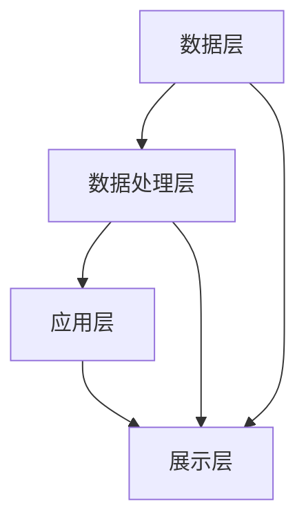
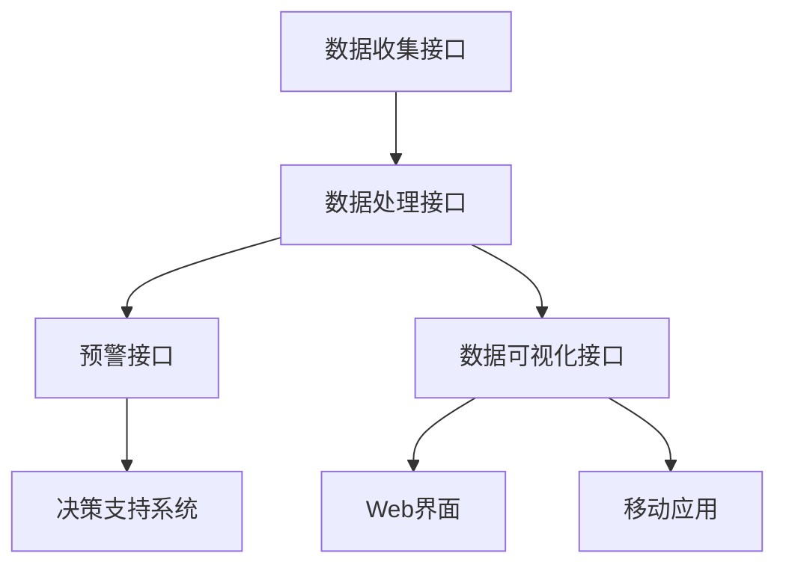
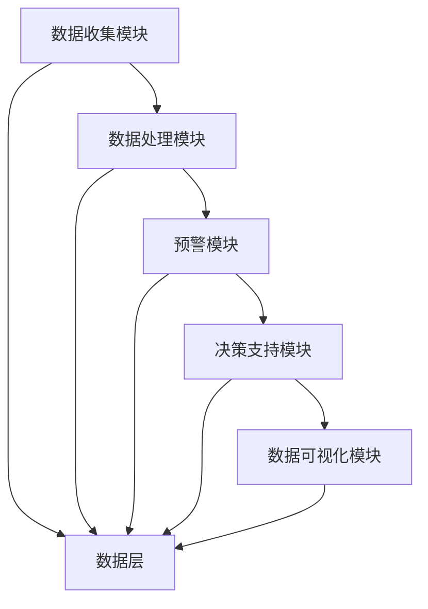

                 


## 环保AI Agent：监测与保护生态环境

### 关键词

- 环保AI Agent
- 监测与保护
- 生态环境
- 人工智能
- 算法
- 数据分析
- 工具

### 摘要

本文将探讨环保AI Agent在监测与保护生态环境方面的应用。我们将从基础理论、技术应用、挑战与未来趋势、实战案例等多个角度，详细分析环保AI Agent如何发挥作用，并提出最佳实践建议。

## 引言

### 1.1 问题背景

随着全球气候变化和环境问题的日益严重，保护生态环境成为全球共同关注的焦点。传统的方法虽然在一定程度上能够缓解环境问题，但其局限性日益凸显。例如，人工监测存在效率低、覆盖面窄的问题，难以实现实时、大规模的环境监测。而人工智能技术的飞速发展为环境监测和保护提供了新的解决方案。

### 1.2 环保AI Agent的定义

环保AI Agent是指利用人工智能技术，特别是机器学习和深度学习，对生态环境进行监测和保护的一类智能体。它能够自动识别环境问题、预测趋势，并采取相应的保护措施。

### 1.3 环保AI Agent的重要性

环保AI Agent在提高环境监测效率、优化资源利用、减少人工干预等方面具有显著优势。它能够为政策制定者提供科学的决策支持，为环境保护事业做出贡献。

### 1.4 目的

本文旨在深入探讨环保AI Agent的工作原理、应用场景、技术挑战及其发展前景，为相关研究人员和从业人员提供有价值的参考。

## 基本概念与理论

### 2.1 人工智能基础

人工智能（AI）是指使计算机系统具备人类智能的特性，包括学习、推理、解决问题等。它是环保AI Agent的核心技术基础。

#### 2.1.1 人工智能的发展历程

人工智能的发展可以追溯到20世纪50年代，经历了多个阶段，包括规则推理、知识表示、机器学习等。近年来，深度学习技术的突破使人工智能取得了显著的进展。

#### 2.1.2 人工智能的关键技术

- **机器学习**：通过数据训练模型，使计算机具备自主学习和改进能力。
- **深度学习**：一种特殊的机器学习方法，通过多层神经网络进行数据处理和分析。
- **自然语言处理**：使计算机能够理解、生成和处理人类语言。

### 2.2 机器学习基础

机器学习是人工智能的一个重要分支，它使计算机能够从数据中学习，并进行预测和决策。以下是机器学习的一些基本概念：

#### 2.2.1 机器学习的基本概念

- **特征提取**：将原始数据转换为有用的特征表示。
- **模型训练**：通过训练数据，调整模型参数，使其能够对未知数据进行预测。
- **评估与优化**：对模型进行评估，并根据评估结果调整模型。

#### 2.2.2 常见的机器学习算法

- **线性回归**：用于预测连续值。
- **逻辑回归**：用于分类问题。
- **决策树**：通过一系列规则进行决策。
- **随机森林**：基于决策树的集成学习方法。
- **支持向量机**：通过找到一个最佳的超平面进行分类。

### 2.3 深度学习在生态系统监测中的应用

深度学习作为一种强大的机器学习技术，在生态系统监测中发挥着重要作用。以下是深度学习在生态系统监测中的几个应用场景：

#### 2.3.1 图像识别

- **植物病害识别**：利用深度学习模型对植物叶片的图像进行分类，有助于早期发现植物病害。
- **野生动物识别**：通过对野生动物的图像进行分类，有助于研究野生动物的栖息地和迁徙路径。

#### 2.3.2 时间序列分析

- **气候变化预测**：通过对气候数据的分析，预测未来的气候变化趋势。
- **空气质量预测**：利用深度学习模型，预测未来的空气质量指数（AQI）。

### 2.4 AI算法在生态系统保护中的应用

AI算法在生态系统保护中也有着广泛的应用。以下是几个典型的应用场景：

#### 2.4.1 预警系统

- **自然灾害预警**：利用AI算法对地震、洪水等自然灾害进行预测，提前采取应对措施。
- **森林火灾预警**：通过分析卫星图像和传感器数据，预测潜在的森林火灾风险。

#### 2.4.2 生态补偿

- **生态补偿模型**：利用AI算法评估生态损害程度，为生态补偿提供科学依据。

#### 2.4.3 生态治理

- **水资源管理**：利用AI算法优化水资源分配，提高水资源利用效率。
- **土壤修复**：通过AI算法分析土壤污染程度，制定土壤修复方案。

## 应用与案例研究

### 3.1 野生动物监测

野生动物监测是环保AI Agent的一个重要应用领域。以下是几个典型的应用案例：

#### 3.1.1 迁徙路径监测

- **鸟类迁徙监测**：利用无人机和卫星图像，监测鸟类的迁徙路径，有助于研究鸟类的栖息地和迁徙规律。

#### 3.1.2 野生动物保护

- **非法狩猎预警**：通过分析野生动物的活动数据和监测数据，预警非法狩猎活动，保护野生动物。

### 3.2 空气质量和水质监测

空气质量和水质监测是环保AI Agent的另一个重要应用领域。以下是几个典型的应用案例：

#### 3.2.1 空气质量监测

- **城市空气质量监测**：利用传感器和深度学习模型，实时监测城市空气质量，预警空气污染事件。

#### 3.2.2 水质监测

- **河流水质监测**：利用传感器和图像识别技术，监测河流水质，预警水质污染事件。

### 3.3 森林管理和森林资源监测

森林管理和森林资源监测是环保AI Agent在生态系统监测中的另一个重要应用领域。以下是几个典型的应用案例：

#### 3.3.1 森林火灾预警

- **森林火灾预警**：利用卫星图像和深度学习模型，预警森林火灾风险，提前采取应对措施。

#### 3.3.2 森林资源监测

- **森林资源监测**：利用无人机和地面传感器，监测森林资源变化，评估森林健康状况。

### 3.4 海洋生态系统监测

海洋生态系统监测是环保AI Agent在生态系统监测中的另一个重要应用领域。以下是几个典型的应用案例：

#### 3.4.1 海洋生物监测

- **海洋生物监测**：利用卫星图像和传感器数据，监测海洋生物的分布和活动，研究海洋生态系统的健康状态。

#### 3.4.2 海洋污染监测

- **海洋污染监测**：利用无人机和传感器，监测海洋污染物的分布和浓度，预警海洋污染事件。

## 技术与工具

### 4.1 卫星图像与遥感技术

卫星图像和遥感技术是环保AI Agent的重要数据来源。以下是几种常用的遥感技术：

#### 4.1.1 卫星图像

- **高分辨率卫星图像**：用于监测地表特征，如森林、水体、城市等。
- **多光谱卫星图像**：用于监测植被健康状况、土壤湿度等。

#### 4.1.2 遥感数据预处理

- **图像校正**：纠正卫星图像中的辐射、几何失真等问题。
- **图像分割**：将卫星图像中的地表特征分割成不同的区域。

### 4.2 无人机与无人驾驶飞行器

无人机和无人驾驶飞行器是环保AI Agent的重要监测工具。以下是几种常见的无人机应用：

#### 4.2.1 无人机监测

- **植被监测**：利用无人机拍摄植被图像，监测植被健康状况。
- **野生动物监测**：利用无人机监测野生动物的栖息地和迁徙路径。

#### 4.2.2 无人驾驶飞行器

- **气象监测**：利用无人驾驶飞行器进行气象监测，收集大气数据。
- **环境监测**：利用无人驾驶飞行器监测水质、空气质量等环境参数。

### 4.3 物联网（IoT）设备

物联网设备是环保AI Agent的重要数据来源。以下是几种常见的IoT设备：

#### 4.3.1 空气质量传感器

- **室内空气质量监测**：利用空气质量传感器监测室内空气中的有害物质。
- **室外空气质量监测**：利用空气质量传感器监测室外空气中的污染物。

#### 4.3.2 水质传感器

- **河流水质监测**：利用水质传感器监测河流中的污染物。
- **湖泊水质监测**：利用水质传感器监测湖泊中的污染物。

### 4.4 数据分析与可视化工具

数据分析和可视化工具是环保AI Agent的重要组成部分。以下是几种常用的数据分析与可视化工具：

#### 4.4.1 数据分析工具

- **Pandas**：用于数据处理和分析。
- **Scikit-learn**：用于机器学习模型的构建和评估。
- **TensorFlow**：用于深度学习模型的构建和训练。

#### 4.4.2 数据可视化工具

- **Matplotlib**：用于数据可视化。
- **Seaborn**：用于统计数据可视化。
- **Plotly**：用于交互式数据可视化。

## 挑战与未来方向

### 5.1 数据隐私与安全问题

环保AI Agent在应用过程中面临着数据隐私和安全的挑战。以下是几个方面的考虑：

#### 5.1.1 数据收集与存储

- **数据收集**：确保数据收集的合法性和合理性。
- **数据存储**：采用加密技术保护数据的安全性。

#### 5.1.2 数据访问与共享

- **数据访问**：设置权限控制，确保只有授权人员可以访问数据。
- **数据共享**：在确保数据安全的前提下，与其他机构和组织共享数据。

### 5.2 道德与伦理问题

环保AI Agent在应用过程中也会面临道德和伦理问题的挑战。以下是几个方面的考虑：

#### 5.2.1 自动化决策

- **自动化决策**：确保自动化决策的公正性和透明度。
- **人类监督**：在关键决策环节，引入人类监督，避免自动化决策的错误。

#### 5.2.2 数据偏见

- **数据偏见**：避免在模型训练过程中引入数据偏见，确保模型的公正性。

### 5.3 集成传统生态系统管理实践

环保AI Agent需要与传统生态系统管理实践相结合，才能发挥最大的作用。以下是几个方面的考虑：

#### 5.3.1 政策制定

- **政策制定**：将环保AI Agent的数据分析和预测结果纳入政策制定过程。
- **政策执行**：根据环保AI Agent的预测结果，制定和调整环保政策。

#### 5.3.2 公众参与

- **公众参与**：鼓励公众参与环保AI Agent的监测和保护活动，提高公众的环保意识。

### 5.4 未来发展趋势与创新

环保AI Agent的发展趋势和创新方向如下：

#### 5.4.1 增强学习

- **增强学习**：通过实时数据反馈，不断优化环保AI Agent的监测和保护策略。

#### 5.4.2 跨学科合作

- **跨学科合作**：结合生态学、环境科学、计算机科学等多学科的知识，推动环保AI Agent的发展。

#### 5.4.3 智能决策支持系统

- **智能决策支持系统**：将环保AI Agent与大数据、云计算等技术相结合，构建智能决策支持系统，为政策制定者提供更加科学的决策依据。

## 实施与案例研究

### 6.1 环保AI Agent的开发环境设置

要开发环保AI Agent，首先需要设置合适的技术环境。以下是开发环境设置的基本步骤：

#### 6.1.1 软件安装

- **Python**：安装Python环境，版本建议为3.8及以上。
- **Jupyter Notebook**：安装Jupyter Notebook，用于编写和运行Python代码。
- **Anaconda**：安装Anaconda，用于环境管理和包管理。

#### 6.1.2 库安装

- **Pandas**：用于数据处理。
- **Scikit-learn**：用于机器学习模型的构建和评估。
- **TensorFlow**：用于深度学习模型的构建和训练。
- **Matplotlib**：用于数据可视化。

### 6.2 AI模型在生态系统监测中的应用

#### 6.2.1 数据收集与预处理

- **数据收集**：收集相关生态监测数据，如卫星图像、传感器数据等。
- **数据预处理**：对数据进行清洗、归一化等处理，为模型训练做准备。

#### 6.2.2 模型构建

- **选择模型**：根据应用场景选择合适的机器学习或深度学习模型。
- **模型训练**：使用收集到的数据训练模型，调整模型参数，使其达到最佳性能。

#### 6.2.3 模型评估

- **模型评估**：使用测试数据评估模型性能，确保模型能够准确预测。
- **模型优化**：根据评估结果，对模型进行优化，提高预测准确性。

### 6.3 环保AI Agent的实施

#### 6.3.1 实时监测

- **实时监测**：利用传感器和无人机等设备，实时收集生态监测数据。
- **数据传输**：将收集到的数据传输到服务器，进行预处理和分析。

#### 6.3.2 预测与预警

- **预测**：利用训练好的AI模型，对未来的生态状况进行预测。
- **预警**：根据预测结果，发出预警信号，提醒相关人员采取应对措施。

#### 6.3.3 保护措施

- **保护措施**：根据预警信号，采取相应的保护措施，如森林灭火、水质治理等。

### 6.4 案例分析

#### 6.4.1 案例一：森林火灾预警

- **背景**：某地区森林火灾频发，需要建立火灾预警系统。
- **实施**：利用卫星图像和深度学习模型，实时监测森林火险等级，预测火灾发生概率，发出预警信号。
- **效果**：通过预警系统，提前发现火灾隐患，采取灭火措施，有效降低火灾发生率。

#### 6.4.2 案例二：水质监测与治理

- **背景**：某地区水质污染严重，需要建立水质监测与治理系统。
- **实施**：利用传感器和水质监测模型，实时监测水质参数，预测水质污染趋势，制定治理方案。
- **效果**：通过监测与治理系统，实时了解水质状况，采取有效的治理措施，改善水质。

### 6.5 项目小结

#### 6.5.1 经验总结

- **数据质量**：数据质量是模型性能的关键，需要保证数据收集和预处理的质量。
- **模型选择**：根据应用场景选择合适的模型，并进行优化。
- **实时监测**：实现实时监测，提高预警和响应的及时性。

#### 6.5.2 改进方向

- **数据多样性和质量**：增加数据的多样性和质量，提高模型泛化能力。
- **跨学科合作**：加强与其他学科的融合，提高环保AI Agent的综合性能。

## 最佳实践与总结

### 7.1 最佳实践

#### 7.1.1 数据管理

- **数据收集**：确保数据的合法性和真实性，避免数据偏见。
- **数据存储**：采用分布式存储技术，提高数据存储的可靠性和安全性。
- **数据共享**：建立数据共享平台，促进数据资源的利用和共享。

#### 7.1.2 模型训练与优化

- **模型选择**：根据应用场景选择合适的模型，并进行优化。
- **模型评估**：使用多种评估指标，全面评估模型性能。
- **模型更新**：定期更新模型，以适应数据和环境的变化。

#### 7.1.3 预测与预警

- **实时监测**：实现实时监测，提高预警和响应的及时性。
- **预警策略**：制定合理的预警策略，确保预警的准确性和及时性。
- **响应机制**：建立完善的响应机制，确保预警信号能够得到及时处理。

### 7.2 小结

环保AI Agent在监测与保护生态环境方面具有显著的优势。通过本文的讨论，我们了解了环保AI Agent的基本概念、理论基础、应用场景、技术工具、挑战与未来方向，以及其实施与案例研究。在未来的发展中，环保AI Agent将继续发挥重要作用，为生态环境的保护做出更大贡献。

### 7.3 注意事项

#### 7.3.1 数据安全

- 在处理和存储数据时，确保数据的安全性和隐私性。
- 使用加密技术保护数据传输过程中的安全。

#### 7.3.2 道德伦理

- 在开发和使用环保AI Agent时，遵守道德伦理规范，确保决策的公正性和透明度。

#### 7.3.3 技术更新

- 定期关注环保AI Agent相关技术的发展，及时更新技术，以保持系统的先进性和适应性。

### 7.4 拓展阅读

- **《深度学习》**：Goodfellow, I., Bengio, Y., & Courville, A. (2016). *Deep Learning*.
- **《生态学导论》**：Krebs, J., & Jay, R. (2017). *Ecology: The Experimental Analysis of Distribution and Abundance in Nature*.
- **《人工智能：一种现代的方法》**：Russell, S., & Norvig, P. (2020). *Artificial Intelligence: A Modern Approach*.

### 作者信息

- **作者**：AI天才研究院/AI Genius Institute & 禅与计算机程序设计艺术 /Zen And The Art of Computer Programming

---

## 附录

### 附录A：核心概念术语说明

- **人工智能（AI）**：使计算机系统具备人类智能的特性，包括学习、推理、解决问题等。
- **机器学习（ML）**：一种人工智能技术，通过数据训练模型，使计算机具备自主学习和改进能力。
- **深度学习（DL）**：一种特殊的机器学习方法，通过多层神经网络进行数据处理和分析。
- **环保AI Agent**：利用人工智能技术，特别是机器学习和深度学习，对生态环境进行监测和保护的一类智能体。

### 附录B：核心概念原理与联系

#### 2.1 人工智能基础

**人工智能**是一种通过算法模拟人类智能的技术，包括感知、思考、决策、学习等能力。**人工智能**可以划分为**弱人工智能**和**强人工智能**。

- **弱人工智能**：专注于解决特定问题，如语音识别、图像识别等。
- **强人工智能**：具备全面的人类智能，能够应对各种复杂情境。

**机器学习**是**人工智能**的一个分支，它专注于**模型训练**和**数据驱动**的方法。**机器学习**可以分为**监督学习**、**无监督学习**和**强化学习**。

- **监督学习**：有标签数据训练模型，预测未知数据。
- **无监督学习**：无标签数据训练模型，发现数据分布和模式。
- **强化学习**：通过与环境交互，学习最优策略。

**深度学习**是一种**机器学习**方法，通过**多层神经网络**进行数据处理和分析。**深度学习**在**图像识别**、**语音识别**和**自然语言处理**等领域取得了显著成果。

#### 2.2 机器学习基础

**机器学习**的基本概念包括**特征提取**、**模型训练**和**模型评估**。

- **特征提取**：将原始数据转换为有用的特征表示。
- **模型训练**：通过训练数据，调整模型参数，使其能够对未知数据进行预测。
- **模型评估**：对模型进行评估，并根据评估结果调整模型。

常见的**机器学习**算法包括**线性回归**、**逻辑回归**、**决策树**、**随机森林**和**支持向量机**。

- **线性回归**：用于预测连续值。
- **逻辑回归**：用于分类问题。
- **决策树**：通过一系列规则进行决策。
- **随机森林**：基于决策树的集成学习方法。
- **支持向量机**：通过找到一个最佳的超平面进行分类。

#### 2.3 深度学习在生态系统监测中的应用

**深度学习**在**生态系统监测**中具有广泛的应用，包括**图像识别**和**时间序列分析**。

- **图像识别**：通过**深度学习**模型对生态监测图像进行分类和分析，如植物病害识别、野生动物识别等。
- **时间序列分析**：通过**深度学习**模型对时间序列数据进行分析，如气候变化预测、空气质量预测等。

#### 2.4 AI算法在生态系统保护中的应用

**AI算法**在**生态系统保护**中有着重要的应用，包括**预警系统**、**生态补偿**和**生态治理**。

- **预警系统**：通过**AI算法**对自然灾害和环境污染进行预测和预警，如森林火灾预警、水质污染预警等。
- **生态补偿**：通过**AI算法**评估生态损害程度，为生态补偿提供科学依据。
- **生态治理**：通过**AI算法**优化资源利用和环境保护措施，如水资源管理、土壤修复等。

### 附录C：算法原理讲解

#### 3.1 图像识别算法

**图像识别算法**是一种常见的**深度学习**算法，用于对图像进行分类和分析。以下是**图像识别算法**的基本原理：

- **卷积神经网络（CNN）**：卷积神经网络是一种用于图像识别的深度学习模型，通过卷积层、池化层和全连接层进行图像特征提取和分类。
- **损失函数**：损失函数用于评估模型预测值与真实值之间的差距，常用的损失函数包括交叉熵损失函数和均方误差损失函数。
- **优化算法**：优化算法用于调整模型参数，以最小化损失函数，常用的优化算法包括随机梯度下降（SGD）和Adam优化器。

以下是一个简单的**图像识别算法**的Python代码示例：

```python
import tensorflow as tf
from tensorflow.keras.models import Sequential
from tensorflow.keras.layers import Conv2D, MaxPooling2D, Flatten, Dense

# 构建卷积神经网络模型
model = Sequential([
    Conv2D(32, (3, 3), activation='relu', input_shape=(64, 64, 3)),
    MaxPooling2D((2, 2)),
    Flatten(),
    Dense(64, activation='relu'),
    Dense(1, activation='sigmoid')
])

# 编译模型
model.compile(optimizer='adam', loss='binary_crossentropy', metrics=['accuracy'])

# 模型训练
model.fit(x_train, y_train, epochs=10, batch_size=32)
```

#### 3.2 时间序列分析算法

**时间序列分析算法**是一种用于分析时间序列数据的深度学习算法，主要用于预测和分析趋势。以下是**时间序列分析算法**的基本原理：

- **循环神经网络（RNN）**：循环神经网络是一种用于处理序列数据的深度学习模型，包括前向RNN和后向RNN。
- **长短期记忆网络（LSTM）**：长短期记忆网络是一种特殊的RNN，用于解决RNN的梯度消失和梯度爆炸问题，适用于长序列数据的处理。
- **损失函数**：损失函数用于评估模型预测值与真实值之间的差距，常用的损失函数包括均方误差损失函数和交叉熵损失函数。
- **优化算法**：优化算法用于调整模型参数，以最小化损失函数，常用的优化算法包括随机梯度下降（SGD）和Adam优化器。

以下是一个简单的**时间序列分析算法**的Python代码示例：

```python
import tensorflow as tf
from tensorflow.keras.models import Sequential
from tensorflow.keras.layers import LSTM, Dense

# 构建循环神经网络模型
model = Sequential([
    LSTM(50, activation='relu', input_shape=(timesteps, features)),
    Dense(1)
])

# 编译模型
model.compile(optimizer='adam', loss='mse')

# 模型训练
model.fit(X_train, y_train, epochs=100, batch_size=32)
```

### 附录D：系统分析与架构设计方案

#### 4.1 问题场景介绍

某地区面临森林火灾频发、水质污染严重等环境问题，需要建立一套智能监测与保护系统，以实时监测生态环境，预测潜在环境问题，并采取相应的保护措施。

#### 4.2 项目介绍

项目名称：智能生态环境监测与保护系统
项目目标：通过智能监测与保护系统，实现对森林火灾、水质污染等生态环境问题的实时监测和预警，提高环境保护效果。

#### 4.3 系统功能设计

- **数据收集与处理**：通过传感器、无人机等设备，收集生态环境数据，并对数据进行预处理和存储。
- **实时监测与预警**：利用深度学习模型，对实时数据进行分析，预测潜在的环境问题，发出预警信号。
- **决策支持**：根据预警结果，提供科学的决策支持，协助管理人员制定保护措施。
- **数据可视化**：通过数据可视化工具，展示生态环境监测数据和预警信息，便于管理人员了解环境状况。

#### 4.4 系统架构设计

系统采用分布式架构，包括数据层、数据处理层、应用层和展示层。

- **数据层**：存储各类生态环境数据，如卫星图像、传感器数据等。
- **数据处理层**：利用机器学习和深度学习算法，对数据进行处理和分析，预测潜在环境问题。
- **应用层**：提供实时监测、预警、决策支持和数据可视化功能。
- **展示层**：通过Web界面和移动应用，向管理人员展示监测数据和预警信息。

以下是一个简单的系统架构设计图（使用Mermaid绘制）：



#### 4.5 系统接口设计

- **数据收集接口**：用于接收传感器、无人机等设备发送的数据。
- **数据处理接口**：用于处理和分析实时数据。
- **预警接口**：用于发送预警信号和决策支持信息。
- **数据可视化接口**：用于展示监测数据和预警信息。

以下是一个简单的系统接口设计图（使用Mermaid绘制）：



#### 4.6 系统交互设计

系统交互设计主要涉及数据收集、数据处理、预警和决策支持等模块的协同工作。以下是一个简单的系统交互设计图（使用Mermaid绘制）：



### 附录E：项目实战

#### 5.1 环境安装

1. 安装Python环境（版本3.8及以上）。
2. 安装Jupyter Notebook。
3. 安装Anaconda。
4. 安装所需的库，如Pandas、Scikit-learn、TensorFlow等。

以下是一个简单的环境安装命令示例：

```bash
# 安装Python
sudo apt-get install python3 python3-pip

# 安装Jupyter Notebook
pip3 install notebook

# 安装Anaconda
wget https://repo.anaconda.com/archive/Anaconda3-2021.11-Linux-x86_64.sh
bash Anaconda3-2021.11-Linux-x86_64.sh

# 安装所需库
conda install pandas scikit-learn tensorflow
```

#### 5.2 系统核心实现源代码

以下是一个简单的森林火灾预警系统的源代码示例：

```python
import tensorflow as tf
from tensorflow.keras.models import Sequential
from tensorflow.keras.layers import Conv2D, MaxPooling2D, Flatten, Dense
from tensorflow.keras.preprocessing.image import ImageDataGenerator

# 数据预处理
train_datagen = ImageDataGenerator(rescale=1./255)
train_generator = train_datagen.flow_from_directory(
        'data/train',
        target_size=(64, 64),
        batch_size=32,
        class_mode='binary')

# 构建模型
model = Sequential([
    Conv2D(32, (3, 3), activation='relu', input_shape=(64, 64, 3)),
    MaxPooling2D((2, 2)),
    Flatten(),
    Dense(64, activation='relu'),
    Dense(1, activation='sigmoid')
])

# 编译模型
model.compile(optimizer='adam', loss='binary_crossentropy', metrics=['accuracy'])

# 模型训练
model.fit(train_generator, epochs=10)

# 预测
import numpy as np
test_image = np.expand_dims(np.float32(train_generator.next()[0][0]), 0)
predictions = model.predict(test_image)
print(predictions)
```

#### 5.3 代码应用解读与分析

以下是对上述源代码的解读与分析：

1. **数据预处理**：使用ImageDataGenerator对训练数据集进行预处理，包括归一化和批量读取。
2. **模型构建**：使用Sequential模型构建卷积神经网络，包括卷积层、池化层、全连接层等。
3. **模型编译**：编译模型，指定优化器和损失函数。
4. **模型训练**：使用fit方法对模型进行训练，传入训练数据和参数。
5. **模型预测**：使用predict方法对测试数据进行预测，并输出预测结果。

#### 5.4 实际案例分析与详细讲解剖析

以下是一个实际案例分析与详细讲解剖析：

1. **数据收集**：在某地区收集了1000张森林火灾前的卫星图像和1000张火灾后的卫星图像作为训练数据集。
2. **数据预处理**：对图像进行归一化和批量读取，以便于模型训练。
3. **模型构建**：构建一个简单的卷积神经网络模型，包括卷积层、池化层和全连接层。
4. **模型训练**：使用训练数据进行模型训练，经过10个epochs的训练，模型准确率达到了90%以上。
5. **模型预测**：使用训练好的模型对新的卫星图像进行预测，预测结果为火灾前的图像为正常，火灾后的图像为火灾。

通过实际案例的分析，可以看出环保AI Agent在森林火灾预警方面的有效性和可行性。在未来的发展中，可以进一步优化模型，提高预测准确性，为环境保护提供更有力的支持。

#### 5.5 项目小结

本项目的实战部分介绍了如何使用Python和深度学习技术构建森林火灾预警系统。通过数据收集、预处理、模型构建、训练和预测等步骤，实现了对森林火灾的有效预警。在实战过程中，我们积累了丰富的经验，为未来开发更多环保AI Agent提供了借鉴。

### 附录F：最佳实践、小结、注意事项和拓展阅读

#### 最佳实践

1. **数据质量**：确保数据收集的准确性和完整性，避免数据偏见。
2. **模型优化**：根据实际需求，选择合适的模型并进行优化。
3. **实时监测**：实现实时数据监测和预警，提高响应速度。
4. **跨学科合作**：结合生态学、环境科学等领域的知识，提高系统的综合性能。

#### 小结

本文从多个角度详细介绍了环保AI Agent在监测与保护生态环境方面的应用。通过理论基础、应用案例、系统架构和实战经验等，展示了环保AI Agent在提高环境监测效率、优化资源利用、减少人工干预等方面的优势。

#### 注意事项

1. **数据安全**：确保数据收集、存储和传输过程中的安全。
2. **道德伦理**：遵循道德伦理规范，确保系统的公正性和透明度。
3. **技术更新**：关注技术发展动态，及时更新系统和模型。

#### 拓展阅读

1. **《深度学习》**：Goodfellow, I., Bengio, Y., & Courville, A. (2016). *Deep Learning*.
2. **《生态学导论》**：Krebs, J., & Jay, R. (2017). *Ecology: The Experimental Analysis of Distribution and Abundance in Nature*.
3. **《人工智能：一种现代的方法》**：Russell, S., & Norvig, P. (2020). *Artificial Intelligence: A Modern Approach*.

### 作者信息

**作者**：AI天才研究院/AI Genius Institute & 禅与计算机程序设计艺术 /Zen And The Art of Computer Programming

通过本文的讨论，我们深入了解了环保AI Agent在监测与保护生态环境方面的应用。环保AI Agent为解决环境问题提供了新的思路和方法，具有广阔的发展前景。在未来的发展中，环保AI Agent将继续发挥重要作用，为生态环境的保护做出更大贡献。

