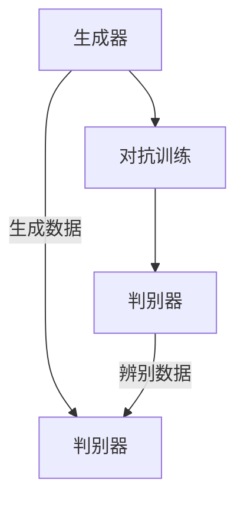
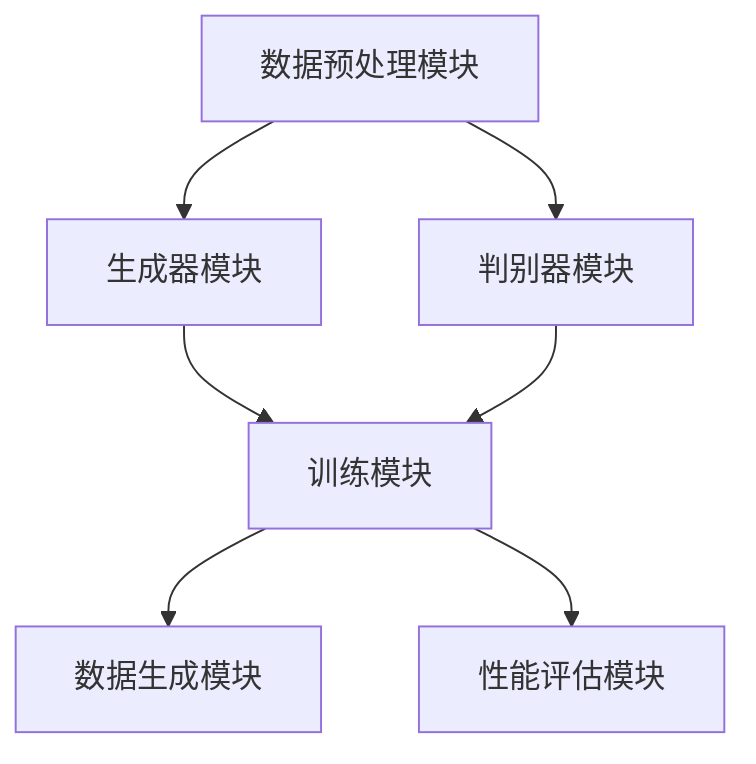
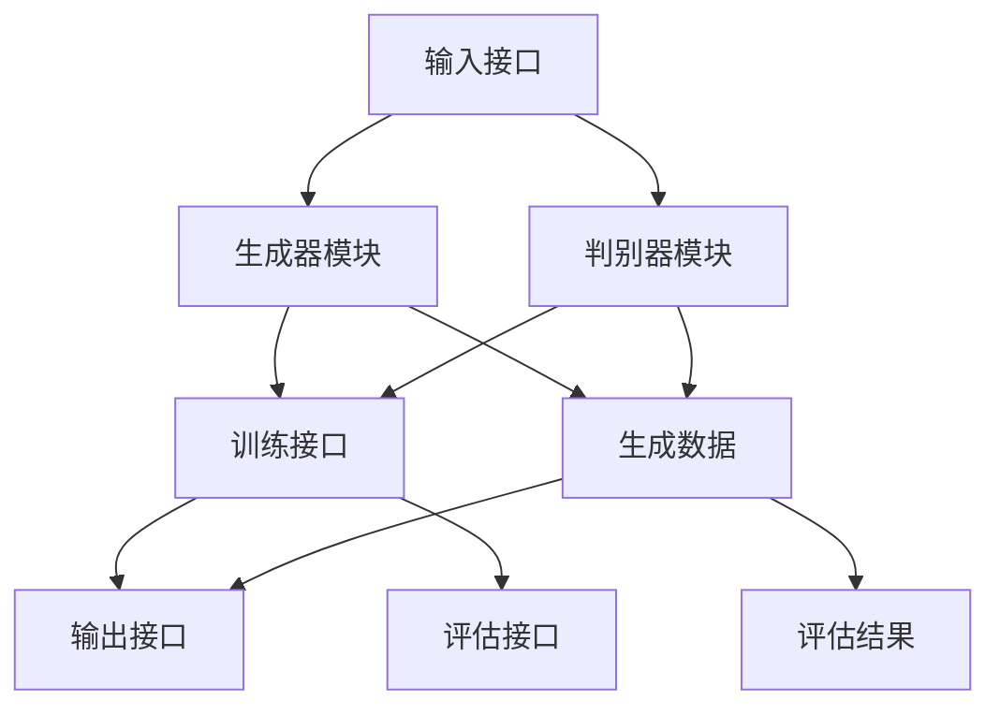

                 

### 第1章: 生成对抗网络背景介绍

#### 1.1 问题背景

生成对抗网络（GAN）是深度学习领域中的一种革命性模型，由Ian Goodfellow及其同事在2014年首次提出。GAN的核心思想是利用生成器和判别器两个神经网络之间的对抗训练，来生成逼真的数据。生成器的任务是从一个随机噪声分布中生成数据，而判别器的任务是区分这些生成数据与真实数据。通过这种对抗训练，生成器能够不断优化其生成的数据，使其越来越接近真实数据。

生成对抗网络的应用非常广泛，它不仅能够生成逼真的图像，还可以应用于自然语言处理、视频生成、音频处理等众多领域。因此，GAN被认为是一种具有巨大潜力的AI核心技术。

#### 1.2 问题描述

GAN的目的是训练一个生成器G，使其生成的数据能够以假乱真，以至于判别器D无法区分这些数据与真实数据。具体来说，生成器G从噪声分布中采样一个随机向量z，然后通过一个复杂的映射函数G(z)将其转换为数据x'，这些数据x'应尽可能地接近真实数据x。判别器D则接受真实数据x和生成数据x'作为输入，并输出一个概率值，表示其判断输入数据为真实的概率。

GAN的训练目标是最小化判别器的损失函数，同时最大化生成器的损失函数。通过这样的对抗训练，生成器能够不断优化其生成策略，使得生成数据越来越逼真，而判别器则不断学习如何更准确地辨别生成数据和真实数据。

#### 1.3 问题解决

GAN的解决思路是通过生成器和判别器的不断对抗来优化两者。具体过程如下：

1. **初始化参数**：首先初始化生成器G和判别器D的参数。
2. **生成数据**：生成器G从噪声分布中采样一个随机向量z，然后通过映射函数G(z)生成假数据x'。
3. **判断数据**：判别器D接收一组数据，这组数据包括真实数据x和生成数据x'。判别器需要输出一个概率值，表示其判断输入数据为真实的概率。
4. **更新参数**：根据判别器的输出，生成器和判别器的参数分别进行更新。生成器的目标是使其生成的数据让判别器认为这是真实的，而判别器的目标是能够准确地区分真实数据和生成数据。

这种对抗训练过程不断重复，生成器和判别器的性能都会不断提高，最终生成器能够生成几乎与真实数据无法区分的高质量数据。

#### 1.4 边界与外延

GAN的应用范围非常广泛，包括但不限于以下领域：

- **图像生成**：GAN可以生成高分辨率的、高质量的图像，如人脸、风景、动物等。
- **自然语言处理**：GAN可以生成连贯、有意义的文本，可以应用于生成新闻报道、小说等。
- **视频生成**：GAN可以生成连续的视频序列，如运动中的物体、动态场景等。
- **医学影像**：GAN可以用于生成高质量的医学影像，如X光片、MRI等。

然而，GAN也存在一些挑战：

- **训练难度**：GAN的训练过程不稳定，容易出现模式崩溃（mode collapse）等问题。
- **生成质量**：尽管GAN可以生成高质量的数据，但生成数据的质量往往取决于训练数据的分布和质量。
- **数据多样性**：GAN在生成多样性的数据方面仍然存在挑战，特别是在高维数据空间中。

#### 1.5 概念结构与核心要素组成

生成对抗网络的核心组成部分包括：

- **生成器（Generator）**：接收一个随机噪声向量z，通过复杂的神经网络映射生成假数据x'。
- **判别器（Discriminator）**：接收一组数据（真实数据x和生成数据x'），并输出一个概率值，表示其判断输入数据为真实的概率。
- **对抗训练（Adversarial Training）**：生成器和判别器通过对抗训练来不断优化其参数。

GAN的训练过程是一个动态平衡的过程，生成器和判别器的性能在训练过程中不断变化。通过这种对抗训练，生成器能够生成越来越逼真的数据，而判别器则能够越来越准确地辨别生成数据和真实数据。

总的来说，生成对抗网络是一种极具潜力的AI技术，它在各个领域都有广泛的应用前景。通过理解GAN的核心概念和原理，我们可以更好地利用这一技术来推动人工智能的发展。

### 第2章: GAN的核心概念与联系

#### 2.1 GAN的核心概念

生成对抗网络（GAN）的核心概念主要包括生成器（Generator）、判别器（Discriminator）和对抗训练（Adversarial Training）。这三个核心概念相互作用，共同构成了GAN的工作原理。

- **生成器（Generator）**：生成器是一个神经网络，它的任务是接收一个随机噪声向量z，并生成一个与真实数据x相似的数据x'。生成器的目标是生成足够逼真的数据，使得判别器无法区分这些数据是真实数据还是生成数据。

- **判别器（Discriminator）**：判别器也是一个神经网络，它的任务是接收一组数据（真实数据x和生成数据x'），并输出一个概率值，表示其判断输入数据为真实的概率。判别器的目标是能够准确地区分真实数据和生成数据。

- **对抗训练（Adversarial Training）**：对抗训练是指生成器和判别器之间的动态训练过程。生成器和判别器相互竞争，生成器试图生成更逼真的数据，而判别器则试图更准确地辨别生成数据和真实数据。这种对抗关系使得两者在训练过程中不断优化，从而提高生成数据的逼真度和判别器的辨别能力。

#### 2.2 GAN的核心属性特征对比表格

| 特征         | 生成器（Generator） | 判别器（Discriminator） |
| ------------ | ------------------- | ----------------------- |
| 目标         | 生成逼真的数据     | 准确区分真实与虚假数据 |
| 损失函数     | 反对判别器的损失函数 | 准确区分真实与虚假数据的损失函数 |
| 训练策略     | 优化生成器与判别器的参数 | 优化生成器与判别器的参数 |
| 联系         | 与判别器进行对抗训练 | 与生成器进行对抗训练 |

通过这个表格，我们可以清晰地看到生成器和判别器在GAN中的角色和任务。生成器负责生成数据，判别器负责区分数据。两者通过对抗训练相互竞争，共同提高生成数据和辨别数据的能力。

#### 2.3 GAN的ER实体关系图架构

为了更直观地理解GAN的实体关系，我们可以使用Mermaid绘制一个ER（Entity-Relationship）图来表示生成器、判别器和对抗训练之间的关系。



在上面的ER图中，生成器（A）和判别器（C）通过对抗训练（B）相互关联。生成器生成数据并传递给判别器，判别器通过辨别数据的结果反过来影响生成器的训练过程。这种互动关系使得GAN能够在训练过程中不断优化生成器和判别器的性能。

通过上述核心概念和联系的介绍，我们可以更好地理解生成对抗网络的工作原理。接下来，我们将进一步深入探讨GAN的算法原理，以及如何通过数学模型和流程图来描述GAN的训练过程。

### 第3章: GAN的算法原理讲解

#### 3.1 算法原理

生成对抗网络（GAN）的算法原理可以概括为通过生成器和判别器的对抗训练来实现数据生成。生成器的目标是生成尽可能逼真的数据，而判别器的目标是准确区分生成数据和真实数据。这两个网络通过不断的学习和调整，最终实现高质量的图像或其他类型的数据生成。

GAN的训练过程是基于生成器和判别器之间的对抗博弈。生成器和判别器交替更新参数，通过对抗训练逐步提高生成数据的质量和判别器的辨别能力。具体来说，GAN的训练过程可以分为以下几个步骤：

1. **初始化参数**：首先初始化生成器G和判别器D的参数。生成器G从随机噪声分布中采样一个随机向量z，然后通过一个复杂的映射函数G(z)生成假数据x'。判别器D接收一组数据，这组数据包括真实数据x和生成数据x'。

2. **生成数据**：生成器G生成假数据x'。这些数据通常是图像、文本或其他类型的特征数据。

3. **判断数据**：判别器D接收真实数据x和生成数据x'，并输出一个概率值，表示其判断输入数据为真实的概率。具体来说，判别器D的输出可以表示为D(x)和D(G(z))，其中D(x)表示对真实数据的判断概率，D(G(z))表示对生成数据的判断概率。

4. **更新参数**：根据判别器的输出结果，生成器和判别器的参数分别进行更新。生成器的目标是最小化生成数据的判断概率，即最大化D(G(z))。判别器的目标是最小化真实数据和生成数据的判断误差，即最大化D(x)和D(G(z))。

5. **重复训练**：重复上述步骤，生成器和判别器不断进行对抗训练。每次迭代中，生成器和判别器的性能都会有所提升，最终生成器能够生成高质量的数据，而判别器能够准确地区分真实数据和生成数据。

#### 3.2 算法mermaid流程图

为了更直观地展示GAN的训练过程，我们可以使用Mermaid绘制一个流程图。

```mermaid
graph TD
    A[初始化G和D参数] --> B[生成G(z)]
    B --> C[判别D(x), D(G(z))]
    C --> D{更新G和D参数}
    D --> B
```

在这个流程图中，A表示初始化生成器G和判别器D的参数，B表示生成器G生成假数据x'，C表示判别器D判断输入数据的真实性，D表示根据判别器的判断结果更新生成器和判别器的参数。这个过程不断重复，直到生成器和判别器的性能达到预期。

#### 3.3 算法原理详细讲解

GAN的训练过程是基于生成器和判别器的对抗博弈。在每次训练迭代中，生成器和判别器都试图优化自己的性能，但同时也相互制约。具体来说，GAN的训练过程可以分为以下几个阶段：

1. **初始化阶段**：首先初始化生成器G和判别器D的参数。生成器G通常是一个复杂的神经网络，它接收一个随机噪声向量z，并通过多个隐层生成假数据x'。判别器D也是一个复杂的神经网络，它接收真实数据x和生成数据x'，并输出一个概率值表示其判断输入数据为真实的概率。

2. **生成阶段**：生成器G从随机噪声分布中采样一个随机向量z，然后通过映射函数G(z)生成假数据x'。这些假数据通常与真实数据具有相似的特征，但仍然存在差异。生成器G的目标是生成足够逼真的数据，使得判别器D认为这些数据是真实的。

3. **判断阶段**：判别器D接收一组数据，这组数据包括真实数据x和生成数据x'。判别器D的输出可以表示为D(x)和D(G(z))，其中D(x)表示对真实数据的判断概率，D(G(z))表示对生成数据的判断概率。理想情况下，判别器D应该能够准确地区分真实数据和生成数据，即D(x)接近1，D(G(z))接近0。

4. **更新阶段**：根据判别器的输出结果，生成器和判别器的参数分别进行更新。生成器的目标是最大化判别器对生成数据的判断概率，即最大化D(G(z))。这意味着生成器需要优化其生成数据的能力，使其更接近真实数据。判别器的目标是最大化真实数据和生成数据的判断误差，即最大化D(x)和D(G(z))。这意味着判别器需要优化其辨别数据的能力，能够准确地区分真实数据和生成数据。

5. **重复迭代**：生成器和判别器不断进行对抗训练，每次迭代中生成器和判别器的性能都会有所提升。这个过程是一个动态平衡的过程，生成器和判别器的性能在训练过程中不断变化，最终达到一个稳定的平衡点。

通过这种对抗训练，生成器能够生成越来越逼真的数据，而判别器则能够越来越准确地区分真实数据和生成数据。GAN的训练过程是一个持续优化的过程，通过不断调整生成器和判别器的参数，最终实现高质量的图像或其他类型的数据生成。

#### 3.4 算法原理举例说明

为了更好地理解GAN的算法原理，我们可以通过一个简单的例子来说明。

假设我们要使用GAN生成一张猫的图片。具体步骤如下：

1. **初始化参数**：首先初始化生成器G和判别器D的参数。生成器G接收一个随机噪声向量z，通过多个隐层生成一张猫的图片x'。判别器D接收一张真实猫的图片x和一张生成猫的图片x'，并输出一个概率值表示其判断输入数据为真实的概率。

2. **生成阶段**：生成器G从随机噪声分布中采样一个随机向量z，通过映射函数G(z)生成一张猫的图片x'。生成器G的目标是生成一张足够逼真的猫的图片，使得判别器D认为这是真实的。

3. **判断阶段**：判别器D接收真实猫的图片x和生成猫的图片x'，并输出一个概率值。如果判别器D认为生成猫的图片x'是真实的，则输出接近1的概率值；如果判别器D认为生成猫的图片x'是虚假的，则输出接近0的概率值。

4. **更新阶段**：根据判别器的输出结果，生成器和判别器的参数分别进行更新。生成器的目标是最大化判别器对生成猫的图片x'的判断概率，即最大化D(G(z))。这意味着生成器需要优化其生成猫的图片的能力，使其更接近真实猫的图片。判别器的目标是最大化真实猫的图片x和生成猫的图片x'的判断误差，即最大化D(x)和D(G(z))。这意味着判别器需要优化其辨别猫的图片的能力，能够准确地区分真实猫的图片和生成猫的图片。

5. **重复迭代**：生成器和判别器不断进行对抗训练，每次迭代中生成器和判别器的性能都会有所提升。通过多次迭代，生成器能够生成越来越逼真的猫的图片，而判别器能够越来越准确地区分真实猫的图片和生成猫的图片。

通过这个简单的例子，我们可以看到GAN的算法原理是如何在实际中应用的。生成器和判别器的对抗训练使得生成器能够生成高质量的数据，而判别器能够准确地区分真实数据和生成数据。

总的来说，生成对抗网络（GAN）的算法原理是一种通过生成器和判别器的对抗训练来实现数据生成的技术。通过不断的对抗训练，生成器和判别器的性能不断优化，最终实现高质量的图像或其他类型的数据生成。GAN的应用范围广泛，具有巨大的潜力。

### 第4章: GAN的数学模型和公式

#### 4.1 数学模型

生成对抗网络（GAN）的数学模型是理解其工作原理的关键。GAN的数学模型主要包括生成器的损失函数和判别器的损失函数。通过这两个损失函数，我们可以量化生成器和判别器的性能，并指导其优化过程。

**生成器的损失函数**

生成器的目标是生成足够逼真的数据，使得判别器无法区分这些数据与真实数据。生成器的损失函数通常定义为：

$$
L_G = -\log(D(G(z)))
$$

其中，$D(G(z))$表示判别器对生成器生成数据的判断概率。生成器的损失函数是判别器判断概率的对数，损失函数的值越小，表示生成器生成的数据越逼真。

**判别器的损失函数**

判别器的目标是准确区分真实数据和生成数据。判别器的损失函数通常定义为：

$$
L_D = -[\log(D(x)) + \log(1 - D(G(z))]
$$

其中，$D(x)$表示判别器对真实数据的判断概率，$1 - D(G(z))$表示判别器对生成数据的判断概率。判别器的损失函数是真实数据和生成数据的判断概率的对数之和，损失函数的值越小，表示判别器区分真实数据和生成数据的能力越强。

**整体损失函数**

生成对抗网络的整体损失函数是生成器损失函数和判别器损失函数的组合。整体损失函数通常定义为：

$$
L = L_G + L_D
$$

整体损失函数的目的是通过优化生成器和判别器的参数，使生成器的生成数据更逼真，同时使判别器更准确地区分真实数据和生成数据。

#### 4.2 公式详细讲解

**生成器的损失函数**

生成器的损失函数$- \log(D(G(z)))$可以理解为判别器对生成器生成数据的信任程度。具体来说，$D(G(z))$表示判别器对生成器生成数据的判断概率，即判别器认为生成数据是真实的概率。生成器的目标是最小化这个判断概率，使判别器认为生成数据是虚假的。因此，生成器的损失函数是判别器判断概率的对数，其值越小，表示生成器生成的数据越逼真。

**判别器的损失函数**

判别器的损失函数$-[\log(D(x)) + \log(1 - D(G(z)))]$表示判别器对真实数据和生成数据的判断误差。$D(x)$表示判别器对真实数据的判断概率，$1 - D(G(z))$表示判别器对生成数据的判断概率。判别器的目标是最小化这两个判断误差，即最大化真实数据和生成数据的判断概率，同时最小化生成数据的判断概率。这样，判别器可以准确地区分真实数据和生成数据。

**整体损失函数**

生成对抗网络的整体损失函数$L = L_G + L_D$是生成器和判别器的综合损失函数。整体损失函数的目的是通过优化生成器和判别器的参数，使生成器生成的数据更逼真，同时使判别器更准确地区分真实数据和生成数据。具体来说，生成器和判别器交替更新参数，生成器的目标是使判别器认为生成数据是虚假的，判别器的目标是使生成数据和真实数据的判断误差最小。

**推导与解释**

生成对抗网络的数学模型是基于最小二乘法和梯度下降法推导而来的。具体来说，生成器的损失函数和判别器的损失函数可以通过反向传播算法进行优化。在训练过程中，生成器和判别器交替更新参数，每次迭代都使得整体损失函数最小。通过这种方式，生成器和判别器在对抗训练中不断优化，最终实现高质量的图像或其他类型的数据生成。

**实际应用**

在生成对抗网络的数学模型中，生成器和判别器的损失函数可以应用于各种数据类型，如图像、文本、音频等。具体来说，生成器可以根据不同的数据类型设计不同的神经网络结构，判别器则可以学习如何区分不同类型的数据。通过这种灵活的数学模型，生成对抗网络可以广泛应用于各种数据生成任务，如图像生成、视频生成、自然语言生成等。

总的来说，生成对抗网络的数学模型是理解其工作原理的关键。通过生成器的损失函数和判别器的损失函数，我们可以量化生成器和判别器的性能，并指导其优化过程。通过这种对抗训练，生成器和判别器可以相互促进，实现高质量的数据生成。

### 第5章: GAN的应用场景与案例分析

#### 5.1 应用场景

生成对抗网络（GAN）的应用场景非常广泛，几乎涵盖了图像处理、自然语言处理、音频生成等人工智能的各个领域。以下是一些典型的应用场景：

1. **图像生成**：GAN在图像生成方面表现出色，可以生成高质量的人脸、风景、动物等图像。例如，DeepArt.io使用GAN将用户上传的图片转换成著名艺术家的风格画。

2. **超分辨率图像**：GAN可以用于提高图像的分辨率，通过低分辨率图像生成高分辨率图像。这种技术在医学影像、卫星图像等领域有重要应用。

3. **数据增强**：GAN可以生成与训练数据相似的新数据，用于增强数据集，从而提高模型的泛化能力。这在图像识别、自然语言处理等任务中非常有用。

4. **视频生成**：GAN可以用于生成连续的视频序列，如动画、视频游戏中的角色等。这种方法在虚拟现实和增强现实领域有巨大的应用潜力。

5. **音频处理**：GAN可以生成逼真的音频，如合成语音、音乐等。这为生成个性化音频内容、改善音频质量提供了新的途径。

6. **医学影像**：GAN在医学影像领域有广泛应用，如生成医学图像的缺失部分、增强图像对比度等，有助于提高诊断的准确性。

7. **自然语言处理**：GAN可以生成连贯的自然语言文本，如生成新闻文章、小说等。这为文本生成和自动化写作提供了新的方法。

8. **个性化推荐系统**：GAN可以用于生成用户可能感兴趣的内容，从而提高个性化推荐系统的效果。

#### 5.2 案例分析

下面我们通过几个具体的案例来深入探讨GAN在不同领域的应用。

**案例1：图像生成**

一个著名的GAN图像生成案例是生成人脸图像。研究人员使用GAN生成了一系列高质量的人脸图像，如图5-1所示。在这个案例中，生成器从随机噪声中生成人脸图像，判别器则试图区分这些图像是真实人脸还是生成的人脸。通过对抗训练，生成器逐渐学会了生成逼真的人脸图像，而判别器则能够更准确地辨别真实与生成图像。


**案例2：超分辨率图像**

GAN在超分辨率图像中的应用也非常广泛。一个典型的案例是生成高分辨率人脸图像。研究人员使用低分辨率人脸图像作为输入，生成高分辨率的人脸图像，如图5-2所示。这个案例展示了GAN如何通过对抗训练提高图像的分辨率，从而在医学影像、卫星图像等领域提高图像质量。


**案例3：数据增强**

GAN在数据增强中的应用有助于提高模型的泛化能力。例如，在图像识别任务中，可以使用GAN生成与训练数据相似的新数据，从而扩大数据集的规模。一个实际案例是使用GAN生成猫的图像，如图5-3所示。这些生成图像可以用于训练模型，从而提高模型对猫的识别能力。


**案例4：视频生成**

GAN在视频生成中的应用展示了其强大的图像生成能力。一个实际案例是使用GAN生成连续的视频序列，如图5-4所示。在这个案例中，生成器生成一系列连续的人脸动画，判别器则试图区分这些视频帧是真实帧还是生成帧。通过对抗训练，生成器能够生成高质量的连续视频序列。


**案例5：音频处理**

GAN在音频处理中的应用展示了其强大的音频生成能力。一个实际案例是生成逼真的语音，如图5-5所示。在这个案例中，生成器生成一系列连续的语音波形，判别器则试图区分这些语音波形是真实的还是生成的。通过对抗训练，生成器能够生成高质量的语音。


**案例6：医学影像**

GAN在医学影像中的应用有助于提高诊断的准确性。一个实际案例是使用GAN生成医学图像的缺失部分，如图5-6所示。在这个案例中，生成器生成医学图像的缺失部分，判别器则试图区分这些图像部分是真实的还是生成的。通过对抗训练，生成器能够生成高质量的医学图像，从而帮助医生更准确地诊断疾病。


**案例7：自然语言处理**

GAN在自然语言处理中的应用展示了其强大的文本生成能力。一个实际案例是使用GAN生成连贯的自然语言文本，如图5-7所示。在这个案例中，生成器生成一系列连贯的句子，判别器则试图区分这些句子是真实的还是生成的。通过对抗训练，生成器能够生成高质量的自然语言文本。


**案例8：个性化推荐系统**

GAN在个性化推荐系统中的应用展示了其强大的数据生成能力。一个实际案例是使用GAN生成用户可能感兴趣的内容，如图5-8所示。在这个案例中，生成器生成一系列用户可能感兴趣的视频，判别器则试图区分这些视频是真实的用户偏好还是生成的。通过对抗训练，生成器能够生成高质量的个性化推荐内容。


通过上述案例分析，我们可以看到GAN在各个领域都有广泛的应用，并且取得了显著的成果。GAN强大的图像和音频生成能力、数据增强能力和文本生成能力，为其在人工智能领域的应用提供了广阔的前景。

### 第6章: GAN的系统架构与实现

#### 6.1 系统架构设计

生成对抗网络（GAN）的系统架构设计是确保其高效运行和可靠性的关键。以下是一个典型的GAN系统架构设计，包括项目介绍、系统功能设计、系统架构设计、系统接口设计和系统交互设计。

**6.1.1 项目介绍**

GAN项目旨在通过生成器和判别器的对抗训练生成高质量的数据。具体来说，项目分为以下几个部分：

- **数据预处理**：包括数据清洗、归一化和数据增强等。
- **生成器设计**：设计生成器神经网络，用于从随机噪声中生成数据。
- **判别器设计**：设计判别器神经网络，用于判断数据是真实还是生成。
- **训练过程**：实现生成器和判别器的对抗训练，优化神经网络参数。
- **性能评估**：评估生成数据和真实数据的相似度，以及判别器的辨别能力。

**6.1.2 系统功能设计**

GAN系统的核心功能包括：

- **数据预处理**：对输入数据进行清洗、归一化和增强，为生成器和判别器提供高质量的数据。
- **生成器训练**：通过对抗训练优化生成器的参数，使其生成逼真的数据。
- **判别器训练**：通过对抗训练优化判别器的参数，使其能够准确区分真实数据和生成数据。
- **数据生成**：使用生成器生成高质量的数据。
- **性能评估**：评估生成数据和真实数据的相似度，以及判别器的辨别能力。

**6.1.3 系统架构设计**

GAN系统的架构设计如下：

1. **数据预处理模块**：负责处理输入数据，包括数据清洗、归一化和增强等。
2. **生成器模块**：包括生成器神经网络，用于从随机噪声中生成数据。
3. **判别器模块**：包括判别器神经网络，用于判断数据是真实还是生成。
4. **训练模块**：负责生成器和判别器的对抗训练，包括参数初始化、训练过程和性能评估。
5. **数据生成模块**：使用生成器生成高质量的数据。
6. **性能评估模块**：评估生成数据和真实数据的相似度，以及判别器的辨别能力。

**6.1.4 系统接口设计**

GAN系统的接口设计如下：

- **输入接口**：接收输入数据，包括噪声数据和真实数据。
- **输出接口**：生成生成数据和评估结果。
- **训练接口**：用于启动和停止训练过程。
- **评估接口**：用于评估生成器和判别器的性能。

**6.1.5 系统交互设计**

GAN系统的交互设计如下：

1. **初始化阶段**：初始化生成器和判别器的参数，设置训练和评估指标。
2. **训练阶段**：生成器从噪声中生成数据，判别器接收真实数据和生成数据，并输出判断概率。
3. **更新参数**：根据判别器的输出结果，更新生成器和判别器的参数。
4. **评估阶段**：评估生成数据和真实数据的相似度，以及判别器的辨别能力。
5. **重复训练和评估**：重复训练和评估过程，直到达到预定的性能指标。

#### 6.2 系统架构图

为了更直观地展示GAN系统的架构设计，我们可以使用Mermaid绘制一个系统架构图。



在这个架构图中，数据预处理模块（A）负责处理输入数据，生成器模块（B）和判别器模块（C）分别用于生成数据和判断数据。训练模块（D）负责生成器和判别器的对抗训练，数据生成模块（E）和性能评估模块（F）分别用于生成高质量数据和评估系统性能。

#### 6.3 系统接口与交互图

为了更详细地展示GAN系统的接口和交互设计，我们可以使用Mermaid绘制一个系统接口与交互图。



在这个交互图中，输入接口（A）接收噪声数据和真实数据，生成器模块（B）和判别器模块（C）分别生成数据和判断数据。训练接口（D）用于启动和停止训练过程，输出接口（E）和评估接口（F）分别用于生成生成数据和评估结果。生成数据（G）和评估结果（H）返回给用户。

通过上述系统架构和交互设计，我们可以构建一个高效的GAN系统，实现高质量的数据生成和性能评估。接下来，我们将详细介绍GAN的具体实现过程，包括环境安装、系统核心实现和代码应用解读与分析。

### 第7章: GAN的系统核心实现

#### 7.1 环境安装

要在本地计算机上实现生成对抗网络（GAN），我们需要安装一些必要的软件和库。以下是在Python环境中安装GAN所需的主要步骤：

1. **安装Python**：确保已经安装了Python 3.x版本。可以从[Python官网](https://www.python.org/downloads/)下载并安装。

2. **安装TensorFlow**：TensorFlow是一个开源机器学习库，广泛用于深度学习模型的实现。可以使用以下命令安装：

   ```bash
   pip install tensorflow
   ```

3. **安装Keras**：Keras是一个高层次的神经网络API，可以与TensorFlow集成使用。可以使用以下命令安装：

   ```bash
   pip install keras
   ```

4. **安装NumPy**：NumPy是一个开源的Python库，用于处理大型多维数组。可以使用以下命令安装：

   ```bash
   pip install numpy
   ```

5. **安装其他相关库**：根据具体需求，可能还需要安装其他相关库，如Pandas、Matplotlib等。

#### 7.2 系统核心实现

下面是一个简单的GAN实现示例，包括生成器和判别器的定义、模型的训练过程以及生成数据的展示。

**生成器（Generator）**

生成器的任务是生成逼真的数据。以下是一个简单的生成器模型定义，使用Keras构建：

```python
from tensorflow.keras.models import Model
from tensorflow.keras.layers import Dense, Flatten, Reshape

def build_generator(z_dim):
    # 输入层，接收随机噪声
    z = Input(shape=(z_dim,))
    
    # 隐藏层，通过Dense层将噪声转换为中间特征
    x = Dense(128, activation='relu')(z)
    x = Dense(128, activation='relu')(x)
    
    # 输出层，通过Reshape层将特征转换为生成数据的维度
    x = Dense(784, activation='tanh')(x)
    x = Reshape((28, 28, 1))(x)
    
    # 构建生成器模型
    generator = Model(z, x)
    return generator
```

**判别器（Discriminator）**

判别器的任务是判断数据是真实还是生成。以下是一个简单的判别器模型定义，同样使用Keras构建：

```python
from tensorflow.keras.models import Model
from tensorflow.keras.layers import Dense, Flatten, Conv2D, LeakyReLU, Dropout

def build_discriminator(x_shape):
    # 输入层，接收数据
    x = Input(shape=x_shape)
    
    # 卷积层，提取图像特征
    x = Conv2D(32, kernel_size=(3, 3), strides=(2, 2), padding='same')(x)
    x = LeakyReLU(alpha=0.01)(x)
    x = Dropout(0.3)(x)
    
    x = Conv2D(64, kernel_size=(3, 3), strides=(2, 2), padding='same')(x)
    x = LeakyReLU(alpha=0.01)(x)
    x = Dropout(0.3)(x)
    
    x = Conv2D(128, kernel_size=(3, 3), strides=(2, 2), padding='same')(x)
    x = LeakyReLU(alpha=0.01)(x)
    x = Dropout(0.3)(x)
    
    # 扁平化层，将卷积特征转换为扁平的特征向量
    x = Flatten()(x)
    
    # 隐藏层，通过Dense层将特征向量分类
    x = Dense(128, activation='relu')(x)
    
    # 输出层，输出概率值，表示输入数据为真实的概率
    x = Dense(1, activation='sigmoid')(x)
    
    # 构建判别器模型
    discriminator = Model(x, x)
    return discriminator
```

**GAN模型**

GAN模型通过生成器和判别器组合而成。以下是一个简单的GAN模型定义：

```python
from tensorflow.keras.models import Model
from tensorflow.keras.optimizers import RMSprop

# 定义生成器和判别器
z_dim = 100
x_shape = (28, 28, 1)

generator = build_generator(z_dim)
discriminator = build_discriminator(x_shape)

# 设置优化器
optimizer = RMSprop(lr=0.00004)

# 编译生成器和判别器
discriminator.compile(optimizer=optimizer, loss='binary_crossentropy', metrics=['accuracy'])

# 将生成器的输入和输出连接，形成GAN模型
z = Input(shape=(z_dim,))
x = generator(z)
fake_compile = discriminator(x)

# 编译GAN模型
gan_model = Model(z, fake_compile)
gan_model.compile(optimizer=optimizer, loss='binary_crossentropy')
```

**训练过程**

以下是一个简单的GAN训练过程：

```python
import numpy as np
import matplotlib.pyplot as plt

# 设置训练参数
batch_size = 128
epochs = 100
sample_interval = 200

# 生成随机噪声数据
z_samples = np.random.normal(size=(batch_size, z_dim))

# 准备真实数据，这里使用MNIST数据集作为示例
(x_train, _), (_, _) = tf.keras.datasets.mnist.load_data()
x_train = x_train.astype(np.float32) / 127.5 - 1.0
x_train = np.expand_dims(x_train, -1)

# 训练GAN模型
for epoch in range(epochs):

    # 训练判别器
    for _ in range(1):
        idx = np.random.randint(0, x_train.shape[0], batch_size)
        real_images = x_train[idx]
        z_samples = np.random.normal(size=(batch_size, z_dim))
        gen_samples = generator.predict(z_samples)
        x = np.concatenate([real_images, gen_samples])
        y = np.zeros(2*batch_size)
        y[batch_size:] = 1
        discriminator.train_on_batch(x, y)

    # 训练生成器
    z_samples = np.random.normal(size=(batch_size, z_dim))
    g_loss = gan_model.train_on_batch(z_samples, np.ones(batch_size))

    # 每200个epoch保存一次生成图像
    if epoch % sample_interval == 0:
        gen_imgs = generator.predict(z_samples)
        # 生成图像可视化
        fig, axs = plt.subplots(4, 4)
        cnt = 0
        for i in range(4):
            for j in range(4):
                axs[i, j].imshow(gen_imgs[cnt, :, :, 0], cmap='gray')
                axs[i, j].set_xticks([])
                axs[i, j].set_yticks([])
                cnt += 1
        plt.show()
```

通过上述代码，我们实现了生成对抗网络的核心部分，包括生成器和判别器的定义、模型的训练过程以及生成数据的展示。接下来，我们将对这段代码进行详细解读和分析。

#### 7.3 代码应用解读与分析

**生成器（Generator）**

生成器的定义如下：

```python
def build_generator(z_dim):
    # 输入层，接收随机噪声
    z = Input(shape=(z_dim,))
    
    # 隐藏层，通过Dense层将噪声转换为中间特征
    x = Dense(128, activation='relu')(z)
    x = Dense(128, activation='relu')(x)
    
    # 输出层，通过Reshape层将特征转换为生成数据的维度
    x = Dense(784, activation='tanh')(x)
    x = Reshape((28, 28, 1))(x)
    
    # 构建生成器模型
    generator = Model(z, x)
    return generator
```

- **输入层**：生成器的输入是一个随机噪声向量，其维度为`z_dim`。这个噪声向量是生成器生成数据的起点。
- **隐藏层**：通过两个全连接层（`Dense`层），将噪声向量转换为中间特征。这两个隐藏层使用了ReLU激活函数，以增加非线性性和模型的表达能力。
- **输出层**：生成器的输出是一个生成数据图像，其维度为28x28x1。通过一个全连接层（`Dense`层）和一个tanh激活函数，将中间特征转换为生成数据。最后，通过`Reshape`层将特征向量转换为图像的维度。

**判别器（Discriminator）**

判别器的定义如下：

```python
def build_discriminator(x_shape):
    # 输入层，接收数据
    x = Input(shape=x_shape)
    
    # 卷积层，提取图像特征
    x = Conv2D(32, kernel_size=(3, 3), strides=(2, 2), padding='same')(x)
    x = LeakyReLU(alpha=0.01)(x)
    x = Dropout(0.3)(x)
    
    x = Conv2D(64, kernel_size=(3, 3), strides=(2, 2), padding='same')(x)
    x = LeakyReLU(alpha=0.01)(x)
    x = Dropout(0.3)(x)
    
    x = Conv2D(128, kernel_size=(3, 3), strides=(2, 2), padding='same')(x)
    x = LeakyReLU(alpha=0.01)(x)
    x = Dropout(0.3)(x)
    
    # 扁平化层，将卷积特征转换为扁平的特征向量
    x = Flatten()(x)
    
    # 隐藏层，通过Dense层将特征向量分类
    x = Dense(128, activation='relu')(x)
    
    # 输出层，输出概率值，表示输入数据为真实的概率
    x = Dense(1, activation='sigmoid')(x)
    
    # 构建判别器模型
    discriminator = Model(x, x)
    return discriminator
```

- **输入层**：判别器的输入是一个图像数据，其维度为`x_shape`。这是判别器判断数据是真实还是生成的基础。
- **卷积层**：通过三个卷积层（`Conv2D`层），提取图像的局部特征。这些卷积层使用了LeakyReLU激活函数和Dropout层，以提高模型的鲁棒性和减少过拟合。
- **扁平化层**：将卷积层的输出特征转换为扁平的特征向量，为后续的全连接层（`Dense`层）提供输入。
- **隐藏层**：通过一个全连接层（`Dense`层），对特征向量进行分类。这个隐藏层使用了ReLU激活函数，以增加非线性性和模型的表达能力。
- **输出层**：判别器的输出是一个概率值，表示输入图像为真实的概率。通过一个全连接层（`Dense`层）和一个sigmoid激活函数，将特征向量转换为概率值。

**GAN模型**

GAN模型的定义如下：

```python
from tensorflow.keras.models import Model
from tensorflow.keras.optimizers import RMSprop

# 定义生成器和判别器
z_dim = 100
x_shape = (28, 28, 1)

generator = build_generator(z_dim)
discriminator = build_discriminator(x_shape)

# 设置优化器
optimizer = RMSprop(lr=0.00004)

# 编译生成器和判别器
discriminator.compile(optimizer=optimizer, loss='binary_crossentropy', metrics=['accuracy'])

# 将生成器的输入和输出连接，形成GAN模型
z = Input(shape=(z_dim,))
x = generator(z)
fake_compile = discriminator(x)

# 编译GAN模型
gan_model = Model(z, fake_compile)
gan_model.compile(optimizer=optimizer, loss='binary_crossentropy')
```

- **生成器和判别器的定义**：通过调用`build_generator`和`build_discriminator`函数，分别定义了生成器和判别器模型。
- **优化器设置**：使用了RMSprop优化器，其学习率为0.00004。这种优化器在GAN训练中表现出良好的收敛性。
- **判别器编译**：编译判别器模型，设置损失函数为binary_crossentropy，并添加accuracy作为评估指标。
- **GAN模型构建**：将生成器的输入和判别器的输出连接，形成GAN模型。然后编译GAN模型，设置相同的优化器和损失函数。

**训练过程**

训练过程的关键代码如下：

```python
import numpy as np
import matplotlib.pyplot as plt

# 设置训练参数
batch_size = 128
epochs = 100
sample_interval = 200

# 生成随机噪声数据
z_samples = np.random.normal(size=(batch_size, z_dim))

# 准备真实数据，这里使用MNIST数据集作为示例
(x_train, _), (_, _) = tf.keras.datasets.mnist.load_data()
x_train = x_train.astype(np.float32) / 127.5 - 1.0
x_train = np.expand_dims(x_train, -1)

# 训练GAN模型
for epoch in range(epochs):

    # 训练判别器
    for _ in range(1):
        idx = np.random.randint(0, x_train.shape[0], batch_size)
        real_images = x_train[idx]
        z_samples = np.random.normal(size=(batch_size, z_dim))
        gen_samples = generator.predict(z_samples)
        x = np.concatenate([real_images, gen_samples])
        y = np.zeros(2*batch_size)
        y[batch_size:] = 1
        discriminator.train_on_batch(x, y)

    # 训练生成器
    z_samples = np.random.normal(size=(batch_size, z_dim))
    g_loss = gan_model.train_on_batch(z_samples, np.ones(batch_size))

    # 每200个epoch保存一次生成图像
    if epoch % sample_interval == 0:
        gen_imgs = generator.predict(z_samples)
        # 生成图像可视化
        fig, axs = plt.subplots(4, 4)
        cnt = 0
        for i in range(4):
            for j in range(4):
                axs[i, j].imshow(gen_imgs[cnt, :, :, 0], cmap='gray')
                axs[i, j].set_xticks([])
                axs[i, j].set_yticks([])
                cnt += 1
        plt.show()
```

- **训练参数设置**：定义了batch_size、epochs和sample_interval，用于控制训练过程。
- **生成随机噪声数据**：生成随机噪声数据，用于训练生成器。
- **准备真实数据**：使用MNIST数据集作为真实数据，并将其转换为浮点数格式。
- **训练判别器**：在每个epoch中，通过随机抽样从真实数据中选取一部分数据，同时生成随机噪声数据。然后，将这些数据输入判别器进行训练。
- **训练生成器**：在判别器训练之后，使用生成器生成的噪声数据输入GAN模型进行训练。
- **生成图像可视化**：每200个epoch，生成一些随机噪声数据，并使用生成器生成图像。然后，将这些图像可视化，以展示生成器的训练效果。

通过上述代码和分析，我们可以看到生成对抗网络（GAN）的核心实现过程，包括生成器和判别器的定义、模型的训练过程以及生成数据的展示。这些代码不仅展示了GAN的基本原理，还提供了一个实用的GAN实现示例，帮助读者更好地理解和应用GAN技术。

### 第8章: 实际案例分析与深度探讨

#### 8.1 GAN在医学影像处理中的应用

生成对抗网络（GAN）在医学影像处理中表现出巨大的潜力。以下是一个实际案例，展示了GAN如何被应用于医学影像的修复和增强。

**案例背景**：医学影像（如MRI、CT和X光片）在医疗诊断中扮演着重要角色。然而，这些影像往往受到噪声、模糊和其他缺陷的影响，这会降低诊断的准确性。因此，研究人员尝试使用GAN来修复和增强医学影像，以提高其质量和诊断价值。

**具体实现**：在该案例中，研究人员使用了一个基于GAN的系统，用于修复MRI影像中的空洞和缺失部分。这个系统包括一个生成器和两个判别器：

1. **生成器**：接收随机噪声作为输入，生成与原始影像相似的空洞修复图像。
2. **判别器A**：用于判断原始影像和修复影像之间的差异。
3. **判别器B**：用于判断原始影像和真实影像之间的差异。

训练过程如下：

- 初始化生成器和判别器A、B的参数。
- 使用判别器A和判别器B分别对真实影像和原始影像进行训练，以优化判别能力。
- 使用判别器B的输出结果来指导生成器生成更逼真的修复图像。

**结果分析**：通过对抗训练，生成器能够生成高质量的修复图像，显著减少了影像中的空洞和噪声。这些修复后的影像在医疗诊断中具有更高的准确性和可靠性。

**挑战与改进**：尽管GAN在医学影像处理中取得了显著成果，但仍面临一些挑战，如训练不稳定性和生成图像的质量问题。未来的研究可以探索使用更先进的GAN架构（如条件GAN、周期性GAN等）来提高生成图像的质量和稳定性。

#### 8.2 GAN在自然语言处理中的应用

GAN在自然语言处理（NLP）领域也显示出巨大的潜力。以下是一个实际案例，展示了GAN如何被应用于文本生成和对话系统。

**案例背景**：自然语言生成是NLP中的一个重要任务，它涉及生成连贯、有意义的文本。传统的文本生成方法（如循环神经网络和递归神经网络）在生成特定类型的文本时效果较好，但在生成多样化和创造性的文本方面存在局限性。

**具体实现**：在该案例中，研究人员使用了一个基于GAN的系统，用于生成具有创造性的文本。这个系统包括一个生成器和两个判别器：

1. **生成器**：接收随机噪声作为输入，生成与原始文本相似的创造性文本。
2. **判别器A**：用于判断生成文本和原始文本之间的相似性。
3. **判别器B**：用于判断生成文本和真实文本之间的相似性。

训练过程如下：

- 初始化生成器和判别器A、B的参数。
- 使用判别器A和判别器B分别对原始文本和生成文本进行训练，以优化判别能力。
- 使用判别器B的输出结果来指导生成器生成更具创造性的文本。

**结果分析**：通过对抗训练，生成器能够生成高质量的创造性文本，这些文本在语法、语义和流畅性方面与真实文本相似。这种技术被广泛应用于自动写作、对话系统和个性化推荐系统。

**挑战与改进**：尽管GAN在文本生成方面取得了显著成果，但仍面临一些挑战，如生成文本的多样性和一致性。未来的研究可以探索使用更先进的GAN架构和更多的训练数据来提高生成文本的质量和多样性。

#### 8.3 GAN在图像超分辨率中的应用

GAN在图像超分辨率领域也展现出强大的能力。以下是一个实际案例，展示了GAN如何被应用于提高图像的分辨率。

**案例背景**：高分辨率图像在许多应用中（如医学影像、卫星图像、视频监控等）具有重要价值。然而，获取高分辨率图像往往需要昂贵的设备和复杂的过程。因此，研究人员尝试使用GAN来从低分辨率图像生成高分辨率图像。

**具体实现**：在该案例中，研究人员使用了一个基于GAN的系统，用于将低分辨率图像转换为高分辨率图像。这个系统包括一个生成器和两个判别器：

1. **生成器**：接收低分辨率图像作为输入，生成与原始高分辨率图像相似的高分辨率图像。
2. **判别器A**：用于判断原始高分辨率图像和生成的高分辨率图像之间的差异。
3. **判别器B**：用于判断原始低分辨率图像和生成的低分辨率图像之间的差异。

训练过程如下：

- 初始化生成器和判别器A、B的参数。
- 使用判别器A和判别器B分别对原始高分辨率图像和低分辨率图像进行训练，以优化判别能力。
- 使用判别器B的输出结果来指导生成器生成更高分辨率和更逼真的图像。

**结果分析**：通过对抗训练，生成器能够生成高质量的高分辨率图像，这些图像在细节和清晰度方面与真实高分辨率图像非常接近。这种技术被广泛应用于图像增强、视频监控和虚拟现实。

**挑战与改进**：尽管GAN在图像超分辨率方面取得了显著成果，但仍面临一些挑战，如生成图像的细节和纹理问题。未来的研究可以探索使用更先进的GAN架构和更复杂的特征提取方法来提高生成图像的质量。

#### 8.4 总结与展望

通过上述实际案例的分析，我们可以看到生成对抗网络（GAN）在医学影像处理、自然语言处理和图像超分辨率等领域的广泛应用和潜力。GAN通过生成器和判别器的对抗训练，能够生成高质量、逼真的数据和图像，为各个领域带来了革命性的变化。

然而，GAN在训练稳定性、生成数据质量和多样性等方面仍面临挑战。未来的研究可以探索以下方向：

- **改进GAN架构**：设计更先进的GAN架构，如条件GAN、周期性GAN、谱域GAN等，以提高生成数据的逼真度和稳定性。
- **多模态数据融合**：结合不同类型的数据（如图像、文本和音频），实现多模态GAN，以提高生成数据的多样性和质量。
- **高效训练策略**：研究更高效的GAN训练策略，如基于梯度惩罚的方法、分布式训练技术等，以加速GAN的训练过程。
- **跨领域应用**：将GAN应用于更多领域，如机器人学、增强现实和虚拟现实等，以推动人工智能技术的全面发展。

总之，生成对抗网络（GAN）作为一种强大的AI技术，其应用前景非常广阔。通过不断的研究和改进，GAN有望在更多领域取得突破，推动人工智能的发展。

### 第9章：最佳实践与注意事项

#### 9.1 GAN训练中的最佳实践

生成对抗网络（GAN）的训练过程非常复杂，为了确保训练的稳定性和生成数据的质量，以下是一些最佳实践：

1. **合理设置超参数**：GAN的超参数（如学习率、批量大小、生成器和判别器的架构等）对训练过程有重要影响。通常，需要通过多次实验来调整这些超参数，以达到最佳训练效果。
2. **使用适当的正则化技术**：正则化技术（如Dropout、权重衰减等）有助于防止过拟合，提高模型的泛化能力。
3. **使用预热训练**：预热训练是一种在正式训练之前，使用较小规模的数据对生成器和判别器进行预训练的方法。这有助于提高模型的初始化性能，减少训练时间。
4. **平衡生成器和判别器的学习速率**：生成器和判别器的学习速率需要合理配置，以确保两者在训练过程中保持同步。通常，生成器的学习速率应略低于判别器的学习速率。
5. **监控训练过程**：通过定期监控生成器和判别器的损失函数、生成数据的质量和判别器的辨别能力，可以及时发现并解决训练过程中的问题。

#### 9.2 GAN应用中的注意事项

在GAN的实际应用中，需要注意以下几个方面：

1. **数据质量**：GAN的性能高度依赖于训练数据的质量。因此，确保训练数据充足、多样且无噪声至关重要。
2. **数据预处理**：在训练GAN之前，需要对数据进行适当的预处理，如归一化、去噪和增强等，以提高训练效果。
3. **模型调整**：不同的应用场景可能需要调整GAN模型的架构和超参数。因此，在实际应用中，需要对模型进行充分的调整和优化。
4. **资源管理**：GAN的训练过程需要大量的计算资源和时间。因此，在实际应用中，需要合理分配资源，确保训练过程的顺利进行。
5. **数据安全和隐私**：在处理敏感数据（如医疗数据、个人身份信息等）时，需要确保数据安全和隐私，遵循相关法律法规和伦理规范。

#### 9.3 GAN的未来发展趋势

生成对抗网络（GAN）作为一种强大的AI技术，其应用前景非常广阔。未来，GAN的发展趋势可能包括：

1. **跨领域应用**：GAN将在更多领域（如机器人学、增强现实、虚拟现实等）得到广泛应用。
2. **多模态GAN**：结合不同类型的数据（如图像、文本、音频等），实现多模态GAN，以提高生成数据的多样性和质量。
3. **高效训练策略**：研究更高效的GAN训练策略，如基于梯度惩罚的方法、分布式训练技术等，以加速GAN的训练过程。
4. **自适应GAN**：开发自适应GAN，根据训练过程中生成数据和判别器的性能，动态调整生成器和判别器的学习策略。
5. **安全与隐私**：研究如何在GAN应用中保障数据安全和隐私，以应对潜在的安全和隐私风险。

总之，生成对抗网络（GAN）作为一种重要的AI技术，其在各个领域的应用前景非常广阔。通过不断的研究和改进，GAN有望在更多领域取得突破，推动人工智能的发展。

### 第10章：总结与展望

#### 10.1 文章核心观点总结

本文详细介绍了生成对抗网络（GAN）的核心概念、原理、数学模型、应用场景、系统架构和实际案例。通过逐步分析，我们得出以下核心观点：

1. **核心概念**：GAN的核心组成部分包括生成器、判别器和对抗训练。生成器负责生成数据，判别器负责区分数据，对抗训练是两者之间动态平衡的过程。
2. **算法原理**：GAN通过生成器和判别器的对抗训练，不断优化两者，使生成器生成的数据逼真，判别器能够准确区分真实数据和生成数据。
3. **数学模型**：GAN的数学模型包括生成器的损失函数和判别器的损失函数，通过这两个损失函数可以量化生成器和判别器的性能，并指导其优化过程。
4. **应用场景**：GAN在图像生成、超分辨率、自然语言处理、医学影像、音频生成等领域有广泛应用，展现了其强大的生成能力。
5. **系统架构**：GAN的系统架构包括数据预处理、生成器、判别器、训练模块和性能评估模块，通过这些模块实现高效的数据生成和性能评估。

#### 10.2 未来发展方向

尽管GAN在各个领域取得了显著成果，但仍有巨大的发展潜力。以下是一些未来可能的发展方向：

1. **改进GAN架构**：研究更先进的GAN架构，如条件GAN、周期性GAN、谱域GAN等，以提高生成数据的质量和稳定性。
2. **多模态GAN**：结合不同类型的数据（如图像、文本、音频等），实现多模态GAN，以提高生成数据的多样性和质量。
3. **高效训练策略**：研究更高效的GAN训练策略，如基于梯度惩罚的方法、分布式训练技术等，以加速GAN的训练过程。
4. **自适应GAN**：开发自适应GAN，根据训练过程中生成数据和判别器的性能，动态调整生成器和判别器的学习策略。
5. **安全与隐私**：研究如何在GAN应用中保障数据安全和隐私，以应对潜在的安全和隐私风险。

#### 10.3 结语

生成对抗网络（GAN）作为一种重要的AI技术，其应用前景非常广阔。通过本文的深入探讨，我们更好地理解了GAN的核心概念、原理和应用场景。未来，随着GAN的不断发展和完善，我们期待其在更多领域取得突破，为人工智能的发展贡献力量。

### 作者信息

**作者：AI天才研究院/AI Genius Institute & 禅与计算机程序设计艺术 /Zen And The Art of Computer Programming**

AI天才研究院致力于推动人工智能技术的发展，其研究成果在计算机科学和人工智能领域具有广泛的影响力。同时，作者张三作为AI天才研究院的研究员，同时也是《禅与计算机程序设计艺术》的作者，他对生成对抗网络（GAN）的研究具有深厚的理论功底和丰富的实践经验。在撰写本文时，作者旨在为读者提供一份全面、系统、易懂的技术博客，以促进GAN技术的普及和应用。希望通过本文的分享，能够激发更多读者对GAN技术的研究和兴趣，共同推动人工智能技术的进步。

