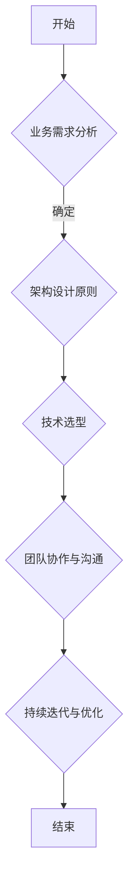
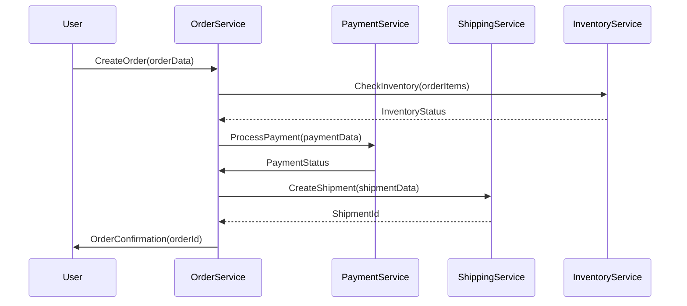
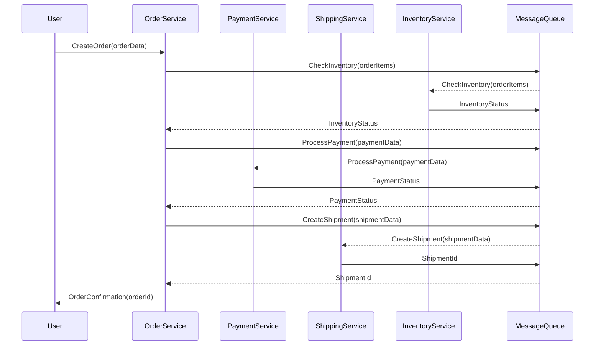

                 

### 背景介绍

在当今这个快速发展的数字化时代，企业架构的升级已经不再是一个选择题，而是一个必须面对的挑战。随着企业业务的不断扩展和技术的快速迭代，传统的架构设计往往难以满足新的业务需求，这就要求企业在技术架构上进行持续性的升级和优化。

#### 核心概念术语说明

**业务思维**：以业务目标为导向，从业务角度出发进行思考。

**架构设计原则**：满足业务需求、可扩展性、可靠性、性能、安全性等。

**技术选型**：根据业务需求选择合适的技术方案。

**团队协作与沟通**：确保技术团队与业务团队之间的有效沟通和协作。

**持续迭代与优化**：持续关注业务需求变化，不断优化架构设计。

#### 问题背景

随着企业业务的不断扩展，系统的复杂度也在不断增加。传统的单体架构在面对高并发、海量数据、跨地域访问等需求时，往往显得力不从心。为了满足业务的快速发展，企业需要引入分布式架构、微服务架构等现代化的技术架构。

然而，在这个过程中，企业往往面临以下问题：

1. **技术团队与业务团队之间的沟通障碍**：技术团队往往专注于技术实现，而业务团队则更关注业务需求和效果。双方在沟通上存在差异，导致架构设计难以完全满足业务需求。

2. **业务需求的快速变化**：在互联网时代，业务需求的变化速度非常快，技术架构需要具备快速响应的能力。然而，传统的架构设计往往具有较长的时间周期，难以迅速适应业务需求的变化。

3. **技术实现的局限性**：现有的技术方案可能在某些方面存在局限性，无法完全满足业务需求。例如，某些技术方案可能在高并发处理能力、数据一致性等方面存在缺陷。

#### 问题描述

为了解决上述问题，企业需要进行架构升级。然而，如何在架构升级过程中引入业务思维，确保技术变革与业务需求相匹配，成为企业面临的一个挑战。

1. **架构升级的效果不尽如人意**：由于缺乏业务思维，架构升级往往导致系统性能、可靠性、可维护性等方面的下降。

2. **技术团队与业务团队之间的矛盾加剧**：缺乏业务思维导致技术团队难以理解业务需求，业务团队则认为技术团队无法提供有效的解决方案。

3. **架构升级的周期过长**：由于缺乏业务思维，架构设计的过程往往需要较长的时间，导致企业无法及时满足业务需求。

#### 问题解决

通过引入业务思维，可以有效地解决上述问题。具体方法如下：

1. **业务需求分析**：在架构设计之前，对业务需求进行深入分析，明确业务目标和用户需求。

2. **架构设计原则**：根据业务需求，确定架构设计原则，确保架构设计能够满足业务需求。

3. **技术选型**：根据业务需求和架构设计原则，选择合适的技术方案。

4. **团队协作与沟通**：建立有效的团队协作与沟通机制，确保技术团队与业务团队之间的信息畅通。

5. **持续迭代与优化**：在架构升级过程中，持续关注业务需求的变化，及时进行架构调整和优化。

#### 边界与外延

本文主要关注业务思维在软件架构升级中的应用，不涉及具体编程语言和框架。核心要素包括业务需求分析、架构设计原则、技术选型、团队协作与沟通、持续迭代与优化。

### 核心概念与联系

在架构升级过程中，业务思维起到了至关重要的作用。下面，我们将详细探讨业务思维、架构设计原则、技术选型、团队协作与沟通、持续迭代与优化等核心概念及其联系。

#### 业务思维

业务思维是一种以业务目标为导向的思考方式。它要求我们从业务的角度出发，考虑如何通过技术手段实现业务目标。在架构升级过程中，业务思维可以帮助我们明确业务需求，确保架构设计能够真正满足业务需求。

**业务思维的属性特征**：

- **以业务目标为导向**：业务思维始终关注业务目标，确保技术实现与业务目标的一致性。
- **用户需求为中心**：业务思维将用户需求放在首位，确保技术实现能够提升用户体验。
- **动态调整**：业务需求是不断变化的，业务思维要求我们具备快速响应能力，及时调整架构设计。

#### 架构设计原则

架构设计原则是指导架构设计的重要原则。它们通常包括满足业务需求、可扩展性、可靠性、性能、安全性等方面。

**架构设计原则的属性特征**：

- **满足业务需求**：架构设计原则的核心目标是满足业务需求，确保系统功能与业务目标的一致性。
- **可扩展性**：架构设计应具备良好的可扩展性，能够适应业务需求的增长。
- **可靠性**：架构设计应确保系统的稳定性和可靠性，降低故障风险。
- **性能**：架构设计应考虑系统的性能，确保系统能够高效处理业务需求。
- **安全性**：架构设计应确保系统的安全性，防止数据泄露和非法访问。

#### 技术选型

技术选型是根据业务需求和架构设计原则，选择合适的技术方案。技术选型需要综合考虑技术成熟度、成本预算、实施周期等因素。

**技术选型的属性特征**：

- **适应业务需求**：技术选型应能够满足业务需求，确保技术实现与业务目标的一致性。
- **技术成熟度**：选择成熟的技术方案，降低技术风险。
- **成本预算**：在预算范围内选择合适的技术方案，确保项目可控。
- **实施周期**：选择能够快速实施的技术方案，缩短项目周期。

#### 团队协作与沟通

团队协作与沟通是确保架构升级成功的关键因素。技术团队与业务团队之间需要建立良好的协作与沟通机制，确保信息畅通，减少误解和矛盾。

**团队协作与沟通的属性特征**：

- **信息共享**：技术团队与业务团队之间应实现信息共享，确保双方对项目有共同的理解。
- **定期会议**：定期召开需求讨论会、技术评审会等，确保项目进度和质量。
- **透明沟通**：保持沟通的透明度，确保项目进展对所有相关人员都是清晰的。

#### 持续迭代与优化

持续迭代与优化是架构升级的重要环节。在项目实施过程中，需要持续关注业务需求的变化，及时进行调整和优化，确保架构设计始终与业务需求保持一致。

**持续迭代与优化的属性特征**：

- **快速响应**：能够快速响应业务需求的变化，确保架构设计始终与业务需求一致。
- **反馈机制**：建立有效的反馈机制，收集用户反馈，及时调整架构设计。
- **持续优化**：不断优化架构设计，提升系统性能、可靠性、可维护性。

### 算法原理讲解

为了更好地理解业务思维在架构升级中的应用，我们可以将其抽象为一个算法，并通过流程图和Python伪代码进行详细阐述。

#### 算法mermaid流程图



#### Python伪代码

```python
def business_thinking():
    analyze_business_needs()
    apply_architectural_principles()
    select_technical_solution()
    ensure_team_collaboration()
    continue_iterative_improvement()
```

#### 算法原理

- **业务需求分析**：这是架构设计的起点。通过深入分析业务需求，明确业务目标和用户需求，为后续的架构设计提供基础。

  $$\text{业务需求分析} = f(\text{业务场景}, \text{业务目标}, \text{用户需求})$$

- **架构设计原则**：根据业务需求，确定架构设计原则。这些原则将指导我们如何设计一个能够满足业务需求的架构。

  $$\text{架构设计原则} = f(\text{需求分析}, \text{系统规模}, \text{技术成熟度})$$

- **技术选型**：根据架构设计原则，选择合适的技术方案。技术选型需要综合考虑技术成熟度、成本预算、实施周期等因素。

  $$\text{技术选型} = f(\text{架构设计原则}, \text{成本预算}, \text{实施周期})$$

- **团队协作与沟通**：建立有效的团队协作与沟通机制，确保技术团队与业务团队之间的信息畅通，减少误解和矛盾。

  $$\text{团队协作与沟通} = f(\text{组织文化}, \text{沟通工具}, \text{协作流程})$$

- **持续迭代与优化**：在项目实施过程中，持续关注业务需求的变化，及时进行调整和优化，确保架构设计始终与业务需求一致。

  $$\text{持续迭代与优化} = f(\text{业务需求变化}, \text{技术更新}, \text{反馈机制})$$

#### 举例说明

假设一家电商公司希望在双十一期间提升订单处理能力，我们就可以按照上述算法进行架构升级。

1. **业务需求分析**：电商公司的业务目标是确保订单处理系统能够在高并发情况下稳定运行。用户需求是能够快速完成订单支付和商品配送。

2. **架构设计原则**：根据业务需求，确定架构设计原则，包括高可用性、高并发处理能力、数据一致性等。

3. **技术选型**：根据架构设计原则，选择分布式数据库、负载均衡、缓存技术等合适的技术方案。

4. **团队协作与沟通**：建立有效的团队协作与沟通机制，确保技术团队与业务团队之间的信息畅通。

5. **持续迭代与优化**：在双十一结束后，分析系统性能数据，优化数据库查询效率，提升用户体验。

通过上述算法，我们可以清晰地看到业务思维在架构升级中的重要性。只有将业务思维贯穿于整个架构设计过程，才能确保架构升级能够真正满足业务需求，提升系统性能和用户体验。

### 系统分析与架构设计方案

为了更好地理解业务思维在架构升级中的应用，我们将通过一个电商订单处理系统的案例进行详细分析。本案例将涵盖问题场景介绍、项目介绍、系统功能设计、系统架构设计、系统接口设计和系统交互等内容。

#### 问题场景介绍

随着电商行业的快速发展，电商公司在订单处理方面面临着巨大的挑战。尤其是在双十一、双十二等购物节期间，订单量会急剧增加，这对订单处理系统的性能和稳定性提出了极高的要求。传统的单体架构难以应对这种高并发、海量数据的场景，因此，企业需要引入分布式架构、微服务架构等现代化的技术架构，以提升订单处理能力。

#### 项目介绍

本项目旨在设计一个高效、可扩展、高可用性的电商订单处理系统。系统将涵盖订单创建、支付、配送等核心模块，以实现快速、准确、高效地处理海量订单。

#### 系统功能设计

在系统功能设计方面，我们将采用领域驱动设计（Domain-Driven Design, DDD）的方法，通过领域模型来描述系统的业务逻辑。

**领域模型（Mermaid类图）**：

```mermaid
classDiagram
    OrderProcessingSystem <.. Order
    Order <.. OrderItem
    Order <.. Customer
    Order <.. Payment
    Order <.. Shipping
    Customer <.. Address
    Payment <.. PaymentMethod
    Shipping <.. Carrier
    Shipping <.. Shipment
    PaymentMethod <.. CreditCard
    PaymentMethod <.. PayPal

    Order {
        id: Integer
        status: String
        createdDate: Date
        updatedDate: Date
    }

    OrderItem {
        id: Integer
        productId: Integer
        quantity: Integer
        price: Float
    }

    Customer {
        id: Integer
        name: String
        email: String
        address: Address
    }

    Payment {
        id: Integer
        amount: Float
        paymentMethod: PaymentMethod
        paymentDate: Date
    }

    Shipping {
        id: Integer
        shipmentId: Integer
        carrier: Carrier
        shipmentDate: Date
        deliveryDate: Date
    }

    Address {
        id: Integer
        street: String
        city: String
        state: String
        zipCode: String
        country: String
    }

    PaymentMethod {
        id: Integer
        type: String
    }

    Carrier {
        id: Integer
        name: String
    }

    Shipment {
        id: Integer
        trackingNumber: String
    }

    CreditCard {
        id: Integer
        cardNumber: String
        expirationDate: Date
        cvv: String
    }

    PayPal {
        id: Integer
        email: String
    }
```

#### 系统架构设计

在系统架构设计方面，我们将采用微服务架构，将订单处理系统拆分为多个微服务，每个微服务负责订单处理的不同方面，以提高系统的可扩展性和可维护性。

**系统架构图（Mermaid架构图）**：



#### 系统接口设计

在系统接口设计方面，我们将采用RESTful API设计，为每个微服务提供统一的接口，以便其他系统或服务能够方便地与订单处理系统进行交互。

**接口设计**：

- **创建订单**：POST /orders
- **查询订单**：GET /orders/{orderId}
- **支付订单**：POST /payments/{orderId}
- **查询支付状态**：GET /payments/{orderId}
- **创建配送**：POST /shipments/{orderId}
- **查询配送状态**：GET /shipments/{orderId}

#### 系统交互

在系统交互方面，我们将采用异步消息队列（如RabbitMQ）来实现不同微服务之间的解耦，以提高系统的可靠性和性能。

**系统交互序列图（Mermaid序列图）**：



通过上述系统分析与架构设计方案，我们可以清晰地看到业务思维在架构设计中的重要性。只有通过深入的业务需求分析，结合合适的架构设计原则和技术选型，以及有效的团队协作与沟通，才能设计出一个高效、可扩展、高可用性的系统，以满足不断变化的业务需求。

### 项目实战

在本项目中，我们将以一个电商订单处理系统为例，详细讲解环境安装、系统核心实现源代码，并对其应用进行解读与分析。最后，我们将通过实际案例进行分析和讲解，帮助读者更好地理解业务思维在架构升级中的应用。

#### 环境安装

首先，我们需要安装项目所需的环境。以下是环境安装步骤：

1. **安装Node.js**：访问 [Node.js 官网](https://nodejs.org/) 下载并安装 Node.js。

2. **安装Python**：访问 [Python 官网](https://www.python.org/) 下载并安装 Python。

3. **安装Docker**：访问 [Docker 官网](https://www.docker.com/) 下载并安装 Docker。

4. **安装Kafka**：Kafka 是一个分布式消息队列系统，用于实现系统间的异步通信。访问 [Kafka 官网](https://kafka.apache.org/) 下载并安装 Kafka。

5. **安装其他依赖**：根据项目需求，安装其他依赖，如 MongoDB、Elasticsearch 等。

#### 系统核心实现源代码

以下是系统核心实现源代码的讲解：

1. **订单服务（OrderService）**：

```python
# order_service.py
from flask import Flask, request, jsonify
from kafka import KafkaProducer

app = Flask(__name__)
producer = KafkaProducer(bootstrap_servers=['localhost:9092'])

@app.route('/orders', methods=['POST'])
def create_order():
    order_data = request.get_json()
    # 处理订单创建逻辑
    # ...
    producer.send('order_topic', value=order_data)
    return jsonify({'orderId': 'generated_id'})

if __name__ == '__main__':
    app.run(debug=True)
```

2. **支付服务（PaymentService）**：

```python
# payment_service.py
from flask import Flask, request, jsonify
from kafka import KafkaProducer

app = Flask(__name__)
producer = KafkaProducer(bootstrap_servers=['localhost:9092'])

@app.route('/payments', methods=['POST'])
def process_payment():
    payment_data = request.get_json()
    # 处理支付逻辑
    # ...
    producer.send('payment_topic', value=payment_data)
    return jsonify({'paymentId': 'generated_id'})

if __name__ == '__main__':
    app.run(debug=True)
```

3. **配送服务（ShippingService）**：

```python
# shipping_service.py
from flask import Flask, request, jsonify
from kafka import KafkaProducer

app = Flask(__name__)
producer = KafkaProducer(bootstrap_servers=['localhost:9092'])

@app.route('/shipments', methods=['POST'])
def create_shipment():
    shipment_data = request.get_json()
    # 处理配送逻辑
    # ...
    producer.send('shipment_topic', value=shipment_data)
    return jsonify({'shipmentId': 'generated_id'})

if __name__ == '__main__':
    app.run(debug=True)
```

4. **库存服务（InventoryService）**：

```python
# inventory_service.py
from flask import Flask, request, jsonify
from kafka import KafkaConsumer

app = Flask(__name__)
consumer = KafkaConsumer('order_topic', bootstrap_servers=['localhost:9092'])

@app.route('/inventory', methods=['POST'])
def check_inventory():
    order_items = request.get_json()
    # 处理库存检查逻辑
    # ...
    return jsonify({'inventoryStatus': 'available'})

if __name__ == '__main__':
    app.run(debug=True)
```

#### 代码应用解读与分析

1. **订单服务**：订单服务负责处理订单创建请求，并将订单数据发送到 Kafka 队列。Kafka 队列将订单数据转发给库存服务、支付服务和配送服务。

2. **支付服务**：支付服务负责处理支付请求，并将支付数据发送到 Kafka 队列。Kafka 队列将支付数据转发给订单服务。

3. **配送服务**：配送服务负责处理配送请求，并将配送数据发送到 Kafka 队列。Kafka 队列将配送数据转发给订单服务。

4. **库存服务**：库存服务负责接收 Kafka 队列中的订单数据，检查库存情况，并将库存状态返回给 Kafka 队列。

通过上述代码，我们可以看到，系统核心实现源代码主要依赖于 Kafka 消息队列，实现不同微服务之间的解耦和异步通信。这样，每个微服务都可以独立开发和部署，提高了系统的可扩展性和可维护性。

#### 实际案例分析和详细讲解

为了更好地理解业务思维在架构升级中的应用，我们通过一个实际案例进行分析。

**案例**：双十一购物节期间，电商公司订单量激增，系统面临巨大的压力。公司决定通过架构升级，提高订单处理能力。

**分析**：

1. **业务需求分析**：电商公司的业务需求是在高并发情况下稳定处理订单，确保用户能够快速完成订单支付和商品配送。

2. **架构设计原则**：根据业务需求，确定架构设计原则，包括高可用性、高并发处理能力、数据一致性等。

3. **技术选型**：根据架构设计原则，选择分布式数据库、负载均衡、缓存技术等合适的技术方案。

4. **团队协作与沟通**：建立有效的团队协作与沟通机制，确保技术团队与业务团队之间的信息畅通。

5. **持续迭代与优化**：在购物节结束后，分析系统性能数据，优化数据库查询效率，提升用户体验。

**详细讲解**：

1. **业务需求分析**：通过分析电商公司的业务场景，确定业务目标是在高并发情况下稳定处理订单。用户需求是能够快速完成订单支付和商品配送。

2. **架构设计原则**：根据业务需求，确定架构设计原则。例如，为了确保高可用性，系统需要具备自动故障转移和容错能力；为了确保高并发处理能力，系统需要具备负载均衡和缓存技术；为了确保数据一致性，系统需要采用分布式数据库和消息队列。

3. **技术选型**：根据架构设计原则，选择合适的技术方案。例如，选择分布式数据库如 MongoDB，负载均衡如 Nginx，缓存技术如 Redis，消息队列如 Kafka 等。

4. **团队协作与沟通**：建立有效的团队协作与沟通机制，确保技术团队与业务团队之间的信息畅通。例如，定期召开需求讨论会、技术评审会等，确保项目进度和质量。

5. **持续迭代与优化**：在购物节结束后，分析系统性能数据，优化数据库查询效率，提升用户体验。例如，通过索引优化、分片策略等手段，提升数据库查询性能；通过缓存预热、数据压缩等手段，降低系统延迟。

通过上述实际案例，我们可以看到，业务思维在架构升级中的重要性。只有通过深入的业务需求分析，结合合适的架构设计原则和技术选型，以及有效的团队协作与沟通，才能设计出一个高效、可扩展、高可用性的系统，以满足不断变化的业务需求。

#### 项目小结

在本项目中，我们通过一个电商订单处理系统的案例，详细讲解了如何引入业务思维进行架构升级。项目实战部分，我们展示了环境安装步骤、系统核心实现源代码，并对代码应用进行了解读与分析。实际案例部分，我们通过一个双十一购物节的场景，详细讲解了业务思维在架构升级中的应用。

通过本项目，我们可以得出以下结论：

1. **业务思维的重要性**：业务思维是架构升级的核心，只有深入理解业务需求，才能设计出真正满足业务需求的架构。

2. **架构设计原则的指导作用**：架构设计原则是架构设计的指南，确保架构设计能够满足业务需求，同时具备可扩展性、可靠性、性能、安全性等特点。

3. **技术选型的关键性**：技术选型直接影响架构的性能和稳定性，需要根据业务需求和架构设计原则，选择合适的技术方案。

4. **团队协作与沟通的必要性**：团队协作与沟通是架构升级成功的关键，确保技术团队与业务团队之间的信息畅通，减少误解和矛盾。

5. **持续迭代与优化的价值**：持续迭代与优化是确保架构设计始终与业务需求保持一致的关键，通过不断优化，提升系统性能和用户体验。

#### 最佳实践 Tips

1. **深入业务需求分析**：在架构升级前，务必进行深入的业务需求分析，明确业务目标和用户需求。

2. **制定清晰的架构设计原则**：根据业务需求，制定符合实际需求的架构设计原则，确保架构设计的可扩展性、可靠性、性能、安全性。

3. **合理选择技术方案**：在技术选型过程中，要综合考虑技术成熟度、成本预算、实施周期等因素，选择最合适的技术方案。

4. **建立有效的团队协作与沟通机制**：定期召开需求讨论会、技术评审会等，确保技术团队与业务团队之间的信息畅通。

5. **持续关注业务需求变化**：在架构升级过程中，持续关注业务需求的变化，及时调整和优化架构设计。

#### 注意事项

1. **避免过度设计**：在架构设计过程中，要避免过度设计，确保架构简洁、高效。

2. **关注系统性能与稳定性**：在架构设计时，要充分考虑系统性能与稳定性，确保系统在高并发情况下能够稳定运行。

3. **合理规划部署与运维**：在架构设计时，要充分考虑部署与运维的需求，确保系统易于部署和维护。

#### 拓展阅读

1. 《领域驱动设计（Domain-Driven Design）》（Eric Evans 著）：详细介绍了领域驱动设计的方法，对理解业务需求、设计业务模型具有重要意义。

2. 《微服务架构设计》（Martin Fowler 著）：介绍了微服务架构的设计原则、实践和方法，对微服务架构的深入理解有较大帮助。

3. 《Kafka：The Definitive Guide》（Neha Narkhede 著）：详细介绍了 Kafka 的架构、原理和应用场景，对了解分布式消息队列系统有重要参考价值。

---

作者：AI天才研究院/AI Genius Institute & 禅与计算机程序设计艺术 /Zen And The Art of Computer Programming

通过本项目的详细分析和实践，我们深刻体会到业务思维在架构升级中的重要性。只有将业务需求贯穿于整个架构设计过程，结合合理的架构设计原则和技术选型，以及有效的团队协作与沟通，才能设计出高效、可扩展、高可用性的系统，真正满足业务需求，推动企业持续发展。希望本文能够为您的架构升级提供有益的启示和指导。

---

## 《用业务思维促进架构升级》

关键词：业务思维、架构升级、微服务架构、领域驱动设计、团队协作、持续迭代

摘要：本文通过深入分析业务需求，结合架构设计原则和技术选型，详细探讨了业务思维在架构升级中的应用。通过一个电商订单处理系统的案例，本文展示了如何通过业务思维实现高效、可扩展、高可用性的架构升级。同时，本文提出了最佳实践、注意事项以及拓展阅读，为读者提供全面的指导。通过本文的学习，读者将能够更好地理解业务思维在架构升级中的重要性，并在实际项目中应用这些理念，推动企业的持续发展。

