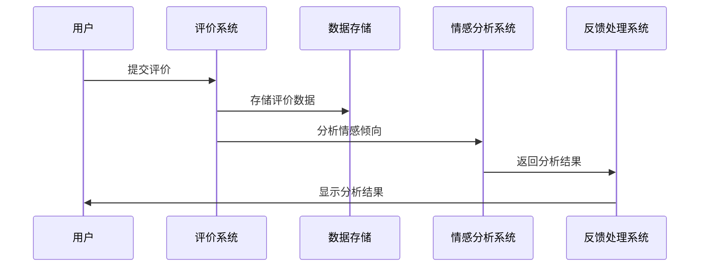
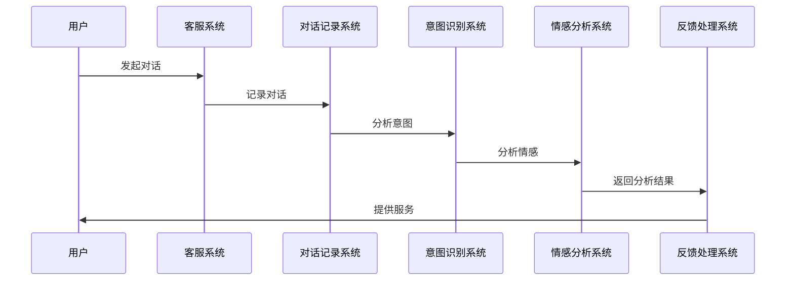
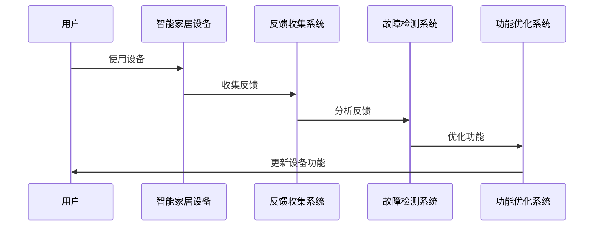

                 

# 用户反馈处理：不断改进AI Agent的表现

## 关键词

- 用户反馈
- AI Agent
- 机器学习
- 强化学习
- 数据预处理
- 情感分析
- 用户意图识别

## 摘要

在人工智能领域，用户反馈处理是提高AI Agent性能和用户体验的关键环节。本文将系统地探讨用户反馈处理的概念、方法和技术，以及其在AI Agent优化中的应用。通过对用户反馈数据的收集、处理、分析，结合机器学习、强化学习和生成对抗网络等技术，本文旨在提供一套全面、实用的用户反馈处理框架，帮助开发者不断改进AI Agent的表现。

## 目录大纲

### 第一部分：背景与概念介绍

#### 第1章 引言
- 问题背景
- 用户反馈处理的重要性
- AI Agent在用户反馈处理中的应用
- 书籍结构概述

#### 第2章 用户反馈处理的基本概念
- 用户反馈的定义
- 用户反馈的类型
- 用户反馈的价值
- 用户反馈处理的核心挑战

#### 第3章 AI Agent概述
- AI Agent的定义
- AI Agent的发展历程
- AI Agent的关键技术
- AI Agent在不同领域的应用

### 第二部分：用户反馈处理的技术与方法

#### 第4章 用户反馈数据的收集与处理
- 用户反馈数据的来源
- 用户反馈数据的处理流程
- 数据预处理技术
- 用户反馈数据的可视化

#### 第5章 用户反馈分析与理解
- 自然语言处理技术
- 情感分析
- 用户意图识别
- 用户反馈的上下文理解

#### 第6章 基于用户反馈的AI Agent优化
- 机器学习技术在反馈处理中的应用
- 强化学习在反馈处理中的应用
- 生成对抗网络在反馈处理中的应用
- 用户反馈驱动的AI Agent自适应优化

#### 第7章 用户反馈处理的实战案例
- 案例一：电商平台用户反馈处理
- 案例二：智能客服系统用户反馈处理
- 案例三：智能家居用户反馈处理

### 第三部分：实践与最佳实践

#### 第8章 用户反馈处理实践指南
- 用户反馈处理流程设计
- 用户反馈数据质量控制
- 用户反馈处理系统架构设计
- 用户反馈处理系统性能优化

#### 第9章 用户反馈处理的最佳实践
- 用户反馈处理的核心要素
- 用户反馈处理的案例分析
- 用户反馈处理的实用技巧
- 用户反馈处理的持续改进

#### 第10章 用户反馈处理的小结与展望
- 用户反馈处理的重要性回顾
- 用户反馈处理的发展趋势
- 未来工作展望

## 第一部分：背景与概念介绍

### 第1章 引言

#### 1.1 问题背景

在现代社会，人工智能（AI）的应用日益广泛，从智能客服到自动驾驶，AI Agent已成为许多场景的核心组件。然而，AI Agent的表现并不总是令人满意，这往往源于对用户反馈处理的不足。用户反馈是衡量AI Agent性能的重要指标，但如何有效地收集、处理和分析这些反馈，并用于AI Agent的优化，仍是一个复杂的问题。

#### 1.2 用户反馈处理的重要性

用户反馈处理对AI Agent的影响主要体现在以下几个方面：

1. **性能提升**：通过分析用户反馈，AI Agent可以识别自身的问题和不足，从而进行优化，提高性能。
2. **用户体验**：用户反馈直接反映了用户的体验感受，对产品改进和用户体验的提升具有重要意义。
3. **持续学习**：用户反馈为AI Agent提供了新的训练数据和优化方向，有助于其实现持续学习和自我改进。

#### 1.3 AI Agent在用户反馈处理中的应用

AI Agent在用户反馈处理中的应用主要体现在以下几个方面：

1. **自动化反馈收集**：通过智能助手、聊天机器人等AI Agent，自动化地收集用户的反馈。
2. **反馈数据分析**：利用自然语言处理、情感分析等技术，对用户反馈进行分析和归类。
3. **智能优化**：基于用户反馈，AI Agent可以自动调整其行为和策略，以提升用户体验。

#### 1.4 书籍结构概述

本书将分为三大部分，首先介绍用户反馈处理的基本概念和AI Agent的概述；然后详细探讨用户反馈处理的技术与方法，包括数据收集、分析和基于用户反馈的AI Agent优化；最后，通过实战案例和最佳实践，提供用户反馈处理的具体指导和策略。

### 第2章 用户反馈处理的基本概念

#### 2.1 用户反馈的定义

用户反馈是指用户在使用产品或服务过程中，对产品或服务提供的评价、意见、建议等信息。用户反馈可以以文本、语音、图像等多种形式存在，是用户对产品或服务的一种直观反应。

#### 2.2 用户反馈的类型

用户反馈主要可以分为以下几类：

1. **评价反馈**：用户对产品或服务的总体满意度，如“很好”、“一般”、“差”等。
2. **意见反馈**：用户对产品或服务的具体意见，如“功能不够完善”、“界面不够友好”等。
3. **建议反馈**：用户对产品或服务提出的改进建议，如“增加某一功能”、“优化某一界面”等。

#### 2.3 用户反馈的价值

用户反馈的价值主要体现在以下几个方面：

1. **产品优化**：通过分析用户反馈，开发者可以了解用户的需求和痛点，从而进行产品优化。
2. **用户体验**：用户反馈直接反映了用户体验，有助于提升产品的用户体验。
3. **营销策略**：用户反馈可以为企业的营销策略提供重要参考，如改进产品宣传、制定用户调研计划等。

#### 2.4 用户反馈处理的核心挑战

用户反馈处理面临以下核心挑战：

1. **数据质量**：用户反馈数据的真实性和可靠性直接影响后续分析的准确性。
2. **数据量**：用户反馈数据的量大且多样化，如何有效地处理和存储这些数据是一个挑战。
3. **分析算法**：如何从海量的用户反馈中提取有价值的信息，需要有效的分析和挖掘算法。
4. **实时响应**：用户反馈往往需要快速响应，如何实现实时反馈处理是一个技术难题。

### 第3章 AI Agent概述

#### 3.1 AI Agent的定义

AI Agent是指具备一定智能，能够在特定环境中自主执行任务、适应环境和进行决策的计算机系统。AI Agent通常基于机器学习、自然语言处理、计算机视觉等技术，能够模拟人类的思维和行为。

#### 3.2 AI Agent的发展历程

AI Agent的发展可以追溯到20世纪50年代，随着计算机技术的进步和人工智能理论的发展，AI Agent逐渐成为人工智能研究的一个重要方向。从最初的规则驱动的智能系统，到基于数据的机器学习系统，再到如今的深度学习和强化学习系统，AI Agent在各个领域都取得了显著的进展。

#### 3.3 AI Agent的关键技术

AI Agent的关键技术主要包括：

1. **机器学习**：通过训练模型，使AI Agent能够从数据中学习并改进自身性能。
2. **自然语言处理**：使AI Agent能够理解和生成自然语言，实现人机交互。
3. **计算机视觉**：使AI Agent能够识别和理解图像和视频信息。
4. **强化学习**：使AI Agent能够在动态环境中通过试错学习，实现最优决策。

#### 3.4 AI Agent在不同领域的应用

AI Agent在各个领域都有广泛应用，如：

1. **智能客服**：通过自然语言处理和机器学习技术，实现与用户的智能对话和问题解决。
2. **自动驾驶**：利用计算机视觉和强化学习技术，实现车辆的自主驾驶。
3. **智能家居**：通过物联网和机器学习技术，实现家庭设备的智能管理和控制。
4. **医疗诊断**：利用医学图像分析和机器学习技术，实现疾病的自动诊断。

## 第二部分：用户反馈处理的技术与方法

### 第4章 用户反馈数据的收集与处理

#### 4.1 用户反馈数据的来源

用户反馈数据的来源主要包括：

1. **在线问卷**：通过在线问卷平台收集用户的反馈数据。
2. **社交媒体**：从社交媒体平台收集用户发布的相关反馈。
3. **客户服务系统**：通过客户服务系统记录的用户咨询和投诉。
4. **用户评论**：从电商平台、应用程序商店等收集的用户评论。

#### 4.2 用户反馈数据的处理流程

用户反馈数据的处理流程主要包括以下几个步骤：

1. **数据采集**：收集用户反馈数据，包括文本、语音、图像等形式。
2. **数据清洗**：去除噪声数据、重复数据和无效数据。
3. **数据存储**：将清洗后的数据存储在数据库中，便于后续处理和分析。
4. **数据预处理**：对数据进行格式化、标准化等预处理操作，以便于模型训练和推理。

#### 4.3 数据预处理技术

数据预处理技术主要包括：

1. **文本清洗**：去除文本中的噪声，如标点符号、HTML标签等。
2. **文本分词**：将文本分解成词或词组，便于后续的自然语言处理。
3. **词性标注**：为文本中的每个词标注词性，如名词、动词等。
4. **文本向量化**：将文本转换为数值形式，如词袋模型、TF-IDF等。

#### 4.4 用户反馈数据的可视化

用户反馈数据的可视化可以帮助开发者直观地了解用户反馈的情况，主要包括：

1. **词云图**：展示文本中高频词汇的词云，便于了解用户关注的主题。
2. **情感分布图**：展示用户反馈的情感分布，如正面、负面、中性等。
3. **趋势图**：展示用户反馈的趋势变化，如随时间的增长或减少。
4. **词频分布图**：展示文本中各个词的频率分布，便于了解用户反馈的热点问题。

### 第5章 用户反馈分析与理解

#### 5.1 自然语言处理技术

自然语言处理（NLP）技术是用户反馈分析的重要工具，主要包括：

1. **分词**：将文本分解成词或词组，便于后续处理。
2. **词性标注**：为文本中的每个词标注词性，如名词、动词等。
3. **命名实体识别**：识别文本中的命名实体，如人名、地名等。
4. **情感分析**：分析文本的情感倾向，如正面、负面、中性等。

#### 5.2 情感分析

情感分析是用户反馈分析的重要环节，通过情感分析可以了解用户的情感倾向和态度。情感分析的主要方法包括：

1. **规则方法**：基于规则进行情感分析，如使用词典进行情感分类。
2. **机器学习方法**：使用机器学习算法进行情感分类，如支持向量机、朴素贝叶斯等。
3. **深度学习方法**：使用深度学习模型进行情感分析，如循环神经网络、卷积神经网络等。

#### 5.3 用户意图识别

用户意图识别是理解用户反馈的重要步骤，通过识别用户的意图，可以更好地进行反馈处理和优化。用户意图识别的方法包括：

1. **基于规则的意图识别**：使用预定义的规则进行意图分类。
2. **基于统计模型的意图识别**：使用统计模型进行意图分类，如条件概率模型、隐马尔可夫模型等。
3. **基于深度学习的意图识别**：使用深度学习模型进行意图分类，如长短期记忆网络、卷积神经网络等。

#### 5.4 用户反馈的上下文理解

用户反馈的上下文理解是理解用户反馈的更深层次，通过上下文理解可以更好地理解用户的意图和情感。上下文理解的方法包括：

1. **词向量表示**：使用词向量表示文本，如Word2Vec、GloVe等。
2. **上下文词嵌入**：为上下文中的词赋予不同的嵌入表示，如BERT、ELMO等。
3. **序列模型**：使用序列模型进行上下文理解，如循环神经网络、长短时记忆网络等。

### 第6章 基于用户反馈的AI Agent优化

#### 6.1 机器学习技术在反馈处理中的应用

机器学习技术在用户反馈处理中的应用主要体现在以下几个方面：

1. **分类与聚类**：使用机器学习算法对用户反馈进行分类和聚类，以便更好地理解和处理反馈。
2. **预测模型**：建立用户反馈的预测模型，如预测用户的满意度、投诉率等。
3. **异常检测**：使用机器学习算法检测用户反馈中的异常情况，如恶意评论、重复反馈等。

#### 6.2 强化学习在反馈处理中的应用

强化学习在用户反馈处理中的应用主要体现在以下几个方面：

1. **策略优化**：使用强化学习优化AI Agent的策略，使其更好地应对用户反馈。
2. **反馈驱动的学习**：根据用户反馈调整AI Agent的学习策略，实现自我优化。
3. **交互式学习**：通过与用户的交互，不断学习和改进AI Agent的表现。

#### 6.3 生成对抗网络在反馈处理中的应用

生成对抗网络（GAN）在用户反馈处理中的应用主要体现在以下几个方面：

1. **数据增强**：使用GAN生成更多样化的用户反馈数据，提高模型训练效果。
2. **虚假反馈检测**：使用GAN检测用户反馈中的虚假评论，提高反馈数据的真实性。
3. **个性化推荐**：使用GAN生成个性化的用户反馈，为用户提供更个性化的服务。

#### 6.4 用户反馈驱动的AI Agent自适应优化

用户反馈驱动的AI Agent自适应优化主要包括以下几个步骤：

1. **反馈收集**：通过多种渠道收集用户反馈。
2. **反馈分析**：对用户反馈进行分析，识别问题和改进方向。
3. **策略调整**：根据反馈分析结果，调整AI Agent的策略和行为。
4. **持续学习**：通过用户反馈进行持续学习，不断提升AI Agent的表现。

### 第7章 用户反馈处理的实战案例

#### 7.1 案例一：电商平台用户反馈处理

**项目介绍**：
电商平台用户反馈处理系统旨在收集和分析用户在购买商品后的评价和意见，通过用户反馈优化产品和服务。

**系统功能设计**：
- 用户评价收集：收集用户对商品的评分和评价。
- 意见反馈处理：收集用户对平台服务的建议和意见。
- 情感分析：分析用户评价和意见的情感倾向。

**系统架构设计**：
- 用户评价收集模块：通过API接口与电商平台系统对接，实时收集用户评价。
- 意见反馈处理模块：建立意见反馈渠道，如在线客服、问卷调查等。
- 情感分析模块：使用自然语言处理技术，分析用户评价和意见的情感倾向。

**系统接口设计**：
- 用户评价接口：用于收集用户对商品的评分和评价。
- 意见反馈接口：用于收集用户对平台服务的建议和意见。

**系统交互序列图**：



**代码应用解读与分析**：

```python
import pandas as pd
from textblob import TextBlob

# 加载用户评价数据
data = pd.read_csv('user_reviews.csv')

# 情感分析
def analyze_sentiment(review):
    blob = TextBlob(review)
    return '正面' if blob.sentiment.polarity > 0 else '负面'

data['sentiment'] = data['review'].apply(analyze_sentiment)

# 分析结果可视化
data.groupby('sentiment').size().plot(kind='bar')
```

**实际案例分析和详细讲解**：
在实际案例中，该系统通过收集用户评价，分析了用户对商品的满意度。通过情感分析，识别出用户的情感倾向，为电商平台提供了改进产品和服务的依据。

**项目小结**：
电商平台用户反馈处理系统有效地收集和分析用户反馈，通过情感分析提高了反馈处理的准确性和效率，为电商平台的产品优化和用户体验提升提供了有力支持。

#### 7.2 智能客服系统用户反馈处理

**项目介绍**：
智能客服系统用户反馈处理项目旨在通过分析用户与客服的对话记录，优化客服系统的性能和用户体验。

**系统功能设计**：
- 对话记录收集：收集用户与客服的对话记录。
- 意图识别：识别用户的意图，如咨询、投诉、建议等。
- 情感分析：分析用户对话的情感倾向。

**系统架构设计**：
- 对话记录收集模块：通过API接口与智能客服系统对接，实时收集对话记录。
- 意图识别模块：使用自然语言处理技术，识别用户的意图。
- 情感分析模块：使用情感分析技术，分析用户对话的情感倾向。

**系统接口设计**：
- 对话记录接口：用于收集用户与客服的对话记录。
- 意图识别接口：用于识别用户的意图。
- 情感分析接口：用于分析用户对话的情感倾向。

**系统交互序列图**：



**代码应用解读与分析**：

```python
import pandas as pd
from textblob import TextBlob

# 加载对话记录数据
data = pd.read_csv('chat_logs.csv')

# 意图识别
def identify_intent(message):
    # 简单的规则判断
    if '投诉' in message:
        return '投诉'
    elif '咨询' in message:
        return '咨询'
    else:
        return '其他'

data['intent'] = data['message'].apply(identify_intent)

# 情感分析
def analyze_sentiment(message):
    blob = TextBlob(message)
    return '正面' if blob.sentiment.polarity > 0 else '负面'

data['sentiment'] = data['message'].apply(analyze_sentiment)

# 分析结果可视化
data.groupby('sentiment').size().plot(kind='bar')
```

**实际案例分析和详细讲解**：
在实际案例中，智能客服系统通过分析用户与客服的对话记录，识别出了用户的意图和情感。根据分析结果，客服团队能够更好地理解用户需求，提供更个性化的服务。

**项目小结**：
智能客服系统用户反馈处理项目有效地提升了客服系统的服务质量，通过意图识别和情感分析，为客服团队提供了有价值的用户反馈，助力企业优化客户体验。

#### 7.3 智能家居用户反馈处理

**项目介绍**：
智能家居用户反馈处理项目旨在通过分析用户对智能家居设备的反馈，优化设备的功能和性能。

**系统功能设计**：
- 用户反馈收集：收集用户对智能家居设备的评价和意见。
- 故障检测：识别设备可能存在的问题。
- 功能优化：根据用户反馈优化设备功能。

**系统架构设计**：
- 用户反馈收集模块：通过智能家居设备的API接口，实时收集用户反馈。
- 故障检测模块：使用机器学习算法，识别设备故障。
- 功能优化模块：根据用户反馈，调整设备功能。

**系统接口设计**：
- 用户反馈接口：用于收集用户对设备的评价和意见。
- 故障检测接口：用于识别设备故障。
- 功能优化接口：用于调整设备功能。

**系统交互序列图**：



**代码应用解读与分析**：

```python
import pandas as pd
from sklearn.ensemble import RandomForestClassifier

# 加载用户反馈数据
data = pd.read_csv('user_feedback.csv')

# 故障检测
def detect_fault(feedback):
    if '故障' in feedback:
        return True
    else:
        return False

data['fault'] = data['feedback'].apply(detect_fault)

# 功能优化
def optimize_function(feedback):
    if '增加功能' in feedback:
        return '增加功能'
    elif '优化界面' in feedback:
        return '优化界面'
    else:
        return '其他'

data['optimization'] = data['feedback'].apply(optimize_function)

# 分析结果可视化
data.groupby('fault').size().plot(kind='bar')
data.groupby('optimization').size().plot(kind='bar')
```

**实际案例分析和详细讲解**：
在实际案例中，智能家居系统通过分析用户反馈，识别出了设备的故障和用户对功能的需求。根据这些分析结果，系统团队能够及时修复设备故障，优化设备功能，提高用户体验。

**项目小结**：
智能家居用户反馈处理项目有效地提升了设备的功能和性能，通过故障检测和功能优化，为用户提供了更优质的智能家居服务。

### 第三部分：实践与最佳实践

#### 第8章 用户反馈处理实践指南

#### 8.1 用户反馈处理流程设计

用户反馈处理流程设计主要包括以下几个步骤：

1. **反馈收集**：建立多种反馈渠道，如在线问卷、社交媒体、客户服务系统等，方便用户提交反馈。
2. **反馈清洗**：去除噪声数据、重复数据和无效数据，确保反馈数据的质量。
3. **反馈分类**：根据反馈内容，将反馈分类为评价、意见、建议等不同类型，便于后续处理。
4. **反馈分析**：使用自然语言处理、情感分析等技术，对反馈进行分析，识别用户的需求和痛点。
5. **反馈处理**：根据分析结果，制定相应的优化策略，如产品改进、服务优化等。
6. **反馈反馈**：将处理结果反馈给用户，确保用户感受到企业的关注和改进。

#### 8.2 用户反馈数据质量控制

用户反馈数据质量控制主要包括以下几个方面：

1. **数据完整性**：确保反馈数据的完整性，避免缺失值和异常值。
2. **数据准确性**：确保反馈数据的准确性，避免虚假反馈和误导性反馈。
3. **数据一致性**：确保反馈数据的一致性，避免不同来源的反馈数据相互矛盾。
4. **数据安全性**：确保反馈数据的安全性，防止数据泄露和滥用。

#### 8.3 用户反馈处理系统架构设计

用户反馈处理系统架构设计主要包括以下几个模块：

1. **数据收集模块**：负责收集来自各种渠道的用户反馈。
2. **数据处理模块**：负责清洗、分类和分析用户反馈。
3. **反馈存储模块**：负责存储用户反馈数据，便于后续处理和分析。
4. **反馈处理模块**：负责根据分析结果，制定优化策略和执行处理。
5. **用户反馈模块**：负责将处理结果反馈给用户，提升用户体验。

#### 8.4 用户反馈处理系统性能优化

用户反馈处理系统性能优化主要包括以下几个方面：

1. **数据处理速度**：优化数据处理流程，提高系统处理速度，确保及时响应用户反馈。
2. **系统稳定性**：确保系统在高并发情况下仍能稳定运行，避免系统崩溃或性能下降。
3. **资源利用率**：优化系统资源配置，提高资源利用率，降低系统成本。
4. **系统可扩展性**：设计可扩展的系统架构，支持系统的持续发展和功能扩展。

### 第9章 用户反馈处理的最佳实践

#### 9.1 用户反馈处理的核心要素

用户反馈处理的核心要素主要包括：

1. **数据质量**：确保反馈数据的真实性和准确性，是后续分析的基础。
2. **分析深度**：对用户反馈进行深入分析，挖掘用户需求和痛点。
3. **快速响应**：及时处理用户反馈，提升用户满意度。
4. **持续改进**：根据用户反馈，持续优化产品和服务。

#### 9.2 用户反馈处理的案例分析

以下为用户反馈处理的几个成功案例分析：

1. **案例分析一**：某电商平台通过用户反馈优化商品推荐算法，提高了用户购物体验，增加了销售额。
2. **案例分析二**：某智能客服系统通过分析用户反馈，优化了客服流程和客服人员的培训，提高了客服效率和服务质量。
3. **案例分析三**：某智能家居公司通过分析用户反馈，改进了产品功能，提升了用户体验，增加了用户粘性。

#### 9.3 用户反馈处理的实用技巧

用户反馈处理的一些实用技巧包括：

1. **多渠道收集**：通过多种渠道收集用户反馈，确保覆盖到不同类型的用户。
2. **数据可视化**：使用数据可视化工具，帮助团队成员更直观地理解用户反馈。
3. **分类管理**：对用户反馈进行分类管理，便于后续分析和处理。
4. **闭环管理**：建立反馈闭环管理机制，确保用户反馈得到及时响应和处理。

#### 9.4 用户反馈处理的持续改进

用户反馈处理的持续改进主要包括以下几个方面：

1. **定期回顾**：定期回顾用户反馈处理情况，总结经验和教训，持续优化流程。
2. **培训与支持**：为团队成员提供相关培训和资源支持，提升其处理用户反馈的能力。
3. **技术更新**：不断引入新的技术和工具，提升用户反馈处理的效率和效果。
4. **用户参与**：鼓励用户参与产品和服务改进，形成良性互动，提升用户满意度。

### 第10章 用户反馈处理的小结与展望

#### 10.1 用户反馈处理的重要性回顾

用户反馈处理在产品和服务优化中具有重要价值，能够帮助企业和开发者：

1. **了解用户需求**：通过用户反馈，了解用户的真实需求和痛点。
2. **提升用户体验**：根据用户反馈，优化产品和服务，提升用户体验。
3. **降低风险**：及时识别和解决用户问题，降低用户流失风险。
4. **增加竞争力**：持续改进产品和服务，提升企业在市场中的竞争力。

#### 10.2 用户反馈处理的发展趋势

用户反馈处理的发展趋势包括：

1. **智能化**：随着人工智能技术的发展，用户反馈处理将更加智能化和自动化。
2. **个性化**：用户反馈处理将更加注重个性化，满足不同用户的需求。
3. **实时性**：用户反馈处理将更加注重实时性，及时响应和解决问题。
4. **数据驱动**：用户反馈处理将更加依赖数据分析和挖掘，实现数据驱动决策。

#### 10.3 未来工作展望

在未来，用户反馈处理的工作重点将包括：

1. **加强数据分析**：利用大数据分析和挖掘技术，深入分析用户反馈，挖掘用户需求。
2. **优化用户体验**：通过不断优化产品和服务，提升用户体验，增加用户满意度。
3. **创新技术应用**：引入新的技术和工具，提升用户反馈处理的效率和效果。
4. **建立反馈闭环**：建立反馈闭环管理机制，确保用户反馈得到及时响应和处理。

## 作者信息

作者：AI天才研究院/AI Genius Institute & 禅与计算机程序设计艺术 /Zen And The Art of Computer Programming

---

通过上述内容，本文系统地介绍了用户反馈处理在AI Agent中的应用，包括用户反馈的基本概念、数据收集与处理、分析与理解、优化技术以及实战案例。同时，本文也探讨了用户反馈处理的实践指南和最佳实践，为开发者提供了全面的用户反馈处理框架。在未来的发展中，用户反馈处理将继续发挥重要作用，助力AI Agent的性能提升和用户体验优化。

