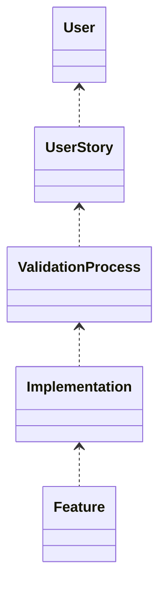
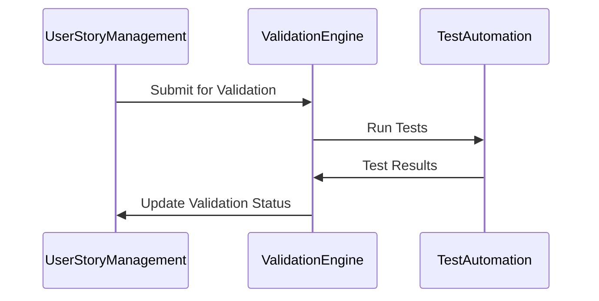
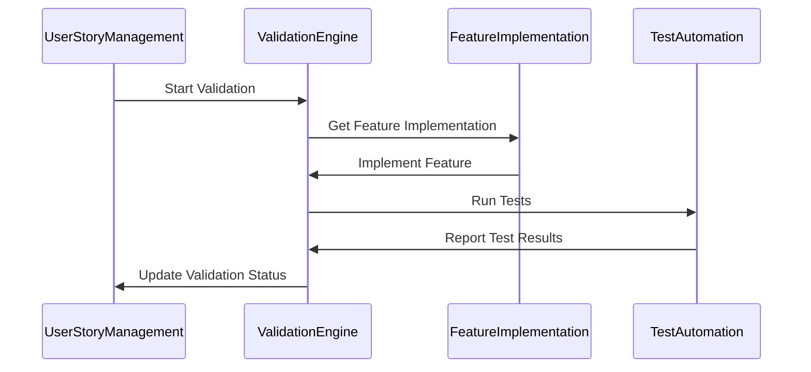

                 


## Let's Think: Step by Step

### Background Introduction

Before diving into the intricate details of user story validation, it is crucial to establish a foundational understanding of the concepts involved. In the realm of software development, a user story serves as a tool to capture the requirements of a software feature from the perspective of an end user. It is a simple, informal, and concise description of a software requirement that is understandable to both the development team and the customer.

A user story typically follows the format of "As a [user role], I want [functionality] so that [business value]." This format ensures that the story focuses on the user's perspective and the value it brings to the business. However, even the best-written user stories can be subject to errors or misinterpretations during the development process. This is where validation comes into play.

**Conceptual Definition and Key Terms**

- **User Story**: A piece of software functionality described from the user's perspective.
- **Validation**: The process of assessing whether a user story accurately represents the user's needs and whether the implemented feature fulfills those needs.
- **Functional Accuracy**: The degree to which the implemented feature performs as intended and meets the requirements specified in the user story.

### Problem Background and Description

The problem of validating user stories arises from the complexities inherent in software development. Even with user stories in place, there is no guarantee that the development team will interpret them correctly or that the final product will meet the user's expectations. This can lead to wasted time, effort, and resources, as well as frustrated users.

The challenge lies in ensuring that:

1. The user story is clear and unambiguous.
2. The development team understands the user story correctly.
3. The implemented feature aligns with the user story.
4. The feature performs as expected under various conditions.

### Solution and Boundary Discussion

To address these challenges, a structured validation process is essential. This process should involve both technical and non-technical aspects, ensuring that the user story is validated from multiple angles.

**Technical Aspects:**

1. **Review and Clarification**: Regularly reviewing user stories with stakeholders to ensure clarity and understanding.
2. **Acceptance Criteria**: Defining clear acceptance criteria that outline the specific conditions the feature must meet to be considered successful.
3. **Testing**: Implementing various testing strategies to verify that the feature behaves as expected.

**Non-technical Aspects:**

1. **Stakeholder Communication**: Ensuring that all stakeholders are involved in the validation process to prevent misinterpretations.
2. **Feedback Loops**: Creating channels for stakeholders to provide feedback on the progress and functionality of the feature.
3. **Documentation**: Maintaining detailed documentation of the user story and its validation process for future reference.

### Core Concept and Interconnectedness

Understanding the core concept of user story validation requires recognizing its interconnectedness with other aspects of software development. Here are the key concepts and their relationships:

- **User Story**: It's the starting point, capturing the user's requirements.
- **Validation**: Ensures that the user story is accurately translated into a functional feature.
- **Functional Accuracy**: The ultimate goal, where the feature aligns with the user's needs and works as expected.

**Concept Attributes Comparison Table**

| Attribute               | User Story | Validation | Functional Accuracy |
|-------------------------|------------|------------|---------------------|
| Focus                   | User needs | Accuracy   | Performance         |
| Format                  | Informal   | Formal     | Tested and Measured |
| Role                    | Stakeholder| Developer  | User                |
| Objective               | Requirement| Verification| Fulfillment         |

**ER Entity Relationship Diagram**

```mermaid
erDiagram
  UserStory ||--|{ Validation }||>> Validation
  Validation ||--|{ FunctionalAccuracy }||>> FunctionalAccuracy
  UserStory ||--|{ FunctionalAccuracy }||>> FunctionalAccuracy
```

### Algorithm Principle and Explanation

Understanding the principles behind user story validation requires a step-by-step approach. Here's a simplified algorithmic representation:

**Algorithm: User Story Validation**

```
function ValidateUserStory(userStory, implementedFeature):
    if userStory.isEmpty():
        return "User Story is empty. Cannot validate."

    if not userStory.isValid():
        return "User Story is not well-formed."

    acceptanceCriteria = userStory.getAcceptanceCriteria()

    for criterion in acceptanceCriteria:
        if not implementedFeature.meetsCriterion(criterion):
            return "Feature does not meet acceptance criteria."

    testResults = RunTests(implementedFeature)

    if not testResults.areAllPassing():
        return "Feature failed some tests."

    return "User Story validated successfully."
```

### Mathematical Model and Explanation

In user story validation, the mathematical model can be represented in several ways. Here's a simple model to explain the concept:

$$
\text{Functional Accuracy} = \frac{\text{Number of Requirements Met}}{\text{Total Number of Requirements}}
$$

This formula indicates that functional accuracy is the ratio of the number of requirements met by the implemented feature to the total number of requirements specified in the user story.

### System Analysis and Architecture Design

To implement user story validation, it's essential to design a system that supports the process. Below is a high-level overview of the system's components and architecture.

**Problem Scene Description**

In a software development project, the problem scene involves the development team working on various features based on user stories. The goal is to ensure that these features meet the user's expectations.

**Project Description**

The project is an e-commerce platform that allows users to browse and purchase products online. A user story might be: "As a user, I want to be able to add items to my shopping cart so that I can purchase them later."

**System Function Design (Class Diagram)**

Below is a simplified class diagram illustrating the main classes involved in the user story validation process:



**System Architecture Design (Architecture Diagram)**

The system architecture includes the following components:

1. **User Story Management**: Manages user stories and their validation status.
2. **Feature Implementation**: Where the actual code for the feature is developed.
3. **Validation Engine**: Executes the validation process.
4. **Test Automation**: Automates tests to ensure feature accuracy.

Below is a simplified architecture diagram:



**System Interface Design and Interaction (Sequence Diagram)**

A sequence diagram can illustrate the interaction between the components involved in the validation process:



### Project Implementation

To implement the user story validation process, you need to set up the development environment and write the core code. Below is an example of how to set up the environment and the source code for a simple validation process.

**Environment Setup**

1. Install a version control system (e.g., Git).
2. Set up an integrated development environment (IDE) (e.g., Visual Studio Code).
3. Install necessary libraries for testing (e.g., pytest for Python).

**Source Code and Implementation**

Below is a simple Python example of the validation process:

```python
# UserStory.py
class UserStory:
    def __init__(self, title, description, acceptance_criteria):
        self.title = title
        self.description = description
        self.acceptance_criteria = acceptance_criteria

    def get_acceptance_criteria(self):
        return self.acceptance_criteria

    def is_valid(self):
        # Check if the user story is well-formed
        if not self.title or not self.description:
            return False
        return True

# ValidationProcess.py
class ValidationProcess:
    def __init__(self, user_story):
        self.user_story = user_story

    def validate(self):
        if not self.user_story.is_valid():
            return "Invalid user story."

        acceptance_criteria = self.user_story.get_acceptance_criteria()
        for criterion in acceptance_criteria:
            if not criterion.is_met():
                return "Feature does not meet acceptance criteria."

        return "User story validated successfully."

# FeatureImplementation.py
class FeatureImplementation:
    def __init__(self, user_story):
        self.user_story = user_story

    def is_met(self, criterion):
        # Check if the feature meets the acceptance criterion
        # This is a placeholder for the actual implementation
        return True

# test_user_story_validation.py
import pytest
from UserStory import UserStory
from ValidationProcess import ValidationProcess
from FeatureImplementation import FeatureImplementation

def test_user_story_validation():
    user_story = UserStory("Add to Cart", "Allows users to add items to their shopping cart", ["Item added to cart"])
    feature_implementation = FeatureImplementation(user_story)
    validation_process = ValidationProcess(user_story)

    result = validation_process.validate()
    assert result == "User story validated successfully."
```

### Code Explanation and Analysis

The code provided above demonstrates a simple implementation of the user story validation process in Python. Here's a breakdown of the key components:

- **UserStory Class**: This class represents a user story and includes methods to get the acceptance criteria and check if the story is valid.
- **ValidationProcess Class**: This class is responsible for the validation process. It checks if the user story is valid and if the implemented feature meets the acceptance criteria.
- **FeatureImplementation Class**: This class represents the implementation of the feature. It includes a method to check if the feature meets a specific acceptance criterion.
- **Test Code**: The test code uses pytest to validate the user story validation process.

### Practical Case Analysis

To further understand the practical application of user story validation, let's analyze a real-world case.

**Case Description**

A development team is working on an e-commerce platform. They have a user story: "As a user, I want to be able to add items to my shopping cart so that I can purchase them later."

**Steps in Validation**

1. **Review and Clarification**: The development team reviews the user story with the product owner to ensure clarity.
2. **Acceptance Criteria Definition**: The team defines acceptance criteria: "The user should be able to select an item, click 'Add to Cart', and see the item added to their cart."
3. **Feature Implementation**: The development team develops the feature to allow users to add items to their cart.
4. **Testing**: The team writes tests to verify that the feature works as expected. They test various scenarios, such as adding one item, adding multiple items, and checking if the item is removed when the user logs out.
5. **Validation**: The product owner reviews the tests and the implemented feature. They confirm that the feature meets the acceptance criteria.

**Results and Conclusion**

After the validation process, the product owner confirms that the feature works as expected and meets the acceptance criteria. The user story is validated successfully.

### Conclusion and Practical Tips

In conclusion, validating user stories is a critical process in software development. It ensures that the developed features align with user needs and expectations, leading to higher-quality software. Here are some practical tips for successful user story validation:

- **Regular Reviews**: Hold regular reviews with stakeholders to clarify user stories and acceptance criteria.
- **Clear Acceptance Criteria**: Define acceptance criteria that are specific, measurable, and testable.
- **Continuous Testing**: Implement continuous testing to catch issues early in the development process.
- **Feedback Loops**: Create channels for stakeholders to provide feedback on the progress and functionality of the feature.
- **Documentation**: Maintain detailed documentation of the user story and its validation process for future reference.

By following these best practices, development teams can ensure that their user stories are accurately validated and that the resulting software meets user expectations.

### Summary and Future Directions

In summary, user story validation is a vital component of the software development lifecycle. It ensures that the software aligns with user needs and performs as expected. By following a structured validation process, development teams can identify and address issues early, leading to higher-quality software.

Looking to the future, there are several directions to explore in user story validation:

- **AI and Machine Learning**: Leveraging AI and machine learning algorithms to predict potential issues in user stories and suggest improvements.
- **Automated Validation Tools**: Developing automated tools to streamline the validation process and improve efficiency.
- **Integrated Validation Platforms**: Creating integrated platforms that combine various validation techniques and provide a holistic view of user story validation.

Further research and development in these areas can enhance the effectiveness and efficiency of user story validation, ultimately benefiting the software development process and the end-users.

