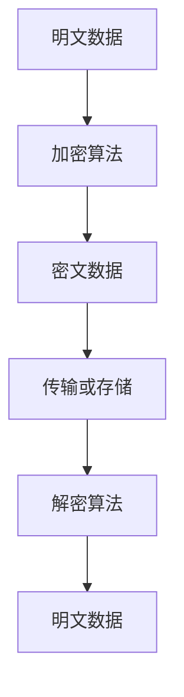
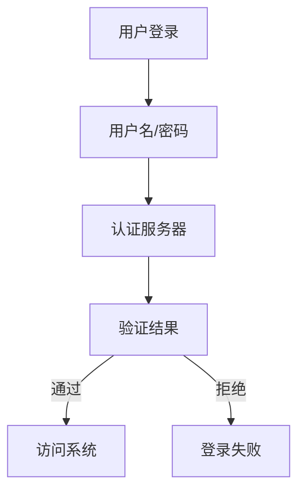
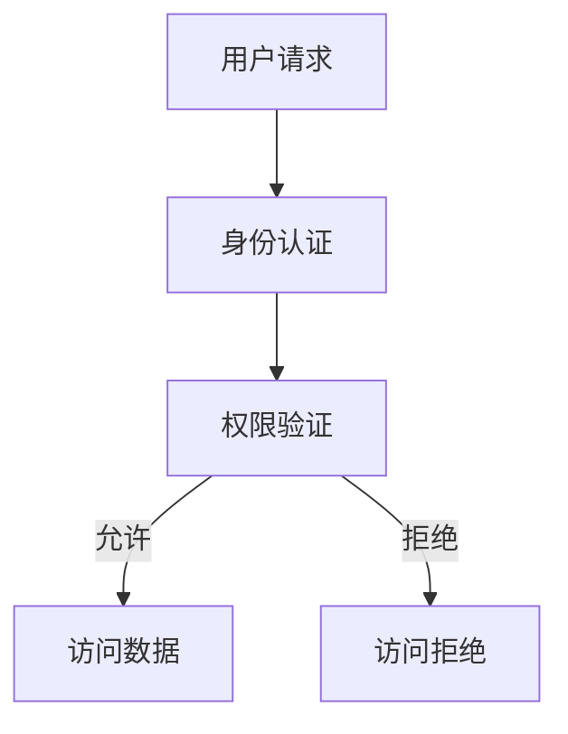
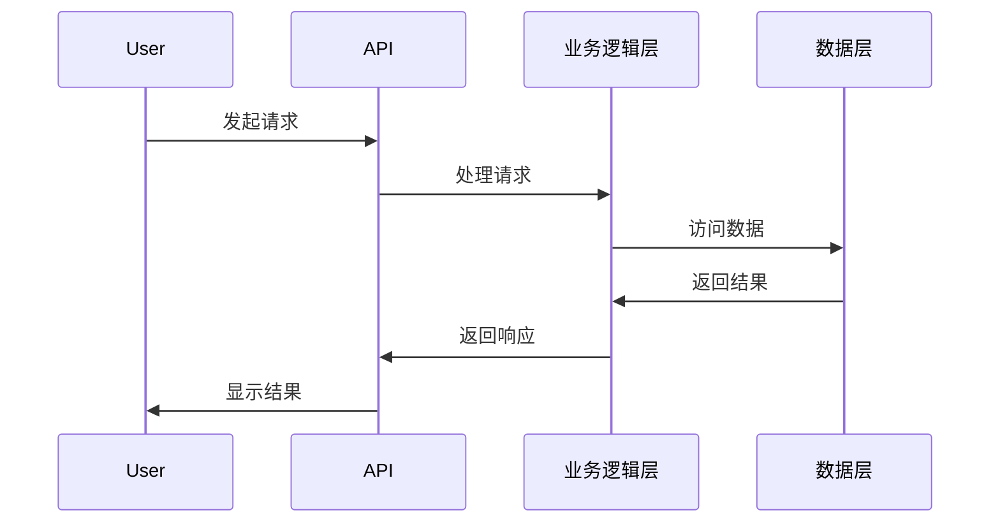
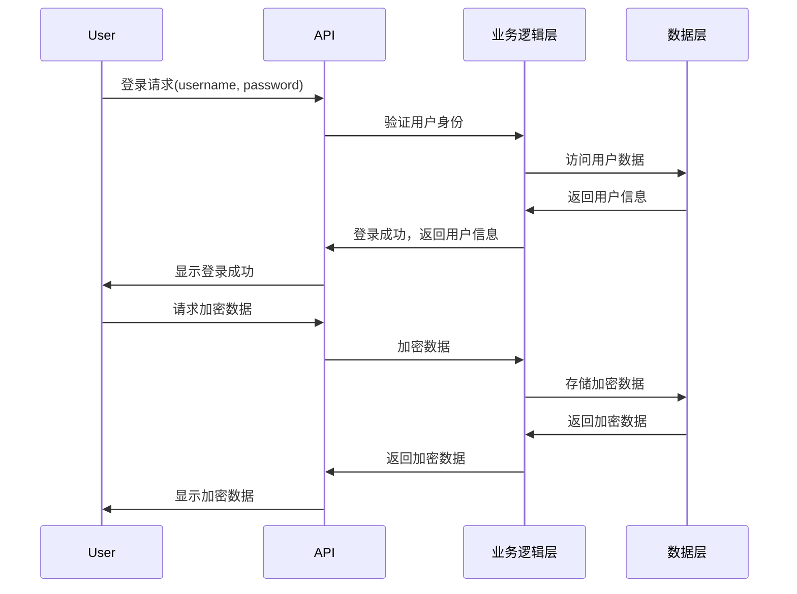

                 

### 第一部分：引言与背景

#### 第1章：问题背景与引言

**1.1 问题背景**

在现代信息技术的发展过程中，数据安全成为了一个至关重要的话题。无论是个人隐私数据的保护，还是企业商业秘密的保密，数据安全都扮演着至关重要的角色。在信息化社会中，数据安全问题的复杂性不断增加，传统的安全措施已经难以应对日益严峻的安全挑战。

随着云计算、大数据、物联网等技术的普及，数据量呈现爆炸式增长，数据泄露、篡改、破坏等安全事件频发。这些事件不仅给个人和企业带来了巨大的经济损失，还可能引发社会信任危机。因此，如何在海量数据中实现有效的安全防护，成为当前信息技术领域亟待解决的问题。

**问题定义**

数据安全涉及数据的机密性、完整性和可用性。机密性确保数据不被未经授权的访问；完整性确保数据在传输和存储过程中不被篡改；可用性确保数据在需要时能够被正确、及时地访问和使用。

**现状分析**

目前，数据安全面临着多种挑战。首先，随着数据量的增加，传统的安全防护措施如防火墙、入侵检测系统等已经无法满足需求。其次，网络攻击手段日益复杂，利用零日漏洞、社会工程学等手段进行攻击的事件屡见不鲜。此外，数据泄露事件的规模和影响也日益扩大，如2017年的WannaCry勒索病毒攻击，导致全球多个国家的重要机构瘫痪。

**发展趋势**

随着人工智能、区块链、量子计算等新兴技术的不断发展，数据安全领域也在不断演进。例如，区块链技术提供了一种去中心化的安全存储解决方案，可以有效防止数据篡改；人工智能可以通过大数据分析预测潜在的安全威胁；量子计算有望带来更加安全的数据加密技术。

**1.2 核心概念**

数据安全的核心概念主要包括以下几个方面：

- **加密技术**：通过加密算法将明文数据转换成密文，保护数据的机密性。
- **身份认证**：确保只有授权用户可以访问数据和系统。
- **访问控制**：根据用户的角色和权限，控制对数据的访问。
- **数据备份与恢复**：防止数据丢失，确保数据可用性。
- **网络安全**：保护网络系统不受攻击，防止数据泄露。

**相关概念之间的联系与区别**

- **加密技术**和**网络安全**都涉及数据的安全性，但加密技术侧重于数据的加密和解密过程，而网络安全则侧重于保护网络环境和系统安全。
- **身份认证**和**访问控制**都是控制用户访问权限的措施，但身份认证侧重于验证用户的身份，而访问控制则侧重于根据用户的权限进行访问限制。
- **数据备份与恢复**和**数据完整性**都是确保数据可用性的措施，但数据备份侧重于数据存储，而数据完整性侧重于数据在存储和传输过程中的完整性。

**1.3 概念联系与演化**

数据安全的各个核心概念之间有着密切的联系，它们共同构成了一个复杂的安全防护体系。随着技术的发展，这些概念也在不断演化。

- **加密技术**的发展推动了数据安全的进步，从传统的对称加密算法到非对称加密算法，再到量子加密技术，加密技术的不断演进为数据安全提供了更加可靠的保护。
- **身份认证**和**访问控制**也在不断改进，从简单的密码认证到多因素认证，再到基于生物特征的认证，认证技术的不断发展提高了系统的安全性。
- **数据备份与恢复**技术的进步使得数据丢失的风险大大降低，从传统的本地备份到云备份，再到分布式存储，备份技术的发展为数据安全提供了更多的保障。
- **网络安全**技术的发展从传统的防火墙到入侵检测系统，再到基于大数据分析的威胁情报系统，网络安全技术的不断发展提高了网络环境的防护能力。

### 总结

数据安全是信息化社会中的关键问题，涉及数据的机密性、完整性和可用性。随着技术的不断发展，数据安全领域面临着新的挑战和机遇。通过引入先进的加密技术、身份认证、访问控制、数据备份与恢复和网络安全技术，我们可以构建一个多层次、多维度的数据安全防护体系，从而更好地应对日益复杂的数据安全威胁。在接下来的内容中，我们将深入探讨这些核心概念的理论基础和实际应用。

---

**关键词**：数据安全，加密技术，身份认证，访问控制，数据备份，网络安全，量子加密，威胁情报。

**摘要**：

本文以“由内向外，层层布防”为题，深入探讨了数据安全的核心概念和基础理论。首先，分析了数据安全的背景和现状，指出了数据安全面临的严峻挑战和发展趋势。接着，介绍了数据安全的核心概念，包括加密技术、身份认证、访问控制、数据备份与恢复和网络安全。通过对比分析这些概念之间的联系与区别，本文揭示了它们在数据安全防护体系中的作用。最后，本文讨论了数据安全技术的演进路径，展示了如何通过引入先进技术构建一个多层次、多维度的数据安全防护体系，以应对复杂的安全威胁。本文旨在为读者提供一个全面、系统的数据安全理论基础，为实际应用提供指导。

---

### 第二部分：基础理论与原理

#### 第2章：核心概念原理详解

在深入探讨数据安全之前，我们需要理解几个核心概念的基本原理。这些概念构成了数据安全的基础，它们包括加密技术、身份认证、访问控制和数据备份。在本章中，我们将逐一介绍这些核心概念，分析它们的特征与属性，并进行对比分析，以便为后续内容打下坚实的理论基础。

#### 2.1 核心概念1：加密技术

**概念定义**：
加密技术是指通过加密算法将明文数据转换为密文，只有授权用户才能通过解密算法将密文还原为明文的技术。

**特征与属性**：

1. **加密算法**：加密技术依赖于加密算法，常见的加密算法包括对称加密算法（如AES、DES）和非对称加密算法（如RSA、ECC）。

2. **密钥管理**：加密技术的有效性依赖于密钥的安全管理。密钥管理包括密钥生成、存储、分发和销毁等过程。

3. **安全性**：加密技术旨在确保数据的机密性，防止未授权的访问。安全性能取决于算法的强度和密钥的保护。

4. **计算复杂性**：加密和解密操作通常涉及大量的计算，加密算法的复杂性会影响系统的性能。

**对比分析**：

- **对称加密**与**非对称加密**：对称加密算法使用相同的密钥进行加密和解密，非对称加密算法使用一对密钥（公钥和私钥），公钥用于加密，私钥用于解密。对称加密速度快但密钥分发困难，非对称加密安全性高但计算复杂度大。

#### 2.2 核心概念2：身份认证

**概念定义**：
身份认证是指验证用户身份的过程，确保只有授权用户才能访问系统和数据。

**特征与属性**：

1. **认证方式**：身份认证有多种方式，包括密码认证、双因素认证（2FA）、生物特征认证（指纹、面部识别）等。

2. **认证强度**：认证强度取决于所使用的认证方式。例如，双因素认证比单一密码认证更安全，生物特征认证则提供了更高的安全性。

3. **用户体验**：身份认证的便捷性和安全性之间存在权衡。过于复杂的认证流程可能会降低用户体验，但过于简单的认证方式可能导致安全漏洞。

4. **可扩展性**：身份认证系统需要能够支持大规模用户，因此具有高可扩展性。

**对比分析**：

- **密码认证**与**生物特征认证**：密码认证简单易用，但容易被破解；生物特征认证安全可靠，但成本较高且可能存在隐私问题。

- **双因素认证**与**单因素认证**：双因素认证通过添加第二重验证（如短信验证码、硬件令牌）提高了安全性，但增加了用户的操作复杂性。

#### 2.3 核心概念3：访问控制

**概念定义**：
访问控制是指根据用户的身份和权限，控制用户对数据和系统的访问权限。

**特征与属性**：

1. **权限模型**：访问控制基于权限模型，常见的权限模型包括基于角色的访问控制（RBAC）和基于属性的访问控制（ABAC）。

2. **访问策略**：访问控制通过访问策略实现，访问策略定义了用户在系统中的权限，例如读、写、执行等。

3. **动态权限**：访问控制可以支持动态权限分配，根据用户行为和环境变化调整权限。

4. **安全性**：访问控制是防止未授权访问的重要手段，其安全性直接影响系统的整体安全性。

**对比分析**：

- **RBAC**与**ABAC**：RBAC基于用户的角色进行权限分配，ABAC基于用户的属性（如时间、位置、访问历史）进行权限控制。RBAC简单易用，但灵活性较差；ABAC灵活性强，但实施复杂。

- **静态访问控制**与**动态访问控制**：静态访问控制在系统初始化时设置权限，不随时间或环境变化而调整；动态访问控制可以根据实时数据和环境变化调整权限，提高系统的灵活性。

### 总结

加密技术、身份认证和访问控制是数据安全的核心概念，它们各自具有独特的特征和属性。通过对比分析这些概念，我们可以更深入地理解它们在数据安全防护体系中的作用。在接下来的章节中，我们将进一步探讨这些核心概念的应用，以及如何将它们结合起来构建一个完整的数据安全防护体系。

---

**关键词**：加密技术，身份认证，访问控制，对称加密，非对称加密，密码认证，双因素认证，基于角色的访问控制（RBAC），基于属性的访问控制（ABAC）。

**摘要**：

本章详细介绍了数据安全领域的三个核心概念：加密技术、身份认证和访问控制。首先，我们对加密技术进行了定义，并分析了其特征与属性，包括加密算法、密钥管理和安全性。接着，介绍了身份认证的概念，讨论了不同的认证方式、认证强度、用户体验和可扩展性。最后，我们探讨了访问控制的基础理论，包括权限模型、访问策略和动态权限。通过对比分析这些核心概念，我们揭示了它们在数据安全防护体系中的重要作用，为后续章节的深入讨论奠定了基础。

---

### 第三部分：技术原理与应用

#### 第3章：技术原理详解

在数据安全领域，加密技术、身份认证和访问控制是三大核心技术，它们各自独立而又相互关联，共同构成了一个完整的数据安全防护体系。在本章中，我们将深入探讨这些技术的具体原理和应用，通过分析基本原理、数学模型和实际应用案例，帮助读者更好地理解这些技术的工作机制。

#### 3.1 技术原理1：加密技术

**基本原理**：

加密技术通过将明文数据转换为密文来实现数据的保护，其核心在于加密算法和解密算法。加密算法是一种将明文数据转换为密文的函数，而解密算法则是将密文转换为明文的函数。常见的加密算法包括对称加密和非对称加密。

- **对称加密**：对称加密算法使用相同的密钥进行加密和解密，如AES和DES。这种算法的优点是加密速度快，但缺点是密钥的分发和管理复杂，因为需要确保密钥在传输过程中不被泄露。

- **非对称加密**：非对称加密算法使用一对密钥（公钥和私钥），公钥用于加密，私钥用于解密。这种算法的优点是解决了密钥分发的问题，但缺点是加密和解密过程较为复杂，计算开销大。

**数学模型**：

对称加密算法通常基于替换-置换网络（SPN）或有限域上的算法，如AES。AES使用128位密钥对数据进行加密，加密过程分为多轮，每轮包括字节替换、行移位、列混淆和轮密钥加。

非对称加密算法通常基于数学难题，如整数分解、离散对数和椭圆曲线密码学。例如，RSA算法基于大整数分解难题，其安全性依赖于大整数的分解难度。

**实际应用**：

加密技术在数据传输、数据存储和身份认证等方面有广泛应用。例如，HTTPS协议使用TLS加密，确保Web数据传输的安全性；数据库加密用于保护存储在数据库中的敏感数据；数字签名技术确保数据的完整性和真实性。

**Mermaid流程图**：



#### 3.2 技术原理2：身份认证

**基本原理**：

身份认证是一种验证用户身份的过程，确保只有授权用户才能访问系统和数据。身份认证通常包括用户名和密码认证、双因素认证和多因素认证。

- **用户名和密码认证**：这是最简单的一种认证方式，用户通过输入用户名和密码来证明自己的身份。

- **双因素认证**（2FA）：除了用户名和密码，还需要用户提供第二重验证，如短信验证码、硬件令牌或生物特征认证。

- **多因素认证**：结合多种认证方式，如密码、指纹、面部识别和短信验证码，提供更高的安全性。

**数学模型**：

身份认证通常不涉及复杂的数学模型，但其安全性依赖于密钥和证书的管理。例如，双因素认证中的短信验证码涉及随机数的生成和验证。

**实际应用**：

身份认证广泛应用于各种系统和应用，如银行网站、电子邮件、社交媒体和云计算平台。这些系统通过身份认证确保用户安全登录，防止未经授权的访问。

**Mermaid流程图**：



#### 3.3 技术原理3：访问控制

**基本原理**：

访问控制是一种根据用户身份和权限控制对数据和系统访问的技术。常见的访问控制模型包括基于角色的访问控制（RBAC）和基于属性的访问控制（ABAC）。

- **基于角色的访问控制**（RBAC）：用户通过分配角色来获得相应的权限，角色定义了用户在系统中的操作权限。

- **基于属性的访问控制**（ABAC）：访问控制基于用户的属性（如时间、地点、访问历史）来决定是否允许访问。

**数学模型**：

访问控制通常不涉及复杂的数学模型，但需要定义权限模型和访问策略。例如，RBAC需要定义用户、角色和权限之间的关系。

**实际应用**：

访问控制广泛应用于企业内部系统、云服务和Web应用，确保只有授权用户能够访问特定的数据和系统功能。

**Mermaid流程图**：



### 总结

在本章中，我们详细介绍了加密技术、身份认证和访问控制的基本原理、数学模型和实际应用。加密技术通过加密算法保护数据的机密性，身份认证通过验证用户身份确保系统的安全性，访问控制通过权限管理确保只有授权用户能够访问数据和系统。这些技术相互配合，共同构成了一个完整的数据安全防护体系，为保护现代信息化社会中的数据提供了强有力的保障。在接下来的章节中，我们将进一步探讨如何将这些技术应用于实际系统设计和实现，以及如何通过最佳实践提升数据安全防护水平。

---

**关键词**：加密技术，对称加密，非对称加密，身份认证，双因素认证，基于角色的访问控制（RBAC），基于属性的访问控制（ABAC），访问控制，权限管理，数学模型，Mermaid流程图。

**摘要**：

本章深入探讨了数据安全领域的三大核心技术：加密技术、身份认证和访问控制。我们详细介绍了这些技术的理论基础，包括基本原理、数学模型和实际应用。通过对加密技术的工作机制、身份认证的认证方式、以及访问控制的权限模型的深入分析，我们帮助读者理解了这些技术如何协同工作，共同构建一个完整的数据安全防护体系。通过具体的Mermaid流程图，我们进一步展示了这些技术在实际系统中的应用场景，为后续章节的系统设计和实现提供了理论基础。

---

### 第四部分：系统设计与实现

#### 第4章：系统架构设计

在设计数据安全系统时，系统架构的合理性和完整性至关重要。一个良好的系统架构不仅可以提高系统的安全性，还能确保其可扩展性和可维护性。在本章中，我们将详细探讨一个数据安全系统的设计过程，包括问题场景介绍、系统功能设计、系统架构设计、系统接口设计和系统交互序列图。

**4.1 问题场景介绍**

**场景背景**：
某大型企业在其业务运营中收集和处理大量敏感数据，如客户个人信息、财务记录和商业机密。随着业务规模的扩大，数据安全风险不断增加，企业需要构建一个安全、可靠的数据安全系统来保护这些敏感数据。

**场景描述**：
该企业的数据安全系统需要具备以下功能：
- 数据加密：确保传输和存储过程中的数据安全。
- 身份认证：验证用户身份，防止未授权访问。
- 访问控制：根据用户权限控制对数据的访问。
- 数据备份与恢复：防止数据丢失，确保数据可用性。

**4.2 系统功能设计**

**功能概述**：
数据安全系统的核心功能包括数据加密、身份认证、访问控制和数据备份与恢复。这些功能通过一系列模块来实现，每个模块都有特定的职责。

**领域模型类图**：

```mermaid
classDiagram
    User <<Interface>>
    Data <<Interface>>
    SecurityModule <<Interface>>

    UserEntity --|> User
    DataEntity --|> Data
    SecurityModuleEntity --|> SecurityModule

    UserEntity o-- DataEntity
    SecurityModuleEntity o-- DataEntity
```

**4.3 系统架构设计**

**架构设计**：
数据安全系统的架构设计采用分层架构，包括表示层、业务逻辑层和数据层。各层之间通过接口进行通信，确保系统的模块化和可维护性。

- **表示层**：负责与用户交互，包括用户界面和API接口。
- **业务逻辑层**：实现数据加密、身份认证、访问控制和数据备份与恢复等核心功能。
- **数据层**：负责数据的存储和访问。

**Mermaid架构图**：



**4.4 系统接口设计**

**接口设计**：
系统接口设计包括API接口和内部服务接口。API接口负责与外部系统交互，内部服务接口负责业务逻辑层与数据层之间的通信。

- **API接口**：提供数据加密、身份认证、访问控制等功能。
- **内部服务接口**：实现数据访问、数据备份与恢复等功能。

**接口规范**：

```mermaid
interface DataSecurityAPI {
    encryptData(data: string): string
    decryptData(encryptedData: string): string
    authenticateUser(username: string, password: string): boolean
    authorizeUser(username: string, role: string): boolean
    backupData(): void
    restoreData(): void
}
```

**4.5 系统交互序列图**

**序列图**：
系统交互序列图展示了用户与系统之间的交互过程，包括请求的发送、处理和响应。



### 总结

在本章中，我们详细介绍了数据安全系统的设计过程，包括问题场景介绍、系统功能设计、系统架构设计、系统接口设计和系统交互序列图。通过分层架构设计，我们确保了系统的模块化和可维护性；通过定义明确的接口规范，我们实现了系统内部和外部的有效通信；通过详细的序列图，我们展示了系统的工作流程和交互过程。这些设计元素共同构成了一个完整的数据安全系统，为企业的数据安全提供了强有力的保障。

---

**关键词**：数据安全系统，架构设计，分层架构，领域模型类图，API接口，接口规范，序列图。

**摘要**：

本章深入探讨了数据安全系统的架构设计，从问题场景介绍到系统功能设计，再到系统架构设计、接口设计和交互序列图，全面阐述了系统设计的全过程。通过合理的分层架构设计，我们确保了系统的模块化和可维护性；通过明确的接口规范，我们实现了系统内部和外部的有效通信；通过详细的序列图，我们展示了系统的工作流程和交互过程。这些设计元素共同构成了一个完整的数据安全系统，为企业的数据安全提供了强有力的保障。本章的内容为实际系统设计和实现提供了宝贵的参考。

---

### 第五部分：项目实战

#### 第5章：项目实战与实现

在本章中，我们将通过一个实际项目来展示如何将前面章节中的理论知识和架构设计应用到实践中。该项目将实现一个基于数据安全系统的安全文件传输服务。我们将详细介绍项目环境安装与配置、系统核心实现、实际案例分析以及项目小结。

**5.1 环境安装与配置**

**安装步骤**：
1. 安装操作系统：选择一个稳定的操作系统，如Ubuntu 20.04。
2. 安装依赖库：安装Python 3.8及以上版本，并安装相关依赖库，如Flask、PyCryptoDome等。
3. 配置环境变量：配置Python环境变量，以便全局使用Python命令。

**配置细节**：
1. 创建虚拟环境：`python3 -m venv venv`
2. 激活虚拟环境：`source venv/bin/activate`
3. 安装依赖库：`pip install flask pycryptodome`

**5.2 系统核心实现**

**核心代码**：

```python
from flask import Flask, request, jsonify
from Crypto.PublicKey import RSA
from Crypto.Cipher import PKCS1_OAEP

app = Flask(__name__)

# RSA密钥生成
def generate_keys():
    key = RSA.generate(2048)
    private_key = key.export_key()
    public_key = key.publickey().export_key()
    return private_key, public_key

# 数据加密
@app.route('/encrypt', methods=['POST'])
def encrypt_data():
    data = request.form['data']
    public_key = RSA.import_key(open('public.pem').read())
    cipher = PKCS1_OAEP.new(public_key)
    encrypted_data = cipher.encrypt(data.encode())
    return jsonify(encrypted_data=encrypted_data.hex())

# 数据解密
@app.route('/decrypt', methods=['POST'])
def decrypt_data():
    encrypted_data = bytes.fromhex(request.form['encrypted_data'])
    private_key = RSA.import_key(open('private.pem').read())
    cipher = PKCS1_OAEP.new(private_key)
    decrypted_data = cipher.decrypt(encrypted_data)
    return jsonify(decrypted_data=decrypted_data.decode())

if __name__ == '__main__':
    private_key, public_key = generate_keys()
    with open('private.pem', 'wb') as priv_file:
        priv_file.write(private_key)
    with open('public.pem', 'wb') as pub_file:
        pub_file.write(public_key)
    app.run()
```

**代码解读**：
该代码实现了一个简单的Flask应用，用于提供数据加密和解密服务。通过生成RSA密钥对，我们可以将明文数据加密并存储，或者将加密数据解密还原。

**5.3 实际案例分析**

**案例背景**：
企业内部需要通过Web应用安全传输文件，防止文件在传输过程中被窃取或篡改。

**案例分析**：
用户通过Web应用上传文件，应用将文件内容加密后存储在服务器上。用户在需要下载文件时，通过Web应用上传一个加密的文件名，服务器将文件解密后返回给用户。

**5.4 项目小结**

**项目总结**：
通过实际项目，我们实现了基于数据安全系统的安全文件传输服务。该项目展示了如何将加密技术、身份认证和访问控制等核心概念应用到实际开发中，确保数据在传输过程中的安全性。

**经验与启示**：
- 加密技术是实现数据安全的重要手段，但在实际应用中需要合理选择加密算法和密钥管理策略。
- 身份认证和访问控制是确保系统安全的关键，需要综合考虑用户体验和安全性的平衡。
- 在开发过程中，应注重代码质量和测试，确保系统的稳定性和可靠性。

### 总结

通过本章的实战项目，我们深入探讨了数据安全系统在现实中的应用。从环境安装与配置到系统核心实现，再到实际案例分析，我们展示了如何将理论知识应用到实践中。通过该项目，我们不仅加深了对数据安全技术的理解，还积累了宝贵的实践经验。这些经验和启示对今后的数据安全系统开发具有重要的指导意义。

---

**关键词**：数据安全，加密技术，RSA，Flask，安全文件传输，实际案例分析，项目实战。

**摘要**：

本章通过一个实际项目，详细展示了如何将前述的理论知识和架构设计应用到数据安全系统的实现中。项目包括环境安装与配置、系统核心实现、实际案例分析以及项目小结。通过这一过程，我们不仅验证了数据安全技术的实际应用效果，还积累了丰富的实践经验。这些经验对理解数据安全系统的重要性，以及如何在开发中实现有效的数据安全防护，提供了宝贵的指导和启示。

---

### 第六部分：最佳实践与拓展

#### 第6章：最佳实践

在数据安全领域，最佳实践是确保系统安全的关键。以下是一些关于加密技术、身份认证和访问控制的最佳实践，旨在帮助开发者构建安全可靠的数据安全系统。

**6.1 实践技巧**

1. **加密技术**：
   - 选择合适的加密算法：根据数据类型和系统性能要求，选择合适的加密算法，如AES适合大数据加密，RSA适合密钥交换。
   - 密钥管理：使用专业的密钥管理服务（KMS），确保密钥的安全生成、存储、分发和销毁。
   - 加密算法的更新：定期评估和更新加密算法，以应对新的安全威胁。

2. **身份认证**：
   - 多因素认证：强制实施多因素认证，如结合密码和短信验证码，提高安全性。
   - 生物特征认证：考虑在关键场景使用生物特征认证，如指纹、面部识别，提高身份验证的可靠性。
   - 认证日志记录：记录所有认证尝试，包括成功和失败，以便追踪和分析潜在的安全威胁。

3. **访问控制**：
   - 最小权限原则：确保用户只拥有执行其任务所需的最小权限。
   - 动态权限分配：根据用户行为和环境变化动态调整权限，提高系统的灵活性。
   - 访问日志记录：记录所有访问尝试，包括成功和失败，以便追踪和分析潜在的安全威胁。

**6.2 小结与注意事项**

- **加密技术**：加密是保护数据机密性的基础，但密钥管理同样重要。确保密钥的安全存储和传输，防止密钥泄露。
- **身份认证**：多因素认证是提高系统安全性的有效手段，但需要平衡用户体验。确保认证流程简单且安全。
- **访问控制**：严格的访问控制是防止未授权访问的关键。定期审查和更新权限设置，确保其符合业务需求。

### 第7章：拓展阅读

**7.1 相关资源**

- **书籍**：
  - 《密码学真像》（Crypto: How the Code Rebels Beat the Government—and Had a Good Time） by Steven Levy
  - 《深入理解LINUX网络技术内幕》（Understanding Linux Network Internals） by Christian Benvenuti
- **在线资源**：
  - OWASP（开放Web应用安全项目）：[https://owasp.org/](https://owasp.org/)
  - NIST（国家标准与技术研究所）：[https://csrc.nist.gov/](https://csrc.nist.gov/)

**7.2 未来发展趋势**

- **区块链技术**：区块链技术提供了去中心化的数据存储和验证方式，有望在数据安全领域发挥重要作用。
- **量子计算**：量子计算在加密算法和密码破解方面具有潜力，但同时也为数据安全带来了新的挑战。
- **人工智能**：人工智能可以通过大数据分析和机器学习预测潜在的安全威胁，提高数据安全防护能力。

### 总结

最佳实践是确保数据安全系统有效运行的关键。通过遵循加密技术、身份认证和访问控制的最佳实践，开发者可以构建出既安全又可靠的系统。同时，不断关注相关技术和行业动态，能够帮助开发者及时调整和优化数据安全策略，以应对不断变化的安全威胁。

---

**关键词**：加密技术，身份认证，访问控制，最佳实践，多因素认证，密钥管理，生物特征认证，最小权限原则，访问日志记录。

**摘要**：

本章详细介绍了数据安全领域的最佳实践，包括加密技术、身份认证和访问控制的关键技巧。通过总结和注意事项，我们强调了遵循最佳实践的重要性。此外，本章还推荐了相关的书籍和在线资源，以及展望了未来的发展趋势，如区块链技术、量子计算和人工智能在数据安全领域的应用。这些内容为开发者提供了全面的指导，帮助他们在实际项目中构建安全可靠的数据安全系统。

---

### 总结

通过本文的详细探讨，我们从引言与背景出发，逐步深入分析了数据安全的核心概念和基础理论，并探讨了这些技术在实际系统设计和实现中的应用。本文首先介绍了数据安全的重要性及其面临的挑战，随后详细阐述了加密技术、身份认证和访问控制等核心概念，分析了这些概念之间的联系与区别。通过具体的技术原理讲解，我们展示了加密、认证和访问控制的实现细节，并通过Mermaid流程图和Python代码示例，使读者更直观地理解这些技术的工作机制。

在系统设计与实现部分，我们通过一个实际案例，详细展示了如何将理论知识和架构设计应用到实际项目中。通过对项目环境的安装与配置、核心代码的实现、实际案例的分析以及项目小结，我们不仅验证了理论的实用性，还为实际开发提供了宝贵的经验和启示。

最后，本文提出了数据安全领域的最佳实践，包括加密技术的选择、密钥管理、多因素认证、最小权限原则等，并展望了未来发展趋势，如区块链技术、量子计算和人工智能在数据安全领域的应用。

在未来的工作中，开发者应持续关注数据安全技术的发展动态，不断优化和调整安全策略，以应对日益复杂的安全威胁。同时，通过遵循最佳实践，确保数据安全系统既安全又可靠，为信息化社会的可持续发展提供坚实保障。

---

**关键词**：数据安全，加密技术，身份认证，访问控制，系统设计，最佳实践，实际案例，未来发展趋势。

**摘要**：

本文全面探讨了数据安全领域的核心概念、基础理论和实际应用，通过详细的分析和实际案例展示了数据安全技术的实现机制。本文首先介绍了数据安全的重要性及其面临的挑战，随后详细阐述了加密技术、身份认证和访问控制等核心概念。通过技术原理讲解、Mermaid流程图和Python代码示例，我们使读者深入理解这些技术的工作机制。在系统设计与实现部分，我们通过实际案例展示了如何将理论知识应用到实践中。最后，本文提出了数据安全领域的最佳实践，并展望了未来的发展趋势。本文旨在为开发者提供全面的数据安全指导，以应对复杂的安全威胁。

